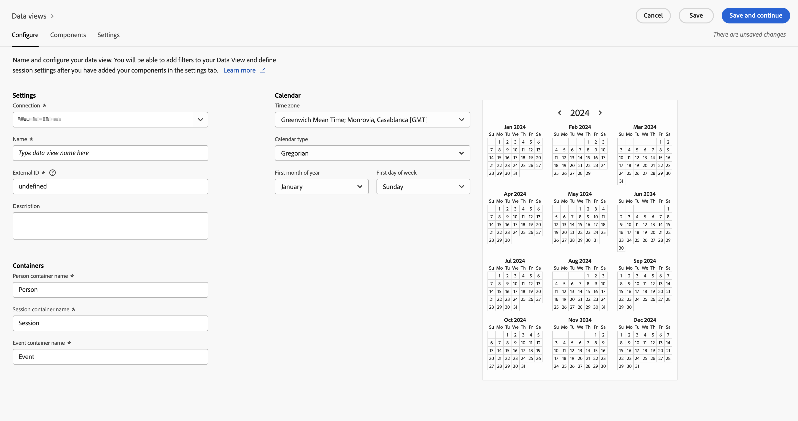
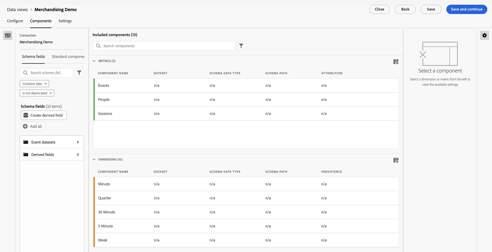

# Erstellen einer Datenansicht in Customer Journey Analytics {#upgrade-create-dataview}

<!-- markdownlint-disable MD034 -->

>[!CONTEXTUALHELP]
>id="cja-upgrade-dataview"
>title="Erstellen einer Datenansicht in Customer Journey Analytics"
>abstract="Eine Datenansicht ist ein für Customer Journey Analytics spezifischer Container, mit dem Sie bestimmen können, wie die aus einer Verbindung stammenden Daten interpretiert werden sollen.  Während die anfängliche Erstellung der Datenansicht nur einige Minuten in Anspruch nimmt, kann es mehrere Tage dauern, jede Dimension und Metrik mit den gewünschten Komponenteneinstellungen zu konfigurieren. Diese Einstellungen werden rückwirkend angepasst, sodass Ihre Organisation sie im Laufe der Zeit verfeinern kann."

<!-- markdownlint-enable MD034 -->

{{upgrade-note-step}}

<!-- Should we single source this instead of duplicate it? The following steps were copied from: /help/data-views/create-dataview.md -->

Das Erstellen einer Datenansicht beinhaltet entweder das Erstellen von Metriken und Dimensionen aus Schemaelementen oder die Verwendung von Standardkomponenten. Die meisten Schemaelemente können je nach den Anforderungen Ihres Unternehmens entweder eine Dimension oder eine Metrik sein. Nachdem Sie ein Schemaelement in eine Datenansicht gezogen haben, werden rechts Optionen angezeigt, mit denen Sie anpassen können, wie die Dimension oder Metrik in Customer Journey Analytics funktioniert.

So erstellen Sie eine Datenansicht:

1. Melden Sie sich bei [Customer Journey Analytics](https://analytics.adobe.com) an und wählen Sie **[!UICONTROL Datenansichten]**, optional unter **[!UICONTROL Daten-Management]**, im oberen Menü aus.

1. Wählen Sie **[!UICONTROL Neue Datenansicht erstellen]** aus. Sie können auch eine vorhandene Datenansicht aus der Liste der Datenansichten auswählen und diese bearbeiten.

1. Geben Sie auf der Registerkarte [!UICONTROL **Konfigurieren**] einen Namen für die Datenansicht an und konfigurieren Sie die grundlegenden Einstellungen, Komponenten und Kalenderoptionen.

   Detaillierte Informationen zu den einzelnen Feldern finden Sie im Abschnitt [Konfigurieren](/help/data-views/create-dataview.md#configure) unter [Erstellen oder Bearbeiten einer Datenansicht](/help/data-views/create-dataview.md).

   

1. Wählen Sie die Registerkarte [!UICONTROL **Komponenten**] aus.

   Auf der Registerkarte [!UICONTROL **Komponenten**] legen Sie die Komponenten einer Datenansicht fest, d. h., Sie können Metriken und Dimensionen aus Schemaelementen erstellen. Sie können auch Standardkomponenten verwenden.

   

1. Ziehen Sie auf der Registerkarte [!UICONTROL **Komponenten**] Schemaelemente aus der linken Leiste in den Abschnitt [!UICONTROL **Metriken**] oder den Abschnitt [!UICONTROL **Dimensionen**]. Die Schemaelemente, die Sie hinzufügen, werden in der Datenansicht zu Metriken oder Dimensionen.

   Detaillierte Informationen zu den Optionen, die beim Hinzufügen von Komponenten zu einer Datenansicht verfügbar sind, finden Sie im Abschnitt [Komponenten](/help/data-views/create-dataview.md#components) unter [Erstellen oder Bearbeiten einer Datenansicht](/help/data-views/create-dataview.md).

1. Wählen Sie die Registerkarte [!UICONTROL **Einstellungen**] aus. Von hier aus können Sie Segmente konfigurieren, die auf Ihre gesamte Datenansicht angewendet werden, und Sitzungs-Timeouts und -Metriken konfigurieren.

   Detaillierte Informationen zu den Optionen, die beim Konfigurieren der Einstellungen für eine Datenansicht verfügbar sind, finden Sie im Abschnitt [Einstellungen](/help/data-views/create-dataview.md#settings) unter [Erstellen oder Bearbeiten einer Datenansicht](/help/data-views/create-dataview.md).

1. Wählen Sie **[!UICONTROL Speichern]** aus, um die Konfiguration für Ihre Datenansicht zu speichern.

1. Nachdem alle gewünschten Einstellungen angegeben wurden, wählen Sie **[!UICONTROL Speichern und fertigstellen]** aus.

{{upgrade-final-step}}
