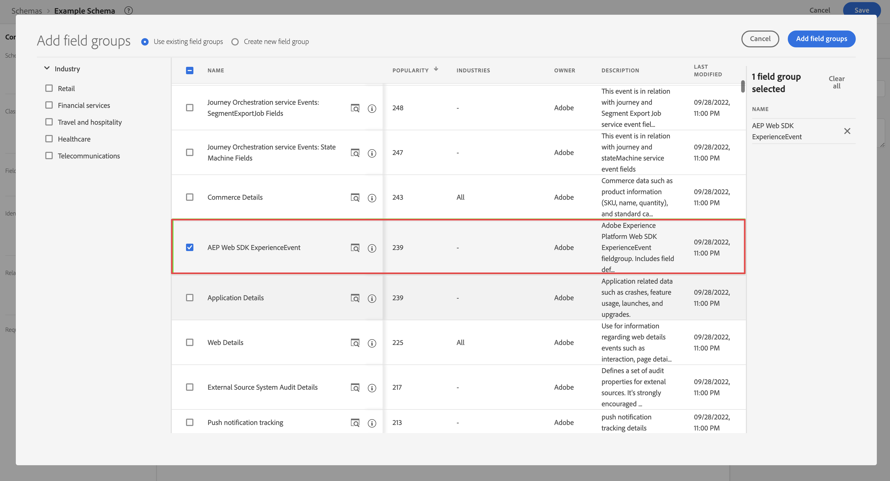

# Erstellen eines benutzerdefinierten Schemas für Customer Journey Analytics {#create-custom-schema}

<!-- markdownlint-disable MD034 -->

>[!CONTEXTUALHELP]
>id="cja-upgrade-schema-create"
>title="Gewünschtes benutzerdefiniertes Schema in Adobe Experience Platform erstellen"
>abstract="Verwenden Sie die Adobe Experience Platform-Benutzeroberfläche, um ein Schema zu erstellen, sodass Adobe das richtige Format zum Speichern Ihrer Daten kennt.  Dieser Schritt umfasst die tatsächliche Erstellung des Schemas, das von Ihrer Organisation vereinbart wurde. Die geschätzte Zeit bis zur Erstellung Ihres Schemas in der Benutzeroberfläche von Adobe Experience Platform beträgt abhängig von der Anzahl der zu erstellenden Dimensionen und Metriken ca. eine Woche."

<!-- markdownlint-enable MD034 -->

<!-- markdownlint-disable MD034 -->

>[!CONTEXTUALHELP]
>id="cja-upgrade-schema-create-default-aa"
>title="Schema mithilfe der Adobe Analytics-Feldergruppe erstellen"
>abstract="Verwenden Sie die Feldgruppe „Adobe Analytics ExperienceEvent“, um in Adobe Experience Platform ein Schema zu erstellen, das alle von Adobe Analytics verwendeten Felder enthält.  Das Erstellen eines Schemas basierend auf der Adobe Analytics ExperienceEvent-Feldgruppe ist einfach und dauert nur einige Minuten."

<!-- markdownlint-enable MD034 -->

<!-- markdownlint-disable MD034 -->

>[!CONTEXTUALHELP]
>id="cja-upgrade-schema-profile"
>title="Ihr Schema für das Profil aktivieren"
>abstract="Aktivieren Sie das Profil in Ihrem Schema zur Verwendung in der Adobe Real-Time CDP. Dieser Schritt wird angezeigt, weil Sie die Integration mit Adobe Real-Time CDP ausgewählt haben.  Da Sie bei diesem Schritt auf ein einzelnes Feld klicken müssen, dauert dieser Schritt nur einige Minuten."

<!-- markdownlint-enable MD034 -->

{{upgrade-note-step}}

>[!IMPORTANT]
>
>Bevor Sie mit der Erstellung Ihres benutzerdefinierten Schemas beginnen, wenden Sie sich an Ihr Daten-Team und andere Beteiligte in Ihrem Unternehmen, um das ideale Schema-Design Ihres Unternehmens für Customer Journey Analytics und die anderen von Ihnen verwendeten Adobe Experience Platform-Programme zu ermitteln. Weitere Informationen finden Sie unter [Planen Ihres Schemas zur Verwendung mit Customer Journey Analytics](/help/getting-started/cja-upgrade/cja-upgrade-schema-architect.md).

In den folgenden Abschnitten wird beschrieben, wie Sie ein Schema erstellen, das mit Customer Journey Analytics verwendet werden kann. Die folgenden Schemaoptionen sind verfügbar:

* **Benutzerdefiniertes XDM-Schema** (empfohlen): Bietet ein optimiertes Schema, das auf die Anforderungen Ihrer Organisation und die von Ihnen verwendeten spezifischen Platform-Anwendungen zugeschnitten ist. Alle erforderlichen zukünftigen Änderungen sind einfach.

* **Adobe Analytics-Schema, das die Adobe Analytics ExperienceEvent-Feldgruppe verwendet:** Erfordert das Hinzufügen Tausender nicht benötigter Felder. Alle erforderlichen zukünftigen Änderungen sind schwieriger.

Weitere Informationen zu diesen Schemaoptionen finden Sie unter [Auswählen Ihres Schemas für Customer Journey Analytics](/help/getting-started/cja-upgrade/cja-upgrade-schema-existing.md).

## Erstellen des Schemas

Das benutzerdefinierte Schema, das Sie für Ihre Web-SDK-Implementierung definieren, stellt das Modell der Daten dar, die Sie in Adobe Experience Platform erfassen.

So erstellen Sie ein benutzerspezifisches Schema:

<!-- Should we single source this instead of duplicate it? The following steps were copied from: /help/data-ingestion/aepwebsdk.md-->

1. Wählen Sie in Adobe Experience Platform in der linken Leiste in [!UICONTROL Daten-Management] die Option **[!UICONTROL Schemata]** aus.

1. Wählen Sie **[!UICONTROL Schema erstellen]** aus.

1. Im Schritt **[!UICONTROL Klasse auswählen]** des Assistenten „Schema erstellen“:

   1. Wählen Sie **[!UICONTROL Erlebnisereignis]** aus.

      

      >[!INFO]
      >
      >    Ein Erlebnisereignis-Schema wird zum Modellieren des _Verhaltens_ eines Profils verwendet (z. B. Szenenname, Schaltfläche zum Hinzufügen von Artikeln zum Warenkorb). Das Schema „Individuelles Profil“ wird verwendet, um die _Attribute_ eines Profils zu modellieren (z. B. Name, E-Mail, Geschlecht).

   1. Klicken Sie auf **[!UICONTROL Weiter]**.

1. Im [!UICONTROL Schritt „Name und Überprüfung“] des Assistenten [!UICONTROL Schema erstellen]:

   1. Geben Sie einen **[!UICONTROL Schema-Anzeigenamen]** für Ihr Schema und (optional) eine **[!UICONTROL Beschreibung]** ein.

      

   1. Wählen Sie **[!UICONTROL Beenden]** aus.

1. Fügen Sie alle Feldgruppen hinzu, die Felder enthalten, die Sie in Ihr Schema aufnehmen möchten.

   Feldergruppen sind wiederverwendbare Sammlungen von Objekten und Attributen, mit denen Sie Ihr Schema einfach erweitern können.

   1. Wählen Sie im Abschnitt **[!UICONTROL Feldgruppen]** die Option **[!UICONTROL + Hinzufügen]** aus.

      

   1. Wählen Sie im Dialog [!UICONTROL Feldergruppen hinzufügen] die Feldergruppe **[!UICONTROL AEP Web SDK ExperienceEvent]** aus der Liste aus.

      

      Sie können die Vorschau-Schaltfläche auswählen, um eine Vorschau der Felder anzuzeigen, die zu dieser Feldergruppe gehören, z. B. `web > webPageDetails > name`.

      

      Wählen Sie **[!UICONTROL Zurück]** aus, um die Vorschau zu schließen.

   1. (Optional) Wählen Sie alle zusätzlichen Feldgruppen aus, die Sie einbeziehen möchten.

      Wenn Sie sich dafür entschieden haben, das standardmäßige Adobe Analytics-Schema zu verwenden, anstatt ein benutzerdefiniertes XDM-Schema zu erstellen, können Sie jetzt die Adobe Analytics ExperienceEvent-Feldgruppe hinzufügen. Adobe empfiehlt jedoch, ein benutzerdefiniertes XDM-Schema zu erstellen, anstatt diese Feldgruppe hinzuzufügen.

      Weitere Informationen zu diesen Schemaoptionen finden Sie unter [Auswählen Ihres Schemas für Customer Journey Analytics](/help/getting-started/cja-upgrade/cja-upgrade-schema-existing.md).

   1. Wählen Sie **[!UICONTROL Feldergruppen hinzufügen]** aus.

1. (Optional) Wenn Sie benutzerdefinierte Felder in Ihr Schema aufnehmen möchten, erstellen Sie eine benutzerdefinierte Feldgruppe und fügen Sie die benutzerdefinierten Felder zur Feldgruppe hinzu.

   1. Wählen Sie im Abschnitt **[!UICONTROL Feldgruppen]** die Option **[!UICONTROL + Hinzufügen]** aus.

      

   1. Wählen Sie im Dialogfeld [!UICONTROL Feldgruppen hinzufügen] die Option **[!UICONTROL Neue Feldgruppe erstellen]** aus.

   1. Geben Sie einen Anzeigenamen und eine optionale Beschreibung ein und wählen Sie dann **[!UICONTROL Feldgruppen hinzufügen]** aus.

1. Wählen Sie **[!UICONTROL +]** neben Ihrem Schemanamen im Bedienfeld [!UICONTROL Struktur] aus.

   

1. Geben Sie im Bedienfeld [!UICONTROL Feldeigenschaften] als Namen `Identification` und als [!UICONTROL Anzeigename]**[!UICONTROL Identifikation]** ein, wählen Sie als [!UICONTROL Typ] **[!UICONTROL Objekt]** und als [!UICONTROL Feldergruppe] **[!UICONTROL ExperienceEvent Core v2.1]** aus.

   >[!NOTE]
   >
   >Wenn diese Feldgruppe nicht verfügbar ist, suchen Sie nach einer anderen Feldgruppe mit Identitätsfeldern. Oder [erstellen Sie eine neue Feldgruppe](https://experienceleague.adobe.com/de/docs/experience-platform/xdm/ui/resources/field-groups) und [fügen Sie neue Identitätsfelder](https://experienceleague.adobe.com/de/docs/experience-platform/xdm/ui/fields/identity#define-a-identity-field) (z. B. `ecid`, `crmId` und andere benötigte Felder) zur Feldgruppe hinzu und wählen Sie diese neue Feldgruppe aus.

   

   Das Identifizierungsobjekt fügt Ihrem Schema Identifizierungsfunktionen hinzu. In Ihrem Fall möchten Sie Profile, die Ihre Website besuchen, mithilfe der Experience Cloud-ID und der E-Mail-Adresse identifizieren. Daneben stehen auch noch viele weitere Attribute zum Tracken der Personenidentifizierung zur Verfügung (z. B. Kunden-ID, Treueprogramm-ID).

   Wählen Sie **[!UICONTROL Anwenden]** aus, um dieses Objekt zu Ihrem Schema hinzuzufügen.

1. Wählen Sie im soeben hinzugefügten Identifizierungsobjekt das Feld **[!UICONTROL ECID]** aus und danach im rechten Bedienfeld **[!UICONTROL Identität]** und **[!UICONTROL Primäre Identität]** sowie die Option **[!UICONTROL ECID]** in der Liste [!UICONTROL Identity-Namespace].

   

   Sie spezifizieren die Experience Cloud-Identität als primäre Identität, die Adobe Experience Platform Identity Service verwenden kann, um das Verhalten von Profilen, die dieselbe ECID haben, zu kombinieren (Stitching).

   Wählen Sie **[!UICONTROL Anwenden]** aus. Daraufhin erscheint ein Fingerabdruck-Symbol im ECID-Attribut.

1. Wählen Sie das Feld **[!UICONTROL E-Mail]** im soeben hinzugefügten Identifizierungsobjekt aus und danach **[!UICONTROL Identität]** und **[!UICONTROL E-Mail]** in der Liste [!UICONTROL Identity-Namespace] im Bedienfeld [!UICONTROL Feldeigenschaften].

   

   Sie spezifizieren die E-Mail-Adresse als weitere Identität, die Adobe Experience Platform Identity Service verwenden kann, um das Verhalten von Profilen zu kombinieren (Stitching).

   Wählen Sie **[!UICONTROL Anwenden]** aus. Daraufhin erscheint ein Fingerabdruck-Symbol im E-Mail-Attribut.

   Wählen Sie **[!UICONTROL Speichern]** aus.

1. (Optional) Wenn Sie Customer Journey Analytics mit RTCDP integrieren möchten, wählen Sie das Stammelement Ihres Schemas aus, das den Namen des Schemas anzeigt, und wählen Sie dann den Umschalter **[!UICONTROL Profil]** aus.

   Sie werden aufgefordert, das Schema für das Profil zu aktivieren. Nach der Aktivierung werden Daten, die auf der Basis dieses Schemas in Datensätze aufgenommen werden, zum Echtzeit-Kundenprofil hinzugefügt.

   Weitere Informationen finden Sie im Abschnitt [Aktivieren des Schemas zur Verwendung im Echtzeit-Kundenprofil](https://experienceleague.adobe.com/de/docs/experience-platform/xdm/tutorials/create-schema-ui#profile).

   >[!IMPORTANT]
   >
   >Nachdem Sie ein Schema für das Profil aktiviert haben, kann es nicht mehr für das Profil deaktiviert werden.

   

1. Wählen Sie **[!UICONTROL Speichern]** aus, um Ihr Schema zu speichern.

   Sie haben ein Minimalschema erstellt, das die Daten modelliert, die Sie auf Ihrer Website erfassen können. Mithilfe des Schemas können Profile anhand der Experience Cloud-Identität und -E-Mail-Adresse identifiziert werden. Durch die Aktivierung des Schemas für das Profil können die auf Ihrer Website erfassten Daten zum Echtzeit-Kundenprofil hinzugefügt werden.

   Neben den Verhaltensdaten können Sie auch Profilattributdaten auf Ihrer Website erfassen (z. B. Details zu Profilen, die einen Newsletter abonnieren).

   Um diese Profildaten zu erfassen, gehen Sie folgendermaßen vor:

   * Erstellen Sie ein Schema basierend auf der Klasse „XDM Individual Profile“.

   * Fügen Sie die Feldergruppe „Profile Core v2“ zum Schema hinzu.

   * Fügen Sie ein Identifizierungsobjekt hinzu, das auf der Feldergruppe „Profile Core v2“ basiert.

   * Definieren Sie die Experience Cloud-ID als primäre Kennung und die E-Mail als Kennung.

   * Aktivieren Sie dieses Schema für das Profil

   Weitere Informationen zum Hinzufügen und Entfernen von Feldergruppen und einzelnen Feldern zu einem Schema finden Sie unter [Erstellen und Bearbeiten von Schemata über die Benutzeroberfläche](https://experienceleague.adobe.com/docs/experience-platform/xdm/ui/resources/schemas.html?lang=de).

{{upgrade-final-step}}
