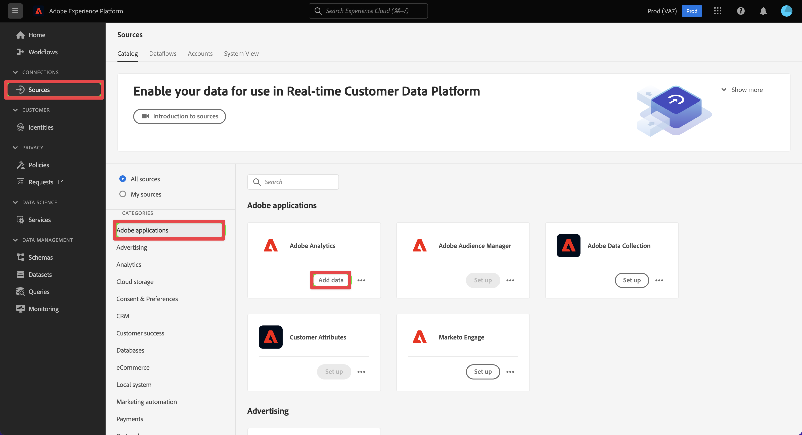

# Erstellen der Analytics-Quell-Connector- und Zuordnungsfelder {#create-source-connector}

<!-- markdownlint-disable MD034 -->

>[!CONTEXTUALHELP]
>id="cja-upgrade-source-connector-create"
>title="Erstellen des Analytics-Quell-Connectors"
>abstract="Verwenden Sie den Analytics-Quell-Connector, um Report Suite-Daten für Customer Journey Analytics aufzunehmen.  Die Erstellung des Analytics-Quell-Connectors dauert mit den Standardeinstellungen nur wenige Minuten."

<!-- markdownlint-enable MD034 -->

<!-- markdownlint-disable MD034 -->

>[!CONTEXTUALHELP]
>id="cja-upgrade-source-connector-map-fields"
>title="Erstellen der Analytics-Quell-Connectors und Zuordnen von Schemafeldern"
>abstract="Der Quell-Connector muss wissen, wie Adobe Analytics-Felder dem Schema Ihrer Organisation zugeordnet werden sollen. Verwenden Sie diese Schnittstelle, um den Quell-Connector mit dieser Zuordnung bereitzustellen. Dieser Schritt gehört zum Hinzufügen historischer Daten zu Customer Journey Analytics.  Wie lange dieser Schritt dauert, hängt stark von der Anzahl der Dimensionen und Metriken ab, die Sie zuordnen müssen. Dieser Schritt ist nicht so schwer, vielmehr mühsam und repetitiv. Die Datenstrom-Zuordnung dauert voraussichtlich etwa eine Woche."

<!-- markdownlint-enable MD034 -->

{{upgrade-note-step}}

## Erfahren Sie, wie der Analytics-Quell-Connector historische Daten in Customer Journey Analytics importieren kann

Sie können den Analytics-Quell-Connector verwenden, um Daten von Adobe Analytics Report Suites in Adobe Experience Platform zu importieren. Diese Daten können dann als Verlaufsdaten in Customer Journey Analytics verwendet werden.

Bei diesem Prozess wird davon ausgegangen, dass Sie [ein benutzerdefiniertes Schema zur Verwendung mit Ihrer Customer Journey Analytics Web SDK-Implementierung erstellen](/help/getting-started/cja-upgrade/cja-upgrade-schema-create.md), da Sie ein optimiertes Schema wünschen, das auf die Anforderungen Ihres Unternehmens und die von Ihnen verwendeten spezifischen Platform-Programme zugeschnitten ist.

Um den Analytics-Quell-Connector zu verwenden, um historische Daten in Customer Journey Analytics zu importieren, ist Folgendes erforderlich:

1. [Erstellen eines benutzerdefinierten Schemas für den Analytics-Quell-Connector](/help/getting-started/cja-upgrade/cja-upgrade-source-connector-schema.md)

1. Wenn Sie noch keinen Analytics-Quell-Connector haben, erstellen Sie den Analytics-Quell-Connector und ordnen Sie Felder wie unten beschrieben Ihrem benutzerdefinierten Web SDK-Schema zu.

   Oder

   Wenn Sie bereits über einen Analytics-Quell-Connector verfügen[ ordnen Sie (Felder aus dem Quell-Connector Ihrem benutzerdefinierten Web SDK-Schema zu](/help/getting-started/cja-upgrade/cja-upgrade-from-source-connector.md).

1. [Hinzufügen des Datensatzes des Analytics-Quell-Connectors zur Verbindung](/help/getting-started/cja-upgrade/cja-upgrade-source-connector-dataset.md)

## Erstellen der Analytics-Quell-Connector- und Zuordnungsfelder

Nachdem Sie Ihr benutzerdefiniertes Schema erstellt haben, müssen Sie den Adobe Analytics-Quell-Connector erstellen, der für historische Daten verwendet werden soll. (Weitere allgemeine Richtlinien zum Erstellen eines Quell-Connectors finden Sie unter [Erstellen einer Adobe Analytics-Quellverbindung in der Benutzeroberfläche](https://experienceleague.adobe.com/docs/experience-platform/sources/ui-tutorials/create/adobe-applications/analytics.html?lang=de).)

So erstellen Sie einen Adobe Analytics-Quell-Connector zur Verwendung für Verlaufsdaten:

1. Wählen Sie in der Platform **[!UICONTROL Benutzeroberfläche im Abschnitt &quot;]**&quot; in der linken Leiste die Option **[!UICONTROL Quellen]**.

1. Wählen Sie **[!UICONTROL Adobe-Anwendungen]** aus der Liste der [!UICONTROL KATEGORIEN] aus.

1. Wählen Sie **[!UICONTROL Daten hinzufügen]** in der Kachel Adobe Analytics aus.

   

1. Wählen Sie **[!UICONTROL Report Suite]** und dann aus der Liste der Report Suites die Report Suite aus, die die historischen Daten enthält, die Sie in Customer Journey Analytics verwenden möchten.

   

1. Wählen **[!UICONTROL Weiter]** in der oberen rechten Ecke des Bildschirms aus.

1. Wählen Sie **[!UICONTROL Benutzerdefiniertes Schema]** und dann das Schema aus, das Sie in erstellt haben [Erstellen eines benutzerdefinierten Schemas, das die Adobe Analytics-Feldergruppe enthält](/help/getting-started/cja-upgrade/cja-upgrade-source-connector-schema.md). <!-- Deleted this, because I changed this from choosing the default schemawe're pointing them now at the schema they just created: "Adobe Experience Platform  automatically creates the schema and the corresponding dataset to map all standard fields from the selected Adobe Analytics report suite." -->

   <!-- add screenshot -->

1. Ordnen Sie jede Adobe Analytics-Dimension einer benutzerdefinierten Schemadimension zu.

   1. Wählen **[!UICONTROL Abschnitt Standardfelder zuordnen]** die Registerkarte **[!UICONTROL Benutzerdefiniert]** aus.

   1. Wählen Sie **[!UICONTROL Neue Zuordnung hinzufügen]** aus.

   

   1. Wählen Sie im Feld **[!UICONTROL Source]** ein Adobe Analytics-Feld aus der Feldergruppe der Adobe Analytics ExperienceEvent-Vorlage aus. Wählen Sie dann im **[!UICONTROL Zielfeld]** das benutzerdefinierte Feld im XDM-Schema aus, dem Sie es zuordnen möchten.

      Aufgrund der inhärenten Architekturunterschiede zwischen AppMeasurement und XDM verfügen nicht alle Adobe Analytics-Felder über ein entsprechendes Feld in XDM.

   1. Wiederholen Sie diesen Vorgang für jedes Feld in der Feldergruppe der Adobe Analytics ExperienceEvent-Vorlage, das Sie zum Erfassen von Daten in Adobe Analytics verwenden.

1. Wählen **[!UICONTROL Weiter]** in der oberen rechten Ecke des Bildschirms aus.

1. Benennen Sie den Datenfluss und geben Sie (optional) eine Beschreibung ein.

   

1. Wählen **[!UICONTROL Weiter]** in der oberen rechten Ecke des Bildschirms aus.

1. Überprüfen Sie die Verbindung und klicken Sie dann auf **[!UICONTROL Beenden]**.

   

   Nachdem die Verbindung erstellt wurde, wird der Datenfluss automatisch erstellt, um einen Datensatz mit den Adobe Analytics-Daten aus Ihrer Report Suite zu füllen. Der Datenfluss nimmt bis zu 13 Monate historischer Daten für Produktions-Sandboxes auf. Die Aufstockung in Nicht-Produktions-Sandboxes ist auf drei Monate beschränkt.

   Wenn Sie den Analytics-Quell-Connector verwenden, um historische Daten in Ihre Customer Journey Analytics Web SDK-Implementierung zu übertragen, müssen Sie diesen automatisch erstellten Datensatz zu der Verbindung hinzufügen, die Sie für Ihre Web SDK-Implementierung erstellt haben.

1. Fahren Sie mit den [empfohlenen Upgrade-Schritten](/help/getting-started/cja-upgrade/cja-upgrade-recommendations.md#recommended-upgrade-steps-for-most-organizations) oder den [dynamisch generierten Upgrade-Schritten](https://gigazelle.github.io/cja-ttv/) fort.
