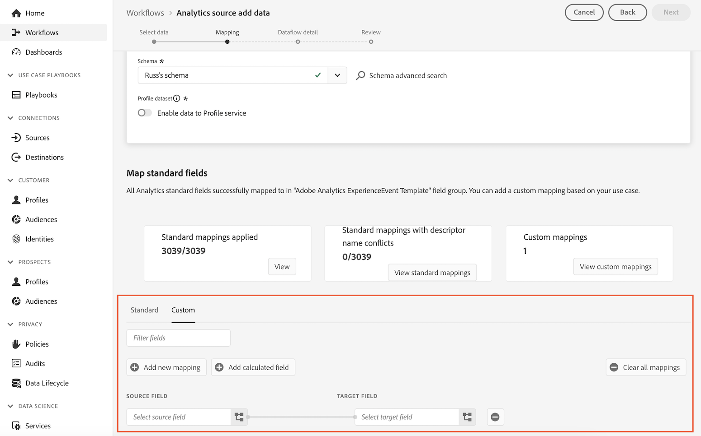
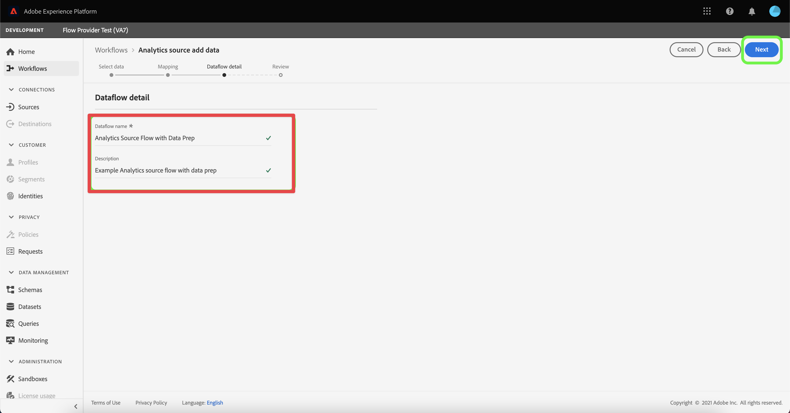

# Erstellen des Analytics-Quell-Connectors und Zuordnen von Feldern {#create-source-connector}

<!-- markdownlint-disable MD034 -->

>[!CONTEXTUALHELP]
>id="cja-upgrade-source-connector-create"
>title="Erstellen des Analytics-Quell-Connectors"
>abstract="Verwenden Sie den Analytics-Quell-Connector, um Report-Suite-Daten für die Verwendung in Customer Journey Analytics aufzunehmen.  Die Erstellung des Analytics-Quell-Connectors dauert mit den Standardeinstellungen nur wenige Minuten."

<!-- markdownlint-enable MD034 -->

<!-- markdownlint-disable MD034 -->

>[!CONTEXTUALHELP]
>id="cja-upgrade-source-connector-map-fields"
>title="Erstellen des Analytics-Quell-Connectors und Zuordnen von Schemafeldern"
>abstract="Der Quell-Connector muss wissen, wie Adobe Analytics-Felder dem Schema Ihrer Organisation zugeordnet werden. Verwenden Sie diese Oberfläche, um den Quell-Connector mit dieser Zuordnung bereitzustellen. Dieser Schritt gehört zum Hinzufügen historischer Daten zu Customer Journey Analytics.  Wie lange dieser Schritt dauert, hängt stark von der Anzahl der Dimensionen und Metriken ab, die Sie zuordnen müssen. Dieser Schritt ist weniger schwer als mühsam und eintönig. Die Datenstromzuordnung dauert voraussichtlich etwa eine Woche."

<!-- markdownlint-enable MD034 -->

{{upgrade-note-step}}

## Informationen zum Import historischer Daten in Customer Journey Analytics mit dem Analytics-Quell-Connector

Sie können den Analytics-Quell-Connector verwenden, um Adobe Analytics Report Suite-Daten in Adobe Experience Platform zu importieren. Diese Daten können dann als historische Daten in Customer Journey Analytics genutzt werden.

Bei diesem Prozess wird davon ausgegangen, dass Sie [ein benutzerdefiniertes Schema für die Customer Journey Analytics Web SDK-Implementierung erstellen](/help/getting-started/cja-upgrade/cja-upgrade-schema-create.md), da Sie sich ein optimiertes Schema wünschen, das auf die Anforderungen Ihrer Organisation und die von Ihnen verwendeten spezifischen Platform-Anwendungen zugeschnitten ist.

Um mit dem Analytics-Quell-Connector historische Daten in Customer Journey Analytics zu importieren, ist Folgendes erforderlich:

1. [Erstellen eines benutzerdefinierten Schemas für den Analytics-Quell-Connector](/help/getting-started/cja-upgrade/cja-upgrade-source-connector-schema.md)

1. Wenn Sie noch nicht über einen Analytics-Quell-Connector verfügen, erstellen Sie den Analytics-Quell-Connector und ordnen Sie Ihrem benutzerdefinierten Web SDK-Schema Felder zu, wie nachfolgend beschrieben.

   Oder

   Wenn Sie bereits über einen Analytics-Quell-Connector verfügen, [ordnen Sie Ihrem benutzerdefinierten Web SDK-Schema Felder aus dem Quell-Connector zu](/help/getting-started/cja-upgrade/cja-upgrade-from-source-connector.md).

1. [Hinzufügen des Analytics-Quell-Connector-Datensatzes zur Verbindung](/help/getting-started/cja-upgrade/cja-upgrade-source-connector-dataset.md)

## Erstellen des Analytics-Quell-Connectors und Zuordnen von Feldern

Nach Ihrem benutzerdefinierten Schema müssen Sie den Adobe Analytics-Quell-Connector erstellen, der für historische Daten verwendet werden soll. (Weitergehende allgemeine Richtlinien zum Erstellen eines Quell-Connectors finden Sie unter [Erstellen einer Adobe Analytics-Quellverbindung in der Benutzeroberfläche](https://experienceleague.adobe.com/docs/experience-platform/sources/ui-tutorials/create/adobe-applications/analytics.html?lang=de).)

So erstellen Sie einen Adobe Analytics-Quell-Connector für historische Daten:

1. Wählen Sie in der Platform-Benutzeroberfläche im Abschnitt **[!UICONTROL Verbindungen]** in der linken Leiste die Option **[!UICONTROL Quellen]** aus.

1. Wählen Sie **[!UICONTROL Adobe-Anwendungen]** aus der Liste der [!UICONTROL KATEGORIEN] aus.

1. Wählen Sie auf der Adobe Analytics-Kachel die Option **[!UICONTROL Daten hinzufügen]** aus.

   

1. Wählen Sie **[!UICONTROL Report Suite]** und dann aus der Liste der Report Suites die Report Suite aus, die die historischen Daten enthält, die in Customer Journey Analytics verwendet werden sollen.

   

1. Wählen Sie oben rechts im Bildschirm die Option **[!UICONTROL Weiter]** aus.

1. Wählen Sie **[!UICONTROL Benutzerdefiniertes Schema]** und dann das Schema aus, das Sie unter [Erstellen eines benutzerdefinierten Schemas mit der Adobe Analytics-Feldergruppe](/help/getting-started/cja-upgrade/cja-upgrade-source-connector-schema.md) erstellt haben. <!-- Deleted this, because I changed this from choosing the default schemawe're pointing them now at the schema they just created: "Adobe Experience Platform  automatically creates the schema and the corresponding dataset to map all standard fields from the selected Adobe Analytics report suite." -->

   <!-- add screenshot -->

1. Ordnen Sie jede Adobe Analytics-Dimension einer benutzerdefinierten Schemadimension zu.

   1. Wählen Sie im Abschnitt **[!UICONTROL Standardfelder zuordnen]** die Registerkarte **[!UICONTROL Benutzerdefiniert]** aus.

   1. Wählen Sie **[!UICONTROL Neue Zuordnung hinzufügen]** aus.

   

   1. Wählen Sie unter **[!UICONTROL Quellfeld]** ein Adobe Analytics-Feld aus der Feldergruppe „Adobe Analytics ExperienceEvent Template“ aus. Wählen Sie dann unter **[!UICONTROL Zielfeld]** das benutzerdefinierte Feld im XDM-Schema aus, dem es zugeordnet werden soll.

      Aufgrund der inhärenten Architekturunterschiede zwischen AppMeasurement und XDM verfügen nicht alle Adobe Analytics-Felder über ein entsprechendes Feld in XDM.

   1. Wiederholen Sie diesen Vorgang für jedes Feld in der Feldergruppe „Adobe Analytics ExperienceEvent Template“, mit dem Sie Daten in Adobe Analytics erfassen.

1. Wählen Sie oben rechts im Bildschirm die Option **[!UICONTROL Weiter]** aus.

1. Benennen Sie den Datenfluss und geben Sie (optional) eine Beschreibung ein.

   

1. Wählen Sie oben rechts im Bildschirm die Option **[!UICONTROL Weiter]** aus.

1. Überprüfen Sie die Verbindung und wählen Sie **[!UICONTROL Beenden]** aus.

   

   Nachdem die Verbindung erstellt wurde, wird der Datenfluss automatisch erstellt, um einen Datensatz mit den Adobe Analytics-Daten aus Ihrer Report Suite aufzufüllen. Der Datenfluss nimmt bis zu 13 Monate historischer Daten für Produktions-Sandboxes auf. Die Aufstockung in Nicht-Produktions-Sandboxes ist dagegen auf drei Monate beschränkt.

   Wenn Sie mit den Analytics-Quell-Connector historische Daten in Ihre Customer Journey Analytics Web SDK-Implementierung importieren, müssen Sie diesen automatisch erstellten Datensatz der für Ihre Web SDK-Implementierung erstellten Verbindung hinzufügen.

{{upgrade-final-step}}
