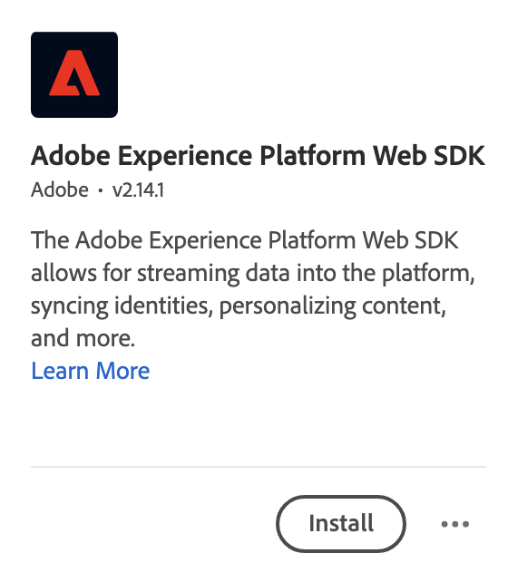

# Hinzufügen der Web SDK-Erweiterung zum Tag {#upgrade-tag-extension}

<!-- markdownlint-disable MD034 -->

>[!CONTEXTUALHELP]
>id="cja-upgrade-tag-extension"
>title="Hinzufügen der Platform Web SDK-Erweiterung zur Tag-Eigenschaft"
>abstract="Fügen Sie Ihrer Tag-Eigenschaft die Adobe Experience Platform Web SDK-Erweiterung hinzu. Das Hinzufügen der Web SDK-Erweiterung zu Ihrer Tag-Eigenschaft ist optimiert und dauert nur wenige Minuten."

<!-- markdownlint-enable MD034 -->

{{upgrade-note-step}}

Sie können die Tags-Funktion in Adobe Experience Platform verwenden, um Code zur Datenerfassung auf Ihrer Website zu implementieren. Mit dieser Tag-Management-Lösung können Sie Code zusammen mit anderen Tagging-Anforderungen bereitstellen. Tags ermöglichen die nahtlose Integration mit Adobe Experience Platform über die Adobe Experience Platform Web SDK-Erweiterung.

Im Folgenden wird beschrieben, wie Sie Ihrem Tag die Web SDK-Erweiterung hinzufügen. Ergänzende Informationen finden Sie unter [Konfigurieren der Tag-Erweiterung des Web SDK](https://experienceleague.adobe.com/de/docs/experience-platform/tags/extensions/client/web-sdk/web-sdk-extension-configuration) in der Dokumentation zu Experience Platform. Der Web SDK umfasst den Experience Platform Identity Service. Sie müssen also die Erweiterung [!UICONTROL Experience Cloud ID Service] nicht zu Ihrem Tag hinzufügen.

Nachdem Sie ein [Tag erstellt](/help/getting-started/cja-upgrade/cja-upgrade-tag-property.md) haben, müssen Sie es mit der Adobe Experience Platform Web SDK-Erweiterung konfigurieren. Dadurch wird sichergestellt, dass Sie Daten (über Ihren Datenstrom) an Adobe Experience Platform senden können.

So fügen Sie Ihrem Tag die Web SDK-Erweiterung hinzu:

1. Melden Sie sich mit Ihren Adobe ID-Anmeldeinformationen bei experiencecloud.adobe.com an.

1. Navigieren Sie in Adobe Experience Platform zu **[!UICONTROL Datenerfassung]** > **[!UICONTROL Tags]**.

1. Wählen Sie das neu erstellte Tag aus der Liste der [!UICONTROL Tag-Eigenschaften] aus, um es zu öffnen.

1. Wählen Sie **[!UICONTROL Erweiterungen]** in der linken Leiste aus.

1. Wählen Sie **[!UICONTROL Katalog]** in der oberen Leiste aus.

1. Suchen Sie nach der **[!UICONTROL Adobe Experience Platform Web SDK-Erweiterung]** oder scrollen Sie zu ihr und wählen Sie **[!UICONTROL Installieren]** aus, um sie zu installieren.

   

1. Wählen Sie Ihre Sandbox und Ihren zuvor erstellten Datenstrom für Ihre [!UICONTROL Produktionsumgebung] und (optional) Ihre [!UICONTROL Staging-Umgebung] und Ihre [!UICONTROL Entwicklungsumgebung] aus.

   

1. Wählen Sie **[!UICONTROL Speichern]** aus.

{{upgrade-final-step}}
