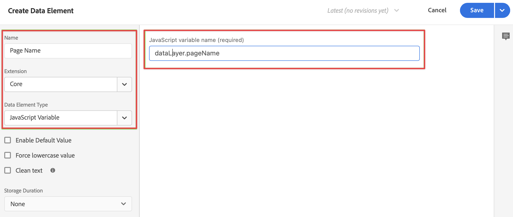

# Hinzufügen von XDM-Datenerfassungslogik zum Tag

>[!NOTE]
> 
>Befolgen Sie die Schritte auf dieser Seite erst, nachdem Sie alle vorherigen Upgrade-Schritte abgeschlossen haben. Sie können die [empfohlenen Upgrade-Schritte](/help/getting-started/cja-upgrade/cja-upgrade-recommendations.md#recommended-upgrade-steps-for-most-organizations) ausführen oder die Upgrade-Schritte ausführen, die für Ihr Unternehmen mit dem [Fragebogen für das Upgrade von Adobe Analytics auf Customer Journey Analytics dynamisch generiert wurden](https://gigazelle.github.io/cja-ttv/).
>
>Nachdem Sie die Schritte auf dieser Seite abgeschlossen haben, folgen Sie den empfohlenen Upgrade-Schritten oder den dynamisch generierten Upgrade-Schritten.

Nachdem [das Tag erstellt und die Web SDK-Erweiterung hinzugefügt ](/help/getting-started/cja-upgrade/cja-upgrade-tag-property.md), müssen Sie es mit Datenelementen und Regeln konfigurieren, je nachdem, wie Sie Ihre Site verfolgen und Daten an Adobe Experience Platform senden möchten. Nachdem Sie Datenelemente und Regeln für Ihr Tag konfiguriert haben, können Sie es erstellen und veröffentlichen.

## Konfigurieren von Datenelementen

Datenelemente sind die Bausteine Ihres Datenwörterbuchs (oder Ihrer Data Map). Verwenden Sie Datenelemente zum Erfassen, Organisieren und Bereitstellen von Daten in Marketing- und Werbe-Tools. Datenelemente richten Sie in Ihrem Tag ein, die aus Ihrer Datenschicht lesen und zur Bereitstellung von Daten in Adobe Experience Platform verwendet werden können. (Weitere Informationen zu Datenelementen finden Sie unter [Datenelemente](https://experienceleague.adobe.com/en/docs/experience-platform/tags/ui/data-elements) in der Tags-Dokumentation.)

In den folgenden Abschnitten werden empfohlene Datenelemente und andere gängige Datenelemente beschrieben, die Sie konfigurieren können.

Es gibt verschiedene Arten von Datenelementen. Zwei häufig verwendete Datenelemente, die Sie konfigurieren können, sind: ein Datenelement, das den Seitennamen erfasst, den Personen auf Ihrer Site anzeigen, und ein weiteres, das die Experience Cloud-ID jeder Person erfasst, die Ihre Site besucht.

Nachdem Sie diese beiden Datenelemente konfiguriert haben, können Sie zusätzliche Datenelemente für die spezifischen Daten konfigurieren, die Sie erfassen möchten.

Nachdem Sie alle gewünschten Datenelemente definiert haben, müssen Sie schließlich die Datenelemente dem zuvor erstellten [Schema](/help/getting-started/cja-upgrade/cja-upgrade-schema-create.md) zuweisen. Dazu definieren Sie ein XDM-Datenelement, das Ihr XDM-Schema darstellt.

<!-- Assigning data elements to an XDM object. All of the available XDM objects are based on the schema -->

### Vorgeschlagene Datenelemente erstellen

In den folgenden Abschnitten wird beschrieben, wie Sie allgemeine Datenelemente erstellen, die für die meisten Organisationen gelten.

#### Datenelement für Seitennamen

Ein gängiges Datenelement, das für die meisten Organisationen gilt, ist ein Datenelement, das den Seitennamen erfasst, den Personen anzeigen.

So erstellen Sie ein Datenelement „Seitenname“:

1. Melden Sie sich mit Ihren Adobe ID-Anmeldeinformationen bei experience.adobe.com an.

1. Navigieren Sie in Adobe Experience Platform **[!UICONTROL Datenerfassung]** > **[!UICONTROL Tags]**.

1. Wählen Sie auf **[!UICONTROL Seite]** Tag-Eigenschaften“ das neu erstellte Tag aus der Liste der Eigenschaften aus, um es zu öffnen.

1. Wählen Sie **[!UICONTROL Datenelemente]** in der linken Leiste aus.

1. Wählen Sie **[!UICONTROL Datenelement hinzufügen]** aus.

1. Geben **[!UICONTROL im Dialogfeld „Datenelement erstellen]** die folgenden Informationen an:

   * **[!UICONTROL Name]**: Der Name Ihres Datenelements. Zum Beispiel `Page Name`.

   * **[!UICONTROL Erweiterung]**: Wählen Sie **[!UICONTROL Core]** aus der Liste aus.

   * **[!UICONTROL Datenelementtyp]**: Wählen Sie **[!UICONTROL Seiteninformationen]** aus der Liste aus.

   * **[!UICONTROL Attribut]**: Wählen Sie **[!UICONTROL Titel]** aus der Liste aus.

     

     Alternativ hätten Sie zum Definieren des Datenelements auch den Wert einer Variablen Ihrer Datenschicht, z. B. `pageName`, und ein Datenelement vom Typ [!UICONTROL JavaScript-Variable] verwenden können.

     

1. Wählen Sie **[!UICONTROL Speichern]** aus.

   Sie möchten jetzt ein Datenelement einrichten, das auf die Experience Cloud-ID verweist, die automatisch vom Adobe Experience Platform Web SDK bereitgestellt und über die Experience Cloud ID Service-Erweiterung verfügbar ist.

1. Fahren Sie mit [ECID-Datenelement](#ecid-data-element) fort.

#### ECID-Datenelement

Ein gängiges Datenelement, das für die meisten Unternehmen gilt, ist ein Datenelement, das die Experience Cloud-ID jeder Person erfasst, die Ihre Site besucht.

So erstellen Sie ein ECID-Datenelement:

1. Melden Sie sich mit Ihren Adobe ID-Anmeldeinformationen bei experience.adobe.com an.

1. Navigieren Sie in Adobe Experience Platform **[!UICONTROL Datenerfassung]** > **[!UICONTROL Tags]**.

1. Wählen Sie das neu erstellte Tag aus der Liste der [!UICONTROL Tag-Eigenschaften] aus, um es zu öffnen.

1. (Bedingt) Installieren Sie die Experience Cloud-ID-Service-Erweiterung, falls sie noch nicht installiert ist:

   1. Wählen Sie **[!UICONTROL Erweiterungen]** in der linken Leiste aus.

   1. Die **[!UICONTROL Installiert]** ist standardmäßig ausgewählt. Wenn die Kachel **[!UICONTROL Experience Cloud-ID-]** Dienst“ aufgeführt ist, fahren Sie mit Schritt 5 fort.

   1. Wenn die Kachel **[!UICONTROL Experience Cloud-ID]** Service nicht aufgeführt ist, wählen Sie die Registerkarte **[!UICONTROL Katalog]** aus.

   1. Suchen Sie im Suchfeld nach **[!UICONTROL Experience Cloud ID Service]** und wählen Sie dann die Kachel aus, wenn sie angezeigt wird

   1. Wählen Sie **[!UICONTROL Installieren]** > **[!UICONTROL Speichern]** aus.

1. Wählen Sie **[!UICONTROL Datenelemente]** in der linken Leiste aus.

1. Wählen Sie **[!UICONTROL Datenelement hinzufügen]** aus.

1. Geben **[!UICONTROL im Dialogfeld „Datenelement erstellen]** die folgenden Informationen an:

   * **[!UICONTROL Name]**: Der Name Ihres Datenelements. Zum Beispiel `ECID`.

   * **[!UICONTROL Erweiterung]**: Wählen Sie **[!UICONTROL Experience Cloud-ID-]** aus der Liste aus.

   * **[!UICONTROL Datenelementtyp]**: Wählen Sie **[!UICONTROL ECID]** aus der Liste aus.

     

1. Wählen Sie **[!UICONTROL Speichern]** aus.

1. Fahren Sie mit [Erstellen zusätzlicher Datenelemente](#create-additional-data-elements) fort.

### Erstellen zusätzlicher Datenelemente

Erstellen Sie ein Datenelement für jeden Datentyp, den Sie erfassen möchten. Verwenden Sie denselben Prozess, der unter [Seitenname-Datenelement](#page-name-data-element) und [ECID-Datenelement](#ecid-data-element) beschrieben wird, um jedes zusätzliche Datenelement zu erstellen.

Die Datenelemente, die Sie erstellen, sollten ein entsprechendes Feld in Ihrem Schema haben.

Häufige Datenelemente variieren je nach Branchen- und Geschäftsanforderungen. Betrachten wir die folgenden nach Branchen geordneten gemeinsamen Datenelemente:

**Datenelemente für den Einzelhandel**

* Produkte

* Zusatz zum Warenkorb

* Checkouts

**Finanzdatenelemente**

* Transaktions-ID

* Transaktionsdatum

* Service-Typ

**Elemente von Gesundheitsdaten**

* Provider-ID

* Besucht am

* Abwandlungstyp

Nachdem Sie alle für Ihre Organisation erforderlichen Datenelemente für Ihre Implementierung erstellt haben, fahren Sie mit dem [XDM-Objektdatenelement](#xdm-object-data-element) fort.

### XDM-Objektdatenelement

Schließlich möchten Sie jetzt jedes Datenelement, das Sie erstellt haben, dem zuvor [Schema](/help/getting-started/cja-upgrade/cja-upgrade-schema-create.md) zuordnen. Definieren Sie dazu ein XDM-Objektdatenelement, das eine Darstellung Ihres XDM-Schemas bereitstellt.

Gehen Sie folgendermaßen vor, um ein XDM-Objekt-Datenelement zu definieren:

1. Melden Sie sich mit Ihren Adobe ID-Anmeldeinformationen bei experience.adobe.com an.

1. Navigieren Sie in Adobe Experience Platform **[!UICONTROL Datenerfassung]** > **[!UICONTROL Tags]**.

1. Wählen Sie das neu erstellte Tag aus der Liste der [!UICONTROL Tag-Eigenschaften] aus, um es zu öffnen.

1. Wählen Sie **[!UICONTROL Datenelemente]** in der linken Leiste aus.

1. Wählen Sie **[!UICONTROL Datenelement hinzufügen]** aus.

1. Geben **[!UICONTROL im Dialogfeld „Datenelement erstellen]** die folgenden Informationen an:

   * **[!UICONTROL Name]**: Der Name Ihres Datenelements. Zum Beispiel `XDM - Page View`.

   * **[!UICONTROL Erweiterung]**: Wählen Sie **[!UICONTROL Adobe Experience Platform Web SDK]** aus der Liste aus.

   * **[!UICONTROL Datenelementtyp]**: Wählen Sie **[!UICONTROL XDM-Objekt]** aus der Liste aus.

   * **[!UICONTROL Sandbox]**: Wählen Sie Ihre Sandbox in der Liste aus.

   * **[!UICONTROL Schema]**: Wählen Sie Ihr Schema in der Liste aus.

1. Ordnen Sie das Attribut `identification > core > ecid`, das in Ihrem Schema definiert ist, dem ECID-Datenelement zu. Wählen Sie das Zylindersymbol aus, um das ECID-Datenelement in der Liste der Datenelemente einfach auswählen zu können.

   

   

1. Ordnen Sie das Attribut `web > webPageDetails > name`, das in Ihrem Schema definiert ist, dem Datenelement „Seitenname“ zu.

   

1. Wählen Sie **[!UICONTROL Speichern]** aus.

1. Fahren Sie mit [Regeln konfigurieren](#configure-rules) fort.

## **Regeln konfigurieren**

Tags in Adobe Experience Platform folgen einem regelbasierten System. Sie suchen nach Benutzerinteraktionen und zugehörigen Daten. Wenn die in Ihren Regeln formulierten Kriterien erfüllt sind, löst die Regel die jeweils definierte Erweiterung, das Skript oder den Client-seitigen Code aus. Sie können mithilfe von Regeln Daten (wie ein XDM-Objekt) unter Verwendung der der Adobe Experience Platform Web SDK-Erweiterung an Adobe Experience Platform senden.

Gehen Sie folgendermaßen vor, um eine Regel zu definieren:

>[!NOTE]
>
>Die folgenden Schritte sind ein Beispiel für die Definition einer Regel, die XDM-Daten, die Werte aus anderen Datenelementen enthalten, an Adobe Experience Platform sendet.
>
>Sie können Regeln in Ihrem Tag auf unterschiedliche Weise verwenden, um (mithilfe Ihrer Datenelemente) Variablen zu bearbeiten.
>
>Weitere Informationen finden Sie unter [Regeln](https://experienceleague.adobe.com/docs/experience-platform/tags/ui/rules.html?lang=de).

1. Melden Sie sich mit Ihren Adobe ID-Anmeldeinformationen bei experience.adobe.com an.

1. Navigieren Sie in Adobe Experience Platform **[!UICONTROL Datenerfassung]** > **[!UICONTROL Tags]**.

1. Wählen Sie das neu erstellte Tag aus der Liste der [!UICONTROL Tag-Eigenschaften] aus, um es zu öffnen.

1. Wählen Sie **[!UICONTROL Regeln]** in der linken Leiste aus.

1. Wählen Sie **[!UICONTROL Regel hinzufügen]** aus.

1. Geben **[!UICONTROL im Dialogfeld]** Regel erstellen“ die folgenden Informationen an:

   * **[!UICONTROL Name]**: Der Name der Regel. Zum Beispiel `Page View`.

   * **[!UICONTROL Ereignisse]**: Wählen Sie **[!UICONTROL + Hinzufügen]**. Geben Sie dann im Dialogfeld **[!UICONTROL Ereigniskonfiguration]** die folgenden Informationen an. Wenn Sie fertig sind, wählen Sie **[!UICONTROL Änderungen beibehalten]** aus.

      * **[!UICONTROL Erweiterung]**: Wählen Sie **[!UICONTROL Core]** aus der Liste aus.

      * **[!UICONTROL Ereignistyp]**: Wählen Sie **[!UICONTROL Fenster geladen]** aus der Liste aus.

        

   * **[!UICONTROL Aktionen]**: Wählen Sie **[!UICONTROL + Hinzufügen]**. Geben Sie dann im Dialogfeld [!UICONTROL Aktionskonfiguration] die folgenden Informationen an. Wenn Sie fertig sind, wählen Sie **[!UICONTROL Änderungen beibehalten]** aus.

      * **[!UICONTROL Erweiterung]**: Wählen Sie **[!UICONTROL Adobe Experience Platform Web SDK]** aus der Liste aus.

      * **[!UICONTROL Aktionstyp]**: Wählen Sie **[!UICONTROL Ereignis senden]** aus der Liste aus.

      * **[!UICONTROL Typ]**: Wählen Sie **[!UICONTROL WebPageDetails-Seitenansichten]** aus der Liste aus.

      * **[!UICONTROL XDM-]**: Wählen Sie das Zylindersymbol und dann **[!UICONTROL XDM - Seitenansicht]** aus der Liste der Datenelemente aus.

        

        Ihre Regel sollte wie folgt aussehen:

        

1. Wählen Sie **[!UICONTROL Speichern]** aus.

1. Wiederholen Sie diesen Vorgang für jede Regel, die Sie Ihrer Site hinzufügen möchten.

   Weitere Informationen zu Regeln finden Sie unter [Regeln](https://experienceleague.adobe.com/en/docs/experience-platform/tags/ui/rules) in der Tags-Dokumentation.

1. Fahren Sie mit [Tag erstellen und veröffentlichen](#build-and-publish-your-tag) fort.

## Erstellen und Veröffentlichen eines Tags

Nachdem Sie Datenelemente und Regeln definiert haben, müssen Sie Ihr Tag erstellen und veröffentlichen. Wenn Sie einen Bibliotheks-Build erstellen, müssen Sie ihn einer Umgebung zuweisen. Die Erweiterungen, Regeln und Datenelemente des Builds werden dann kompiliert und in die zugewiesene Umgebung eingefügt. Jede Umgebung bietet einen eindeutigen Einbettungs-Code, mit dem Sie den zugewiesenen Build in Ihre Website integrieren können.

Adobe Experience Platform-Tags unterstützen einfache bis komplexe Veröffentlichungs-Workflows, die auch Ihre Bereitstellung von Adobe Experience Platform Web SDK unterstützen sollten. Weitere Informationen finden Sie unter [Veröffentlichung – Überblick](https://experienceleague.adobe.com/docs/experience-platform/tags/publish/overview.html?lang=de).

Gehen Sie folgendermaßen vor, um Ihr Tag zu erstellen und zu veröffentlichen:

1. Melden Sie sich mit Ihren Adobe ID-Anmeldeinformationen bei experience.adobe.com an.

1. Navigieren Sie in Adobe Experience Platform **[!UICONTROL Datenerfassung]** > **[!UICONTROL Tags]**.

1. Wählen Sie das neu erstellte Tag aus der Liste der [!UICONTROL Tag-Eigenschaften] aus, um es zu öffnen.

1. Wählen Sie **[!UICONTROL Veröffentlichungsfluss]** in der linken Leiste aus.

1. Wählen Sie **[!UICONTROL Bibliothek hinzufügen]** aus.

1. Geben **[!UICONTROL im Dialogfeld]** Bibliothek erstellen“ die folgenden Informationen an:

   * **[!UICONTROL Name]**: Der Name der Bibliothek.

   * **[!UICONTROL Umgebung]**: Wählen Sie **[!UICONTROL Entwicklung (development)]** aus der Liste aus.

1. Wählen Sie **[!UICONTROL + Alle geänderten Ressourcen hinzufügen]** aus.

   

1. Wählen Sie **[!UICONTROL Speichern und in Entwicklung erstellen]** aus.

   Ihr Tag wird gespeichert und für Ihre Entwicklungsumgebung erstellt. Ein grüner Punkt kennzeichnet eine erfolgreiche Erstellung Ihres Tags in Ihrer Entwicklungsumgebung.

1. Sie können **[!UICONTROL ...]** auswählen, um die Bibliothek neu zu erstellen oder in eine Staging- oder Produktionsumgebung zu verschieben.

   
