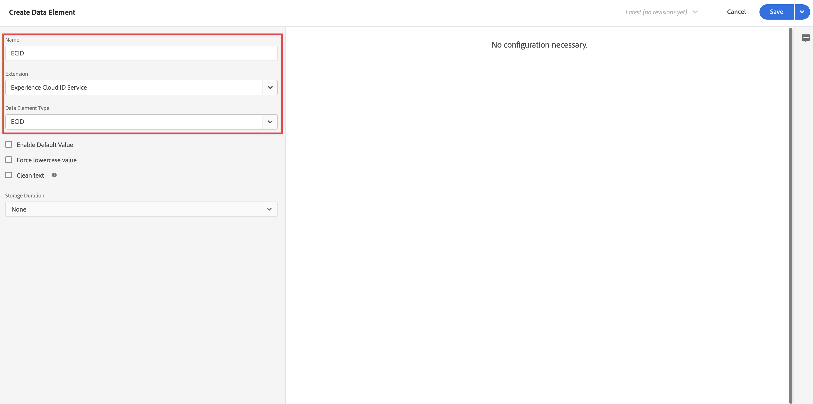

# Hinzufügen von XDM-Datenerfassungslogik zum Tag {#upgrade-tag-xdm}

<!-- markdownlint-disable MD034 -->

>[!CONTEXTUALHELP]
>id="cja-upgrade-tag-xdm"
>title="Hinzufügen von XDM-Datenerfassungslogik zum Tag"
>abstract="Wenn das Loader-Tag auf Ihrer Site installiert ist, können Sie Regeln und Datenelemente hinzufügen, um ein XDM-Objekt zu füllen, das an Adobe gesendet werden soll. Adobe empfiehlt ein Lösungs-Design-Dokument, um die Konfiguration Ihrer Tags zu verfolgen.  Dieser Schritt ist sehr aufwändig, da er die Einrichtung der gesamten Analytics-Logik für Ihre Eigenschaft umfasst. Gehen Sie davon aus, dass es mindestens einen Monat dauern wird, die richtigen Tag-Regeln festzulegen, zu testen und auf Ihrer Site bereitzustellen."

<!-- markdownlint-enable MD034 -->

{{upgrade-note-step}}

Nachdem Sie [das Tag erstellt und die Web SDK-Erweiterung hinzugefügt haben](/help/getting-started/cja-upgrade/cja-upgrade-tag-property.md), müssen Sie es mit den richtigen Datenelementen und Regeln entsprechend dem gewünschten Tracking auf Ihrer Site konfigurieren und Daten an Adobe Experience Platform senden. Wenn Sie Datenelemente und Regeln für Ihr Tag konfiguriert haben, können Sie es erstellen und veröffentlichen.

## Konfigurieren von Datenelementen

Datenelemente sind die Bausteine Ihres Datenwörterbuchs (oder Ihrer Data Map). Verwenden Sie Datenelemente zum Erfassen, Organisieren und Bereitstellen von Daten in Marketing- und Werbe-Tools. Datenelemente richten Sie in Ihren Tags ein, die aus Ihrer Datenschicht lesen und zur Bereitstellung von Daten in Adobe Experience Platform verwendet werden können. (Weitere Informationen zu Datenelementen finden Sie in der Tags-Dokumentation unter [Datenelemente](https://experienceleague.adobe.com/de/docs/experience-platform/tags/ui/data-elements).)

In den folgenden Abschnitten werden empfohlene Datenelemente und andere gängige Datenelemente beschrieben, die Sie konfigurieren können.

Es gibt verschiedene Arten von Datenelementen. Zwei häufig verwendete Datenelemente, die Sie konfigurieren können, dienen dazu, den Seitennamen, den Personen auf Ihrer Site sehen, und die Experience Cloud-ID jeder Person, die Ihre Site besucht, zu erfassen.

Nachdem Sie diese beiden Datenelemente konfiguriert haben, können Sie zusätzliche Datenelemente für die spezifischen Daten konfigurieren, die erfasst werden sollen.

Wenn Sie alle gewünschten Datenelemente definiert haben, müssen Sie schließlich die Datenelemente dem zuvor erstellten [Schema](/help/getting-started/cja-upgrade/cja-upgrade-schema-create.md) zuweisen. Definieren Sie hierzu ein weiteres Datenelement, das Ihrem XDM-Schema entspricht.

<!-- Assigning data elements to an XDM object. All of the available XDM objects are based on the schema -->

### Erstellen empfohlener Datenelemente

In den folgenden Abschnitten wird beschrieben, wie Sie gängige Datenelemente erstellen, die für die meisten Organisationen geeignet sind.

#### Datenelement „Seitenname“

Ein gängiges Datenelement, das für die meisten Organisationen verwendet werden kann, ist ein Datenelement, das den Seitennamen erfasst, den Personen sehen.

So erstellen Sie ein Datenelement „Seitenname“:

1. Melden Sie sich mit Ihren Adobe ID-Anmeldeinformationen bei experiencecloud.adobe.com an.

1. Navigieren Sie in Adobe Experience Platform zu **[!UICONTROL Datenerfassung]** > **[!UICONTROL Tags]**.

1. Wählen Sie auf der Seite **[!UICONTROL Tag-Eigenschaften]** das neu erstellte Tag aus der Liste der Eigenschaften aus, um es zu öffnen.

1. Wählen Sie **[!UICONTROL Datenelemente]** in der linken Leiste aus.

1. Wählen Sie **[!UICONTROL Datenelement hinzufügen]** aus.

1. Geben Sie im Dialogfeld **[!UICONTROL Datenelemente erstellen]** die folgenden Informationen an:

   * **[!UICONTROL Name]**: Der Name Ihres Datenelements. Zum Beispiel `Page Name`.

   * **[!UICONTROL Erweiterung]**: Wählen Sie **[!UICONTROL Core]** aus der Liste aus.

   * **[!UICONTROL Datenelementtyp]**: Wählen Sie **[!UICONTROL Seiteninformationen]** aus der Liste aus.

   * **[!UICONTROL Attribut]**: Wählen Sie **[!UICONTROL Titel]** aus der Liste aus.

     

     Alternativ hätten Sie zum Definieren des Datenelements auch den Wert einer Variablen Ihrer Datenschicht, z. B. `pageName`, und ein Datenelement vom Typ [!UICONTROL JavaScript-Variable] verwenden können.

     

1. Wählen Sie **[!UICONTROL Speichern]** aus.

   Sie möchten jetzt ein Datenelement einrichten, das auf die Experience Cloud-ID verweist, die automatisch vom Adobe Experience Platform Web SDK bereitgestellt und über die Experience Cloud ID Service-Erweiterung verfügbar ist.

1. Fahren Sie mit [Datenelement „ECID“](#ecid-data-element) fort.

#### Datenelement „ECID“

Ein gängiges Datenelement, das für die meisten Organisationen verwendet werden kann, ist ein Datenelement, das die Experience Cloud-ID jeder Person erfasst, die Ihre Site besucht.

So erstellen Sie ein Datenelement „ECID“:

1. Melden Sie sich mit Ihren Adobe ID-Anmeldeinformationen bei experiencecloud.adobe.com an.

1. Navigieren Sie in Adobe Experience Platform zu **[!UICONTROL Datenerfassung]** > **[!UICONTROL Tags]**.

1. Wählen Sie das neu erstellte Tag aus der Liste der [!UICONTROL Tag-Eigenschaften] aus, um es zu öffnen.

1. (Bedingt) Installieren Sie die Erweiterung für den Experience Cloud ID-Dienst, sofern noch nicht geschehen:

   1. Wählen Sie **[!UICONTROL Erweiterungen]** in der linken Leiste aus.

   1. Die Registerkarte **[!UICONTROL Installiert]** ist standardmäßig ausgewählt. Wenn die Kachel **[!UICONTROL Experience Cloud ID-Dienst]** aufgeführt ist, fahren Sie mit Schritt 5 fort.

   1. Wenn die Kachel **[!UICONTROL Experience Cloud ID-Dienst]** nicht aufgeführt ist, wählen Sie die Registerkarte **[!UICONTROL Katalog]** aus.

   1. Suchen Sie im Suchfeld nach **[!UICONTROL Experience Cloud ID-Dienst]** und wählen Sie dann die Kachel aus, wenn sie angezeigt wird

   1. Wählen Sie **[!UICONTROL Installieren]** > **[!UICONTROL Speichern]** aus.

1. Wählen Sie **[!UICONTROL Datenelemente]** in der linken Leiste aus.

1. Wählen Sie **[!UICONTROL Datenelement hinzufügen]** aus.

1. Geben Sie im Dialogfeld **[!UICONTROL Datenelemente erstellen]** die folgenden Informationen an:

   * **[!UICONTROL Name]**: Der Name Ihres Datenelements. Zum Beispiel `ECID`.

   * **[!UICONTROL Erweiterung]**: Wählen Sie **[!UICONTROL Experience Cloud ID-Dienst]** aus der Liste aus.

   * **[!UICONTROL Datenelementtyp]**: Wählen Sie **[!UICONTROL ECID]** aus der Liste aus.

     

1. Wählen Sie **[!UICONTROL Speichern]** aus.

1. Fahren Sie mit [Erstellen zusätzlicher Datenelemente](#create-additional-data-elements) fort.

### Erstellen zusätzlicher Datenelemente

Erstellen Sie ein Datenelement für jeden Datentyp, der erfasst werden soll. Gehen Sie so wie unter [Datenelement „Seitenname“](#page-name-data-element) und [Datenelement „ECID“](#ecid-data-element) beschrieben vor, um das jeweilige zusätzliche Datenelement zu erstellen.

Die Datenelemente, die Sie erstellen, sollten ein entsprechendes Feld in Ihrem Schema aufweisen.

Gängige Datenelemente variieren je nach Branchen- und Geschäftsanforderungen. Es gibt etwa die folgenden nach Branchen geordneten gängigen Datenelemente:

**Datenelemente für den Einzelhandel**

* Produkte

* Zusatz zum Warenkorb

* Checkouts

**Datenelementen für die Finanzbranche**

* Transaktions-ID

* Transaktionsdatum

* Service-Typ

**Datenelemente für das Gesundhietswesen**

* Anbieter-ID

* Besuchsdatum

* Behandlungstyp

Nachdem Sie alle für die Implementierung Ihrer Organisation erforderlichen Datenelemente erstellt haben, fahren Sie mit [Datenelement „XDM-Objekt“](#xdm-object-data-element) fort.

### Datenelement „XDM-Objekt“

Abschließend sollten Sie etwaige erstellte Datenelemente dem zuvor [definierten Schema](/help/getting-started/cja-upgrade/cja-upgrade-schema-create.md) zuordnen. Definieren Sie dazu ein Datenelement vom Typ „XDM-Objekt“, das Ihrem XDM-Schema entspricht.

Gehen Sie folgendermaßen vor, um ein XDM-Objekt-Datenelement zu definieren:

1. Melden Sie sich mit Ihren Adobe ID-Anmeldeinformationen bei experiencecloud.adobe.com an.

1. Navigieren Sie in Adobe Experience Platform zu **[!UICONTROL Datenerfassung]** > **[!UICONTROL Tags]**.

1. Wählen Sie das neu erstellte Tag aus der Liste der [!UICONTROL Tag-Eigenschaften] aus, um es zu öffnen.

1. Wählen Sie **[!UICONTROL Datenelemente]** in der linken Leiste aus.

1. Wählen Sie **[!UICONTROL Datenelement hinzufügen]** aus.

1. Geben Sie im Dialogfeld **[!UICONTROL Datenelemente erstellen]** die folgenden Informationen an:

   * **[!UICONTROL Name]**: Der Name Ihres Datenelements. Zum Beispiel `XDM - Page View`.

   * **[!UICONTROL Erweiterung]**: Wählen Sie **[!UICONTROL Adobe Experience Platform Web SDK]** aus der Liste aus.

   * **[!UICONTROL Datenelementtyp]**: Wählen Sie **[!UICONTROL XDM-Objekt]** aus der Liste aus.

   * **[!UICONTROL Sandbox]**: Wählen Sie Ihre Sandbox aus der Liste aus.

   * **[!UICONTROL Schema]**: Wählen Sie Ihr Schema aus der Liste aus.

1. Ordnen Sie das Attribut `identification > core > ecid`, das in Ihrem Schema definiert ist, dem ECID-Datenelement zu. Wählen Sie das Zylindersymbol aus, um das ECID-Datenelement in der Liste der Datenelemente einfach auswählen zu können.

   

   

1. Ordnen Sie das Attribut `web > webPageDetails > name`, das in Ihrem Schema definiert ist, dem Datenelement „Seitenname“ zu.

   

1. Wählen Sie **[!UICONTROL Speichern]** aus.

1. Fahren Sie mit [Konfigurieren von Regeln](#configure-rules) fort.

## **Konfigurieren von Regeln**

Tags in Adobe Experience Platform folgen einem regelbasierten System. Sie suchen nach Benutzerinteraktionen und zugehörigen Daten. Wenn die in Ihren Regeln formulierten Kriterien erfüllt sind, löst die Regel die jeweils definierte Erweiterung, das Skript oder den Client-seitigen Code aus. Sie können mithilfe von Regeln Daten (wie ein XDM-Objekt) unter Verwendung der der Adobe Experience Platform Web SDK-Erweiterung an Adobe Experience Platform senden.

Gehen Sie folgendermaßen vor, um eine Regel zu definieren:

>[!NOTE]
>
>Die folgenden Schritte sind ein Beispiel für die Definition einer Regel, mit der XDM-Daten, die Werte aus anderen Datenelementen enthalten, an Adobe Experience Platform gesendet werden.
>
>Sie können Regeln in Ihrem Tag auf unterschiedliche Weise verwenden, um (mithilfe Ihrer Datenelemente) Variablen zu bearbeiten.
>
>Weitere Informationen finden Sie unter [Regeln](https://experienceleague.adobe.com/docs/experience-platform/tags/ui/rules.html?lang=de).

1. Melden Sie sich mit Ihren Adobe ID-Anmeldeinformationen bei experiencecloud.adobe.com an.

1. Navigieren Sie in Adobe Experience Platform zu **[!UICONTROL Datenerfassung]** > **[!UICONTROL Tags]**.

1. Wählen Sie das neu erstellte Tag aus der Liste der [!UICONTROL Tag-Eigenschaften] aus, um es zu öffnen.

1. Wählen Sie **[!UICONTROL Regeln]** in der linken Leiste aus.

1. Wählen Sie **[!UICONTROL Regel hinzufügen]** aus.

1. Geben Sie im Dialogfeld **[!UICONTROL Regel erstellen]** die folgenden Informationen an:

   * **[!UICONTROL Name]**: Der Name der Regel. Zum Beispiel `Page View`.

   * **[!UICONTROL Ereignisse]**: Wählen Sie **[!UICONTROL + Hinzufügen]** aus. Geben Sie dann im Dialogfeld **[!UICONTROL Ereigniskonfiguration]** die folgenden Informationen an. Wenn Sie fertig sind, wählen Sie **[!UICONTROL Änderungen speichern]** aus.

      * **[!UICONTROL Erweiterung]**: Wählen Sie **[!UICONTROL Core]** aus der Liste aus.

      * **[!UICONTROL Ereignistyp]**: Wählen Sie **[!UICONTROL Fenster geladen]** aus der Liste aus.

        

   * **[!UICONTROL Aktionen]**: Wählen Sie **[!UICONTROL + Hinzufügen]** aus. Geben Sie dann im Dialogfeld [!UICONTROL Aktionskonfiguration] die folgenden Informationen an. Wenn Sie fertig sind, wählen Sie **[!UICONTROL Änderungen speichern]** aus.

      * **[!UICONTROL Erweiterung]**: Wählen Sie **[!UICONTROL Adobe Experience Platform Web SDK]** aus der Liste aus.

      * **[!UICONTROL Aktionstyp]**: Wählen Sie **[!UICONTROL Ereignis senden]** aus der Liste aus.

      * **[!UICONTROL Typ]**: Wählen Sie die Option für **[!UICONTROL Web-Webpagedetails-Seitenansichten]** aus der Liste aus.

      * **[!UICONTROL XDM-Daten]**: Wählen Sie das Zylindersymbol und dann **[!UICONTROL XDM – Seitenansicht]** aus der Liste der Datenelemente aus.

        

        Ihre Regel sollte wie folgt aussehen:

        

1. Wählen Sie **[!UICONTROL Speichern]** aus.

1. Wiederholen Sie diesen Vorgang für jede Regel, die Ihrer Site hinzugefügt werden soll.

   Weitere Informationen zu Regeln finden Sie in der Tags-Dokumentation unter [Regeln](https://experienceleague.adobe.com/de/docs/experience-platform/tags/ui/rules).

1. Fahren Sie mit [Erstellen und Veröffentlichen Ihres Tags](#build-and-publish-your-tag) fort.

## Erstellen und Veröffentlichen Ihres Tags

Nachdem Sie Datenelemente und Regeln definiert haben, müssen Sie Ihr Tag erstellen und veröffentlichen. Wenn Sie einen Bibliotheks-Build erstellen, müssen Sie ihn einer Umgebung zuweisen. Die Erweiterungen, Regeln und Datenelemente des Builds werden dann kompiliert und in die zugewiesene Umgebung eingefügt. Jede Umgebung bietet einen eindeutigen Einbettungs-Code, mit dem Sie den zugewiesenen Build in Ihre Website integrieren können.

Adobe Experience Platform-Tags unterstützen einfache bis komplexe Veröffentlichungs-Workflows, die auch Ihre Bereitstellung des Adobe Experience Platform Web SDK umfassen. Weitere Informationen finden Sie unter [Veröffentlichung – Überblick](https://experienceleague.adobe.com/docs/experience-platform/tags/publish/overview.html?lang=de).

Gehen Sie folgendermaßen vor, um Ihr Tag zu erstellen und zu veröffentlichen:

1. Melden Sie sich mit Ihren Adobe ID-Anmeldeinformationen bei experiencecloud.adobe.com an.

1. Navigieren Sie in Adobe Experience Platform zu **[!UICONTROL Datenerfassung]** > **[!UICONTROL Tags]**.

1. Wählen Sie das neu erstellte Tag aus der Liste der [!UICONTROL Tag-Eigenschaften] aus, um es zu öffnen.

1. Wählen Sie **[!UICONTROL Veröffentlichungsfluss]** in der linken Leiste aus.

1. Wählen Sie **[!UICONTROL Bibliothek hinzufügen]** aus.

1. Geben Sie im Dialogfeld **[!UICONTROL Bibliothek erstellen]** die folgenden Informationen an:

   * **[!UICONTROL Name]**: Der Name der Bibliothek.

   * **[!UICONTROL Umgebung]**: Wählen Sie **[!UICONTROL Entwicklung (development)]** aus der Liste aus.

1. Wählen Sie **[!UICONTROL + Alle geänderten Ressourcen hinzufügen]** aus.

   

1. Wählen Sie **[!UICONTROL Speichern und in Entwicklung erstellen]** aus.

   Ihr Tag wird gespeichert und für Ihre Entwicklungsumgebung erstellt. Ein grüner Punkt kennzeichnet eine erfolgreiche Erstellung Ihres Tags in Ihrer Entwicklungsumgebung.

1. Sie können **[!UICONTROL ...]** auswählen, um die Bibliothek neu zu erstellen oder in eine Staging- oder Produktionsumgebung zu verschieben.

   

{{upgrade-final-step}}

