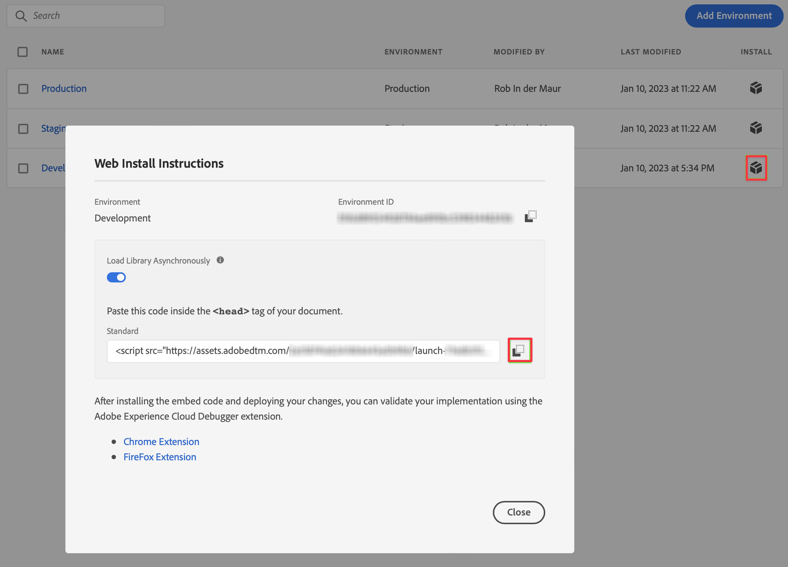

# Verwenden von Tags zur Implementierung des Web SDK für Customer Journey Analytics

>[!NOTE]
> 
>Führen Sie die Schritte auf dieser Seite erst aus, nachdem Sie alle vorherigen Aktualisierungsschritte ausgeführt haben. Sie können die [empfohlenen Aktualisierungsschritte](/help/getting-started/cja-upgrade/cja-upgrade-recommendations.md#recommended-upgrade-steps-for-most-organizations) ausführen oder die für Ihr Unternehmen dynamisch generierten Aktualisierungsschritte mit dem Fragebogen [Adobe Analytics to Customer Journey Analytics Upgrade Fragenkatalog](https://gigazelle.github.io/cja-ttv/) ausführen.
>
>Nachdem Sie die Schritte auf dieser Seite ausgeführt haben, fahren Sie mit den empfohlenen Aktualisierungsschritten oder den dynamisch generierten Aktualisierungsschritten fort.

Sie können die Funktion Tags in Adobe Experience Platform verwenden, um Code auf Ihrer Site zur Datenerfassung zu implementieren. Mit dieser Tag-Management-Lösung können Sie Code zusammen mit anderen Tagging-Anforderungen bereitstellen. Tags ermöglichen die nahtlose Integration mit Adobe Experience Platform über die Adobe Experience Platform Web SDK-Erweiterung.

## Erstellen von Tags

1. Wählen Sie in der Adobe Experience Platform-Benutzeroberfläche in der linken Leiste die Option **[!UICONTROL Tags]** in [!UICONTROL DATENERFASSUNG].

2. Wählen Sie **[!UICONTROL Neue Eigenschaft]** aus.

   Benennen Sie das Tag, wählen Sie **[!UICONTROL Web]** aus und geben Sie einen Domain-Namen ein. Wählen Sie **[!UICONTROL Speichern]** aus, um fortzufahren.

   

## Konfigurieren Ihres Tags

Nachdem Sie das Tag erstellt haben, müssen Sie es mit den richtigen Erweiterungen konfigurieren und Datenelemente und Regeln entsprechend der gewünschten Verfolgung Ihrer Site konfigurieren und Daten an Adobe Experience Platform senden.

Wählen Sie das neu erstellte Tag aus der Liste der [!UICONTROL Tag-Eigenschaften] aus, um es zu öffnen.


### **Erweiterungen**

Um sicherzustellen, dass Sie Daten an Adobe Experience Platform (über Ihren Datastream) senden können, fügen Sie Ihrem -Tag die Adobe Platform Web SDK-Erweiterung hinzu.

Gehen Sie folgendermaßen vor, um die Adobe Experience Platform Web SDK-Erweiterung zu erstellen und zu konfigurieren:

1. Wählen Sie **[!UICONTROL Erweiterungen]** in der linken Leiste aus.

1. Wählen Sie **[!UICONTROL Katalog]** in der oberen Leiste aus.

1. Suchen Sie nach der Adobe Experience Platform Web SDK-Erweiterung oder scrollen Sie zu ihr und wählen Sie **[!UICONTROL Installieren]** aus, um sie zu installieren.

   

1. Wählen Sie Ihre Sandbox und Ihren zuvor erstellten Datenstrom für Ihre [!UICONTROL Produktionsumgebung] und (optional) Ihre [!UICONTROL Staging-Umgebung] und Ihre [!UICONTROL Entwicklungsumgebung] aus.

   

   Wählen Sie **[!UICONTROL Speichern]** aus.

Weitere Informationen finden Sie unter [Konfigurieren der Adobe Experience Platform Web SDK-Erweiterung](https://experienceleague.adobe.com/docs/experience-platform/tags/extensions/client/web-sdk/web-sdk-extension-configuration.html).

Das Web SDK enthält den nativen [!UICONTROL Adobe Experience Cloud ID-Dienst], sodass Sie die ID-Diensterweiterung nicht zu Ihrem -Tag hinzufügen müssen.

### **Datenelemente**

Datenelemente sind die Bausteine Ihres Datenwörterbuchs (oder Ihrer Data Map). Verwenden Sie Datenelemente zum Erfassen, Organisieren und Bereitstellen von Daten in Marketing- und Werbe-Tools. Datenelemente richten Sie in Ihren Tags ein, die aus Ihrer Datenschicht lesen und zur Bereitstellung von Daten in Adobe Experience Platform verwendet werden können.

Es gibt verschiedene Arten von Datenelementen. Sie richten zunächst ein Datenelement ein, um den Seitennamen zu erfassen, den Personen auf Ihrer Site anzeigen.

Gehen Sie folgendermaßen vor, um ein Datenelement für den Seitennamen zu definieren:

1. Wählen Sie **[!UICONTROL Datenelemente]** in der linken Leiste aus.

2. Wählen Sie **[!UICONTROL Datenelement hinzufügen]** aus.

3. Im Dialog [!UICONTROL Datenelement erstellen]:

   - Benennen Sie Ihr Datenelement, z. B. `Page Name`.

   - Wählen Sie **[!UICONTROL Core]** in der Liste [!UICONTROL Erweiterung] aus.

   - Wählen Sie **[!UICONTROL Seiteninformationen]** in der Liste [!UICONTROL Datenelementtyp] aus.

   - Wählen Sie **[!UICONTROL Titel]** in der Liste [!UICONTROL Attribut] aus.

     

     Alternativ hätten Sie zum Definieren des Datenelements auch den Wert einer Variablen Ihrer Datenschicht, z. B. `pageName`, und ein Datenelement vom Typ [!UICONTROL JavaScript-Variable] verwenden können.

     

   - Wählen Sie **[!UICONTROL Speichern]** aus.

Sie möchten jetzt ein Datenelement einrichten, das auf die Experience Cloud-ID verweist, die automatisch vom Adobe Experience Platform Web SDK bereitgestellt und über die Experience Cloud ID Service-Erweiterung verfügbar ist.

Gehen Sie folgendermaßen vor, um ein ECID-Datenelement zu definieren:

1. Wählen Sie **[!UICONTROL Datenelemente]** in der linken Leiste aus.

2. Wählen Sie **[!UICONTROL Datenelement hinzufügen]** aus.

3. Im Dialog [!UICONTROL Datenelement erstellen]:

   - Benennen Sie Ihr Datenelement, z. B. `ECID`.

   - Wählen Sie **[!UICONTROL Experience Cloud ID Service]** in der Liste [!UICONTROL Erweiterung] aus.

   - Wählen Sie **[!UICONTROL ECID]** in der Liste [!UICONTROL Datenelementtyp].

     

   - Wählen Sie **[!UICONTROL Speichern]** aus.

Abschließend möchten Sie Ihre spezifischen Datenelemente dem zuvor definierten Schema zuordnen. Sie definieren ein weiteres Datenelement, das Ihrem XDM-Schema entspricht.

Gehen Sie folgendermaßen vor, um ein XDM-Objekt-Datenelement zu definieren:

1. Wählen Sie **[!UICONTROL Datenelemente]** in der linken Leiste aus.

2. Wählen Sie **[!UICONTROL Datenelement hinzufügen]** aus.

3. Im Dialog [!UICONTROL Datenelement erstellen]:

   - Benennen Sie Ihr Datenelement, z. B. `XDM - Page View`.

   - Wählen Sie **[!UICONTROL Adobe Experience Platform Web SDK]** in der Liste [!UICONTROL Erweiterung] aus.

   - Wählen Sie **[!UICONTROL XDM-Objekt]** in der Liste [!UICONTROL Datenelementtyp] aus.

   - Wählen Sie Ihre Sandbox in der Liste [!UICONTROL Sandbox] aus.

   - Wählen Sie Ihr Schema in der Liste [!UICONTROL Schema] aus.

   - Ordnen Sie das Attribut `identification > core > ecid`, das in Ihrem Schema definiert ist, dem ECID-Datenelement zu. Wählen Sie das Zylindersymbol aus, um das ECID-Datenelement in der Liste der Datenelemente einfach auswählen zu können.

     

     


   - Ordnen Sie das Attribut `web > webPageDetails > name`, das in Ihrem Schema definiert ist, dem Datenelement „Seitenname“ zu.

     

   - Wählen Sie **[!UICONTROL Speichern]** aus.


### **Regeln**

Tags in Adobe Experience Platform folgen einem regelbasierten System. Sie suchen nach Benutzerinteraktionen und zugehörigen Daten. Wenn die in Ihren Regeln formulierten Kriterien erfüllt sind, löst die Regel die jeweils definierte Erweiterung, das Skript oder den Client-seitigen Code aus. Sie können mithilfe von Regeln Daten (wie ein XDM-Objekt) unter Verwendung der der Adobe Experience Platform Web SDK-Erweiterung an Adobe Experience Platform senden.

Gehen Sie folgendermaßen vor, um eine Regel zu definieren:

1. Wählen Sie **[!UICONTROL Regeln]** in der linken Leiste aus.

1. Wählen Sie **[!UICONTROL Neue Regel erstellen]** aus.

1. Im Dialog [!UICONTROL Regel erstellen]:

   - Benennen Sie die Regel, beispielsweise mit `Page View`.

   - Wählen Sie **[!UICONTROL + Hinzufügen]** unter [!UICONTROL Ereignisse] aus.

   - Im Dialog [!UICONTROL Ereigniskonfiguration]:

      - Wählen Sie **[!UICONTROL Core]** in der Liste [!UICONTROL Erweiterung] aus.

      - Wählen Sie **[!UICONTROL Fenster geladen]** in der Liste [!UICONTROL Ereignistyp] aus.

        

      - Wählen Sie **[!UICONTROL Änderungen beibehalten]** aus.


   - Wählen Sie **[!UICONTROL + Hinzufügen]** unter [!UICONTROL Aktionen] aus.

   - Im Dialog [!UICONTROL Aktionskonfiguration]:

      - Wählen Sie **[!UICONTROL Adobe Experience Platform Web SDK]** in der Liste [!UICONTROL Erweiterung] aus.

      - Wählen Sie **[!UICONTROL Ereignis senden]** in der Liste [!UICONTROL Aktionstyp] aus.

      - Wählen Sie **[!UICONTROL web.webpagedetails.pageViews]** in der Liste [!UICONTROL Typ] aus.

      - Wählen Sie das Zylindersymbol neben [!UICONTROL XDM-Daten] und dann **[!UICONTROL XDM – Seitenansicht]** in der Liste der Datenelemente aus

     

      - Wählen Sie **[!UICONTROL Änderungen beibehalten]** aus.

   - Ihre Regel sollte wie folgt aussehen:

     

1. Wählen Sie **[!UICONTROL Speichern]** aus.

Das obige Beispiel ist nur ein Beispiel für die Definition einer Regel, die XDM-Daten sendet, die Werte aus anderen Datenelementen enthalten, an Adobe Experience Platform.

Sie können Regeln in Ihrem Tag auf unterschiedliche Weise verwenden, um (mithilfe Ihrer Datenelemente) Variablen zu bearbeiten.

Weitere Informationen finden Sie unter [Regeln](https://experienceleague.adobe.com/docs/experience-platform/tags/ui/rules.html?lang=de).

## Erstellen und Veröffentlichen Ihres Tags

Nachdem Sie Datenelemente und Regeln definiert haben, müssen Sie Ihr Tag erstellen und veröffentlichen. Wenn Sie einen Bibliotheks-Build erstellen, müssen Sie ihn einer Umgebung zuweisen. Die Erweiterungen, Regeln und Datenelemente des Builds werden dann kompiliert und in die zugewiesene Umgebung eingefügt. Jede Umgebung bietet einen eindeutigen Einbettungs-Code, mit dem Sie den zugewiesenen Build in Ihre Website integrieren können.

Gehen Sie folgendermaßen vor, um Ihr Tag zu erstellen und zu veröffentlichen:

1. Wählen Sie **[!UICONTROL Veröffentlichungsfluss]** in der linken Leiste aus.

2. Wählen Sie **[!UICONTROL Arbeitsbibliothek auswählen]**, gefolgt von **[!UICONTROL Bibliothek hinzufügen...]** aus.

3. Im Dialog [!UICONTROL Bibliothek erstellen]:

   - Benennen Sie die Bibliothek.

   - Wählen Sie **[!UICONTROL Entwicklung (development)]** in der Liste [!UICONTROL Umgebung] aus.

   - Wählen Sie **[!UICONTROL + Alle geänderten Ressourcen hinzufügen]** aus.

     

   - Wählen Sie **[!UICONTROL Speichern und in Entwicklung erstellen]** aus.

   Ihr -Tag wird gespeichert und für Ihre Entwicklungsumgebung erstellt. Ein grüner Punkt kennzeichnet eine erfolgreiche Erstellung Ihres Tags in Ihrer Entwicklungsumgebung.

4. Sie können **[!UICONTROL ...]** auswählen, um die Bibliothek neu zu erstellen oder in eine Staging- oder Produktionsumgebung zu verschieben.

   

Adobe Experience Platform-Tags unterstützen einfache bis komplexe Veröffentlichungs-Workflows, die auch Ihre Bereitstellung des Adobe Experience Platform Web SDK umfassen.

Weitere Informationen finden Sie unter [Veröffentlichung – Überblick](https://experienceleague.adobe.com/docs/experience-platform/tags/publish/overview.html?lang=de).


## Abrufen des Tag-Codes

Schließlich müssen Sie Ihr Tag auf der Website installieren, die Sie verfolgen möchten. Dies bedeutet, dass Sie Code in das Kopfzeilen-Tag der Vorlage Ihrer Website einfügen.

Gehen Sie folgendermaßen vor, um Code abzurufen, der auf Ihr Tag verweist:

1. Wählen Sie **[!UICONTROL Umgebungen]** in der linken Leiste aus.

1. Wählen Sie in der Umgebungsliste die jeweilige Installieren-Schaltfläche (Kästchen) aus.

   Wählen Sie im Dialog [!UICONTROL Web-Installationsanleitung] die Schaltfläche „Kopieren“ neben dem Skriptcode aus, der wie folgt aussehen sollte:

   ```
   <script src="https://assets.adobedtm.com/2a518741ab24/.../launch-...-development.min.js" async></script>>
   ```

   

1. Wählen Sie **[!UICONTROL Schließen]** aus.

   Anstelle des Codes für die Entwicklungsumgebung hätten Sie auch eine andere Umgebung (Staging, Produktion) auswählen können, je nachdem, wo Sie das Adobe Experience Platform Web SDK bereitstellen möchten.

   Weitere Informationen finden Sie in [Umgebungen](https://experienceleague.adobe.com/docs/experience-platform/tags/publish/environments/environments.html?lang=de?).

1. Führen Sie die [empfohlenen Aktualisierungsschritte](/help/getting-started/cja-upgrade/cja-upgrade-recommendations.md#recommended-upgrade-steps-for-most-organizations) oder die dynamisch generierten Aktualisierungsschritte](https://gigazelle.github.io/cja-ttv/) aus.[
