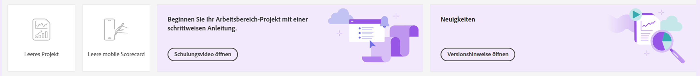

# Landingpage von Customer Journey Analytics

Auf der Landingpage für Customer Journey Analytics finden Sie [!DNL Analysis Workspace] und eine Startseite für Projekt-Manager sowie einen Lernabschnitt, der Ihnen hilft, Customer-Journey-Daten besser zu verwalten.

>[!BEGINSHADEBOX]

Unter  [Landingpage in Analysis Workspace](https://video.tv.adobe.com/v/334278/?quality=12&learn=on){target="_blank"} finden Sie ein Demovideo.

{{videoaa}}

>[!ENDSHADEBOX]

Die Customer Journey Analytics-Landingpage besteht aus den folgenden Unterregisterkarten: „Projekte“ und „Lernen“.

**[!UICONTROL Projekte]** sind benutzerdefinierte Entwürfe, die aus Datenkomponenten, Tabellen und Visualisierungen bestehen, die von Ihnen erstellt oder einer anderen Person für Sie erstellt und freigegeben wurden. [!UICONTROL Projekte] beziehen sich auch auf leere Projekte und leere mobile Scorecards.

Die Registarkarte **[!UICONTROL Lernen]** enthält praktische Video-Touren und Tutorials sowie Links zur Dokumentation.

>[!BEGINTABS]

>[!TAB Projekte]

>[!TAB Lernen]

>[!ENDTABS]

## Projekte

[!UICONTROL Projekte] fungieren als Startseite von [!UICONTROL Workspace]. Auf der Registerkarte **[!UICONTROL Projekte]** werden der Firmenordner, alle von Ihnen erstellten persönlichen Ordner, Ihre Workspace-Projekte und mobile Scorecards angezeigt. Auf dieser Seite können Sie Ordner, Projekte und mobile Scorecards anzeigen, erstellen und ändern. Weitere Informationen finden Sie unter [Projekte](/help/analysis-workspace/build-workspace-project/freeform-overview.md).

**[!UICONTROL Projekte]** sind benutzerdefinierte Entwürfe, die aus Datenkomponenten, Tabellen und Visualisierungen bestehen, die von Ihnen erstellt oder einer anderen Person für Sie erstellt und freigegeben wurden. [!UICONTROL Projekte] beziehen sich auch auf leere Projekte und leere mobile Scorecards.

>[!NOTE]
>
>Einige der folgenden Einstellungen bleiben während der aktuellen und den nachfolgenden Sitzungen bestehen. Hierzu zählen beispielsweise die ausgewählte Registerkarte, die ausgewählten Segmente, die ausgewählten Spalten und die Sortierrichtung der Spalte. Suchergebnisse sind nicht persistent.

Weitere Informationen finden Sie unter [Projekte](/help/analysis-workspace/build-workspace-project/freeform-overview.md).

<!--

### Customize table columns

To customize column widths, drag the vertical bar that separates each column. 

To add or remove columns from the list of projects, click the column icon ( ) in the top-right, then select or deselect column titles. 

The available columns are:

| Column name | Description | 
|---------|----------|
| [!UICONTROL **Name**] | Identifies the name of the project. |
| [!UICONTROL **Type**] | Indicates whether this type is a Workspace project, a Mobile scorecard, or a folder. |
| [!UICONTROL **Tags**] | Tags projects to organize them into groups. | 
| [!UICONTROL **Scheduled**] | Set to [!UICONTROL On] when a project is scheduled or [!UICONTROL Off] when it is not. Clicking the [!UICONTROL On] link lets you see information about the scheduled project. You can also [edit the project schedule](/help/analysis-workspace/export/t-schedule-report.md) if you are the project owner. |
| [!UICONTROL **Project role**] | Identifies the project roles: whether you are the project Owner and whether you have permissions to Edit or Duplicate the project. |
| [!UICONTROL **Report suite**] | Identifies the Report Suites that are associated with the project. Tables and visualizations within a panel derive data from the report suite selected in the top right of the panel. The report suite also determines what components are available in the left rail. Within a project, you can use one or many report suites depending on your analysis use cases. The list of report suites is sorted on relevance. Adobe defines relevance based on how recently and frequently the suite has been used by the current user, and how frequently the suite is used within the organization. |
| [!UICONTROL **Owner**] | Identifies the person who created the project. |
| [!UICONTROL **Shared With**] | Shows who the project is currently shared with. |
| [!UICONTROL **Last Modified**] | The date and time when the project was last modified. |
| [!UICONTROL **Last Opened**] | Identifies the date that a project was last opened by the user who is currently viewing the Projects page. |
| [!UICONTROL **Last Used**] | Helps determine whether a project is valuable to users in your organization by showing the date and time when the project was last opened by any user within the organization.
Consider the following when viewing this column:
<ul><li>Usage information is available starting in September 2023.</li><li>This column is available only to system administrators.</li></ul> |
| [!UICONTROL **Project ID**] | Can be used for debugging projects. |
| [!UICONTROL **Longest Date Range**] | Longer date ranges increase project complexity and may increase processing and load times. |
| [!UICONTROL **Number of queries**] | The total number of requests made to Analytics when the project loads. A higher number of project queries increases project complexity and may increase processing and load times. This data is available only after a project has loaded or a scheduled project was sent. |
| [!UICONTROL **Location**] | Shows the folder where the project is located. |

### Other UI elements on the Projects page

| UI element | Definition |
| --- | --- |
| Edit preferences | Lets you [!UICONTROL View Tutorials], and [Edit user preferences](/help/analysis-workspace/user-preferences.md). |
| [!UICONTROL Create new] | Opens the project modal where you can create a Workspace project or a Mobile scorecard or open a company template.  |
| [!UICONTROL Show less  Show more] | Toggles between not showing and showing the banner:  |
| [!UICONTROL Workspace project] | Creates a blank [Workspace project](/help/analysis-workspace/home.md) for you to  design and build. |
| [!UICONTROL Mobile scorecard] | Creates a blank [mobile scorecard](https://experienceleague.adobe.com/docs/analytics/analyze/mobapp/curator.html?lang=de) for you to design and build. |
| [!UICONTROL Open Training Tutorial] | Opens the Workspace training tutorial that guides you through the process of building a new starter project in a step-by-step tutorial.|
| [!UICONTROL Open release notes] | Opens the Adobe Analytics section of the latest Adobe Experience Cloud release notes. |
| Filter icon | Filters by tags, report suites, owners, types, and other filters (Mine, Shared with me, Favorites, and Approved)  |
| Search bar | Searches all columns in the table. |
| Selection box | Selects one or more projects to display the project management actions you can perform: **Delete**, **Share**, **Rename**, **Copy**, **Unpin**, **Move Up**, **Move Down**, **Tag**, **Approve**, **Export CSV**, and **Move to**. You may not have permissions to perform all listed actions. |
| [!UICONTROL Favorites] | Adds a star next to a favorite project or folder that can be used as a filter. |
| [!UICONTROL Name] | Identifies the name of the project. |
| Pin icon | Pins items so they always appear at the top of your list but you can re-adjust the order by moving them up or down in the order. Use the ellipsis option menu and select **Move Up** or **Move down** in the list. |
| Info (i) icon | Displays the following information about a project: Type, Project Role, Owner, Description, and who it is shared with. It also indicates who can [edit or duplicate](/help/analysis-workspace/curate-share/share-projects.md) this project. |
| Ellipsis (...) | Displays the project management actions you can perform: **Delete**, **Share**, **Rename**, **Copy**, **Unpin**, **Move Up**, **Move Down**, **Tag**, **Approve**, **Export CSV**, and **Move to**. You may not have permissions to perform all listed actions. |
| SHOW: Folders & Projects or All Projects | Changes the view setting on the table to show folders and projects according to your folder organization **or** show all of your projects in an unorganized list. |
| < (Back button) | Returns you to your most recent landing page configuration in a Workspace project or a report. The page configuration you had when you left the landing page will persist when you return. |

-->

## Lernen

Die Seite „Lernen“ enthält praktische Video-Touren und Tutorials sowie Links zur Dokumentation.

Auf der Seite „Lernen“ in Customer Journey Analytics erfahren Sie mehr über:

* Funktionen und Anwendungsfälle auf der Ebene für Anfängerinnen bzw. Anfänger, mäßig Fortgeschrittene oder Fortgeschrittene
* den nahtlosen Übergang von Adobe Analytics zu Customer Journey Analytics

So greifen Sie auf den Lerninhalt zu:

* Wählen Sie unter Customer Journey Analytics die Option [!UICONTROL **Arbeitsbereich**] im oberen Menü und dann im linken Bedienfeld die Option [!UICONTROL **Lernen**] aus.

### Funktionen

Das Seite „Lernen“ bietet die folgenden Funktionen:

* **Inhalt filtern:** Verwenden Sie , um Lerninhalte nach **[!UICONTROL Typ]** (**[!UICONTROL Dokument]**, **[!UICONTROL Video]** und **[!UICONTROL Touren und Tutorials]**) und **[!UICONTROL Erfahrungsstufe]** (**[!UICONTROL Anfängerinnen und Anfänger]**, **[!UICONTROL Mäßig Fortgeschrittene]** oder **[!UICONTROL Fortgeschrittene]**) zu filtern.
* **Fortschritt verfolgen:** Nachdem Sie ein Inhaltselement ausgewählt haben, wird das Tag  **[!UICONTROL Angesehen]** angezeigt. Mit diesem Tag können Sie Ihren Fortschritt durch den Lerninhalt verfolgen. Sie können das Tag  **[!UICONTROL Angesehen]** auswählen, um es aus einem Inhaltselement zu entfernen.
* **Zusätzliche Inhalte anzeigen:** Wählen Sie beim Ansehen eines Videos die Schaltfläche **[!UICONTROL Weitere Informationen]** aus, um zugehörige Dokumentationsinhalte in Experience League anzuzeigen. Wählen Sie auf der Seite „Lernen“ eine der folgenden Optionen aus, um weitere Inhalte anzuzeigen:
   * **[!UICONTROL YouTube besuchen]:** Zeigen Sie die vollständige YouTube-Wiedergabeliste von Analysis Workspace an.
   * [!UICONTROL **Experience League besuchen:**] Sehen Sie die vollständige Customer Journey Analytics-Dokumentation in Experience League an.
* **Grundlagen für neue Benutzende:** Neuen Benutzenden wird die Tour [!UICONTROL Verstehen der Grundlagen von Workspace] empfohlen. Diese Tour führt Sie direkt zu Workspace und erläutert die gängigsten Aktionen. Diese Tour kann auch jederzeit in Workspace über die QuickInfo in der Kopfzeile des Bedienfelds [Freiform](/help/analysis-workspace/c-panels/freeform-panel.md) oder des Bedienfelds [Leer](/help/analysis-workspace/c-panels/blank-panel.md) neu gestartet werden.

## Bevorzugte Landingpage

Sie können Ihre bevorzugte Landingpage festlegen. Weitere Informationen finden Sie unter [Benutzervoreinstellungen](/help/analysis-workspace/user-preferences.md#general-preferences).

<!--
## Landing page FAQ {#landing-faq}

| Question | Answer |
| --- | --- |
| Does the work I do in the beta program UI carry over to the production [!UICONTROL Workspace] experience? | Yes, any work done in the beta carries over to the old/current [!UICONTROL Workspace] experience. |
| Is there a maximum number of projects I can pin? | No, there is no limit on the number of projects you can pin. |
| Can admins designate this landing page for their users? | No, admins cannot designate the landing page on behalf of users. Individual users must turn on the toggle themselves. |
| Are all reports that currently exist in [!DNL Reports & Analytics] still available? | No, the following reports were phased out, based on overall usage data: <ul><li>Any custom eVars/props/events/classifications<li>My Recommended Reports</li><li>Hourly/Daily/Weekly/Monthly/Quarterly/Yearly unique visitors</li><li>DailyWeekly/Monthly/Quarterly/Yearly unique customers</li><li>Action name depth</li><li>Action name summary</li><li>Add dashboard</li><li>Age</li><li>Audio support</li><li>Billing information</li><li>Clicks to page</li><li>Color depth</li><li>Cookie support</li><li>Cookies</li><li>Connection types</li><li>Creative elements</li><li>Credit card type</li><li>Cross sell</li><li>Custom event funnels</li><li>Custom links</li><li>Customer ID</li><li>Day of week</li><li>Entry action name</li><li>Exit action name</li><li>Exit links</li><li>Fallout</li><li>File downloads</li><li>Find in store</li><li>Full paths</li><li>Gender</li><li>Hit ype VISTA rule</li><li>Image support</li><li>Java</li><li>JavaScript</li><li>JavaScript version</li><li>Manage bookmarks</li><li>Manage dashboards</li><li>Monitor color depth</li><li>Monitor resolutions</li><li>Newsletter signups</li><li>Next action name</li><li>Next action name flow</li><li>Null searches</li><li>Operating system</li><li>Order review</li><li>Page of day</li><li>Pages not found</li><li>Pathfinder</li><li>Path length</li><li>Previous action name</li><li>Previous action name flow</li><li>Product activity</li><li>Product cost</li><li>Product department</li><li>Product inventory category</li><li>Product name</li><li>Product reviews</li><li>Product season</li><li>Product shares</li><li>Product zooms</li><li>Reload</li><li>Searches</li><li>Servers</li><li>Single page visits</li><li>Shipping information</li><li>Site hierarchy</li><li>Social mentions</li><li>Time of day</li><li>Time spent on action name</li><li>Video support</li><li>Visitor state</li></ul> | 
-->
