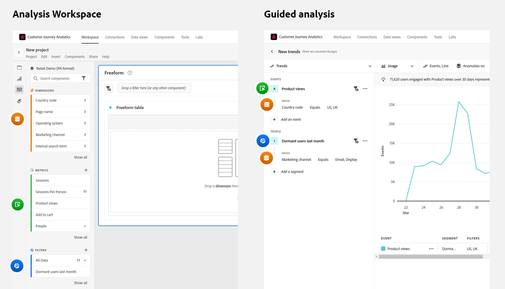
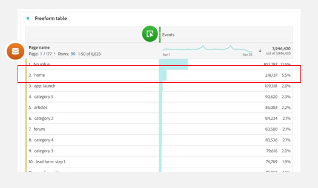

# Häufig gestellte Fragen zur geführten Analyse

Häufig gestellte Fragen zur geführten Analyse.

+++**Hat meine Organisation Zugriff auf die geführte Analyse?**

Geführte Analyseansichten sind in allen Customer Journey Analytics-Paketen enthalten. Weitere Informationen zu den Ansichten, die das CJA-Paket entsperrt, sind im Abschnitt [Bereitstellung](overview.md#provisioning) auf der Übersichtsseite zu finden.

+++

+++**Welche Implementierungsänderungen sind erforderlich, um die geführte Analyse zu verwenden?**

Wenn Sie Customer Journey Analytics bereits heute verwenden, sind keine zusätzlichen Implementierungsänderungen erforderlich. Die geführte Analyse verwendet dieselben [Datenansichten](../data-views/data-views.md) und [Verbindungen](../connections/overview.md) wie andere CJA-Schnittstellen wie [Analysis Workspace](../analysis-workspace/home.md).

Damit die Endbenutzenden die geführte Analyse so erfolgreich wie möglich nutzen können, sollten Sie in Adobe Experience Platform und [Datenansichten](../data-views/data-views.md) über ein solides Ereignisschema und eine entsprechende Verwaltungsstrategie verfügen.

+++

+++**Wann sollten Sie die geführte Analyse oder Analysis Workspace verwenden?**

**Die geführte Analyse** kann Benutzenden helfen, schnell hochwertige Erkenntnisse zu gewinnen. Sie ist nützlich für Produkt-Teams, für Benutzende, die selbstbewusster mit Daten arbeiten möchten, und sogar für Analystinnen und Analysten als Einstieg in tiefere Analysen.

**[Analysis Workspace](../analysis-workspace/home.md)** ist ein frei gestaltbarer Bereich, in dem Sie tiefer in die Daten eintauchen können, um mehr Erkenntnisse zu gewinnen. Es ist nützlich für Analystinnen und Analysten sowie Benutzende, die die Daten gut verstehen und tief in sie eintauchen wollen.

+++

+++**Worin unterscheidet sich die Terminologie der geführten Analyse von der Analysis Workspace-Terminologie?**

Die Hauptterminologie der geführten Analyse und von [Analysis Workspace](../analysis-workspace/home.md) ist zum großen Teil identisch und es gibt nur wenige kleine Unterschiede.

| Begriff der geführten Analyse | Begriff von Analysis Workspace |
| --- | --- |
| Ereignis (eine binäre 1/0-Metrik) | Metrik |
| Benutzende | Personen |
| Dimension | Dimension |
| Dimensionselement | Dimensionselement |
| Segment | Segment |
| Filter | Berichtsfilter |
| Berechnete Metrik, Metriken | Berechnete Metrik |

{style="table-layout:auto"}

+++

+++**Welche Unterschiede gibt es zwischen der Vorgehensweise bei der geführten Analyse und der Berichterstellung mit Analysis Workspace?**

[Analysis Workspace](../analysis-workspace/home.md) und die geführte Analyse verwenden zwar dieselben zugrunde liegenden Daten, aber die Art und Weise, wie Sie mit jedem Tool Abfragen dieser Daten erstellen können, ist unterschiedlich.

* **Analysis Workspace ist ein dimensionszentriertes Erlebnis.** Tabellen bestehen normalerweise aus dimensionalen Zeilen, während Spalten normalerweise Metriken sind. Segmente können sowohl in Zeilen als auch in Spalten angewendet werden, um die gewünschten Daten zu erhalten.

* **Geführte Analyse ist ein Ereignis und ein benutzerorientiertes Erlebnis.** Jede Analyse beginnt mit der Auswahl von Ereignissen. Anschließend können Dimensionen und Segmente hinzugefügt werden, um diese Ereignisdaten zu verfeinern.

{style="border:1px solid gray"}

Betrachten Sie das folgende Beispiel, in dem Sie sich auf Daten rund um die Startseite Ihrer Website konzentrieren. Teams stellen ähnliche Fragen, aber der Analysenansatz kann unterschiedlich sein.

* Ein typischer, dimensionszentrierter Analysis Workspace-Ansatz wäre: „Sehen wir uns die Startseite an und sehen wir, wie viele Seitenansichten sie erhalten hat.“

  {style="border:1px solid gray"}

* Ein typischer ereignisorientierter und benutzerzentrierter Ansatz für die geführte Analyse wäre: „Wie viele Benutzende haben die Startseite besucht?“

  {style="border:1px solid gray"}

+++
