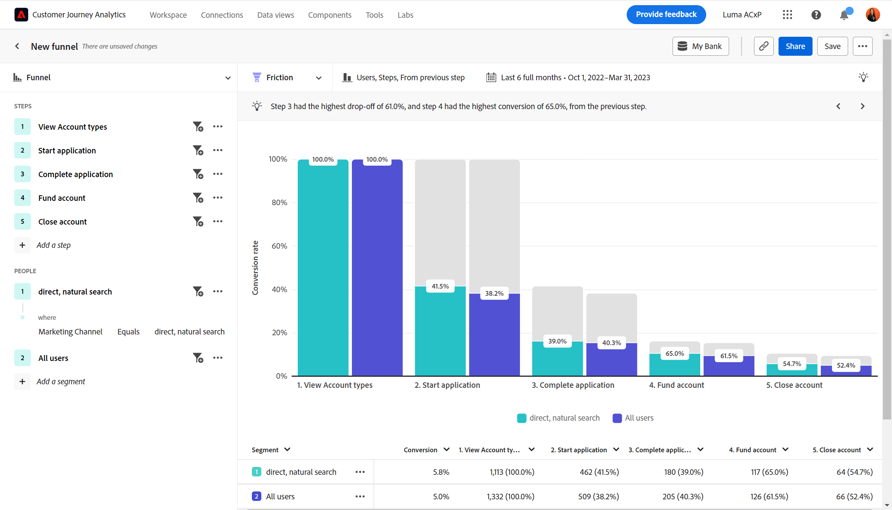

# Anwendungsfälle für Branchen

Auf dieser Seite finden Sie einige Beispiele aus der Branche, wie Kundenerlebnisteams - von Analysten über Produktteams bis hin zu Marketingexperten - mit einer geführten Analyse Erfolg erzielen können.

+++**Einzelhandel**

| Anwendungsfall | Beispiel | Wirkung | Analyse |
| --- | --- | --- | --- |
| **Optimieren einer mobilen Shopping-App** | Viele Kundinnen und Kunden haben die mobile App eines Unternehmens heruntergeladen, aber nie benutzt. Das Unternehmen stellt fest, dass die Kundschaft sie nur für das erste Angebot verwendet. Sie haben diese „schlummernde“ Kundschaft wieder angesprochen. | **Steigerung des LTV von Mobile-Benutzenden.** Messen und Steigern Sie die App-Nutzung, um eine „glücklichere“ Benutzererfahrung zu entwickeln. | [Wachstumsansicht der aktiven Benutzenden](types/active.md) [Netto-Wachstumsansicht](types/net-growth.md) |
| **Quantifizieren der Auswirkungen neuer Checkout-Funktionen** | Ein Lebensmittelgeschäft testet seinen neuen Weg zum Online-Einkauf. Es werden schnell die Auswirkungen neuer Checkout-Funktionen wie Produktempfehlungen oder Curbside Pickup messen. | **Steigerung der Konversionsraten.** Messen der geschäftlichen Auswirkungen anstatt nur der Nutzung von Funktionen. | [Ansicht mit Auswirkung auf die Version](types/release.md) [Ansicht der ersten Verwendung](types/first-use.md) |
| **Verringerung der Abwanderung der Mitgliedschaft** | Ein Unternehmen erkennt Reibungspunkte in den Journeys, die dazu führen, dass die Kundschaft abwandert. Es ermöglicht ihm, Mitgliedschaftsprogramme zu überprüfen und das Verhalten von Risikomitgliedern zu analysieren. | **Verringerung der Abwanderung.** Identifizieren von Wegen zur Förderung und Pflege von Kundenbeziehungen, um Abbrüche zu verhindern und Abwanderungen zu reduzieren. | [Wachstumsansicht der aktiven Benutzenden](types/active.md) [Reibungsansicht](types/friction.md) |
| **Finden von ineffizienten Verkaufs-Journeys** | Eine Organisation entdeckt Ineffizienzen bei der Journey von Verkaufsmitarbeiterinnen und -mitarbeitern in Geschäften, wo sich die Kundschaft von ihnen abwendet. Sie passt daraufhin ihren Prozess an, was der Kundschaft ein angenehmeres Einkaufserlebnis im Geschäft ermöglicht. | **Verbessern der Verkaufsreaktion.** Reduzieren ineffizienter Prozesse, was zu verbesserten internen Journeys und einem positiven Kundenerlebnis führt. | [Reibungsansicht](types/friction.md) |

{style="table-layout:auto"}

{style="border:1px solid gray"}

{style="border:1px solid gray"}

+++

+++**Finanzdienstleistungen**

| Anwendungsfall | Beispiel | Wirkung | Analyse |
| --- | --- | --- | --- |
| **Quantifizieren der Auswirkungen neuer Funktionen** | Ein Finanzinstitut startet Banküberweisungen mit Zelle und möchte die Auswirkungen der neuen Funktion auf die Abwicklung von Überweisungen verstehen. Eine geführte Analyse ermöglicht es ihm, zu sehen, wie Kundinnen und Kunden reagieren, damit das Marketing-Team die Analyse einführen kann. | **Steigerung der Konversionsraten.** Messen der Auswirkungen neuer Funktionen auf Konversionen von Übertragungen. | [Ansicht mit Auswirkung auf die Version](types/release.md) [Ansicht der ersten Verwendung](types/first-use.md) |
| **Umleiten von Callcenter-Anrufen** | Die geführte Analyse zeigt, dass der fünfstufige Prozess für per Mobilgerät gestellte Ansprüche eines Unternehmens Anrufe in sein Callcenter sendet. Es erstellt eine Zielgruppe und sendet eine E-Mail an diese Kundinnen und Kunden, um deren Erlebnis besser zu verstehen. | **Isolieren Sie die Reibung im Erlebnis.** Verbessern Sie „glückliche“ Journeys und reduzieren Sie die Zahl der Anrufe. | [Reibungsansicht](types/friction.md) [Konversions-Trend-Ansicht](types/conversion-trends.md) |
| **Verringerung der Kundenabwanderung** | Ein Unternehmen weiß, dass Kundinnen und Kunden, die sich mit monatlicher Häufigkeit bei der mobilen Banking-App anmelden, ihm länger treu bleiben. Eine geführte Analyse ermöglicht es ihnen, zu ermitteln, wer abzuwandern droht, und eine Rückgewinnungsstrategie zu erstellen. | **Verringern der Abwanderung.** Halten Sie das Kundenniveau bei gleichzeitigen Ausgaben für die Akquisition neuer Kundinnen und Kunden. | [Wachstumsansicht der aktiven Benutzenden](types/active.md) [Netto-Wachstumsansicht](types/net-growth.md) |
| **Empfehlen neuer Funktionen** | Ein Unternehmen stellt fest, dass digitale Rücknahmen in den letzten Monaten zurückgegangen sind. Die Anzahl der Anrufe an eine Finanzberaterin oder einen Finanzberater hat zugenommen. Die geführte Analyse hilft dem Unternehmen, Optimierungen digitaler Prozesse mit einem Lenkungsausschuss zu priorisieren. | **Erstellen Sie eine datengestützte Roadmap.** Verwenden Sie Daten zur Planung und Implementierung von Optimierungen. | [Ansicht der Nutzungs-Trends](types/usage.md) |

{style="table-layout:auto"}

{style="border:1px solid gray"}

{style="border:1px solid gray"}

{style="border:1px solid gray"}

+++

+++**Reisen und Gastgewerbe**

| Anwendungsfall | Beispiel | Wirkung | Analyse |
| --- | --- | --- | --- |
| **Quantifizieren der Auswirkungen neuer Buchungsflussfunktionen** | Ein Unternehmen verwendet eine geführte Analyse, um die Auswirkungen einer neuen Buchungsschritt-Funktion auf die Konversionsraten schnell anzuzeigen. Es identifiziert den Teil des Erlebnisses mit den größten Gewinnen. | **Erhöhen Sie die Buchungsraten.** Messen Sie die geschäftlichen Auswirkungen statt nur die Nutzung von Funktionen. | [Ansicht der Auswirkungen der Version](types/release.md) [Reibungsansicht](types/friction.md) |
| **Optimieren des Mobile-App-Erlebnisses** | Ein Unternehmen erkennt schnell und einfach monatlich aktive App-Benutzende im Zeitverlauf und identifiziert positive Auswirkungen nach Version. | **Erhöhen Sie MAUs.** Messen und erhöhen Sie die App-Nutzung, die mit der Kundenzufriedenheit in Zusammenhang steht. | [Wachstumsansicht der aktiven Benutzenden](types/active.md) [Netto-Wachstumsansicht](types/net-growth.md) |
| **Suchen der Reibung im mobilen Check-in-Fluss** | Wenn ein Unternehmen sehen kann, wo Personen erfolgreich sind oder den erwarteten mobilen Check-in-Prozess abbrechen, kann es problemlos Bereiche identifizieren, in denen Erlebnisse optimiert werden müssen. | **Erhöhen Sie CSAT und reduzieren Sie IROPs.** Die Beseitigung von Reibung führt zu einem nahtloseren Erlebnis am Tag der Reise. | [Reibungsansicht](types/friction.md) [Konversions-Trend-Ansicht](types/conversion-trends.md) |
| **Umleiten von Callcenter-Anrufen** | Die Trichteransicht des Anwendererlebnisses zeigt eine Person, bei der Besucherinnen und Besucher auf Reibungspunkte treffen, was zu einem kostspieligen Callcenter-Volumen führt. Es ist klar, welche Schritte als Nächstes im Fokus stehen. | **Reduzieren Sie die Nutzung des Callcenters.** Erhalten Sie mehr „glückliche“ Journeys und reduzieren Sie teure Anrufe. | [Reibungsansicht](types/friction.md) [Konversions-Trend-Ansicht](types/conversion-trends.md) |

{style="table-layout:auto"}

{style="border:1px solid gray"}

{style="border:1px solid gray"}

{style="border:1px solid gray"}

+++

+++**Medien und Unterhaltung**

| Anwendungsfall | Beispiel | Wirkung | Analyse |
| --- | --- | --- | --- |
| **Quantifizieren der Auswirkungen neuer Sendungen oder Serien** | Ein Streaming-Dienst kann die Auswirkungen auf die Zuschauerschaft analysieren, nachdem Benutzende eine neue Sendung oder Serie angesehen haben, und besser ermitteln, welche Inhalte zu Resonanz führen. | **Erhöhen Sie die Zuschauerschaft.** Suchen Sie nach Inhalten, die den größten Einfluss auf die Zuschauerschaft haben. | [Ansicht der ersten Verwendung](types/first-use.md) |
| **Erkennen des Abwanderungsrisikos** | Ein Unternehmen verzeichnet eine hohe Umsatzrate von Kundinnen und Kunden, die sich auf seiner Plattform registrieren, um sich ein saisonales Ereignis anzusehen, aber das Abonnement nach Ende des Ereignisses umgehend kündigen. Durch die schnelle Identifizierung dieser Benutzenden können Empfehlungen angezeigt werden, um Kundinnen und Kunden dazu zu verleiten, weiterhin mit der Plattform zu interagieren. | **Behalten Sie zufriedene Abonnentinnen und Abonnenten.** Suchen Sie nach Inhalten, die ein Wachstumssegment einbinden, um mit Empfehlungen einzugreifen. | [Wachstumsansicht der aktiven Benutzenden](types/active.md) [Netto-Wachstumsansicht](types/net-growth.md) |
| **Ermitteln von Upsell-Möglichkeiten** | Ein wesentlicher Bestandteil des Umsatzwachstums eines Unternehmens ist ein Verständnis dafür, welche In-App-Angebote für Fans verlockendsten sind, während diese sich im Stadium aufhalten. Anhand der geführten Analyse kann das Unternehmen genau sehen, welche Angebote am effektivsten sind. | **Steigern Sie die Nebeneinnahmen.** Machen Sie sich mit den Auswirkungen von In-App-Angeboten auf das Kaufverhalten vertraut. | [Ansicht der ersten Verwendung](types/first-use.md) [Reibungsansicht](types/friction.md) |
| **Optimieren des geräteübergreifenden Erlebnisses** | Ein Unternehmen möchte analysieren, wie Abonnentinnen und Abonnenten mit mehreren Geräten/Apps interagieren. Mit diesem Wissen kann das Unternehmen die Nutzungsmuster von Inhalten verstehen und bestimmen, wo ein Retargeting dieser Inhalte optimal wäre. | **Personalisieren Sie das Erlebnis.** Ermitteln Sie, welche Inhalte bei Abonnentinnen und Abonnenten auf den einzelnen Geräten am besten ankommen. | [Ansicht der Nutzungs-Trends](types/usage.md) |
| **Umleiten von Callcenter-Anrufen** | Ein Unternehmen verwendet eine geführte Analyse, um ein Problem zu identifizieren, bei dem die automatische Zahlung nicht funktionierte, was dazu führte, dass frustrierte Kundinnen und Kunden das Support-Center des Unternehmens anriefen, um ihr Abonnement zu kündigen. | **Reduzieren Sie die Anrufe beim Support-Center.** Erstellen Sie ein besseres Anwendererlebnis und reduzieren Sie die Anrufe beim Kundendienst. | [Reibungsansicht](types/friction.md) [Konversions-Trend-Ansicht](types/conversion-trends.md) |

{style="table-layout:auto"}

{style="border:1px solid gray"}

{style="border:1px solid gray"}

{style="border:1px solid gray"}

+++

+++**Gesundheitswesen**

| Anwendungsfall | Beispiel | Wirkung | Analyse |
| --- | --- | --- | --- |
| **Verbessern der gesundheitlichen Resultate für Patientinnen und Patienten** | Ein Unternehmen verfügt über die Daten, um seine Bemühungen auf Wachstum zu konzentrieren. Vor der Verwendung der geführten Analyse hatte das Unternehmen keine genaue Kenntnis darüber, wie viele Mitglieder des Wellness-Plans pro Woche ganz aufgehört hatten, diesen zu nutzen. | **Reduzieren Sie Arztbesuche.** Schnelles Identifizieren „schlummernder“ Benutzender für eine erneute Interaktion. | [Wachstumsansichten der aktiven Benutzenden](types/active.md) |
| **Verbesserung der Patientenerfahrung** | Die Sichtbarkeit darüber, wie viele Patienten für das einfache Zurücksetzen eines Kennworts ein Callcenter anrufen, entfachte erneut die Leidenschaft eines Analytikers, sich gezielt auf die Verbesserung der Patientenerfahrung zu konzentrieren. | **Reduzieren der Gesamtkosten für den Service.** Erstellen einer besseren Patientenerfahrung und Reduzieren der Aufrufe an Patientendienste. | [Ansicht der Nutzungs-Trends](types/usage.md) [Reibungsansicht](types/friction.md) |
| **Ermitteln wiederholter kanalübergreifender Aktionen nach Segment** | Eine Organisation möchte wissen, wie aktiv Medicare-berechtigte Mitglieder ihren Plan nutzen, um ihnen in ihren digitalen Produkten spezifische Nachrichten zukommen zu lassen. Einblicke aus der geführten Analyse helfen, das Marketing effektiver zu gestalten. | **Personalisieren der Medicare-Registrierungsoptionen.** Vergleichen allgemeiner sequenzieller Aktionen meiner aktivsten Planmitglieder. | [Reibungsansicht](types/friction.md) [Wachstumsansicht der aktiven Benutzenden](types/active.md) |
| **Bindung von Spitzentalenten in der Branche** | Analyse-Ressourcen für eine Organisation sind zeitsparend. Die geführte Analyse ermöglicht es dem Unternehmen, schnell die Produktnutzungsdaten abzurufen, die sie für Aktualisierungsgespräche mit der Geschäftsführung benötigt. | **Reduzierung des Arbeitsaufwands für Analystinnen und Analysten.** Schnelleres Erhalten von Antworten. Angemessene Berichterstattung für den Zeitpunkt, an dem dies am wichtigsten ist. | [Geführte Analyse](overview.md) |

{style="table-layout:auto"}

{style="border:1px solid gray"}

+++

+++**High Tech und B2B**

| Anwendungsfall | Beispiel | Wirkung | Analyse |
| --- | --- | --- | --- |
| **Quantifizieren der Auswirkungen neuer Funktionen** | Ein Unternehmen kann die Nutzung einer neuen Produktfunktion analysieren und bestimmen, welche Segmente am besten funktionieren. Diese Analyse hilft ihnen dabei, Prioritäten zu setzen, wo Ressourcen ausgegeben werden, um die Benutzerinteraktion zu maximieren und die Partnerschaft mit dem Marketing zu stärken. | **Datengesteuerte Priorisierung.** Treffen fundierter Entscheidungen über die Zuweisung von Ressourcen. | [Ansicht mit Auswirkung auf die Version](types/release.md) [Ansicht der ersten Verwendung](types/first-use.md) |
| **Identifizieren von Rollen, die das Produkt nicht ausreichend nutzen** | Eine Organisation entwirft ein Produkt für die Verwendung durch Ingenieurinnen bzw. Ingenieure, Produkt-Verantwortliche und Marketing-Fachleute. Die geführte Analyse zeigte, dass Produkt-Verantwortliche und Marketing-Fachleute sie zwar fast täglich nutzen, die Ingenieurinnen und Ingenieure sie jedoch größtenteils nicht übernommen haben. | **Steigerung der Produktakzeptanz.** Schnelles Identifizieren des Benutzerverhaltens auf verschiedene Weisen. | [Wachstumsansicht aktiver Benutzender](types/active.md) [Netto-Wachstumsansicht](types/net-growth.md) |
| **Entfernen von Reibungspunkten im Konversionsprozess** | Das Erfordernis einer Bestellnummer im Kauffluss verhindert, dass Benutzende, die Kreditkarten bevorzugen, ihre Bestellungen abschließen können. Die Konversionen stiegen an, wenn dieses Feld als optional festgelegt wurde. | **Verbessern des Kundenerlebnisses.** Verringerung der potenziellen Abwanderung. | [Reibungsansicht](types/friction.md) [Ansicht der Konversions-Trends](types/conversion-trends.md) |
| **Entsperren der Selbstbedienungsanalyse** | Der Zugriff auf Einblicke ist eine Herausforderung, und einige Benutzende innerhalb eines Unternehmens sind nicht für die Analyse geschult. Durch geführte Analysen können sie Antworten erhalten und dieselben Daten nutzen, die auch der Rest des Unternehmens verwendet. Dies führt zu stärkeren Partnerschaften und ermöglicht wirklich datengesteuerte Entscheidungen. | **Engere Partnerschaften innerhalb der Organisation.** Gewähren des Zugriffs der Produkt-Verantwortlichen auf zuvor isolierte Daten. | [Geführte Analyse](overview.md) |

{style="table-layout:auto"}

{style="border:1px solid gray"}

+++
