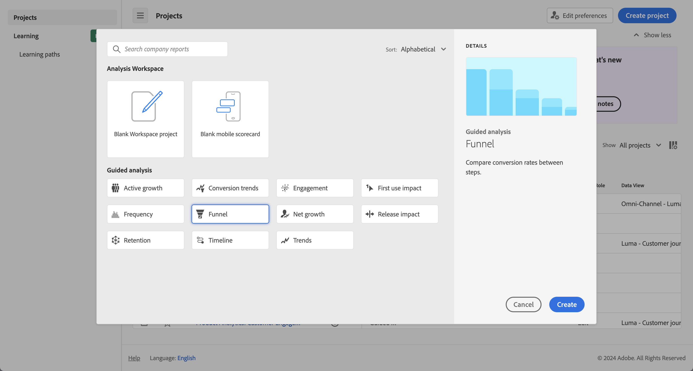

# Überblick über die geführte Analyse

Mit geführten Analysen können Benutzende in den Bereichen Marketing, Produkt und Analyse hochwertige Daten und Einblicke zur Kunden-Journey mithilfe geführter Workflows selbst bereitstellen, die auf den kanalübergreifenden Daten von Customer Journey Analytics basieren. Ähnlich wie Analysis Workspace und mobile Scorecards verwendet die geführte Analyse Daten aus einer [Datenansicht](/help/data-views/data-views.md), die auf Daten in Adobe Experience Platform über eine [Verbindung](../connections/overview.md) verweist. Viele Berichte, die mit einer geführten Analyse erstellt wurden, können nahtlos zur weiteren Recherche an Analysis Workspace übermittelt werden.

Die folgenden geführten Analysen sind verfügbar:

| Symbol | Analyse | Beschreibung |
| :----:|--- | --- |
|  | [Aktives Wachstum](types/active-growth.md) | Identifizieren Sie, wer neu ist, bleibt, zurückkehrt oder inaktiv ist. |
|  | [Konversions-Trends](types/conversion-trends.md) | Verfolgen Sie ie dVeränderungen der Konversionsraten im Laufe der Zeit. |
|  | [Interaktion](types/engagement.md) | Erfahren Sie mehr über Umfang und Tiefe der Funktionsinteraktion. |
|  | [Wirkung der ersten Verwendung](types/first-use-impact.md) | Messen Sie die Auswirkung der erstmaligen Verwendung von Funktionen auf Schlüsselindikatoren. |
|  | [Häufigkeit](types/frequency.md) | Messen Sie die Interaktion anhand der Nutzungshäufigkeit. |
|  | [Trichter](types/funnel.md) | Vergleichen Sie die Konversionsraten zwischen den Schritten. |
|  | [Nettowachstum](types/net-growth.md) | Gewinnen oder verlieren Sie Benutzende? |
|  | [Auswirkungen der Version](types/release-impact.md) | Vergleichen Sie die Leistung in gleich langen Zeiträumen vor und nach der Veröffentlichung. |
|  | [Kundentreue](types/retention.md) | Messen Sie die Rückkehrgewohnheiten Ihrer Benutzenden. |
|  | [Timeline](types/timeline.md) | Untersuchen Sie Muster in der Sitzungsaktivität. |
|  | [Trends](types/trends.md) | Messen Sie die Benutzerinteraktion im Zeitverlauf. |

## Zugriff

Sie können von der Customer Journey Analytics-Startseite aus auf die geführte Analyse zugreifen.

1. Wählen Sie auf der Startseite **[!UICONTROL Geführte Analyse]** aus. Von dort aus werden Sie direkt zur [Trend-Analyse](types/trends.md) weitergeleitet.

   {style="border:1px solid gray"}

1. Wählen Sie **[!UICONTROL Neu erstellen]**, um die verschiedenen Ansichtsoptionen anzuzeigen und einen anderen Ausgangspunkt für Ihre Analyse auszuwählen.

   {style="border:1px solid gray"}

Sie können auch über ein Analysis Workspace-Projekt aus auf die geführte Analyse zugreifen.

1. Wählen Sie auf der Startseite **[!UICONTROL Leeres Projekt]** aus, um ein leeres Workspace-Projekt zu erstellen.

   {style="border:1px solid gray"}

1. Wählen Sie in der linken Leiste  **[!UICONTROL Geführte Analyse]** aus.

   {style="border:1px solid gray"}

1. Ziehen Sie eine beliebige neue Analyse auf die Workspace-Arbeitsfläche und wählen Sie dann **[!UICONTROL Erstellen]** aus, um die gewünschte Analyse zu erstellen (z. B. **[!UICONTROL Trends erstellen]**). Sie können eine vorhandene Analyse auch aus dem Bereich **[!UICONTROL Gespeichert]** auf die Workspace-Arbeitsfläche ziehen.

   

## Benutzeroberfläche

Die Oberfläche für die geführte Analyse verwendet ein Frage- und Antwortformat. Stellen Sie Ihre Frage in der Abfrageleiste. Anschließend erhalten Sie eine Antwort mit einem schriftlichen Einblick, einer Grafik und einer Tabelle. Sie können dann die nächste Frage mit Analysen und Visualisierungseinstellungen stellen.

Die geführte Analyse verwendet die folgenden Elemente der Benutzeroberfläche:

| Vorschau der Benutzeroberfläche | UI-Element | Beschreibung |
| --- | --- | --- |
| {style="border:1px solid gray"} | **[!UICONTROL Abfrageleiste]** | Konfigurieren Sie Ihre *Frage*, indem Sie die gewünschten Komponenten (Ereignisse, Eigenschaften und Segmente) auswählen, aus denen eine Analyse besteht. Die folgenden Optionen sind für alle Analysen verfügbar, mit zusätzlichen Einstellungen, die je nach Ansicht verfügbar sind. <ul><li>**Ansicht**: Wählen Sie eine der Optionen aus, um zu einer neuen Analyse zu wechseln. Ihre Abfrageauswahl wird innerhalb der für die neue Analyse zulässigen Grenzen beibehalten.</li><li>**Ereignisse**: Die Ereignisse, die Sie messen möchten. Jede Analyse erzwingt unterschiedliche Beschränkungen für die Anzahl der Ereignisse, die Sie konfigurieren können.   Ereignisse werden manchmal als **[!UICONTROL Start- und Rückkehrereignisse]**, **[!UICONTROL Schritte]** oder **[!UICONTROL Schlüsselindikatoren]** bezeichnet. Die Identifizierung von Ereignissen in der Analyse erfolgt anhand von 1, 2, … Wählen Sie  **[!UICONTROL Ereignis hinzufügen]** aus, um neue Ereignisse hinzuzufügen.</li><li>**[!UICONTROL Faktoren]**: Wenn verfügbar, können Sie Faktoren wie „Datum seit“ und „Erstmaliges Ereignis“ angeben.</li><li>**Zählt als**: Die Zählmethode, die auf die ausgewählten Ereignisse angewendet werden soll.  Treffen Sie eine Auswahl aus dem Dropdown-Menü.</li><li>**Segmente**: Die Segmente, die Sie messen möchten. Jede Analyse erzwingt unterschiedliche Beschränkungen für die Anzahl der Segmente, die Sie konfigurieren können.  Die Identifizierung von Segmenten in der Analyse erfolgt anhand von A, B, … Wählen Sie  **[!UICONTROL Segment hinzufügen]** aus, um neue Segmente hinzuzufügen.</li><li>**[!UICONTROL Aufschlüsselung]**: Falls verfügbar, die Aufschlüsselung, die auf die Analyse angewendet werden soll.</li></ul>In einigen Einstellungen ist eine zusätzliche Konfiguration verfügbar.<ul><li>**Filter**: Verwenden Sie , um Ereignisse oder Segmente nach bestimmten Dimensionen einzugrenzen. Wenn eine Dimension ausgewählt ist, sind sowohl die Standardfilterkriterien (z. B. **[!UICONTROL Gleich]**, **[!UICONTROL Enthält]** oder **[!UICONTROL Endet in]**) als auch die 1000 wichtigsten Dimensionswerte verfügbar. Wählen Sie  aus, um weitere Filter hinzuzufügen. Wählen Sie  aus, um einen Filter zu entfernen.</li><li>**Weitere Aktionen**: Verwenden Sie , um Aktionen wie die Folgenden auszuwählen:<ul><li> **[!UICONTROL Umbenennen]**: Zum Umbenennen eines Ereignisses oder Segments.</li><li> **[!UICONTROL Duplizieren]**: Zum Duplizieren eines Ereignisses oder Segments.</li><li> **[!UICONTROL Entfernen]**: Zum Entfernen eines Ereignisses, eines Segments oder einer Aufschlüsselung.</li><li> **[!UICONTROL Segment bearbeiten]**: Zum Bearbeiten eines Segments im [Filter Builder](/help/components/filters/filter-builder.md).</li><li> **[!UICONTROL Zu Favoriten hinzufügen]**: Zum Hinzufügen des Segments zur Liste der Filter-Favoriten im [Filter-Manager](/help/components/filters/manage-filters.md).</li><li> **[!UICONTROL Speichern unter]**: Zum Speichern des Segments als neue Komponente. Im Dialogfeld **[!UICONTROL Segmente in Komponenten speichern]** können Sie einen Segmentnamen und eine Beschreibung angeben. Sie können  auswählen, um das neue Segment als Favoriten zu markieren. Wählen Sie **[!UICONTROL Speichern]** aus, um das Segment als neuen Filter zu speichern.</li><li> **[!UICONTROL Verknüpfen von Start- und Rückkehrereignissen]**.: zum Verknüpfen von Start- und Rückkehrereignissen in einer Analyse der [Kundentreue](types/retention.md).</li><li> **[!UICONTROL Verknüpfung von Start- und Rückkehrereignissen trennen]**: Zum Trennen der Verknüpfung von Start- und Rückkehrereignissen in einer Analyse der [Kundentreue](types/retention.md).</li></ul></li></ul> |
| {style="border:1px solid gray"} | **[!UICONTROL Diagramm]** | Eine Visualisierung der zurückgegebenen Daten basierend auf Ihrer Eingabe aus der Abfrageleiste und den Einstellungen. Welche Visualisierung Sie sehen, hängt von der Ansicht und den Einstellungen über dem Diagramm ab. Das Diagramm enthält außerdem Folgendes: <ul><li>**QuickInfos**: Bewegen Sie den Mauszeiger über einen beliebigen Datenpunkt im Diagramm, um eine QuickInfo mit weiteren Informationen anzuzeigen.</li><li>**Legende**: Bewegen Sie den Mauszeiger über die Reihen der Diagrammlegende, um nach Möglichkeit Definitionen anzuzeigen, diese Reihe zu fokussieren und andere Reihen vorübergehend auszublenden. Wählen Sie eine Reihe in der Legende aus, um sie auszublenden.</li><li>**Anmerkungen**: Gültige [Anmerkungen](../components/annotations/overview.md) sind zwischen der Visualisierung und der Legende sichtbar. Dies wird als  in der konfigurierten Farbe der Anmerkung dargestellt. Bei Analysen, die Daten im Zeitverlauf anzeigen, befindet sich das Symbol  unter dem konfigurierten Datum oder Datumsbereich. Bei Analysen, die Daten nicht im Zeitverlauf anzeigen, wird das Symbol  in der unteren rechten Ecke des Diagramms angezeigt.</li><li>**Aktionen auswählen**: Zeigen Sie die nächsten verfügbaren Aktionen an, indem Sie einen beliebigen Datenpunkt auswählen.  Zu den Optionen gehört **Segment speichern**.</li></ul> |
| {style="border:1px solid gray"} | **[!UICONTROL Tabelle]** | Eine Tabellendarstellung der zurückgegebenen Daten basierend auf Ihrer Eingabe aus der Abfrageleiste und den Einstellungen. Zeilen in der Tabelle mit Ereigniskennungen (1, 2, …) und Segmentkennungen (A, B, …) dienen als Referenz. Die Spalten in der Tabelle hängen von der Analyse über dem Diagramm ab. Die Tabelle enthält außerdem für jede Zeile Folgendes: <ul><li>**Aktionen auswählen**: Schalten Sie  um, um eine Diagrammreihe für eine Zeile ein- oder auszublenden. Wählen Sie  für zusätzliche Aktionen aus. Zu den Optionen gehört **Segment speichern**.</li></ul> |
| {style="border:1px solid gray"} | **[!UICONTROL Visualisierungseinstellungen]** | Optionen über dem Diagramm, mit denen Sie die nächste Frage stellen und anpassen können, wie das Diagramm und die Tabelle Daten zurückgeben sollen. Die folgenden Optionen sind für alle Analysen verfügbar, mit zusätzlichen Einstellungen, die je nach Analyse verfügbar sind. <ul><li> **Diagramm-Einstellungen**: Zum Anpassen der Anzeige Ihrer Diagramme und Tabellen. Die verfügbaren Optionen hängen von der gewählten Analyse ab.</li><li> **Überlagerungseinstellungen**: Hinzufügen einer Überlagerung.  Die verfügbaren Optionen hängen von der gewählten Analyse ab.</li><li> **[!UICONTROL Bucket-Einstellungen]**: Auto-Bucket oder Anwenden benutzerdefinierter Bucket-Einstellungen auf die Daten. Die verfügbaren Optionen hängen von der gewählten Analyse ab.<li> **[!UICONTROL Einstellungen vergleichen]**: Vergleichen von Daten mit einem bestimmten Datumsbereich. Die verfügbaren Optionen hängen von der gewählten Analyse ab.</li><li> **[!UICONTROL Anzeigeeinstellungen]**: Auswählen der Art und Weise, auf die Daten angezeigt werden sollen. Die verfügbaren Optionen hängen von der gewählten Analyse ab.<li> **Datumsbereich**: Eine Kalenderauswahl, mit der Sie den Datumsbereich der Analyse ermitteln können. Sie können auch ein Intervall für Trend-Analysen auswählen, z. B. für tägliche, wöchentliche oder monatliche Analysen.</li><li> **Erkenntnisse**: Kontextuelle Einblicke in Abhängigkeit von der von Ihnen angezeigten Analyse. Diese Erkenntnisse liefern Beobachtungen für die aktuelle Analyse. Wenn mehrere Erkenntnisse verfügbar sind, können Sie sie mithilfe der Pfeile auf der rechten Seite anzeigen. Mit dem Glühbirnensymbol oben rechts können Sie die Sichtbarkeit dieses Feldes umschalten.</li></ul> |
| {style="border:1px solid gray"} | **[!UICONTROL Menü]** In einem geführten Analyseprojekt verfügbar | Befehle oben rechts in einem geführten Analyseprojekt, die übergreifende Aktionen für Ihre Analyse bieten.<ul><li> ***Name der Datenansicht***: Ändern Sie die Datenansicht, die die Analyse verwendet. Wenn Sie die Datenansicht ändern, ändern sich auch die verfügbaren Komponenten in der Abfrageleiste.</li><li> **Link kopieren**: Kopiert einen Link zur Analyse in die Zwischenablage. Sie werden vor der Freigabe zum Speichern aufgefordert.</li><li>**Freigeben**: Öffnet das Freigabe-Modal mit weiteren Optionen zur Freigabe für einzelne Benutzende oder Gruppen. Sie können eine Analyse für andere Benutzende freigeben oder einen Link generieren, um ihn für andere freizugeben.</li><li>**Speichern**: Speichert die Analyse. Wenn Sie eine neue Analyse speichern, wird das Dialogfeld **[!UICONTROL Analyse speichern]** angezeigt, das einen Namen und eine Beschreibung verlangt. Nach dem Speichern können Sie Ihre Analyse über das Dialogfeld **[!UICONTROL Analyse gespeichert]** freigeben.</li><li> **[!UICONTROL Zu Workspace hinzufügen]**: Zeigt verfügbare Workspace-Projekte an, denen Sie diese Analyse hinzufügen können. Wenn Sie ein Workspace-Projekt auswählen, wird dieses Workspace-Projekt in einer neuen Registerkarte geöffnet, wobei die Analyse am unteren Rand des Projekts hinzugefügt wird.</li></ul>Wählen Sie  aus, um weitere Aktionen anzuzeigen, z. B.:<ul><li>**[!UICONTROL Speichern unter]**: Speichert die Analyse getrennt von der aktuellen Analyse und erstellt dabei eine Kopie. Es wird ein Dialogfeld angezeigt, das einen neuen Namen und eine neue Beschreibung verlangt.</li><li>**[!UICONTROL In den Arbeitsbereich exportieren]**: Erstellt die aktuelle geführte Analyseabfrage in Analysis Workspace erneut. Das Workspace-Projekt wird auf einer neuen Registerkarte erstellt, wodurch Unterbrechungen beim Arbeiten mit einer geführten Analyse verhindert werden. Es handelt sich um eine Kopie der Analyse, die nach dem Öffnen nicht mit der ursprünglichen Analyse synchronisiert bleibt. Verwenden Sie diesen Befehl, wenn Sie sie an Ihr Analyse-Team übergeben oder tiefer in die Daten eintauchen möchten, als es die Analyse zulässt.</li><li>**[!UICONTROL Diagramm in Zwischenablage kopieren]**: Kopiert die Diagrammgrafik in die Zwischenablage, um sie in andere Anwendungen einzufügen. Die Abfrageleiste und die Tabelle sind nicht in der Grafik enthalten.</li><li>**[!UICONTROL PNG herunterladen]**: Lädt die Diagrammgrafik als `.png` herunter. Die Abfrageleiste und die Tabelle sind nicht in der Grafik enthalten.</li><li>**[!UICONTROL CSV herunterladen]**: Lädt die Tabellendaten als `.csv` herunter. Die Abfrageleiste und das Diagramm sind nicht in der Datei enthalten.</li></ul> |
| {style="border:1px solid gray"} | **Menü**  In der Visualisierung einer geführten Analyse in Analysis Workspace verfügbar. | Befehle in der Visualisierung einer geführten Analyse in Analysis Workspace.<ul><li> **[!UICONTROL Diagramm]**: Damit wird nur das Diagramm der Analyse angezeigt.</li><li> **[!UICONTROL Tabelle]**: Damit wird nur die Tabelle der Analyse angezeigt.</li><li> **[!UICONTROL Alle]**: Damit werden das Diagramm und die Tabelle der Analyse angezeigt.</li><li> **[!UICONTROL Bearbeiten]**: Damit wird die Konfiguration der Analyse bearbeitet.</li><li> **[!UICONTROL *Datumsbereich *]**: Damit wird der Datumsbereich für die Analyse konfiguriert.</li></ul> |

## Bereitstellung

Geführte Analysen sind in Customer Journey Analytics-Paketen auf folgende Weise enthalten:

| Paket | Verfügbare Analysen |
| --- | --- |
| [!UICONTROL Add-ons für Customer Journey Analytics] | Aktives Wachstum, Konversions-Trends, Häufigkeit, Trichter, Nettowachstum, Kundentreue, Trends |
| [!UICONTROL Customer Journey Analytics Foundation] | Trends |
| [!UICONTROL Customer Journey Analytics Select] | Foundation-Ansichten und aktives Wachstum, Konversions-Trends, Häufigkeit, Trichter, Nettowachstum, Bindung |
| [!UICONTROL Customer Journey Analytics Prime] | Ausgewählte Ansichten und Interaktionen, Wirkung der ersten Verwendung, Auswirkungen der Version, Timeline |
| [!UICONTROL Customer Journey Analytics Ultimate] | Prime-Ansichten |

{style="table-layout:auto"}

Produktprofiladmins können in der Adobe Admin Console den Zugriff auf die geführte Analyse hinzufügen oder entfernen.

1. Melden Sie sich bei der [Adobe Admin Console](https://adminconsole.adobe.com) an.
1. Wählen Sie in der Produktliste **[!UICONTROL Customer Journey Analytics]** aus.
1. Wählen Sie das gewünschte Produktprofil für die Berechtigungen aus, die Sie bearbeiten möchten.
1. Wählen Sie die Registerkarte **[!UICONTROL Berechtigungen]** und klicken Sie anschließend unter [!UICONTROL Reporting-Tools] auf **[!UICONTROL Bearbeiten]**.
1. Klicken Sie in der Liste [!UICONTROL Verfügbare Berechtigungseinträge] auf das Symbol  neben **[!UICONTROL Zugriff auf geführte Analysen]**, um es der Liste [!UICONTROL Eingeschlossene Berechtigungseinträge] hinzuzufügen.
1. Wählen Sie **[!UICONTROL Speichern]** aus.

Weitere Informationen finden Sie unter [Zugriff auf Anwenderebene](/help/technotes/access-control.md#user-level-access).

>[!TIP]
>
>Einige Admins ziehen es vor, die geführte Analyse für neue Benutzende von Customer Journey Analytics zu aktivieren und Analysis Workspace zu deaktivieren. Sobald diese Personen mit dem Produkt und Ihren Unternehmensdaten vertraut sind, können Sie dann den Zugriff auf Analysis Workspace aktivieren.
