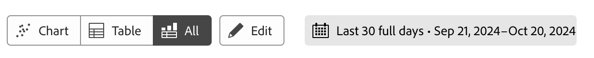

# Überblick über die geführte Analyse

Geführte Analysen ermöglichen es Benutzern, vom Marketing über das Produkt bis hin zu Analysten, hochwertige Daten und Einblicke über die Journey des Kunden mithilfe geführter Workflows bereitzustellen, die auf den kanalübergreifenden Daten von Customer Journey Analytics aufbauen. Ähnlich wie bei Analysis Workspace und Mobile Scorecards verwendet die geführte Analyse Daten aus einer [Datenansicht](/help/data-views/data-views.md), die Daten in Adobe Experience Platform über eine [Verbindung](../connections/overview.md) referenziert. Viele in der geführten Analyse erstellte Berichte können nahtlos in Analysis Workspace übertragen werden, um zusätzliche Forschungsarbeiten zu erhalten.

Die folgenden geführten Analysen sind verfügbar:

| Symbol | Analyse | Beschreibung |
| :----:|--- | --- |
|  | [Aktives Wachstum](types/active-growth.md) | Identifizieren Sie, wer neu ist, bleibt, zurückkehrt oder inaktiv ist. |
|  | [Konversions-Trends](types/conversion-trends.md) | Verfolgen Sie ie dVeränderungen der Konversionsraten im Laufe der Zeit. |
|  | [Interaktion](types/engagement.md) | Erfahren Sie mehr über Umfang und Tiefe der Funktionsinteraktion. |
|  | [Auswirkungen der ersten Verwendung](types/first-use-impact.md) | Messen Sie die Auswirkung der erstmaligen Verwendung von Funktionen auf Schlüsselindikatoren. |
|  | [Häufigkeit](types/frequency.md) | Messen Sie die Interaktion anhand der Nutzungshäufigkeit. |
|  | [Trichter](types/funnel.md) | Vergleichen Sie die Konversionsraten zwischen den Schritten. |
|  | [Nettowachstum](types/net-growth.md) | Gewinnen oder verlieren Sie Benutzende? |
|  | [Auswirkungen der Veröffentlichung](types/release-impact.md) | Vergleichen Sie die Leistung in gleichen Zeiträumen vor und nach der Veröffentlichung. |
|  | [Treue](types/retention.md) | Messen Sie die Rückkehrgewohnheiten Ihrer Benutzenden. |
|  | [Timeline](types/timeline.md) | Untersuchen Sie Muster in der Sitzungsaktivität. |
|  | [Trends](types/trends.md) | Messen Sie die Benutzerinteraktion im Zeitverlauf. |

## Zugriff

Sie können von der Customer Journey Analytics-Startseite aus auf die geführte Analyse zugreifen.

1. Wählen Sie **[!UICONTROL Geführte Analyse]** von der Startseite aus, wodurch Sie direkt zur [Trendanalyse](types/trends.md) gelangen.

   {style="border:1px solid gray"}

1. Wählen Sie **[!UICONTROL Neu erstellen]**, um die verschiedenen Ansichtsoptionen anzuzeigen und einen anderen Ausgangspunkt für Ihre Analyse auszuwählen.

   {style="border:1px solid gray"}

Sie können auch von einem Analysis Workspace-Projekt aus auf die geführte Analyse zugreifen.

1. Wählen Sie auf der Startseite **[!UICONTROL Leeres Projekt]** aus, um ein leeres Workspace-Projekt zu erstellen.

   {style="border:1px solid gray"}

1. Wählen Sie in der linken Leiste  **[!UICONTROL Geführte Analyse]** aus.

   {style="border:1px solid gray"}

1. Ziehen Sie eine neue Analyse auf die Workspace-Arbeitsfläche und wählen Sie dann **[!UICONTROL Erstellen]** aus, um die gewünschte Analyse zu erstellen (z. B. **[!UICONTROL Trends erstellen]**). Sie können eine vorhandene Analyse auch aus dem Bereich **[!UICONTROL Gespeichert]** auf die Workspace-Arbeitsfläche ziehen.

   

## Benutzeroberfläche

Die Schnittstelle für die geführte Analyse folgt einem Frage- und Antwortformat. Stellen Sie Ihre Frage in der Abfrageleiste. Anschließend erhalten Sie eine Antwort mit einem schriftlichen Einblick, einer Grafik und einer Tabelle. Anschließend können Sie die nächste Frage mit Analyse- und Visualisierungseinstellungen stellen.

Die geführte Analyse verwendet die folgenden Elemente der Benutzeroberfläche:

| Vorschau der Benutzeroberfläche | UI-Element | Beschreibung |
| --- | --- | --- |
| {style="border:1px solid gray"} | **[!UICONTROL Abfrageleiste]** | Konfigurieren Sie Ihre *Frage*, indem Sie die gewünschten Komponenten (Ereignisse, Eigenschaften und Segmente) auswählen, aus denen eine Analyse besteht. Die folgenden Optionen sind für alle Analysen verfügbar, mit zusätzlichen Einstellungen, die pro Ansicht verfügbar sind. <ul><li>**Ansicht**: Wählen Sie aus den Optionen aus, um zu einer neuen Analyse zu wechseln. Ihre Abfrageauswahlen bleiben innerhalb der für die neue Analyse zulässigen Grenzen.</li><li>**Ereignisse**: Die Ereignisse, die Sie messen möchten. Jede Analyse erzwingt unterschiedliche Beschränkungen für die Anzahl der Ereignisse, die Sie konfigurieren können.  Ereignisse werden manchmal als **[!UICONTROL Start- und Rückgabeereignisse]**, **[!UICONTROL Schritte]** oder **[!UICONTROL Schlüsselindikatoren]** bezeichnet. Ereignisse werden in der Analyse anhand von 1, 2, ... Wählen Sie  **[!UICONTROL Ereignis hinzufügen]** aus, um neue Ereignisse hinzuzufügen.</li><li>**[!UICONTROL Faktoren]**: Wenn verfügbar, können Sie Faktoren wie das Datum seit und das erste Mal angeben.</li><li>**Zählt als**: Die Zählmethode, die auf die ausgewählten Ereignisse angewendet werden soll. Wählen Sie aus dem Dropdown-Menü aus.</li><li>**Segmente**: Die Segmente, die Sie messen möchten. Jede Analyse erzwingt unterschiedliche Begrenzungen für die Anzahl der Segmente, die Sie konfigurieren können. Segmente werden in der Analyse anhand von A, B, ... Wählen Sie  **[!UICONTROL Hinzufügen eines Segments]** aus, um neue Segmente hinzuzufügen.</li><li>**[!UICONTROL Aufschlüsselung]**: Falls verfügbar, die Aufschlüsselung, die Sie auf die Analyse anwenden möchten.</li></ul>In einigen Einstellungen ist eine zusätzliche Konfiguration verfügbar.<ul><li>**Filter**: Verwenden Sie , um Ereignisse oder Segmente nach bestimmten Dimensionen einzugrenzen. Wenn eine Dimension ausgewählt wird, sind beide Standardfilterkriterien (z. B. **[!UICONTROL Entspricht]**, **[!UICONTROL Enthält]** oder **[!UICONTROL Endet mit]**) und die Top-1000-Dimensionswerte verfügbar. Wählen Sie  aus, um weitere Filter hinzuzufügen. Wählen Sie  aus, um einen Filter zu entfernen.</li><li>**Mehr Aktionen**: Verwenden Sie , um Aktionen wie<ul><li> **[!UICONTROL Umbenennen]**: Zum Umbenennen eines Ereignisses oder Segments.</li><li> **[!UICONTROL Duplizieren]**: Duplizieren Sie ein Ereignis oder Segment.</li><li> **[!UICONTROL Entfernen]**: Zum Entfernen eines Ereignisses, Segments oder einer Aufschlüsselung.</li><li> **[!UICONTROL Segment bearbeiten]**: Zum Bearbeiten eines Segments im [Filter-Builder](/help/components/filters/filter-builder.md).</li><li> **[!UICONTROL Zu Favoriten hinzufügen]**: Um das Segment zur Liste der Lieblingsfilter im [Filter-Manager](/help/components/filters/manage-filters.md) hinzuzufügen.</li><li> **[!UICONTROL Save as]**: Zum Speichern des Segments als neue Komponente. Im Dialogfeld **[!UICONTROL Segmente in Komponenten speichern]** können Sie einen Segmentnamen und eine Beschreibung angeben. Sie können  auswählen, um das neue Segment als Favoriten zu markieren. Wählen Sie **[!UICONTROL Speichern]** aus, um das Segment als neuen Filter zu speichern.</li><li> **[!UICONTROL Link-Start- und -Rückgabeereignisse]**.: zum Verknüpfen von Start- und Rückgabeereignissen in einer [Bindungsanalyse](types/retention.md).</li><li> **[!UICONTROL Aufheben der Verknüpfung von Start- und Rückgabeereignissen]**: Um die Verknüpfung von Start- und Rückgabeereignissen in einer [Bindungsanalyse](types/retention.md) aufzuheben.</li></ul></li></ul> |
| {style="border:1px solid gray"} | **[!UICONTROL Diagramm]** | Eine Visualisierung der zurückgegebenen Daten basierend auf Ihrer Eingabe aus der Abfrageleiste und den Einstellungen. Welche Visualisierung Sie sehen, hängt von der Ansicht und den Einstellungen über dem Diagramm ab. Das Diagramm enthält außerdem Folgendes: <ul><li>**QuickInfos**: Bewegen Sie den Mauszeiger über einen beliebigen Datenpunkt im Diagramm, um eine QuickInfo mit weiteren Informationen anzuzeigen.</li><li>**Legende**: Bewegen Sie den Mauszeiger über die Reihen der Diagrammlegende, um nach Möglichkeit Definitionen anzuzeigen, diese Reihe zu fokussieren und andere Reihen vorübergehend auszublenden. Wählen Sie eine Reihe in der Legende aus, um die Serie auszublenden.</li><li>**Anmerkungen**: Gültige [Anmerkungen](../components/annotations/overview.md) sind zwischen der Visualisierung und der Legende sichtbar. Dies wird als  in der konfigurierten Farbe der Anmerkung dargestellt. Analysiert, die Daten im Zeitverlauf anzeigen, platzieren das Symbol  unter dem konfigurierten Datumsbereich. Bei Analysen, die keine Daten im Zeitverlauf anzeigen, wird das Symbol  in der rechten unteren Ecke des Diagramms angezeigt.</li><li>**Aktionen auswählen**: Machen Sie die nächsten verfügbaren Aktionen verfügbar, indem Sie einen beliebigen Datenpunkt auswählen. Zu den Optionen gehört **Segment speichern**.</li></ul> |
| {style="border:1px solid gray"} | **[!UICONTROL Tabelle]** | Eine Tabellendarstellung der zurückgegebenen Daten basierend auf Ihrer Eingabe aus der Abfrageleiste und den Einstellungen. Zeilen in der Tabelle mit Ereignis (1, 2, ...) und Segmentkennungen (A, B, ...) als Referenz. Die Spalten in der Tabelle hängen von der Analyse über dem Diagramm ab. Die Tabelle enthält auch für jede Zeile: <ul><li>**Aktionen auswählen**: Schalten Sie  um, um eine Diagrammreihe für eine Zeile ein- oder auszublenden. Wählen Sie  für weitere Aktionen aus. Zu den Optionen gehört **Segment speichern**.</li></ul> |
| {style="border:1px solid gray"} | **[!UICONTROL Visualisierungseinstellungen]** | Optionen über dem Diagramm, mit denen Sie die nächste Frage stellen und anpassen können, wie das Diagramm und die Tabelle Daten zurückgeben sollen. Die folgenden Optionen stehen für alle Analysen zur Verfügung, wobei für jede Analyse zusätzliche Einstellungen verfügbar sind. <ul><li> **Diagrammeinstellungen**: Passen Sie die Anzeige Ihres Diagramms und Ihrer Tabelle an. Die verfügbaren Optionen hängen von der ausgewählten Analyse ab.</li><li> **Überlagerungseinstellungen**: Fügen Sie eine Überlagerung hinzu. Die verfügbaren Optionen hängen von der ausgewählten Analyse ab.</li><li> **[!UICONTROL Bucket-Einstellungen]**: Automatischer Bucket oder Anwendung benutzerdefinierter Behältereinstellungen auf die Daten. Die verfügbaren Optionen hängen von der ausgewählten Analyse ab.<li> **[!UICONTROL Einstellungen vergleichen]**: Vergleichen Sie Daten mit einem bestimmten Datumsbereich. Die verfügbaren Optionen hängen von der ausgewählten Analyse ab.</li><li> **[!UICONTROL Anzeigeeinstellungen]**: Wählen Sie aus, wie die Daten angezeigt werden sollen. Die verfügbaren Optionen hängen von der ausgewählten Analyse ab.<li> **Datumsbereich**: Eine Kalenderauswahl, mit der Sie den Datumsbereich der Analyse ermitteln können. Sie können auch ein Intervall für Trendanalysen auswählen, z. B. täglich, wöchentlich oder monatlich.</li><li> **Insights**: Kontextuelle Einblicke in Abhängigkeit von der von Ihnen angezeigten Analyse. Diese Erkenntnisse liefern Beobachtungen für die aktuelle Analyse. Wenn mehrere Erkenntnisse verfügbar sind, können Sie sie mithilfe der Pfeile auf der rechten Seite anzeigen. Mit dem Glühbirnensymbol oben rechts können Sie die Sichtbarkeit dieses Feldes umschalten.</li></ul> |
| {style="border:1px solid gray"} | **[!UICONTROL Menü]** In einem Projekt mit einer geführten Analyse verfügbar | Befehle oben rechts in einem geführten Analyseprojekt, die übergreifende Aktionen für Ihre Analyse bieten.<ul><li> ***Name der Datenansicht***: Ändern Sie die Datenansicht, die von der Analyse verwendet wird. Wenn Sie die Datenansicht ändern, ändern sich auch die verfügbaren Komponenten in der Abfrageleiste.</li><li> **Link kopieren**: Kopiert einen Link zur Analyse in die Zwischenablage. Sie werden vor der Freigabe zum Speichern aufgefordert.</li><li>**Freigeben**: Öffnet das Freigabe-Modal mit weiteren Optionen zur Freigabe für einzelne Benutzende oder Gruppen. Sie können eine Analyse für andere Benutzende freigeben oder einen Link generieren, um ihn für andere freizugeben.</li><li>**Speichern**: Speichert die Analyse. Wenn Sie eine neue Analyse speichern, wird das Dialogfeld **[!UICONTROL Analyse speichern]** angezeigt, das einen Namen und eine Beschreibung anfordert. Nach dem Speichern können Sie mit einem Dialogfeld **[!UICONTROL Analyse gespeichert]** Ihre Analyse freigeben.</li></ul>Wählen Sie  für weitere Aktionen, z. B.:<ul><li>**Speichern unter**: Speichert die Analyse getrennt von der aktuellen Analyse und erstellt eine Kopie. Es wird ein Dialogfeld angezeigt, das einen neuen Namen und eine neue Beschreibung anfordert.</li><li>**Nach Workspace exportieren**: Erstellt die aktuelle Geführte Analyseabfrage in Analysis Workspace erneut. Das Workspace-Projekt wird in einer neuen Registerkarte erstellt, wodurch Unterbrechungen beim Arbeiten mit der geführten Analyse verhindert werden. Es handelt sich um eine Kopie der Analyse, die nach dem Öffnen nicht mit der ursprünglichen Analyse synchronisiert bleibt. Verwenden Sie diesen Befehl, wenn Sie die Daten an Ihr Analyseteam übergeben oder tiefer in die Daten eintauchen möchten, als die Analyse zulässt.</li><li>**Diagramm in die Zwischenablage kopieren**: Kopiert die Diagrammgrafik in die Zwischenablage, um sie in andere Anwendungen einzufügen. Die Abfrageleiste und die Tabelle sind nicht in der Grafik enthalten.</li><li>**PNG herunterladen**: Lädt die Diagrammgrafik als `.png` herunter. Die Abfrageleiste und die Tabelle sind nicht in der Grafik enthalten.</li><li>**CSV herunterladen**: Lädt die Tabellendaten als `.csv` herunter. Die Abfrageleiste und das Diagramm sind nicht in der Datei enthalten.</li></ul> |
| {style="border:1px solid gray"} | **Menü**  In einer Visualisierung der geführten Analyse im Analysis Workspace verfügbar. | Befehle in der Visualisierung einer geführten Analyse in Analysis Workspace.<ul><li> **[!UICONTROL Diagramm]**: Damit wird nur das Diagramm der Analyse angezeigt.</li><li> **[!UICONTROL Tabelle]**: Damit wird nur die Tabelle der Analyse angezeigt.</li><li> **[!UICONTROL All]**: Zum Anzeigen von Diagrammen und Tabellen der Analyse.</li><li> **[!UICONTROL Bearbeiten]**: Zum Bearbeiten der Konfiguration der Analyse</li><li> **[!UICONTROL *Datumsbereich *]**: Zum Konfigurieren des Datumsbereichs für die Analyse.</li></ul> |

## Bereitstellung

Geführte Analysen sind in Customer Journey Analytics-Packages wie folgt enthalten:

| Paket | Verfügbare Analysen |
| --- | --- |
| [!UICONTROL Customer Journey Analytics-Add-ons] | Aktives Wachstum, Konversionstrends, Häufigkeit, Trichter, Nettowachstum, Treue, Trends |
| [!UICONTROL Customer Journey Analytics Foundation] | Trends |
| [!UICONTROL Customer Journey Analytics Select] | Foundation-Ansichten + aktives Wachstum, Konversionstrends, Häufigkeit, Trichter, Nettowachstum, Treue |
| [!UICONTROL Customer Journey Analytics Prime] | Ansichten + Interaktion, Auswirkung auf die erste Verwendung, Auswirkungen auf die Veröffentlichung, Timeline auswählen |
| [!UICONTROL Customer Journey Analytics Ultimate] | Prime-Ansichten |

{style="table-layout:auto"}

Produktprofiladministratoren können den Zugriff auf die geführte Analyse in der Adobe Admin Console hinzufügen oder entfernen.

1. Melden Sie sich bei der [Adobe Admin Console](https://adminconsole.adobe.com) an.
1. Wählen Sie in der Produktliste **[!UICONTROL Customer Journey Analytics]** aus.
1. Wählen Sie das gewünschte Produktprofil für die Berechtigungen aus, die Sie bearbeiten möchten.
1. Wählen Sie die Registerkarte **[!UICONTROL Berechtigungen]** und klicken Sie dann unter [!UICONTROL Berichterstellungs-Tools] auf **[!UICONTROL Bearbeiten]** .
1. Wählen Sie  neben **[!UICONTROL Geführter Analysezugriff]** in der Liste der [!UICONTROL Verfügbaren Berechtigungselemente] aus, wodurch sie zur Liste der [!UICONTROL Eingeschlossenen Berechtigungselemente] hinzugefügt wird.
1. Wählen Sie **[!UICONTROL Speichern]** aus.

Weitere Informationen finden Sie unter [Benutzerebenenzugriff](/help/technotes/access-control.md#user-level-access) .

>[!TIP]
>
>Manche Administratoren ziehen es vor, die Guided Analysis zu aktivieren und Analysis Workspace für neue Benutzer zum Customer Journey Analytics zu deaktivieren. Sobald diese Personen mit dem Produkt und Ihren Unternehmensdaten vertraut sind, können Sie dann den Zugriff auf Analysis Workspace aktivieren.
