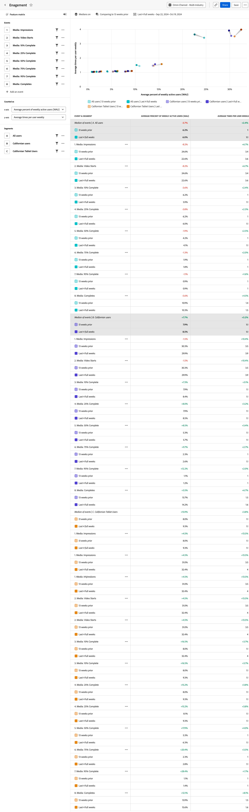

# Analyse [!UICONTROL Interaktion] {#engagement}

<!-- markdownlint-disable MD034 -->

>[!CONTEXTUALHELP]
>id="workspace_guidedanalysis_engagement_button"
>title="Interaktion"
>abstract="Erfahren Sie mehr über Umfang und Tiefe der Funktionsinteraktion."

<!-- markdownlint-enable MD034 -->

Die Analyse **[!UICONTROL Interaktion]** bietet Erkenntnisse zur Nutzungshäufigkeit einer Funktion gegenüber der Anzahl der Benutzenden der Funktion. Diese Analyse funktioniert am besten, wenn mehrere Funktionen miteinander verglichen werden. Sie hilft bei Investitionsentscheidungen, da sie vermittelt, welche Funktionen am wichtigsten, am leistungsfähigsten, einmalig oder fragwürdig sind.

Funktionen, die oben in dieser Visualisierung dargestellt werden, zeigen, dass sie häufig von interaktiven Benutzenden verwendet werden. Funktionen, die rechts neben dieser Visualisierung dargestellt werden, zeigen, dass sie von Ihren aktiven Benutzern weithin verwendet werden. Die mediane Häufigkeit, mit der eine Funktion verwendet wird, teilt das Diagramm horizontal. Der mittlere Prozentsatz der aktiven Benutzenden teilt das Diagramm vertikal. Die Medianwerte werden basierend auf den in der Abfrage ausgewählten Ereignissen und nicht auf Grundlage aller Daten berechnet.

* Funktionen oben links in der Matrix sind Ihre **leistungsstarken** Funktionen. Sie werden nicht weithin, aber häufig von interaktiven Benutzern verwendet.
* Funktionen oben rechts in der Matrix sind Ihre Funktionen mit **hoher Wirkung**. Sie werden weithin und häufig verwendet.
* Funktionen unten links in der Matrix sind Ihre Funktion mit **geringer Wirkung**. Sie werden nicht weithin oder häufig verwendet.
* Funktionen rechts unten in der Matrix sind Ihre **einmaligen** Funktionen. Sie werden weithin, aber nicht häufig verwendet.

>[!VIDEO](https://video.tv.adobe.com/v/3429489/&learn=on)

## Anwendungsfälle

Zu den Anwendungsfällen für diese Analyse gehören:

* **Interaktion nach Funktion**: Sie können eine direkte Korrelation zwischen der Interaktion und der Akzeptanz einer bestimmten Funktion herstellen. Wenn Sie wissen, welche Funktionen am häufigsten verwendet werden, können Sie feststellen, in welche Funktionen weiter investiert werden sollte.
* **Identifizierung zu wenig verwendeter Funktionen**: Funktionen mit wenigen aktiven Benutzenden, aber hoher Nutzung können auf eine leistungsstarke Funktion hinweisen, die nützlich ist, aber von der breiteren Population nicht entdeckt wurde bzw. nicht verwendet wird. Ziehen Sie in Betracht, die Auffindbarkeit dieser Funktionen zu verbessern, damit sie von mehr Benutzenden genutzt werden können.
* **Verbesserung beliebter Funktionen**: Funktionen mit vielen aktiven Benutzenden, aber geringer Nutzung können darauf hinweisen, dass eine Funktion häufig angefragt, aber nicht ausreichend genutzt wird. Diese Situationen sind Chancen, von Ihren Benutzenden mehr darüber zu erfahren, welche Verbesserungen die Funktion für sie wertvoller machen würden.
* **Erstellung funktionsbasierter Segmente**: Die Funktionsnutzung auf diese Weise darzustellen, eröffnet zusätzliche Analysemöglichkeiten. Erstellen Sie ein Segment für einen beliebigen Punkt im Diagramm, um sich diese Benutzergruppe genauer anzusehen und die gewonnenen Erkenntnisse auf Ihre Benutzerinteraktionsstrategie anzuwenden.
* **Funktionsakzeptanz durch A/B-Tests**: Vergleichen Sie die Nutzung mehrerer Funktionen durch verschiedene Benutzergruppen. Fügen Sie Segmente in der Abfrageleiste hinzu, um den Unterschied bei der Funktionsnutzung zwischen wichtigen Benutzergruppen zu ermitteln.

## Benutzeroberfläche

Einen Überblick über die Benutzeroberfläche für die geführte Analyse erhalten Sie unter [Benutzeroberfläche](../overview.md#interface). Die folgenden Einstellungen sind für diese Analyse spezifisch:

### Abfrageleiste

Mit der Abfrageleiste können Sie die folgenden Komponenten konfigurieren:

* **[!UICONTROL Ereignisse]**: Die Ereignisse, die Sie messen möchten. Jedes Ereignis stellt die Nutzung einer bestimmten Funktion dar und wird als Punkt innerhalb der Matrix angezeigt. Sie können bis zu zehn Ereignisse einbeziehen. Der Median wird anhand der ausgewählten Ereignisse berechnet.
* **[!UICONTROL Zählt als]**: Entlang der X-Achse können Sie den durchschnittlichen Prozentsatz der täglichen, wöchentlichen, monatlichen oder vierteljährlichen aktiven Benutzenden messen. Die Y-Achse passt die durchschnittliche Anzahl pro Benutzerin bzw. Benutzer basierend auf der Auswahl der X-Achse automatisch an.
* **[!UICONTROL Segmente]**: Die Segmente, die Sie messen möchten. Jedes ausgewählte Segment verdoppelt die Anzahl der grafisch dargestellten Punkte im Diagramm und in den Tabellenzeilen. Sie können bis zu drei Segmente einschließen.

>[!TIP]
>
>Wenn mehrere Ereignisse die Nutzung einer einzelnen Funktion darstellen, können Sie ein neues Ereignis ableiten, das die Funktion in Datenansichten darstellt.

### Diagrammeinstellungen

Die Analyse [!UICONTROL Interaktion] bietet die folgenden Diagrammeinstellungen, die im Menü über dem Diagramm angepasst werden können:

* **[!UICONTROL Mediane]**: Legen Sie fest, wo die Mittellinien angezeigt werden und wie die grafisch dargestellten Punkte mit diesen Medianen in Beziehung stehen.
   * **[!UICONTROL Standard]**: Zeigen Sie den absoluten Wert von Nutzung und Interaktion an.
   * **[!UICONTROL Normalisiert]**: Zeigen Sie die relativen Änderungen aus jedem Median an.
* **[!UICONTROL Überlagerung der Top-Ereignisse]**: Sehen Sie sich an, wie sich Ihre Ereignisse im Vergleich zu den 20 wichtigsten Ereignissen verhalten, basierend auf der Aktualität und Relevanz von Unternehmen und Benutzenden (derselbe Algorithmus wird auf die Ereignisauswahl in der Abfrageleiste angewendet).

### Zeitvergleich

{{apply-time-comparison}}

### Datumsbereich

Der gewünschte Datumsbereich für Ihre Analyse. Diese Einstellung umfasst zwei Komponenten:

* **[!UICONTROL Intervall]**: Die Datumsgranularität, nach der Trend-Daten angezeigt werden sollen. Diese Analyse behandelt [!UICONTROL Intervall] ähnlich wie [!UICONTROL Zählt als] in der Abfrageleiste. Stündlich aktive Benutzende werden nicht unterstützt.
* **[!UICONTROL Datum]**: Das Start- und Enddatum. Ihnen stehen rollierende Datumsbereichsvorgaben und zuvor gespeicherte benutzerdefinierte Bereiche zur Verfügung. Sie können auch die Kalenderauswahl verwenden, um einen festen Datumsbereich zu definieren.

<!--
## Example

See below for an example of the analysis.

-->
