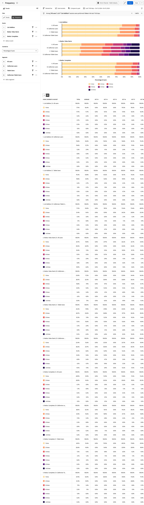

# Analyse [!UICONTROL Häufigkeit] {#frequency}

<!-- markdownlint-disable MD034 -->

>[!CONTEXTUALHELP]
>id="workspace_guidedanalysis_frequency_button"
>title="Häufigkeit"
>abstract="Zeigen Sie die Verteilung der Aktivität der zurückkehrenden Nutzenden für bestimmte Ereignisse an."

<!-- markdownlint-enable MD034 -->

Die  **[!UICONTROL Häufigkeit]**-Analyse gruppiert Ereignisdaten nach der Häufigkeit, mit der Ereignisse in Ihrem Produkt auftreten. Die vertikale Achse dieser Analyse enthält Buckets, die die Häufigkeit des Ereignisses darstellen. Die horizontale Achse misst die Anzahl der Benutzer oder Sitzungen für jeden Behälter.

>[!VIDEO](https://video.tv.adobe.com/v/3428089/?learn=on)

## Anwendungsfälle

Anwendungsfälle für diese Analyse sind:

* **Interaktion**: Verfolgen Sie, wie stark Benutzer mit beliebigen Ereignissen in Ihrem Produkt interagieren. Sie können auf einen beliebigen Teil des Balkendiagramms klicken, um ihn als Segment zu speichern. Segmente für Behälter mit geringer Interaktion können Ihnen dabei helfen zu ermitteln, warum Benutzende nicht mit dem Ereignis in der gewünschten Häufigkeit interagieren. Segmente für Behälter mit hoher Interaktion können Ihnen dabei helfen zu verstehen, warum Benutzer häufig mit dem Ereignis interagieren. Von dort aus können Sie andere Benutzer dazu ermutigen, ähnliches Verhalten anzunehmen.
* **Kundentreue**: Setzen Sie das Ereignis auf Bestellungen und die Metrik auf Benutzer . Mit dieser Analyse können Sie Benutzer gruppieren, nach der Häufigkeit, mit der sie innerhalb des angegebenen Datumsbereichs einen Kauf auf Ihrer Site getätigt haben.
* **Support-Optimierung**: Zeigen Sie die Anzahl der Support-Aufrufe oder offenen Fälle nach Benutzer an, um einen Einblick zu erhalten, welche Benutzer die meisten Probleme haben. Anschließend können Sie ein Segment erstellen, um sich auf die eigenen Erfahrungen zu konzentrieren und so die Probleme zu identifizieren und zu lösen.
* **Anmeldedienste**: Bei Benutzern mit geringer Interaktion ist die Abwanderung wahrscheinlicher. Wenn Sie das Verhalten von Benutzern mit hoher Interaktion verstehen, kann dies dazu beitragen, ein ähnliches Verhalten für Benutzer mit geringer Interaktion zu fördern, sodass es weniger wahrscheinlich ist, dass sie ihr Abonnement kündigen.

## Benutzeroberfläche

Siehe [Schnittstelle](../overview.md#interface) für einen Überblick über die Oberfläche der geführten Analyse. Die folgenden Einstellungen sind für diese Analyse spezifisch:

### Abfrageleiste

Mit der Abfrageleiste können Sie die folgenden Komponenten konfigurieren:

* **[!UICONTROL Ansicht]**: Wechseln Sie zwischen dieser Analyse und [Trends](trends.md).
* **[!UICONTROL Ereignisse]**: Die Ereignisse, die Sie messen möchten. Jedes ausgewählte Ereignis wird als separates Diagramm dargestellt. Der Tabelle wird eine Zeile hinzugefügt, die das Trend-Ereignis darstellt. Sie können bis zu fünf Ereignisse einbeziehen.
* **[!UICONTROL Zählt als]**: Die Zählmethode, die auf die ausgewählten Ereignisse angewendet werden soll.  Die Optionen umfassen [!UICONTROL Benutzer], [!UICONTROL Sitzungen], [!UICONTROL Prozentsatz der Benutzer] und [!UICONTROL Prozentsatz der Sitzungen]. Der Nenner für prozentualbasierte Metriken in dieser Analyse sind Benutzende oder Sitzungen, die die ausgewählten Ereignisse durchgeführt haben, nicht alle aktiven Benutzenden des Produkts.
* **[!UICONTROL Segmente]**: Die Segmente, die Sie messen möchten. Jedes ausgewählte Segment verdoppelt die Anzahl der Balken im Diagramm und der Zeilen in der Tabelle. Sie können bis zu fünf Segmente einbeziehen.

### Diagrammeinstellungen

Die [!UICONTROL Häufigkeit]-Analyse bietet die folgenden Diagrammeinstellungen, die im Menü über dem Diagramm angepasst werden können:

* **[!UICONTROL Diagrammtyp]**: Der Visualisierungstyp, den Sie verwenden möchten. Zu den Optionen gehören [!UICONTROL Horizontalbalken] und [!UICONTROL gestapelter Balken].

### Bucket-Einstellungen

Bestimmt, wie das Ereignis in Gruppen (Buckets) kategorisiert wird. In der Trend-Tabellenansicht werden Benutzer basierend auf der Häufigkeit der Verwendung insgesamt und in jedem Intervall in Buckets zusammengefasst, d. h. 1 Benutzer kann in verschiedenen Intervallen zu verschiedenen Buckets zählen.

* **[!UICONTROL Automatische Behälter]**: Ermitteln Sie automatisch die optimale Behälter-Größe basierend auf der Datenverteilung.
* **[!UICONTROL Angepasste Buckets]**: Passen Sie an, wie die Daten in Buckets gruppiert werden.
   * [!UICONTROL Von]: Der erste Bucket. Häufigkeit, die kleiner ist als dieser Wert, wird aus dem Bericht ausgeschlossen.
   * [!UICONTROL An]: Häufigkeit, die größer ist als dieser Wert, wird in den letzten Bucket gruppiert.
   * [!UICONTROL Size]: Das Bucket-Intervall.

### Zeitvergleich

{{apply-time-comparison}}

### Datumsbereich

Der gewünschte Datumsbereich für Ihre Analyse. Diese Einstellung umfasst zwei Komponenten:

* **[!UICONTROL Intervall]**: Die Datumsgranularität, nach der Trend-Daten angezeigt werden sollen. Das Diagramm und die Tabelle zeigen standardmäßig aggregierte Daten an, mit der Option, die Tabelle zu einer Trend-Ansicht zu erweitern. In der Trend-Ansicht werden Benutzer basierend auf der Häufigkeit der Verwendung insgesamt und in jedem Intervall in Buckets zusammengefasst, d. h. 1 Benutzer kann in verschiedenen Intervallen zu verschiedenen Buckets zählen.
* **[!UICONTROL Date]**: Das Start- und Enddatum. Rollierende Datumsbereichsvorgaben und zuvor gespeicherte benutzerdefinierte Bereiche stehen Ihnen zur Verfügung. Sie können auch den Kalenderselektor verwenden, um einen festen Datumsbereich auszuwählen.

<!--
## Example

See below foran example of the analysis.

-->
