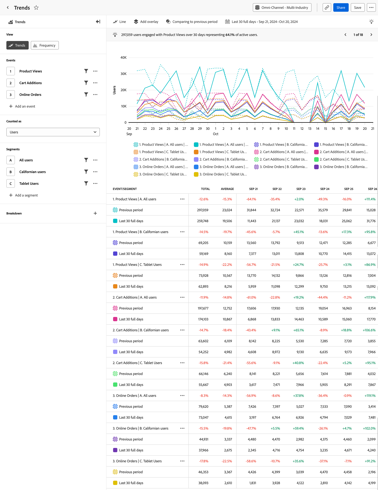

# Analyse [!UICONTROL Trends] {#trends}

<!-- markdownlint-disable MD034 -->

>[!CONTEXTUALHELP]
>id="workspace_guidedanalysis_trends_button"
>title="Trends"
>abstract="Messen Sie die Benutzerinteraktion im Zeitverlauf."

<!-- markdownlint-enable MD034 -->

Die Analyse  **[!UICONTROL Trends]** liefert wertvolle Erkenntnisse zur Leistung Ihres Produkts oder zum Verhalten Ihrer Benutzenden im Zeitverlauf. Die horizontale Achse dieses Berichts ist ein Zeitintervall, die vertikale Achse ein Maß für die gewünschten Ereignisse.

>[!VIDEO](https://video.tv.adobe.com/v/3421666/?quality=12&learn=on)

## Anwendungsfälle

Zu den Anwendungsfällen für diese Analyse gehören:

* **Bewertung der Produktleistung**: Anhand von Trends können Sie die Gesamtleistung Ihres Produkts über einen bestimmten Zeitraum bewerten. Durch die Analyse von Metriken wie Benutzerinteraktion, Akzeptanz oder Konversionsraten können Sie feststellen, ob sich die Leistung Ihres Produkts verbessert, sie stagniert oder abnimmt.
* **Funktionsübernahme**: Mithilfe der Analyse „Trends“ können Sie nachvollziehen, inwiefern Benutzende neue von Ihnen veröffentlichte Funktionen oder Aktualisierungen annehmen. Sie können feststellen, welche Funktionen beliebt sind und welche verbessert werden müssen. Diese Informationen ermöglichen es Ihnen, datengestützte Entscheidungen darüber zu treffen, welche Funktionen im Rahmen Ihrer Entwicklungsbemühungen zu priorisieren sind.
* **Benutzerverhalten**: Trends können Erkenntnisse zum Benutzerverhalten im Zeitverlauf geben. Durch die Untersuchung bestimmter Aktionen der Benutzenden können Sie Muster erkennen, an welchen Stellen Benutzende möglicherweise abspringen. Sie können Erkenntnisse aus dieser Analyse mit der Funktion [Trichter](funnel.md) kombinieren, um noch mehr über Verhaltensweisen zu erfahren.
* **A/B-Tests und Experimente**: Wenn Sie A/B-Tests innerhalb Ihres Produkts durchführen, können Sie mithilfe der Analyse „Trends“ ermitteln, welche Tests im Laufe der Zeit am erfolgreichsten sind.

## Benutzeroberfläche

Einen Überblick über die Benutzeroberfläche für die geführte Analyse erhalten Sie unter [Benutzeroberfläche](../overview.md#interface). Die folgenden Einstellungen sind für diese Analyse spezifisch:

### Abfrageleiste

Mit der Abfrageleiste können Sie die folgenden Komponenten konfigurieren:

* **[!UICONTROL Ansicht]**: Wechseln Sie zwischen dieser Analyse und der Analyse [Häufigkeit](frequency.md).
* **[!UICONTROL Ereignisse und Metriken]**: Die Ereignisse oder Metriken, die gemessen werden sollen. Jede Auswahl wird als Diagrammreihe und Tabellenzeile dargestellt. Ereignisse und Metriken können nicht in der Abfrage kombiniert werden. Wenn Sie Ihre erste Auswahl getroffen haben, muss jede andere verbleibende Abfrageauswahl vom gleichen Typ sein. Sie können bis zu fünf Auswahlen einschließen.
* **[!UICONTROL Zählt als]**: Die Zählmethode, die auf die ausgewählten Ereignisse angewendet werden soll. <ul><li>**[!UICONTROL Optionen]** umfassen [!UICONTROL Benutzer], [!UICONTROL Ereignisse], [!UICONTROL Sitzungen], [!UICONTROL Prozentsatz der Benutzer], [!UICONTROL Ereignisse pro Sitzung] und [!UICONTROL Ereignisse pro Benutzer].</li><li>[!BADGE B2B edition]{type=Informative url="https://experienceleague.adobe.com/de/docs/analytics-platform/using/cja-overview/cja-b2b/cja-b2b-edition" newtab=true tooltip="Customer Journey Analytics B2B Edition"} Zusätzliche **[!UICONTROL B2B-Optionen]** sind für Customer Journey Analytics B2B edition verfügbar: [!UICONTROL Globale Konten], [!UICONTROL Konten], [!UICONTROL Einkaufsgruppen], [!UICONTROL Opportunities], [!UICONTROL Prozentsatz der globalen Konten], ][!UICONTROL Prozentsatz der Käufe], [!UICONTROL Prozentsatz der Käufe][!UICONTROL , [!UICONTROL Ereignisse pro globalem Konto]Events,Events proEvents proAccount[!UICONTROL Events pro Einkaufsgruppe]Events und [!UICONTROL Events proGelegenheit] SegmentEvents proGelegenheit.</li></ul>Die Optionen „Zählt als“ gelten nur für Ereignisabfragen und sind für Metrikabfragen nicht verfügbar.
* **[!UICONTROL Segmente]**: Die Segmente, die Sie messen möchten. Jedes ausgewählte Segment verdoppelt die Anzahl der Diagrammreihen und Tabellenzeilen. Sie können bis zu fünf Segmente einschließen.
* **[!UICONTROL Aufschlüsselungseigenschaft]**: Hierdurch werden die Diagrammreihen und Tabellenzeilen nach den Werten der ausgewählten Eigenschaft aufgeschlüsselt. Es wird nur eine Aufschlüsselungseigenschaft unterstützt. Die Top-20-Werte werden in der Tabelle angezeigt und bis zu zehn Werte im Diagramm. Sie können eine Zeile im Diagramm ein- oder ausblenden, indem Sie das Symbol  umschalten.

### Diagrammeinstellungen

Die Analyse [!UICONTROL Trichter] bietet die folgenden Diagrammeinstellungen, die im Menü über dem Diagramm angepasst werden können:

* **[!UICONTROL Diagrammtyp]**: Der Visualisierungstyp, der verwendet werden soll. Zu den Optionen gehören „Linie“, „Balken“, „Gestapelter Balken“ und „Gestapelter Bereich“.

### Überlagerungen

Fügen Sie dem Diagramm zusätzliche Daten hinzu. Wenn mehr als eine Serie im Diagramm sichtbar ist, werden Überlagerungen nur beim Bewegen des Mauszeigers angezeigt.

* **[!UICONTROL Anomalieerkennung]**: Führt eine [Anomalieerkennung](/help/analysis-workspace/c-anomaly-detection/anomaly-detection.md) für die Trend-Analyse aus. Ausreißer werden als Punkte angezeigt. Wenn Sie den Mauszeiger darüber bewegen, erhalten Sie weitere Informationen.
* **[!UICONTROL Trend-Linienüberlagerung]**: Fügt dem Diagramm eine Trend-Linie hinzu, die dabei hilft, ein klareres Muster in den Daten darzustellen.
  * [!UICONTROL Linear]: Erstellt eine gerade Regressionslinie. Am besten geeignet für einfache lineare Daten, die konstant zunehmen oder abnehmen. Gleichung: `y = a + b * x`
  * [!UICONTROL Logarithmisch]: Erstellt eine gekrümmte Regressionslinie. Am besten geeignet für Daten, die schnell zunehmen oder abnehmen und dann glatter verlaufen. Gleichung: `y = a + b * log(x)`
  * [!UICONTROL Gleitender Mittelwert]: Erstellt eine glatte Trend-Linie basierend auf einer Reihe von Durchschnittswerten. Ein gleitender Mittelwert, der auch als angepasster Durchschnittswert bezeichnet wird, nutzt eine bestimmte Anzahl vorheriger Datenpunkte (bestimmt durch Ihre Auswahl), berechnet einen Durchschnittswert und verwendet diesen Durchschnittswert als Punkt auf der Linie. Beispiele sind ein gleitender Mittelwert über 7 Tage oder ein gleitender Mittelwert über 4 Wochen. Welche Optionen für den gleitenden Mittelwert verfügbar sind, hängt vom ausgewählten Intervall und Datumsbereich ab.

### Zeitvergleich

{{apply-time-comparison}}

### Datumsbereich

Der gewünschte Datumsbereich für Ihre Analyse. Diese Einstellung umfasst zwei Komponenten:

* **[!UICONTROL Intervall]**: Die Datumsgranularität, nach der Trend-Daten angezeigt werden sollen. Gültige Optionen sind „Stündlich“, „Täglich“, „Wöchentlich“, „Monatlich“ und „Quartalsweise“. Derselbe Datumsbereich kann unterschiedliche Intervalle aufweisen, die sich auf die Anzahl der Datenpunkte im Diagramm und die Anzahl der Spalten in der Tabelle auswirken. Bei einer Analyse über drei Tage mit täglicher Granularität werden beispielsweise nur drei Datenpunkte angezeigt, während eine Analyse über drei Tage mit stündlicher Granularität 72 Datenpunkte ergibt.
* **[!UICONTROL Datum]**: Das Start- und Enddatum. Ihnen stehen rollierende Datumsbereichsvorgaben und zuvor gespeicherte benutzerdefinierte Bereiche zur Verfügung. Sie können auch die Kalenderauswahl verwenden, um einen festen Datumsbereich zu definieren.

<!--

## Example

See below for an example of the analysis.

-->