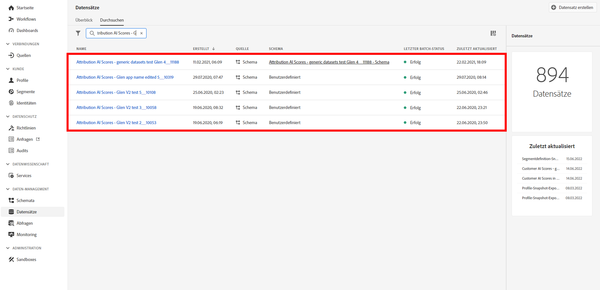

# Attribution AI mit CJA integrieren

>[!NOTE]
>
>Diese Seite befindet sich im Aufbau.

[Attribution AI](https://experienceleague.adobe.com/docs/experience-platform/intelligent-services/attribution-ai/overview.html?lang=en)ist als Teil von Adobe Experience Platform Intelligent Services ein algorithmischer Attributionsdienst mit mehreren Kanälen, der den Einfluss und die inkrementelle Auswirkung von Kundeninteraktionen auf bestimmte Ergebnisse berechnet. Mit Attribution AI können Marketing-Experten die Ausgaben für Marketing und Werbung messen und optimieren, indem sie die Auswirkungen jeder einzelnen Kundeninteraktion in jeder Phase der Journey verstehen.

Attribution AI unterstützt zwei Bewertungskategorien: algorithmisch und regelbasiert. Algorithmische Werte umfassen inkrementelle und beeinflusste Werte. Regelbasierte Werte umfassen Erstkontakt, Letztkontakt, Linear, U-förmig und Zeitverfall. Attribution AI unterstützt 3 Experience Platformen-Schemata: Erlebnisereignis, Adobe Analytics und Kundenerlebnisereignis.

Attribution AI kann in Customer Journey Analytics (CJA) integriert werden, soweit Attribution AI Modelle für Daten ausführt. Anschließend importiert CJA die Ausgabe dieser Modelle als Datensatz, der dann in den Rest Ihrer CJA-Datensätze integriert werden kann. Attribution AI-fähige Datensätze können dann in Datenansichten und Berichten in CJA genutzt werden.

## Workflow

Einige der Schritte werden in Adobe Experience Platform ausgeführt, bevor Sie mit der Ausgabe in CJA arbeiten.

### Schritt 1: Attribution AI-Bewertungen herunterladen

Laden Sie in Adobe Experience Platform Attribution AI-Bewertungen wie beschrieben herunter. [here](https://experienceleague.adobe.com/docs/experience-platform/intelligent-services/attribution-ai/getting-started.html?lang=en#downloading-attribution-ai-scores).

### Schritt 2: Erstellen einer Attribution AI-Instanz

Erstellen Sie in Experience Platform eine Attribution AI-Instanz, indem Sie Daten auswählen und zuordnen, Ereignisse definieren und Ihre Daten trainieren, wie beschrieben [here](https://experienceleague.adobe.com/docs/experience-platform/intelligent-services/attribution-ai/user-guide.html).

### Schritt 3: Einrichten einer CJA-Verbindung zu Attribution AI-Datensätzen

In Customer Journey Analytics können Sie jetzt [eine oder mehrere Verbindungen erstellen](/help/connections/create-connection.md) zu Experience Platform-Datensätzen, die für Attribution AI instrumentiert wurden. Diese Datensätze werden mit dem Präfix &quot;Attribution AI Scores&quot;angezeigt, wie im folgenden Beispiel:

### Schritt 4: Erstellen von Datenansichten basierend auf diesen Verbindungen

In Customer Journey Analytics:

## Unterschiede zwischen Attribution AI und Attribution IQ

Wann sollten Sie also die Attribution AI-Daten im Vergleich zu [Attribution IQ](/help/analysis-workspace/attribution/overview.md), eine native CJA-Funktion? Die folgende Tabelle zeigt einige Funktionsunterschiede:

| Funktionalität | Attributions-KI | Attribution IQ |
| --- | --- | --- |
| Teilzuordnung | Ja | Nein |
| Ermöglicht Benutzern, das Modell anzupassen | Nein | Ja |
| Funktioniert die Attribution über Kanäle (Hinweis: AAI verwendet nicht dieselben zugeordneten Daten wie CJA.) | Ja | Ja |
| Umfasst inkrementelle und beeinflusste Ergebnisse | Ja | Nein |
| HTML-Modellierung | Ja | Ja |
| ML-Modellierung mit Prognosen | Ja | Nein |

{style=&quot;table-layout:auto&quot;}
