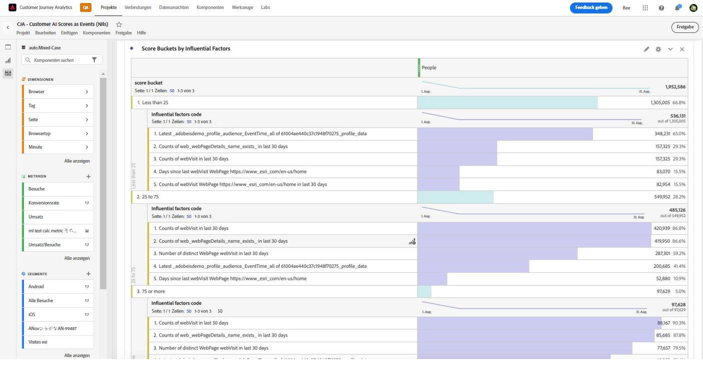

# Integrieren von Kunden-KI-Daten

{{release-limited-testing}}

[Customer AI](https://experienceleague.adobe.com/docs/experience-platform/intelligent-services/customer-ai/overview.html?lang=de) als Teil von Adobe Experience Platform Intelligent Services bietet Marketing-Experten die Möglichkeit, individuelle Kundenvorhersagen zu treffen.

Mithilfe von Einflussfaktoren kann Customer AI vorhersagen, was ein Kunde wahrscheinlich tun wird und warum. Darüber hinaus können Marketing-Experten von Prognosen und Einblicken durch Customer AI profitieren, um Kundenerlebnisse durch Bereitstellung der am besten geeigneten Angebote und Botschaften zu personalisieren.

Customer AI nutzt bei der Tendenzauswertung individuelle Verhaltensdaten und Profildaten. Customer AI ist flexibel und ermöglicht die Aufnahme aus mehreren Datenquellen, einschließlich Adobe Analytics, Adobe Audience Manager, Customer-Experience-Ereignisdaten und Erlebnisereignisdaten. Wenn Sie den Quell-Connector von Experience Platform verwenden, um Adobe Audience Manager- und Adobe Analytics-Daten aufzunehmen, zieht das Modell automatisch die standardmäßigen Ereignistypen heran, um das Modell zu trainieren und zu bewerten. Wenn Sie Ihren eigenen Erlebnisereignis-Datensatz ohne standardmäßige Ereignistypen aufnehmen, müssen alle relevanten Felder als benutzerdefinierte Ereignisse oder Profilattribute zugeordnet werden, wenn Sie ihn im Modell verwenden möchten. Dies kann im Kunden-KI-Konfigurationsschritt in Experience Platform durchgeführt werden.

Kunden-KI kann so weit in Customer Journey Analytics integriert werden, dass für Kunden-AI-aktivierte Datensätze in Datenansichten und Berichten in Customer Journey Analytics genutzt werden können. Sie haben folgende Möglichkeiten:

* **Tendenz-Scores für ein Segment von Benutzenden im Zeitverlauf nachverfolgen**. 
   * Anwendungsfall: Ermitteln der Wahrscheinlichkeit, dass Kundinnen und Kunden in einem bestimmten Segment konvertieren.
   * Beispiel: Eine Marketing-Fachkraft einer Hotelkette möchte die Wahrscheinlichkeit ermitteln, mit der ein Hotelkunde oder eine Hotelkundin ein Ticket für den Konzertsaal des Hotels kauft.
* **Analysieren, Sie welche Erfolgsereignisse oder Attribute mit Tendenz-Scores verknüpft sind**. &#x200B;
   * Anwendungsfall: Ermitteln der Attribute oder Erfolgsereignisse, die mit Tendenz-Scores verknüpft sind.
   * Beispiel: Eine Marketing-Fachkraft einer Hotelkette möchte ermitteln, wie der Kauf von Tickets für den Konzertsaal eines Hotels mit Tendenz-Scores verbunden ist.
* **Verfolgen des Eintrittsflusses für die Kundentendenz über verschiedene Scoring-Durchgänge hinweg**.
   * Anwendungsfall: Identifizieren von Personen, deren Konsumneigung anfangs niedrig war und im Laufe der Zeit stieg. 
   * Beispiel: Eine Marketing-Fachkraft einer Hotelkette möchte ermitteln, welche Hotelkundinnen oder -kunden ursprünglich als Personen mit geringer Tendenz zum Kauf eines Show-Tickets identifiziert wurden, aber im Laufe der Zeit zu Personen mit hoher Tendenz zum Kauf eines Show-Tickets wurden.
* **Betrachten der Verteilung der Tendenz**.
   * Anwendungsfall: Erkennen der Verteilung der Tendenz-Scores, um Segmente präziser zu definieren.
   * Beispiel: Ein Einzelhändler oder eine Einzelhändlerin möchte eine bestimmte Promotion mit einem Rabatt von 50 € für ein Produkt durchführen. Da das Budget begrenzt ist, soll nur eine sehr eingeschränkte Promotion durchgeführt werden. Die Person analysiert die Daten und entscheidet, nur die lukrativsten 80 % der Kundinnen und Kunden in die Promotion einzubeziehen.
* **Betrachten der Konsumtendenz, um im Laufe der Zeit eine Maßnahme für eine bestimmte Kohorte zu ergreifen**. 
   * Anwendungsfall: Nachverfolgen einer bestimmten Kohorte im Zeitverlauf.
   * Beispiel: Eine Marketing-Fachkraft einer Hotelkette möchte die Bronze-Ebene gegenüber der Silber-Ebene, oder die Silber-Ebene gegenüber der Gold-Ebene im Laufe der Zeit nachverfolgen. Danach kann sie die Tendenz jeder Kohorte für das Buchen im Hotel im Zeitverlauf betrachten.

Gehen Sie wie folgt vor, um Kunden-KI-Daten tatsächlich mit Customer Journey Analytics zu integrieren:

>[!NOTE]
>
>Einige der Schritte werden in Adobe Experience Platform ausgeführt, bevor die Ausgabe in Customer Journey Analytics verwendet wird.

## Schritt 1: Konfigurieren einer Customer AI-Instanz

Nachdem Sie Ihre Daten vorbereitet und alle Ihre Anmeldedaten und Schemata eingerichtet haben, folgen Sie der Anleitung [Konfigurieren einer Customer AI-Instanz](https://experienceleague.adobe.com/docs/experience-platform/intelligent-services/customer-ai/user-guide/configure.html?lang=de) in Adobe Experience Platform.

## Schritt 2: Einrichten einer Customer Journey Analytics-Verbindung mit Kunden-KI-Datensätzen

In Customer Journey Analytics können Sie jetzt [eine oder mehrere Verbindungen](/help/connections/create-connection.md) mit Experience Platform-Datensätzen erstellen, die für Kunden-KI eingerichtet wurden. Jede Vorhersage, z. B. „Wahrscheinlichkeit für ein Konto-Upgrade“, entspricht einem Datensatz. Diese Datensätze werden mit dem Präfix „Customer AI Scores in EE Format – Name_der_Anwendung“ angezeigt.

>[!IMPORTANT]
>
>Jede Kunden-KI-Instanz verfügt über zwei Ausgabedatensätze, vorausgesetzt der Umschalter zur Aktivierung von Scores für Customer Journey Analytics wurde bei der Konfiguration in Schritt 1 aktiviert. Ein Ausgabedatensatz wird im Profil-XDM-Format und einer im Experience Event XDM-Format angezeigt.

Hier ist ein Beispiel für ein XDM-Schema, das als Teil eines vorhandenen oder neuen Datensatzes über Customer Journey Analytics übermittelt werden würde:

(Beachten Sie, dass das Beispiel ein Profildatensatz ist. Derselbe Satz von Schemaobjekten wäre Teil eines Erlebnisereignis-Datensatzes, der von Customer Journey Analytics erfasst werden würde. Der Erlebnisereignis-Datensatz würde Zeitstempel als Bewertungsdatum enthalten.) Jeder in diesem Modell bewertete Kunde hätte einen Score, ein ScoreDate usw. ein mit ihm verknüpftes Score-Datum usw.

## Schritt 3: Erstellen von Datenansichten basierend auf diesen Verbindungen

In Customer Journey Analytics können Sie jetzt mit den Dimensionen (z. B. Score, Score-Datum, Wahrscheinlichkeit) und Metriken, die gemeinsam mit der von Ihnen eingerichteten Verbindung übermittelt wurden, [Datenansichten erstellen](/help/data-views/create-dataview.md).

## Schritt 4: Erstellen von Berichten zu CAI-Scores in Workspace

Erstellen Sie ein neues Projekt in Customer Journey Analytics Workspace und rufen Sie Visualisierungen ab.

### Verlauf der Tendenz-Scores

Im Folgenden finden Sie ein Beispiel für ein Workspace-Projekt mit CAI-Daten, in dem in einem gestapelten Balkendiagramm die Entwicklung von Tendenz-Scores für ein Benutzersegment im Zeitverlauf dargestellt wird:

### Tabelle mit Ursachen-Codes

In der folgenden Tabelle finden Sie die Ursachen-Codes dafür, warum ein Segment eine hohe oder eine niedrige Tendenz hat:

### Eintrittsfluss für die Kundentendenz

Dieses Flussdiagramm zeigt den Eintrittsfluss für die Kundentendenz in verschiedenen Scoring-Durchgängen:

### Verteilung der Tendenz-Scores

Dieses Balkendiagramm zeigt die Verteilung der Tendenz-Scores:

### Tendenzüberschneidungen

Dieses Venn-Diagramm zeigt die Tendenzüberschneidungen in verschiedenen Scoring-Durchgängen:

