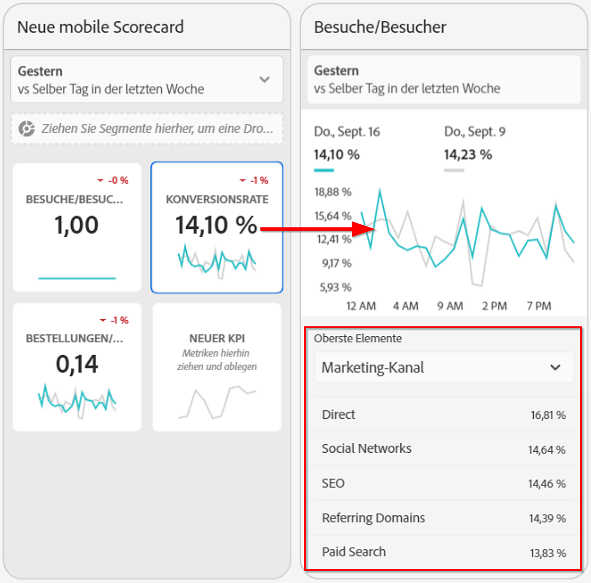
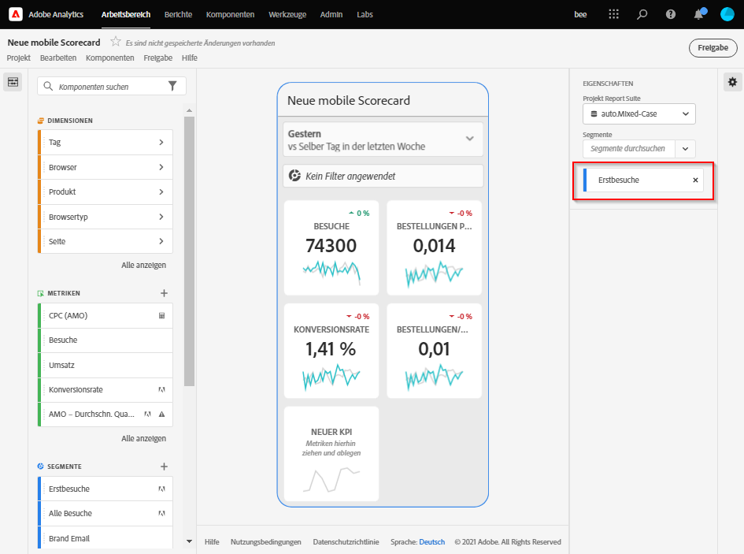
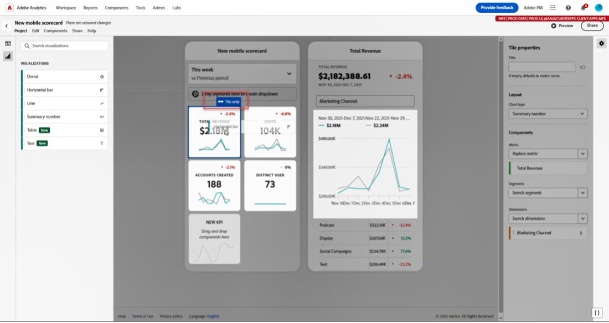
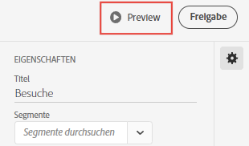
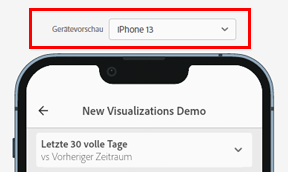
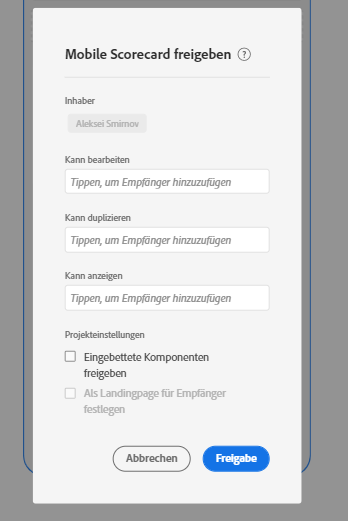
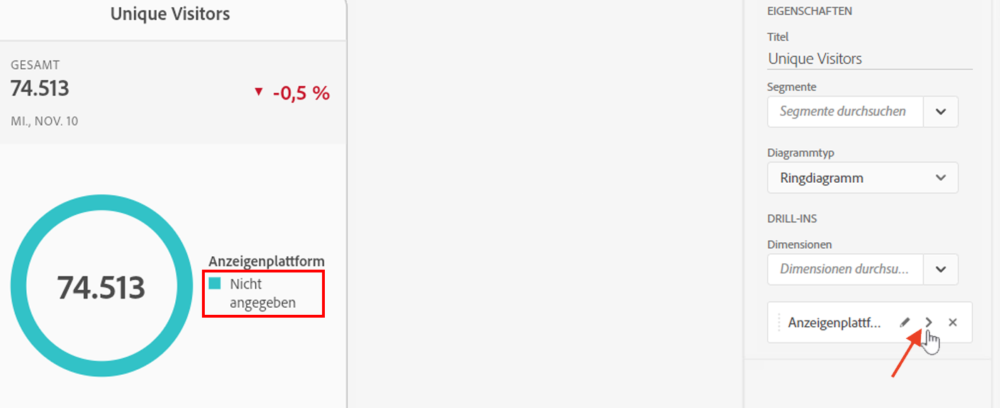

# Scorecards verwalten

In diesem Abschnitt erfahren Kuratoren von Customer Journey Analytics-Daten, wie sie Scorecard-Elemente anzeigen und verwalten können.

## Anzeigen und Konfigurieren von Kacheleigenschaften {#tiles}

Wenn Sie im Scorecard Builder auf eine Kachel klicken, zeigt die rechte Leiste die Eigenschaften und Merkmale an, die mit dieser Kachel und ihrer Detailfolie verbunden sind. In dieser Leiste können Sie einen neuen **Titel** für die Kachel erstellen und die Kachel konfigurieren, indem Sie Segmente anwenden.

## Anzeigen von Detailfolien {#view-detail-slides}

Wenn Sie auf Kacheln klicken, wird in einem dynamischen Popup-Fenster angezeigt, wie die Detailfolie für ausführende Benutzende in der Mobile App dargestellt wird. Sie können Dimensionen hinzufügen, um Ihre Daten für Ihre spezifischen Anforderungen aufzuschlüsseln. Wenn keine Dimension angewandt wurde, ist die Aufschlüsselungs-Dimension **Stunde** oder **Tage**, je nach dem standardmäßigen Datumsbereich.

Aufschlüsselungen verfeinern Ihre Analyse, indem sie die Metriken nach Dimensionselementen wie den folgenden aufschlüsseln:

* Metrik „Unique Visitors“ aufgeschlüsselt nach Anzeigenplattform (AMO-ID)
* Besuche aufgeschlüsselt nach Produktkategorie (Einzelhandel)
* Gesamtumsatz aufgeschlüsselt nach Produktnamen

Jede der Kachel hinzugefügte Dimension wird in einem Dropdown-Menü in der Detailansicht der App angezeigt. Der ausführende Benutzer kann dann aus den im Dropdown-Menü aufgelisteten Optionen auswählen.

## Anpassen von Detailfolien {#customize-detail-slide}

Benutzerdefinierte Detailansichten ermöglichen es Ihnen, Ihre Zielgruppe mit noch zielgerichteteren Informationen anzusprechen.

>[!BEGINSHADEBOX]

Unter  [Benutzerdefinierte Detailansichten](https://video.tv.adobe.com/v/3410002?quality=12&learn=on){target="_blank"} finden Sie ein Demovideo.

>[!ENDSHADEBOX]

Sie können das Layout für jede Detailfolie ändern und Text hinzufügen, um Endbenutzenden zu helfen, die Daten besser zu verstehen. Sie können auch über das Dropdown-Menü den Diagrammtyp ändern.

### Ändern des Folien-Layouts

Ändern Sie das Folien-Layout, um die Aufmerksamkeit der Betrachtenden zu fokussieren. Sie können beispielsweise das Layout so ändern, dass nur ein Diagramm oder nur eine Tabelle angezeigt wird. Um das Folien-Layout zu ändern, wählen Sie eines der vordefinierten Formate aus.

Sie können das Folien-Layout auch ändern, indem Sie Visualisierungskomponenten aus der linken Leiste auf die Arbeitsfläche ziehen und dort ablegen. Jede Detailfolie darf nur zwei Visualisierungen gleichzeitig enthalten.

### Hinzufügen von beschreibendem Text zu einer Folie

Sie können Text hinzufügen, um aussagekräftige Informationen über den Inhalt der Diagramme oder die Bedeutung von Daten bereitzustellen.

Um einer Detailfolie Text hinzuzufügen, wählen Sie ein Layout aus, für das das Symbol `T` angezeigt wird, oder ziehen Sie die Textvisualisierungskomponente aus der linken Leiste und legen Sie diese ab. Der Texteditor wird automatisch geöffnet, wenn eine neue Textvisualisierung hinzugefügt oder ein Folien-Layout mit Text ausgewählt wird. Der Texteditor bietet alle Standardoptionen zur Textformatierung, Sie können Textstile wie Absätze, Überschriften und Unterüberschriften anwenden und eine fett oder kursiv formatierte Schriftart auswählen. Sie können Text ausrichten sowie Listen mit Aufzählungszeichen, Nummerierungen und Links hinzufügen. Wenn Sie die Bearbeitung abgeschlossen haben, klicken Sie oben rechts im Texteditor auf die Schaltfläche „Minimieren“, um den Texteditor zu schließen. Um bereits hinzugefügten Text zu bearbeiten, wählen Sie zum erneuten Öffnen des Texteditors das Stiftsymbol aus.

## Entfernen von Komponenten {#remove}

Um eine Komponente zu entfernen, die auf die gesamte Scorecard angewendet wird, klicken Sie außerhalb der Kacheln auf eine beliebige Stelle auf der Scorecard. Entfernen Sie die dann die Komponente, indem Sie auf das **x** klicken, das angezeigt wird, wenn Sie den Mauszeiger über die Komponente bewegen, wie unten für die **Erstbesuche** dargestellt:

## Erstellen von Daten-Storys {#create-data-story}

Eine Daten-Story ist eine Sammlung unterstützender Datenpunkte, Geschäftskontexte und verwandter Metriken, die auf einem zentralen Thema oder einer zentralen Metrik basieren.

Wenn Sie sich beispielsweise auf den Webtraffic konzentrieren, können Besuche Ihre wichtigste Metrik sein. Neue Personen oder Unique Persons sind für Sie aber möglicherweise ebenfalls interessant. Vielleicht möchten Sie auch Daten sehen, die nach Web-Seite oder dem Gerätetyp aufgeschlüsselt sind, von dem der Traffic stammt. Daten-Storys in mobilen Scorecard-Projekten ermöglichen es Ihnen, die wichtigsten Metriken in den Vordergrund zu stellen und gleichzeitig die gesamte Story hinter den Metriken mithilfe mehrerer Detailfolien zu erzählen.

Sehen Sie sich das Video an, um mehr über das Erstellen von Daten-Storys in Mobile-Scorecard-Projekten in Analysis Workspace zu erfahren.

>[!BEGINSHADEBOX]

Siehe  [Daten-Storys für mobile Scorecard-Projekte](https://video.tv.adobe.com/v/3416392/?quality=12&learn=on){target="_blank"} für ein Demovideo.

>[!ENDSHADEBOX]

**Erstellen einer Daten-Story** {#data-story-create}

Erstellen Sie Ihre Daten-Story, indem Sie einer Kachel mehrere Detailfolien hinzufügen.

1. Beginnen Sie mit einem Mobile-Scorecard-Projekt.
1. Wählen Sie eine Kachel aus, anhand der Sie eine Story erstellen möchten.
   
   {width=".50%"}
1. Fügen Sie Folien hinzu, um Ihre Daten-Story zu erstellen. Die erste Folie wird standardmäßig generiert.
Um neue Folien hinzuzufügen, bewegen Sie den Mauszeiger über eine Folie oder klicken Sie auf sie. Wählen Sie dann eine der verfügbaren Optionen aus:
   * Tippen Sie auf das Pluszeichen (+), um eine neue Folie zu erstellen.
   * Tippen Sie auf das Duplizieren-Symbol, um die vorhandene Folie zu duplizieren.
1. Wenn Sie eine leere Folie erstellen, ziehen Sie Komponenten per Drag-and-Drop aus der linken Leiste oder wählen Sie ein Layout aus, um die Folie automatisch mit den Daten aus der Kachel aufzufüllen.
   
Um eine Folie zu löschen, tippen Sie auf das Papierkorbsymbol.

### Anpassen einer Daten-Story {#customize-data-story}

Mit Daten-Storys können Sie alles anpassen, sodass Sie Informationen, die Sie weitergeben möchten, freigeben und alles ausschließen können, was Sie nicht benötigen. Sie können Kacheln und einzelne Folien anpassen, um Segmente hinzuzufügen, Aufschlüsselungen anzuzeigen, das Layout zu ändern und die Visualisierungen zu ändern.

**Anpassen von Kacheln**

1. Tippen Sie auf eine Kachel. Die ausgewählte Kachel wird blau dargestellt, und im rechten Bereich werden die Kacheleigenschaften angezeigt.
1. Ändern Sie den Titel, den Diagrammtyp und andere Kacheloptionen.
1. Ziehen Sie eine Komponente auf die Kachel.
   
Wenn Sie eine Komponente, z. B. eine Visualisierung, per Drag-and-Drop auf eine Kachel ziehen, wird die Komponente auf alle Daten-Story-Folien angewendet.
1. Für eine reine Titeländerung halten Sie die Umschalttaste gedrückt, um die Änderung anzuwenden.
   

>[!NOTE]
>Folien übernehmen Komponenten von der Kachel, Kacheln übernehmen jedoch keine Komponenten von Folien.

**Anpassen einzelner Folien**

Sie können die Visualisierung für einzelne Folien in einer Daten-Story ändern. Sie können beispielsweise einen horizontalen Balken für eine bestimmte Folie in ein Ringdiagramm ändern. Sie können auch das Layout ändern. Siehe [Anpassen von Detailfolien](#customize-detail-slide).

### Vorschau einer Daten-Story {#preview-data-story}

Nachdem Sie eine Daten-Story erstellt haben, verwenden Sie die Schaltfläche **Vorschau**, um eine Daten-Story so anzuzeigen und mit ihr zu interagieren, als würden Sie eine App nutzen. Informationen zur Vorschau Ihrer Daten-Story finden Sie unter [Vorschau einer Scorecard](#preview)

### Navigieren zwischen Kacheln und Folien {#navigate-tiles-slides}

In der Navigationsleiste werden Symbole angezeigt, die für den Inhalt der einzelnen Folien stehen. Die Navigationsleiste erleichtert die Navigation zu einer bestimmten Folie, wenn viele Folien vorhanden sind.

Um zwischen der Kachel und den Folien zu wechseln, tippen Sie auf die Navigationsleiste.

{width="45%"}

Sie können auch hin und her navigieren, indem Sie die Pfeile auf der Tastatur verwenden oder eine Komponente auswählen und links bzw. rechts auf dem Bildschirm gedrückt halten, um einen Bildlauf durchzuführen.

## Anzeigen von Scorecards in einer Vorschau {#preview}

Sie können eine Vorschau davon anzeigen, wie die Scorecard nach ihrer Veröffentlichung in der Adobe Analytics-Dashboards-App aussieht und funktioniert.

1. Klicken Sie auf **[!UICONTROL Vorschau]** in der rechten oberen Ecke des Bildschirms.

   

1. Um anzuzeigen, wie die Scorecard auf verschiedenen Geräten aussehen wird, wählen Sie ein Gerät aus dem Dropdown-Menü [!UICONTROL Gerätevorschau].

   

1. Um mit der Vorschau zu interagieren, haben Sie folgende Möglichkeiten:

   * Klicken Sie mit der linken Maustaste, um das Tippen auf den Bildschirm des Smartphones zu simulieren.

   * Verwenden Sie die Bildlauffunktion Ihres Computers, um das Scrollen auf dem Bildschirm des Smartphones mit Ihrem Finger zu simulieren.

   * Klicken und halten Sie, um das Drücken und Halten des Fingers auf dem Bildschirm des Smartphones zu simulieren. Dies ist für die Interaktion mit den Visualisierungen in der Detailansicht nützlich.

## Freigeben von Scorecards {#share}

So geben Sie die Scorecard für eine Führungskraft frei:

1. Klicken Sie auf das Menü **[!UICONTROL Freigeben]** und wählen Sie **[!UICONTROL Scorecard freigeben]**.

1. Füllen Sie die Felder im Formular **[!UICONTROL Mobile Scorecard freigeben]** aus, indem Sie:

   * den Namen der Scorecard angeben
   * eine Beschreibung der Scorecard angeben
   * relevante Tags hinzufügen
   * die Empfänger der Scorecard angeben

1. Klicken Sie auf **[!UICONTROL Freigabe]**.

Nachdem Sie eine Scorecard freigegeben haben, können die Empfänger in den Analytics-Dashboards darauf zugreifen. Wenn Sie in Scorecard Builder nachträgliche Änderungen an der Scorecard vornehmen, werden diese automatisch in der freigegebenen Scorecard aktualisiert. Führungskräfte sehen die Änderungen, nachdem sie die Scorecard in ihrer App aktualisiert haben.

Wenn Sie die Scorecard durch Hinzufügen neuer Komponenten aktualisieren, sollten Sie die Scorecard erneut freigeben (und die Option zum **[!UICONTROL Freigeben eingebetteter Komponenten]** aktivieren), um sicherzustellen, dass die ausführenden Benutzer Zugriff auf diese Änderungen haben.

### Freigeben von Scorecards über einen Freigabe-Link

Die Verwendung eines Freigabe-Links erleichtert die Freigabe einer Scorecard in einer E-Mail-, Dokument- oder Textnachrichten-App. Über den Freigabe-Link können Empfängerinnen und Empfänger die Scorecard auf ihrem Desktop oder in der Dashboards-App öffnen. Deeplinks, die freigegeben werden können, erleichtern die Freigabe von Projekten und fördern die Interaktion mit Ihren Stakeholdern.

So geben Sie eine Scorecard über einen Freigabe-Link frei:

1. Klicken Sie auf das Menü **[!UICONTROL Freigeben]** und wählen Sie **[!UICONTROL Scorecard freigeben]**.

   

1. Kopieren Sie den Link und fügen Sie ihn in eine E-Mail-, Dokument- oder IM-App ein.

   Wenn der Link von einer Empfängerin oder einem Empfänger über eine Desktop-Anwendung oder einen Browser aufgerufen wird, wird das mobile Scorecard-Projekt in Workspace geöffnet.

   Wenn der Link von einer Empfängerin oder einem Empfänger auf einem Mobilgerät aufgerufen, wird die Scorecard direkt in der Adobe Analytics-Dashboards-App geöffnet.

   Wenn eine Empfängerin oder ein Empfänger die App nicht heruntergeladen hat, wird diese Person zur App-Liste im App Store oder Google Play Store weitergeleitet, wo sie sie herunterladen kann.

## Dimensionselement des Typs [!UICONTROL Nicht angegeben] entfernen {#remove-dims}

Wenn Sie Dimensionselemente des Typs [!UICONTROL Nicht angegeben] aus Ihren Daten entfernen möchten, gehen Sie wie folgt vor:

1. Wählen Sie die richtige Kachel aus.
1. Wählen Sie in der rechten Leiste unter **[!UICONTROL Drill-ins]** den Rechtspfeil neben dem Dimensionselement aus, für das Sie Elemente des Typs **[!UICONTROL Nicht angegeben]** entfernen möchten.

   

1. Klicken Sie auf das Symbol neben **[!UICONTROL Nicht angegeben]**, um nicht spezifizierte Daten aus Ihrem Reporting zu entfernen. (Sie können auch jedes andere Dimensionselement entfernen.)

## Anzeigen intelligenter Beschriftungen in Scorecards {#captions}

Intelligente Beschriftungen können Nicht-Analysten dabei helfen, ihre Daten ohne die Hilfe von Analysten besser zu verstehen. Intelligente Beschriftungen verwenden fortschrittliche Machine Learning-Algorithmen und generative KI, um wertvolle Erkenntnisse in natürlicher Sprache für Visualisierungen bereitzustellen.

Diese Untertitel wählen die wichtigsten statistischen Erkenntnisse aus den Daten aus und formulieren sie in natürlicher Sprache, wodurch Nicht-Analytiker ihre Datenkompetenz entwickeln können.

Intelligente Beschriftungen sind für alle Visualisierungen in der Mobile App verfügbar, einschließlich Linie, Ring, Balkendiagramm und Zusammenfassungsnummer.

So zeigen Sie intelligente Beschriftungen in einer mobilen Scorecard an:

1. Klicken Sie in einer Scorecard auf eine Kachel. Klicken Sie in dieser Scorecard beispielsweise unten in das Liniendiagramm.

   

1. Tippen Sie oben rechts auf das blaue Symbol, um die Beschriftungen zu generieren. Die Beschriftungen werden unter dem Liniendiagramm angezeigt.

   

1. Wischen Sie nach rechts, um alle intelligenten Beschriftungen anzuzeigen.

   Intelligente Beschriftungen können auf Datenspitzen, Anomalien, Trends, Rückgänge, Korrelationen und andere Phänomene verweisen.

1. Tippen Sie auf die schwarze Markierung in einer Beschriftung, um ein Problem zu melden, z. B. schädliche oder illegale Inhalte.

   

1. Klicken Sie auf das X, um das Dialogfeld **[!UICONTROL Berichtsergebnisse]** zu verlassen.
