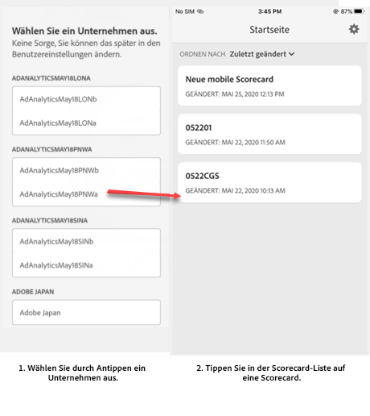
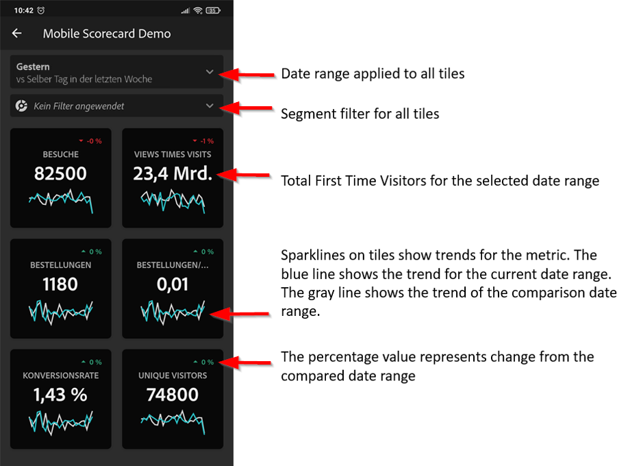
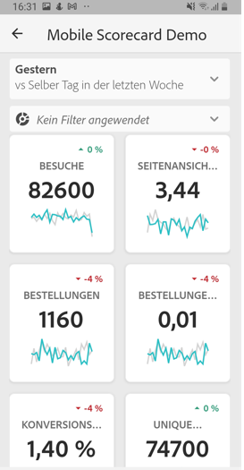
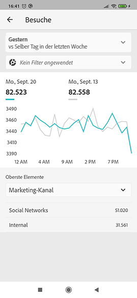
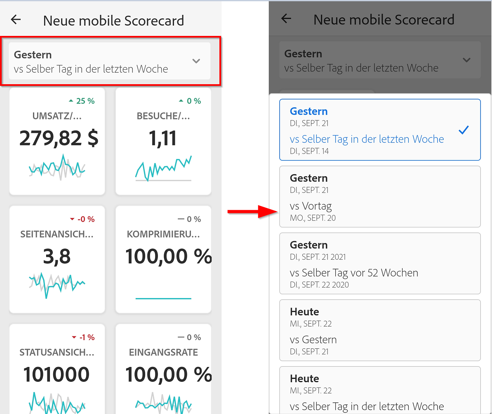
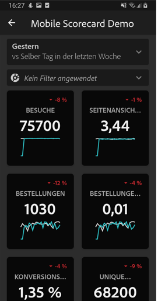
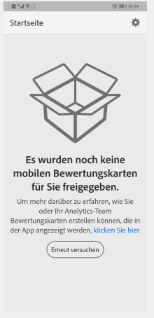

# Einrichten von Führungskräften für die Verwendung von Dashboards

In einigen Fällen benötigen die ausführenden Benutzer möglicherweise zusätzliche Hilfe, um auf die App zuzugreifen und sie zu verwenden. Dieser Abschnitt enthält Informationen, die Kuratoren bei der Bereitstellung dieser Hilfe unterstützen.

## Sicherstellen, dass Mobile-App-Benutzer Zugriff auf Adobe Analytics haben

1. Einrichten neuer Benutzer in der [CX Enterprise Admin Console](https://experienceleague.adobe.com/docs/analytics/admin/admin-console/permissions/product-profile.html?lang=de).

1. Um Scorecards freigeben zu können, müssen Sie App-Benutzern Berechtigungen für den Zugriff auf Scorecard-Komponenten wie Analysis Workspace, die Datenansichten, auf denen Scorecards basieren, sowie Segmente, Metriken und Dimensionen gewähren.

## Systemanforderungen von Mobile-App-Benutzern

Damit ausführende Benutzer Zugriff auf Ihre Scorecards in der Mobile App haben, müssen folgende Voraussetzungen gegeben sein:

* Auf ihren Geräten muss mindestens iOS-Version 10 oder Android-Version 4.4 (KitKat) installiert sein.
* Sie verfügen über eine gültige Anmeldung bei Customer Journey Analytics.
* Sie haben die mobilen Scorecards für Ihre Benutzer korrekt erstellt und freigegeben.
* Ihre Benutzer müssen Zugriff auf die Komponenten haben, die die Scorecard enthält. Sie können bei der Freigabe Ihrer Scorecards eine Option auswählen, um **[!UICONTROL eingebettete Komponenten freizugeben]**.

## Ausführenden Benutzern helfen, die Mobile App herunterzuladen und zu installieren

>[!NOTE]
>
>Obwohl die Mobile App im App Store Adobe Analytics Dashboard heißt, kann sie auch mit Customer Journey Analytics Mobile Scorecards verwendet werden.

**Für ausführende Benutzer mit iOS-Geräten:**

Klicken Sie auf den folgenden Link (er ist auch in Customer Journey Analytics unter **[!UICONTROL Tools]** > **[!UICONTROL Analytics-Dashboards (Mobile Opp)]** verfügbar) und befolgen Sie die Anweisungen zum Herunterladen, Installieren und Öffnen der App:

`[iOS link](https://apple.co/2zXq0aN)`

**Für ausführende Benutzer mit Android-Geräten:**

Klicken Sie auf den folgenden Link (er ist auch in Customer Journey Analytics unter **[!UICONTROL Tools]** > **[!UICONTROL Analytics-Dashboards (Mobile App)]** verfügbar) und befolgen Sie die Anweisungen zum Herunterladen, Installieren und Öffnen der App:

`[Android link](https://bit.ly/2LM38Oo)`

Nach dem Herunterladen und der Installation können sich ausführende Benutzer mit ihren bestehenden Customer Journey Analytics-Anmeldedaten bei der App anmelden. Wir unterstützen sowohl Adobe als auch Enterprise/Federated IDs.

## Ausführenden Benutzern helfen, auf Ihre Scorecard zuzugreifen

1. Fordern Sie die ausführenden Benutzer auf, sich bei der Mobile App anzumelden.

   Der Bildschirm **[!UICONTROL Unternehmen auswählen]** wird angezeigt. Auf diesem Bildschirm werden die Unternehmensanmeldungen angezeigt, die der ausführende Benutzer verwenden kann.

1. Fordern Sie sie auf, den Namen des Anmeldeunternehmens oder die CX Enterprise-Organisation anzutippen, der bzw. die für die von Ihnen freigegebene Scorecard gilt.

   Die Scorecard-Liste zeigt alle Scorecards an, die für den ausführenden Benutzer mit dieser Unternehmensanmeldung freigegeben wurden.

1. Helfen Sie den Benutzern, diese Liste ggf. nach der **[!UICONTROL zuletzt geänderten Scorecard]** zu sortieren.

1. Fordern Sie sie auf, den Namen der Scorecard anzutippen, die angezeigt werden soll.

   

### Scorecard-Benutzeroberfläche erläutern

Erklären Sie dem ausführenden Benutzer, wie die Kacheln in den von Ihnen freigegebenen Scorecards dargestellt werden.

Zusätzliche Informationen zu Kacheln:

* Die Granularität der Sparklines hängt von der Länge des Datumsbereichs ab:
* Für einen Tag wird ein stündlicher Trend angezeigt.
   * Für mehr als einen Tag und weniger als ein Jahr wird ein täglicher Trend angezeigt.
   * Für ein Jahr oder mehr wird ein wöchentlicher Trend angezeigt.
   * Die Formel für die Änderung des Prozentwerts ist: Gesamtwert der Metrik (aktueller Datumsbereich) – Gesamtwert der Metrik (Vergleichsdatumsbereich) / Gesamtwert der Metrik (Vergleichsdatumsbereich).
   * Sie können den Anzeigebereich nach unten ziehen, um die Scorecard zu aktualisieren.

1. Tippen Sie auf eine Kachel, um zu zeigen, wie eine detaillierte Aufschlüsselung für die Kachel funktioniert.

   

   * Tippen Sie auf einen beliebigen Punkt auf einer Sparkline, um Daten anzuzeigen, die diesem Punkt auf der Linie zugeordnet sind.

   * In einer Tabelle werden Daten zu den der Kachel hinzugefügten Dimensionen angezeigt. Tippen Sie auf den Abwärtspfeil, um Dimensionen auszuwählen. Wenn der Kachel keine Dimension hinzugefügt wurde, werden in der Tabelle Diagrammdaten angezeigt.

1. Um die Datumsbereiche für die Scorecard zu ändern, tippen Sie auf die Kopfzeile „Datum“ und wählen Sie die gewünschte Kombination aus Primär- und Vergleichsdatumsbereich aus.

   

## Mobile-App-Voreinstellungen ändern

Um die Voreinstellungen zu ändern, tippen Sie auf die Option **[!UICONTROL Voreinstellungen]** oben. In den Voreinstellungen können Sie die biometrische Anmeldung aktivieren oder Sie können die App wie folgt für den Dunkelmodus einstellen:

## Fehlerbehebung

Wenn sich der ausführende Benutzer anmeldet und eine Meldung angezeigt wird, dass nichts freigegeben wurde, kann das folgende Gründe haben:

* Der ausführende Benutzer hat möglicherweise die falsche Customer Journey Analytics-Sandbox ausgewählt oder
* eventuell wurde die Scorecard nicht für den ausführenden Benutzer freigegeben.

Vergewissern Sie sich, dass sich der ausführende Benutzer bei der richtigen Customer Journey Analytics-Sandbox anmelden kann und dass die Scorecard freigegeben wurde.
