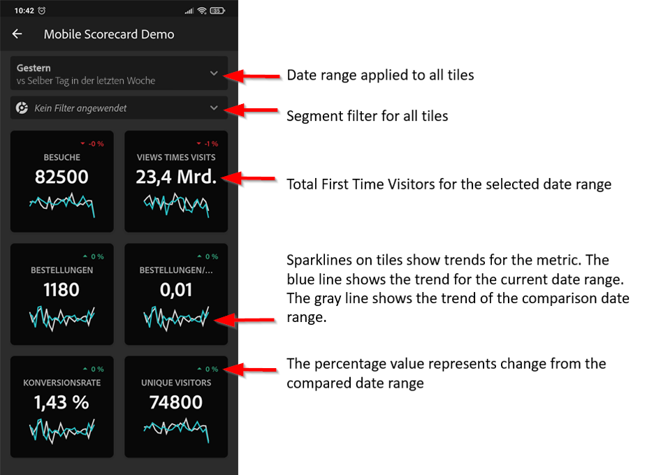
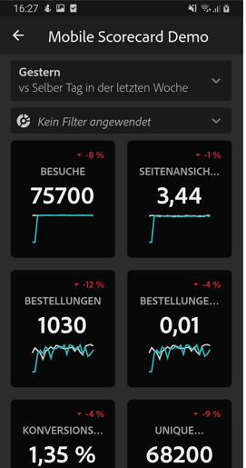
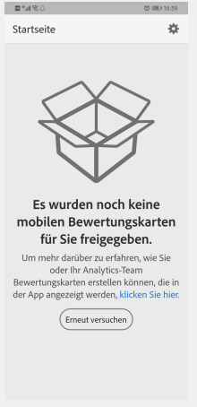

# Einrichten ausführender Benutzer für die Verwendung von Dashboards

In einigen Fällen benötigen die ausführenden Benutzer möglicherweise zusätzliche Hilfe, um auf die App zuzugreifen und sie zu verwenden. Dieser Abschnitt enthält Informationen, die Kuratoren bei der Bereitstellung dieser Unterstützung unterstützen.

## Sicherstellen, dass Mobile-App-Benutzer Zugriff auf Adobe Analytics haben

1. Richten Sie neue Benutzer in der [Experience Cloud-Admin Console](https://experienceleague.adobe.com/docs/analytics/admin/admin-console/permissions/product-profile.html?lang=en) ein.

1. Um Scorecards freigeben zu können, müssen Sie App-Benutzern Berechtigungen für den Zugriff auf Scorecard-Komponenten wie Analysis Workspace, die Report Suites, auf denen Scorecards basieren, sowie Segmente, Metriken und Dimensionen gewähren.

## Systemanforderungen von App-Benutzern

Um sicherzustellen, dass ausführende Benutzer Zugriff auf Ihre Scorecards in der App haben, stellen Sie Folgendes sicher:

* Auf den Geräten Ihrer Benutzer muss mindestens iOS-Version 10 oder Android-Version 4.4 (KitKat) installiert sein.
* Die Adobe Analytics-Anmeldeinformationen Ihrer Benutzer müssen gültig sein..
* Sie haben mobile Scorecards für sie korrekt erstellt und für diese freigegeben.
* Sie haben Zugriff auf die Komponenten, die die Scorecard enthält. Beachten Sie, dass Sie beim Freigeben Ihrer Scorecards für **[!UICONTROL Freigeben eingebetteter Komponenten]** eine Option auswählen können.

## Hilfe für Führungskräfte beim Herunterladen und Installieren der App

**Für ausführende Benutzer mit iOS-Geräten:**

Klicken Sie auf den folgenden Link (auch in Analytics unter **[!UICONTROL Tools]** > **[!UICONTROL Analytics-Dashboards (mobile App)]** verfügbar) und befolgen Sie die Anweisungen zum Herunterladen, Installieren und Öffnen der Applikation:

`[iOS link](https://apple.co/2zXq0aN)`

**Für ausführende Benutzer mit Android-Geräten:**

Klicken Sie auf den folgenden Link (auch in Analytics unter **[!UICONTROL Tools]** > **[!UICONTROL Analytics-Dashboards (mobile App)]** verfügbar) und befolgen Sie die Anweisungen zum Herunterladen, Installieren und Öffnen der Applikation:

`[Android link](https://bit.ly/2LM38Oo)`

Nach dem Herunterladen und der Installation können sich ausführende Benutzer mit ihren vorhandenen Adobe Analytics-Anmeldeinformationen bei der App anmelden. Adobe und Enterprise/Federated IDs werden unterstützt.

## Helfen Sie Führungskräften beim Zugriff auf Ihre Scorecard.

1. Lassen Sie ausführende Benutzer sich bei der App anmelden.

   Der Bildschirm **[!UICONTROL Unternehmen]** auswählen wird angezeigt. Auf diesem Bildschirm werden die Unternehmensanmeldungen angezeigt, die der ausführende Benutzer verwenden kann.

1. Bitten Sie sie, auf den Namen des angemeldeten Unternehmens oder der Experience Cloud-Organisation zu tippen, der für die von Ihnen freigegebene Scorecard gilt.

   In der Scorecard-Liste werden dann alle Scorecards angezeigt, die für den ausführenden Benutzer unter diesem Anmeldeunternehmen freigegeben wurden.

1. Lassen Sie sie diese Liste gegebenenfalls nach **[!UICONTROL Zuletzt geändert]** sortieren.

1. Lassen Sie sie auf den Namen der Scorecard tippen, um sie anzuzeigen.

   

### Scorecard-Benutzeroberfläche erläutern

Erklären Sie dem ausführenden Benutzer, wie Kacheln in den von Ihnen freigegebenen Scorecards angezeigt werden.

Zusätzliche Informationen zu Kacheln:

* Die Granularität der Sparklines hängt von der Länge des Datumsbereichs ab:
* Für einen Tag wird ein stündlicher Trend angezeigt.
   * Für mehr als einen Tag und weniger als ein Jahr wird ein täglicher Trend angezeigt.
   * Für ein Jahr oder mehr wird ein wöchentlicher Trend angezeigt.
   * Die Formel für die Änderung des Prozentwerts ist: Gesamtwert der Metrik (aktueller Datumsbereich) – Gesamtwert der Metrik (Vergleichsdatumsbereich) / Gesamtwert der Metrik (Vergleichsdatumsbereich).
   * Sie können den Anzeigebereich nach unten ziehen, um die Scorecard zu aktualisieren.

1. Tippen Sie auf eine Kachel, um zu zeigen, wie eine detaillierte Aufschlüsselung für die Kachel funktioniert.

   

   * Tippen Sie auf einen beliebigen Punkt auf einer Sparkline, um Daten anzuzeigen, die diesem Punkt auf der Linie zugeordnet sind.

   * In einer Tabelle werden Daten zu den der Kachel hinzugefügten Dimensionen angezeigt. Tippen Sie auf den Abwärtspfeil, um Dimensionen auszuwählen. Wenn der Kachel keine Dimension hinzugefügt wurde, werden in der Tabelle Diagrammdaten angezeigt.

1. Um die Datumsbereiche für die Scorecard zu ändern, tippen Sie auf die Kopfzeile „Datum“ und wählen Sie die gewünschte Kombination aus Primär- und Vergleichsdatumsbereich aus.

   

## App-Voreinstellungen ändern

Um die Voreinstellungen zu ändern, tippen Sie auf die Option **[!UICONTROL Voreinstellungen]** oben. In den Voreinstellungen können Sie die biometrische Anmeldung aktivieren oder Sie können die App wie folgt für den Dunkelmodus einstellen:

## Fehlerbehebung

Wenn sich der ausführende Benutzer anmeldet und eine Meldung angezeigt wird, dass nichts freigegeben wurde, kann das folgende Gründe haben:

* Der ausführende Benutzer hat möglicherweise die falsche Analytics-Instanz ausgewählt oder
* Die Scorecard wurde möglicherweise nicht für den ausführenden Benutzer freigegeben.

Stellen Sie sicher, dass sich der ausführende Benutzer bei der richtigen Adobe Analytics-Instanz anmelden kann und dass die Scorecard freigegeben wurde.

