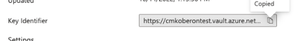

# Kundenseitig verwaltete Schlüssel

Adobe Customer Journey Analytics bietet Kundinnen und Kunden von [Healthcare Shield](https://www.adobe.com/trust/compliance/hipaa-ready.html) und Privacy &amp; Security Shield die Option, kundenseitig verwaltete Schlüssel (Customer-Managed Keys, CMK) für Customer Journey Analytics-Daten zu verwenden. Beachten Sie, dass dieser Prozess vom [Einrichten von Adobe Experience Platform-CMK](https://experienceleague.adobe.com/de/docs/experience-platform/landing/governance-privacy-security/customer-managed-keys/overview) getrennt ist. Kundenseitig verwaltete Schlüssel sind nur für Organisationen verfügbar, die das Add-on-Angebot für [Healthcare Shield oder Privacy &amp; Security Shield](https://experienceleague.adobe.com/de/docs/events/customer-data-management-voices-recordings/governance/healthcare-shield) gekauft haben.

## Einrichten von kundenseitig verwalteten Schlüsseln für Customer Journey Analytics unter Azure

Führen Sie die folgenden Schritte aus, um CMK für Customer Journey Analytics einzurichten, das auf Azure ausgeführt wird:

1. Stellen Sie sicher, dass Sie eine Berechtigung für Adobe Customer Journey Analytics-CMK haben und dass Ihre Organisation Adobe Experience Platform verwendet, das unter Azure ausgeführt wird. Sie können diese Berechtigungen überprüfen, indem Sie sich an Ihr Adobe-Accountteam wenden.
1. Stellen Sie sicher, dass Sie in Azure ein Administrator mit einer privilegierten Rolle sind, z. B. „Anwendungsadministrator“, „Cloud-Anwendungsadministrator“ oder „globaler Administrator“. Weitere Informationen finden Sie unter [Integrierte Microsoft Entra-Rollen](https://learn.microsoft.com/de-de/entra/identity/role-based-access-control/permissions-reference).
1. Erstellen Sie einen neuen Azure-Schlüsseltresor, der nur mit Customer Journey Analytics verwendet werden soll. Weitere Informationen finden Sie in der [Dokumentation zum Microsoft Azure-Schlüsseltresor](https://learn.microsoft.com/de-de/azure/key-vault/general/).
1. Gewähren Sie dem Adobe Azure-Programm Zugriff auf den Schlüssel im Schlüsseltresor. Sie können dazu eine der folgenden Methoden verwenden:
   * Berechtigungen über Autorisierungseinverständnis über die folgende URL erteilen: [https://login.microsoftonline.com/common/oauth2/authorize?response_type=code&amp;client_id=251e3919-1940-4296-bb8b-6b9a5e8a4805&amp;redirect_uri=https://experience.adobe.com&amp;scope=user.read](https://login.microsoftonline.com/common/oauth2/authorize?response_type=code&client_id=251e3919-1940-4296-bb8b-6b9a5e8a4805&redirect_uri=https://experience.adobe.com&scope=user.read)

   * Befolgen Sie die Anweisungen unter [Konfigurieren von kundenverwalteten Schlüsseln für ein vorhandenes Konto](https://learn.microsoft.com/de-de/azure/storage/common/customer-managed-keys-configure-cross-tenant-existing-account?toc=%2Fazure%2Fstorage%2Fblobs%2Ftoc.json&tabs=powershell-preview%2Cazure-portal#the-customer-grants-the-service-providers-app-access-to-the-key-in-the-key-vault). Die Adobe-Anwendungs-ID lautet:

     **`251e3919-1940-4296-bb8b-6b9a5e8a4805`**

1. Erstellen Sie ein Adobe-Kundenunterstützungs-Ticket, um die CMK-Einrichtung anzufordern. Fügen Sie den Azure-URI in Ihr Ticket ein. Der URI befindet sich im Feld **Schlüsselkennung** Ihres Azure-Schlüssels

   

1. Die Kundenunterstützung von Adobe bestätigt den Abschluss der CMK-Anwendung in Ihren Customer Journey Analytics-Daten.

Alle von Platform verwendeten Daten werden während der Übertragung und im Ruhezustand verschlüsselt, um Ihre Daten sicher zu halten – mit oder ohne kundenseitig verwalteten Schlüsseln. Informationen zur Verschlüsselung in Adobe Experience Platform finden Sie unter [Datenverschlüsselung in Adobe Experience Platform](https://experienceleague.adobe.com/de/docs/experience-platform/landing/governance-privacy-security/encryption).

## Einrichten von kundenseitig verwalteten Schlüsseln für Customer Journey Analytics in Amazon Web Services

>[!AVAILABILITY]
>
>Dieser Abschnitt gilt für Implementierungen von Experience Platform, die in Amazon Web Services (AWS) ausgeführt werden. Experience Platform, das in AWS ausgeführt wird, steht derzeit einer begrenzten Anzahl von Kundinnen und Kunden zur Verfügung. Weitere Informationen zur unterstützten Experience Platform-Infrastruktur finden Sie in der [Übersicht zur Experience Platform Multi-Cloud](https://experienceleague.adobe.com/de/docs/experience-platform/landing/multi-cloud).

Wenn Ihre Organisation Adobe Experience Platform in Amazon Web Services verwendet, ist CMK bereits für Sie konfiguriert. Es ist keine zusätzliche Einrichtung erforderlich.
