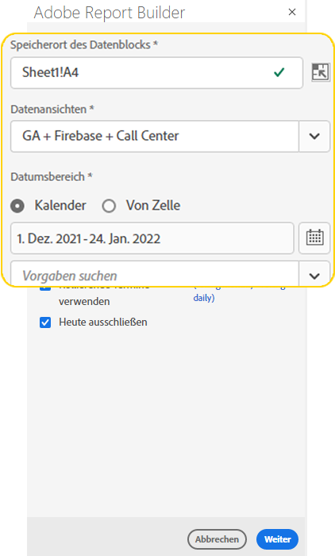
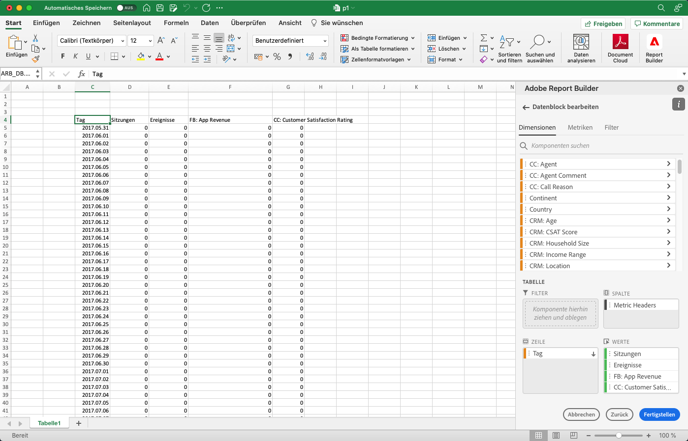
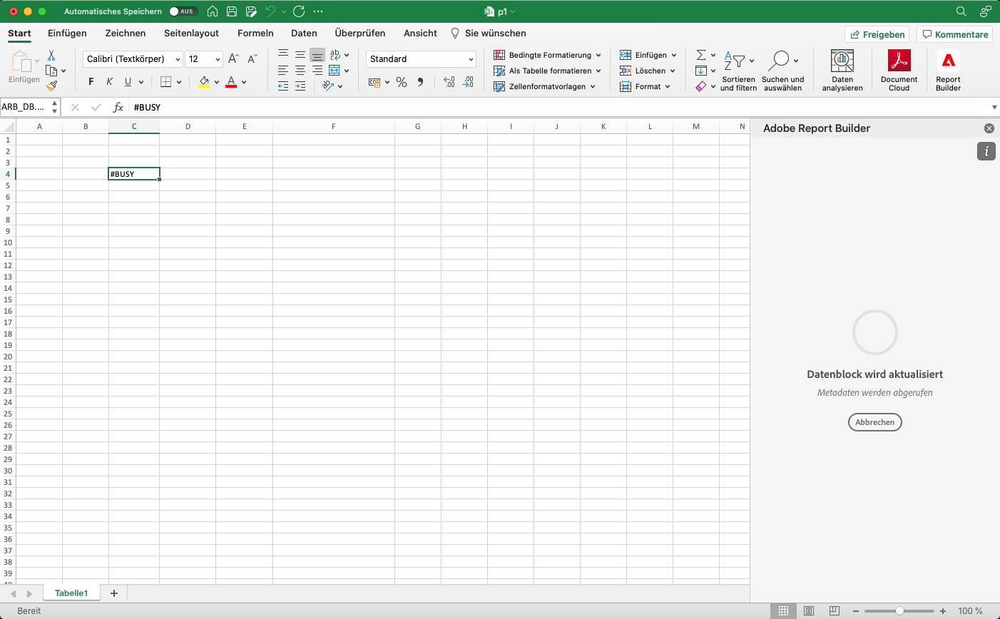
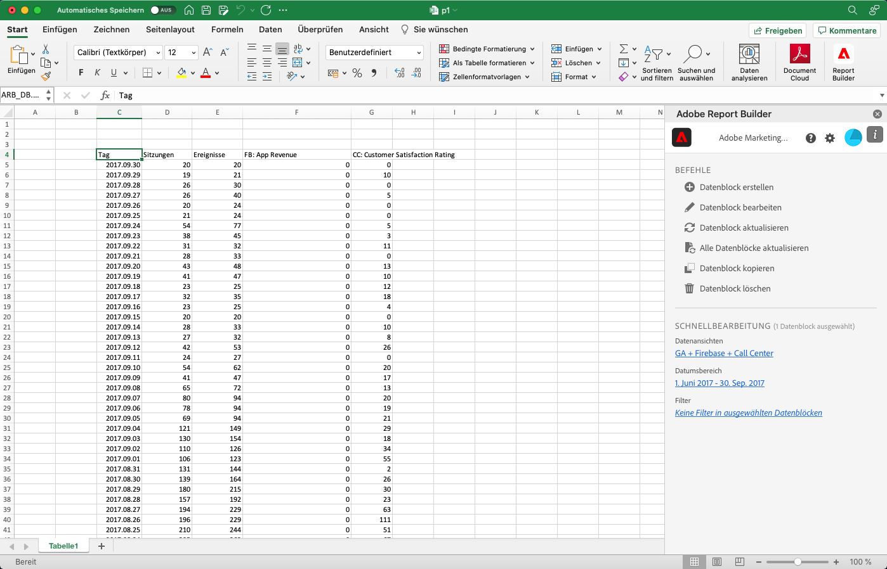

# Erstellen eines Datenblocks

Ein *Datenblock* ist die Datentabelle, die von einer einzelnen Datenanforderung erstellt wird. Eine Report Builder-Arbeitsmappe kann mehrere Datenblöcke enthalten. Wenn Sie einen Datenblock erstellen, konfigurieren Sie ihn zunächst und erstellen Sie dann den Build.

## Datenblock konfigurieren

Konfigurieren Sie die anfänglichen Datenblockparameter für die Position des Datenblocks, die Datenansichten und einen Datumsbereich.

1. Wählen Sie  **[!UICONTROL Erstellen]**.

   {zoomable="yes"}

1. Legen Sie den **[!UICONTROL Speicherort des Datenblocks]** fest.

   Die Option Datenblock-Speicherort definiert den Speicherort des Arbeitsblatts, an dem Report Builder die Daten zu Ihrem Arbeitsblatt hinzufügt.

   Um den Speicherort des Datenblocks anzugeben, wählen Sie eine einzelne Zelle im Arbeitsblatt aus oder geben Sie eine Zellenadresse ein, z. B. `a3`, `\\\$a3`, `a\\\$3` oder `sheet1!a2`. Die angegebene Zelle wird zur oberen linken Ecke des Datenblocks, wenn die Daten abgerufen werden.

   Verwenden , um eine Datenblockposition aus der aktuell ausgewählten Zelle im Blatt auszuwählen.

1. Wählen Sie die **[!UICONTROL Datenansichten]** aus.

   Mit der Option „Datenansichten“ können Sie eine Datenansicht aus einem Dropdown-Menü auswählen oder auf eine Datenansicht aus einer Zellenposition verweisen.

   Wählen Sie  aus, um eine Datenansicht aus einer Zelle zu erstellen.

1. Legen Sie den **[!UICONTROL Datumsbereich]** fest.

   Mit **[!UICONTROL Option]** Datumsbereich) können Sie einen Datumsbereich auswählen. Datumsbereiche können fest oder rollierend sein.

   Wählen Sie **[!UICONTROL Kalender]** aus, um einen Datenbereich mithilfe von  auszuwählen, oder geben Sie einen Datumsbereich manuell ein. Optional können Sie eine Vorgabe aus dem Dropdown **[!UICONTROL _Menü &quot;_]**&quot; auswählen.

   Wählen Sie **[!UICONTROL Aus Zelle]**, um Start- und Enddaten basierend auf einer Zelle im aktuellen Blatt zu definieren.

   Weitere Informationen zu Datumsbereichsoptionen finden Sie unter [Einen Datumsbereich auswählen](select-date-range.md).

1. Klicken Sie auf **[!UICONTROL Weiter]**.

   

   Nach der Konfiguration des Datenblocks können Sie Dimensionen, Metriken und Segmente auswählen, um Ihren Datenblock zu erstellen. Die **[!UICONTROL Dimensionen]**, **[!UICONTROL Metriken]** und **[!UICONTROL Segmente]** werden über dem Bereich **[!UICONTROL Tabelle]** angezeigt.

## Datenblock erstellen

Um den Datenblock zu erstellen, wählen Sie Berichtkomponenten aus und passen Sie dann das Layout an.

1. Fügen Sie **[!UICONTROL Dimensionen]**, **[!UICONTROL Metriken]** und **[!UICONTROL Segmente]** hinzu.

   Scrollen Sie in den Komponentenlisten oder verwenden Sie das Feld  **[!UICONTROL _Komponenten suchen_]**, um Komponenten zu finden. Ziehen Sie Komponenten per Drag-and[!UICONTROL Drop in den Bereich &#x200B;]Tabelle“ oder doppelwählen Sie einen Komponentennamen in der Liste aus, um die Komponente dem Bereich [!UICONTROL Tabelle] hinzuzufügen.

   Doppelklicken Sie auf eine Komponente, um sie einem Standardabschnitt der Tabelle hinzuzufügen.

   - Dimension-Komponenten werden dem Abschnitt  **[!UICONTROL Row]** oder dem Abschnitt  **[!UICONTROL Column]** hinzugefügt, wenn die Dimension bereits in den Spalten vorhanden ist.
   - Datumskomponenten werden dem Abschnitt  **[!UICONTROL Column]** hinzugefügt.
   - Segmentkomponenten werden zum Abschnitt **[!UICONTROL Segmente]** hinzugefügt.
   - Metrikkomponenten werden zum Abschnitt **[!UICONTROL Werte]** hinzugefügt.

1. Ordnen Sie die Elemente im Tabellenbereich an, um das Layout Ihres Datenblocks anzupassen.

   Ziehen Sie Komponenten per Drag-and-Drop in jede Liste im Tabellenbereich, um die Komponenten neu anzuordnen, oder wählen Sie  und wählen Sie  Nach oben,  Nach unten und mehr aus, um Komponenten innerhalb einer Liste zu verschieben.

   Wenn Sie Komponenten zur Tabelle hinzufügen, wird eine Vorschau des Datenblocks an der Stelle des Datenblocks im Arbeitsblatt angezeigt. Das Layout der Datenblock-Vorschau wird automatisch aktualisiert, wenn Sie in der Tabelle Elemente hinzufügen, verschieben oder entfernen.

   

1. Legen Sie optional das **[!UICONTROL Startdatum]** als Dimension fest, um das Startdatum Ihres Datenblocks zu identifizieren. Das Hinzufügen der Startdaten als Dimension ist hilfreich, wenn Sie einen regelmäßig terminierten Bericht mit einem rollierenden Datumsbereich haben. Oder wenn Sie einen unkonventionellen Datumsbereich haben und Sie das Startdatum explizit angeben müssen.

   

1. Optional können Sie Zeilen- und Spaltenüberschriften ein- oder ausblenden. Gehen Sie dazu wie folgt vor:

   1. Wählen Sie das Symbol **[!UICONTROL Tabelle]** Einstellungen aus.

      

   1. Aktivieren oder deaktivieren Sie die Option **[!UICONTROL Zeilen- und Spaltenüberschriften anzeigen]**. Die Kopfzeilen werden standardmäßig angezeigt.

1. Optional können Sie auch Dimensionsbeschriftungen und Metrikkopfzeilen ein- oder ausblenden. Gehen Sie dazu wie folgt vor:

   1. Wählen Sie  auf der Dimensionsbeschriftung oder in der Spaltenüberschrift aus, um das Kontextmenü anzuzeigen.

      

   1. Wählen Sie  **[!UICONTROL Hide]** oder  **[!UICONTROL Show]** aus, um die Dimensionsbeschriftung oder Spaltenüberschrift umzuschalten. Alle Beschriftungen werden standardmäßig angezeigt.

1. Wählen **[!UICONTROL Beenden]**, um die Konfiguration Ihres Datenblocks abzuschließen.

1. Eine Verarbeitungsmeldung **[!UICONTROL #BUSY]** wird angezeigt, während die Analysedaten abgerufen werden.

   

1. Report Builder ruft die Daten ab und zeigt den abgeschlossenen Datenblock im Arbeitsblatt an.

   

>[!MORELIKETHIS]
>
>[Datenansicht auswählen](select-data-view.md)
>[Datumsbereich auswählen](select-date-range.md)
>[Filterdimensionen](filter-dimensions.md)
>[Arbeiten mit Segmenten](work-with-filters.md)
>
