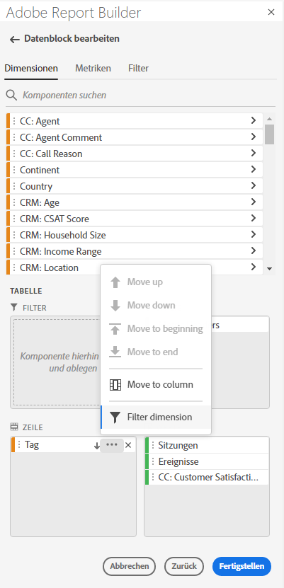
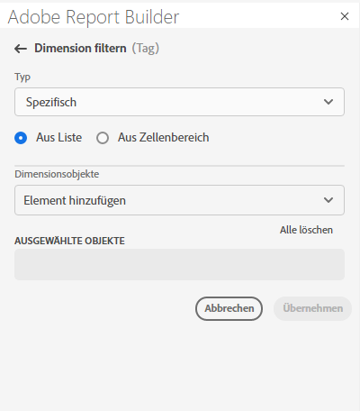
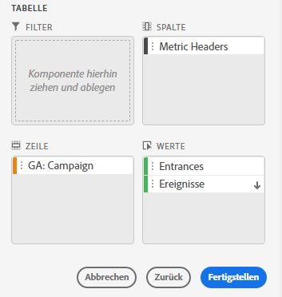
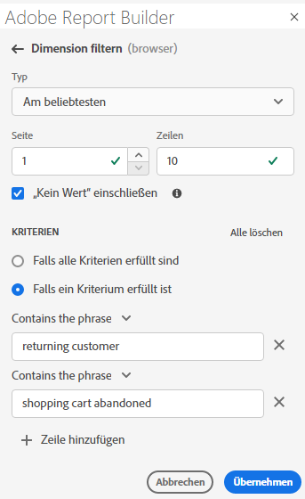
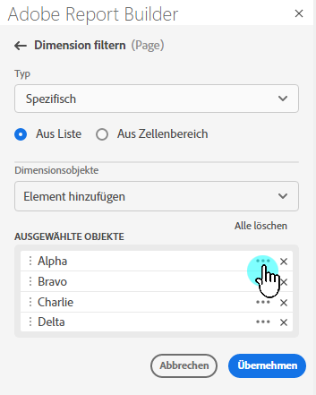
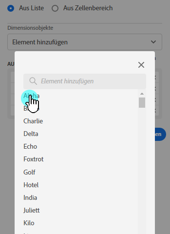
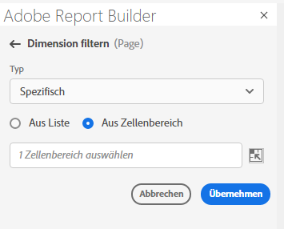

# Filterdimensionen

Standardmäßig gibt jedes Dimensionselement in der Tabelle die 10 wichtigsten Elemente für diese Dimension zurück.

So ändern Sie die für jede Dimension zurückgegebenen Dimensionselemente:

1. Eine Zelle im Datenblock auswählen.

1. Wählen  **[!UICONTROL Datenblock bearbeiten]** im Bedienfeld **[!UICONTROL Befehle]** aus.

1. Wählen Sie **[!UICONTROL Weiter]** aus, um die Registerkarte **[!UICONTROL Dimensionen]** anzuzeigen.

1. Wählen Sie  neben einem Komponentennamen in der Tabelle aus.

   {zoomable="yes"}

1. Wählen **[!UICONTROL Filterdimension]** im Popup-Menü aus, um den Bereich **[!UICONTROL Filterdimension]** anzuzeigen.

1. Wählen Sie **Am beliebtesten** oder **Spezifisch** als **[!UICONTROL Typ]**.

   {zoomable="yes"}

1. Wählen Sie je nach ausgewähltem [Filtertyp](#filter-type) die entsprechenden Optionen aus.

1. Wählen Sie **[!UICONTROL Anwenden]** aus, um den Filter hinzuzufügen.

1. Report Builder zeigt eine Benachrichtigung zur Bestätigung des hinzugefügten Filters an.

Um angewendete Filter anzuzeigen, bewegen Sie den Mauszeiger über eine Dimension. Dimensionen mit angewendeten Filtern zeigen Filter) neben dem Dimensionsnamen an.

## Filter und Sortierreihenfolge ändern

Neben  Sortieren des Datenblocks verwendet , wird ein „ArrowUp“ oder ArrowDown“ angezeigt. Die Pfeilrichtung gibt an, ob die Metrik in auf- oder absteigender Reihenfolge sortiert wird.

Sortierreihenfolge ändern:

- Wählen Sie  oder  neben der Metrik aus, um die Sortierreihenfolge umzuschalten.

So ändern Sie die zum Filtern und Sortieren des Datenblocks verwendete Metrik:

1. Bewegen Sie den Mauszeiger über die gewünschte Metrikkomponente im Tabellen-Builder, um zusätzliche Optionen anzuzeigen.

2. Wählen Sie ArrowDown) aus.

   {zoomable="yes"}

## Filtertyp

Es gibt zwei Möglichkeiten, Dimensionselemente zu filtern: [Am beliebtesten](#most-popular) und [Spezifisch](#specific-filtering)

### **[!UICONTROL Am beliebtesten]**

Mit **[!UICONTROL Option]** Am beliebtesten“ können Sie Dimensionselemente basierend auf Metrikwerten dynamisch filtern. „Am beliebtesten“ gibt die am höchsten bewerteten Dimensionselemente basierend auf Metrikwerten zurück. Standardmäßig werden die ersten 10 Dimensionselemente aufgelistet, sortiert nach der ersten Metrik, die zum Datenblock hinzugefügt wurde.

{zoomable="yes"}

#### Seiten- und Zeilenoptionen

Verwenden Sie die Felder **[!UICONTROL Seite]** und **[!UICONTROL Zeilen]**, um Daten in sequenzielle Gruppen oder Seiten zu unterteilen. Mit dieser Funktion können Sie andere Rangzeilenwerte als die höchsten Werte in Ihren Bericht ziehen. Und ist besonders nützlich, um Daten über die Zeilenbegrenzung von 50.000 hinaus abzurufen.

Der Standardwert für Seite ist `1` und für Zeilen ist `10`. Diese Standardwerte implizieren, dass jede Seite 10 Datenzeilen enthält. Seite 1 gibt die 10 wichtigsten Elemente zurück, Seite 2 die nächsten 10 Elemente usw.

In der folgenden Tabelle finden Sie Beispiele für Seiten- und Zeilenwerte sowie die resultierende Ausgabe.

| Seite | Zeile  | Ausgabe |
|------|--------|----------------------|
| 1 | 10 | Die 10 beliebtesten Elemente |
| 2 | 10 | Elemente 11-20 |
| 1 | 100 | Die 100 beliebtesten Elemente |
| 2 | 100 | Elemente 101-200 |
| 2 | 50.000 | Elemente 50.001-100.000 |

In der folgenden Tabelle sind die Mindest- und Höchstwerte für Seiten und Zeilen aufgeführt.

|       | Mindestwerte | Maximale Werte |
|-------|---------------:|---------------:|
| Start Seite | 1 | 50 Million |
| Anzahl Zeilen | 1 | 50.000 |

#### „Kein Wert“ einschließen

In Customer Journey Analytics erfassen einige Dimensionen den Eintrag *Kein Wert*. Mit **[!UICONTROL Einstellung „Kein Wert]**&quot; können Sie diese Werte aus Berichten ausschließen. Sie können beispielsweise eine Klassifizierung wie die Klassifizierung „Produktname“ basierend auf dem Produkt-SKU-Schlüssel erstellen. Wenn eine bestimmte Produkt-SKU nicht mit ihrer spezifischen Produktnamenklassifizierung eingerichtet wurde, wird ihr Produktnamenwert auf &quot;*Wert“*.

**[!UICONTROL Einschließen von „Kein Wert]** ist standardmäßig ausgewählt. Deaktivieren Sie diese Option, um Einträge ohne Wert auszuschließen.

#### Nach Kriterien filtern

Sie können Dimensionselemente danach filtern, ob alle Kriterien erfüllt sind oder ob überhaupt Kriterium erfüllt ist.

So legen Sie Filterkriterien fest:

1. Wählen Sie im Dropdown-Menü Operator einen Operator aus. Standardmäßig ist **[!UICONTROL Enthält den]**) ausgewählt

   {zoomable="yes"}

1. Geben Sie einen Suchbegriff ein.

1. Wählen Sie  **[!UICONTROL Zeile hinzufügen]** aus, um die Auswahl zu bestätigen und ein weiteres Kriterienelement hinzuzufügen.

1. Wählen Sie  aus, um ein Kriterienelement zu entfernen.

Sie können bis zu 10 Kriterienelemente einbeziehen.

### **[!UICONTROL spezifisch]**

Mit **[!UICONTROL Option]** können Sie für jede Dimension eine feste Liste von Dimensionselementen erstellen. Verwenden Sie den Filtertyp **[!UICONTROL Spezifisch]**, um die genauen Dimensionselemente anzugeben, die in Ihren Filter aufgenommen werden sollen. Sie können Elemente aus einer Liste oder aus einem Zellenbereich auswählen.

{zoomable="yes"}

#### Aus Liste

1. Wählen Sie die Option **[!UICONTROL Aus Liste]** aus, um nach Dimensionselementen zu suchen und diese auszuwählen.

   Wenn Sie die Option **Aus Liste** auswählen, wird die Liste **[!UICONTROL Dimension-]** Elemente&#39; mit Dimensionselementen gefüllt, sortiert nach der Anzahl der Ereignisse.

   {zoomable="yes"}

1. Geben Sie einen Suchbegriff in das Feld  **[!UICONTROL _Element hinzufügen_]** ein, um die Liste zu durchsuchen.

1. Um nach einem Element zu suchen, das in den letzten 90 Tagen nicht enthalten war, wählen Sie **[!UICONTROL Elemente für die letzten 6 Monate anzeigen]** aus, um die Suche zu erweitern. Nachdem die Daten der letzten 6 Monate geladen wurden, aktualisiert Report Builder den Link zu **[!UICONTROL Elemente für die letzten 18 Monate anzeigen]**.

1. Um ein Element aus der Liste **[!UICONTROL Ausgewählte Elemente]** zu löschen, wählen Sie  aus.

1. Um ein Element in der Liste **[!UICONTROL Ausgewählte Elemente]** zu verschieben, ziehen Sie das Element per Drag-and-Drop oder wählen Sie  aus, um das Kontextmenü anzuzeigen und aus den Optionen zum Verschieben auszuwählen.

1. Wählen Sie **[!UICONTROL Anwenden]** aus.

Report Builder aktualisiert die Liste, um die angewendeten spezifischen Filter anzuzeigen.

#### Aus Zellenbereich

Wählen Sie die Option **Aus Zellenbereich** aus, um einen Zellenbereich auszuwählen, der die Liste der abzugleichenden Dimensionselemente enthält.

{zoomable="yes"}

Beachten Sie bei der Auswahl eines Zellenbereichs die folgenden Einschränkungen:

- Der Bereich muss über mindestens eine Zelle verfügen.
- Der Bereich kann nicht mehr als 50.000 Zellen umfassen.
- Der Bereich muss sich in einer einzigen unterbrechungsfreien Zeile oder Spalte befinden.

Ihre Auswahl kann leere Zellen oder Zellen mit Werten enthalten, die nicht mit einem bestimmten Dimensionselement übereinstimmen.

### Schnelles Filtern einer Dimension

So filtern Sie eine Dimension, für die derzeit kein Filter angewendet wird:

1. Wählen Sie  für eine Dimension aus. Beispiel: **[!UICONTROL Interaktionskanal]**.

1. Doppelklicken Sie auf Dimensionselemente, die zum Filter hinzugefügt werden sollen. Alternativ können Sie ein oder mehrere Dimensionselemente auswählen und die Auswahl per Drag-and-Drop auf den Abschnitt  **[!UICONTROL Row]** ziehen.

   {zoomable="yes"}

