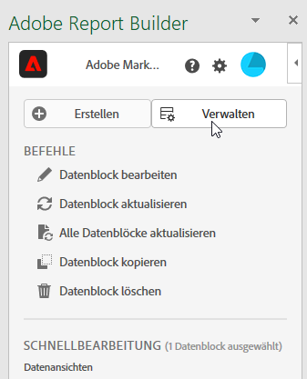
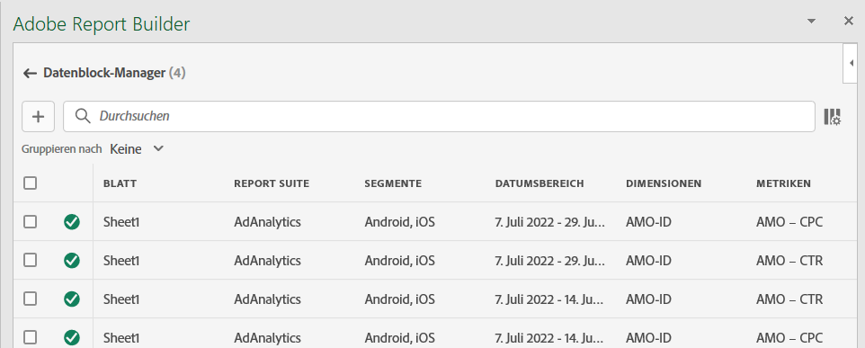
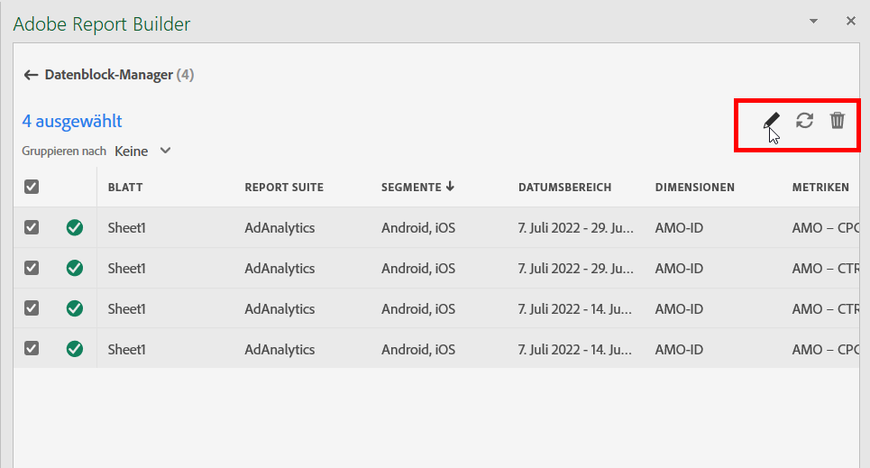
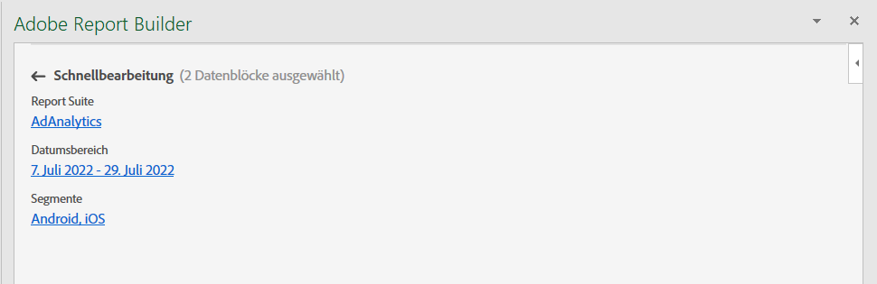
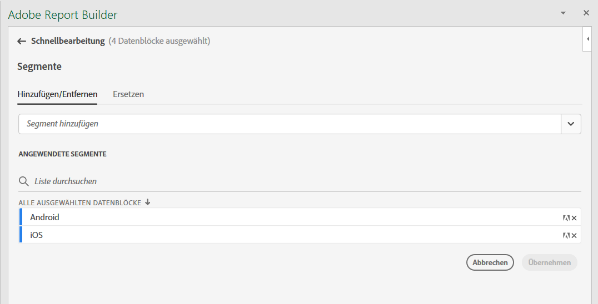
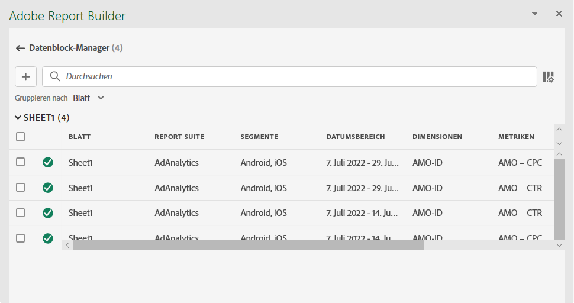

# Verwalten von Datenblöcken

Sie können alle Datenblöcke in einer Arbeitsmappe mit dem [!UICONTROL Datenblock-Manager“ anzeigen und ]. Der [!UICONTROL Datenblock-Manager] bietet Such-, Filter- und Sortierfunktionen, mit denen Sie bestimmte Datenblöcke finden können. Nach Auswahl eines oder mehrerer Datenblöcke können Sie diese bearbeiten, löschen oder aktualisieren.

## Datenblöcke anzeigen

Um eine Tabelle anzuzeigen, die alle Datenblöcke in einer Arbeitsmappe auflistet, wählen Sie  **[!UICONTROL Manage]**.

{zoomable="yes"}

Der **[!UICONTROL Datenblock-Manager]** zeigt eine Tabelle mit allen in einer Arbeitsmappe vorhandenen Datenblöcken an.

{zoomable="yes"}

Sie können mit  auswählen, welche Spalten angezeigt werden sollen.

## Datenblöcke sortieren

Sie können die Datenblocktabelle nach einer angezeigten Spalte sortieren. Sie können Datenblöcke beispielsweise nach Datenansichten, Segmenten, Datumsbereich und anderen Variablen sortieren.

Um die Datenblocktabelle zu sortieren, wählen Sie eine Spaltenüberschrift aus. Wählen Sie dieselbe Spaltenüberschrift aus, um die Sortierreihenfolge umzukehren.

## Datenblöcke suchen

Suchen Sie mithilfe Suche **[!UICONTROL _Suche_]** nach beliebigen Elementen in der Datenblocktabelle. Sie können beispielsweise nach Metriken suchen, die in den Datenblöcken oder in der Datenansicht enthalten sind. Sie können auch nach Datumsangaben suchen, die in den Spalten „Datumsbereich“, „Änderungsdatum“ oder „Datum des letzten Durchgang“ angezeigt werden.

## Datenblöcke bearbeiten

Sie können Datenansichten und Datumsbereiche in Datenblöcken bearbeiten. Oder die auf Datenblöcke angewendeten Segmente.

Sie können beispielsweise ein vorhandenes Segment in einem oder mehreren Datenblöcken durch ein neues Segment ersetzen.

1. Wählen Sie die zu aktualisierenden Datenblöcke aus. Sie können das Kontrollkästchen auf der obersten Ebene aktivieren, um alle Datenblöcke auszuwählen. Sie können aber auch einzelne Datenblöcke auswählen.

   {zoomable="yes"}

1. Wählen Sie  aus, um das Fenster **[!UICONTROL Schnellbearbeitung]** anzuzeigen.

   {zoomable="yes"}

1. Wählen Sie einen Link aus, um Datenansichten, Datumsbereiche oder Segmente zu aktualisieren. In **[!UICONTROL Schnellbearbeitung]** - **[!UICONTROL Segmente]** können Sie die Segmente für die ausgewählten Datenblöcke hinzufügen, entfernen oder aktualisieren.

   {zoomable="yes"}

## Datenblöcke aktualisieren

Wählen Sie , um die Datenblocktabelle zu aktualisieren.

Um zu überprüfen, ob ein Datenblock aktualisiert wurde, rufen Sie das Aktualisierungsstatus-Symbol auf:

- Ein erfolgreich aktualisierter Datenblock zeigt einen  an.

- Bei einem Datenblock, der nicht aktualisiert werden konnte, wird ein  angezeigt.

## Datenblöcke löschen

Löschen eines oder mehrerer Datenblöcke:

1. Einen oder mehrere Datenblöcke auswählen.
1. Wählen Sie  aus.
1. Wählen Sie **[!UICONTROL Dialogfeld]** Datenblock löschen **** oder **[!UICONTROL Abbrechen]**, um den Löschvorgang abzubrechen.

## Datenblöcke gruppieren

Sie können Datenblöcke mithilfe des Dropdown-Menüs **[!UICONTROL Gruppieren nach]** gruppieren oder einen Spaltentitel auswählen.

Um Datenblöcke nach Spalten zu sortieren, wählen Sie den Spaltentitel aus. Um Datenblöcke nach Gruppen zu gruppieren, wählen Sie einen Gruppennamen aus dem Dropdown-Menü **[!UICONTROL Gruppieren nach]** aus. Der folgende Screenshot zeigt beispielsweise Datenblöcke, die nach Datenansicht gruppiert sind.

Sie können Gruppierung verwenden, um schnell Datenblöcke auszuwählen, für die Sie ein gemeinsames Element ändern möchten, z. B. ein Segment.

{zoomable="yes"}

