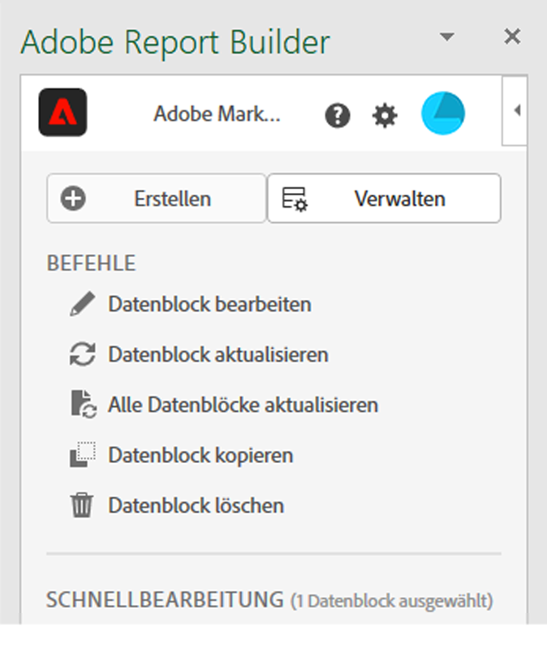

# Report Builder-Hub

Der Report Builder-Hub ist der rechte Bereich, der in Ihrer Excel-Arbeitsmappe angezeigt wird, wenn Sie  **[!UICONTROL Report Builder]** in der Excel-Multifunktionsleiste auswählen.

Verwenden Sie den Report Builder-Hub, um Datenblöcke zu erstellen, zu aktualisieren, zu löschen und zu verwalten.

Der Report Builder-Hub enthält die Schaltflächen  **[!UICONTROL Create]**,  **[!UICONTROL Manage]** und **[!UICONTROL Schedule]**, das **[!UICONTROL Commands]**-Bedienfeld und das **[!UICONTROL Quick Edit]**-Bedienfeld.

{zoomable="yes"}

Auswählen

*  **[!UICONTROL Create]**, um [neue Datenblöcke zu erstellen](create-a-data-block.md).
*  **[!UICONTROL Manage]** zum [Verwalten vorhandener Datenblöcke](manage-reportbuilder.md).
*  **[!UICONTROL Zeitplan]** zum [Verwalten von Zeitplänen zum Senden Ihrer Arbeitsmappe per E-Mail](schedule-reportbuilder.md).

## Befehlsfenster

Verwenden Sie das Bedienfeld **[!UICONTROL Befehle]**, um auf Befehle zuzugreifen, die mit den ausgewählten Zellen oder einer vorherigen Aktion kompatibel sind.

| Befehle | Verfügbar wenn… | Zweck |
|------|------------------|--------|
|  **[!UICONTROL Datenblock bearbeiten]** | Die ausgewählte Zelle bzw. der ausgewählte Zellenbereich ist nur Teil eines Datenblocks. | Dient zum Bearbeiten eines Datenblocks. |
|  **[!UICONTROL Datenblock aktualisieren]** | Die Auswahl enthält mindestens einen Datenblock. Der Befehl aktualisiert nur die Datenblöcke in der Auswahl. | Dient zum Aktualisieren eines oder mehrerer Datenblöcke. |
|  **[!UICONTROL Alle Datenblöcke aktualisieren]** | Die Arbeitsmappe enthält einen oder mehrere Datenblöcke. | Dient zum Aktualisieren aller Datenblöcke in der Arbeitsmappe |
|  **[!UICONTROL Arbeitsmappe senden]** | Die Arbeitsmappe enthält einen oder mehrere Datenblöcke. | Dient zum [Senden der Arbeitsmappe als Datei per E-Mail](schedule-reportbuilder.md). |
|  **[!UICONTROL Datenblock kopieren]** | Die ausgewählte Zelle oder der ausgewählte Zellbereich ist Teil eines oder mehrerer Datenblöcke. | Dient zum Kopieren eines Datenblocks. |
|  **[!UICONTROL Datenblock ausschneiden]** | Die ausgewählte Zelle oder der ausgewählte Zellbereich ist Teil eines oder mehrerer Datenblöcke. | Verwenden Sie , um einen Datenblock auszuschneiden. |
|  **[!UICONTROL Datenblock löschen]** | Die ausgewählte Zelle bzw. der ausgewählte Zellenbereich ist nur Teil eines Datenblocks. | Zum Löschen eines Datenblocks verwenden |

## Bedienfeld „Schnellbearbeitung“

Wenn Sie einen oder mehrere Datenblöcke in einem Arbeitsblatt auswählen, zeigt Report Builder das Bedienfeld &quot;**[!UICONTROL &quot;]**. Sie können das Bedienfeld **[!UICONTROL Schnellbearbeitung]** verwenden, um Parameter in einem oder mehreren Datenblöcken gleichzeitig zu ändern.

Die Änderungen, die Sie bei Verwendung der **[!UICONTROL Schnellbearbeitung]**-Abschnitte vornehmen, gelten für alle ausgewählten Datenblöcke.

### Datenansichten

Datenblöcke rufen Daten aus einer ausgewählten Datenansicht ab. Wenn mehrere Datenblöcke in einem Arbeitsblatt ausgewählt sind und sie keine Daten aus derselben Datenansicht abrufen, wird der **Datenansichten**-Link **[!UICONTROL _Mehrere_]** angezeigt.

Wenn Sie die Datenansicht ändern, übernehmen alle Datenblöcke in der Auswahl die neue Datenansicht. Komponenten im Datenblock werden basierend auf der ID mit der neuen Datenansicht abgeglichen. Wenn eine Komponente nicht in einem Datenblock gefunden wird, wird die Komponente entfernt und durch **[!UICONTROL Ungültiger Wert]** ersetzt oder  wird für die spezifische Komponente angezeigt.

Um die Datenansicht zu ändern, wählen Sie eine neue Datenansicht aus dem **[!UICONTROL Datenansicht]** Dropdown-Menü aus.

### Datumsbereich

**Datumsbereich** zeigt den Datumsbereich für die ausgewählten Datenblöcke an. Wenn mehrere Datenblöcke mit mehreren Datumsbereichen ausgewählt sind, zeigt der Link **[!UICONTROL Datumsbereich]** &quot;**[!UICONTROL _&quot;_]**.

### Segmente

Der **Segmente**-Link zeigt eine zusammenfassende Liste der Segmente an, die von den ausgewählten Datenblöcken verwendet werden. Wenn mehrere Datenblöcke mit mehreren angewendeten Segmenten ausgewählt sind, wird der Link **Segmente** angezeigt **[!UICONTROL _Mehrere_]**.

>[!MORELIKETHIS]
>
>[Datenansichten auswählen](select-data-view.md)
>[Datumsbereich auswählen](select-date-range.md)
>[Arbeiten mit Filtern](work-with-filters.md)
>
