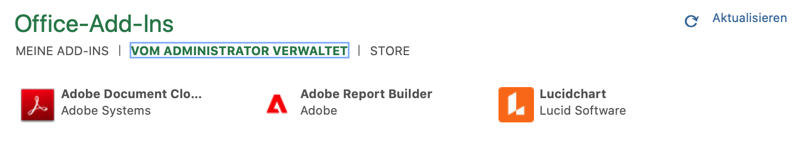
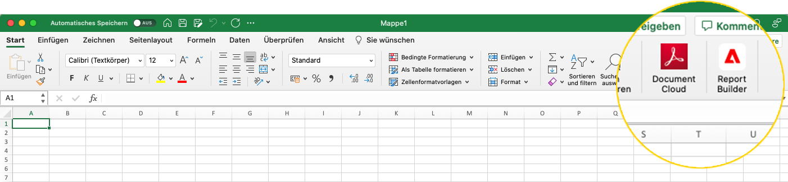
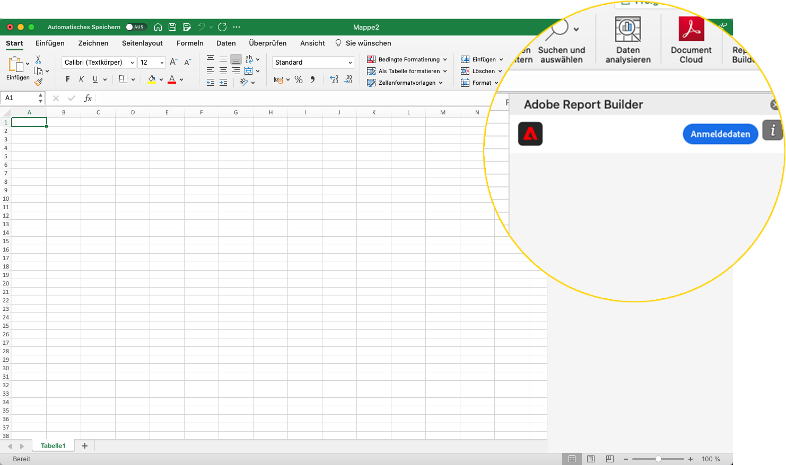
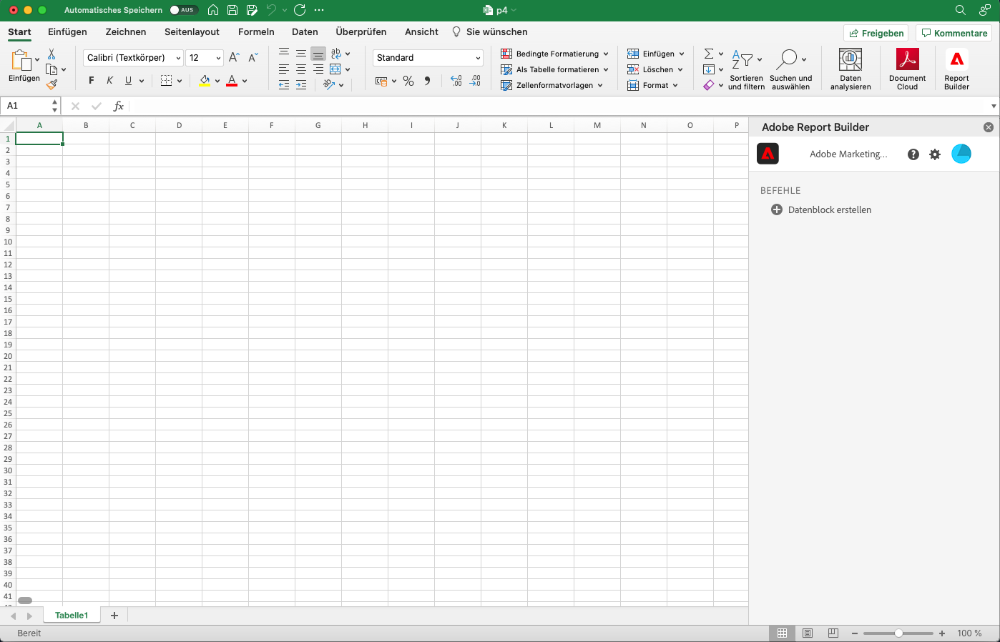
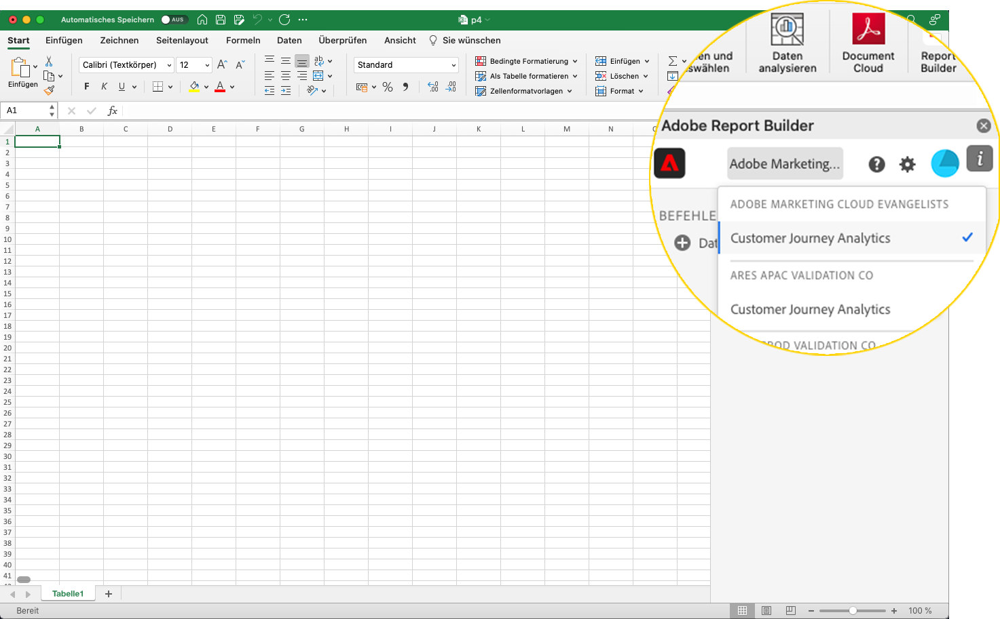
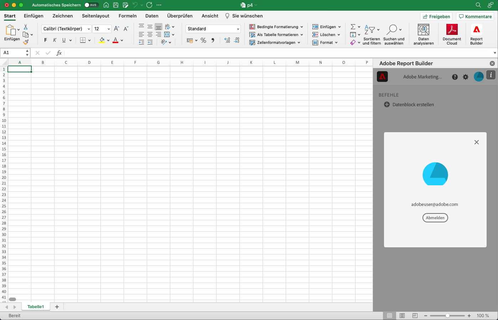

# Einrichten von Report Builder

In diesem Artikel werden die Anforderungen für die Verwendung von Report Builder for Customer Journey Analytics in Microsoft Excel beschrieben. und wie das Add-In installiert und eingerichtet wird.

## Voraussetzungen

Report Builder für Customer Journey Analytics wird von den folgenden Betriebssystemen und Webbrowsern unterstützt.

### macOS

- macOS-Version 10.x oder höher
- Alle Excel-Versionen

### Windows

- Windows 10 Version 1904 oder höher
- Excel-Version 2106 oder höher

  Alle Windows-Desktop-Excel-Benutzer müssen Microsoft Edge Webview2 installieren, um das Add-in verwenden zu können. Zur Installation:

   1. Öffnen von <https://developer.microsoft.com/en-us/microsoft-edge/webview2/>.
   1. Wählen Sie die entsprechende Version des **[!UICONTROL Evergreen Standalone Installer]** für Ihre Plattform aus und laden Sie sie herunter.
   1. Führen Sie das Installationsprogramm aus und befolgen Sie die Installationsanweisungen.

### Web Office

- Unterstützt alle Browser und Versionen.

## Report Builder Excel-Add-in

Installieren Sie das Report Builder Excel-Add-in, um Report Builder für Customer Journey Analytics zu verwenden. Nachdem Sie das Report Builder Excel-Add-in installiert haben, können Sie über eine geöffnete Excel-Arbeitsmappe auf Report Builder zugreifen.

### Herunterladen und Installieren des Report Builder-Add-ins

So laden Sie das Report Builder-Add-in herunter und installieren es

1. Starten Sie Excel und öffnen Sie eine neue Arbeitsmappe.

1. Wählen **[!UICONTROL Einfügen]** > **[!UICONTROL Add-Ins]** > **[!UICONTROL Add-Ins abrufen]** aus dem Hauptmenü aus.

1. Wählen Sie im Dialogfeld „Office-Add-ins“ die Registerkarte **[!UICONTROL Store]** aus.

1. Suchen Sie nach `Report Builder` und wählen Sie **[!UICONTROL Hinzufügen]** aus.

1. Wählen Sie im Dialogfeld Lizenzbedingungen und Datenschutzrichtlinien die Option **[!UICONTROL Weiter]**.

Wenn die **[!UICONTROL Store]**-Registerkarte nicht angezeigt wird:

1. Wählen Sie in Excel **[!UICONTROL Datei]** > **[!UICONTROL Konto]** > **[!UICONTROL Einstellungen verwalten]** aus dem Hauptmenü aus.

1. Aktivieren Sie das Kontrollkästchen neben **[!UICONTROL Optionale verbundene Erlebnisse aktivieren]**.

1. Starten Sie Excel neu.

Wenn Ihr Unternehmen den Zugriff auf den Microsoft Store blockiert:

- Wenden Sie sich an Ihre IT- oder Sicherheitsabteilung, um eine Genehmigung für das Report Builder-Add-in anzufordern. Nachdem die Genehmigung erteilt wurde, wählen Sie im Dialogfeld **[!UICONTROL Add-Ins]** die Registerkarte **[!UICONTROL Admin Managed]** aus.

  {zoomable="yes"}

Nach der Installation des Report Builder-Add-Ins wird das Symbol  **[!UICONTROL Report Builder]** im Excel-Menüband unter der Registerkarte **[!UICONTROL Startseite]** angezeigt.

{zoomable="yes"}

## Anmelden bei Report Builder

Nachdem Sie das Report Builder for Excel-Add-in für Ihre Betriebsplattform oder Ihren Browser installiert haben, führen Sie die folgenden Schritte aus, um sich bei Report Builder anzumelden.

1. Öffnen Sie eine Excel-Arbeitsmappe.

1. Wählen Sie  **[!UICONTROL Report Builder]** aus, um Report Builder zu starten.

1. Wählen Sie in der Adobe Report Builder-Symbolleiste **[!UICONTROL Anmelden]** aus.

   {zoomable="yes"}

1. Geben Sie Ihre Adobe-Kontoinformationen ein. Ihre Kontoinformationen sollten mit Ihren Customer Journey Analytics-Anmeldedaten übereinstimmen.

   {zoomable="yes"}

Nach der Anmeldung werden Ihr Anmeldesymbol und Ihre Organisation oben im Bedienfeld angezeigt

## Wechseln von Organisationen

Bei der ersten Anmeldung werden Sie bei der Ihrem Profil zugewiesenen Standardorganisation oder der Organisation angemeldet, die Sie im Rahmen des Anmeldevorgangs ausgewählt haben.

1. Wählen Sie den Namen der Organisation aus, der bei der Anmeldung angezeigt wird.

1. Wählen Sie eine Organisation aus der Liste der verfügbaren Organisationen aus. Es werden nur Organisationen aufgelistet, auf die Sie Zugriff haben.

   {zoomable="yes"}

## Abmelden

So melden Sie sich von Report Builder ab:

1. Speichern Sie die Änderungen in allen geöffneten Arbeitsmappen.

1. Wählen Sie das Avatar-Symbol aus, um Ihr Benutzerprofil anzuzeigen.

   {zoomable="yes"}

1. Wählen Sie **[!UICONTROL Abmelden]** aus.
