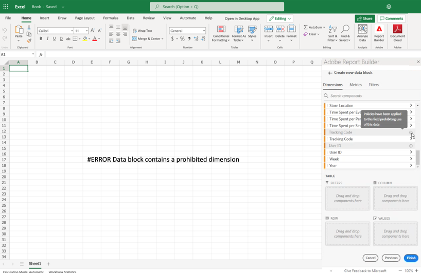

# Eingeschränkte Beschriftungen in Report Builder

Im Allgemeinen werden die Einstellungen für die Data Governance in Customer Journey Analytics von Experience Platform übernommen. Die Integration zwischen Customer Journey Analytics und Experience Platform Data Governance ermöglicht die Kennzeichnung sensibler Customer Journey Analytics-Daten und die Durchsetzung von Datenschutzrichtlinien.

Datenschutzbeschriftungen und -richtlinien, die für von Experience Platform genutzte Datensätze erstellt werden, können im Workflow für Customer Journey Analytics-Datenansichten angezeigt werden. Diese Beschriftungen stoppen oder warnen Benutzende, die Metriken und Dimensionen aus sensiblen Feldern erstellen. Weiterführende Informationen über Datensätze finden Sie in der [Datensatzübersicht](https://experienceleague.adobe.com/de/docs/experience-platform/catalog/datasets/overview)

Darüber hinaus werden beim Exportieren von Daten aus Customer Journey Analytics (über Reporting, Export, API usw.) Warnhinweise oder Labels hinzugefügt, die Benutzende darauf hinweisen, dass ein Bericht sensible Informationen enthält, die auf bestimmte Weise behandelt werden müssen.

Mit dieser Integration können Sie die Compliance verwalten. Datenverantwortliche in Ihrem Unternehmen können Richtlinien festlegen, um die Nutzung zu beschränken. Dadurch können Ihre Customer Journey Analytics-Benutzenden die Daten sicherer nutzen, da sie wissen, dass sie mit den von den Datenverantwortlichen festgelegten Richtlinien übereinstimmen.

Weitere Informationen finden Sie unter [Customer Journey Analytics und Data Governance](https://experienceleague.adobe.com/en/docs/analytics-platform/using/cja-privacy/privacy-overview)

## Eingeschränkte Daten anzeigen

In Customer Journey Analytics werden zwei von Adobe definierte Richtlinien angezeigt, die sich auf die Berichterstellung, den Download und die Freigabe auswirken:

* Analytics erzwingen-Richtlinie
* Download erzwingen-Richtlinie

Komponenten, die diesen Richtlinien unterliegen, sind ausgegraut und haben ein -Symbol. Wenn Sie den Mauszeiger über das Infosymbol bewegen, wird ein Hinweis angezeigt, der Folgendes angibt: **[!UICONTROL Auf dieses Feld wurden Richtlinien angewendet, die die Verwendung dieser Daten verbieten]**.

Weitere Informationen finden Sie unter [Kennzeichnungen und Richtlinien](https://experienceleague.adobe.com/en/docs/analytics-platform/using/cja-dataviews/data-governance).

{zoomable="yes"}

## Aktualisieren von Berichten mit eingeschränkten Daten

Wenn ein Anwender einen Report Builder-Bericht mit Datenelementen erstellt hat, die später eingeschränkt werden, wird bei der Aktualisierung des Berichts eine Fehlermeldung angezeigt.

{width="100%" zoomable="yes"}
