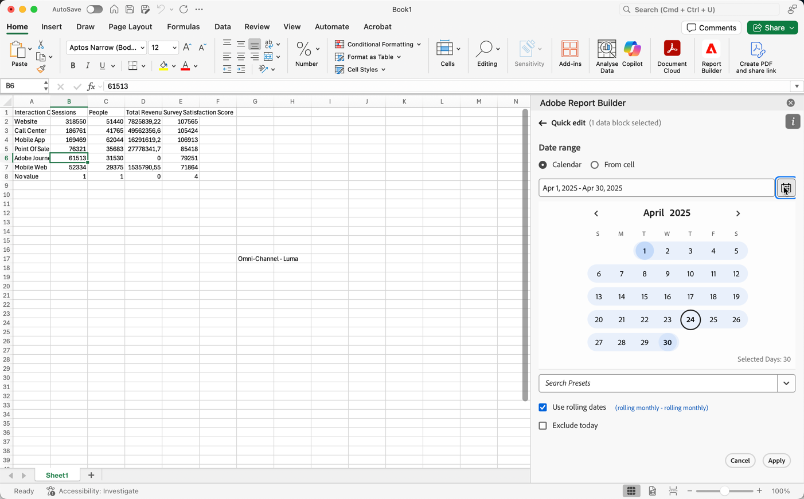

# Datumsbereich auswählen

So ändern Sie den Datumsbereich eines vorhandenen Datenblocks:

- Wählen **[!UICONTROL Datenblock bearbeiten]** oder
- Wählen Sie den Link **[!UICONTROL Datumsbereich]** in **[!UICONTROL Schnellbearbeitung]**.

Verwenden Sie die folgenden Optionen, um einen Datumsbereich für einen Datenblock zu ändern.

## Kalender

Mit **[!UICONTROL Option]** Kalender“ können Sie statische oder rollierende Datumswerte mit den folgenden Optionen erstellen:

### Datumsbereich

Das Datumsbereichsfeld zeigt den aktuellen Datumsbereich für die Datenblockanfrage an. Sie können Datumsangaben direkt eingeben oder  verwenden, um einen Datumsbereich anzugeben.

{zoomable="yes"}

### Voreinstellungen

Wählen Sie im Dropdown-Menü Vorgaben eine Vorgabe aus. Sie können auch Text eingeben, um nach Voreinstellungen zu suchen.

{zoomable="yes"}

Das Dropdown-Menü „Voreinstellung“ enthält einen Standardsatz vordefinierter Datumsbereiche und Datumsbereichskomponenten für eine von Ihnen gespeicherte Datenansicht oder eine für Sie freigegebene Datenansicht.

### Rollierende Datumswerte

So definieren Sie rollierende Datumswerte:

{zoomable="yes"}

1. Wählen Sie **[!UICONTROL Rollierende Datumswerte verwenden]**, um die Logik für eine Definition rollierender Datumswerte zu definieren. Sie können den Text in Klammern auswählen (z. B. **[!UICONTROL Fester Start - täglich rollierend]**), um das Bedienfeld zu erweitern und Details für **[!UICONTROL Start]** und **[!UICONTROL Ende]** anzugeben.

1. Wählen Sie **[!UICONTROL Anfang von]**, **[!UICONTROL Ende von]** oder **[!UICONTROL Festgelegter Tag]** aus.

   - Wenn Sie **[!UICONTROL Anfang von]** oder **[!UICONTROL Ende von]** ausgewählt haben, können Sie einen vollständigen Ausdruck erstellen. Beispiel: **[!UICONTROL Ende von]** **[!UICONTROL Aktuelles Jahr]** **[!UICONTROL plus]** `1` **[!UICONTROL Tag]**. Wählen Sie den entsprechenden Wert für jeden einzelnen Teil des Ausdrucks aus.

      - Wählen Sie einen Wert für den aktuellen Zeitraum aus, Beispiel: **[!UICONTROL aktuelles Jahr]**.
      - Wählen Sie einen Wert für eine optionale zusätzliche Berechnung. z. B. **[!UICONTROL plus]**.
      - Wenn Sie eine zusätzliche Berechnung angegeben haben, geben Sie einen Wert an. Zum Beispiel `1`.
      - Wenn Sie eine zusätzliche Berechnung angegeben haben, wählen Sie den Zeitraum aus, der für die Berechnung verwendet werden soll, Beispiel: **[!UICONTROL Tag]**.

   - Wenn Sie **[!UICONTROL Fester Tag]** ausgewählt haben, geben Sie einen festen Tag an oder wählen Sie mit der Auswahl einen Tag aus.

1. Wählen Sie **[!UICONTROL Ausblenden]**, um die Details für die Berechnung rollierender Datumswerte auszublenden.

### Benutzerdefinierte Ausdrücke

Mit der Option für benutzerdefinierte Ausdrücke können Sie den Datumsbereich ändern, indem Sie einen benutzerdefinierten Ausdruck erstellen oder eine arithmetische Formel eingeben.

{zoomable="yes"}

1. Wählen Sie **[!UICONTROL Rollierende Datumswerte verwenden]** aus.

1. Wählen Sie **[!UICONTROL Benutzerdefinierte Ausdrücke verwenden]** aus.

   Wenn Sie **[!UICONTROL Benutzerdefinierte Ausdrücke verwenden]** auswählen, sind die standardmäßigen Steuerelemente für rollierende Datumsbereiche deaktiviert.

1. Geben Sie einen [benutzerdefinierten Ausdruck](#create-a-custom-expression) ein.

1. Verwenden Sie die **[!UICONTROL Datumsvorschau]**, um den resultierenden Datumsbereich zu überprüfen.

#### Erstellen eines benutzerdefinierten Ausdrucks

1. Geben Sie [Datumsreferenz“ ](#date-references).

1. Fügen Sie einen optionalen [Datumsoperator](#date-operators) hinzu, um das Datum in die Vergangenheit oder in die Zukunft zu verschieben.

Sie können einen benutzerdefinierten Ausdruck eingeben, der mehrere Operatoren enthält, z. B. `tm-11m-1d`.

#### Datumsreferenzen

In der folgenden Tabelle sind Beispiele für Datumsreferenzen aufgeführt.

| Datumsreferenz | Typ | Beschreibung |
|----------------|--------------|----------------------------|
| `1/1/10` | Statisches Datum | Im ISO-Datumsformat eingegeben |
| `td` | Rollierendes Datum | Beginn des aktuellen Tages |
| `tw` | Rollierendes Datum | Beginn der aktuellen Woche |
| `tm` | Rollierendes Datum | Beginn des aktuellen Monats |
| `tq` | Rollierendes Datum | Beginn des aktuellen Quartals |
| `ty` | Rollierendes Datum | Beginn des laufenden Jahres |

#### Datumsoperatoren

In der folgenden Tabelle sind Beispiele für Datumsoperatoren aufgeführt.

| Datumsoperator | Einheit | Beschreibung |
|----------------|---------|--------------------|
| `+6d` | Tag | Hinzufügen von 6 Tagen zur Datumsreferenz |
| `+1w` | Woche | Hinzufügen einer ganzen Woche zur Datumsreferenz |
| `-2m` | Monat | Abziehen von 2 vollständigen Monaten von der Datumsreferenz |
| `-4q` | Quartal | Abziehen von 4 Quartalen von der Datumsreferenz |
| -`1y` | Jahr | Abziehen von 1 Jahr von der Datumsreferenz |

#### Datumsausdrücke

In der folgenden Tabelle sind Beispiele für Datumsausdrücke aufgeführt.

| Datumsausdruck | Bedeutung |
|-----------------|--------------------------------------|
| `td` | Am aktuellen Tag |
| `td-1w` | Erster Tag der letzten Woche |
| `tm-1d` | Letzter Tag des vorherigen Monats |
| `td-52w` | Derselbe Tag vor 52 Wochen |
| `tm-11m-1d` | Letzter Tag des gleichen Monats im letzten Jahr |
| `"2020-09-06"` | Spezifisches Datum, 9. September 2020 |

## Datumsbereich aus Zelle

Der Datumsbereich kann in Zellen eines Arbeitsblatts angegeben werden. Verwenden Sie die Option **[!UICONTROL Datumsbereich aus Zelle]**, um das Start- und Enddatum des Datenblocks aus ausgewählten Zellen auszuwählen. Wenn Sie die Option **[!UICONTROL Aus Zelle]** auswählen, zeigt das Bedienfeld die Felder **[!UICONTROL Von]** und **[!UICONTROL Bis]** an, in die Sie eine Zellenposition eingeben oder  verwenden können, um die aktuell ausgewählte Zelle auszuwählen.

{zoomable="yes"}

## Heute ausschließen

Wählen Sie **[!UICONTROL Heute ausschließen]**, um den aktuellen Tag aus einem ausgewählten Datumsbereich auszuschließen. Der aktuelle Tag wird aus allen Modi ausgeschlossen, die zum Definieren eines Datumsbereichs verwendet werden: Kalender, rollierende Datumswerte oder benutzerdefinierte Ausdrücke.

## Gültige Datumsbereiche

In der folgenden Liste werden gültige Datumsbereichsformate beschrieben.

- Das Start- und das Enddatum müssen im folgenden Format angegeben werden: YYYY-MM-DD

- Das Startdatum muss vor dem Enddatum liegen oder damit übereinstimmen. Bei beiden Daten kann es sich um Daten in der Zukunft handeln.

- Bei Verwendung rollierender Datumswerte muss das Startdatum heute oder in der Vergangenheit liegen. Der Starttag muss in der Vergangenheit liegen, wenn **[!UICONTROL Heute ausschließen]** ausgewählt ist.

- Sie können einen statischen Datumsbereich für die Zukunft erstellen. Beispielsweise müssen Sie möglicherweise ein künftiges Datum für den Start einer Marketing-Kampagne in der nächsten Woche festlegen. Mit dieser Option wird ein Arbeitsmappen-Monitoring für eine Kampagne im Voraus erstellt.

## Datumsbereich ändern

Sie können den Datumsbereich eines vorhandenen Datenblocks bearbeiten.

1. Wählen Sie eine Zelle in Ihrem Datenblock aus.

- Wählen **[!UICONTROL Datenblock bearbeiten]** im Bedienfeld **[!UICONTROL Befehle]** oder
- Wählen Sie den **[!UICONTROL Datumsbereich]** im Bedienfeld **[!UICONTROL Schnellbearbeitung]** aus.

1. Ändern Sie den Datumsbereich mit einer der verfügbaren Datumsauswahloptionen.

1. Wählen Sie **[!UICONTROL Anwenden]** aus.

Report Builder wendet den neuen Datumsbereich auf alle Datenblöcke in der Auswahl an.
