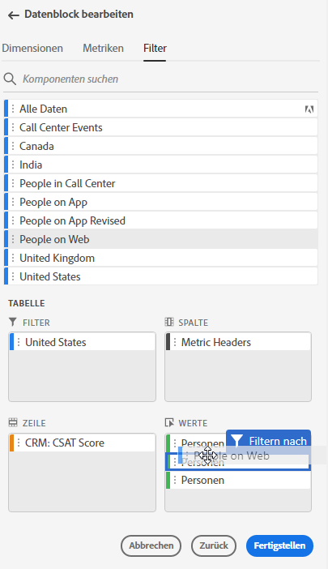
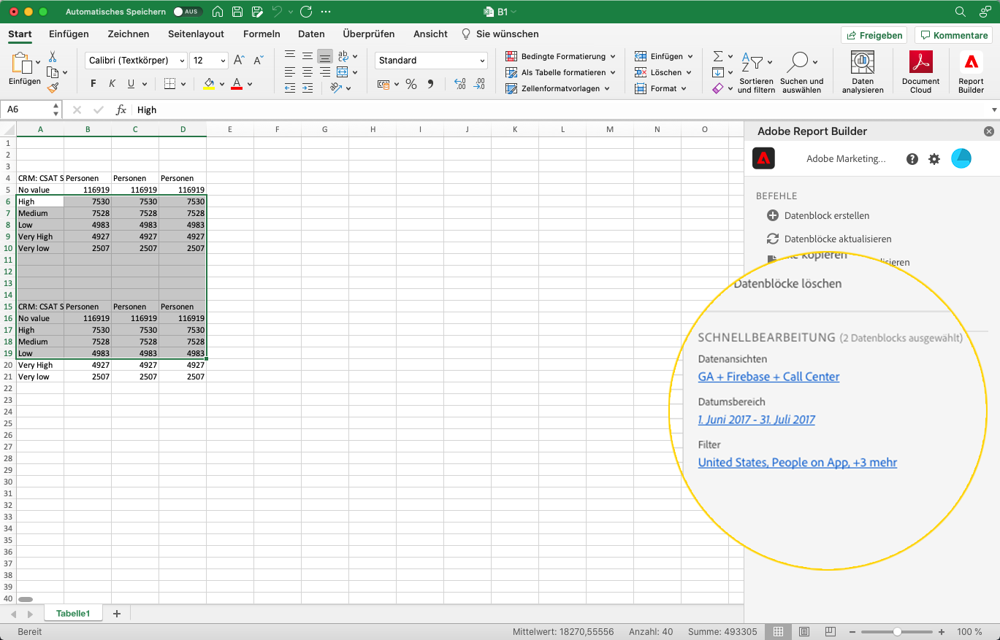
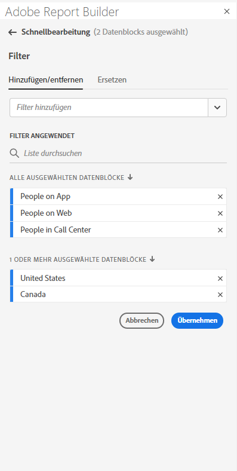
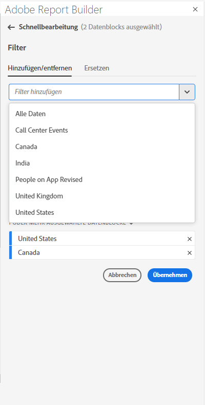
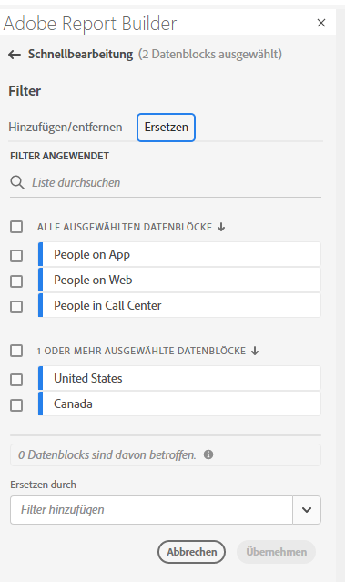
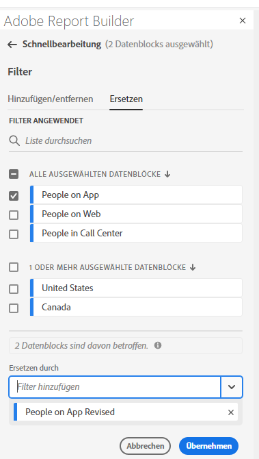
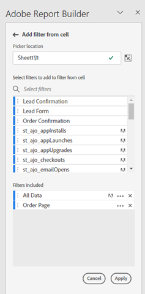
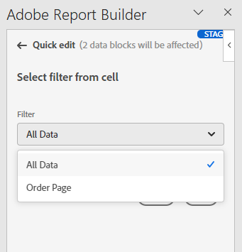

# Arbeiten mit Segmenten in Report Builder

Segmente können angewendet werden, wenn Sie einen neuen Datenblock erstellen oder wenn Sie die Option **Datenblock bearbeiten** im Bedienfeld „Befehle“ auswählen.

## Anwenden von Segmenten auf einen Datenblock

Um ein Segment auf den gesamten Datenblock anzuwenden, doppelklicken Sie auf ein Segment oder ziehen Sie Segmente aus der Komponentenliste in den Abschnitt Segmente der Tabelle.

## Segmente auf einzelne Metriken anwenden

Um Segmente auf einzelne Metriken anzuwenden, ziehen Sie ein Segment auf eine Metrik in der Tabelle. Sie können auch auf das Symbol **…** rechts neben einer Metrik im Tabellenbereich klicken und dann **Segmentmetrik** auswählen. Um angewendete Segmente anzuzeigen, bewegen Sie den Mauszeiger über eine Metrik im Tabellenbereich oder wählen Sie sie aus. Metriken mit angewendeten Segmenten zeigen ein Segmentsymbol an.

## Schnellbearbeitungssegmente

Sie können das Bedienfeld „Schnellbearbeitung“ verwenden, um Segmente für vorhandene Datenblöcke hinzuzufügen, zu entfernen oder zu ersetzen.

Wenn Sie einen Zellenbereich im Arbeitsblatt auswählen, wird der Link **Segmente** im Bereich „Schnellbearbeitung“ eine zusammenfassende Liste der Segmente anzeigen, die von den in dieser Auswahl enthaltenen Datenblöcken verwendet werden.

So bearbeiten Sie Segmente über das Bedienfeld „Schnellbearbeitung“

1. Wählen Sie einen Zellenbereich aus einem oder mehreren Datenblöcken aus.

   

1. Klicken Sie auf den Link Segmente , um das Bedienfeld „Schnellbearbeitung - Segmente“ zu starten.

   

### Segment hinzufügen oder entfernen

Mithilfe der Optionen „Hinzufügen“/„Entfernen“ können Sie Segmente hinzufügen oder entfernen.

1. Wählen Sie die **Hinzufügen/Entfernen** im Bedienfeld „Schnellbearbeitungssegmente“ aus.

   Alle Segmente, die auf die ausgewählten Datenblöcke angewendet werden, werden im Bedienfeld „Schnellbearbeitungssegmente“ aufgeführt. Segmente, die auf alle Datenblöcke in der Auswahl angewendet werden, werden unter der Überschrift **Auf alle ausgewählten Datenblöcke angewendet** aufgeführt. Segmente, die auf einige, aber nicht alle Datenblöcke angewendet werden, werden unter der Überschrift **Auf einen oder mehrere ausgewählte Datenblöcke angewendet** aufgeführt.

   Wenn in den ausgewählten Datenblöcken mehrere Segmente vorhanden sind, können Sie mithilfe des Suchfelds **Segment hinzufügen** nach bestimmten Segmenten suchen.

   

1. Fügen Sie Segmente hinzu, indem Sie Segmente aus dem Dropdown-Menü **Segment hinzufügen** auswählen.

   Die Liste durchsuchbarer Segmente enthält alle Segmente, auf die die Datenansichten, die in einem oder mehreren der ausgewählten Datenblöcke vorhanden sind, zugreifen können, sowie alle Segmente, die in der Organisation global verfügbar sind.

   Beim Hinzufügen eines Segments wird das Segment auf alle Datenblöcke in der Auswahl angewendet.

1. Um Segmente zu entfernen, klicken Sie auf das Löschsymbol **x** rechts neben den Segmenten in der Liste **Angewendete Segmente**.

1. Klicken Sie auf **Anwenden**, um Änderungen zu speichern und zum Hub-Bedienfeld zurückzukehren.

   Report Builder zeigt eine Meldung zur Bestätigung der angewendeten Segmentänderungen an.

### Segment ersetzen

Sie können ein vorhandenes Segment durch ein anderes Segment ersetzen, um die Segmentierung der Daten zu ändern.

1. Wählen Sie die **Ersetzen** im Bedienfeld „Schnellbearbeitungssegmente“ aus.

   

1. Suchen Sie mithilfe **Suchfelds** Suchliste“ nach bestimmten Segmenten.

1. Wählen Sie ein oder mehrere Segmente aus, die Sie ersetzen möchten.

1. Suchen Sie im Feld Ersetzen durch nach einem oder mehreren Segmenten.

   Wenn Sie ein Segment auswählen, wird es der Liste **Ersetzen durch**…“ hinzugefügt.

   

1. Klicken Sie auf **Anwenden**.

   Report Builder aktualisiert die Segmentliste entsprechend der Ersetzung.

### Definieren von Datenblocksegmenten aus einer Zelle

Datenblöcke können auf Segmente aus einer Zelle verweisen. Mehrere Datenblöcke können dieselbe Zelle für Segmente referenzieren, sodass Sie mühelos Segmente für mehrere Datenblöcke gleichzeitig wechseln können.

So wenden Sie Segmente aus einer Zelle an

1. Navigieren Sie entweder beim Erstellen oder Bearbeiten von Datenblöcken zu Schritt 2. Siehe [Erstellen eines Datenblocks](./create-a-data-block.md).
1. Klicken Sie auf die **Segmente**, um Segmente zu definieren.
1. Klicken Sie **Segment aus Zelle erstellen**.

   

1. Wählen Sie die Zelle aus, aus der die Datenblöcke auf ein Segment verweisen sollen.

1. Fügen Sie das Segment, das Sie der Zelle hinzufügen möchten, hinzu, indem Sie entweder auf das Segment doppelklicken oder es per Drag-and-Drop in den Abschnitt Enthaltene Segmente ziehen.

   Hinweis: Für die jeweilige Zelle kann jeweils nur eine Auswahl ausgewählt werden.

   

1. Klicken Sie auf **Anwenden**, um die Referenzzelle zu erstellen.

1. Fügen Sie auf **Registerkarte** das neu erstellte Referenzzellensegment zu Ihrem Datenblock hinzu.

   

1. Klicken Sie auf **Fertig stellen**.

   Jetzt kann diese Zelle von anderen Datenblöcken in ihren Segmenten referenziert werden. Um die Referenzzelle als Segment auf andere Datenblöcke anzuwenden, fügen Sie einfach den Zellenverweis auf der Registerkarte Segmente zu ihren Segmenten hinzu.

#### Verwenden der Referenzzelle zum Ändern von Datenblocksegmenten

1. Wählen Sie die Referenzzelle im Arbeitsblatt aus.

1. Klicken Sie auf den Link unter **Segmente aus Zelle** im Menü Schnellbearbeitung.

   

1. Wählen Sie Ihr Segment aus dem Dropdown-Menü aus.

   

1. Klicken Sie auf **Anwenden**.
