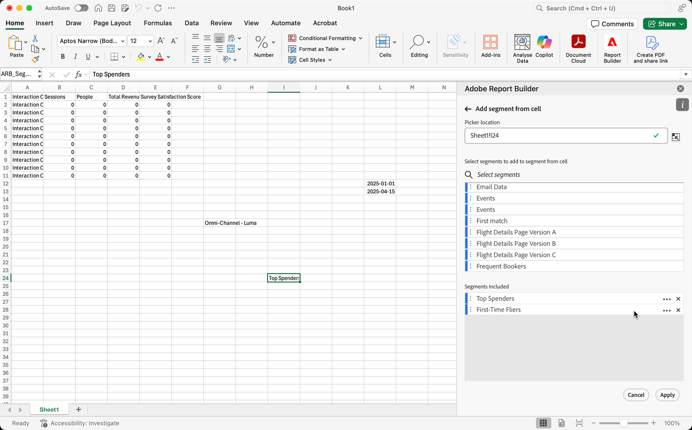

# Arbeiten mit Segmenten

Segmente können angewendet werden, wenn Sie einen neuen Datenblock erstellen oder wenn Sie **[!UICONTROL Datenblock bearbeiten]** im Bedienfeld **[!UICONTROL Befehle]** auswählen.

## Anwenden von Segmenten auf einen Datenblock

Um ein Segment auf den gesamten Datenblock anzuwenden, doppelklicken Sie auf ein Segment oder ziehen Sie Segmente aus der Komponentenliste in den Abschnitt Segmente der Tabelle.

## Filter auf einzelne Metriken anwenden

So wenden Sie mithilfe von Segmenten Filter auf einzelne Metriken an:

* Ziehen Sie ein oder mehrere Segmente aus **[!UICONTROL Segmente]** per Drag-and-Drop auf eine Metrik in der Tabelle.

* Alternativ:

   1. Wählen Sie  für eine bestimmte Metrik im Bereich **[!UICONTROL Tabelle]** aus und wählen Sie dann **[!UICONTROL Filtermetrik]**.

      {zoomable="yes"}

   1. Wählen Sie ein oder mehrere Segmente aus **[!UICONTROL Dropdown-Menü]** Segmente“ aus. Die Segmente werden der Liste **[!UICONTROL Segmente angewendet“]**.

      
   1. Wählen Sie  aus, um ein Segment aus der Liste **[!UICONTROL Segment angewendet]** zu entfernen. Oder wählen Sie **[!UICONTROL Alle löschen]** aus, um alle Segmente aus der Liste **[!UICONTROL Segment angewendet]** zu entfernen.
   1. Wählen Sie **[!UICONTROL Anwenden]** aus.

Um angewendete Filter anzuzeigen, bewegen Sie den Mauszeiger über eine Metrik im Tabellenbereich oder wählen Sie sie aus. Metriken mit angewendeten Segmenten zeigen ein Segmentsymbol an.

## Schnellbearbeitungssegmente

Sie können das Bedienfeld **[!UICONTROL Schnellbearbeitung]** verwenden, um Segmente für vorhandene Datenblöcke hinzuzufügen, zu entfernen oder zu ersetzen.

Wenn Sie einen Zellenbereich im Arbeitsblatt auswählen, wird der Link **[!UICONTROL Segmente]** im Bedienfeld **[!UICONTROL Schnellbearbeitung]** eine zusammenfassende Liste der Segmente anzeigen, die von den in dieser Auswahl enthaltenen Datenblöcken verwendet werden.

So bearbeiten Sie Segmente mithilfe des Bedienfelds **[!UICONTROL Schnellbearbeitung]**:

1. Wählen Sie einen Zellenbereich aus einem oder mehreren Datenblöcken aus.

1. Wählen Sie den Link **[!UICONTROL Segmente]** aus, um das Bedienfeld **[!UICONTROL Schnellbearbeitung]** **[!UICONTROL Segmente]** zu starten.

### Segmente hinzufügen oder entfernen

Mithilfe der Optionen „Hinzufügen“/„Entfernen“ können Sie Segmente hinzufügen oder entfernen.

1. Wählen Sie die **[!UICONTROL Hinzufügen/Entfernen]** im Bedienfeld **[!UICONTROL Schnellbearbeitung]** **[!UICONTROL Segmente]** aus.

   1. Wählen Sie ein oder mehrere Segmente aus **[!UICONTROL Dropdown-Menü]** Segmente“ aus. Die Segmente werden der Liste **[!UICONTROL Segmente angewendet“]**.
   1. Wählen Sie  aus, um ein Segment aus der Liste **[!UICONTROL Segment angewendet]** zu entfernen.
   1. Wählen Sie **[!UICONTROL Anwenden]** aus.

Report Builder zeigt eine Meldung zur Bestätigung der angewendeten Segmentänderungen an.

### Segmente ersetzen

Sie können ein vorhandenes Segment durch ein anderes Segment ersetzen, um die Segmentierung der Daten zu ändern.

1. Wählen Sie die **[!UICONTROL Ersetzen]** im Bedienfeld **[!UICONTROL Schnellbearbeitung]** **[!UICONTROL Segmente]** aus.

1. Suchen Sie mithilfe **Suchfelds** Suchliste“ nach bestimmten Segmenten.

1. Wählen Sie ein oder mehrere Segmente aus, die Sie ersetzen möchten.

1. Suchen Sie im Dropdown-Menü Ersetzen durch nach einem oder mehreren Segmenten, um das Segment zur Liste **[!UICONTROL Ersetzen durch]** hinzuzufügen.

1. Wählen Sie **[!UICONTROL Anwenden]** aus.

Report Builder aktualisiert die Segmentliste entsprechend der Ersetzung.

## Definieren von Datenblocksegmenten aus einer Zelle

Datenblöcke können auf Segmente aus einer Zelle verweisen. Mehrere Datenblöcke können dieselbe Zelle für Segmente referenzieren, sodass Sie Segmente einfach für mehrere Datenblöcke gleichzeitig wechseln können.

So wenden Sie Segmente aus einer Zelle an:

1. [Neuen Datenblock erstellen](create-a-data-block.md#create-a-data-block) oder einen vorhandenen Datenblock bearbeiten.
1. Wählen Sie die Registerkarte **[!UICONTROL Segmente]** aus, um Segmente zu definieren.
1. Wählen Sie .

   {zoomable="yes"}

1. Wählen Sie die Zelle aus, aus der die Datenblöcke auf ein Segment verweisen sollen.

1. Doppelklicken Sie auf , um der Zelle ein Segment hinzuzufügen. Alternativ können Sie ein oder mehrere Segmente per Drag-and-Drop in den Abschnitt **[!UICONTROL Enthaltene Segmente]** ziehen.

1. Wählen Sie **[!UICONTROL Anwenden]** aus, um die Referenzzelle zu erstellen.

1. Fügen Sie auf **Registerkarte** das neu erstellte Referenzzellensegment zu Ihrem Datenblock hinzu.

   {zoomable="yes"}

1. Wählen Sie **[!UICONTROL Beenden]** aus.

Um die Referenzzelle als Segment auf andere Datenblöcke anzuwenden, verwenden Sie die Zellreferenz als eines der Segmente in der Liste **[!UICONTROL Segmente]** auf der Registerkarte **[!UICONTROL Tabelle]**.

### Verwenden einer Referenzzelle zum Ändern von Datenblocksegmenten

1. Wählen Sie die Referenzzelle im Arbeitsblatt aus.

1. Wählen Sie den Link unter **[!UICONTROL Segmente aus Zelle]** im Menü **[!UICONTROL Schnellbearbeitung]** aus.

   {zoomable="yes"}

1. Wählen Sie Ihr Segment aus dem Dropdown-Menü aus.

1. Wählen Sie **[!UICONTROL Anwenden]** aus.
