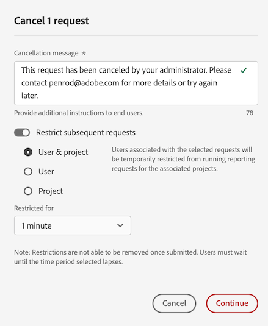
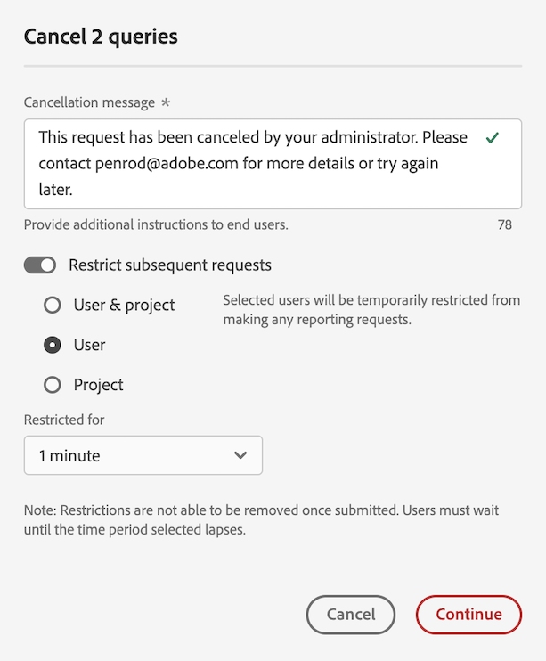
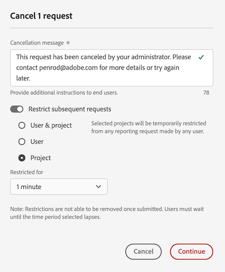
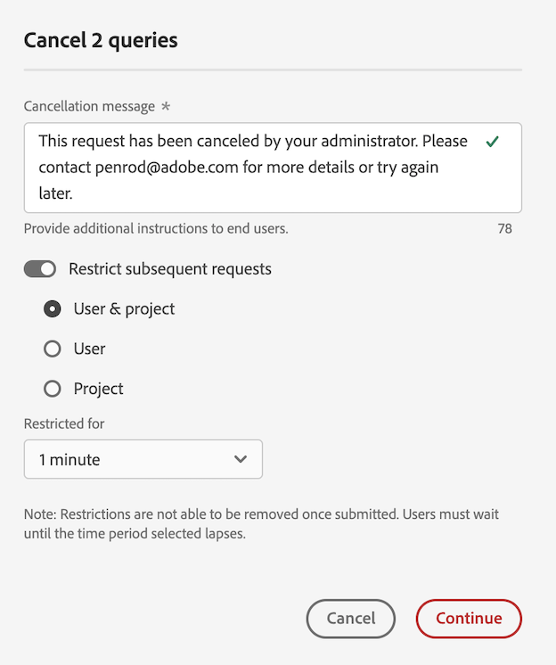
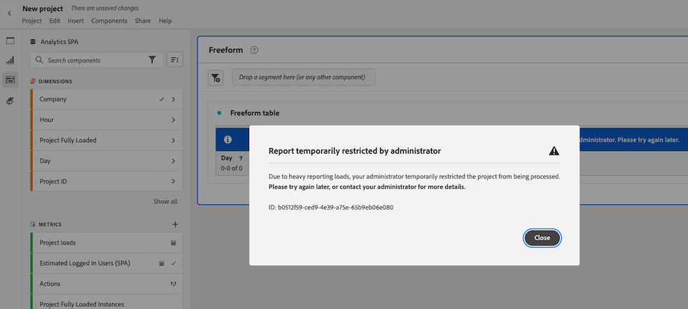
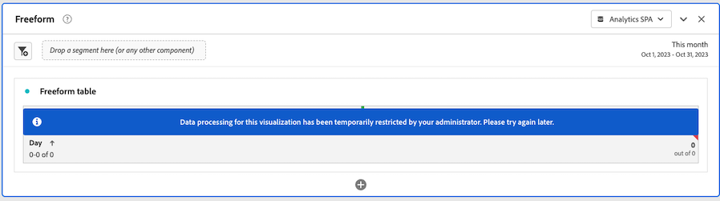

# Abbrechen von Berichtsanfragen im Reporting Activity Manager

Der [!UICONTROL Reporting Activity Manager] ermöglicht Admins das schnelle Diagnostizieren und Abbrechen von Berichtsanfragen, um Probleme mit der Berichtskapazität während Spitzenzeiten des Reportings zu beheben.

Beachten Sie beim Abbrechen von Berichtsanfragen Folgendes:

* Sie können bestimmte Anfragen abbrechen, alle Anfragen einer bestimmten Benutzerin bzw. eines bestimmten Benutzers abbrechen oder alle Anfragen im Zusammenhang mit einem bestimmten Projekt abbrechen.

* Wenn Sie Anfragen abbrechen, können Sie auch nachfolgende Anfragen für einen bestimmten Zeitraum einschränken.

  Wenn Sie eine nachfolgende Anfrage einschränken, wird die Aktion mit dem Aktionsnamen „EMBARGO“ im [Auditprotokoll](/help/privacy/audit-log.md) dokumentiert.

* Sie können eine Anfrage nicht abbrechen, wenn die Spalte [!UICONTROL **Benutzer**] einer Anfrage als [!UICONTROL **Nicht erkannt**] angezeigt wird. In diesem Fall bedeutet dies, dass sich die Benutzerin bzw. der Benutzer in einer Unternehmensanmeldung befindet, für die Sie keine Admin-Berechtigungen haben.

Weitere Informationen zum Reporting Activity Manager, einschließlich der wichtigsten Vorteile und Berechtigungsanforderungen, finden Sie unter [Überblick über den Reporting Activity Manager](/help/reporting-activity-manager/reporting-activity-overview.md).

## Abbrechen von bestimmten Anfragen

Sie können einzelne Anfragen abbrechen, die eine große Menge an Reporting-Kapazität beanspruchen. Wenn Sie eine Anfragen abbrechen, können Sie sie für einen bestimmten Zeitraum zusätzlich einschränken.

1. Navigieren Sie in Customer Journey Analytics zu **[!UICONTROL Tools]** > **[!UICONTROL Reporting Activity Manager]**.

1. Wählen Sie die Verbindung aus, in der Sie die Berichtsanfragen abbrechen möchten. <!--double-check this step-->

   Weitere Informationen zu den auf dieser Seite verfügbaren Daten finden Sie unter [Anzeigen der Berichtsaktivität im Reporting Activity Manager](/help/reporting-activity-manager/reporting-activity.md).

1. Wählen Sie die Registerkarte [!UICONTROL **Anfragen**] aus und wählen Sie dann eine oder mehrere Anfragen aus.

   <!-- add screenshot -->

1. Wählen Sie [!UICONTROL **Anfragen abbrechen**].

   Das Dialogfeld [!UICONTROL **Berichtsanfragen abbrechen _x_**] wird angezeigt.

1. Das Feld „Abbruchmeldung“ zeigt die Meldung an, die Benutzenden angezeigt wird, wenn ihre Anfragen abgebrochen werden. Es wird eine Standardmeldung bereitgestellt. Sie können die Standardmeldung aktualisieren, um weitere Details anzugeben.

1. (Optional) So beschränken Sie zukünftige Anfragen für einen bestimmten Zeitraum:

   1. Aktivieren Sie die Option [!UICONTROL **Nachfolgende Anfragen einschränken**].

      

   1. Wählen Sie aus den folgenden Optionen:

      | Option | Funktion |
      |---------|----------|
      | [!UICONTROL **Benutzende und Projekt**] | Benutzende, die mit den ausgewählten Anfragen verknüpft sind, werden vorübergehend von der Ausführung von Reporting-Anfragen für die ausgewählten Projekte ausgeschlossen. |
      | [!UICONTROL **Benutzende**] | Benutzende, die mit den ausgewählten Anträgen verknüpft sind, können vorübergehend keine weiteren Reporting-Anfragen stellen. |
      | [!UICONTROL **Projekt**] | Projekte, die mit den ausgewählten Anfragen verknüpft sind, werden vorübergehend von allen Reporting-Anfragen ausgeschlossen. |
      | [!UICONTROL **Eingeschränkt für**] | Wählen Sie aus, wie lange Anforderungen eingeschränkt werden sollen. Sie können zwischen 1 Minute (Standard), 5 Minuten, 10 Minuten, 15 Minuten oder 30 Minuten wählen. <!-- double-check this -->
Nachdem eine Einschränkung festgelegt wurde, können Sie sie nicht sofort wieder entfernen.
 |

      {style="table-layout:auto"}

1. Wählen Sie [!UICONTROL **Mit Abbruch fortfahren**].

   In Analysis Workspace wird eine Benachrichtigung angezeigt, die Benutzende darüber informiert, dass die Anfrage abgebrochen wurde. Weitere Informationen dazu, wie diese in Analysis Workspace angezeigt wird, finden Sie unter [Erlebnis, wenn Benutzende auf einen abgebrochenen Bericht zugreifen](#experience-when-users-access-a-cancelled-report).

## Abbrechen von Anfragen nach Benutzerin bzw. Benutzer einschränken

Sie können alle Anfragen abbrechen, die mit einer Benutzerin bzw. einem Benutzer oder mehreren Benutzenden verknüpft sind. Wenn Sie Anfragen abbrechen, die mit einer Benutzerin bzw. einem Benutzer verknüpft sind, können Sie nachfolgende Anfragen dieser Benutzerin bzw. dieses Benutzers für einen bestimmten Zeitraum weiter einschränken.

1. Navigieren Sie in Customer Journey Analytics zu **[!UICONTROL Tools]** > **[!UICONTROL Reporting Activity Manager]**.

1. Wählen Sie die Verbindung aus, in der Sie die Berichtsanfragen abbrechen möchten. <!--double-check this step-->

   Weitere Informationen zu den auf dieser Seite verfügbaren Daten finden Sie unter [Anzeigen der Berichtsaktivität im Reporting Activity Manager](/help/reporting-activity-manager/reporting-activity.md).

1. Wählen Sie die Registerkarte [!UICONTROL **Benutzende**] aus und wählen Sie dann eine Benutzerin bzw. einen Benutzer oder mehrere Benutzende aus.

   <!-- add screenshot -->

1. Wählen Sie [!UICONTROL **Anfragen abbrechen**].

   Das Dialogfeld [!UICONTROL **Berichtsanfragen abbrechen _x_**] wird angezeigt.

1. Das Feld „Abbruchmeldung“ zeigt die Meldung an, die Benutzenden angezeigt wird, wenn ihre Anfragen abgebrochen werden. Es wird eine Standardmeldung bereitgestellt. Sie können die Standardmeldung aktualisieren, um weitere Details anzugeben.

1. (Optional) So beschränken Sie zukünftige Anfragen für einen bestimmten Zeitraum:

   1. Aktivieren Sie die Option [!UICONTROL **Nachfolgende Anfragen einschränken**]

      

   1. Wählen Sie aus den folgenden Optionen:

      | Option | Funktion |
      |---------|----------|
      | [!UICONTROL **Benutzende und Projekt**] | Ausgewählte Benutzende können vorübergehend keine Reporting-Anfragen für die verknüpften Projekte stellen. 
Dies ist die am wenigsten einschränkende Option.
 |
      | [!UICONTROL **Benutzende**] | Ausgewählte Benutzende werden vorübergehend daran gehindert, Reporting-Anfragen zu stellen. |
      | [!UICONTROL **Projekt**] | Projekte, die mit den ausgewählten Benutzenden verknüpft sind, werden für alle von beliebigen Benutzenden gestellten Reporting-Anfragen gesperrt. |
      | [!UICONTROL **Eingeschränkt für**] | Wählen Sie aus, wie lange Anforderungen eingeschränkt werden sollen. Sie können zwischen 1 Minute (Standard), 5 Minuten, 10 Minuten, 15 Minuten oder 30 Minuten wählen. <!--double-check this--> 
Nachdem eine Einschränkung festgelegt wurde, können Sie sie nicht sofort wieder entfernen.
 |

      {style="table-layout:auto"}

1. Wählen Sie [!UICONTROL **Mit Abbruch fortfahren**].

   In Analysis Workspace wird eine Benachrichtigung angezeigt, die Benutzende darüber informiert, dass die Anfrage abgebrochen wurde. Weitere Informationen dazu, wie diese in Analysis Workspace angezeigt wird, finden Sie unter [Erlebnis, wenn Benutzende auf einen abgebrochenen Bericht zugreifen](#experience-when-users-access-a-cancelled-report).

## Abbrechen von Anfragen nach Projekt

Sie können alle Anfragen abbrechen, die mit einem oder mehreren Projekten verknüpft sind. Wenn Sie Anfragen abbrechen, die mit einem Projekt verknüpft sind, können Sie nachfolgende Anfragen, die mit diesem Projekt verknüpft sind, für einen bestimmten Zeitraum weiter einschränken.

1. Navigieren Sie in Customer Journey Analytics zu **[!UICONTROL Tools]** > **[!UICONTROL Reporting Activity Manager]**.

1. Wählen Sie die Verbindung aus, in der Sie die Berichtsanfragen abbrechen möchten. <!--double-check this step-->

   Weitere Informationen zu den auf dieser Seite verfügbaren Daten finden Sie unter [Anzeigen der Berichtsaktivität im Reporting Activity Manager](/help/reporting-activity-manager/reporting-activity.md).

1. Wählen Sie die Registerkarte [!UICONTROL **Projekte**] aus und wählen Sie dann ein oder mehrere Projekte aus.

   <!-- add screenshot -->

1. Wählen Sie [!UICONTROL **Anfragen abbrechen**].

   Das Dialogfeld [!UICONTROL **Berichtsanfragen von x Projekten abbrechen _x_**] wird angezeigt.

1. Das Feld „Abbruchmeldung“ zeigt die Meldung an, die Benutzenden angezeigt wird, wenn ihre Anfragen abgebrochen werden. Es wird eine Standardmeldung bereitgestellt. Sie können die Standardmeldung aktualisieren, um weitere Details anzugeben.

1. (Optional) So beschränken Sie zukünftige Anfragen für einen bestimmten Zeitraum:

   1. Aktivieren Sie die Option [!UICONTROL **Nachfolgende Anfragen einschränken**].

      

   1. Wählen Sie aus den folgenden Optionen:

      | Option | Funktion |
      |---------|----------|
      | [!UICONTROL **Benutzende und Projekt**] | Ausgewählte Projekte werden vorübergehend von allen Reporting-Anfragen der verknüpften Benutzenden ausgeschlossen.
Dies ist die am wenigsten einschränkende Option.
 |
      | [!UICONTROL **Benutzende**] | Benutzende, die mit den ausgewählten Projekten verknüpft sind, werden vorübergehend daran gehindert, weitere Reporting-Anfragen zu stellen. |
      | [!UICONTROL **Projekt**] | Ausgewählte Projekte werden vorübergehend von allen Reporting-Anfragen beliebiger Benutzender ausgeschlossen. |
      | [!UICONTROL **Eingeschränkt für**] | Wählen Sie aus, wie lange Anforderungen eingeschränkt werden sollen. Sie können zwischen 1 Minute (Standard), 5 Minuten, 10 Minuten, 15 Minuten oder 30 Minuten wählen. <!--double-check this--> 
Nachdem eine Einschränkung festgelegt wurde, können Sie sie nicht sofort wieder entfernen.
 |

      {style="table-layout:auto"}

1. Wählen Sie [!UICONTROL **Mit Abbruch fortfahren**].

   In Analysis Workspace wird eine Benachrichtigung angezeigt, die Benutzende darüber informiert, dass die Anfrage abgebrochen wurde. Weitere Informationen dazu, wie diese in Analysis Workspace angezeigt wird, finden Sie unter [Erlebnis, wenn Benutzende auf einen abgebrochenen Bericht zugreifen](#experience-when-users-access-a-cancelled-report).

## Abbrechen von Anfragen nach Anwendung

Sie können alle Anfragen abbrechen, die mit einer oder mehrerer Anwendungen verknüpft sind. Wenn Sie Anfragen abbrechen, die mit einer Anwendung verknüpft sind, können Sie nachfolgende Anfragen, die mit dieser Anwendung verknüpft sind, für einen bestimmten Zeitraum weiter einschränken.

Zu den Anwendungen zählen Folgende:

* Analysis Workspace-Benutzeroberfläche
* Geplante Projekte im Workspace
* Report Builder
* Builder-Benutzeroberflächen: Segment, berechnete Metriken, Anmerkungen, Zielgruppen usw.
* API-Aufrufe aus der API 2.0
* Warnhinweise
* Vollständiger Tabellenexport
* Links „Für alle freigeben“
* Geführte Analyse
* Jede andere Anwendung, die die Analytics-Reporting-Engine abfragt

So brechen Sie Anfragen nach Anwendung ab:

1. Navigieren Sie in Customer Journey Analytics zu **[!UICONTROL Tools]** > **[!UICONTROL Reporting Activity Manager]**.

1. Wählen Sie die Verbindung aus, in der Sie die Berichtsanfragen abbrechen möchten. <!--double-check this step-->

   Weitere Informationen zu den auf dieser Seite verfügbaren Daten finden Sie unter [Anzeigen der Berichtsaktivität im Reporting Activity Manager](/help/reporting-activity-manager/reporting-activity.md).

1. Wählen Sie die Registerkarte [!UICONTROL **Anwendungen**] aus und wählen Sie dann ein oder mehrere Anwendungen aus.

   <!-- add screenshot -->

1. Wählen Sie [!UICONTROL **Anfragen abbrechen**].

   Das Dialogfeld [!UICONTROL **Berichtsanfragen von x Projekten abbrechen _x_**] wird angezeigt.

1. Das Feld „Abbruchmeldung“ zeigt die Meldung an, die Benutzenden angezeigt wird, wenn ihre Anfragen abgebrochen werden. Es wird eine Standardmeldung bereitgestellt. Sie können die Standardmeldung aktualisieren, um weitere Details anzugeben.

1. (Optional) So beschränken Sie zukünftige Anfragen für einen bestimmten Zeitraum:

   1. Aktivieren Sie die Option [!UICONTROL **Nachfolgende Anfragen einschränken**]

      

   1. Wählen Sie aus den folgenden Optionen:

      | Option | Funktion |
      |---------|----------|
      | [!UICONTROL **Benutzende und Projekt**] | Ausgewählte Anwendungen werden vorübergehend von allen Reporting-Anfragen der verknüpften Benutzenden und Projekte ausgeschlossen.
Dies ist die am wenigsten einschränkende Option.
 |
      | [!UICONTROL **Benutzende**] | Benutzende, die mit den ausgewählten Anwendungen verknüpft sind, können vorübergehend keine weiteren Reporting-Anfragen stellen. |
      | [!UICONTROL **Projekt**] | Projekte, die mit den ausgewählten Anwendungen verbunden sind, werden von allen Reporting-Anfragen ausgeschlossen, die von Benutzenden gestellt werden. |
      | [!UICONTROL **Eingeschränkt für**] | Wählen Sie aus, wie lange Anforderungen eingeschränkt werden sollen. Sie können zwischen 1 Minute (Standard), 5 Minuten, 10 Minuten, 15 Minuten oder 30 Minuten wählen. <!--double-check this--> 
Nachdem eine Einschränkung festgelegt wurde, können Sie sie nicht sofort wieder entfernen.
 |

      {style="table-layout:auto"}

1. Wählen Sie [!UICONTROL **Mit Abbruch fortfahren**].

   In der Anwendung wird eine Benachrichtigung angezeigt (wie in Analysis Workspace), die Benutzende darüber informiert, dass die Anfrage abgebrochen wurde. Weitere Informationen dazu, wie diese in Analysis Workspace angezeigt wird, finden Sie unter [Erlebnis, wenn Benutzende auf einen abgebrochenen Bericht zugreifen](#experience-when-users-access-a-cancelled-report).

## Verhalten beim Zugriff auf einen abgebrochenen Bericht durch Benutzende

In Analysis Workspace sehen Benutzerinnen und Benutzer die folgenden Meldungen, wenn sie versuchen, auf einen Bericht oder eine Visualisierung zuzugreifen, der bzw. die von einem Abbruch betroffen ist:

### Meldung zum Projekt

Wenn Benutzende versuchen, auf ein Projekt zuzugreifen, das von einem Abbruch betroffen ist, wird eine Meldung angezeigt, die sie darüber informiert, dass der Bericht vorübergehend eingeschränkt ist:

### Meldung zur Visualisierung

Wenn Benutzende versuchen, auf eine Visualisierung zuzugreifen, die von einem Abbruch betroffen ist, wird eine Meldung angezeigt, die sie darüber informiert, dass die Datenverarbeitung für den Bericht vorübergehend eingeschränkt ist:

