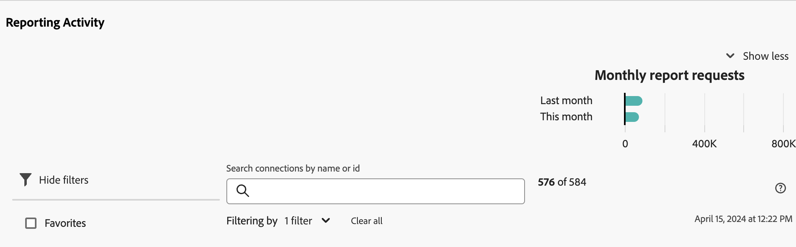
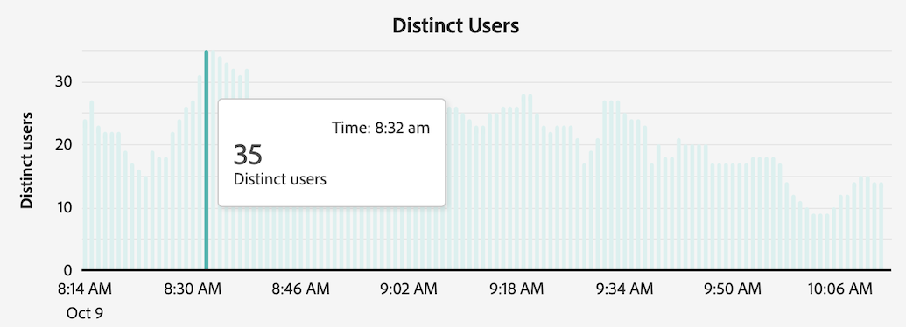
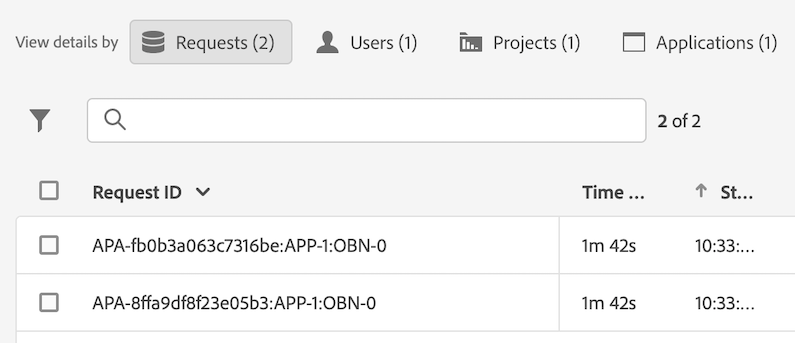

# Anzeigen der Berichtsaktivität {#view-reporting-activity}

Der [!UICONTROL Reporting Activity Manager] ermöglicht Admins das schnelle Diagnostizieren und Beheben von Problemen mit der Berichtskapazität während Spitzenzeiten des Reportings.

Weitere Informationen zum Reporting Activity Manager, einschließlich der wichtigsten Vorteile und Berechtigungsanforderungen, finden Sie unter [Überblick über den Reporting Activity Manager](/help/reporting-activity-manager/reporting-activity-overview.md).

## Für alle Verbindungen {#view-all-report-suites}

<!-- markdownlint-disable MD034 -->

>[!CONTEXTUALHELP]
>id="cja_tools_reportingactivitymanager_connections"
>title="Verbindungen"
>abstract="Diese Tabelle zeigt die Verbindungen, für die Sie zur Verwaltung der Reporting-Aktivität berechtigt sind. Informationen zu den einzelnen Verbindungen finden Sie in den jeweiligen Spalten der Tabelle."

<!-- markdownlint-enable MD034 -->

<!-- markdownlint-disable MD034 -->

>[!CONTEXTUALHELP]
>id="tools_reportingactivitymanager_connections"
>title="Verbindungen"
>abstract="Diese Tabelle zeigt die Verbindungen, für die Sie zur Verwaltung der Reporting-Aktivität berechtigt sind. Informationen zu den einzelnen Verbindungen finden Sie in den jeweiligen Spalten der Tabelle."

<!-- markdownlint-enable MD034 -->

1. Navigieren Sie in Customer Journey Analytics zu **[!UICONTROL Tools]** > **[!UICONTROL Reporting für Activity Manager]**.

   Es wird eine Liste Ihrer aktivierten, zugrunde liegenden Verbindungen angezeigt.

   

1. Um die Gesamtzahl der Berichtsanfragen für alle Verbindungen in Ihrer Organisation anzuzeigen, erweitern Sie [!UICONTROL **Mehr zeigen**], um das Diagramm [!UICONTROL **Monatliche Berichtsanfragen**] anzuzeigen.

   Sie können die Anzahl der Berichtsanfragen innerhalb Ihrer Organisation für den aktuellen Monat und den vorherigen Monat anzeigen.

   

1. (Optional) Sie können die Liste der Verbindungen durchsuchen oder filtern:

   * Wenn Sie nach einer bestimmten Verbindung suchen möchten, verwenden Sie das Suchfeld. Beginnen Sie mit der Eingabe des Namens oder der ID der Verbindung. Die Liste der Verbindungen wird während der Eingabe aktualisiert.

   * Wählen Sie  aus, um die Liste der Segmentoptionen zu erweitern. Sie können nach [!UICONTROL **Favoriten**] oder [!UICONTROL **Status**] filtern.

     Um eine Verbindung als Favoriten zu markieren, wählen Sie das Sternsymbol links neben dem Namen der Verbindung aus.

     <!-- (does this option still exist?) 1. (Optional) Select **[!UICONTROL Refresh]** at the top-right to refresh the data. -->

1. Anzeigen von Nutzungsinformationen zu jeder Verbindung. Die in der Tabelle angezeigten Daten stellen die Berichtsaktivität für die Verbindung zum Zeitpunkt des letzten Seitenladevorgangs dar.

   Die folgenden Spalten sind verfügbar:

   | UI-Element | Beschreibung |
   | --- | --- |
   | **[!UICONTROL Verbindung]** | Die Verbindung, deren Berichtsaktivität von Ihnen überwacht wird. |
   | **[!UICONTROL Datenansichten]** | Zeigt alle Datenansichten an, die die Verbindung verwenden. Die Konfiguration von Datenansichten kann Berichtsanfragen komplexer machen. |
   | **[!UICONTROL Kapazitätsauslastung]** | Der prozentuale Anteil, wie viel der Berichterstellungskapazität der Verbindung in Echtzeit verwendet wird. 
**Hinweis** Bei einer Nutzungskapazität von 100 % sollten Sie nicht unbedingt sofort mit dem Abbrechen von Berichtsanfragen beginnen. Eine Nutzungskapazität von 100 % kann in Ordnung sein, wenn die durchschnittliche Wartezeit angemessen bleibt. Andererseits könnte eine Nutzungskapazität von 100 % ein Problem darstellen, wenn auch die Anzahl der Anfragen in der Warteschlange zunimmt.
 |
   | **[!UICONTROL Anfragen in der Warteschlange]** | Die Anzahl der Anfragen, die auf die Verarbeitung warten. <!-- ??? --> |
   | **[!UICONTROL Wartezeit in der Warteschlange]** | Die durchschnittliche Wartezeit, bevor die Verarbeitung von Anfragen beginnt. <!-- ???? --> |
   | **[!UICONTROL Status]** | Die verschiedenen Status sind: <ul><li>[!UICONTROL **Aktiv**] (blau): In den letzten 2 Stunden wurden Berichte für die Verbindung ausgeführt. Die in der Tabelle angezeigten Daten stellen die Berichtskapazität für die Verbindung zum Zeitpunkt des letzten Seitenladevorgangs dar.</li><li>[!UICONTROL **Inaktiv**] (grau): In den letzten 2 Stunden wurden keine Berichte zur Verbindung ausgeführt, sodass keine Daten für die Verbindung angezeigt werden.</li></ul> |

   {style="table-layout:auto"}

## Für eine einzelne Verbindung

1. Wählen Sie in Customer Journey Analytics [!UICONTROL **Tools**] > [!UICONTROL **Reporting für Activity Manager**] aus.

1. Wählen Sie den verknüpften Titel der Verbindung aus, für die Sie Details anzeigen möchten.

   Daten zur Berichtsaktivität werden für die von Ihnen ausgewählte Verbindung angezeigt.

1. (Optional) Beim ersten Laden einer Verbindung im Reporting für Activity Manager entsprechen die angezeigten Daten den aktuellen Nutzungsmetriken. Um aktualisierte Metriken nach dem ersten Laden anzuzeigen, wählen Sie die Schaltfläche [!UICONTROL **Aktualisieren**] aus, um die Seite manuell zu aktualisieren.

   <!-- Need to update this screenshot:  -->

1. Verwenden Sie die verfügbaren Diagramme und Tabellen, um die Berichtsaktivität in der Verbindung nachzuvollziehen.

   * [Anzeigen von Diagrammen](#view-graphs)

   * [Anzeigen von Tabellen](#view-table)

### Anzeigen von Diagrammen

Die folgenden Diagramme helfen Ihnen, die Aktivitäten in der Verbindung besser nachzuvollziehen.

Wenn keine Diagramme sichtbar sind, wählen Sie die Schaltfläche [!UICONTROL **Diagramme anzeigen**] aus.

#### Diagramm „Nutzung“ {#utilization}

Das Diagramm „Nutzung“ zeigt die Berichtsnutzung für die ausgewählte Verbindung in den letzten zwei Stunden an.

Bewegen Sie den Mauszeiger über das Diagramm, um die Zeitpunkte anzuzeigen, an denen der Prozentsatz der Nutzungskapazität für diese Minute am höchsten war.

* **X-Achse**: Die Berichtsnutzungskapazität in den letzten zwei Stunden.
* **Y-Achse**: Der Prozentsatz der Berichtsnutzungskapazität in Minuten.

  

#### Diagramm „Unterschiedliche Benutzende“

Das Diagramm „Unterschiedliche Benutzende“ zeigt die Berichtsaktivität für die ausgewählte Verbindung in den letzten zwei Stunden an.

Bewegen Sie den Mauszeiger über das Diagramm, um die Zeitpunkte anzuzeigen, an denen die maximale Anzahl von Benutzenden für diese Minute am höchsten war.

* **X-Achse**: Die Berichtsaktivität in den letzten zwei Stunden.
* **Y-Achse**: Die Anzahl der Benutzenden, die Berichtsanfragen gestellt haben, für jede Minute.

  

#### Diagramm „Anfragen“

Das Diagramm „Anfragen“ zeigt die Anzahl der in den letzten zwei Stunden verarbeiteten und in die Warteschlange gestellten Anfragen für die ausgewählte Verbindung an.

Bewegen Sie den Mauszeiger über das Diagramm, um die Zeitpunkte anzuzeigen, an denen die maximale Anzahl von Anfragen für diese Minute am höchsten war.

* **X-Achse**: Die Anzahl der verarbeiteten und in die Warteschlange gestellten Anfragen in den letzten zwei Stunden.
* **Y-Achse**: Die Anzahl der verarbeiteten Anfragen (grün) und der in die Warteschlange gestellten Anfragen (violett) für jede Minute.

  

#### Diagramm „In Warteschlange“

Das Diagramm „In Warteschlange“ zeigt die durchschnittliche Warteschlangenwartezeit (in Sekunden) für Berichtsanfragen für die ausgewählte Verbindung in den letzten zwei Stunden an.

Bewegen Sie den Mauszeiger über das Diagramm, um die Zeitpunkte anzuzeigen, an denen die maximale durchschnittliche Wartezeit für diese Minute am höchsten war.

* **X-Achse**: Die durchschnittliche Warteschlangenwartezeit für Berichtsanfragen in den letzten zwei Stunden.
* **Y-Achse**: Die durchschnittliche Wartezeit (in Sekunden).

  

### Anzeigen von Tabellen {#view-table}

Berücksichtigen Sie beim Anzeigen einer Tabelle Folgendes:

* Sie können Daten anzeigen, indem Sie oben in der Datentabelle eine der folgenden Registerkarten auswählen: [!UICONTROL **Anfrage**], [!UICONTROL **Benutzer**], [!UICONTROL **Projekt**] oder [!UICONTROL **Anwendung**].

* Sie können die Liste der Verbindungen durchsuchen oder filtern:

   * Wenn Sie nach einer bestimmten Verbindung suchen möchten, verwenden Sie das Suchfeld. Beginnen Sie mit der Eingabe des Namens oder der ID der Verbindung. Die Liste der Verbindungen wird während der Eingabe aktualisiert.

   * Wählen Sie das [!UICONTROL **Filter**]-Symbol  aus, um die Liste der Filteroptionen zu erweitern. Sie können nach [!UICONTROL **Status**], [!UICONTROL **Komplexität**], [!UICONTROL **Anwendung**], [!UICONTROL **Benutzer**] oder [!UICONTROL **Projekt**] filtern.

   * Sie können [!UICONTROL **Diagramme ausblenden**] auswählen, um nur die Tabelle anzuzeigen.

#### Anzeigen von Daten nach Anfrage

Wenn Sie die Registerkarte [!UICONTROL **Anfrage**] auswählen, sind in der Tabelle die folgenden Spalten verfügbar:

| Spalte | Beschreibung |
| --- | --- |
| [!UICONTROL **Anfrage-ID**] | Eine eindeutige ID, die zur Fehlerbehebung verwendet werden kann. Um die ID zu kopieren, wählen Sie die Anfrage und dann die Option [!UICONTROL **Anfrage-IDs kopieren**] aus. |
| [!UICONTROL **Ausführungszeit**] | Die Dauer der Anfrage. |
| [!UICONTROL **Startzeit**] | Der Zeitpunkt, zu dem die Verarbeitung der Anfrage begonnen hat (Administrator-Ortzeit). |
| [!UICONTROL **Wartezeit**] | Die Wartezeit für die Anfrage bis zu ihrer Verarbeitung. Dieser Wert liegt im Allgemeinen bei „0“, wenn genügend Kapazität vorhanden ist. |
| [!UICONTROL **Programm**] | Die von [!UICONTROL Reporting Activity Manager] unterstützten Programme sind: <ul><li>Analysis Workspace-Benutzeroberfläche</li><li>Geplante Projekte im Workspace</li><li>Report Builder</li><li>Builder-Benutzeroberflächen: Segment, berechnete Metriken, Anmerkungen, Zielgruppen und so weiter.</li><li>API-Aufrufe aus der API 2.0</li><li>Warnhinweise<li>Vollständiger Tabellenexport</li><li>Links „Für alle freigeben“</li><li>Geführte Analyse</li><li>Jede andere Anwendung, die die Analytics-Reporting-Engine abfragt</li></li></ul>
**Hinweis:** Wenn der Wert dieser Spalte [!UICONTROL **Unbekannt**] lautet, bedeutet dies, dass die Anfragemetadaten für die Benutzerin oder den Benutzer nicht verfügbar sind.
 |
| [!UICONTROL **Benutzende**] | Die Person, die die Anfrage initiiert hat. 
**Hinweis:** Wenn der Wert dieser Spalte [!UICONTROL **Unbekannt**] lautet, bedeutet dies, dass die Anfragemetadaten für die Benutzerin oder den Benutzer nicht verfügbar sind.
 |
| [!UICONTROL **Projekt**] | Gespeicherte Workspace-Projektnamen, API-Berichts-IDs und so weiter. (Metadaten können von Programm zu Programm variieren.)
**Hinweis:** Wenn der Wert dieser Spalte [!UICONTROL **Unbekannt**] lautet, bedeutet dies, dass das Projekt nicht gespeichert wurde oder dass die Anfragemetadaten für die Benutzerin oder den Benutzer nicht verfügbar sind.
 |
| [!UICONTROL **Status**] | Statusindikatoren: <ul><li>**Läuft**: Die Anfrage wird derzeit verarbeitet.</li><li>**Ausstehend**: Die Anfrage wartet auf die Verarbeitung.</li></ul> |
| [!UICONTROL **Komplexität**] | Nicht alle Anträge benötigen gleich viel Zeit zur Bearbeitung. Die Komplexität der Anfrage kann eine allgemeine Vorstellung davon vermitteln, wie viel Zeit für die Bearbeitung der Anfrage benötigt wird. 
Mögliche Werte sind:
 <ul><li>[!UICONTROL **Niedrig**]</li><li>[!UICONTROL **Mittel**]</li><li>[!UICONTROL **Hoch**]</li></ul>Dieser Wert wird durch die Werte in den folgenden Spalten beeinflusst:<ul><li>[!UICONTROL **Monatsgrenzen**]</li><li>[!UICONTROL **Spalten**]</li><li>[!UICONTROL **Segmente**]</li></ul> |
| [!UICONTROL **Monatsgrenzen**] | Die Anzahl der Monate, die in einer Anfrage eingeschlossen sind. Erweiterte Monatsgrenzen erhöhen die Komplexität der Anfrage. |
| [!UICONTROL **Spalten**] | Die Anzahl der Metriken und Aufschlüsselungen in der Anfrage. Mehr Spalten erhöhen die Komplexität der Anfrage. |
| [!UICONTROL **Segmente**] | Die Anzahl der auf die Anfrage angewendeten Segmente. Mehr Segmente erhöhen die Komplexität der Anfrage. |

{style="table-layout:auto"}

#### Anzeigen von Daten nach Benutzenden

Wenn Sie die Registerkarte [!UICONTROL **Benutzer**] auswählen, sind die folgenden Spalten in der Tabelle verfügbar:

| Spalte | Beschreibung |
| --- | --- |
| [!UICONTROL **Benutzende**] | Die Person, die die Anfrage initiiert hat. Wenn der Wert dieser Spalte [!UICONTROL **Nicht erkannt**] lautet, bedeutet dies, dass sich die Benutzerin bzw. der Benutzer in einer Unternehmensanmeldung befindet, für die Sie keine Admin-Berechtigungen haben. |
| [!UICONTROL **Anzahl der Anfragen**] | Die Anzahl der benutzerseitig initiierten Anfragen. |
| [!UICONTROL **Anzahl der Projekte**] | Die Anzahl der mit einer Person verknüpften Projekte. <!-- ??? --> |
| [!UICONTROL **Programm**] | Die von [!UICONTROL Reporting Activity Manager] unterstützten Programme sind: <ul><li>Analysis Workspace-Benutzeroberfläche</li><li>Geplante Projekte im Workspace</li><li>Report Builder</li><li>Builder-Benutzeroberflächen: Segment, berechnete Metriken, Anmerkungen, Zielgruppen und so weiter.</li><li>API-Aufrufe aus der API 2.0</li><li>Warnhinweise<li>Vollständiger Tabellenexport</li><li>Links „Für alle freigeben“</li><li>Geführte Analyse</li><li>Jede andere Anwendung, die die Analytics-Reporting-Engine abfragt</li></li></ul> |
| [!UICONTROL **Durchschnittliche Komplexität**] | Die durchschnittliche Komplexität der benutzerseitig initiierten Anfragen. 
Nicht alle Anträge benötigen gleich viel Zeit zur Bearbeitung. Die Komplexität der Anfrage kann eine allgemeine Vorstellung davon vermitteln, wie viel Zeit für die Bearbeitung der Anfrage benötigt wird.

Der Wert in dieser Spalte basiert auf einem Score, der durch die Werte in den folgenden Spalten bestimmt wird:
<ul><li>[!UICONTROL **Durchschnittliche Monatsgrenzen**]</li><li>[!UICONTROL **Durchschnittliche Spalten**]</li><li>[!UICONTROL **Durchschnittliche Segmente**]</li></ul> |
| [!UICONTROL **Durchschnittliche Monatsgrenzen**] | Die durchschnittliche Anzahl der in den Anfragen eingeschlossenen Monate. Erweiterte Monatsgrenzen erhöhen die Komplexität der Anfrage. |
| [!UICONTROL **Durchschnittliche Spalten**] | Die durchschnittliche Anzahl der Metriken und Aufschlüsselungen in den eingeschlossenen Anfragen. Mehr Spalten erhöhen die Komplexität der Anfrage. |
| [!UICONTROL **Durchschnittliche Segmente**] | Die durchschnittliche Anzahl der auf die eingeschlossenen Anfragen angewendeten Segmente. Mehr Segmente erhöhen die Komplexität der Anfrage. |

{style="table-layout:auto"}

#### Anzeigen von Daten nach Projekt

Wenn Sie die Registerkarte [!UICONTROL **Projekt**] auswählen, sind die folgenden Spalten in der Tabelle verfügbar:

| Spalte | Beschreibung |
| --- | --- |
| [!UICONTROL **Projekt**] | Das Projekt, in dem die Anfragen initiiert wurden. |
| [!UICONTROL **Anzahl der Anfragen**] | Die Anzahl der mit dem Projekt verknüpften Anfragen. |
| [!UICONTROL **Anzahl der Benutzenden**] | Die Anzahl der mit dem Projekt verknüpften Benutzenden. <!-- ??? --> |
| [!UICONTROL **Programm**] | Die von [!UICONTROL Reporting Activity Manager] unterstützten Programme sind: <ul><li>Analysis Workspace-Benutzeroberfläche</li><li>Geplante Projekte im Workspace</li><li>Report Builder</li><li>Builder-Benutzeroberflächen: Segment, berechnete Metriken, Anmerkungen, Zielgruppen und so weiter.</li><li>API-Aufrufe aus der API 2.0</li><li>Warnhinweise<li>Vollständiger Tabellenexport</li><li>Links „Für alle freigeben“</li><li>Geführte Analyse</li><li>Jede andere Anwendung, die die Analytics-Reporting-Engine abfragt</li></li></ul> |
| [!UICONTROL **Durchschnittliche Komplexität**] | Die durchschnittliche Komplexität der im Projekt eingeschlossenen Anfragen. 
Nicht alle Anträge benötigen gleich viel Zeit zur Bearbeitung. Die Komplexität der Anfrage kann eine allgemeine Vorstellung davon vermitteln, wie viel Zeit für die Bearbeitung der Anfrage benötigt wird.

Der Wert in dieser Spalte basiert auf einem Score, der durch die Werte in den folgenden Spalten bestimmt wird:
<ul><li>[!UICONTROL **Durchschnittliche Monatsgrenzen**]</li><li>[!UICONTROL **Durchschnittliche Spalten**]</li><li>[!UICONTROL **Durchschnittliche Segmente**]</li></ul> |
| [!UICONTROL **Durchschnittliche Monatsgrenzen**] | Die durchschnittliche Anzahl der in den Anfragen eingeschlossenen Monate. Erweiterte Monatsgrenzen erhöhen die Komplexität der Anfrage. |
| [!UICONTROL **Durchschnittliche Spalten**] | Die durchschnittliche Anzahl der Metriken und Aufschlüsselungen in den eingeschlossenen Anfragen. Mehr Spalten erhöhen die Komplexität der Anfrage. |
| [!UICONTROL **Durchschnittliche Segmente**] | Die durchschnittliche Anzahl der auf die eingeschlossenen Anfragen angewendeten Segmente. Mehr Segmente erhöhen die Komplexität der Anfrage. |

{style="table-layout:auto"}

#### Anzeigen von Daten nach Anwendung

Wenn Sie die Registerkarte [!UICONTROL **Anwendung**] auswählen, sind die folgenden Spalten in der Tabelle verfügbar:

| Spalte | Beschreibung |
| --- | --- |
| [!UICONTROL **Programm**] | Die Anwendung, in der die Anfragen initiiert wurden. |
| [!UICONTROL **Anzahl der Anfragen**] | Die Anzahl der mit der Anwendung verknüpften Anfragen. |
| [!UICONTROL **Anzahl der Benutzenden**] | Die Anzahl der mit der Anwendung verknüpften Benutzenden. <!--???--> |
| [!UICONTROL **Anzahl der Projekte**] | Die Anzahl der mit der Anwendung verknüpften Projekte. <!--???--> |
| [!UICONTROL **Durchschnittliche Komplexität**] | Die durchschnittliche Komplexität der mit der Anwendung verknüpften Anfragen. 
Nicht alle Anträge benötigen gleich viel Zeit zur Bearbeitung. Die Komplexität der Anfrage kann eine allgemeine Vorstellung davon vermitteln, wie viel Zeit für die Bearbeitung der Anfrage benötigt wird.

Der Wert in dieser Spalte basiert auf einem Score, der durch die Werte in den folgenden Spalten bestimmt wird:
Der Wert in dieser Spalte basiert auf einem Score, der durch die Werte in den folgenden Spalten bestimmt wird:<ul><li>[!UICONTROL **Durchschnittliche Monatsgrenzen**]</li><li>[!UICONTROL **Durchschnittliche Spalten**]</li><li>[!UICONTROL **Durchschnittliche Segmente**]</li></ul> |
| [!UICONTROL **Durchschnittliche Monatsgrenzen**] | Die durchschnittliche Anzahl der in den Anfragen eingeschlossenen Monate. Erweiterte Monatsgrenzen erhöhen die Komplexität der Anfrage. |
| [!UICONTROL **Durchschnittliche Spalten**] | Die durchschnittliche Anzahl der Metriken und Aufschlüsselungen in den eingeschlossenen Anfragen. Mehr Spalten erhöhen die Komplexität der Anfrage. |
| [!UICONTROL **Durchschnittliche Segmente**] | Die durchschnittliche Anzahl der auf die eingeschlossenen Anfragen angewendeten Segmente. Mehr Segmente erhöhen die Komplexität der Anfrage. |

{style="table-layout:auto"}

<!-- 

## Frequently asked questions {#faq}

| Question | Answer |
| --- | --- |
| | |

{style="table-layout:auto"}

-->
