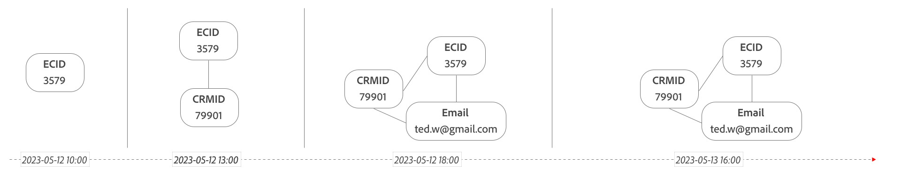

# Stitching

>[!NOTE]
>
>Sie müssen über die **Auswählen** Paket oder höher (für feldbasiertes Stitching) oder **Prime** -Paket oder höher (für grafikbasiertes Stitching) verwenden, um die in diesem Abschnitt beschriebene Funktion zu verwenden. Wenden Sie sich an Ihre Admins, wenn Sie sich nicht sicher sind, welches Customer Journey Analytics-Paket Sie besitzen.

Die Identitätszuordnung (oder einfach das Stitching) ist eine leistungsstarke Funktion, die die Eignung eines Ereignis-Datensatzes für die kanalübergreifende Analyse erhöht. Die kanalübergreifende Analyse ist ein Hauptanwendungsfall, den Customer Journey Analytics handhaben kann. So können Sie Berichte basierend auf einer gemeinsamen Kennung (Personen-ID) nahtlos mit mehreren Datensätzen aus verschiedenen Kanälen kombinieren und ausführen.

Wenn Sie Datensätze mit ähnlichen Personen-IDs kombinieren, wird die Attribution geräte- und kanalübergreifend übernommen. Beispiel: Ein Benutzer besucht Ihre Site zum ersten Mal über eine Werbeanzeige auf seinem Desktop. Dieser Benutzer stößt bei seiner Bestellung auf ein Problem und ruft dann Ihren Kundendienst an, um das Problem zu beheben. Mit der kanalübergreifenden Analyse können Sie Callcenter-Ereignisse der Anzeige zuordnen, auf die sie ursprünglich geklickt haben.

Leider sind nicht alle ereignisbasierten Datensätze, die Teil Ihrer Customer Journey Analytics-Verbindung sind, ausreichend mit Daten gefüllt, um diese Attribution standardmäßig zu unterstützen. Insbesondere verfügen Web- oder mobile-basierte Erlebnisdatensätze häufig nicht über tatsächliche Personen-ID-Informationen für alle Ereignisse.

Die Zuordnung ermöglicht die Neuzuordnung von Identitäten in den Zeilen eines Datensatzes und stellt sicher, dass die Personen-ID (zugeordnete ID) für jedes Ereignis verfügbar ist. Beim Zuordnen werden Benutzerdaten aus authentifizierten und nicht authentifizierten Sitzungen untersucht, um den allgemeinen Wert für die vorübergehende ID (Personen-ID) zu ermitteln, der als zugeordnete ID verwendet werden kann. Diese Neuzuweisung ermöglicht die Auflösung verschiedener Datensätze zu einer einzigen zugeordneten ID, die auf der Personenebene und nicht auf der Geräte- oder Cookie-Ebene analysiert werden kann.

Customer Journey Analytics unterstützt zwei Arten von Stitching: feldbasiertes Stitching und grafisches Stitching.

## Voraussetzungen

>[!IMPORTANT]
>
>Wenn nicht alle Voraussetzungen erfüllt sind, kann die kanalübergreifende Analyse nicht ordnungsgemäß durchgeführt werden.

Stellen Sie vor der Verwendung von Stitching sicher, dass Ihr Unternehmen wie folgt vorbereitet ist:

- Die Zuordnung umfasst das Zusammenführen authentifizierter und nicht authentifizierter Benutzerdaten. Stellen Sie sicher, dass Sie die geltenden Gesetze und Vorschriften einhalten, einschließlich der Erlangung der erforderlichen Endbenutzerberechtigungen, bevor Sie die Zuordnung für einen Ereignis-Datensatz aktivieren. Weitere Informationen finden Sie unter [Definieren von Identitätsfeldern in der Benutzeroberfläche](https://experienceleague.adobe.com/de/docs/experience-platform/xdm/ui/fields/identity).

- Importieren Sie die gewünschten Daten in Adobe Experience Platform:

   - Informationen zu Adobe Analytics-Daten finden Sie unter [Verwenden von Adobe Analytics Report Suite-Daten in Customer Journey Analytics](/help/getting-started/aa-vs-cja/aa-data-in-cja.md).
   - Informationen zu anderen Datentypen finden Sie unter [Erstellen eines Schemas](https://experienceleague.adobe.com/en/docs/experience-platform/xdm/tutorials/create-schema-ui) und [Aufnehmen von Daten](https://experienceleague.adobe.com/en/docs/experience-platform/ingestion/home) in der Adobe Experience Platform-Dokumentation.

Sie profitieren von einer kanalübergreifenden Analyse, wenn Sie einen oder mehrere Ihrer zugeordneten Datensätze mit anderen Datensätzen, z. B. Callcenter-Daten, kombinieren, um Ihre Customer Journey Analytics-Verbindung zu definieren. Bei dieser Verbindungskonfiguration wird davon ausgegangen, dass diese anderen Datensätze bereits in jeder Zeile eine Personen-ID enthalten, die der zugeordneten ID ähnelt.

## Einschränkungen

>[!IMPORTANT]
>
>- Keine Unterstützung für die Verwendung von `identityMap` als beständige ID. Sie müssen eine bestimmte Kennung im Datensatz definieren (z. B. `ECID`) als beständige ID.
>
>- Wenden Sie alle Änderungen, die Sie an dem Quellereignis-Datensatzschema vornehmen, auch auf das neue zugeordnete Datensatzschema an. Andernfalls wird der zugeordnete Datensatz beschädigt.
>
>- Wenn Sie den Quelldatensatz entfernen, stoppt der zugeordnete Datensatz die Verarbeitung und wird vom System entfernt.
>
>- Datennutzungsbezeichnungen werden nicht automatisch in das zugeordnete Datensatzschema übertragen. Wenn Sie Datennutzungsbezeichnungen auf das Quelldatensatzschema angewendet haben, müssen Sie diese Datennutzungsbezeichnungen manuell auf das zugeordnete Datensatzschema anwenden. Siehe [Verwalten von Datennutzungsbezeichnungen in Experience Platform](https://experienceleague.adobe.com/en/docs/experience-platform/data-governance/labels/overview) für weitere Informationen.

Das Stitching ist eine innovative und zuverlässige Funktion, die jedoch Einschränkungen hinsichtlich der Verwendung aufweist.

- Es werden nur Ereignis-Datensätze unterstützt. Andere Datensätze, wie beispielsweise Lookup-Datensätze, werden nicht unterstützt.
- Beim Stitching wird das für das Stitching verwendete Feld in keiner Weise umgewandelt. Beim Zuordnen wird der Wert im angegebenen Feld verwendet, da er im nicht zugeordneten Datensatz im Data Lake vorhanden ist.
- Beim Zuordnen wird zwischen Groß- und Kleinschreibung unterschieden. Wenn beispielsweise manchmal das Wort &quot;Bob&quot;im Feld erscheint und manchmal das Wort &quot;BOB&quot;erscheint, werden diese IDs als zwei separate Personen behandelt.

Vergewissern Sie sich, dass Sie die Zuordnung nicht mit Folgendem verwechseln:

- Die Zusammenführung von zwei oder mehr Datensätzen. Die Zuordnung gilt nur für einen Datensatz. Die Zusammenführung von Datensätzen erfolgt durch Einrichtung einer Customer Journey Analytics-Verbindung und Auswahl derselben Personen-ID für die ausgewählten Datensätze in der Verbindung.

- Der Join zweier Datensätze. Unter Customer Journey Analytics wird häufig ein Join für Suchen oder Klassifizierungen in Analysis Workspace verwendet. Obwohl das Stitching die Join-Funktion verwendet, umfasst der Prozess selbst mehr als nur Joins.

## Feldbasiertes Stitching

Sie geben einen Ereignis-Datensatz sowie die beständige ID (Cookie) und die vorübergehende ID (Personen-ID) für diesen Datensatz an. Beim feldbasierten Stitching wird im neuen zugeordneten Datensatz eine neue Spalte für die zugeordnete ID erstellt und diese Spalte für die zugeordnete ID basierend auf Zeilen mit einer vorübergehenden ID für diese bestimmte beständige ID aktualisiert.  Sie können feldbasiertes Stitching verwenden, wenn Sie Customer Journey Analytics als eigenständige Lösung verwenden (ohne Zugriff auf den Experience Platform Identity-Dienst und das zugehörige Identitätsdiagramm). Oder wenn Sie das verfügbare Identitätsdiagramm nicht verwenden möchten.

### Funktionsweise der feldbasierten Zuordnung

Durch die Zuordnung werden mindestens zwei Durchgänge an Daten in einem bestimmten Datensatz durchgeführt.

- **Live-Stitching**: versucht, jeden Treffer (Ereignis) beim Eintreten zuzuordnen. Treffer von Geräten, die dem Datensatz &quot;neu&quot;sind (sich noch nie authentifiziert haben), werden normalerweise nicht auf dieser Ebene zugeordnet. Treffer von bereits erkannten Geräten werden sofort zugeordnet.

- **Wiederholungszuordnung**: wiederholt Daten basierend auf eindeutigen Kennungen (vorübergehenden IDs), die gelernt wurden. In dieser Phase werden Treffer von zuvor unbekannten Geräten (beständigen IDs) zugeordnet (zu vorübergehenden IDs). Adobe bietet zwei Wiederholungsintervalle:
   - **Täglich**: Die Daten werden täglich mit einem 24-Stunden-Lookback-Fenster wiederholt. Diese Option bietet den Vorteil, dass Wiederholungen viel häufiger vorkommen. Nicht authentifizierte Besucher müssen sich jedoch an dem Tag authentifizieren, an dem sie Ihre Website besuchen.
   - **Wöchentlich**: Daten werden einmal wöchentlich mit dem ausgewählten Lookback-Fenster wiederholt (siehe [options](#options)). Diese Option bietet den Vorteil, dass nicht authentifizierte Sitzungen über einen weniger eng gefasst Zeitraum für die Authentifizierung verfügen. Nicht zugeordnete Daten, die weniger als eine Woche alt sind, werden jedoch erst bei der nächsten wöchentlichen Wiederholung erneut verarbeitet.

- **Datenschutz**: Wenn datenschutzbezogene Anfragen empfangen werden, muss neben der Entfernung der angeforderten Identität auch die Zuordnung dieser Identität zu nicht authentifizierten Ereignissen rückgängig gemacht werden.

Daten, die über das Lookback-Fenster hinausgehen, werden nicht wiederholt. Ein Besucher muss sich in einem gegebenen Lookback-Fenster authentifizieren, damit ein nicht authentifizierter Besuch und ein authentifizierter Besuch gemeinsam identifiziert werden können. Sobald ein Gerät erkannt wurde, wird es von diesem Punkt an live zugeordnet.

#### Schritt 1: Live-Stitching

Die Live-Zuordnung versucht, jedes Ereignis bei der Erfassung bekannten Geräten und Kanälen zuzuordnen.

+++ Details

Im folgenden Beispiel zeichnet Bob verschiedene Ereignisse als Teil eines Ereignis-Datensatzes auf.

*Daten, wie sie am Tag der Erfassung erschienen:*

| Ereignis | Zeitstempel | Beständige ID (Cookie-ID) | Verlaufs-ID (Anmelde-ID) | Zugeordnete ID (nach der Live-Zuordnung) |
|---|---|---|---|---|
| 1 | 12.05.2023 12:01 | `246`  | – | **`246`** |
| 2 | 2023-05-12 12:02 | `246` | `Bob`  | `Bob` |
| 3 | 2023-05-12 12:03 | `246` | `Bob`  | `Bob`  |
| 4 | 2023-05-12 12:04 | `246` | – | **`Bob`** |
| 5 | 2023-05-12 12:05 | `246` | `Bob`  | `Bob`  |
| 6 | 2023-05-12 12:06 | `246` | – | **`Bob`** |
| 7 | 2023-05-12 12:07 | `246` | `Bob`  | `Bob` |
| 8 | 2023-05-12 12:03 | `3579`  | – | **`3579`** |
| 9 | 2023-05-12 12:09 | `3579`  | – | **`3579`** |
| 10 | 2023-05-12 12:02 | `81911`  | – | **`81911`** |
| 11 | 2023-05-12 12:05 | `81911` | `Bob`  | `Bob`  |
| 12 | 2023-05-12 12:12 | `81911` | – | **`Bob`** |
| | | **3 Geräte** | | **4 Personen**: `246`, `Bob`, `3579`, `81911` |

Sowohl nicht authentifizierte als auch authentifizierte Ereignisse auf neuen Geräten werden (vorübergehend) als separate Personen gezählt. Nicht authentifizierte Ereignisse auf erkannten Geräten werden live zugeordnet.

Die Attribution funktioniert, wenn die identifizierende benutzerdefinierte Variable an ein Gerät gebunden ist. Im obigen Beispiel werden alle Ereignisse mit Ausnahme der Ereignisse 1, 8, 9 und 10 live zugeordnet (sie verwenden alle die `Bob` Kennung). Die Live-Zuordnung &quot;löst&quot;die zugeordnete ID für die Ereignisse 4, 6 und 12 auf.

Verzögerte Daten (Daten mit einem Zeitstempel über 24 Stunden) werden nach bestem Wissen und Gewissen verarbeitet, wobei die Zuordnung aktueller Daten für die höchste Qualität priorisiert wird.

+++

#### Schritt 2: Wiederholungszuordnung

In regelmäßigen Abständen (einmal pro Woche oder einmal pro Tag, je nach ausgewähltem Lookback-Fenster) berechnet die Wiederholungszuordnung historische Daten basierend auf Geräten, die sie jetzt erkennt, neu. Wenn ein Gerät anfänglich Daten sendet, ohne authentifiziert zu sein, und sich dann anmeldet, werden diese nicht authentifizierten Ereignisse bei der Wiederholungszuordnung der richtigen Person zugeordnet.

+++ Details

Die folgende Tabelle stellt dieselben Daten wie oben dar, zeigt jedoch unterschiedliche Zahlen basierend auf der Wiederholung der Daten.

*Dieselben Daten nach der Wiederholung:*

| Ereignis | Zeitstempel | Beständige ID (Cookie-ID) | Verlaufs-ID (Anmelde-ID) | Zugeordnete ID (nach der Live-Zuordnung) | Zugeordnete ID (nach der Wiederholung) |
|---|---|---|---|---|---|
| 1 | 12.05.2023 12:01 | `246` | – | `246` | **`Bob`** |
| 2 | 2023-05-12 12:02 | `246` | `Bob`  | `Bob` | `Bob`  |
| 3 | 2023-05-12 12:03 | `246` | `Bob`  | `Bob`  | `Bob` |
| 4 | 2023-05-12 12:04 | `246` | – | **`Bob`** | `Bob` |
| 5 | 2023-05-12 12:05 | `246` | `Bob`  | `Bob`  | `Bob` |
| 6 | 2023-05-12 12:06 | `246` | – | **`Bob`** | `Bob` |
| 7 | 2023-05-12 12:07 | `246` | `Bob`  | `Bob` | `Bob` |
| 8 | 2023-05-12 12:03 | `3579`  | – | **`3579`** | **`3579`** |
| 9 | 2023-05-12 12:09 | `3579`  | – | **`3579`** | **`3579`** |
| 10 | 2023-05-12 12:02 | `81911` | – | `81911` | **`Bob`** |
| 11 | 2023-05-12 12:05 | `81911` | `Bob`  | `Bob`  | `Bob`  |
| 12 | 2023-05-12 12:12 | `81911` | – | **`Bob`** | `Bob` |
| | | **3 Geräte** | | **4 Personen**: `246`, `Bob`, `3579`, `81911` | **2 Personen**: `Bob`, `3579` |

{style="table-layout:auto"}

Die Attribution funktioniert, wenn die identifizierende benutzerdefinierte Variable an ein Gerät gebunden ist. Im obigen Beispiel werden die Ereignisse 1 und 10 als Ergebnis der Wiederholung zugeordnet, wobei nur die Ereignisse 8 und 9 aufgetrennt bleiben. und die (kumulative) Personenzahl auf 2 zu reduzieren.

+++

#### Schritt 3: Datenschutzanfrage

Wenn Sie eine Datenschutzanfrage erhalten, wird die zugeordnete ID in allen Datensätzen für den Benutzer gelöscht, der der Datenschutzanfrage unterliegt.

+++ Details

Die folgende Tabelle stellt dieselben Daten wie oben dar, zeigt jedoch die Auswirkungen einer Datenschutzanfrage für Bob auf die Daten nach deren Verarbeitung. Die Zeilen, in denen Bob authentifiziert ist, werden entfernt (2, 3, 5, 7 und 11) sowie Bob als vorübergehende ID für andere Zeilen entfernt.

*Dieselben Daten nach einer Datenschutzanfrage für Bob:*

| Ereignis | Zeitstempel | Beständige ID (Cookie-ID) | Verlaufs-ID (Anmelde-ID) | Zugeordnete ID (nach der Live-Zuordnung) | Zugeordnete ID (nach der Wiederholung) | Verlaufs-ID (Anmelde-ID) | Zugeordnete ID (nach Datenschutzanfrage) |
|---|---|---|---|---|---|---|---|
| 1 | 12.05.2023 12:01 | `246` | – | `246` | **`Bob`** | – | `246` |
| 2 | 2023-05-12 12:02 | `246` | Bob  | `Bob` | `Bob`  |  | `246` |
| 3 | 2023-05-12 12:03 | `246` | Bob  | `Bob`  | `Bob` |  | `246` |
| 4 | 2023-05-12 12:04 | `246` | – | **`Bob`** | `Bob` | – | `246` |
| 5 | 2023-05-12 12:05 | `246` | Bob  | `Bob`  | `Bob` |  | `246` |
| 6 | 2023-05-12 12:06 | `246` | – | **`Bob`** | `Bob` | – | `246` |
| 7 | 2023-05-12 12:07 | `246` | `Bob`  | `Bob` | `Bob` |  | `246` |
| 8 | 2023-05-12 12:03 | `3579`  | – | **`3579`** | **`3579`** | – | `3579` |
| 9 | 2023-05-12 12:09 | `3579`  | – | **`3579`** | **`3579`** | – | `3579` |
| 10 | 2023-05-12 12:02 | `81911` | – | `81911` | **`Bob`** | – | `81911` |
| 11 | 2023-05-12 12:05 | `81911` | `Bob`  | `Bob`  | `Bob`  |  | `81911` |
| 12 | 2023-05-12 12:12 | `81911` | – | **`Bob`** | `Bob` | – | `81911` |
| | | **3 Geräte** | | **4 Personen**: 246, `Bob`, `3579`, `81911` | **2 Personen**: Bob, `3579` |  | **3 Personen**: `246`, `3579`, `81911` |

+++

### Voraussetzungen

Die folgenden Voraussetzungen gelten speziell für feldbasiertes Stitching:

- Der Ereignisdatensatz in Adobe Experience Platform, auf den Sie die Zuordnung anwenden möchten, muss über zwei Spalten verfügen, mit denen Besucher identifiziert werden können:

   - A **beständige ID**, eine Kennung, die in jeder Zeile verfügbar ist. Beispielsweise eine Besucher-ID, die von einer Adobe Analytics-AppMeasurement-Bibliothek generiert wurde, oder eine ECID, die vom Adobe Experience Platform Identity-Dienst generiert wurde.
   - A **vorübergehende ID**, eine Kennung, die nur für einige Zeilen verfügbar ist. Beispiel: ein/e gehashte/r Benutzername oder E-Mail-Adresse, wenn sich ein Besucher authentifiziert. Sie können praktisch jede beliebige Kennung verwenden. Beim Stitching wird dieses Feld für die tatsächlichen Personen-ID-Informationen berücksichtigt. Für optimale Zuordnungsergebnisse sollte für jede beständige ID mindestens einmal innerhalb der Ereignisse des Datensatzes eine vorübergehende ID gesendet werden. Wenn Sie diesen Datensatz in eine Customer Journey Analytics-Verbindung einschließen möchten, sollten die anderen Datensätze ebenfalls eine ähnliche gemeinsame Kennung aufweisen.

- Beide Spalten (beständige ID und vorübergehende ID) müssen als Identitätsfeld mit einem Identitäts-Namespace im Schema für den Datensatz definiert werden, den Sie zuordnen möchten. Bei Verwendung der Identitätszusammenfügung in Real-time Customer Data Platform wird mithilfe der [`identityMap` Feldergruppe](https://experienceleague.adobe.com/en/docs/experience-platform/xdm/schema/composition#identity)müssen Sie weiterhin Identitätsfelder mit einem Identitäts-Namespace hinzufügen. Diese Identifizierung von Identitätsfeldern ist erforderlich, da das Customer Journey Analytics-Stitching die `identityMap` Feldergruppe. Wenn Sie ein Identitätsfeld im Schema hinzufügen, während Sie auch die `identityMap` Feldergruppe verwenden, dürfen Sie das zusätzliche Identitätsfeld nicht als primäre Identität festlegen. Das Festlegen eines zusätzlichen Identitätsfelds als primäre Identität stört die `identityMap` für Real-time Customer Data Platform verwendete Feldergruppe.

### Einschränkungen

Die folgenden Einschränkungen gelten speziell für feldbasiertes Stitching:

- Die aktuellen Funktionen zur Neuzuweisung sind auf einen Schritt beschränkt (beständige ID auf vorübergehende ID). Eine mehrstufige Neuzuweisung wird nicht unterstützt, beispielsweise beständige ID zu vorübergehender ID und dann zu einer weiteren vorübergehenden ID.
- Wenn ein Gerät von mehreren Personen gemeinsam genutzt wird und die Gesamtzahl der Übergänge zwischen Benutzern 50.000 überschreitet, stoppt Customer Journey Analytics die Zuordnung von Daten für dieses Gerät.
- Benutzerdefinierte ID-Maps, die in Ihrem Unternehmen verwendet werden, werden nicht unterstützt.
- Beim Stitching wird zwischen Groß- und Kleinschreibung unterschieden. Für Datensätze, die über den Analytics-Quell-Connector generiert werden, empfiehlt Adobe die Überprüfung aller VISTA-Regeln oder Verarbeitungsregeln, die für das vorübergehende ID-Feld gelten. Diese Überprüfung stellt sicher, dass keine dieser Regeln neue Formen derselben ID einführt. So sollten Sie beispielsweise sicherstellen, dass keine VISTA- oder Verarbeitungsregeln dafür sorgen, dass im Feld für die vorübergehende ID nur für einen Teil der Ereignisse Kleinschreibung verwendet wird.
- Beim Stitching werden keine Felder kombiniert oder verkettet.
- Das Feld für die vorübergehende ID sollte einen einzelnen ID-Typ (IDs aus einem einzelnen Namespace) enthalten. Das Feld für die vorübergehende ID sollte beispielsweise keine Kombination aus Anmelde-IDs und E-Mail-IDs enthalten.
- Wenn mehrere Ereignisse mit demselben Zeitstempel für dieselbe beständige ID auftreten, aber unterschiedliche Werte im Feld der vorübergehenden ID vorhanden sind, wird bei der Zuordnung die ID basierend auf der alphabetischen Reihenfolge ausgewählt. Wenn also eine beständige ID A zwei Ereignisse mit demselben Zeitstempel aufweist und eines der Ereignisse &quot;Bob&quot;und das andere &quot;Ann&quot;angibt, wählt &quot;Zuordnen&quot;Ann.
- Seien Sie vorsichtig bei Szenarien, in denen die vorübergehenden IDs Platzhalterwerte enthalten, z. B. `Undefined`. Siehe [FAQs](faq.md) für weitere Informationen.

## Diagrammbasiertes Stitching

Sie geben einen Ereignis-Datensatz sowie die beständige ID (Cookie) und den Namespace der vorübergehenden ID (Personen-ID) für diesen Datensatz an. Durch die Diagrammbasierte Zuordnung wird eine neue Spalte für die zugeordnete ID im neuen zugeordneten Datensatz erstellt. Anschließend verwendet die beständige ID, um das Identitätsdiagramm mithilfe des angegebenen Namespace vom Experience Platform Identity-Dienst abzurufen, um die zugeordnete ID zu aktualisieren.

### So funktioniert das grafikbasierte Stitching

Durch die Zuordnung werden mindestens zwei Durchgänge an Daten in einem bestimmten Datensatz durchgeführt.

- **Live-Stitching**: versucht, jeden Treffer (Ereignis) beim Eintreten zuzuordnen, indem die beständige ID verwendet wird, um die vorübergehende ID für den ausgewählten Namespace nachzuschlagen, indem das Identitätsdiagramm abgefragt wird. Wenn die vorübergehende ID aus der Suche verfügbar ist, wird diese vorübergehende ID sofort zugeordnet.

- **Wiederholungszuordnung**: wiederholt Daten basierend auf aktualisierten Identitäten aus dem Identitätsdiagramm. In dieser Phase werden Treffer von zuvor unbekannten Geräten (beständigen IDs) zugeordnet, da das Identitätsdiagramm die Identität für einen Namespace aufgelöst hat. Adobe bietet zwei Wiederholungsintervalle:
   - **Täglich**: Die Daten werden täglich mit einem 24-Stunden-Lookback-Fenster wiederholt. Diese Option bietet den Vorteil, dass Wiederholungen viel häufiger vorkommen. Nicht authentifizierte Besucher müssen sich jedoch an dem Tag authentifizieren, an dem sie Ihre Website besuchen.
   - **Wöchentlich**: Daten werden einmal wöchentlich mit dem Lookback-Fenster wiederholt (siehe [options](#options)). Diese Option bietet den Vorteil, dass nicht authentifizierte Sitzungen über einen weniger eng gefasst Zeitraum für die Authentifizierung verfügen. Nicht zugeordnete Daten, die weniger als eine Woche alt sind, werden jedoch erst bei der nächsten wöchentlichen Wiederholung erneut verarbeitet.

- **Datenschutz**: Wenn datenschutzbezogene Anfragen empfangen werden, muss nicht nur die angeforderte Identität aus dem Quelldatensatz entfernt werden, sondern auch die Zuordnung dieser Identität zu nicht authentifizierten Ereignissen rückgängig gemacht werden. Außerdem muss die Identität aus dem Identitätsdiagramm entfernt werden, um das zukünftige grafikbasierte Stitching für diese spezifische Identität zu verhindern.

Daten, die über das Lookback-Fenster hinausgehen, werden nicht wiederholt. Ein Besucher muss sich in einem gegebenen Lookback-Fenster authentifizieren, damit ein nicht authentifizierter Besuch und ein authentifizierter Besuch gemeinsam identifiziert werden können. Sobald ein Gerät erkannt wurde, wird es von diesem Punkt an live zugeordnet.

Beachten Sie die folgenden beiden Identitätsdiagramme für beständige IDs `246` und `3579`, wie diese Identitätsdiagramme im Laufe der Zeit aktualisiert werden und wie sich diese Aktualisierungen auf die Schritte beim grafikbasierten Stitching auswirken.

Sie können ein Identitätsdiagramm mit der Zeit für ein bestimmtes Profil anzeigen, indem Sie die [Identitätsdiagramm-Viewer](https://experienceleague.adobe.com/en/docs/experience-platform/identity/features/identity-graph-viewer). Siehe auch [Verknüpfungslogik für Identity Service](https://experienceleague.adobe.com/en/docs/experience-platform/identity/features/identity-linking-logic) , um ein besseres Verständnis der Logik zu erhalten, die beim Verknüpfen von Identitäten verwendet wird.

#### Schritt 1: Live-Stitching

Die Live-Zuordnung versucht, jedes Ereignis bei der Erfassung bekannten Informationen zu diesem Zeitpunkt aus dem Identitätsdiagramm zuzuordnen.

+++ Details

| | Zeit | Persistente ID `ECID` | Namespace `Email`  | Zugeordnete ID (nach der Live-Zuordnung) |
|--:|---|---|---|---|
| 1 | 12.05.2023 11:00 | `246` | `246`  *undefined* | `246` |
| 2 | 2023-05-12 14:00 | `246` | `246`  `bob.a@gmail.com` | `bob.a@gmail.com` |
| 3 | 2023-05-12 15:00 | `246` | `246`  `bob.a@gmail.com` | `bob.a@gmail.com` |
| 4 | 12.05.2023 17:00 | `3579` | `3579`  *undefined* | `3579` |
| 5 | 12.05.2023 19:00 | `3579` | `3579`  `ted.w@gmail.com` | `ted.w@gmail.com` |
| 6 | 13.05.2023 15:00 | `246` | `246`  `bob.a@gmail.com` | `bob.a@gmail.com` |
| 7 | 13.05.2023 16:30 | `246` | `246`  `a.b@yahoo.co.uk` `246`  `bob.ab@gmail.com` | `a.b@yahoo.co.uk` |

{style="table-layout:auto"}

Sie können sehen, wie die zugeordnete ID für jedes Ereignis aufgelöst wird. Basierend auf der Zeit, der beständigen ID und der Suche des Identitätsdiagramms für den angegebenen Namespace (zur selben Zeit).
Wenn die Suche in mehr als eine zugeordnete ID aufgelöst wird (z. B. Ereignis 7), wird die lexikografische erste ID, die vom Identitätsdiagramm zurückgegeben wird, ausgewählt (`a.b@yahoo.co.uk` im Beispiel).

+++

#### Schritt 2: Wiederholungszuordnung

In regelmäßigen Abständen (je nach ausgewähltem Lookback-Fenster) berechnet die Wiederholungszuordnung historische Daten basierend auf der neuesten Version des Identitätsdiagramms zum Zeitpunkt des Intervalls neu.

+++ Details

Da eine Wiederholungszuordnung zwischen 2023-05-13 16:30 Uhr mit einer 24-Stunden-Lookback-Fensterkonfiguration erfolgt, werden einige Ereignisse aus dem Beispiel neu zugeordnet (erkennbar an ).

| | Zeit | Persistente ID `ECID` | Namespace `Email`  | Zugeordnete ID (nach der Live-Verknüpfung) | Zugeordnete ID (nach Wiederholung 24 Stunden) |
|---|---|---|---|---|---|
| 2 | 2023-05-12 14:00 | `246` | `246`  `bob.a@gmail.com` | `bob.a@gmail.com` | `bob.a@gmail.com` |
| 3 | 2023-05-12 15:00 | `246` | `246`  `bob.a@gmail.com` | `bob.a@gmail.com` | `bob.a@gmail.com` |
|  4 | 12.05.2023 17:00 | `3579` | `3579`  `ted.w@gmail.com` | `3579` | `ted.w@gmail.com` |
|  5 | 12.05.2023 19:00 | `3579` | `3579`  `ted.w@gmail.com` | `ted.w@gmail.com` | `ted.w@gmail.com` |
|  6 | 13.05.2023 15:00 | `246` | `246`  `a.b@yahoo.co.uk` | `bob.a@gmail.com` | `a.b@yahoo.co.uk` |
|  7 | 13.05.2023 16:30 | `246` | `246`  `a.b@yahoo.co.uk` `246`  `bob.ab@gmail.com` | `a.b@yahoo.co.uk` | `a.b@yahoo.co.uk` |

{style="table-layout:auto"}

Da die Wiederholungszuordnung 2023-05-13 16:30 Uhr mit einer 7-tägigen Lookback-Fensterkonfiguration erfolgt, werden alle Ereignisse aus dem Beispiel erneut zugeordnet.

| | Zeit | Persistente ID `ECID` | Namespace `Email`  | Zugeordnete ID (nach der Live-Verknüpfung) | Zugeordnete ID (nach Wiederholung 7 Tage) |
|---|---|---|---|---|---|
|  1 | 12.05.2023 11:00 | `246` | `246`  *undefined* | `246` | `a.b@yahoo.co.uk` |
|  2 | 2023-05-12 14:00 | `246` | `246`  `bob.a@gmail.com` | `bob.a@gmail.com` | `a.b@yahoo.co.uk` |
|  3 | 2023-05-12 15:00 | `246` | `246`  `bob.a@gmail.com` | `bob.a@gmail.com` | `a.b@yahoo.co.uk` |
|  4 | 12.05.2023 17:00 | `3579` | `3579`  `ted.w@gmail.com` | `3579` | `ted.w@gmail.com` |
|  5 | 12.05.2023 19:00 | `3579` | `3579`  `ted.w@gmail.com` | `ted.w@gmail.com` | `ted.w@gmail.com` |
|  6 | 13.05.2023 15:00 | `246` | `246`  `a.b@yahoo.co.uk` | `bob.a@gmail.com` | `a.b@yahoo.co.uk` |
|  7 | 13.05.2023 16:30 | `246` | `246`  `a.b@yahoo.co.uk` `246`  `bob.ab@gmail.com` | `a.b@yahoo.co.uk` | `a.b@yahoo.co.uk` |

{style="table-layout:auto"}

+++

#### Schritt 3: Datenschutzanfrage

Wenn Sie eine Datenschutzanfrage erhalten, wird die zugeordnete ID in allen Datensätzen für den Benutzer gelöscht, der der Datenschutzanfrage unterliegt.

+++ Details

Die folgende Tabelle stellt dieselben Daten wie oben dar, zeigt jedoch den Effekt, den eine Datenschutzanfrage (z. B. 2023-05-13 18:00 Uhr) für die Beispielereignisse hat.

| | Zeit | Persistente ID `ECID` | Namespace `Email`  | Zugeordnete ID (nach Datenschutzanfrage) |
|--:|---|---|---|---|
|  1 | 12.05.2023 11:00 | `246` | `246`   `a.b@yahoo.co.uk` | `246` |
|  2 | 2023-05-12 14:00 | `246` | `246`   `a.b@yahoo.co.uk` | `246` |
|  3 | 2023-05-12 15:00 | `246` | `246`   `a.b@yahoo.co.uk` | `246` |
|  4 | 12.05.2023 17:00 | `3579` | `3579`  `ted.w@gmail.com` | `3579` |
|  5 | 12.05.2023 19:00 | `3579` | `3579`  `ted.w@gmail.com` | `3579` |
|  6 | 13.05.2023 15:00 | `246` | `246`  `a.b@yahoo.co.uk` | `246` |
|  7 | 13.05.2023 16:30 | `246` | `246`  `a.b@yahoo.co.uk` `246`  `bob.ab@gmail.com` | `246` |

{style="table-layout:auto"}

+++

### Voraussetzungen

Die folgenden Voraussetzungen gelten speziell für das grafikbasierte Stitching:

- Der Ereignisdatensatz in Adobe Experience Platform, auf den Sie die Zuordnung anwenden möchten, muss über eine Spalte verfügen, die einen Besucher in jeder Zeile identifiziert: die **beständige ID**. Beispielsweise eine Besucher-ID, die von einer Adobe Analytics-AppMeasurement-Bibliothek generiert wurde, oder eine ECID, die vom Adobe Experience Platform Identity-Dienst generiert wurde.
- Das Identitätsdiagramm von Experience Platform Identity Service muss einen Namespace haben (z. B. `Email`oder `Phone`), die Sie beim Stitching verwenden möchten, um die **vorübergehende ID**. Siehe [Experience Platform Identity Service](https://experienceleague.adobe.com/en/docs/experience-platform/identity/home) für weitere Informationen.

>[!NOTE]
>
>Sie tun **not** erfordert eine Real-time Customer Data Platform-Lizenz für grafisches Stitching. Die **Prime** -Paket oder höher von Customer Journey Analytics enthält die erforderlichen Experience Platform Identity Service-Berechtigungen.

### Einschränkungen

Die folgenden Einschränkungen gelten speziell für das grafikbasierte Stitching:

- Zeitstempel werden bei der Abfrage nach der vorübergehenden ID unter Verwendung des angegebenen Namespace nicht berücksichtigt. So ist es möglich, dass eine beständige ID mit einer vorübergehenden ID aus einem Datensatz mit einem früheren Zeitstempel verknüpft wird.
- Keine Unterstützung für freigegebene Geräte Wenn mehrere Identitäten zurückgegeben werden, wird durch Abfrage des Identitätsdiagramms mithilfe eines Namespace die erste lexikografische Identität verwendet.
- Das Aufstocken von Identitäten in das Identitätsdiagramm ist auf drei Monate begrenzt. Sie würden Identitäten aufstocken, falls Sie keine Experience Platform-Anwendung wie Real-time Customer Data Platform verwenden, um das Identitätsdiagramm zu füllen.
- Die [Limits für Identity Service](https://experienceleague.adobe.com/en/docs/experience-platform/identity/guardrails) gelten. Siehe beispielsweise Folgendes [statische Beschränkungen](https://experienceleague.adobe.com/en/docs/experience-platform/identity/guardrails#static-limits):
   - Maximale Anzahl von Identitäten in einem Diagramm: 50.
   - Maximale Anzahl der Links zu einer Identität für eine Batch-Erfassung: 50.
   - Maximale Anzahl von Identitäten in einem XDM-Datensatz für die Diagrammaufnahme: 20.
   - Mindestanzahl von Identitäten in einem XDM-Datensatz für die Diagrammaufnahme: 2.

## Stitching verwenden

Sobald Ihre Organisation [Voraussetzungen](#prerequisites) und verstehen gemeinsame [Einschränkungen](#limitations) und Stitching-Methodenspezifisch ([feldbasiert](#limitations-1) und [grafikbasiert](#limitations-2)), können Sie diese Schritte ausführen, um mit dem Stitching in Customer Journey Analytics zu beginnen.

### Optionen auswählen

Das Customer Journey Analytics-Paket, für das Sie berechtigt sind, legt die verfügbaren Stitching-Methoden, Optionen für die anfängliche Aufstockungsdauer, das Lookback-Fenster, die Wiederholungshäufigkeit und die maximale Anzahl der für das Stitching zulässigen Datensätze fest. Siehe [Customer Journey Analytics-Produktbeschreibung](https://helpx.adobe.com/de/legal/product-descriptions/customer-journey-analytics.html) für weitere Details. Entscheiden Sie sich für die verfügbaren Optionen, bevor Sie Support anfordern.

| | Customer Journey Analytics Auswählen | Customer Journey Analytics Prime | Customer Journey Analytics Ultimate |
|---|---|---|---|
| Verfügbare Stitverfahren | <li>Feldbasiertes Stitching</li> | <li>Feldbasiertes Stitching</li><li>Diagrammbasiertes Stitching</li> | <li>Feldbasiertes Stitching</li><li>Diagrammbasiertes Stitching</li> |
| Dauer der einmaligen Zuordnung von Aufstockungen | 13 Monate | 13 Monate | 25 Monate |
| Lookback-Fenster und Wiederholungshäufigkeit | <li>1 Tag, jeden Tag</li><li>bis zu 7 Tage, wöchentlich</li> | <li>1 Tag, jeden Tag</li><li>bis zu 14 Tage, wöchentlich</li> | <li>1 Tag, jeden Tag</li><li>bis zu 30 Tage, wöchentlich</li> |
| Maximale Anzahl an Datensätzen, die für das Stitching zulässig sind | 5 | 10 | 50 |

### Support anfordern

1. Wenden Sie sich mit den folgenden Informationen an den Adobe-Support:

   - Eine Anfrage zum Aktivieren der Zuordnung.
   - Die Datensatz-ID für den Datensatz, den Sie neu zuweisen möchten.
   - Der Spaltenname (Identitätspfad und Namespace) der beständigen ID für den gewünschten Datensatz (die Kennung, die in jeder Zeile angezeigt wird).
   - Beim feldbasierten Stitching ist der Spaltenname der vorübergehenden ID für den gewünschten Datensatz (die Personenkennung, die auch als Verknüpfung zwischen Datensätzen im Kontext einer Verbindung dient). Bei der grafikbasierten Zuordnung der Identitäts-Namespace, der zum Abfragen des Identitätsdiagramms verwendet werden soll.
   - Ihre Voreinstellung für das Lookback-Fenster und die Wiederholungshäufigkeit. Siehe Ihr Customer Journey Analytics-Paket für [options](#options) verfügbar.
   - Sandbox-Name.

2. Der Adobe-Kundensupport arbeitet mit Adobe-Engineering zusammen, um das Stitching nach Erhalt Ihrer Anfrage zu aktivieren. Nach der Aktivierung wird in Adobe Experience Platform ein neuer neu zugewiesener Datensatz mit einer neuen Spalte für die zugeordnete ID angezeigt. Der Adobe-Kundensupport kann die ID des neuen Datensatzes angeben.

3. Wenn die Option zum ersten Mal aktiviert ist, stellt Adobe eine Aufstockung der zugewiesenen Daten bereit. Siehe Ihr Customer Journey Analytics-Paket für [option](#options) verfügbar.

4. Wenn Sie den neuen zugeordneten Datensatz in einer kanalübergreifenden Analyse verwenden möchten, müssen Sie den neuen zugewiesenen Datensatz zu einem [connection](../connections/overview.md) in Customer Journey Analytics. Fügen Sie dann alle weiteren Datensätze hinzu, die für die kanalübergreifende Analyse erforderlich sind, und wählen Sie die richtige Personen-ID für jeden Datensatz aus.

5. [Erstellen Sie eine Datenansicht](/help/data-views/create-dataview.md) auf Grundlage der Verbindung.

<!-- To do: Paragraph on backfill once product and marketing determine the best way forward. -->

Sobald die Datenansicht eingerichtet ist, können Sie Ihre Customer Journey Analytics-Berichtsanalyse kanalübergreifend und geräteübergreifend ausführen.

<!-- Uncomment once stitching UI is available (for limited testing)..

### Do It Yourself

|Positive|[!BADGE New Feature]{type=Positive before-title="false"}|

{{release-limited-testing-section}}

Alternatively, you can set up and use stitching through the Customer Journey Analytics user interface:

1. Go to the [Create and manage stitched datasets](stitching-ui.md) and follow steps to rekey your dataset.

2. [Create a connection](/help/connections/create-connection.md) in Customer Journey Analytics using the newly generated dataset and any other datasets that you want to include. Choose the correct person ID for each dataset.

3. [Create a connection](/help/connections/create-connection.md) in Customer Journey Analytics using the newly generated dataset and any other datasets that you want to include. Choose the correct person ID for each dataset.
   
4. [Create a data view](/help/data-views/create-dataview.md) based on the connection.

Once the data view is set up, the cross-channel analysis in Customer Journey Analytics is just like any other analysis in Customer Journey Analytics, except now the data operates across channels and devices.

-->

