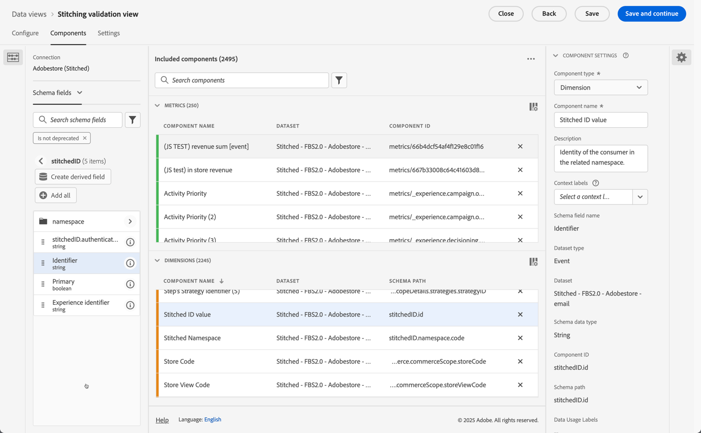
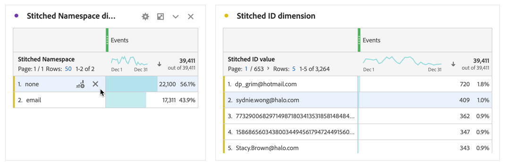

# Validieren der Zuordnung

Das Ziel der [Identitätszuordnung](/help/stitching/overview.md) (oder einfach nur Zuordnung) besteht darin, die Eignung eines Ereignis-Datensatzes für eine kanalübergreifende Analyse zu erhöhen. Diese Erhöhung wird erreicht, wenn alle Datenzeilen im Datensatz die gewünschte höchste verfügbare Identitätsreihenfolge enthalten. Diese Höhe ermöglicht Ihnen dann Folgendes:

* Erstellen Sie personenorientierte Berichte, ohne anonyme Personen auszulassen.
* Mehrere Geräte mit einer Person verbinden.
* Eine Person kanalübergreifend verbinden.

In diesem Artikel werden Analysemethoden beschrieben, mit denen die Höhe eines oder mehrerer neu erstellter zusammengefügter Datensätze gemessen und sichergestellt werden kann, dass die Zuordnung diese Vorteile bietet.

Zu den Analysemethoden gehören [Einstellungen für die Datenansichtskomponente](/help/data-views/component-settings/overview.md) auf die Administratoren normalerweise zugreifen können. Für diese Methoden müssen auch Analysten, die in einem Analysis Workspace-Projekt arbeiten, berechnete Metriken und Visualisierungen erstellen.

Während diese Analysemethoden sowohl für feldbasiertes Stitching als auch für diagrammbasiertes Stitching verwendet werden können, sind einige Elemente möglicherweise nicht im Datensatz vorhanden, insbesondere nicht in einem diagrammbasierten Stitching-Szenario. Diese fehlenden Elemente können die Berechnung der Steigerung direkt in Analysis Workspace erschweren.

>[!NOTE]
>
>Die (Validierung) Zuordnung eines oder mehrerer Datensätze trägt letztendlich zu besseren Analysen und Erkenntnissen bei. In diesem Artikel wird jedoch nicht der Gesamtwert einer Customer Journey Analytics-Konfiguration erläutert, bei der alle Datensätze in Experience Platform auf denselben Identity-Namespace ausgerichtet sind. Und dass all diese Datensätze gut zusammengeführt werden, um Analysen über eine gesamte Kunden-Journey durchzuführen.

>[!BEGINSHADEBOX]

Siehe  [Stitching-Aktivierung und -Validierung](https://video.tv.adobe.com/v/3478120?quality=12&learn=on){target="_blank"} für ein Demovideo.

>[!ENDSHADEBOX]

## Voraussetzungen für die Datenansicht

Für den Messplan für die Stitching-Validierung müssen Sie sicherstellen, dass alle erforderlichen Dimensionen und Metriken aus Ihrem zusammengefügten Datensatz in einer Datenansicht definiert sind. Sie müssen sicherstellen, dass sowohl `stitchedID.id` als auch `stitchedId.namespace.code` Felder als Dimensionen hinzugefügt werden. Während der zugeordnete Datensatz eine exakte Kopie des ursprünglichen Datensatzes ist, fügt der Zusammenfügungsprozess dem Datensatz die beiden folgenden neuen Spalten hinzu:

* Verwenden Sie `stitchedID.namespace.code`, um eine Dimension **[!UICONTROL Zusammengefügter Namespace]** zu definieren. Diese Dimension enthält den Namespace der Identität, auf die die Zeile erhöht wurde, z. B. `Email`, `Phone`. Oder der Namespace, auf den der Zuordnungsprozess zurückgreift, z. B. `ECID`.
  

* Verwenden Sie `stitchedID.id`, um eine Dimension **[!UICONTROL Zusammengefügter ID-Wert]** zu definieren. Diese Dimension enthält den Rohwert der Identität. Beispiel: gehashte E-Mail, gehashte Telefonnummer, ECID. Dieser Wert wird mit &quot;**[!UICONTROL Namespace“]**.
  

Darüber hinaus müssen Sie zwei Zuordnungsmetriken hinzufügen, die auf dem Vorhandensein von Werten in einer Dimension basieren.

1. Verwenden Sie das Feld, das die Personen-ID aus dem zugeordneten Datensatz enthält, um eine Metrik zu konfigurieren, die definiert, ob eine Personen-ID festgelegt ist. Fügen Sie diese Personen-ID hinzu, auch wenn Sie das diagrammbasierte Stitching verwenden, da die Personen-ID bei der Festlegung einer Baseline hilft. Wenn die Personen-ID nicht im Datensatz enthalten ist, beträgt Ihre Baseline 0 %.

   Im folgenden Beispiel dient `personalEmail.address` als Identität und wird verwendet, um die Metrik **[!UICONTROL _email set]** zu erstellen.
   

1. Verwenden Sie `stitchedID.namespae.code` Feld, um eine Dimension **[!UICONTROL Zugeordneter E-Mail-Namespace]** zu erstellen. Stellen Sie sicher, [Werte in Komponenteneinstellungen einschließen/ausschließen](/help/data-views/component-settings/include-exclude-values.md) anzugeben, sodass Sie nur die Werte des Namespace berücksichtigen, auf den Sie Datenzeilen erhöhen möchten.
   1. Wählen Sie **[!UICONTROL Ein-/Ausschlusswerte festlegen]** aus.
   1. Wählen Sie **[!UICONTROL Wenn alle Kriterien erfüllt sind]** als **[!UICONTROL Übereinstimmung]** aus.
   1. Geben Sie **[!UICONTROL Gleich]** `email` als **[!UICONTROL Kriterien]** an, um Ereignisse auszuwählen, die in den E-Mail-Namespace erhöht wurden.

   

## Zugeordnete Dimensionen

Wenn beide Dimensionen zur Datenansicht hinzugefügt wurden, verwenden Sie [Freiformtabellen](/help/analysis-workspace/visualizations/freeform-table/freeform-table.md) in Analysis Workspace, um die Daten jeder Dimension zu überprüfen.

In der Tabelle **[!UICONTROL Zugeordnete Namespace-Dimension**] werden normalerweise zwei Zeilen für jeden Datensatz angezeigt. Eine Zeile, die darstellt, wann der Zusammenfügungsprozess die Fallback-Methode (ECID) verwenden musste. Die andere Zeile zeigt Ereignisse an, die mit dem gewünschten Identity-Namespace (E-Mail) verknüpft sind.

Für die Tabelle **[!UICONTROL Zugeordnete ID-Dimension**] werden die Rohwerte angezeigt, die aus den Ereignissen stammen. In dieser Tabelle sehen Sie, dass die Werte zwischen der persistenten ID und der gewünschten Personen-ID oszillieren.

## Geräteorientierte oder personenorientierte Berichterstattung

Wenn Sie eine Verbindung erstellen, müssen Sie definieren, welches Feld oder welche Identität für die Personen-ID verwendet wird. Wenn Sie beispielsweise in einem Web-Datensatz eine Geräte-ID als Personen-ID auswählen, erstellen Sie geräteorientierte Berichte und verlieren die Möglichkeit, diese Daten mit anderen Offline-Kanälen zu verbinden. Wenn Sie ein kanalübergreifendes Feld oder eine Identität auswählen, z. B. eine E-Mail, gehen alle nicht authentifizierten Ereignisse verloren. Um diese Auswirkungen zu verstehen, müssen Sie herausfinden, wie viel des Traffics nicht authentifiziert ist und wie viel des Traffics authentifiziert wird.

1. Erstellen Sie eine berechnete Metrik **[!UICONTROL Nicht authentifizierte Ereignisse insgesamt]**. Definieren Sie die Regel im Regel-Builder wie folgt:
   

1. Erstellen Sie eine berechnete Metrik **[!UICONTROL E-Mail-Authentifizierungsrate]** basierend auf der zuvor definierten Metrik **[!UICONTROL _]**&#x200B;set). Definieren Sie die Regel im Regel-Builder wie folgt:
   

1. Verwenden Sie die berechnete Metrik **[!UICONTROL Nicht authentifizierte Ereignisse im]**) zusammen mit der berechneten Metrik **[!UICONTROL E-Mail]** Authentifizierungsrate), um eine [Ringdiagramm](/help/analysis-workspace/visualizations/donut.md)-Visualisierung zu erstellen. Die Visualisierung zeigt die Anzahl der Ereignisse im Datensatz, die nicht authentifiziert und authentifiziert sind.

   

## Zusammenfügen von Identifizierungsraten

Sie möchten die Identifizierungsleistung vor und nach dem Zusammenfügen messen. Erstellen Sie dazu drei zusätzliche berechnete Metriken:

1. Eine **[!UICONTROL Zusammengefügte Authentifizierungsrate]** berechnete Metrik, die die Anzahl der Ereignisse berechnet, bei denen der zusammengefügte Namespace für die gewünschte Identität im Vergleich zur Gesamtzahl der Ereignisse festgelegt ist. Beim Einrichten der Datenansicht haben Sie eine Metrik vom Typ **[!UICONTROL Zugeordneter E-Mail-Namespace]** erstellt, die einen Filter enthielt, der nur gezählt werden sollte, wenn für ein Ereignis ein Namespace auf E-Mail festgelegt wurde. Die berechnete Metrik verwendet diese Metrik **[!UICONTROL E-Mail-zugeordneter Namespace]** , um anzugeben, welcher Prozentsatz der Daten die gewünschte Identität aufweist.
   

1. Eine **[!UICONTROL prozentuale Zunahme]** berechnete Metrik, die die rohe prozentuale Änderung zwischen der aktuellen Identifizierungsrate und der zugeordneten berechnet.
   

1. Eine **[!UICONTROL Steigerung]** berechnete Metrik, die die Steigerung zwischen der aktuellen Identifizierungsrate und der zugeordneten Identifizierungsrate berechnet.
   

## Zusammenfassung

Wenn Sie alle Daten in einer Analysis Workspace-Freiformtabelle kombinieren, können Sie die Auswirkungen und den Wert sehen, die die Zuordnung bietet, einschließlich:

* Aktuelle Authentifizierungsrate: Die Baseline der Anzahl der Ereignisse, die bereits die richtige Personen-ID hatten, im Vergleich zur Gesamtzahl der Ereignisse.
* Zugeordnete Authentifizierungsrate: Die neue Anzahl von Ereignissen mit der richtigen Personen-ID im Vergleich zur Gesamtzahl der Ereignisse.
* Prozentualer Anstieg: Der rohe prozentuale Anstieg aus der zusammengefügten Authentifizierungsrate abzüglich der aktuellen Baseline-Authentifizierungsrate.
* Steigerung: Die prozentuale Änderung gegenüber der aktuellen Baseline-Authentifizierungsrate.

Die wichtigste Erkenntnis aus diesem Artikel ist, dass diese Art der Stitching-Validierung und -Analyse Sie bei Folgendem unterstützt:

* Bieten Sie eine umfassende benutzerdefinierte Ansicht der Authentifizierungseffektivität, indem Sie aktuelle mit zugeordneten Raten vergleichen.
* Eine klare Messung der Verbesserung durch prozentuale Erhöhungen und Steigerungsmetriken ermöglichen.
* Hilft bei der Identifizierung der wahren Auswirkungen der Implementierung von Zusammenfügungen auf die Benutzerauthentifizierung.
* Erstellen Sie eine standardisierte Methode zur Kommunikation der Authentifizierungsleistung über Teams hinweg.
* ermöglichen datengesteuerte Entscheidungen über Authentifizierungsstrategien und -optimierung.

Diese Metriken zusammen geben den Verantwortlichen ein vollständiges Bild davon, wie sich die Customer Journey Analytics-Zuordnung auf die Authentifizierungserfolgsraten und die allgemeine Personenerkennungsleistung auswirkt.

