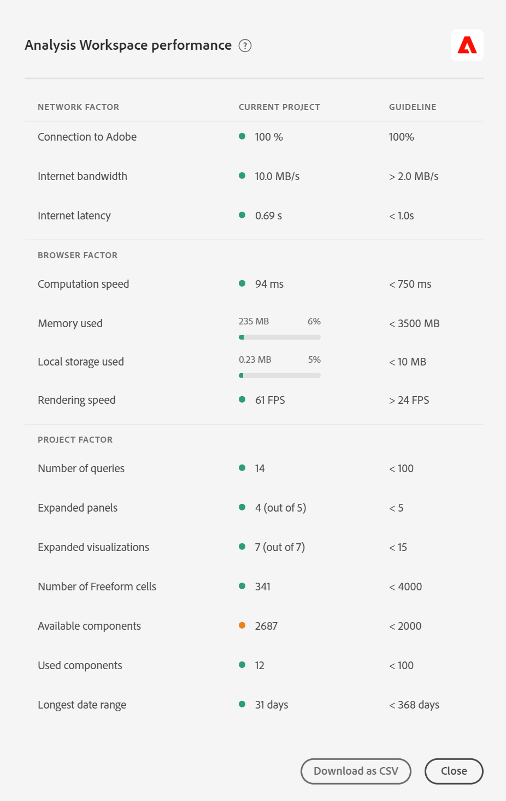

# Leistung von Customer Journey Analytics und [!UICONTROL Analysis Workspace] optimieren

Verschiedene Faktoren können die Gesamtleistung von Customer Journey Analytics sowie die Leistung eines Projekts in Analysis Workspace beeinflussen. In Workspace erhalten Sie möglicherweise die folgende Fehlermeldung

`This query is too complex. Please review best practices for building Analysis Workspace queries.`

In diesen Best Practices wird erörtert, welche Faktoren zu diesem Fehler führen könnten und wie der Bericht/das Projekt vereinfacht werden kann.

## Abfragefaktoren {#query}

Dies sind die häufigsten Abfragefaktoren, die die Gesamtleistung von Customer Journey Analytics beeinflussen:

| Faktor | Definition | Beeinflusst durch | Optimierung |
| --- | --- | --- | --- |
| **Anzahl der Freiformzeilen und -spalten** | Die Gesamtzahl der Freiform-Tabellenzellen im Projekt, berechnet durch Zeilen * Spalten in allen Tabellen. Schließt verborgene Datenquellen aus. Die Richtlinie ist 4000. | | Reduzieren Sie die Anzahl der Spalten in Ihrer Tabelle auf die relevantesten Datenpunkte. Reduzieren Sie die Anzahl der Zeilen in Ihrer Tabelle, indem Sie die Anzahl der angezeigten Zeilen anpassen oder ein Tabellensegment oder ein Segment anwenden. |
| **Verwendete Komponenten** | Die Gesamtzahl der im Projekt verwendeten Komponenten. Die Richtlinie ist 100. | Die Anzahl der verwendeten Komponenten hat keinen direkten Einfluss auf die Leistung. Die Komplexität dieser Komponenten wird jedoch zur Leistung des Projekts beitragen. Siehe Optimierungen im Abschnitt „Weitere Faktoren“ unten. |  |
| **Längster Datumsbereich** | Dieser Faktor zeigt den längsten Datumsbereich an, der für das Projekt verwendet wurde. Die Richtlinie ist ein Jahr. |  | Rufen Sie möglichst nicht mehr Daten ab, als Sie benötigen. Schränken Sie den Kalender des Bedienfelds auf die relevanten Daten für Ihre Analyse ein oder verwenden Sie Datumsbereichskomponenten (violette Komponenten) in Ihren Freiform-Tabellen. In einer Tabelle verwendete Datumsbereiche überschreiben den Datumsbereich des Bedienfelds. Beispielsweise können Sie den Tabellenspalten „Letzter Monat“, „Letzte Woche“ und „Gestern“ hinzufügen, um diese spezifischen Datenbereiche anzufordern. Weitere Informationen zu Datumsbereichen in Analysis Workspace erhalten Sie in [diesem Video](https://experienceleague.adobe.com/docs/analytics-learn/tutorials/analysis-workspace/calendar-and-date-ranges/date-ranges-and-calendar-in-analysis-workspace.html?lang=de).   Minimieren Sie außerdem die Anzahl der im Projekt verwendeten Jahresvergleiche. Bei der Berechnung eines Jahresvergleichs werden die gesamten 13 Monate von Daten zwischen den betrachteten Monaten berücksichtigt. Dies hat die gleiche Auswirkung wie die Änderung des Datumsbereichs des Bedienfelds auf 13 Monate. |
| **Segmentkomplexität** | Komplizierte Segmente können einen erheblichen Einfluss auf die Projektleistung haben. | Zu den Faktoren, die einem Segment Komplexität verleihen (in grober Reihenfolge der Auswirkungen), gehören: <ul><li>Operatoren von „enthält“, „enthält beliebige von“, „stimmt überein mit“, „beginnt mit“ oder „endet mit“ </li><li>Sequenzielle Segmentierung, insbesondere bei Verwendung von Dimensionsbeschränkungen (innerhalb/nachher) </li><li>Anzahl der eindeutigen Dimensionselemente innerhalb von Dimensionen, die im Segment verwendet werden (z. B. Seite = &#39;A&#39;, wenn Seite 10 eindeutige Elemente hat, ist schneller als Seite = &#39;A&#39;, wenn Seite 100000 eindeutige Elemente hat) </li><li>Anzahl der verschiedenen verwendeten Dimensionen (z. B.: Seite = „Startseite“ und Seite = „Suchergebnisse“ sind schneller als eVar 1 = „rot“ und eVar 2 = „blau“)</li><li>Viele OR-Operatoren (anstelle von AND)</li><li>Verschachtelte Container, deren Umfang variiert (z. B. „Ereignis“ innerhalb von „Sitzung“ innerhalb von „Person„)</li></ul> | Während einige der Komplexitätsfaktoren nicht verhindert werden können, sollten Sie nach Möglichkeiten suchen, die Komplexität Ihrer Segmente zu verringern. Generell gilt: Je genauer Sie mit Ihren Segmentkriterien umgehen können, desto besser. Zum Beispiel:<ul><li>Bei Containern ist die Verwendung eines einzelnen Containers am Anfang des Segments schneller als die Verwendung einer Reihe verschachtelter Container.</li><li>Bei Operatoren ist „gleich“ schneller als „enthält“ und „ist gleich eines von“ schneller als „enthält beliebige von“.</li><li>Bei vielen Kriterien sind AND-Operatoren schneller als eine Reihe von OR-Operatoren.</li></ul> Suchen Sie nach Möglichkeiten, viele OR-Anweisungen in eine einzige „ist gleich eines von“-Anweisung zu reduzieren.  |
| **Komplexität der Visualisierung** (Segmente, Metriken, Filter) | Die Art der Visualisierung (z. B. Fallout vs. Freiformtabelle), die einem Projekt hinzugefügt wird, hat an sich keinen großen Einfluss auf die Projektleistung. Es ist die Komplexität der Visualisierung, die die Verarbeitungszeit verlängert. | U. a. machen folgende Faktoren eine Visualisierung komplexer:<ul><li>Angeforderter Datenbereich</li><li>Anzahl der angewandten Segmente, z. B. als Zeilen verwendete Segmente in einer Freiformtabelle</li><li>Verwendung von komplexen Segmenten</li><li>[Statische Element](/help/analysis-workspace/visualizations/freeform-table/column-row-settings/manual-vs-dynamic-rows.md) zeilen oder Spalten in Freiformtabellen</li><li>Segmente, die auf Zeilen in Freiformtabellen angewendet werden</li><li>Anzahl der eingeschlossenen Metriken, insbesondere berechnete Metriken, die Segmente verwenden</li></ul> |  |
| **Kapazität des Rechenzentrums** | Die Reporting-Kapazitäten, die Sie und andere Kunden in einem Rechenzentrum von Adobe gemeinsam nutzen. | Dies wird durch die Anzahl gleichzeitiger Abfragen von Ihrer Organisation und anderen Unternehmen innerhalb Ihres Rechenzentrums beeinflusst. | Ihre Organisation hat Anspruch auf eine bestimmte Kapazität. Ist das System nur wenig ausgelastet, überträgt Adobe mehr Kapazität auf Sie, auch über das Ihnen zustehende Maß hinaus. |
| **Anzahl gleichzeitiger Abfragen** | Die Anzahl der Abfragen, die gleichzeitig von Ihrer Organisation angefordert werden. Jede Organisation hat Anspruch auf mindestens 5 gleichzeitige Abfragen. Wenn ein Bericht lange dauert, liegt dies in der Regel daran, dass er sich in einer Warteschlange mit anderen Berichten befindet. Das bedeutet, dass Ihr Unternehmen versucht, viele gleichzeitige Anfragen für eine bestimmte Datenansicht auszuführen. | Abfragen können von API-Anfragen, Reporting-Benutzeroberflächen (Analysis Workspace, Report Builder usw.), geplanten Projekten, geplanten Warnhinweisen und von gleichzeitigen Benutzenden stammen, die Berichtsanfragen stellen. | Verteilen Sie die Anfragen und Zeitpläne für die Datenansicht gleichmäßiger über den Tag. Verlagern Sie außerdem Ihre Anforderungen nach Möglichkeit auf Nebenzeiten. Montagmorgen, Dienstagmorgen und der erste Tag eines Monats sind Spitzenzeiten für das Reporting. |
| **Verbindungsgröße** | Die Menge an Daten, die in Ihrer Verbindung erfasst werden. |  | Besprechen Sie mit Ihrem Implementierungsteam oder Customer Journey Analytics-Experten, ob es Implementierungsverbesserungen gibt, die zur Verbesserung des Gesamterlebnisses in Customer Journey Analytics vorgenommen werden können. |
| **Komplexität der Dimensionseinstellungen** | Hochkomplexe Dimensionen können erhebliche Auswirkungen auf die Projektleistung haben, insbesondere Dimensionen oder Metriken, die auf komplexen benutzerdefinierten Feldern basieren. | | Reduzieren Sie die Anzahl der benutzerdefinierten Felder oder erstellen Sie separate Dimensionen. |
| **Dimensionen mit vielen eindeutigen Werten** | Diese Dimensionen werden auch als Dimensionen mit hoher Kardinalität bezeichnet und können sich auf die Berichtsleistung auswirken. | Siehe [Dimensionen mit hoher Kardinalität](/help/components/dimensions/high-cardinality.md) | Siehe [Dimensionen mit hoher Kardinalität](/help/components/dimensions/high-cardinality.md) |

## [!UICONTROL Hilfe] > [!UICONTROL Leistung] in Analysis Workspace

Mehrere Faktoren können die Leistung eines Projekts in Analysis Workspace beeinflussen. Damit Sie Ihr Projekt optimal planen und erstellen können, sollten Sie vor Beginn diese Faktoren kennen. Dieser Abschnitt enthält eine Liste von Faktoren, die sich auf die Leistung und Optimierungen auswirken, die Sie vornehmen können, um eine Spitzenleistung in Analysis Workspace sicherzustellen.

Unter **Analysis Workspace > [!UICONTROL Hilfe] > [!UICONTROL Leistung]** können Sie die Faktoren sehen, die sich auf die Leistung Ihres Projekts auswirken, einschließlich Netzwerk-, Browser- und Projektfaktoren. Um möglichst genaue Ergebnisse zu erzielen, müssen Sie das Projekt vor dem Öffnen der Seite „Leistung“ vollständig laden.

* In der Spalte „Aktuelles Projekt“ werden die Ergebnisse für Ihr aktuelles Projekt und Ihre Umgebung angezeigt.
* In der Spalte „Richtlinie“ wird der von Adobe empfohlene Schwellenwert für jeden Faktor angezeigt.

Darüber hinaus können Sie die Leistungsinhalte **als CSV-Datei herunterladen**, um sie einfach mit der Adobe-Kundenunterstützung oder Ihren IT-Teams zu teilen.

>[!NOTE]
>
>Die Informationen auf der Seite „Leistung“ variieren bei jedem Öffnen des Modells, da sich Faktoren ändern können. Darüber hinaus verfeinert Adobe die bereitgestellten Richtlinien weiter, sobald mehr Daten verfügbar sind.

### Netzwerkfaktoren

[!UICONTROL Hilfe] > [!UICONTROL Leistungsnetzwerkfaktoren] beinhalten:

| Faktor | Definition | Beeinflusst durch | Optimierung |
| --- | --- | --- | --- |
| **Verbindung zu Adobe** | Adobe sendet 10 Testaufrufe, wenn die Leistungsseite geöffnet wird. Dies stellt den Prozentsatz der erfolgreichen Aufrufe zu Adobe dar. | Lokale Netzwerkprobleme oder Probleme mit der Adobe wirken sich auf diesen Faktor aus. | Überprüfen Sie status.adobe.com, ob bekannte Service-Probleme vorliegen. Überprüfen Sie dann Ihre lokale Netzwerkverbindung. |
| **Internet-Bandbreite** | Nur für Google Chrome verfügbar. Geschätzte Bandbreite Ihres Browsers an Ihrem Standort. Die Richtlinie ist 2,0 MB/s. | Ihre lokale Netzwerkverbindung wirkt sich auf diesen Faktor aus. | Überprüfen Sie die lokale Netzwerkverbindung. |
| **Internet-Latenz** | Adobe sendet 10 Testaufrufe, wenn die Leistungsseite geöffnet wird. Dies stellt die Zeitdauer dar, die durchschnittlich eine Anfrage an Adobe und deren Antwort benötigt. Einfach gesagt, es ist ein Maß dafür, wie schnell das Internet zwischen Ihrem Standort und Adobe ist. Die Richtlinie ist &lt; 1 Sekunde. | Lokale Netzwerkprobleme, viele offene Browser-Registerkarten oder Probleme bei Adobe wirken sich auf diesen Faktor aus. | Überprüfen Sie status.adobe.com, ob bekannte Service-Probleme vorliegen. Überprüfen Sie dann Ihre lokale Netzwerkverbindung und schließen Sie nicht verwendete Browser-Registerkarten. |

### Browser-Faktoren

[!UICONTROL Hilfe] > [!UICONTROL Leistungs-Browser-Faktoren] beinhalten:

| Faktor | Definition | Beeinflusst durch | Optimierung |
| --- | --- | --- | --- |
| **Rechengeschwindigkeit** | Wie schnell Ihr Computer einen Verarbeitungstest durchführt. Die Richtlinie ist &lt; 750 ms. | Ihre Hardware sowie gleichzeitige Programme wirken sich auf diesen Faktor aus. | Öffnen Sie den Task-Manager (PC) bzw. die Aktiviätsanzeige (Mac) Ihres Computers, um zu ermitteln, ob Programme geschlossen werden können. Schließen Sie dann nicht verwendete Browser-Registerkarten oder andere Programme.   Wenn diese Aktionen nicht hilfreich sind, besprechen Sie Hardware-Details mit Ihrem IT-Team. |
| **Verwendeter Speicher** | Nur für Google Chrome verfügbar. Jede Workspace-Registerkarte in einem Google Chrome-Browser verwendet insgesamt 4 GB Arbeitsspeicher. Dies entspricht dem Prozentsatz des Speicherlimits, das vom aktuellen Projekt belegt wird. Die Richtlinie ist 3.500 MB. Dies ist der Punkt, ab dem Workspace Speicherfehler zurückgibt. | Das Arbeiten mit mehreren Registerkarten oder das Herunterladen von 50.000 Zeilen mit Daten bedeutet eine höhere Speicherbelegung. | Wenn Sie einen Speicherfehler erhalten, schließen Sie andere Workspace-Registerkarten und/oder führen Sie 50.000 Zeilen-Downloads einzeln durch. |
| **Verwendeter lokaler Speicher** | Daten, die lokal auf Ihrem Computer zur Verwendung im Browser gespeichert werden. Jede Herkunft (z. B. experience.adobe.com) verfügt über ein Limit von 10 MB. | Analysis Workspace verwendet lokale Datenspeicherung für verschiedene Funktionen, unter anderem zum Speichern automatisch gespeicherter (vorhandener) Projekte, Benutzereinstellungen und Feature Flags. | Um sicherzustellen, dass Analysis Workspace-Funktionen nicht gestört werden, sollten Sie die lokale Datenspeicherung für die Domain „experience.adobe.com“ löschen. |
| **Rendering-Geschwindigkeit** | FPS steht für Frames pro Sekunde, d. h., wie oft der Browser die Seite auf Ihrem Bildschirm zeichnet. 24 FPS sind häufig das, was das menschliche Auge als Bewegung wahrnimmt. Wenn der FPS-Wert niedriger ist, treten in Workspace Rendering-Probleme auf. | Der FPS-Wert wird durch das gleichzeitige Bearbeiten vieler Workspace-Projekte auf einmal und die Größe des angezeigten Projekts beeinflusst. Andere Programme, die auf Ihrem Computer ausgeführt werden, können Auswirkungen haben, wie Streaming, Hintergrundscanner usw. Außerdem wirkt sich Ihre Hardware auf diesen Faktor aus. | Öffnen Sie den Task-Manager (PC) bzw. die Aktiviätsanzeige (Mac) Ihres Computers, um zu ermitteln, ob Programme geschlossen werden können. Schließen Sie dann nicht verwendete Browser-Registerkarten oder andere Programme.   Wenn diese Aktionen nicht hilfreich sind, besprechen Sie Hardware-Details mit Ihrem IT-Team. |

### Projektfaktoren

[!UICONTROL Hilfe] > [!UICONTROL Leistungsprojektfaktoren] beinhalten:

| Faktor | Definition | Optimierung |
| --- | --- | --- |
| **Anzahl der Abfragen** | Die Gesamtzahl der Abfragen (Anfragen) an Adobe, die zum Abrufen der im Projekt angezeigten Daten vorgenommen wurden. Zu den Abfragen gehören Ranganfragen für Tabellen, Anomalieerkennung, Wortgrafiken, Komponenten in der linken Leiste und mehr. Schließt ausgeblendete Bedienfelder und Visualisierungen aus. Die Richtlinie ist 100. | Vereinfachen Sie Ihr Projekt nach Möglichkeit, indem Sie Daten in verschiedene Projekte aufteilen, die einem bestimmten Zweck oder Interessenten dienen. Verwenden Sie Tags, um Projekte in Themen zu organisieren, und verwenden Sie [direkte Verknüpfungen](https://experienceleague.adobe.com/docs/analytics/analyze/analysis-workspace/curate-share/shareable-links.html?lang=de), um ein internes Inhaltsverzeichnis zu erstellen, damit die Interessierte leichter finden können, wonach sie suchen. |
| **Erweiterte Bedienfelder (von insgesamt Bedienfeldern)** | Die Anzahl der erweiterten Bedienfelder von der Gesamtzahl der Bedienfelder im Projekt. Die Richtlinie ist 5. | Nachdem Sie Schritte zur Vereinfachung des Projekts unternommen haben, reduzieren Sie die Bedienfelder im Projekt, die beim Laden nicht angezeigt werden müssen. Wenn das Projekt geöffnet wird, werden nur erweiterte Bedienfelder verarbeitet. Reduzierte Felder werden erst verarbeitet, wenn der Nutzer sie erweitert. |
| **Erweiterte Visualisierungen (von insgesamt Visualisierungen)** | Die Anzahl der erweiterten Tabellen und Visualisierungen aus der Gesamtsumme im Projekt, einschließlich der ausgeblendeten Datenquellen. Die Richtlinie ist 15. | Nachdem Sie Schritte zur Vereinfachung des Projekts unternommen haben, reduzieren Sie die Visualisierungen in Ihrem Projekt, die beim Laden nicht angezeigt werden müssen. Priorisieren Sie die Visuals, die für den Verbraucher des Berichts am wichtigsten sind, und teilen Sie die unterstützenden Visuals bei Bedarf in ein separates, detaillierteres Bedienfeld oder Projekt auf. |
| **Anzahl der Freiformzellen** | Siehe Tabelle „Abfragefaktoren“ oben. | |
| **Verwendete Komponenten** | Siehe Tabelle „Abfragefaktoren“ oben. | |
| **Längster Datumsbereich** | Siehe Tabelle „Abfragefaktoren“ oben. | |

## Anforderungsfaktoren

[!UICONTROL Hilfe] > [!UICONTROL Leistung] Anfragefaktoren

Verwenden Sie das folgende Diagramm und die folgenden Begriffe, um zu erfahren, wie Anfragen verarbeitet werden und welche Faktoren die Verarbeitungszeiten beeinflussen:

>[!NOTE]
>
>Die empfohlenen Richtlinien für diese Faktoren basieren auf einem Komplexitätswert von Medium für Berichtsanfragen.

### Diagramm zur Anforderungsverarbeitung

### Bedingungen für die Anforderungsverarbeitung

| Faktor | Definition | Optimierung |
| --- | --- | --- |
| [!UICONTROL **Durchschnittliche Anfragezeit**] | Die Zeit, die von der Initiierung der Anfrage bis zum Abschluss der Anfrage benötigt wird. Die Richtlinie lautet 15 Sekunden. 
Im obigen Diagramm [Anfrageverarbeitung](#request-processing-diagram) stellt die Anfragezeit den vollständigen Prozess dar, von **Analysis Workspace-Anfrage initiiert** bis **Analysis Workspace-Anfrage abgeschlossen**.
 |  |
| [!UICONTROL **Längste Anfragezeit**] | Die Zeit, die von der Initiierung der Anfrage bis zum Abschluss der Anfrage benötigt wird. 
Im obigen Diagramm [Anfrageverarbeitung](#request-processing-diagram) stellt die Anfragezeit den vollständigen Prozess dar, von **Analysis Workspace-Anfrage initiiert** bis **Analysis Workspace-Anfrage abgeschlossen**.
 |  |
| [!UICONTROL **Durchschnittliche Suchzeit**] | Da Analysis Workspace nur den Hash für alle Zeichenfolgen speichert, die in beliebigen Segmenten verwendet werden, werden bei jeder Verarbeitung eines Projekts **Suchen** durchgeführt, um die Hashes mit den entsprechenden Werten abzugleichen. Die Richtlinie beträgt weniger als 2 Sekunden.
Dies kann ein ressourcenintensiver Prozess sein, je nach der Anzahl der Werte, die möglicherweise mit dem Hash übereinstimmen. 

Im obigen Diagramm [Anforderungsverarbeitung](#request-processing-diagram) wird die Suchzeit in der Phase **Suchen** dargestellt (zum Zeitpunkt der Phase **Verarbeitung der**).
 | Wenn Anfragen hier langsamer werden, liegt das wahrscheinlich daran, dass Ihr Projekt zu viele Zeichenfolgensegmente enthält, oder daran, dass Zeichenfolgen mit übermäßig generischen Werten zu viele potenzielle Übereinstimmungen aufweisen. |
| [!UICONTROL **Durchschnittliche Warteschlangenzeit**] | Die Gesamtzeit in der Warteschlange, bevor Anforderungen verarbeitet werden. Die Richtlinie ist 5 Sekunden.
Im obigen Diagramm [Anforderungsverarbeitung](#request-processing-diagram) wird die Warteschlangenzeit in der Phase **Anforderungs-Engine-Warteschlange** und der Phase **Server-Warteschlange** dargestellt.
 | Wenn Anfragen hier langsamer werden, kann dies an zu vielen Anfragen liegen, die gleichzeitig in Ihrer Organisation ausgeführt werden. Versuchen Sie, die Anfrage außerhalb der Spitzenzeiten auszuführen. |
| [!UICONTROL **Durchschnittliche Server-Verarbeitungszeit**] | Die durchschnittliche Zeit, die für die Verarbeitung der Anfrage benötigt wird.
Im obigen Diagramm [Anforderungsverarbeitung](#request-processing-diagram) wird die durchschnittliche Serververarbeitungszeit in der Phase **Serverwarteschlange** und der Phase **Serververarbeitung** dargestellt. Die Richtlinie lautet 10 Sekunden | Wenn Anfragen hier langsamer werden, hat das Projekt wahrscheinlich zu lange Datumsbereiche oder komplexe Visualisierungen. Verkürzen Sie den Datumsbereich Ihres Projekts, um die Verarbeitungszeiten zu verkürzen. |
| [!UICONTROL **Komplexität**] | Nicht alle Anträge benötigen gleich viel Zeit zur Bearbeitung. Die Komplexität der Anfrage kann eine allgemeine Vorstellung davon vermitteln, wie viel Zeit für die Bearbeitung der Anfrage benötigt wird. Die Richtlinie lautet Medium oder niedriger. 
Mögliche Werte sind:
 <ul><li>[!UICONTROL **Niedrig**]</li><li>[!UICONTROL **Mittel**]</li><li>[!UICONTROL **Hoch**]</li></ul>Dieser Wert wird durch die Werte in den folgenden Spalten beeinflusst:<ul><li>[!UICONTROL **Monatsgrenzen**]</li><li>[!UICONTROL **Spalten**]</li><li>[!UICONTROL **Segmente**]</li></ul> |  |
| [!UICONTROL **Monatsgrenzen**] | Die Anzahl der Monate, die in einer Anfrage eingeschlossen sind. Erweiterte Monatsgrenzen erhöhen die Komplexität der Anfrage. Die Richtlinie ist 6 oder weniger. | Wenn Anfragen hier langsamer werden, kann dies daran liegen, dass die Monatsgrenzen in Ihrem Projekt zu groß sind. Reduzieren Sie die Anzahl der Monate. |
| [!UICONTROL **Spalten**] | Die Anzahl der Metriken und Aufschlüsselungen in der Anfrage. Mehr Spalten erhöhen die Komplexität der Anfrage. Die Richtlinie ist 10 oder weniger. | Wenn Anfragen hier langsamer werden, liegt das möglicherweise daran, dass das Projekt zu viele Spalten enthält. Reduzieren Sie die Anzahl der Spalten. |
| [!UICONTROL **Segmente**] | Die Anzahl der auf die Anfrage angewendeten Segmente. Mehr Segmente erhöhen die Komplexität der Anfrage. Die Richtlinie ist 5 oder weniger. | Wenn Anfragen hier langsamer werden, liegt das möglicherweise daran, dass in Ihrem Projekt zu viele Segmente vorhanden sind. Verringern Sie die Anzahl der Segmente. |
