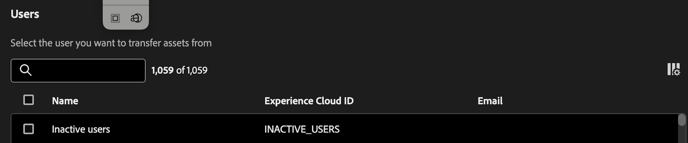

# Übertragen von Assets

Mit dem Tool „Asset-Übertragung“ können Sie das Eigentum an Assets auf andere Benutzende übertragen. Zu Assets können Komponenten wie Projekte, Segmente, Datumsbereiche, berechnete Metriken, Anmerkungen, Warnhinweise und geplante Projekte gehören.

Assets sind häufig an eine einzelnde Inhaberin bzw. einen einzelnen Inhaber gebunden und können in einigen Fällen, z. B. bei Segmenten und berechneten Metriken, nicht einmal von Admins bearbeitet oder freigegeben werden. Wenn Benutzende die Organisation verlassen oder sich ihre Rolle ändert, kann es erforderlich werden, die Eigentümerschaft an diesen Assets auf andere Benutzende zu übertragen, um Kontinuität und einen angemessenen Zugriff sicherzustellen.

## Berechtigungen

Für die Asset-Übertragung ist die Berechtigung „Produktadmin“ für Customer Journey Analytics erforderlich.

## Übertragen von Assets

1. Navigieren Sie in CJA zu **[!UICONTROL Tools]** > **[!UICONTROL Asset-Übertragung]**.

   

1. Suchen Sie im Dialogfeld **[!UICONTROL Benutzende]** nach der Person, von der Assets übertragen werden sollen, und wählen Sie sie aus.

   >[!IMPORTANT]
   >
   >Es kann nur eine 1:1-Übertragung von einem Benutzer zu einem anderen Benutzer durchgeführt werden. 1:n- oder n:1-Übertragungen werden nicht unterstützt.

1. Nachdem Sie eine Benutzerin oder einen Benutzer ausgewählt haben, wird unten auf dem Bildschirm die Option „Assets transferieren“ angezeigt.

   

1. Klicken Sie auf **[!UICONTROL Assets transferieren]**.

1. Wählen Sie auf dem Bildschirm **[!UICONTROL Assets transferieren]** zunächst die empfangende Person für die Asset-Übertragung aus.

1. Gehen Sie nun im linken Navigationsbereich jeden Komponentenordner durch, um einzelne Komponenten oder alle Assets in einem Ordner zum Übertragen auszuwählen.

   >[!NOTE]
   >
   >Beim Übertragen von Assets von Admins auf Nicht-Admins wird die Empfängerin bzw. der Empfänger nicht zum Admin hochgestuft.

   >[!NOTE]
   >
   >    Beim Übertragen von Assets, die auf andere Komponenten verweisen (z. B. Projekte, die auf andere Segmente und berechnete Metriken verweisen), werden Komponenten, die nicht der aktuellen Inhaberin bzw. dem aktuellen Inhaber des Projekts gehören, nur für die Empfängerin bzw. den Empfänger freigegeben. Die Eigentümerschaft an allen anderen Komponenten wird auf die Empfängerin bzw. den Empfänger übertragen.

1. Um _alle_ Assets in einem Ordner auszuwählen, aktivieren Sie oben in der Tabelle das Kontrollkästchen neben **[!UICONTROL Name]**.

   

1. Klicken Sie oben rechts auf **[!UICONTROL Übertragen]**, nachdem Sie mit Ihrer Auswahl fertig sind.

1. Klicken Sie auf **[!UICONTROL Bestätigen]**, wenn die Bestätigungsmeldung angezeigt wird.

   >[!IMPORTANT]
   >
   >Schließen Sie den Bildschirm auf keinen Fall während der Übertragung, um einen Prozessabbruch zu vermeiden. Dies sorgt für ein reibungsloses Erlebnis bei der Übertragung.

## Übertragungsergebnisse

Es gibt drei mögliche Ergebnisse einer Übertragung:

- **Übertragung erfolgreich**: „Assets erfolgreich übertragen.“

- **Teilweise erfolgreich**: „Einige Assets wurden erfolgreich übertragen.“

- **Übertragung fehlgeschlagen**: „Assets konnten nicht übertragen werden. Bitte versuchen Sie es erneut.“

### Mögliche Gründe für fehlgeschlagene Asset-Übertragungen

- Fehler durch abhängige Services: Asset-Übertragung interagiert bei jedem Komponententyp mit einem anderen Service (z. B. Netzwerkprobleme, nachgelagerte Service-Probleme), was zu einem teilweisen, vollständigen oder zeitweiligen Fehler führen kann.

- Fehlende Komponente oder Übertragung durch andere bzw. anderen Admin: Eine Komponente wurde während eines laufenden Asset-Übertragungsauftrags von einer anderen Person gelöscht oder von einer bzw. einem anderen Admin auf eine andere Person übertragen.

- API-POST-Textkörper wird nicht korrekt gefüllt: Eine Komponente wird möglicherweise nicht im API-POST-Textkörper gesendet, wenn mehrere Komponententypen ausgewählt sind.

- Benutzerin bzw. Benutzer existiert nicht: Die Benutzerin bzw. der Benutzer wurde während der Übertragung gelöscht oder ist aus einem anderen Grund ungültig. Wenn die Benutzerin bzw. der Benutzer vor Beginn der Übertragung ungültig ist, wird dies vom Tool erfasst und der Auftrag wird nicht verarbeitet. Wenn die Benutzerin bzw. der Benutzer während der Übertragung gelöscht wurde, kann dies zu teilweisen Fehlern führen.

- Verbindungs-/Netzwerkfehler: Die Verbindung wird während der Übertragung unterbrochen. Alle Batches von Übertragungsaufträgen, die bereits an das Backend übertragen wurden, werden weiterhin verarbeitet, aber die Benutzerin bzw. der Benutzer sieht die Meldung mit dem Übertragungsergebnis nicht, in der zusammengefasst wird, welche Vorgänge erfolgreich waren und welche fehlgeschlagen sind.

- Schließen der Browser-Registerkarte während der Übertragung: Wenn während äußerst umfangreichen Übertragungen die Browser-Registerkarte geschlossen oder die Seite verlassen wird, werden Assets nur bei den Netzwerkanfragen ordnungsgemäß übertragen, die vor dem Schließen der Registerkarte bzw. vor der Seitennavigation erfolgt sind. Wenn die Benutzerin bzw. der Benutzer zur Seite zurückkehrt, erhält er keine Antwortstatusmeldung dazu, welche Assets übertragen wurden und welche nicht.

## Übertragen von Assets während des Upgrades von Adobe Analytics auf Customer Journey Analytics

Einer der wichtigsten Anwendungsfälle für die Asset-Übertragung ist das Upgrade von Adobe Analytics auf Customer Journey Analytics.

Mit der Funktion [Komponenten-Migration](https://experienceleague.adobe.com/de/docs/analytics/admin/admin-tools/component-migration/component-migration) in Adobe Analytics können Sie Projekte, für die Admins verantwortlich sind, zu anderen Admins migrieren. Alle Komponenten dieser Projekte werden dann in Customer Journey Analytics neu erstellt, und der Empfängeradmin besitzt alle diese Komponenten, unabhängig davon, wer sie erstellt hat.

Mit diesem Asset-Übertragungs-Tool können Admins anschließend Komponenten ihren rechtmäßigen Eigentümern neu zuweisen, unabhängig davon, ob diese Admins sind oder nicht.

>[!IMPORTANT]
>
>Sie können mit diesem Tool zwar Komponenten übertragen, aber als Admin müssen Sie dennoch sicherstellen, dass die Empfängerin bzw. der Empfänger Zugriff auf die Datenansichten hat, die zum Anzeigen bzw. Verwenden dieser Komponenten erforderlich sind. In der [Admin Console](https://helpx.adobe.com/de/enterprise/using/admin-console.html) können Sie Berechtigungen anzeigen und zuweisen.

## Exportieren in CSV

Mit der Option **[!UICONTROL In CSV exportieren]** können Admins nur eine Liste der in einer CSV-Datei angezeigten Benutzenden herunterladen. Sie können keine Liste der übertragenen Assets in eine CSV-Datei exportieren.

## Inaktive Benutzende

Alle zuvor gelöschten Benutzenden werden zusammen mit allen verwaisten Komponenten unter einem Eintrag „Inaktive Benutzende“ angezeigt. Diese Komponenten können an eine neue Empfängerin bzw. einen neuen Empfänger übertragen werden. Diese Funktion wird im Januar verfügbar sein.

