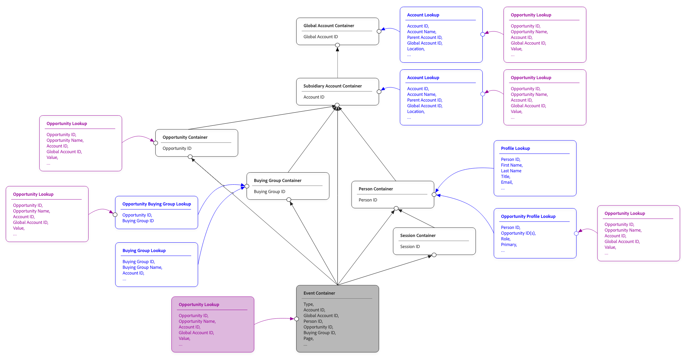
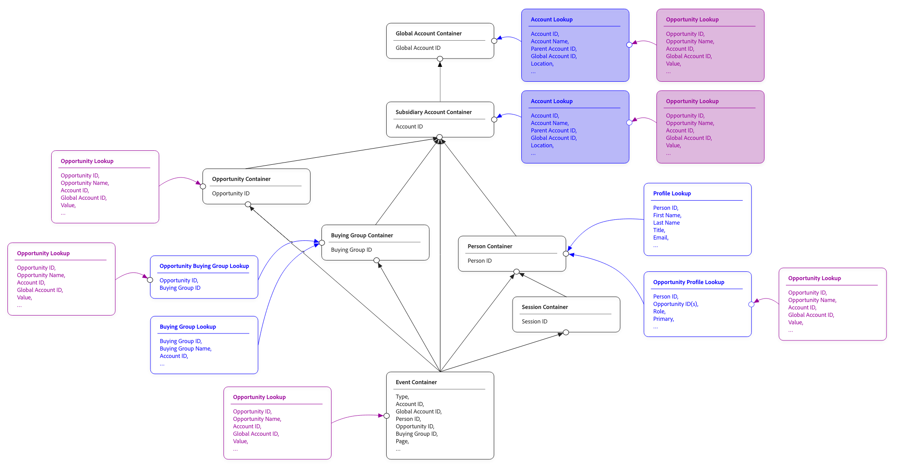

# Freigegebene Suchen

In Customer Journey Analytics werden Ihre Ereignisdaten durch einen Lookup-Datensatz mit zusätzlichem Kontext angereichert. Beispiel: ein Produktkatalog-Datensatz, der Ihren Kaufereignissen Produktnamen, Kategorien und Preise hinzufügt. Oder ein Kampagnen-Metadaten-Datensatz, der Kampagnendetails zu Ihren Marketing-Ereignissen hinzufügt.

Mit Lookups können Sie Berichte zu Ereignisdaten erstellen, die Attribute verwenden, die nicht in den Ereignissen selbst gespeichert sind.
Traditionell wird ein Lookup-Datensatz über einen einzigen, festen Pfad mit Ereignissen verbunden. Ein Schlüsselfeld im Ereignis-Datensatz wird mit einem Schlüsselfeld im Lookup-Datensatz abgeglichen. Diese Suche funktioniert, wenn es nur eine Möglichkeit gibt, die beiden Datensätze miteinander zu verknüpfen, aber diese einfache Verknüpfung funktioniert in gängigen realen Szenarien nicht:

* Ein Produktkatalog, der je nach Ereignisquelle entweder für die Produkt-SKU oder die Produkt-ID mit Ereignissen verknüpft ist.
* Eine Suche nach Benutzerattributen, die mit Ereignissen in verschiedenen Identity-Namespaces verknüpft ist, je nach Kanal (E-Mail für Web-Ereignisse, Treue-ID für In-Store-Ereignisse).
* Ein Profildatensatz, der sowohl direkt (nach Person) als auch indirekt (nach Konto, für B2B-Reporting-Zwecke) mit Ereignissen verknüpft ist

Gemeinsam genutzte Suchen lösen begrenzte Joins fester Pfade, indem Sie mehrere Join-Pfade zwischen einem Lookup-Datensatz und den Ereignissen definieren, die durch die Lookup-Daten angereichert werden. Jeder Pfad beschreibt eine Möglichkeit, Suchzeilen mit Ereigniszeilen abzugleichen. Dimensionen oder Metriken, die auf der Suche basieren, können auswählen, welcher Pfad verwendet werden soll. Derselbe Lookup-Datensatz kann jetzt mehrere Reporting-Szenarien von einer einzigen Konfiguration aus unterstützen.

Freigegebene Suchen sind auch die Grundlage für [Berichte zur Gesamtpopulation](./tpr.md) in denen freigegebene Suchen verwendet werden, um Profildatensätze mit Ereignissen zu verbinden.

## Konzepte

In den folgenden Abschnitten werden wichtige Konzepte der gemeinsamen Suche beschrieben.

### Pfade verbinden

Ein Join-Pfad ist ein einzelner Pfad, um Zeilen zwischen einem Lookup-Datensatz und den Ereignissen abzugleichen. Jeder Join-Pfad enthält:

* Ein **Pfadname**. Eine von Ihnen ausgewählte, menschenlesbare Beschriftung, die beim Erstellen von Dimensionen und Metriken zur Identifizierung des Pfads in der Benutzeroberfläche verwendet wird.
* Ein **Schlüsselfeld** auf der Ereignisseite. Dieses Feld wird für den Abgleich von Ereignissen mit Suchdaten verwendet.
* Ein **übereinstimmendes Schlüsselfeld** auf der Suchseite.  Dieses Feld ist das Feld, mit dem der Schlüssel übereinstimmt.
* Ein optionaler **Namespace**. Der Namespace ist erforderlich, wenn das Schlüsselfeld eine Identitätszuordnung ist.

Ein einzelner Lookup-Datensatz kann einen oder mehrere Join-Pfade haben. Dimensionen und Metriken, die auf einem Feld in basieren, das bei der Suche verwendet werden kann, können angeben, welcher Pfad verwendet werden soll. Wenn kein Pfad angegeben ist, wird der Standardpfad für einen Datensatz verwendet.

### Übereinstimmung nach Container

Bei Profildatensätzen (die mit dem Reporting zur Gesamtpopulation verwendet werden) unterstützen freigegebene Suchen eine Übereinstimmung durch die Container-Einstellung, die den Join automatisch basierend auf dem Container-Typ konfiguriert:

* **Abgleich nach Personen-Container**. Die Suche ist über die Personenidentität mit Ereignissen verbunden, wobei die Identitätszuordnung des Ereignis-Datensatzes als Schlüssel verwendet wird.
* **Übereinstimmung nach Konto-Container** [!BADGE B2B edition]{type=Informative url="https://experienceleague.adobe.com/de/docs/analytics-platform/using/cja-overview/cja-b2b/cja-b2b-edition" newtab=true tooltip="Customer Journey Analytics B2B Edition"}. Die Suche wird über die Konto-ID verbunden.
* **Übereinstimmung nach globalem Konto-Container** ([!BADGE B2B edition]{type=Informative url="https://experienceleague.adobe.com/de/docs/analytics-platform/using/cja-overview/cja-b2b/cja-b2b-edition" newtab=true tooltip="Customer Journey Analytics B2B Edition"} mit aktivierten globalen Konten). Die Suche ist über die globale Kontoidentität verbunden.

Der Container Übereinstimmung nach handhabt die häufigsten Fälle, ohne dass Sie die Schlüsselfelder manuell konfigurieren müssen. Der Hauptvorteil von Match by Container besteht darin, dass Deduplizierungen automatisch verarbeitet werden. Der Container speichert eindeutige Identitäten (für Person, Konto oder globales Konto).

Über das Reporting der Gesamtpopulation hinaus können Sie auch „Übereinstimmung nach Container“ verwenden, um Join-Pfade zu anderen Lookup-Datensätzen zu definieren.

### Übereinstimmung nach Feld

Alternativ können Sie Profildatensätze anhand des Felds abgleichen. Diese Übereinstimmung führt zu direkten Suchen für jedes Ereignis in den Ereignisdaten, basierend auf einer bestimmten Identität. Bei Verwendung des Felds „Übereinstimmung nach“ können Ergebnisse doppelte Daten enthalten, was zu verwirrenden Ergebnissen führen kann, insbesondere bei Verwendung mit Metriken. Eine ausführlichere Erläuterung finden [&#x200B; unter &#x200B;](#example).

### Identitätszuordnungen als Schlüsselfelder

Wenn das Schlüsselfeld auf beiden Seiten des Joins eine Identitätszuordnung ist (ein Feld, das mehrere Identitäten mit Namespace enthält), ist eine zusätzliche Konfiguration erforderlich:

* **Primärer Schlüssel** oder **Namespace**. Sie können eine Übereinstimmung mit dem Primärschlüssel der Identitätszuordnung oder durch Auswahl eines bestimmten Namespace herstellen. Die Auswahl eines Namespace ist die häufigere Wahl, da der Primärschlüssel nicht in allen Profildatenquellen ausgefüllt ist.
* **Sekundärer Namespace**. Für Fälle, in denen der primäre Namespace in einer bestimmten Zeile nicht ausgefüllt ist (was bei zusammengefügten Datensätzen der Fall ist), können Sie einen Fallback-Namespace angeben. Der Join verwendet den primären Namespace beim Ausfüllen und kehrt andernfalls zum sekundären Namespace zurück.
* **Konsistenz über Pfade hinweg**. Wenn dieselbe Identitätszuordnung als Schlüsselfeld in mehreren gemeinsamen Suchen für eine Verbindung verwendet wird, müssen die Namespace-Auswahlen bei diesen Suchen konsistent sein.

### Nachschlagen von Suchpfaden

Ein Lookup-Datensatz kann selbst mit einem anderen Lookup-Datensatz verbunden werden. Diese Suche bei der Suche erstellt eine zweistufige Suchkette: Ereignis → Suche A → Suche B.

Jede Ebene der Lookup-Kette kann über eigene Join-Pfade verfügen. Dimensionen oder Metriken, die auf Feldern in der Suche der zweiten Ebene basieren, durchlaufen die Kette mithilfe des bei jedem Schritt konfigurierten Pfads. Suchketten, die tiefer als zwei Ebenen sind, werden nicht unterstützt.

## Verwendungsbereiche

Verwenden Sie freigegebene Suchen, wenn Folgendes zutrifft:

* Sie müssen denselben Lookup-Datensatz auf mehr als eine Weise mit Ereignissen verbinden.
* Sie arbeiten mit B2C-Identitätsdaten (Business to Consumer), bei denen verschiedene Ereignisse unterschiedliche Identity-Namespaces verwenden.
* Sie konfigurieren eine B2B-Verbindung (Business-to-Business), die Ereignisse mit Personen und Konten verknüpfen muss.
* Sie fügen einen Profildatensatz zu einer Verbindung für Berichte zur Gesamtpopulation hinzu.

Wenn Ihr Lookup-Datensatz einen einzigen naheliegenden Join-Schlüssel hat und Sie nur eine Möglichkeit benötigen, die Daten im Lookup-Datensatz mit Ereignissen zu verknüpfen, können Sie einen einzelnen Pfad konfigurieren. Freigegebene Suchen unterstützen auch diesen einfachen Fall.

## Beispiel

Im folgenden umfassenden Beispiel werden freigegebene Suchen im Allgemeinen beschrieben.

Angenommen, Sie haben neben einem Ereignis-Datensatz die folgenden Profil-, Opportunity-Profil-, Konto- und Opportunity-Lookup-Datensätze als Teil der Customer Journey Analytics-Verbindung eingerichtet.

Die Beispieldaten für jeden Datensatz:

>[!BEGINTABS]

>[!TAB Ereignisse]

| Zeitstempel | Personen-ID | Konto-ID | ID des globalen Kontos | Opportunity-ID | Seite |
|---|---|---|---|---|---|
| 2025-01-29 07:01:57 | P-ABC | A-123 | A-123 | O-432 | Startseite |
| 2025-02-28 05:32:13 | P-ABC | A-123 | A-123 | O-432 | Widget |
| 2025-03-13 08:21:47 | P-ABC | A-123 | A-123 | O-432 | Doohickey |
| 2025-03-17 17:21:45 | P-EFG | A-123 | A-123 | O-543 | Gadget |
| 2025-04-01 05:32:13 | P-LMN | A-456 | A-789 | O-876 | Startseite |
| 2025-04-01 05:32:13 | P-LMN | A-456 | A-789 | O-876 | Gadget |

>[!TAB Profil]

| Personen-ID | Name | Konto-ID | ID des globalen Kontos |
|---|---|---|---|
| P-ABC | John | A-123 | A-123 |
| P-EFG | Kate | A-123 | A-123 |
| P-HIJ | Dave | A-789 | A-789 |
| P-LMN | Vijay | A-456 | A-789 |

>[!TAB Konto]

| Konto-ID | Name | ID des globalen Kontos | Land | Lebenszeitwert |
|---|---|---|---|---:|
| A-123 | Spitze | A-123 | US | 122 Mio. $ |
| A-456 | BigCo | A-789 | JP | 23 Mio. $ |
| A-789 | Riese | A-789 | UK | 48 Mio. $ |

>[!TAB Opportunity-Profil]

| Personen-ID | Opportunity-ID | ID des globalen Kontos |
|---|---|---|
| P-ABC | O-432 | A-123 |
| P-ABC | O-543 | A-123 |
| P-EFG | O-543 | A-123 |
| P-LMN | O-876 | A-789 |

>[!TAB Opportunity]

| Opportunity-ID | Name | Konto-ID | ID des globalen Kontos | Status | Wert |
|---|---|---|---|---|---:|
| O-432 | Acme Express | A-123 | A-123 | Öffnen Sie | 2 Mio. $ |
| O-543 | Acme CC | A-123 | A-123 | geschlossen | 1 Mio. $ |
| O-765 | Acme DX | A-123 | A-123 | Öffnen Sie | 8 Mio. $ |
| O-876 | BigCo CC | A-456 | A-789 | Öffnen Sie | 7 Mio. $ |
| O-987 | BigCo-DX | A-456 | A-789 | Öffnen Sie | 16 Mio. $ |
| O-888 | Giant DX | A-789 | A-789 | Öffnen Sie | 13 Mio. $ |

>[!ENDTABS]

Wenn diese Verbindung erstellt wird[&#x200B; werden &#x200B;](/help/getting-started/cja-b2b-concepts-features.md#containers)Container“ automatisch als Teil der Kernfunktionalität von Customer Journey Analytics erstellt.

Das folgende Diagramm zeigt die Entitätsbeziehungen für diese Verbindung.

{zoomable="yes"}

Sie können diese Container als Teil des Pfads verwenden, um Berichte zum Opportunity-Wert für jedes Konto zu erstellen. Je nach ausgewähltem Container können Sie unterschiedliche Ergebnisse erzielen.

| Kontoname | Opportunity-Wert (Opportunity-Container) | Opportunity-Wert (Container für untergeordnetes Konto) | Opportunity-Wert (Person-Container) |
|---|---:|---:|---:|
| Spitze | 3 Mio. $ | 11 Mio. $ | 4 Mio. $ |
| BigCo | 7 Mio. $ | 23 Mio. $ | 7 Mio. $ |

### Übereinstimmung nach Chancen-Container

Um die Opportunities den Accounts zuzuordnen, verwenden Sie den Opportunity-Container als Pfad von Ereignis- zu Opportunity-Lookup-Daten, was zu $3 Mio. für Acme und $7 Mio. für BigCo führt.

{zoomable="yes"}

>[!BEGINTABS]

>[!TAB Ereignisdaten]

| Zeitstempel | Personen-ID | Konto-ID | ID des globalen Kontos | Opportunity-ID  | Seite |
|---|---|---|---|---|---|
| 2025-01-29 07:01:57 | P-ABC | A-123 | A-123 | **O-432** | Startseite |
| 2025-02-28 05:32:13 | P-ABC | A-123 | A-123 | **O-432** | Widget |
| 2025-03-13 08:21:47 | P-ABC | A-123 | A-123 | **O-432** | Doohickey |
| 2025-03-17 17:21:45 | P-EFG | A-123 | A-123 | **O-543** | Gadget |
| 2025-04-01 05:32:13 | P-LMN | A-456 | A-789 | **O-876** | Startseite |
| 2025-04-01 05:32:13 | P-LMN | A-456 | A-789 | **O-876** | Gadget |

>[!TAB Opportunity]

| Opportunity-ID  | Name | Konto-ID | ID des globalen Kontos | Status | Wert |
|---|---|---|---|---|---:|
| **O-432** | Acme Express | A-123 | A-123 | Öffnen Sie | **$ 2 Mio** |
| **O-543** | Acme CC | A-123 | A-123 | geschlossen | **$ 1 Mio** |
| O-765 | Acme DX | A-123 | A-123 | Öffnen Sie | 8 Mio. $ |
| **O-876** | BigCo CC | A-456 | A-789 | Öffnen Sie | **7 Mio.** |
| O-987 | BigCo-DX | A-456 | A-789 | Öffnen Sie | 16 Mio. $ |
| O-888 | Giant DX | A-789 | A-789 | Öffnen Sie | 13 Mio. $ |

>[!ENDTABS]

### Nach Container des untergeordneten Kontos abgleichen

Um die Opportunities den Accounts zuzuordnen, verwenden Sie den Container des untergeordneten Kontos als Pfad von den Ereignis- zu den Opportunity-Lookup-Daten, was zu 11 Millionen US-Dollar für Acme und 23 Millionen US-Dollar für BigCo führt.

{zoomable="yes"}

>[!BEGINTABS]

>[!TAB Ereignisse]

| Zeitstempel | Personen-ID | Konto-ID  | ID des globalen Kontos | Opportunity-ID | Seite |
|---|---|---|---|---|---|
| 2025-01-29 07:01:57 | P-ABC | **A-123** | A-123 | O-432 | Startseite |
| 2025-02-28 05:32:13 | P-ABC | **A-123** | A-123 | O-432 | Widget |
| 2025-03-13 08:21:47 | P-ABC | **A-123** | A-123 | O-432 | Doohickey |
| 2025-03-17 17:21:45 | P-EFG | **A-123** | A-123 | O-543 | Gadget |
| 2025-04-01 05:32:13 | P-LMN | **A-456** | A-789 | O-876 | Startseite |
| 2025-04-01 05:32:13 | P-LMN | **A-456** | A-789 | O-876 | Gadget |

>[!TAB Opportunity]

| Opportunity-ID | Name | Konto-ID  | ID des globalen Kontos | Status | Wert |
|---|---|---|---|---|---:|
| O-432 | Acme Express | **A-123** | A-123 | Öffnen Sie | **$ 2 Mio** |
| O-543 | Acme CC | **A-123** | A-123 | geschlossen | **$ 1 Mio** |
| O-765 | Acme DX | **A-123** | A-123 | Öffnen Sie | **$ 8 MIO** |
| O-876 | BigCo CC | **A-456** | A-789 | Öffnen Sie | **7 Mio.** |
| O-987 | BigCo-DX | **A-456** | A-789 | Öffnen Sie | **$ 16 MIO** |
| O-888 | Giant DX | A-789 | A-789 | Öffnen Sie | 13 Mio. $ |

>[!ENDTABS]

### Nach Person zuordnen - Container

{zoomable="yes"}

Um Opportunities Konten zuzuordnen, verwenden Sie den Personen-Container als Pfad zu den Opportunity-Profil- und Lookup-Daten, was zu 4 Millionen US-Dollar für Acme und 7 Millionen US-Dollar für BigCo führt.

>[!BEGINTABS]

>[!TAB Ereignisse]

| Zeitstempel | Personen-ID  | Konto-ID | ID des globalen Kontos | Opportunity-ID | Seite |
|---|---|---|---|---|---|
| 2025-01-29 07:01:57 | **P-ABC** | A-123 | A-123 | O-432 | Startseite |
| 2025-02-28 05:32:13 | **P-ABC** | A-123 | A-123 | O-432 | Widget |
| 2025-03-13 08:21:47 | **P-ABC** | A-123 | A-123 | O-432 | Doohickey |
| 2025-03-17 17:21:45 | **P-EFG** | A-123 | A-123 | O-543 | Gadget |
| 2025-04-01 05:32:13 | **P-LMN** | A-456 | A-789 | O-876 | Startseite |
| 2025-04-01 05:32:13 | **P-LMN** | A-456 | A-789 | O-876 | Gadget |

>[!TAB Person/Opportunity]

| Personen-ID  | Opportunity-ID  | ID des globalen Kontos |
|---|---|---|
| **P-ABC** | **O-432** | A-123 |
| **P-ABC** | **O-543** | A-123 |
| **P-EFG** | **O-543** | A-123 |
| **P-LMN** | **O-876** | A-789 |

>[!TAB Opportunity-Suche]

| Opportunity-ID  | Name | Konto-ID | ID des globalen Kontos | Status | Wert |
|---|---|---|---|---|---:|
| **O-432** | Acme Express | A-123 | A-123 | Öffnen Sie | **$ 2 Mio** |
| **O-543** (2x) | Acme CC | A-123 | A-123 | geschlossen | 1 Mio. $ x 2 = **2 Mio. $** |
| O-765 | Acme DX | A-123 | A-123 | Öffnen Sie | 8 Mio. $ |
| **O-876** | BigCo CC | A-456 | A-789 | Öffnen Sie | **7 Mio.** |
| O-987 | BigCo-DX | A-456 | A-789 | Öffnen Sie | 16 Mio. $ |
| O-888 | Giant DX | A-789 | A-789 | Öffnen Sie | 13 Mio. $ |

>[!ENDTABS]

### Andere Übereinstimmungen nach Containern

Im Beispiel sind weitere Join-Pfade möglich. Zum Beispiel über den Container für globale Konten oder den Einkaufsgruppen-Container. Jeder der Join-Pfade führt eine Suche über einen Treffer nach Container durch.

### Übereinstimmung nach Feld

Anstelle einer Übereinstimmung nach Container können Sie auch eine Übereinstimmung nach Feld wählen. Anschließend gleichen Sie die Opportunity-IDs direkt ab.

>[!BEGINTABS]

>[!TAB Ereignisse]

| Zeitstempel | Personen-ID | Konto-ID | ID des globalen Kontos | Opportunity-ID  | Seite |
|---|---|---|---|---|---|
| 2025-01-29 07:01:57 | P-ABC | **A-123** | A-123 | **O-432** | Startseite |
| 2025-02-28 05:32:13 | P-ABC | **A-123** | A-123 | **O-432** | Widget |
| 2025-03-13 08:21:47 | P-ABC | **A-123** | A-123 | **O-432** | Doohickey |
| 2025-03-17 17:21:45 | P-EFG | **A-123** | A-123 | **O-543** | Gadget |
| 2025-04-01 05:32:13 | P-LMN | **A-456** | A-789 | **O-876** | Startseite |
| 2025-04-01 05:32:13 | P-LMN | **A-456** | A-789 | **O-876** | Gadget |

>[!TAB Opportunity]

| Opportunity-ID  | Name | Konto-ID | ID des globalen Kontos | Status | Wert |
|---|---|---|---|---|---:|
| **O-432** (3x) | Acme Express | A-123 | A-123 | Öffnen Sie | 2 Mio. US-Dollar x 3 = **6 Mio. US-** |
| **O-543** | Acme CC | A-123 | A-123 | geschlossen | **$ 1 Mio** |
| O-765 | Acme DX | A-123 | A-123 | Öffnen Sie | 8 Mio. $ |
| **O-876** (2x) | BigCo CC | A-456 | A-789 | Öffnen Sie | $7M x 2 = **$14M** |
| O-987 | BigCo-DX | A-456 | A-789 | Öffnen Sie | 16 Mio. $ |
| O-888 | Giant DX | A-789 | A-789 | Öffnen Sie | 13 Mio. $ |

>[!ENDTABS]

### Berichte zur Gesamtpopulation

{zoomable="yes"}

[Berichte zur Gesamtpopulation](tpr.md) verwendet freigegebene Suchen, meldet jedoch keine Ereignisse. Im Beispiel können Sie nur über Opportunity-Wertmetriken unter Verwendung des Kontos oder des globalen Kontocontainers Berichte erstellen, da diese Container die einzigen möglichen Joins zu Opportunity-Suchdaten sind.

>[!BEGINTABS]

>[!TAB Profil]

| Personen-ID | Name | Konto-ID  | ID des globalen Kontos |
|---|---|---|---|
| P-ABC | John | **A-123** | A-123 |
| P-EFG | Kate | **A-123** | A-123 |
| P-HIJ | Dave | **A-789** | A-789 |
| P-LMN | Vijay | **A-456** | A-789 |

>[!TAB Opportunity]

| Opportunity-ID | Name | Konto-ID  | ID des globalen Kontos | Status | Wert |
|---|---|---|---|---|---:|
| O-432 | Acme Express | **A-123** | A-123 | Öffnen Sie | **$ 2 Mio** |
| O-543 | Acme CC | **A-123** | A-123 | geschlossen | **$ 1 Mio** |
| O-765 | Acme DX | **A-123** | A-123 | Öffnen Sie | **$ 8 MIO** |
| O-876 | BigCo CC | **A-456** | A-789 | Öffnen Sie | **7 Mio.** |
| O-987 | BigCo-DX | **A-456** | A-789 | Öffnen Sie | **$ 16 MIO** |
| O-888 | Giant DX | **A-789** | A-789 | Öffnen Sie | **$ 13 MIO** |

* 3 Opportunitys für Account A-123 (Acme) mit einem Gesamtbetrag von **$ 13 Mio.**.
* 2 Opportunitys für Account A-456 (BigCo) mit einer Gesamtsumme von **$23M**.
* 1 Opportunity für das Konto A-789 (Giant) mit insgesamt **$ 13 Millionen**.

>[!ENDTABS]
