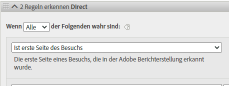
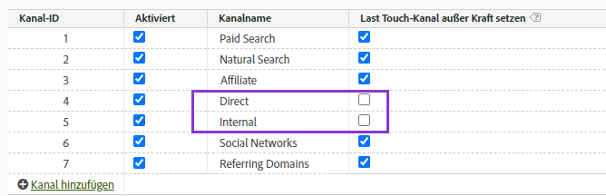
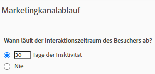

# Verwenden von Marketing-Kanal-Dimensionen

Wenn Ihr Unternehmen den [Analytics-Quell-Connector](https://experienceleague.adobe.com/de/docs/experience-platform/sources/connectors/adobe-applications/analytics) verwendet, um Report Suite-Daten in Customer Journey Analytics zu importieren, können Sie in Customer Journey Analytics eine Verbindung konfigurieren, um Berichte über die Dimensionen des Marketing-Kanals zu erstellen.

>[!IMPORTANT]
>
>Siehe die [Abgeleitete Felder - Marketing-Kanal-Vorlage](/help/data-views/derived-fields/derived-fields.md#marketing-channels) für native Produktfunktionen, um Berichte über Marketing-Kanal-Dimensionen zu erstellen.
>

## Voraussetzungen

* Report Suite-Daten müssen bereits mit dem [Analytics-Quell-Connector“ in ](https://experienceleague.adobe.com/de/docs/experience-platform/sources/connectors/adobe-applications/analytics) Adobe Experience Platform importiert worden sein. Andere Datenquellen werden nicht unterstützt, da Marketing-Kanäle auf Verarbeitungsregeln in einer Analytics Report Suite angewiesen sind.
* Verarbeitungsregeln für den Marketing-Kanal müssen bereits eingerichtet sein. Siehe [Verarbeitungsregeln für Marketing-Kanäle](https://experienceleague.adobe.com/de/docs/analytics/admin/admin-tools/manage-report-suites/edit-report-suite/marketing-channels/c-rules) im Adobe Analytics-Komponentenhandbuch.

## Marketing-Kanal: Schema-Elemente

Nachdem Sie Analytics Source Connector für eine gewünschte Report Suite eingerichtet haben, wird ein XDM-Schema für Sie erstellt. Dieses Schema enthält alle Analytics-Dimensionen und -Metriken als Rohdaten. Diese Rohdaten enthalten keine Attribution oder Persistenz. Stattdessen durchläuft jedes Ereignis die Verarbeitungsregeln des Marketing-Kanals und zeichnet die erste Regel auf, die es erfüllt. Beim Erstellen einer Datenansicht in Customer Journey Analytics geben Sie die Attribution und Persistenz an.

1. [Erstellen Sie eine Verbindung](/help/connections/create-connection.md) die einen Datensatz enthält, der auf dem Analytics-Quell-Connector basiert.
2. [Erstellen Sie eine Datenansicht](/help/data-views/create-dataview.md) mit folgenden Dimensionen:
   * **`channel.typeAtSource`**: entspricht der [Marketing-Kanal](https://experienceleague.adobe.com/de/docs/analytics/components/dimensions/marketing-channel)-Dimension.
   * **`channel._id`**: entspricht dem [Marketing-Kanal-Detail](https://experienceleague.adobe.com/de/docs/analytics/components/dimensions/marketing-detail).
3. Weisen Sie jeder Dimension das gewünschte Attributionsmodell und die gewünschte Persistenz zu. Wenn Sie sowohl die First Touch- als auch die Last Touch-Dimension verwenden möchten, ziehen Sie jede Marketing-Kanal-Dimension mehrmals in den Komponentenbereich. Weisen Sie jeder Dimension das gewünschte Attributionsmodell und die gewünschte Persistenz zu. Adobe empfiehlt außerdem, jeder Dimension einen Anzeigenamen zu geben, um die Verwendung in Arbeitsbereich zu vereinfachen.
4. Erstellen Sie die Datenansicht.

Die Dimensionen Ihres Marketing-Kanals stehen jetzt in Analysis Workspace zur Verfügung.

>[!NOTE]
>
> Analytics Source Connector erfordert, dass sowohl `channel.typeAtSource` (Marketing-Kanal) als auch `channel._id` (Details zum Marketing-Kanal) ausgefüllt werden. Andernfalls wird keiner der Werte in das XDM ExperienceEvent übertragen. Ein leeres Marketing-Kanal-Detail in der Quell-Report Suite führt zu einer leeren `channel._id` und der Analytics-Quell-Connector wird auch `channel.typeAtSource` leer lassen. Diese Leerzeichen können zu Berichtsunterschieden zwischen Adobe Analytics und Customer Journey Analytics führen.

## Unterschiede in der Verarbeitung und der Architektur

>[!IMPORTANT]
>
>Es gibt mehrere grundlegende Datenunterschiede zwischen Report Suite-Daten und Platform-Daten. Adobe empfiehlt dringend, die Verarbeitungsregeln für Marketing-Kanäle Ihrer Report Suite anzupassen, um eine ordnungsgemäße Datenerfassung in Experience Platform zu erleichtern.

>[!NOTE]
>
>Um die Effektivität von Marketing-Kanälen für Attribution und Customer Journey Analytics zu maximieren, [ einige ](https://experienceleague.adobe.com/de/docs/analytics/components/marketing-channels/mchannel-best-practices) überarbeitete Best Practices zur Verfügung.

Die Marketing-Kanal-Einstellungen funktionieren bei Platform-Daten und Report Suite-Daten unterschiedlich. Beachten Sie die folgenden Unterschiede beim Einrichten von Marketing-Kanälen für Customer Journey Analytics:

* **Ist erste Seite des Besuchs**: Dieses Regelkriterium ist in mehreren standardmäßigen Marketing-Kanal-Definitionen häufig. Jede Verarbeitungsregel, die dieses Kriterium enthält, wird in Platform ignoriert (andere Kriterien in derselben Regel sind weiterhin gültig). Sitzungen werden zum Zeitpunkt der Datenabfrage und nicht zum Zeitpunkt der Datenerfassung festgelegt. Dadurch wird verhindert, dass Platform dieses spezifische Regelkriterium verwendet. Adobe empfiehlt, alle Marketing-Kanal-Verarbeitungsregeln, die die Kriterien „Ist erste Seite des Besuchs“ enthalten, neu zu bewerten und alternative Ansätze zu wählen, die die gewünschten Ergebnisse liefern.

  

* **Last Touch-Kanal überschreiben**: Diese Einstellung im Marketing-Kanal-Manager verhindert normalerweise, dass bestimmte Kanäle eine Last Touch-Kanal-Gutschrift erhalten. Platform ignoriert diese Einstellung, sodass breite Kanäle wie „Direkt“ oder „Intern“ Metriken möglicherweise auf unerwünschte Art zuordnen können. Adobe empfiehlt, Kanäle zu entfernen, bei denen „Last Touch-Kanal überschreiben“ deaktiviert ist.
   * Sie können den „Direkt“-Marketing-Kanal im Marketing-Kanal-Manager löschen und sich dann auf das Dimensionselement „Kein Wert“ von Customer Journey Analytics für diesen Kanal verlassen. Sie können dieses Dimensionselement auch in „Direkt“ umbenennen oder das Dimensionselement beim Konfigurieren einer Datenansicht vollständig ausschließen.
   * Alternativ können Sie eine Marketing-Kanal-Klassifizierung erstellen und jeden Wert für sich selbst klassifizieren, mit Ausnahme der Kanäle, die Sie in Customer Journey Analytics ausschließen möchten. Sie können diese Klassifizierungsdimension dann beim Erstellen einer Datenansicht anstelle von `channel.typeAtSource` verwenden.

  

* **Marketing-Kanal-Ablauf**: Diese Einstellung für den Interaktionszeitraum bestimmt den Zeitraum der Inaktivität, bevor eine Person in den Report Suite-Daten einen neuen Erstkontaktkanal erhalten kann. Platform verwendet eigene Attributionseinstellungen, sodass diese Einstellung in Customer Journey Analytics vollständig ignoriert wird.

  

## Vergleichen von Daten zwischen Customer Journey Analytics und Adobe Analytics

Da sich die Architektur von Adobe Experience Platform von einer Adobe Analytics Report Suite unterscheidet, ist nicht garantiert, dass die Ergebnisse übereinstimmen. Sie können jedoch die folgenden Tipps nutzen, um diesen Vergleich zu erleichtern:

* Vergewissern Sie sich, dass die oben aufgeführten Unterschiede in der Architektur Ihren Vergleich nicht beeinträchtigen. Zu diesen Unterschieden gehören das Entfernen von Kanälen, die den Letztkontaktkanal nicht überschreiben, und das Entfernen von Regelkriterien, die der erste Treffer eines Besuchs (Sitzung) sind.
* Vergewissern Sie sich, dass Ihre Verbindung dieselbe Report Suite wie Adobe Analytics verwendet. Wenn Ihre Customer Journey Analytics-Verbindung mehrere Report Suites mit eigenen Verarbeitungsregeln für Marketing-Kanäle enthält, gibt es keine einfache Möglichkeit, sie mit Adobe Analytics zu vergleichen. Sie müssten dann für jede Report Suite eine separate Verbindung für den Datenvergleich erstellen.
* Vergewissern Sie sich, dass Sie die gleichen Datumsbereiche vergleichen und dass die Zeitzoneneinstellung in Ihrer Datenansicht mit der Zeitzone der Report Suite übereinstimmt.
* Verwenden Sie beim Anzeigen von Report Suite-Daten ein benutzerspezifisches Attributionsmodell. Verwenden Sie beispielsweise die Dimension [Marketing-Kanal](https://experienceleague.adobe.com/de/docs/analytics/components/dimensions/marketing-channel) für Metriken mit nicht standardmäßigem Attributionsmodell. Adobe rät davon ab, die Standarddimensionen [First Touch-Kanal](https://experienceleague.adobe.com/de/docs/analytics/components/dimensions/first-touch-channel) oder [Last Touch-Kanal](https://experienceleague.adobe.com/de/docs/analytics/components/dimensions/last-touch-channel) zu vergleichen, da sie auf Attributionen beruhen, die in der Report Suite erfasst wurden. Customer Journey Analytics verlässt sich nicht auf die Attributionsdaten einer Report Suite, sondern wird beim Ausführen eines Customer Journey Analytics-Berichts berechnet.
* Einige Metriken bieten aufgrund von Architektur-Unterschieden zwischen Report Suite-Daten und Platform-Daten keinen angemessenen Vergleich. Beispiele sind Besuche/Sitzungen, Personen/Personen und Vorfälle/Ereignisse.
