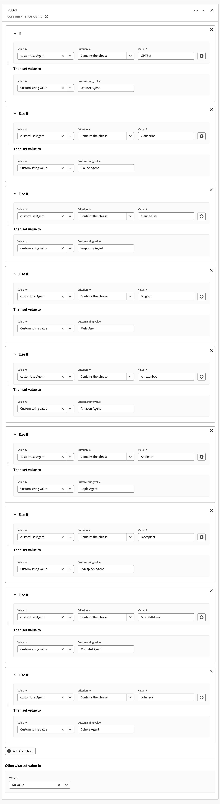

# Bericht zu LLM und KI-generiertem Traffic

In diesem Anwendungsbeispiel wird untersucht, wie die Funktion „Von Customer Journey Analytics abgeleitete Felder“ als Grundlage für Berichte zu LLM (Large Language Model) und KI-generiertem Traffic verwendet wird.

>[!NOTE]
>
>Die Effektivität der [Erkennungsmethoden](#detection-methods), [Erkennungssignaturen](#detection-signatures) und [Implementierungsstrategien](#implementation) hängt von Ihrer spezifischen Datenerfassungsmethode, der Abdeckung von Experience Platform-Datensätzen und der Customer Journey Analytics-Implementierung ab. Die Ergebnisse können je nach technischer Umgebung, Data Governance-Richtlinien und Implementierungsansatz variieren. Bei Verwendung von Experience Edge müssen Sie zwischen der Aufzeichnung der unformatierten Benutzeragenten-Zeichenfolge oder der Erfassung von Geräteinformationen wählen.
>

## Nachweismethoden

Um LLM- und KI-generierten Traffic zu erkennen, unterscheiden Sie zwischen:

* **LLM-Crawler**: Erfassen von Daten für das Training und den Abruf der erweiterten Generierung (RAG).
* **AI agents**: Funktion als Schnittstellen, die Aufgaben im Namen von Menschen ausführen. KI-Agenten interagieren vorzugsweise über APIs, die Web-Analyse-Tracking-Methoden umgehen. Sie können jedoch weiterhin einen erheblichen Teil des durch KI generierten Traffics über Websites analysieren.

Drei gängige Kernerkennungsmethoden zur Identifizierung und Überwachung von LLM und KI-generiertem Traffic sind:

* **Benutzeragenten-Identifizierung**: Wenn eine Anfrage an Ihren Server gesendet wird, wird die HTTP-Benutzeragenten-Kopfzeile extrahiert und anhand bekannter KI-Crawler- und Agentenmuster analysiert. Diese Server-seitige Methode erfordert Zugriff auf HTTP-Kopfzeilen und ist am effektivsten, wenn sie auf der Datenerfassungsschicht implementiert wird.
* **Referrer-Klassifizierung**: Die HTTP-Referrer-Kopfzeile enthält die URL der vorherigen Web-Seite, die mit der aktuellen Anfrage verknüpft ist. Diese Kopfzeile zeigt an, wann Benutzer über Web-Schnittstellen wie ChatGPT oder Perplexity auf Ihre Site klicken.
* **Erkennung von Abfrageparametern**: KI-Services können URL-Parameter (insbesondere UTM-Parameter) an Links anhängen. Diese Parameter bleiben in der URL erhalten und können über standardmäßige Analytics-Implementierungen erkannt werden, sodass diese URL-Parameter auch in Client-seitigen Tracking-Szenarien wertvolle Indikatoren sind.

Die folgende Tabelle zeigt, wie die Erkennungsmethoden für verschiedene LLM- und AI-Interaktionsszenarien verwendet werden können.

| Szenario | Benutzeragenten-Identifizierung | Referrer-Klassifizierung | Abfrageparameter-Erkennung |
|---|---|---|---|
| **Schulung eines Modells** | Agent (`GPTBot`, `ClaudeBot` und mehr) können identifiziert werden, wenn die Server-seitige Protokollierung implementiert ist. | Eine Klassifizierung ist nicht möglich. KI-Crawler generieren während des Trainings keine Referrer. | Eine Erkennung ist unmöglich. KI-Crawler fügen beim Training keine Parameter hinzu. |
| **Agent-Browsing** | Agent (`ChatGPT-User`, `claude-web`) kann identifiziert werden, wenn die Server-seitige Protokollierung Kopfzeilen erfasst. | Eine Klassifizierung ist möglich, wenn der Agent von einer KI-Schnittstelle mit Referrer-Beibehaltung navigiert. | Manchmal ist eine Erkennung möglich, wenn der KI-Service Tracking-Parameter hinzufügt. |
| **Abrufen der erweiterten Generierung (RAG) zur Beantwortung der Abfrage** | Agent (`OAI-SearchBot`, `PerplexityBot`) kann mit Server-seitiger Protokollierung identifiziert werden. | Eine Klassifizierung ist in der Regel nicht möglich, da RAG-Vorgänge häufig Referrer-Mechanismen umgehen. | Eine Erkennung ist nur selten möglich, es sei denn, sie wird vom KI-Anbieter speziell implementiert. |
| **Benutzer klickt durch** | Der Agent kann nicht identifiziert werden. Der KI-Agent wird als normaler Benutzeragent angezeigt. | Eine Klassifizierung ist möglich, wenn Benutzer über AI-Schnittstellen auf Links klicken ([chatgpt.com](https://chatgpt.com), [claude.ai](https://claude.ai) und mehr). | Die Erkennung ist möglich, wenn KI-Services UTM-Parameter zu ausgehenden Links hinzufügen. |
| **Bedingungen für die Traffic-Sichtbarkeit** | Server-seitige Protokollierungsintegration mit Customer Journey Analytics oder Server-seitiges Tagging zur Agentenidentifizierung erforderlich. | Die Klassifizierung hängt von den KI-Plattform-Referrer-Richtlinien und der ordnungsgemäßen HTTP-Header-Übertragung ab. | Die Erkennung erfordert eine Beibehaltung von Parametern durch Umleitungen und eine ordnungsgemäße URL-Parametererfassung. |

### Challenges

LLM- und KI-Agenten zeigen bei der Interaktion mit digitalen Eigenschaften komplexe und sich weiterentwickelnde Verhaltensweisen. Diese Technologien arbeiten plattform- und versionsübergreifend inkonsistent. Diese Inkonsistenz stellt Datenexperten vor einzigartige Herausforderungen. Die Verhaltensmuster variieren erheblich und hängen von der jeweiligen KI-Plattform, Version und dem verwendeten Interaktionsmodus ab. Diese betriebliche Vielfalt erschwert das Nachverfolgen und Kategorisieren von LLM- und KI-generiertem Traffic innerhalb standardmäßiger Analyse-Frameworks. Die komplexe Natur dieser Interaktionen in Kombination mit ihrer schnellen Entwicklung erfordert differenzierte Detektions- und Klassifizierungsmethoden, um die Datenintegrität aufrechtzuerhalten:

* **Partielle Datenerfassung**: Einige neuere KI-Agenten führen eingeschränkte JavaScript aus, was zu unvollständigen Analysedaten für Client-seitige Implementierungen führt. Infolgedessen werden einige Interaktionen verfolgt, während andere Interaktionen übersehen werden.
* **Inkonsistente Sitzungsdaten**: KI-Agenten führen JavaScript möglicherweise sitzungs- oder seitentypübergreifend unterschiedlich aus. Dieser Ausführungsunterschied führt zu fragmentierten Journey in Customer Journey Analytics für Client-seitige Implementierungen.
* **Herausforderungen bei der Erkennung**: Bei teilweisem Tracking wird die Erkennung unzuverlässig, da bestimmte Touchpoints für Analytics möglicherweise unsichtbar sind.

## Signaturen erkennen

Ab August 2025 können für jede der Nachweismethoden die folgenden spezifischen Signale identifiziert werden.

### Benutzeragenten-Identifizierung

<table>
<thead>
<tr>
<th>Crawler</th>
<th>Benutzeragenten-Zeichenfolge</th>
<th>Zweck/Verhalten</th>
</tr>
</thead>
<tbody>
<tr>
<td><strong>GPTBot</strong></td>
<td><code>Mozilla/5.0 AppleWebKit/537.36 (KHTML, like Gecko); compatible; GPTBot/1.1; +<a href="https://openai.com/gptbot" target="_blank" rel="noopener nofollow noreferrer">https://openai.com/gptbot</a></code></td>
<td><a href="https://platform.openai.com/docs/bots/" target="_blank" rel="noopener nofollow noreferrer">OpenAIs primärer Web-Crawler für das Trainieren von ChatGPT- und Sprachmodellen</a></td>
</tr>
<tr>
<td><strong>ChatGPT-User</strong></td>
<td><code>Mozilla/5.0 AppleWebKit/537.36 (KHTML, like Gecko); compatible; ChatGPT-User/1.0; +<a href="https://openai.com/bot" target="_blank" rel="noopener nofollow noreferrer">https://openai.com/bot</a></code></td>
<td><a href="https://platform.openai.com/docs/bots/" target="_blank" rel="noopener nofollow noreferrer">Wird verwendet, wenn ChatGPT im Namen von Benutzern Websites durchsucht (veraltet)</a></td>
</tr>
<tr>
<td><strong>ChatGPT-User v2</strong></td>
<td><code>Mozilla/5.0 AppleWebKit/537.36 (KHTML, like Gecko); compatible; ChatGPT-User/2.0; +<a href="https://openai.com/bot" target="_blank" rel="noopener nofollow noreferrer">https://openai.com/bot</a></code></td>
<td><a href="https://platform.openai.com/docs/bots/" target="_blank" rel="noopener nofollow noreferrer">Die aktualisierte Version von ChatGPT zum Abrufen von On-Demand- und Antwort-Suchen</a></td>
</tr>
<tr>
<td><strong>OAI-SearchBot</strong></td>
<td><code>Mozilla/5.0 AppleWebKit/537.36 (KHTML, like Gecko); compatible; OAI-SearchBot/1.0; +<a href="https://openai.com/searchbot" target="_blank" rel="noopener nofollow noreferrer">https://openai.com/searchbot</a></code></td>
<td><a href="https://platform.openai.com/docs/bots/" target="_blank" rel="noopener nofollow noreferrer">Suchorientierter Crawler von ChatGPT für die Erkennung von Inhalten</a></td>
</tr>
<tr>
<td><strong>ClaudeBot</strong></td>
<td><code>Mozilla/5.0 AppleWebKit/537.36 (KHTML, like Gecko); compatible; ClaudeBot/1.0; +claudebot@anthropic.com</code></td>
<td><a href="https://support.claude.com/en/articles/8896518-does-anthropic-crawl-data-from-the-web-and-how-can-site-owners-block-the-crawler" target="_blank" rel="noopener nofollow noreferrer">Anthropic Crawler zum Trainieren und Aktualisieren des Claude-KI-Assistenten</a></td>
</tr>
<tr>
<td><strong>Claude-User</strong></td>
<td><code>Mozilla/5.0 AppleWebKit/537.36 (KHTML, like Gecko; compatible; Claude-User/1.0; +Claude-User@anthropic.com)</code></td>
<td><a href="https://support.claude.com/en/articles/8896518-does-anthropic-crawl-data-from-the-web-and-how-can-site-owners-block-the-crawler" target="_blank" rel="noopener nofollow noreferrer">Unterstützt Claude AI-Benutzer Wenn Einzelpersonen Fragen an Claude stellen, kann es Websites mit einem CL…</a></td>
</tr>
<tr>
<td><strong>Claude-SearchBot</strong></td>
<td><code>Mozilla/5.0 AppleWebKit/537.36 (KHTML, like Gecko; compatible; Claude-SearchBot/1.0; +Claude-SearchBot@anthropic.com)</code></td>
<td><a href="https://support.claude.com/en/articles/8896518-does-anthropic-crawl-data-from-the-web-and-how-can-site-owners-block-the-crawler" target="_blank" rel="noopener nofollow noreferrer">Navigiert im Web, um die Suchergebnisqualität für Claude AI-Benutzer zu verbessern, indem Online-Inhalte analysiert werden…</a></td>
</tr>
<tr>
<td><strong>RatlosigkeitBot</strong></td>
<td><code>Mozilla/5.0 AppleWebKit/537.36 (KHTML, like Gecko; compatible; PerplexityBot/1.0; +<a href="https://www.perplexity.ai/perplexitybot" target="_blank" rel="noopener nofollow noreferrer">https://perplexity.ai/perplexitybot</a>)</code></td>
<td><a href="https://docs.perplexity.ai/guides/bots" target="_blank" rel="noopener nofollow noreferrer">Crawler von Perplexity.ai für die Indizierung von Web-Daten in Echtzeit</a></td>
</tr>
<tr>
<td><strong>Perplexity-User</strong></td>
<td><code>Mozilla/5.0 AppleWebKit/537.36 (KHTML, like Gecko; compatible; Perplexity-User/1.0; +<a href="https://www.perplexity.ai/useragent" target="_blank" rel="noopener nofollow noreferrer">https://www.perplexity.ai/useragent</a>)</code></td>
<td><a href="https://docs.perplexity.ai/guides/bots" target="_blank" rel="noopener nofollow noreferrer">Lädt Seiten, wenn Benutzer auf Zitate von „Perplexity“ klicken (umgeht robots.txt)</a></td>
</tr>
<tr>
<td><strong>Google-Extended</strong></td>
<td><code>Mozilla/5.0 (compatible; Google-Extended/1.0; +<a href="https://support.google.com/webmasters/answer/182072" target="_blank" rel="noopener nofollow noreferrer">http://www.google.com/bot.html</a>)</code></td>
<td><a href="https://blog.google/technology/ai/an-update-on-web-publisher-controls/" target="_blank" rel="noopener nofollow noreferrer">Googles KI-fokussierter Crawler für Gemini getrennt vom standardmäßigen Googlebot</a></td>
</tr>
<tr>
<td><strong>BingBot</strong></td>
<td><code>Mozilla/5.0 (compatible; BingBot/1.0; +<a href="http://www.bing.com/bot.html" target="_blank" rel="noopener nofollow noreferrer">http://www.bing.com/bot.html</a>)</code></td>
<td>Microsofts Crawler für Bing Search und Bing Chat (Copilot)</td>
</tr>
<tr>
<td><strong>Entenunterstützungs-Bot</strong></td>
<td><code>Mozilla/5.0 (compatible; DuckAssistBot/1.0; +<a href="https://duckduckgo.com/bot.html" target="_blank" rel="noopener nofollow noreferrer">http://www.duckduckgo.com/bot.html</a>)</code></td>
<td><a href="https://duckduckgo.com/duckduckgo-help-pages/results/duckassistbot" target="_blank" rel="noopener nofollow noreferrer">Scrapes-Inhalt für DuckAssist, die private KI-Antwortfunktion von DuckDuckGo</a></td>
</tr>
<tr>
<td><strong>YouBot</strong></td>
<td><code>Mozilla/5.0 (compatible; YouBot (+<a href="http://www.you.com" target="_blank" rel="noopener nofollow noreferrer">http://www.you.com</a>))</code></td>
<td>Crawler hinter dem KI-Such- und Browser-Assistenten von You.com</td>
</tr>
<tr>
<td><strong>meta-externalAgent</strong></td>
<td><code>Mozilla/5.0 (compatible; meta-externalagent/1.1 (+<a href="https://developers.facebook.com/docs/sharing/webmasters/web-crawlers" target="_blank" rel="noopener nofollow noreferrer">https://developers.facebook.com/docs/sharing/webmasters/crawler</a>))</code></td>
<td><a href="https://developers.facebook.com/docs/sharing/webmasters/web-crawlers#identify-2" target="_blank" rel="noopener nofollow noreferrer">Metas Bot zum Erfassen von Daten zum Trainieren oder Optimieren von LLMs</a></td>
</tr>
<tr>
<td><strong>Amazonbot</strong></td>
<td><code>Mozilla/5.0 (Macintosh; Intel Mac OS X 10_10_1) AppleWebKit/600.2.5 (KHTML, like Gecko) Version/8.0.2 Safari/600.2.5 (Amazonbot/0.1; +<a href="https://developer.amazon.com/amazonbot" target="_blank" rel="noopener nofollow noreferrer">https://developer.amazon.com/support/amazonbot</a>)</code></td>
<td><a href="https://developer.amazon.com/amazonbot" target="_blank" rel="noopener nofollow noreferrer">Amazons Crawler für Such- und KI-Anwendungen</a></td>
</tr>
<tr>
<td><strong>Applebot</strong></td>
<td><code>Mozilla/5.0 (Macintosh; Intel Mac OS X 10_15_5) AppleWebKit/605.1.15 (KHTML, like Gecko) Version/13.1.1 Safari/605.1.15 (Applebot/0.1; +<a href="https://support.apple.com/kb/HT6619" target="_blank" rel="noopener nofollow noreferrer">http://www.apple.com/go/applebot</a>)</code></td>
<td><a href="https://support.apple.com/en-us/119829" target="_blank" rel="noopener nofollow noreferrer">Apples Crawler für Spotlight, Siri und Safari</a></td>
</tr>
<tr>
<td><strong>applebot-extended</strong></td>
<td><code>Mozilla/5.0 (compatible; Applebot-Extended/1.0; +<a href="https://www.apple.com/bot.html" target="_blank" rel="noopener nofollow noreferrer">http://www.apple.com/bot.html</a>)</code></td>
<td><a href="https://support.apple.com/en-us/119829" target="_blank" rel="noopener nofollow noreferrer">Apples KI-fokussierter Crawler für zukünftige KI-Modelle (Opt-in)</a></td>
</tr>
<tr>
<td><strong>Bytespider</strong></td>
<td><code>Mozilla/5.0 (compatible; Bytespider/1.0; +<a href="https://www.bytedance.com/bot.html" target="_blank" rel="noopener nofollow noreferrer">http://www.bytedance.com/bot.html</a>)</code></td>
<td>Der KI-Datenerfasser von ByteDance für TikTok und andere Services</td>
</tr>
<tr>
<td><strong>MistralAI-User</strong></td>
<td><code>Mozilla/5.0 (compatible; MistralAI-User/1.0; +<a href="https://mistral.ai/bot" target="_blank" rel="noopener nofollow noreferrer">https://mistral.ai/bot</a>)</code></td>
<td><a href="https://docs.mistral.ai/robots/" target="_blank" rel="noopener nofollow noreferrer">Mistrals Echtzeit-Zitatabruf für den „Le Chat“-Assistenten</a></td>
</tr>
<tr>
<td><strong>cohere-ai</strong></td>
<td><code>Mozilla/5.0 (compatible; cohere-ai/1.0; +<a href="http://www.cohere.ai/bot.html" target="_blank" rel="noopener nofollow noreferrer">http://www.cohere.ai/bot.html</a>)</code></td>
<td>Erfasst Textdaten für die Sprachmodelle von Cohere</td>
</tr>
</tbody>
</table>

### Referrer-Klassifizierung

<table>
<thead>
<tr>
<th><strong>Quelle</strong></th>
<th><strong>Referrer</strong></th>
<th><strong>Traffic-Typ</strong></th>
</tr>
</thead>
<tbody>
<tr>
<td>ChatGPT</td>
<td>chatgpt.com</td>
<td>Direkter Traffic von der ChatGPT-Schnittstelle</td>
</tr>
<tr>
<td>Claude</td>
<td>claude.ai</td>
<td>Traffic von der Claude-Oberfläche von Anthropic</td>
</tr>
<tr>
<td>Google Gemini</td>
<td>gemini.google.com</td>
<td>Traffic vom KI-Assistenten von Google</td>
</tr>
<tr>
<td>Microsoft Copilot</td>
<td>copilot.microsoft.com</td>
<td>Traffic vom KI-Assistenten von Microsoft</td>
</tr>
<tr>
<td>Microsoft Copilot</td>
<td>m365.cloud.microsoft</td>
<td>Traffic vom KI-Assistenten von Microsoft (Microsoft 365-Cloud-Services)</td>
</tr>
<tr >
<td>Perplexity-KI</td>
<td>perplexity.ai</td>
<td>Traffic aus der KI-Suche mit Zitaten</td>
</tr>
<tr>
<td>META AI</td>
<td>meta.ai</td>
<td>Traffic vom KI-Assistenten von Meta</td>
</tr>
</tbody>
</table>

### Abfrageparameter-Erkennung

<table>
<thead>
<tr>
<th><strong>LLM-Dienst</strong></th>
<th>Beispiel-URL</th>
<th><strong>Abfrageparameter</strong></th>
<th><strong>Beispielwert</strong></th>
</tr>
</thead>
<tbody>
<tr>
<td>ChatGPT</td>
<td ><a href="https://www.yoursite.com/product?utm_source=chatgpt.com" target="_blank" rel="noopener nofollow noreferrer">https://www.yoursite.com/product?utm_source=chatgpt.com</a></td>
<td>utm_source</td>
<td>chatgpt.com</td>
</tr>
<tr>
<td>Verwirrung</td>
<td><a href="https://www.yoursite.com/article?utm_source=perplexity" target="_blank" rel="noopener nofollow noreferrer">https://www.yoursite.com/article?utm_source=perplexity</a></td>
<td>utm_source</td>
<td>Verwirrung</td>
</tr>
</tbody>
</table>

## Implementierung

Sie können in einem typischen Customer Journey Analytics-Setup ([Verbindung](/help/connections/overview.md), [Datenansichten](/help/data-views/data-views.md) und [Workspace-Projekte](/help/analysis-workspace/home.md)) Berichte zu LLM- und KI-generiertem Traffic erstellen, indem Sie [abgeleitete Felder](#derived-fields), [Segmente](#segments) und [Workspace-Projekte](#workspace-project).

### Abgeleitete Felder

Für die Konfiguration von Detektionsmethoden und Detektionssignalen werden abgeleitete Felder als Grundlage verwendet. Definieren Sie beispielsweise abgeleitete Felder für [Benutzeragenten-Identifizierung](#user-agent-identification), [Abfrageparametererkennung](#query-parameter-detection) und [Referrer-Klassifizierung](#referrer-classification).

#### LLM/AI-Benutzeragenten-Identifizierung

Verwenden Sie die abgeleiteten Feldfunktionen [Wenn](/help/data-views/derived-fields/derived-fields.md#case-when), um ein abgeleitetes Feld zu definieren, das LLM/AI-Benutzeragenten identifiziert.

{zoomable="yes"}

#### LLM/AI-Abfrageparameter-Erkennung

Verwenden Sie die Funktionen [URL-Parsen](/help/data-views/derived-fields/derived-fields.md#url-parse) und [Klassifizieren](/help/data-views/derived-fields/derived-fields.md#classify) abgeleitete Felder, um ein abgeleitetes Feld zu definieren, das Abfrageparameter erkennt.

{zoomable="yes"}

#### LLM/AI Referrer Classification

Verwenden Sie die Funktionen [URL-Analyse](/help/data-views/derived-fields/derived-fields.md#url-parse) und [Klassifizieren](/help/data-views/derived-fields/derived-fields.md#classify) abgeleiteter Felder, um ein abgeleitetes Feld zu definieren, das Referrer klassifiziert.

{zoomable="yes"}

### Segmente

Richten Sie spezielle Segmente ein, mit denen Sie Ereignisse, Sitzungen oder Personen im Zusammenhang mit LLM und KI-generiertem Traffic identifizieren können. Verwenden Sie beispielsweise die abgeleiteten Felder, die Sie zuvor erstellt haben, um ein Segment zu definieren, das den LLM- und den KI-generierten Traffic identifiziert.

{zoomable="yes"}

### Workspace-Projekt

Verwenden Sie die abgeleiteten Felder und Segmente, um Berichte und Analysen zu LLM und KI-generiertem Traffic durchzuführen. Ein Beispiel finden Sie im kommentierten Projekt unten.

{zoomable="yes"}

>[!MORELIKETHIS]
>
>Dieser Anwendungsfall-Artikel basiert auf dem Blogartikel [Tracking und Analyse von LLM und KI-generiertem Traffic in Adobe Customer Journey Analytics](https://experienceleaguecommunities.adobe.com/t5/adobe-analytics-blogs/tracking-and-analyzing-llm-and-ai-generated-traffic-in-adobe/ba-p/771967?profile.language=de).
>
>
