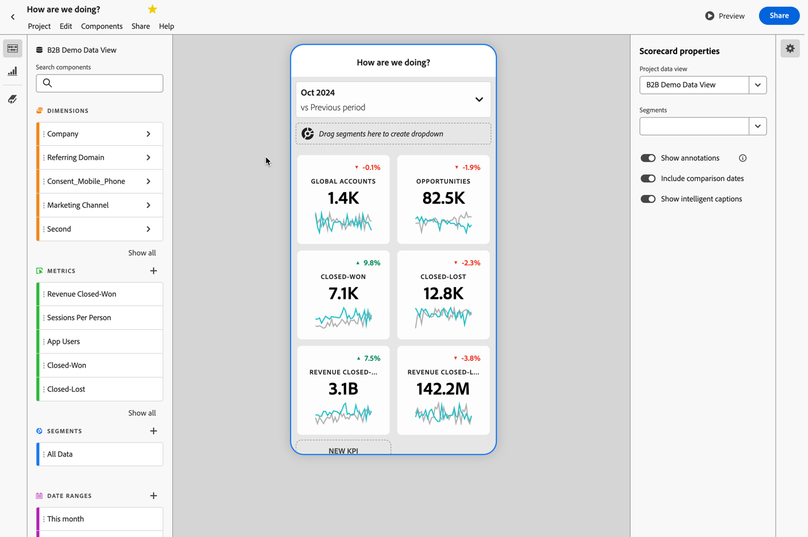
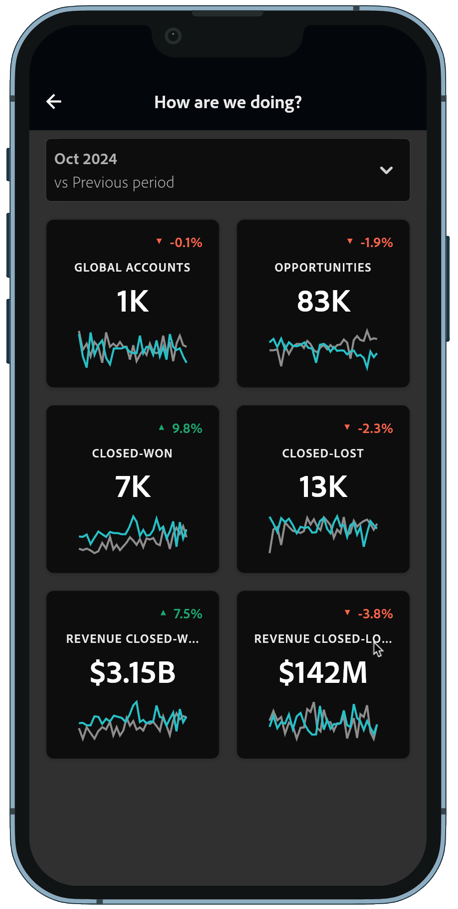

# Fördern von Produktwert

Sie möchten Produktwerteinblicke im B2B-Bereich für Produkt-Manager und CMOs oder CEOs bereitstellen. Zum Beispiel durch eine datengesteuerte Abwanderungsanalyse oder Prognosen. Und diese Erkenntnisse mithilfe mobiler Dashboards verdaulich machen.

Customer Journey Analytics B2B edition kann Sie dabei unterstützen, produktbezogene Erkenntnisse zu liefern. In den folgenden Abschnitten finden Sie Beispiele.

## Abwanderung reduzieren

Sie möchten Kunden mit geringer Produktnutzung, geringer Markeninteraktion und anderen Schlüsselfaktoren identifizieren, die auf ein hohes Abwanderungspotenzial hinweisen. Mit dieser frühzeitigen Erkennung können Sie Strategien zur Kontoaktivierung entwickeln.

Die [Aktives &#x200B;](/help/guided-analysis/types/active-growth.md)&quot; geführte Analyse kann Ihnen dabei helfen, Folgendes zu bestimmen:

* Gewinnen Sie Einblicke in das Wachstum und die Akquise von Accounts, Opportunities und Benutzern über einen bestimmten Zeitraum.
* Erkennen von inaktiven Konten ohne aktuelle Interaktion. So können Sie eine Strategie für Erneuerung oder Upsell bestimmen.
* Arbeiten Sie mit Ihrem Customer Success oder Ihrer Vertriebsorganisation zusammen, um inaktive Konten erneut zu aktivieren. Sie können die geringe Nutzung untersuchen und Produktverbesserungen planen, um Abwanderung zu bewältigen und langsame oder stockende Akzeptanz zu überwinden.

### Beispiel

Sie möchten das aktive Nettowachstum für Ihre neuen, wiederholten, wiederkehrenden und inaktiven Konten sehen.

1. [Erstellen und Konfigurieren einer &#x200B;](/help/guided-analysis/types/active-growth.md) Wachstumsanalyse.
1. Wählen Sie **[!UICONTROL Konten]** als **[!UICONTROL gezählt als]** aus.
1. Wählen Sie die bevorzugte **[!UICONTROL Diagrammeinstellungen]** aus. Beispiel:  **[!UICONTROL Stacked bar]**.
1. Wählen Sie die bevorzugten  **[!UICONTROL Intervall]** und **[!UICONTROL Datumsbereich]**.

## Demokratisieren von Erkenntnissen

Sie möchten wichtige Erkenntnisse für CMOs und CEOs demokratisieren, damit sie beispielsweise auf einen Blick die Kontodaten und die Produktnutzung von ihrem mobilen Gerät aus überprüfen können.

Eine [mobile Scorecard](/help/mobile-app/home.md) kann dabei helfen, diese Einblicke bereitzustellen.

### Beispiel

Sie möchten eine mobile Scorecard erstellen, die Details zu Konten, Opportunitys, geschlossenen und verlorenen Opportunitys und den mit diesen Opportunitys verbundenen Einnahmen kombiniert.

1. [Erstellen Sie eine mobile Scorecard](/help/mobile-app/create-scorecard.md).
1. Definieren Sie den Zeitraum, für den Sie Berichte erstellen möchten. Beispiel: **[!UICONTROL Oktober 2024 vs. vorheriger Zeitraum]**.
1. Ziehen Sie die entsprechenden Metriken per Drag-and-Drop auf die Arbeitsfläche des Programms. Beispiel: **[!UICONTROL Globale Konten]**, **[!UICONTROL Opportunities]**, **[!UICONTROL Closed-Won]**, **[!UICONTROL Closed-Lost]**, **[!UICONTROL Revenue Closed-Won]** und **[!UICONTROL Revenue-Closed-Lost]**.

   

1. Verwenden Sie **[!UICONTROL Vorschau]**, um eine Vorschau des Dashboards anzuzeigen. Das Dashboard ist jetzt über die Adobe Analytics Dashboard-App verfügbar, die über die [App Store](https://apps.apple.com/us/app/adobe-analytics-dashboards/id1509062264) oder [Google Play verfügbar &#x200B;](https://play.google.com/store/apps/details?id=com.adobe.analyticsdashboards).

   
