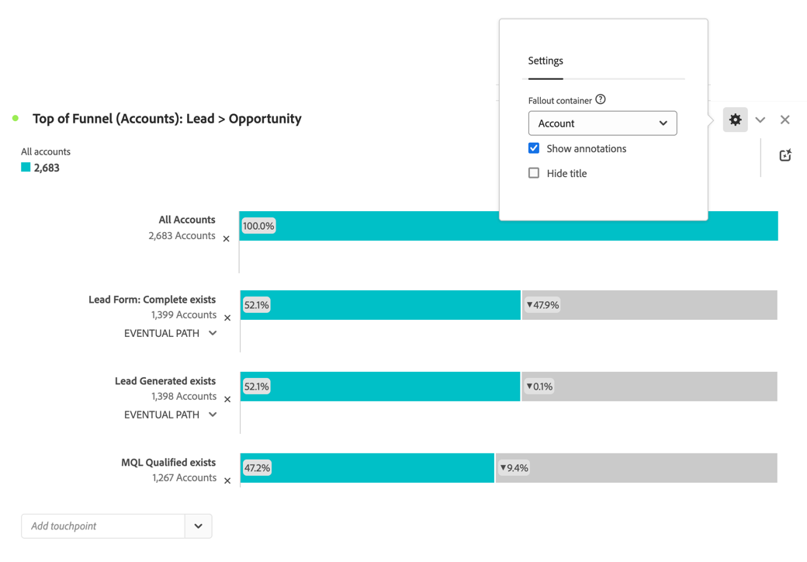

# Wichtige Konten vergrößern

Das Wachstum und die Bindung von Schlüsselkonten hat für B2B-Unternehmen hohe Priorität. Um sicherzustellen, dass Fortschritte erzielt werden, müssen Sie mit den wichtigsten Stakeholdern in Ihren Target-Konten zum richtigen Zeitpunkt kommunizieren.

Wenn Sie sich überlegen, wie Sie wichtige Accounts durch neue Akquise-, Bindungs- oder Upsell-Aktionen erweitern können, hilft Ihnen Customer Journey Analytics B2B edition (dem Vertriebsteam und Geschäftsanalysten) dabei, tiefere Einblicke in die Entwicklung der Vertriebsphase und die teamübergreifende Zusammenarbeit zu erhalten. In den folgenden Abschnitten finden Sie Beispiele.

## Verkaufsstadium Fortschritt

Sie möchten Ad-hoc-Lead-Konversionsberichte generieren und verteilen und verstehen, wie Konten über den Verkaufstrichter fortschreiten.

Mit der [Fallout](/help/analysis-workspace/visualizations/fallout/fallout-flow.md)-Visualisierung können Sie Konversions- und Abfallraten zwischen vordefinierten Schritten in einem sequenziellen Journey visualisieren.

### Beispiel

Sie möchten den Fallout für Konten oben im Verkaufstrichter sehen (von Lead zu Opportunity).

1. [Erstellen und Konfigurieren einer Fallout](/help/analysis-workspace/visualizations/fallout/configuring-fallout.md)-Visualisierung.
1. Wählen Sie  aus, **[!UICONTROL Konto]** als **[!UICONTROL Fallout-Container]**.
1. Der erste Touchpoint sollte lauten **[!UICONTROL Alle Konten]**.
1. Fügen Sie einen neuen Touchpoint hinzu: **[!UICONTROL Lead-Formular: vollständig vorhanden]**.
1. Fügen Sie einen neuen Touchpoint hinzu: **[!UICONTROL Lead generiert existiert]**.
1. Fügen Sie einen neuen Touchpoint hinzu: **[!UICONTROL MQL Qualified exists]**.

   

## Zusammenarbeit

Sie möchten die Kommunikation zwischen dem Vertriebs-, Marketing- und Produkt-Team verbessern. Verfügbare Optionen, um sicherzustellen, dass alle Stakeholder über eine einheitliche Daten-Story verfügen, sind Warnhinweise, Anmerkungen, projektinterne Kommentare und die Freigabe von Berichten und Visualisierungen.

Sie können die folgenden Funktionen von Customer Journey Analytics B2B edition verwenden:

1. [Anmerkungen](/help/components/annotations/overview.md)
1. [Intelligente Warnhinweise](/help/components/c-intelligent-alerts/intelligent-alerts.md)
1. [Für Arbeitsbereichsbenutzer oder für andere freigeben](/help/analysis-workspace/curate-share/share-projects.md)
1. [Kommentare](/help/analysis-workspace/build-workspace-project/comment-projects.md)

