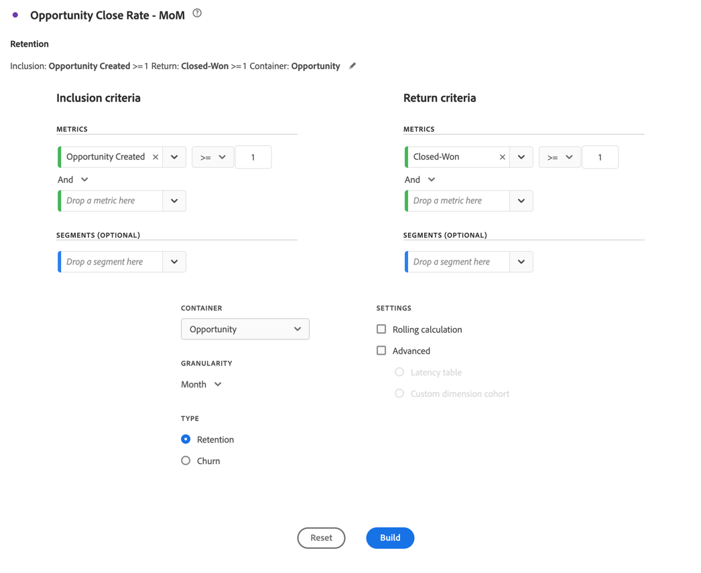

# Marketing-Konto optimieren

{{draft-b2b}}

Effektives Account-Based-Marketing erfordert ein tiefes Verständnis des kaufenden Journey auf Kontoebene. So können Sie die wirkungsvollsten Marketing-Aktivitäten bestimmen, um ein Geschäft zum Abschluss zu bringen.

Für dieses Verständnis möchten Sie Folgendes analysieren und untersuchen:

* Marketing-Auswirkungen:

   * Über Kampagnen, Kanäle und Inhalte hinweg.
   * Beim Kauf von Gruppen innerhalb von Konten,

* Fortschritt der Vertriebspipeline.
* Upsell- und Crosssell-Möglichkeiten.
* Zustand des Kundenkontos.

Customer Journey Analytics B2B edition kann Sie bei der Optimierung des Account-Marketings unterstützen. In den folgenden Abschnitten finden Sie Beispiele.

## Account-basierte Marketing-Interaktion

Sie möchten ermitteln, welche Erlebnisse, sowohl online als auch offline, die größte Wirkung auf die Förderung abgeschlossener Opportunities haben.

Verwenden Sie die Visualisierung der [Journey-Arbeitsfläche](/help/analysis-workspace/visualizations/journey-canvas/journey-canvas.md), um jede Interaktion über Konten, Opportunitys, Einkaufsgruppen, Kampagnen und Kanäle hinweg zuzuordnen, um Einblicke zu erhalten, was in Ihrem Account-Marketing funktioniert und wo Sie Verbesserungen vornehmen können.

Eine Journey-Arbeitsflächen-Visualisierung hilft Ihnen bei Folgendem:

* Die ganze Story. Sie können beispielsweise einen detaillierten Pfad eines (*) hochwertigen* oder einer Einkaufsgruppe anzeigen, der alle bekannten Online- und Offline-Interaktionen enthält.
* Kontextualisieren Sie wichtige Momente, die zu kritischen Meilensteinen führen oder ihnen folgen (z. B. ein Trigger mit qualifiziertem Marketing-Lead oder die Erstellung einer Opportunity).
* Unterstützt Vertriebsmitarbeiter beim Durchlaufen des Interaktionsverlaufs der Visualisierung für bestimmte Konten. Eine solche Visualisierung ermöglicht relevante Gespräche.

### Beispiel

Sie möchten den Journey von einem Lead-Formular zu einem geschlossenen Gewinner visualisieren.

1. [Erstellen und Konfigurieren einer Journey-Arbeitsfläche](/help/analysis-workspace/visualizations/journey-canvas/configure-journey-canvas.md) Visualisierung.
1. Konfigurieren Sie **[!UICONTROL Konto]** als die **[!UICONTROL Primäre Metrik]**.
1. Wählen Sie **[!UICONTROL Konto]** als **[!UICONTROL Journey-Arbeitsflächen-Container aus]**.

   

1. Wählen Sie **[!UICONTROL Erstellen]** aus.
1. Ziehen Sie Knoten per Drag-and-Drop auf die Arbeitsfläche und verbinden Sie die Knoten, um das Konto-Journey zu veranschaulichen. Beispiel: von **[!UICONTROL Lead-Formular: Schritt 1]** Formular zu **[!UICONTROL Opp. Erstellt]**.

   

## Kohorten-Segmentierung

Sie möchten die Schlüsselgruppe der Käufer identifizieren, damit Sie diese Käufergruppen für andere Kanäle wie bezahlte Medien, E-Mail oder Social Media aktivieren können.

Verwenden Sie die [Kohortentabellen](/help/analysis-workspace/visualizations/cohort-table/cohort-analysis.md)-Visualisierung, um B2B-Entitäten (Konten, Opportunitys, Einkaufsgruppen) basierend auf einem gemeinsamen Ausgangspunkt (z. B. einem Marktqualifikations-(MQL-)Lead-Datum) zu gruppieren. und verfolgen Sie den Fortschritt jeder dieser Entitäten im Laufe der Zeit in nachfolgenden Phasen oder Meilensteinen.

Eine Visualisierung der Kohortentabellen hilft Ihnen bei Folgendem:

* Analysieren, wie schnell Kohorten von Accounts oder Opportunities wichtige Meilensteine erreichen (z. B.: von einem qualifizierten Marketing-Lead zu einem qualifizierten Vertriebs-Lead) in Wochen oder Monaten.
* Identifizieren Sie, ob bestimmte Kohorten (nach Segment, Kampagnenquelle, Einkaufsgruppentyp) schneller durch den Verkaufszyklus navigieren als andere Kohorten.
* Beurteilen, ob strategische Initiativen (z. B.: Marketing-Kampagnen) mit kürzeren Progressionszeitplänen für nachfolgende Kohorten korrelieren.

### Beispiel

Sie möchten monatliche Kohorten geschlossener Opportunitys sehen.

1. [Erstellen und Konfigurieren einer Kohortentabellen](/help/analysis-workspace/visualizations/cohort-table/t-cohort.md)-Visualisierung.
1. Verwenden Sie **[!UICONTROL Opportunity erstellt]** als Metrik **[!UICONTROL Einschlusskriterien]** . Wählen Sie **[!UICONTROL >=]** als Operator und geben Sie `1` Wert ein.
1. Verwenden Sie **[!UICONTROL Closed-Won]** als **[!UICONTROL Return Criteria]**-Metrik. Wählen Sie **[!UICONTROL >=]** als Operator und geben Sie `1` Wert ein.
1. Wählen Sie **[!UICONTROL Opportunity]** als Container aus.

   

1. Wählen Sie **[!UICONTROL Erstellen]** aus. Unten finden Sie eine Beispiel-Kohortentabelle.

   

## Persönliche Ereignisse

Sie möchten einen Bericht zu Ihrem interaktiven Konto und der Anzeige von Aktivitäten für mehrere persönliche Ereignisse erstellen. So können Sie die Wirkung der Anwesenheit bei persönlichen Veranstaltungen analysieren und optimieren.

Mit [Fluss](/help/analysis-workspace/visualizations/c-flow/flow.md)-Visualisierung können Sie die Pfade visualisieren, die Benutzerinnen und Benutzer, jetzt aber auch Konten oder Einkaufsgruppen zwischen Interaktionen oder Phasen im Laufe der Zeit durchlaufen.

Eine Flussvisualisierung hilft Ihnen bei Folgendem:

* Identifizieren Sie die häufigsten Sequenzen von Touchpoints, die von B2B-Entitäten durchlaufen werden (z. B.: von *Site Visit* über *Whitepaper-Download* bis *Demo-Anfrage*).
* Stellen Sie sich vor, wie Konten oder Einkaufsgruppen nicht linear navigieren (z. B.: zurückschleifen, Stadien überspringen oder unerwartete Routen nehmen).
* Konzentrieren Sie sich auf den Fluss vor oder nach einer kritischen Interaktion (z. B.: einer Demo-Anfrage), um zu verstehen, welche Faktoren zu welcher Interaktion beitragen oder welche Aktionen nach dieser folgen.

### Beispiel

Sie möchten den Einfluss auf die Erstellung von MQLs (Marketing-qualifizierte Leads) visualisieren.

1. [Erstellen und Konfigurieren einer Fluss](/help/analysis-workspace/visualizations/c-flow/create-flow.md)-Visualisierung.
1. Wählen Sie **[!UICONTROL MQL qualifiziert]** für **[!UICONTROL Beenden mit]** aus.
1. Wählen Sie **[!UICONTROL Inhaltstyp]** für **[!UICONTROL Pfaddimension]** aus.
1. Wählen Sie **[!UICONTROL Erweiterte Einstellungen anzeigen]** aus.
1. Geben Sie `5` für **[!UICONTROL Anzahl der Spalten]** ein.
1. Wählen Sie **[!UICONTROL Konto]** für den **[!UICONTROL Fluss-Container]** aus.

   

1. Wählen Sie **[!UICONTROL Erstellen]** aus.

   
