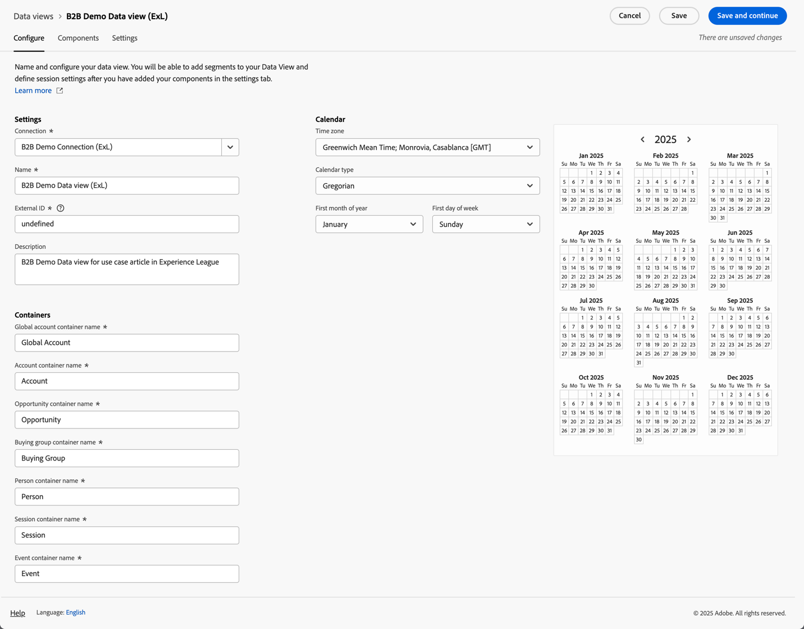

# Einrichten für B2B edition-Anwendungsfälle

In diesem Artikel wird eine typische Einrichtung von Customer Journey Analytics B2B edition beschrieben, um die folgenden Anwendungsfälle zu unterstützen:

* [Optimieren des Konto-Marketings](optimize-account-marketing.md)
* [Wachstum wichtiger Konten](grow-key-accounts.md)
* [Fördern von Produktwert](build-product-value.md)

>[!NOTE]
>
>Die Demodaten und Screenshots, die in diesen Anwendungsfällen verwendet werden, dienen nur zu Illustrationszwecken und spiegeln keine realen Daten wider.

## Referenz zum Lösungs-Design

Bevor Sie Customer Journey Analytics B2B edition einrichten, stellen Sie sicher, dass Sie über eine ordnungsgemäße Referenz zum Lösungs-Design verfügen, die jedes der erfassten Felder dokumentiert.

Eine Beispiel-Entwurfsreferenz für eine Lösung könnte wie folgt aussehen:

+++ Ereignisdimensionen

| Dimension-Name |
|---|
| Konto-ID |
| Kontoname |
| Käufergruppen-ID |
| Callcenter |
| Callcenter-Kundenbetreuer-ID |
| Anruf-ID |
| Kampagnen-Trackingcode |
| Inhalts-ID |
| Content-Typ |
| Datenquelle |
| Gerätetyp |
| Ereignisdetails |
| Ereignisname |
| Trichter |
| Interaktionskanal |
| Lead-ID |
| Marketing-Kanal |
| ID des Marketing-Ereignisses |
| Marketing-Ereignistyp |
| Opportunity-ID |
| Seite |
| Seitendetails |
| Referrer-Domain |
| Vertriebsmitarbeiter-ID |
| Name der Verkaufsstufe |
| Stadiennummer des Verkaufs |
| Website-Bereich |
| SKU |
| ID des ergänzenden Kontos |
| Umfrage-ID |
| Zufriedenheitswert der Umfrage |
| Umfragetyp |
| Benutzer-ID |

+++

+++ Ereignismetriken

| Metrikname | Ereignistyp |
|---|---|
| Kontoerstellung: abgeschlossen | Zähler |
| Kontoerstellung: Start | Zähler |
| Gesprächskosten | Währung |
| Anruflänge | Zähler |
| Gesprächszufriedenheitsindex | Numerisch |
| Anrufumfragen abgeschlossen | Zähler |
| Anrufe | Zähler |
| Verloren geschlossen | Zähler |
| abgeschlossen | Zähler |
| Inhaltsansichten | Zähler |
| Click-Throughs der Währungsanzeige des Angebots | Zähler |
| Anzeigen von Impressions | Zähler |
| E-Mail gebounct | Zähler |
| E-Mail angeklickt | Zähler |
| E-Mail zugestellt | Zähler |
| E-Mail geöffnet | Zähler |
| E-Mail gesendet | Zähler |
| Eventteilnahme | Zähler |
| Ereignisregistrierung: abgeschlossen | Zähler |
| Ereignisregistrierung: Schritt 1 | Zähler |
| Ereignisregistrierung: Schritt 2 | Zähler |
| Ereignisregistrierung: Schritt 3 | Zähler |
| Globaler Zufriedenheitswert Numerischer eingehender Aufruf | Zähler |
| Lead-Formular: Ausfüllen | Zähler |
| Lead-Formular: Schritt 1 | Zähler |
| Lead-Formular: Schritt 2 | Zähler |
| Lead generiert | Zähler |
| Lead-Qualifizierung | Zähler |
| Besprechungen | Zähler |
| MQL disqualifiziert | Zähler |
| MQL-qualifiziert | Zähler |
| Bedarfsermittlung | Zähler |
| Verhandlung | Zähler |
| Umgang mit Einwänden | Zähler |
| Opportunities | Zähler |
| Opportunity-Erstellung | Zähler |
| Bestellungen | Zähler |
| Ausgehender Aufruf | Zähler |
| Follow-up nach dem Verkauf | Zähler |
| Vorschlagseinsendung | Zähler |
| Verlorene Einnahmen | Währung |
| Umsatz abgeschlossen-gewonnen | Währung |
| Vertriebskontakte | Zähler |
| Verkaufsstufe gestartet | Zähler |
| SMS-Clickthroughs | Zähler |
| SMS gesendet | Zähler |
| Social-Clickthroughs | Zähler |
| Soziale Impressionen | Zähler |
| Lösungsübersicht | Zähler |
| SQL disqualifiziert | Zähler |
| SQL-Qualifiziert | Zähler |
| Einheiten (nicht belichten) | Zähler |
| VoC Survey Satisfaction Score | Numerisch |
| VoC-Umfragen abgeschlossen | Zähler |

+++

+++ Personendatensätze

| Feldname für die Datenansicht | Feldtyp |
|---|---|
| Alter | Metrik |
| Altersgruppe | Dimension |
| Kategorie 1 Affinitätsstufe | Dimension |
| Kategorie 1 Affinitätswert | Metrik |
| Kategorie 2 Affinitätsstufe | Dimension |
| Kategorie-2-Affinitätswert | Metrik |
| Kategorie 3 Affinitätsstufe | Dimension |
| Kategorie-3-Affinitätswert | Metrik |
| Kategorie 4 Affinitätsstufe | Dimension |
| Kategorie 4 Affinitätswert | Metrik |
| Kategorie 5 Affinitätsstufe | Dimension |
| Kategorie 5 Affinitätswert | Metrik |
| Einverständnis-Advertising | Dimension |
| Alle Nachrichten akzeptieren | Dimension |
| Einverständnis-Briefpost | Dimension |
| Einverständnis-E-Mail | Dimension |
| Mobiltelefonzustimmung | Dimension |
| Einverständnis-Personalization | Dimension |
| Einverständnisfreigabe-Daten | Dimension |
| Einverständnis-SMS | Dimension |
| E-Mail | Dimension |
| Vorname | Dimension |
| Geschlecht | Dimension |
| Einzelstadt | Dimension |
| Individuelle CLTV-Ebene | Dimension |
| Individuelle CLTV-Punktzahl | Metrik |
| einzelnes Land | Dimension |
| Individuelles Telefon | Dimension |
| Individuelle Postleitzahl | Dimension |
| Individuelle Kaufneigung | Dimension |
| Individuelle Neigung zum Kauf Score | Metrik |
| Individuelle Abwanderungsneigung | Dimension |
| Individuelle Abwanderungsneigung | Metrik |
| Individuelle Neigung zur Aktualisierung der Ebene | Dimension |
| Neigung des Kontakts zum Score-Upgrade | Metrik |
| Einzelstaat | Dimension |
| Straße der Person | Dimension |
| Stellenbezeichnung | Dimension |
| Nachname | Dimension |
| Net Promoter Score | Metrik |
| Net Promoter Status | Dimension |
| Rollentyp | Dimension |

+++

+++ Kontoaufzeichnungen

| Feldname für die Datenansicht | Feldtyp |
|---|---|
| Jahresumsatz | Metrik |
| Firmenstadt | Dimension |
| CLTV-Ebene des Unternehmens | Dimension |
| CLTV-Bewertung des Unternehmens | Metrik |
| Land des Unternehmens | Dimension |
| Firmenname | Dimension |
| Firmentelefon | Dimension |
| Postleitzahl des Unternehmens | Dimension |
| Neigung des Unternehmens zum Kauf | Dimension |
| Neigung des Unternehmens zum Score zu kaufen | Metrik |
| Tendenz des Unternehmens zur Abwanderung | Dimension |
| Tendenz des Unternehmens zur Abwanderung | Metrik |
| Tendenz des Unternehmens zur Aktualisierung der Stufe | Dimension |
| Tendenz des Unternehmens zum Score-Upgrade | Metrik |
| Unternehmensgröße | Dimension |
| Unternehmensstaat | Dimension |
| Straße des Unternehmens | Dimension |
| Branche | Dimension |
| Anzahl der Mitarbeiter | Metrik |
| Partner-Zielgruppe - Hardware-Käufer | Dimension |
| Partner-Zielgruppe - schnelles Wachstum | Dimension |
| Partnerzielgruppe - Services erforderlich | Dimension |
| Partner-Zielgruppe - Software-Käufer | Dimension |
| Umsatzbereich | Dimension |
| Website | Dimension |

+++

+++ SKU-Datensätze

| Feldname für die Datenansicht | Feldtyp |
|---|---|
| Hardware-Produktkategorie | Dimension |
| Hardware-Produktname | Dimension |
| Service-Kategorie | Dimension |
| Service-Name | Dimension |
| Software-Produktkategorie | Dimension |
| Produktname der Software | Dimension |

+++

## Schemata und Datensätze

Die Daten, die die Lösungs-Design-Referenz unterstützen, sind anhand der folgenden Schemata und Datensätze strukturiert.

### Ereignisdaten

Die Ereignisdimensionen und Metriken werden durch ein auf Zeitreihen (Ereignissen) basierendes Schema und einen oder mehrere Datensätze, die Ereignisdaten enthalten, unterstützt.

<!--For example: the Account ID field is mapped to **[!UICONTROL Account ID]**. See below for a preview of the data typically available in such a dataset.

-->

### Personendaten

Die Personendatensätze werden über ein auf einem Datensatz (Profil) basierendes Schema und einen oder mehrere Datensätze, die Personendaten enthalten, unterstützt. Unten finden Sie ein Beispiel für Personendaten (basierend auf der Beispiel-Referenz zum Lösungs-Design), die normalerweise in einem solchen Datensatz verfügbar sind.

### Kontodaten

Die Kontodatensätze werden durch ein auf Datensätzen (Lookup) basierendes Schema und einen oder mehrere Datensätze, die Kontodaten enthalten, unterstützt. Unten finden Sie ein Beispiel für Kontodaten (basierend auf der Beispiel-Referenz zum Lösungs-Design), die normalerweise in einem solchen Datensatz verfügbar sind.

### Artikeldaten

Die SKU-Datensätze werden durch ein auf Datensätzen (Lookup) basierendes Schema und einen oder mehrere Datensätze, die SKU-Daten enthalten, unterstützt. Unten finden Sie ein Beispiel für SKU-Daten (basierend auf der Beispiel-Referenz zum Lösungs-Design), die normalerweise in einem solchen Datensatz verfügbar sind.

## Verbindung

Definieren Sie eine kontobasierte Verbindung in Customer Journey Analytics, um Datensätze aus Ereignis-, Konto-, Personen- und SKU-Datensätzen aufzunehmen und miteinander zu verbinden.

1. [Erstellen einer neuen Verbindung](/help/connections/create-connection.md) in Customer Journey Analytics.
1. Geben Sie einen beschreibenden Namen und eine Beschreibung für die Verbindung ein.
1. Wählen Sie  **[!UICONTROL Account]** als **[!UICONTROL Primäre ID]**.
1. Wählen Sie alle **[!UICONTROL optionalen Container]** aus.
1. Wählen Sie Ihre bevorzugte Sandbox aus und schätzen Sie die durchschnittliche Anzahl der täglichen Ereignisse.

   

1. Wählen Sie **[!UICONTROL Datensätze hinzufügen]** aus und fügen Sie die B2B-Datensätze hinzu, die die Daten für Ereignisse, Konten, Personen und SKUs enthalten.

   

1. Klicken Sie **[!UICONTROL Weiter]**, um die Einstellungen für jeden der ausgewählten Datensätze zu konfigurieren.
1. Wählen Sie für den Ereignisdatensatz die entsprechenden Felder aus, die den Identitäten für **[!UICONTROL Konto-ID]**, **[!UICONTROL Globale Konto-ID]**, **[!UICONTROL Opportunity-ID]**, **[!UICONTROL Einkaufsgruppen-ID]** und **[!UICONTROL Personen-ID]** entsprechen.

   

1. Scrollen Sie nach unten, um den Datensatz Kontodatensätze zu konfigurieren. Stellen Sie sicher, dass Sie die richtige Kennung (**[!UICONTROL Account_ID]**) auswählen, um dem Konto durch den Container **[!UICONTROL Globales Konto]** zu entsprechen. Wählen Sie die richtige Kennung (**[!UICONTROL Account_ID]**) als **[!UICONTROL Feld Globales Konto]**.

   

1. Scrollen Sie nach unten, um den Datensatz mit Personendatensätzen zu konfigurieren. Stellen Sie sicher, dass Sie den richtigen Schlüssel (**[!UICONTROL Person_ID]**) auswählen, um ihn mit der Person durch den **[!UICONTROL Person]** Container abzugleichen. Wählen Sie die entsprechende Identität (**[!UICONTROL Profile_Account_ID_Individual]**) aus, die mit dem Feld **[!UICONTROL Globales Konto]** übereinstimmt.

   

1. Scrollen Sie nach unten, um den SKU-Datensatz zu konfigurieren. Stellen Sie sicher, dass Sie den richtigen Schlüssel (**[!UICONTROL SKU]**) auswählen. Wählen Sie **[!UICONTROL Übereinstimmung nach Feld]** aus, da für diese Daten kein Container konfiguriert oder verfügbar ist. Wählen Sie das Feld SKU im Ereignisdatensatz (SKU **[!UICONTROL (Ereignisdatensätze)]** als übereinstimmenden Schlüssel aus.

   

1. Wählen **[!UICONTROL Datensätze hinzufügen]**, um die Datensätze und ihre konfigurierten Einstellungen zu speichern.

1. Klicken Sie **[!UICONTROL Speichern]**, um die Verbindung zu speichern.

## Datenansicht

Nachdem Daten in Customer Journey Analytics erfasst wurden, möchten Sie eine Datenansicht erstellen, die alle Komponenten enthält, die Sie in Ihrer Lösungs-Design-Referenz definiert haben.

### Konfigurieren

1. [Erstellen einer neuen Datenansicht](/help/data-views/data-views.md) in Customer Journey Analytics.
1. Wählen Sie die zuvor erstellte Verbindung aus (z. B **[!UICONTROL B2B-Demoverbindung (ExL)]**.
1. Geben Sie einen Namen für die Datenansicht an. Beispiel: `B2B Demo Data view (ExL)` und optional eine Beschreibung.
1. Optional können Sie die Container umbenennen. Oder bleiben Sie bei den standardmäßigen Container-Namen.

   
1. Wählen Sie **[!UICONTROL Speichern und fortfahren]** aus.

### Komponenten

Standardmäßig sind alle [Standardkomponenten](/help/data-views/component-reference.md) bereits in Ihrer Datenansicht enthalten. Zu diesen Standardkomponenten gehören die B2B-spezifischen Metriken für Accounts, Einkaufsgruppen, globale Accounts und Opportunities.

1. Fügen Sie alle Ereignisdimensionen, die Sie in der [Lösungs-Design-Referenz](#solution-design-reference) definiert haben, zu den Dimensionskomponenten in Ihrer Datenansicht hinzu. Beispiel: das Feld **[!UICONTROL Ereignisname]**, das die Dimension **[!UICONTROL Ereignisname]** darstellt. Stellen Sie sicher, dass Sie die Dimensionskomponente über die verfügbaren [Komponenteneinstellungen](/help/data-views/component-settings/overview.md) konfigurieren.

   

1. Fügen Sie alle Ereignismetriken, die Sie in der [Lösungs-Design-Referenz](#solution-design-reference) definiert haben, zu den Metrikkomponenten in Ihrer Datenansicht hinzu. Beispiel: das Feld **[!UICONTROL SQL Qualified]**, das die Metrik **[!UICONTROL SQL Qualified]** darstellt. Stellen Sie sicher, dass Sie die Dimensionskomponente über die verfügbaren [Komponenteneinstellungen](/help/data-views/component-settings/overview.md) konfigurieren.

   

1. Fügen Sie alle Kontodimensionen, die Sie in der [Lösungs-Design-Referenz](#solution-design-reference) definiert haben, zu den Dimensionskomponenten in Ihrer Datenansicht hinzu. Beispiel: das Feld **[!UICONTROL Branche]**, das die Dimension **[!UICONTROL Branche]** darstellt. Stellen Sie sicher, dass Sie die Dimensionskomponente über die verfügbaren [Komponenteneinstellungen](/help/data-views/component-settings/overview.md) konfigurieren.

   

1. Fügen Sie alle Kontometriken, die Sie in der [Lösungs-Design-Referenz](#solution-design-reference) definiert haben, zu den Metrikkomponenten in Ihrer Datenansicht hinzu. Zum Beispiel das Feld **[!UICONTROL Number_of_Employees]**, das die Metrik **[!UICONTROL Number_of_Employees]** darstellt. Stellen Sie sicher, dass Sie die Dimensionskomponente über die verfügbaren [Komponenteneinstellungen](/help/data-views/component-settings/overview.md) konfigurieren.

   

1. Fügen Sie alle Personendimensionen, die Sie in der [Lösungs-Design-Referenz](#solution-design-reference) definiert haben, zu den Dimensionskomponenten in Ihrer Datenansicht hinzu. Zum Beispiel das Feld **[!UICONTROL Category_1_Affinity_Level]**, das die Dimension **[!UICONTROL Category_1_Affinity_Level]** darstellt. Stellen Sie sicher, dass Sie die Dimensionskomponente über die verfügbaren [Komponenteneinstellungen](/help/data-views/component-settings/overview.md) konfigurieren.

   

1. Fügen Sie alle Personenmetriken, die Sie in der [Lösungs-Design-Referenz](#solution-design-reference) definiert haben, zu den Metrikkomponenten in Ihrer Datenansicht hinzu. Zum Beispiel das Feld **[!UICONTROL Category_1_Affinity_Score]**, das die Metrik **[!UICONTROL Category_1_Affinity_Score]** darstellt. Stellen Sie sicher, dass Sie die Dimensionskomponente über die verfügbaren [Komponenteneinstellungen](/help/data-views/component-settings/overview.md) konfigurieren.

   

1. Fügen Sie alle SKU-Dimensionen, die Sie in der [Lösungs-Design-Referenz](#solution-design-reference) definiert haben, zu den Dimensionskomponenten in Ihrer Datenansicht hinzu. Beispiel: das Feld **[!UICONTROL Dienstkategorie]**, das die Dimension **[!UICONTROL Dienstkategorie]** darstellt. Stellen Sie sicher, dass Sie die Dimensionskomponente über die verfügbaren [Komponenteneinstellungen](/help/data-views/component-settings/overview.md) konfigurieren.

   

1. Wählen Sie **[!UICONTROL Speichern und fortfahren]**.

### Einstellungen

1. Sie können optional bestimmte [Einstellungen](/help/data-views/create-dataview.md#settings-1) für die Datenansicht definieren:

   * Fügen Sie der Datenansicht Segmente hinzu.
   * Verwenden Sie eine (berechnete) Metrik, um Sitzungseinstellungen zu definieren.

1. Wählen Sie **[!UICONTROL Speichern und fortfahren]** aus.

## Segmente

Sie können ein oder mehrere B2B-spezifische Container-basierte Segmente vorbereiten, die Sie in Ihrem Workspace-Projekt verwenden können.

Zum Beispiel:

* Konten mit Segment zur Ereignisregistrierung.

  

* US-Konten mit dem Segment „Einkaufsgruppen“ und „Chancen der Stufe 5“.

  

## Sonstige

Sie können optional andere Komponenten für Ihre Anwendungsfälle definieren, z. B[ „Berechnete ](/help/components/calc-metrics/calc-metr-overview.md)&quot;, [Datumsbereiche](/help/components/date-ranges/overview.md) oder [Warnhinweise](/help/components/c-intelligent-alerts/intelligent-alerts.md).
