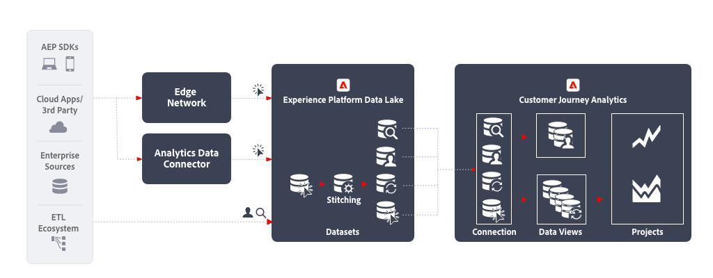

# Kanalübergreifende Analyse {#cross-channel}

<!-- markdownlint-disable MD034 -->

>[!CONTEXTUALHELP]
>id="cja-upgrade-additional-datasets"
>title="Hinzufügen zusätzlicher Datensätze zu Ihrer Verbindung"
>abstract="Nachdem Sie Daten zu einem Datensatz in Adobe Experience Platform hinzufügen, können Sie diesen Datensatz zu Ihrer Verbindung in Customer Journey Analytics hinzufügen. Stellen Sie sicher, dass beim Hinzufügen von Daten aus anderen Kanälen diese dem Schema entsprechen, das Ihre Organisation verwendet.  Jeder von Ihnen hinzugefügte Datensatz erfordert einen enormen Arbeitsaufwand, insbesondere um sicherzustellen, dass die eindeutige Kennung für jedes Ereignis vorhanden ist, und dass die übergreifende Datenstruktur dem benutzerdefinierten Schema Ihrer Organisation entspricht. Die Einrichtung dieses Workflows kann eine Koordination über viele Teams innerhalb Ihrer Organisation und über mehrere Monate hinweg erfordern."

<!-- markdownlint-enable MD034 -->

Die kanalübergreifende Analyse verschafft Ihnen einen zentralen Überblick über das Kundenverhalten über verschiedene Kanäle hinweg, indem Daten aus verschiedenen Web-, Mobile- und Offline-Eigenschaften vereinheitlicht werden. Beispielsweise können Sie diese konsolidierte Ansicht verwenden, um Kundeninteraktionen auf Desktop- und Mobilgeräten zu analysieren, um das Kundenverhalten zu verstehen und Einblicke zu gewinnen, um digitale Kundenerlebnisse zu optimieren. Sie können auch kanalübergreifend Kundeninteraktionen analysieren, einschließlich digitaler und Offline-Kanäle wie Support-Interaktionen und In-Store-Käufe, um die Customer Journey besser zu verstehen und zu optimieren.

## Implementierungsschritte

1. [Erstellen Sie Schemata](https://experienceleague.adobe.com/docs/experience-platform/xdm/tutorials/create-schema-ui.html?lang=de) für aufzunehmende Daten.
1. [Erstellen Sie Datensätze](https://experienceleague.adobe.com/docs/platform-learn/tutorials/data-ingestion/create-datasets-and-ingest-data.html?lang=de) für aufzunehmende Daten.
1. [Aufnehmen von Daten in Experience Platform](https://experienceleague.adobe.com/docs/platform-learn/tutorials/data-ingestion/understanding-data-ingestion.html?lang=de):
   1. Ereignisbasierte Daten  von einer Website oder Mobile App über das Edge Network oder den Analytics-Quell-Connector.
   2. Profildaten  (z. B. aus einem CRM-System, einer Callcenter-Anwendung oder einem Treueprogramm).
   3. Lookup-Daten  (z. B. Produktname, Kategorie aus einem Produktinformationssystem).

1. Verwenden Sie eine gemeinsame Namespace-ID für alle Datensätze. Verwenden Sie die [Zuordnung](../../stitching/overview.md), um einen beliebigen ereignisbasierten Datensatz  in Bezug auf die Bereitstellung der gemeinsamen ID in jeder Zeile zu erhöhen. Beachten Sie, dass Customer Journey Analytics derzeit für die Zuordnung weder das Experience Platform-Profil noch die Identitäts-Services verwendet.
1. Führen Sie eine benutzerdefinierte Datenvorbereitung durch, um sicherzustellen, dass ein gemeinsamer Schlüssel aus Zeitreihendaten in Customer Journey Analytics aufgenommen werden kann.
1. Weisen Sie Suchdaten eine primäre ID zu, die mit einem Feld in den Ereignisdaten verknüpft werden kann. Zählt bei der Lizenzierung als Zeilen.
1. Legen Sie dieselbe primäre ID für Profildaten als primäre ID der Ereignisdaten fest.
1. [Erstellen Sie eine Verbindung](../../connections/overview.md), um die relevanten Datensätze aus Experience Platform in Customer Journey Analytics aufzunehmen.
1. [Erstellen Sie eine Datenansicht](/help/data-views/create-dataview.md) für die Verbindung, um die spezifischen Dimensionen und Metriken auszuwählen, die in die Ansicht aufgenommen werden sollen. Die Einstellungen für Attribution und Zuordnung werden auch in der Datenansicht konfiguriert. Diese Einstellungen werden zur Berichtszeit berechnet.
1. [Erstellen Sie ein Projekt](/help/analysis-workspace/home.md), um Dashboards und Berichte in Analysis Workspace zu konfigurieren.

## Zu beachten

Beachten Sie bei der Erstellung dieses Workflows die folgenden Punkte.

* Für die kanalübergreifende Analyse von Daten ist für jeden Eintrag derselbe ID-Namespace erforderlich.
* Für den Vereinigungsprozess verschiedener Datensätze ist ein gemeinsamer primärer Personen-/Entitätsschlüssel für die Datensätze erforderlich.
* Sekundäre schlüsselbasierte Vereinigungen werden derzeit nicht unterstützt.
* Der Zuordnungsprozess ermöglicht die Neuzuweisung von Identitäten in Zeilen basierend auf Informationen zu vorübergehenden IDs (z. B. einer Authentifizierungs-ID) aus Einträgen mit derselben persistenten ID. Dies ermöglicht die Auflösung unterschiedlicher Einträge zu einer einzelnen zusammengefügten ID für die Analyse auf Personenebene und nicht auf Geräte- oder Cookie-Ebene.
* Objekte und Attribute desselben XDM-Felds werden in Customer Journey Analytics zu einer Dimension zusammengeführt. Um mehrere Attribute aus verschiedenen Datensätzen mit derselben Customer Journey Analytics-Dimension zusammenzuführen, sollten die Datensätze auf dasselbe XDM-Feld oder Schema verweisen.

