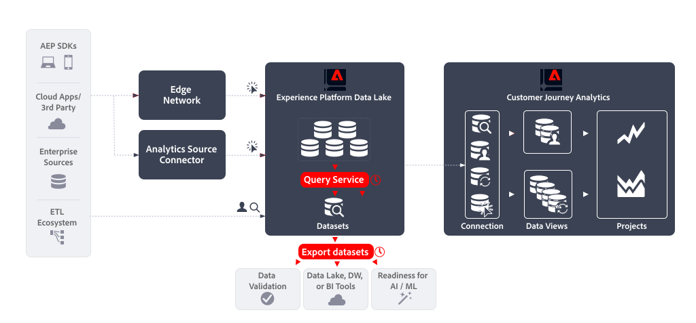

# Query Service (Data Distiller) und Export von Datensätzen

In diesem Artikel wird erläutert, wie die Kombination aus Experience Platform Query Service (Data Distiller) und Datensatzexport verwendet werden kann, um die folgenden [Anwendungsfälle für Datenexporte](overview.md) zu implementieren:

- Datenvalidierung
- Data Lake, Data Warehouse von BI-Tools
- Bereitschaft für künstliche Intelligenz und maschinelles Lernen.


Adobe Analytics kann diese Anwendungsfälle mithilfe der [Daten-Feeds](https://experienceleague.adobe.com/en/docs/analytics/export/analytics-data-feed/data-feed-overview) -Funktion implementieren. Daten-Feeds sind eine leistungsstarke Methode, Rohdaten aus Adobe Analytics abzurufen. In diesem Artikel wird beschrieben, wie Sie ähnliche Rohdaten aus dem Experience Platform abrufen, damit Sie die oben genannten Anwendungsfälle implementieren können. Gegebenenfalls werden die in diesem Artikel beschriebenen Funktionen mit Adobe Analytics Data Feeds verglichen, um Unterschiede in Daten und Prozessen zu klären.

## Einführung

Der Datenexport mithilfe von Query Service (Data Distiller) und Datensatzexport besteht aus:

- Definieren einer **geplanten Abfrage** , mit der die Daten für Ihren Daten-Feed als Ausgabedatensatz  generiert werden, wobei **Query Service** verwendet wird.
- Definieren eines **geplanten Datensatzexports**, der den Ausgabedatensatz mithilfe von **Datensatzexport** an ein Cloud-Speicher-Ziel exportiert.




## Voraussetzungen

Stellen Sie sicher, dass Sie alle folgenden Anforderungen erfüllen, bevor Sie die in diesem Anwendungsbeispiel beschriebene Funktion verwenden:

- Eine funktionierende Implementierung, die Daten in den Experience Platform Data Lake sammelt.
- Zugriff auf das Data Distiller-Add-on, um sicherzustellen, dass Sie berechtigt sind, Batch-Abfragen auszuführen. Weitere Informationen finden Sie unter [Query Service packaging](https://experienceleague.adobe.com/en/docs/experience-platform/query/packaging) .
- Zugriff auf die Funktion zum Exportieren von Datensätzen , die beim Kauf des Real-Time CDP Prime- oder Ultimate-Packages, Adobe Journey Optimizer oder Customer Journey Analytics verfügbar ist. Weitere Informationen finden Sie unter [Exportieren von Datensätzen in Cloud-Speicher-Ziele](https://experienceleague.adobe.com/en/docs/experience-platform/destinations/ui/activate/export-datasets) .
- Ein oder mehrere konfigurierte Ziele (z. B. Amazon S3, Google Cloud Storage), an die Sie die Rohdaten Ihres Daten-Feeds exportieren können.


## Abfrage-Service

Mit dem Experience Platform Query Service können Sie einen beliebigen Datensatz im Experience Platform Data Lake abfragen und verbinden, als wäre es eine Datenbanktabelle. Anschließend können Sie die Ergebnisse als neuen Datensatz für die weitere Verwendung in Berichten oder für den Export erfassen.

Sie können die Query Service- [Benutzeroberfläche](https://experienceleague.adobe.com/en/docs/experience-platform/query/ui/overview), einen [Client, der über das PostgresQL-Protokoll](https://experienceleague.adobe.com/en/docs/experience-platform/query/clients/overview) verbunden ist, oder [RESTful-APIs](https://experienceleague.adobe.com/en/docs/experience-platform/query/api/getting-started) verwenden, um Abfragen zu erstellen und zu planen, die die Daten für Ihren Daten-Feed erfassen.

### Abfrage erstellen

Sie können alle Funktionen von Standard-ANSI SQL für SELECT-Anweisungen und andere eingeschränkte Befehle verwenden, um Abfragen zu erstellen und auszuführen, die die Daten für Ihren Daten-Feed generieren. Weitere Informationen finden Sie unter [SQL-Syntax](https://experienceleague.adobe.com/en/docs/experience-platform/query/sql/syntax) . Neben dieser SQL-Syntax unterstützt Adobe Folgendes:

- vorkonfigurierte [Adobe-definierte Funktionen (ADF)](https://experienceleague.adobe.com/en/docs/experience-platform/query/sql/adobe-defined-functions), die bei der Durchführung allgemeiner geschäftsbezogener Aufgaben für Ereignisdaten helfen, die im Experience Platform Data Lake gespeichert sind, einschließlich Funktionen für die [Sitzungserstellung](https://experienceleague.adobe.com/en/docs/analytics/components/virtual-report-suites/vrs-mobile-visit-processing) und die [Zuordnung](https://experienceleague.adobe.com/en/docs/analytics/analyze/analysis-workspace/attribution/overview),
- mehrere integrierte [Spark-SQL-Funktionen](https://experienceleague.adobe.com/en/docs/experience-platform/query/sql/spark-sql-functions),
- [metadata PostgreSQL-Befehle](https://experienceleague.adobe.com/en/docs/experience-platform/query/sql/metadata),
- [vorbereitete Anweisungen](https://experienceleague.adobe.com/en/docs/experience-platform/query/sql/prepared-statements).

#### Daten-Feed-Spalten

Die XDM-Felder, die Sie in Ihrer Abfrage verwenden können, hängen von der Schemadefinition ab, auf der Ihre Datensätze basieren. Vergewissern Sie sich, dass Sie das dem Datensatz zugrunde liegende Schema verstehen. Weitere Informationen finden Sie im Leitfaden zur Benutzeroberfläche von [Datensätzen](https://experienceleague.adobe.com/en/docs/experience-platform/catalog/datasets/user-guide).

Informationen zum Definieren der Zuordnung zwischen den Daten-Feed-Spalten und XDM-Feldern finden Sie unter [Analytics-Feldzuordnung](https://experienceleague.adobe.com/en/docs/experience-platform/sources/connectors/adobe-applications/mapping/analytics). Weitere Informationen zum Verwalten von XDM-Ressourcen, einschließlich Schemas, Klassen, Feldergruppen und Datentypen, finden Sie in der [Übersicht über die Benutzeroberfläche von Schemas](https://experienceleague.adobe.com/en/docs/experience-platform/xdm/ui/overview#defining-xdm-fields) .

Wenn Sie beispielsweise *Seitenname* als Teil Ihres Daten-Feeds verwenden möchten:

- In der Benutzeroberfläche des Adobe Analytics-Daten-Feeds wählen Sie **[!UICONTROL pagename]** als Spalte aus, die Sie Ihrer Daten-Feed-Definition hinzufügen möchten.
- In Query Service fügen Sie `web.webPageDetails.name` aus dem Datensatz `sample_event_dataset_for_website_global_v1_1` (basierend auf dem Erlebnisereignisschema **Beispielereignis-Schema für Website (globales Erlebnisereignis-Schema v1.1)**) in Ihre Abfrage ein. Weitere Informationen finden Sie in der Feldergruppe [Webdetails-Schema](https://experienceleague.adobe.com/en/docs/experience-platform/xdm/field-groups/event/web-details) .


#### Identitäten

Unter Experience Platform sind verschiedene Identitäten verfügbar. Stellen Sie bei der Erstellung Ihrer Abfragen sicher, dass Sie Identitäten richtig abfragen.


Oft finden Sie Identitäten in einer separaten Feldergruppe. In einer Implementierung kann ECID (`ecid`) als Teil einer Feldergruppe mit einem `core` -Objekt definiert werden, das selbst Teil eines `identification` -Objekts ist (z. B. `_sampleorg.identification.core.ecid`). Die ECIDs können in Ihren Schemas unterschiedlich organisiert sein.

Alternativ können Sie `identityMap` verwenden, um nach Identitäten zu suchen. Der `identityMap` hat den Typ `Map` und verwendet eine [ verschachtelte Datenstruktur](#nested-data-structure).

Weitere Informationen zum Definieren von Identitätsfeldern in Experience Platform finden Sie unter [Identitätsfelder in der Benutzeroberfläche definieren](https://experienceleague.adobe.com/de/docs/experience-platform/xdm/ui/fields/identity) .

Unter [Primäre IDs in Analytics-Daten](https://experienceleague.adobe.com/en/docs/experience-platform/sources/connectors/adobe-applications/analytics#primary-identifiers-in-analytics-data) finden Sie Informationen dazu, wie Adobe Analytics-Identitäten bei Verwendung des Analytics-Quell-Connectors Experience Platform-Identitäten zugeordnet werden. Diese Zuordnung kann als Anleitung zum Einrichten Ihrer Identitäten dienen, selbst wenn Sie den Analytics-Quell-Connector nicht verwenden.


#### Daten und Identifizierung auf Trefferebene

Basierend auf der Implementierung werden traditionell in Adobe Analytics erfasste Trefferebenenddaten jetzt als Ereignisdaten mit Zeitstempel in Experience Platform gespeichert. Die folgende Tabelle wird aus der [Analytics-Feldzuordnung](https://experienceleague.adobe.com/en/docs/experience-platform/sources/connectors/adobe-applications/mapping/analytics#generated-mapping-fields) extrahiert und zeigt Beispiele, wie Sie Trefferebenen-spezifischen Adobe Analytics-Daten-Feed-Spalten entsprechende XDM-Felder in Ihren Abfragen zuordnen. Die Tabelle zeigt außerdem Beispiele dafür, wie Treffer, Besuche und Besucher mithilfe von XDM-Feldern identifiziert werden.

| Daten-Feed-Spalte | XDM-Feld | Typ | Beschreibung |
|---|---|---|---|
| `hitid_high` + `hitid_low` | `_id` | string | Eindeutige Kennung zur Identifizierung eines Treffers. |
| `hitid_low` | `_id` | string | Wird mit `hitid_high` verwendet, um einen Treffer eindeutig zu identifizieren. |
| `hitid_high` | `_id` | string | Wird mit `hitid_high` verwendet, um einen Treffer eindeutig zu identifizieren. |
| `hit_time_gmt` | `receivedTimestamp` | string | Der Zeitstempel des Treffers basierend auf der UNIX®-Zeit. |
| `cust_hit_time_gmt` | `timestamp` | string | Dieser Zeitstempel wird nur in für Zeitstempel aktivierten Datensätzen verwendet. Dieser Zeitstempel wird mit dem Treffer basierend auf der UNIX®-Zeit gesendet. |
| `visid_high` + `visid_low` | `identityMap` | Objekt | Eindeutige Kennung für einen Besuch. |
| `visid_high` + `visid_low` | `endUserIDs._experience.aaid.id` | string | Eindeutige Kennung für einen Besuch. |
| `visid_high` | `endUserIDs._experience.aaid.primary` | boolean | Wird mit `visid_low` verwendet, um einen Besuch eindeutig zu identifizieren. |
| `visid_high` | `endUserIDs._experience.aaid.namespace.code` | string | Wird mit `visid_low` verwendet, um einen Besuch eindeutig zu identifizieren. |
| `visid_low` | `identityMap` | Objekt | Wird mit `visid_high` verwendet, um einen Besuch eindeutig zu identifizieren. |
| `cust_visid` | `identityMap` | Objekt | Die Besucher-ID des Kunden. |
| `cust_visid` | `endUserIDs._experience.aacustomid.id` | Objekt | Die Besucher-ID des Kunden. |
| `cust_visid` | `endUserIDs._experience.aacustomid.primary` | boolean | Der Namespace-Code der Besucher-ID des Kunden. |
| `cust_visid` | `endUserIDs._experience.aacustomid.namespace.code` | string | Wird mit `visid_low` verwendet, um die Besucher-ID des Kunden eindeutig zu identifizieren. |
| `geo\_*` | `placeContext.geo.* ` | Zeichenfolge, Zahl | Geolocation-Daten wie Land, Region, Stadt und andere |
| `event_list` | `commerce.purchases`, `commerce.productViews`, `commerce.productListOpens`, `commerce.checkouts`, `commerce.productListAdds`, `commerce.productListRemovals`, `commerce.productListViews`, `_experience.analytics.event101to200.*`, ..., `_experience.analytics.event901_1000.*` | string | Standardmäßige Commerce- und benutzerspezifische Ereignisse, die beim Treffer ausgelöst werden. |
| `page_event` | `web.webInteraction.type` | string | Die Art des in der Bildanforderung gesendeten Treffers (Standardtreffer, angeklickter Downloadlink, Exitlink oder benutzerspezifischer Link). |
| `page_event` | `web.webInteraction.linkClicks.value` | number | Die Art des in der Bildanforderung gesendeten Treffers (Standardtreffer, angeklickter Downloadlink, Exitlink oder benutzerspezifischer Link). |
| `page_event_var_1` | `web.webInteraction.URL` | string | Variable, die nur in Bildanforderungen zum Linktracking verwendet wird. Die Variable enthält die URL des angeklickten Downloadlinks, Exitlinks oder benutzerspezifischen Links. |
| `page_event_var_2` | `web.webInteraction.name` | string | Variable, die nur in Bildanforderungen zum Linktracking verwendet wird. Damit wird der benutzerdefinierte Name des Links aufgeführt, sofern angegeben. |
| `paid_search` | `search.isPaid` | boolean | Markierung, die gesetzt wird, wenn der Treffer mit der Paid Search-Erkennung übereinstimmt. |
| `ref_type` | `web.webReferrertype` | string | Eine numerische ID, die den Typ des Verweises für den Treffer darstellt. |

#### Post-Spalten

Adobe Analytics Data Feeds verwenden das Konzept von Spalten mit dem Präfix `post_` , bei denen es sich um Spalten handelt, die nach der Verarbeitung Daten enthalten. Weitere Informationen finden Sie in den [häufig gestellten Fragen zu Daten-Feeds](https://experienceleague.adobe.com/en/docs/analytics/export/analytics-data-feed/df-faq#post).

Daten, die in Datensätzen über das Experience Platform-Edge Network (Web SDK, Mobile SDK, Server API) erfasst werden, haben kein Konzept von `post_` -Feldern. Daher werden die mit dem Präfix `post_` und dem Präfix *non*-`post_` versehenen Daten-Feed-Spalten denselben XDM-Feldern zugeordnet. Beispielsweise werden sowohl `page_url` als auch `post_page_url` Daten-Feed-Spalten demselben `web.webPageDetails.URL` XDM-Feld zugeordnet.

Unter [Datenverarbeitung in Adobe Analytics und Customer Journey Analytics vergleichen](https://experienceleague.adobe.com/en/docs/analytics-platform/using/compare-aa-cja/cja-aa-comparison/data-processing-comparisons) finden Sie einen Überblick über den Unterschied bei der Datenverarbeitung.

Der Spaltentyp `post_` des Präfixes für Daten, die im Experience Platform Data Lake erfasst werden, erfordert jedoch erweiterte Transformationen, bevor sie in einem Anwendungsfall für Daten-Feeds erfolgreich verwendet werden können. Die Durchführung dieser erweiterten Transformationen in Ihren Abfragen erfordert die Verwendung von [Adobe-definierten Funktionen](https://experienceleague.adobe.com/en/docs/experience-platform/query/sql/adobe-defined-functions) für die Sitzungserstellung, Attribution und Deduplizierung. Weitere Informationen zur Verwendung dieser Funktionen finden Sie unter [Beispiele](#examples) .

#### Suchen

Zum Nachschlagen von Daten aus anderen Datensätzen verwenden Sie die SQL-Standardfunktionalität (`WHERE` -Klausel, `INNER JOIN`, `OUTER JOIN` und andere).

#### Berechnungen

Um Berechnungen für Felder (Spalten) durchzuführen, verwenden Sie die SQL-Standardfunktionen (z. B. `COUNT(*)`) oder den Teil [mathematische und statistische Operatoren und Funktionen](https://experienceleague.adobe.com/en/docs/experience-platform/query/sql/spark-sql-functions#math) von Spark SQL. Außerdem unterstützen die [Fensterfunktionen](https://experienceleague.adobe.com/en/docs/experience-platform/query/sql/adobe-defined-functions#window-functions) die Aktualisierung von Aggregationen und die Rückgabe einzelner Elemente für jede Zeile in einer sortierten Teilmenge. Weitere Informationen zur Verwendung dieser Funktionen finden Sie unter [Beispiele](#examples) .

#### Verschachtelte Datenstruktur

Die Schemas, auf denen die Datensätze basieren, enthalten häufig komplexe Datentypen, einschließlich verschachtelter Datenstrukturen. Zuvor erwähnte `identityMap` ist ein Beispiel für eine verschachtelte Datenstruktur. Unten finden Sie ein Beispiel für `identityMap` -Daten.

```json
{
   "identityMap":{
      "FPID":[
         {
            "id":"55613368189701342632255821452918751312",
            "authenticatedState":"ambiguous"
         }
      ],
      "CRM":[
         {
            "id":"2394509340-30453470347",
            "authenticatedState":"authenticated"
         }
      ]
   }
}
```

Sie können die [`explode()`- oder anderen Arrays-Funktionen](https://experienceleague.adobe.com/en/docs/experience-platform/query/sql/spark-sql-functions#arrays) von Spark SQL verwenden, um zu den Daten in einer verschachtelten Datenstruktur zu gelangen, z. B.:

```sql
select explode(identityMap) from demosys_cja_ee_v1_website_global_v1_1 limit 15;
```

Alternativ können Sie einzelne Elemente mit Punktnotation referenzieren. Zum Beispiel:

```sql
select identityMap.ecid from demosys_cja_ee_v1_website_global_v1_1 limit 15;
```

Weitere Informationen finden Sie unter [Arbeiten mit verschachtelten Datenstrukturen im Abfrage-Service](https://experienceleague.adobe.com/en/docs/experience-platform/query/key-concepts/nested-data-structures).


#### Beispiele

Für Abfragen:

- die Daten aus Datensätzen im Experience Platform Data Lake verwenden,
- die zusätzlichen Funktionen von Adobe Defined Functions und/oder Spark SQL nutzen und
- die ähnliche Ergebnisse wie ein gleichwertiger Adobe Analytics-Daten-Feed liefern würde,

siehe:

- [abgebrochener Durchsuchen](https://experienceleague.adobe.com/en/docs/experience-platform/query/use-cases/abandoned-browse)
- [Attributionsanalyse](https://experienceleague.adobe.com/en/docs/experience-platform/query/use-cases/attribution-analysis)
- [Bot-Filterung](https://experienceleague.adobe.com/en/docs/experience-platform/query/use-cases/bot-filtering)
- und anderen von [unterstützten Anwendungsfällen im Handbuch für Query Service](https://experienceleague.adobe.com/en/docs/experience-platform/query/use-cases/overview).

Nachstehend finden Sie ein Beispiel für die ordnungsgemäße Anwendung der Attribution über mehrere Sitzungen. Es zeigt, wie

- die letzten 90 Tage als Lookback verwenden,
- Fensterfunktionen wie Sitzungserstellung und/oder Attribution anwenden und
- die Ausgabe basierend auf dem `ingest_time` einschränken.

+++
Details

  Dazu müssen Sie...

   - Verwenden Sie eine Verarbeitungstatustabelle `checkpoint_log`, um die aktuelle und die letzte Aufnahmezeit zu verfolgen. Weitere Informationen finden Sie in [diesem Handbuch](https://experienceleague.adobe.com/en/docs/experience-platform/query/key-concepts/incremental-load) .
   - Deaktivieren Sie das Ablegen von Systemspalten, damit Sie `_acp_system_metadata.ingestTime` verwenden können.
   - Verwenden Sie maximal `SELECT`, um die Felder zu erfassen, die Sie verwenden möchten, und beschränken Sie die Ereignisse für die Sessionization- und/oder Attributionsberechnungen auf Ihren Lookback-Zeitraum. Beispiel: 90 Tage.
   - Verwenden Sie die nächste Ebene `SELECT`, um die Funktionen des Sitzungs- und/oder Attributionsfensters und andere Berechnungen anzuwenden.
   - Verwenden Sie `INSERT INTO` in Ihrer Ausgabetabelle, um den Lookback auf die Ereignisse zu beschränken, die seit der letzten Verarbeitungszeit aufgetreten sind. Filtern Sie dazu nach `_acp_system_metadata.ingestTime `und der zuletzt in Ihrer Verarbeitungsstatus-Tabelle gespeicherten Zeit.

  Beispiel für die Funktionen des Sitzungsfensters ****

  ```sql
  $$ BEGIN
     -- Disable dropping system columns
     set drop_system_columns=false; 
  
     -- Initialize variables
     SET @last_updated_timestamp = SELECT CURRENT_TIMESTAMP;
  
     -- Get the last processed batch ingestion time
     SET @from_batch_ingestion_time = SELECT coalesce(last_batch_ingestion_time, 'HEAD') 
        FROM checkpoint_log a 
        JOIN (
              SELECT MAX(process_timestamp) AS process_timestamp 
              FROM checkpoint_log
              WHERE process_name = 'data_feed' 
              AND process_status = 'SUCCESSFUL'
        ) b
        ON a.process_timestamp = b.process_timestamp;
  
     -- Get the last batch ingestion time
     SET @to_batch_ingestion_time = SELECT MAX(_acp_system_metadata.ingestTime) 
        FROM events_dataset;
  
     -- Sessionize the data and insert into data_feed.
     INSERT INTO data_feed
     SELECT *
     FROM (
        SELECT
              userIdentity,
              timestamp,
              SESS_TIMEOUT(timestamp, 60 * 30) OVER (
                 PARTITION BY userIdentity
                 ORDER BY timestamp
                 ROWS BETWEEN UNBOUNDED PRECEDING AND CURRENT ROW
              ) AS session_data,
              page_name,
              ingest_time
        FROM (
              SELECT
                 userIdentity,
                 timestamp,
                 web.webPageDetails.name AS page_name,
                 _acp_system_metadata.ingestTime AS ingest_time
              FROM events_dataset
              WHERE timestamp >= current_date - 90
        ) AS a
        ORDER BY userIdentity, timestamp ASC
     ) AS b
     WHERE b.ingest_time >= @from_batch_ingestion_time;
  
     -- Update the checkpoint_log table
     INSERT INTO checkpoint_log
     SELECT
        'data_feed' process_name,
        'SUCCESSFUL' process_status,
        cast(@to_batch_ingestion_time AS string) last_batch_ingestion_time,
        cast(@last_updated_timestamp AS TIMESTAMP) process_timestamp
  END
  $$;
  ```

  Beispiel für Funktionen des Attributionsfensters **1**

  ```sql
  $$ BEGIN
   SET drop_system_columns=false;
  
  -- Initialize variables
   SET @last_updated_timestamp = SELECT CURRENT_TIMESTAMP;
  
  -- Get the last processed batch ingestion time 1718755872325
   SET @from_batch_ingestion_time =
       SELECT coalesce(last_snapshot_id, 'HEAD')
       FROM checkpoint_log a
       JOIN (
           SELECT MAX(process_timestamp) AS process_timestamp
           FROM checkpoint_log
           WHERE process_name = 'data_feed'
           AND process_status = 'SUCCESSFUL'
       ) b
       ON a.process_timestamp = b.process_timestamp;
  
   -- Get the last batch ingestion time 1718758687865
   SET @to_batch_ingestion_time =
       SELECT MAX(_acp_system_metadata.ingestTime)
       FROM demo_data_trey_mcintyre_midvalues;
  
   -- Sessionize the data and insert into new_sessionized_data
   INSERT INTO new_sessionized_data
   SELECT *
   FROM (
       SELECT
           _id,
           timestamp,
           struct(User_Identity,
           cast(SESS_TIMEOUT(timestamp, 60 * 30) OVER (
               PARTITION BY User_Identity
               ORDER BY timestamp
               ROWS BETWEEN UNBOUNDED PRECEDING AND CURRENT ROW
           ) as string) AS SessionData,
           to_timestamp(from_unixtime(ingest_time/1000, 'yyyy-MM-dd HH:mm:ss')) AS IngestTime,      
           PageName,
           first_url,
           first_channel_type
             ) as _demosystem5
       FROM (
           SELECT
               _id,
               ENDUSERIDS._EXPERIENCE.MCID.ID as User_Identity,
               timestamp,
               web.webPageDetails.name AS PageName,
              attribution_first_touch(timestamp, '', web.webReferrer.url) OVER (PARTITION BY ENDUSERIDS._EXPERIENCE.MCID.ID ORDER BY timestamp ASC ROWS BETWEEN UNBOUNDED PRECEDING AND UNBOUNDED FOLLOWING).value AS first_url,
              attribution_first_touch(timestamp, '',channel.typeAtSource) OVER (PARTITION BY ENDUSERIDS._EXPERIENCE.MCID.ID ORDER BY timestamp ASC ROWS BETWEEN UNBOUNDED PRECEDING AND UNBOUNDED FOLLOWING).value AS first_channel_type,
               _acp_system_metadata.ingestTime AS ingest_time
           FROM demo_data_trey_mcintyre_midvalues
           WHERE timestamp >= current_date - 90
       )
       ORDER BY User_Identity, timestamp ASC    
   )
   WHERE _demosystem5.IngestTime >= to_timestamp(from_unixtime(@from_batch_ingestion_time/1000, 'yyyy-MM-dd HH:mm:ss'));
  
  -- Update the checkpoint_log table
  INSERT INTO checkpoint_log
  SELECT
     'data_feed' as process_name,
     'SUCCESSFUL' as process_status,
     cast(@to_batch_ingestion_time AS string) as last_snapshot_id,
     cast(@last_updated_timestamp AS timestamp) as process_timestamp;
  
  END
  $$;
  ```

+++


### Planen der Abfrage

Sie planen die Abfrage, um sicherzustellen, dass die Abfrage ausgeführt und die Ergebnisse in Ihrem gewünschten Intervall generiert werden.

#### Verwenden des Abfrage-Editors

Sie können eine Abfrage mit dem Abfrage-Editor planen. Bei der Planung der Abfrage definieren Sie einen Ausgabedatensatz. Weitere Informationen finden Sie unter [Abfragezeitpläne](https://experienceleague.adobe.com/en/docs/experience-platform/query/ui/query-schedules) .


#### Verwenden der Query Service-API

Alternativ können Sie die RESTful-APIs verwenden, um eine Abfrage und einen Zeitplan für die Abfrage zu definieren. Weitere Informationen finden Sie im Handbuch [Query Service API guide](https://experienceleague.adobe.com/en/docs/experience-platform/query/api/getting-started) .
Stellen Sie sicher, dass Sie den Ausgabedatensatz als Teil der optionalen Eigenschaft `ctasParameters` definieren, wenn Sie die Abfrage erstellen ([Abfragen erstellen](https://developer.adobe.com/experience-platform-apis/references/query-service/#tag/Queries/operation/createQuery)) oder wenn Sie den Zeitplan für eine Abfrage erstellen ([Geplante Abfrage erstellen](https://developer.adobe.com/experience-platform-apis/references/query-service/#tag/Schedules/operation/createSchedule)).


## Exportieren von Datensätzen

Nachdem Sie Ihre Abfrage erstellt und geplant und die Ergebnisse überprüft haben, können Sie die Rohdatensätze in Cloud-Speicher-Ziele exportieren. Dieser Export erfolgt in der Experience Platform Destinations-Terminologie, die als Datensatzexport-Ziele bezeichnet wird. Eine Übersicht finden Sie unter [Exportieren von Datensätzen in Cloud-Speicher-Ziele](https://experienceleague.adobe.com/en/docs/experience-platform/destinations/ui/activate/export-datasets) .

Die folgenden Cloud-Speicher-Ziele werden unterstützt:

- [Azure Data Lake Storage Gen2](https://experienceleague.adobe.com/en/docs/experience-platform/destinations/catalog/cloud-storage/adls-gen2)
- [Data Landing Zone](https://experienceleague.adobe.com/en/docs/experience-platform/destinations/catalog/cloud-storage/data-landing-zone)
- [Google Cloud Storage](https://experienceleague.adobe.com/en/docs/experience-platform/destinations/catalog/cloud-storage/google-cloud-storage)
- [Amazon S3](https://experienceleague.adobe.com/en/docs/experience-platform/destinations/catalog/cloud-storage/amazon-s3)
- [Azure Blob](https://experienceleague.adobe.com/en/docs/experience-platform/destinations/catalog/cloud-storage/azure-blob)
- [SFTP](https://experienceleague.adobe.com/en/docs/experience-platform/destinations/catalog/cloud-storage/sftp)


### Experience Platform-Benutzeroberfläche

Sie können den Export Ihrer Ausgabedatensätze über die Experience Platform-Benutzeroberfläche exportieren und planen. In diesem Abschnitt werden die erforderlichen Schritte beschrieben.

#### Ziel auswählen

Wenn Sie ermittelt haben, in welches Cloud-Speicher-Ziel Sie den Ausgabedatensatz exportieren möchten, wählen Sie [das Ziel ](https://experienceleague.adobe.com/en/docs/experience-platform/destinations/ui/activate/export-datasets#select-destination) aus. Wenn Sie noch kein Ziel für Ihren bevorzugten Cloud-Speicher konfiguriert haben, müssen Sie [eine neue Zielverbindung erstellen](https://experienceleague.adobe.com/en/docs/experience-platform/destinations/ui/connect-destination).

Im Zuge der Konfiguration eines Ziels können Sie

- den Dateityp definieren (JSON oder Parquet),
- ob die resultierende Datei komprimiert werden soll oder nicht und
- ob eine Manifestdatei enthalten sein soll oder nicht.


#### Datensatz auswählen

Wenn Sie das Ziel ausgewählt haben, müssen Sie im nächsten Schritt **[!UICONTROL Datensätze auswählen]** Ihren Ausgabedatensatz aus der Liste der Datensätze auswählen. Wenn Sie mehrere geplante Abfragen erstellen und möchten, dass die Ausgabedatensätze an dasselbe Cloud-Speicher-Ziel gesendet werden, können Sie die entsprechenden Ausgabedatensätze auswählen. Weitere Informationen finden Sie unter [Auswählen Ihrer Datensätze](https://experienceleague.adobe.com/en/docs/experience-platform/destinations/ui/activate/export-datasets#select-datasets) .

#### Planen des Datensatzexports

Schließlich möchten Sie den Export Ihres Datensatzes im Rahmen des Schritts **[!UICONTROL Planung]** planen. In diesem Schritt können Sie den Zeitplan definieren und festlegen, ob der Export des Ausgabedatensatzes inkrementell erfolgen soll oder nicht. Weitere Informationen finden Sie unter [Planen des Datensatzexports](https://experienceleague.adobe.com/en/docs/experience-platform/destinations/ui/activate/export-datasets#scheduling) .


#### Abgeschlossene Schritte

[Überprüfen Sie Ihre Auswahl](https://experienceleague.adobe.com/en/docs/experience-platform/destinations/ui/activate/export-datasets#review) und starten Sie den Export Ihres Ausgabedatasets in das Cloud-Speicher-Ziel, wenn dies korrekt ist.

Sie müssen einen erfolgreichen Datenexport [überprüfen](https://experienceleague.adobe.com/en/docs/experience-platform/destinations/ui/activate/export-datasets#verify). Beim Exportieren von Datensätzen erstellt Experience Platform eine oder mehrere `.json` - oder `.parquet` -Dateien am Speicherort, der in Ihrem Ziel definiert ist. Erwarten Sie, dass neue Dateien entsprechend dem von Ihnen eingerichteten Exportplan an Ihrem Speicherort abgelegt werden. Experience Platform erstellt eine Ordnerstruktur am Speicherort, den Sie als Teil des ausgewählten Ziels angegeben haben, wo die exportierten Dateien abgelegt werden. Für jeden Exportzeitpunkt wird ein neuer Ordner nach folgendem Muster erstellt: `folder-name-you-provided/datasetID/exportTime=YYYYMMDDHHMM`. Der standardmäßige Dateiname wird nach dem Zufallsprinzip generiert, was sicherstellt, dass die Namen von exportierten Dateien eindeutig sind.

### Flussdienst-API

Alternativ können Sie den Export von Ausgabedatensets mithilfe von APIs exportieren und planen. Die erforderlichen Schritte werden in [Exportieren von Datensätzen mithilfe der Flow Service-API](https://experienceleague.adobe.com/en/docs/experience-platform/destinations/api/export-datasets) dokumentiert.

#### Erste Schritte

Um Datensätze zu exportieren, stellen Sie sicher, dass Sie über die [erforderlichen Berechtigungen](https://experienceleague.adobe.com/en/docs/experience-platform/destinations/api/export-datasets#permissions) verfügen. Überprüfen Sie außerdem, ob das Ziel, an das Sie Ihren Ausgabedatensatz senden möchten, den Export von Datensätzen unterstützt. Anschließend müssen Sie [ die Werte für erforderliche und optionale Kopfzeilen ](https://experienceleague.adobe.com/en/docs/experience-platform/destinations/api/export-datasets#gather-values-headers) erfassen, die Sie in den API-Aufrufen verwenden. Außerdem müssen Sie [die Verbindungsspezifikations- und Flussspezifikations-IDs des Ziels](https://experienceleague.adobe.com/en/docs/experience-platform/destinations/api/export-datasets#gather-connection-spec-flow-spec) identifizieren, an das Sie Datensätze exportieren möchten.

#### Abrufen zulässiger Datensätze

Sie können [ eine Liste der für den Export infrage kommenden Datensätze abrufen](https://experienceleague.adobe.com/en/docs/experience-platform/destinations/api/export-datasets#retrieve-list-of-available-datasets) und mithilfe der API [`GET /connectionSpecs/{id}/configs`](https://developer.adobe.com/experience-platform-apis/references/destinations/#tag/Configurations/operation/getDatasets) überprüfen, ob Ihr Ausgabedatensatz Teil dieser Liste ist.


#### Erstellen der Quellverbindung

Als Nächstes müssen Sie [eine Quellverbindung für den Ausgabedatensatz erstellen](https://experienceleague.adobe.com/en/docs/experience-platform/destinations/api/export-datasets#create-source-connection), indem Sie dessen eindeutige Kennung verwenden, die Sie an das Cloud-Speicher-Ziel exportieren möchten. Sie verwenden die [`POST /sourceConnections`](https://developer.adobe.com/experience-platform-apis/references/destinations/#tag/Source-connections/operation/postSourceConnection) -API.

#### Authentifizierung am Ziel (Basisverbindung erstellen)

Sie müssen jetzt [eine Basisverbindung erstellen](https://experienceleague.adobe.com/en/docs/experience-platform/destinations/api/export-datasets#create-base-connection), um die Anmeldeinformationen mithilfe der API [`POST /targetConection`](https://developer.adobe.com/experience-platform-apis/references/destinations/#tag/Target-connections/operation/postTargetConnection) für Ihr Cloud-Speicher-Ziel zu authentifizieren und sicher zu speichern.


#### Exportparameter angeben

Als Nächstes müssen Sie [eine zusätzliche Zielverbindung erstellen, in der die Exportparameter](https://experienceleague.adobe.com/en/docs/experience-platform/destinations/api/export-datasets#create-target-connection) für Ihren Ausgabedatensatz gespeichert werden. Verwenden Sie dazu einmal mehr die API [`POST /targetConection`](https://developer.adobe.com/experience-platform-apis/references/destinations/#tag/Target-connections/operation/postTargetConnection) . Zu diesen Exportparametern gehören Speicherort, Dateiformat, Komprimierung und mehr.

#### Einrichten des Datenflusses

Richten Sie abschließend den Datenfluss ](https://experienceleague.adobe.com/en/docs/experience-platform/destinations/api/export-datasets#create-dataflow) ein, um sicherzustellen, dass Ihr Ausgabedatensatz mit der API [`POST /flows`](https://developer.adobe.com/experience-platform-apis/references/destinations/#tag/Dataflows/operation/postFlow) in Ihr Cloud-Speicher-Ziel exportiert wird. [ In diesem Schritt können Sie den Zeitplan für den Export mithilfe des Parameters `scheduleParams` definieren.

#### Validieren des Datenflusses

Um [die erfolgreichen Ausführungen Ihres Datenflusses](https://experienceleague.adobe.com/en/docs/experience-platform/destinations/api/export-datasets#get-dataflow-runs) zu überprüfen, verwenden Sie die API [`GET /runs`](https://developer.adobe.com/experience-platform-apis/references/destinations/#tag/Dataflow-runs/operation/getFlowRuns) und geben Sie die Datenfluss-ID als Abfrageparameter an. Diese Datenfluss-ID ist eine Kennung, die beim Einrichten des Datenflusses zurückgegeben wird.

[Überprüfen](https://experienceleague.adobe.com/en/docs/experience-platform/destinations/ui/activate/export-datasets#verify) Sie einen erfolgreichen Datenexport. Beim Exportieren von Datensätzen erstellt Experience Platform eine oder mehrere `.json` - oder `.parquet` -Dateien am Speicherort, der in Ihrem Ziel definiert ist. Erwarten Sie, dass neue Dateien entsprechend dem von Ihnen eingerichteten Exportplan an Ihrem Speicherort abgelegt werden. Experience Platform erstellt eine Ordnerstruktur am Speicherort, den Sie als Teil des ausgewählten Ziels angegeben haben, wo die exportierten Dateien abgelegt werden. Für jeden Exportzeitpunkt wird ein neuer Ordner nach folgendem Muster erstellt: `folder-name-you-provided/datasetID/exportTime=YYYYMMDDHHMM`. Der standardmäßige Dateiname wird nach dem Zufallsprinzip generiert, was sicherstellt, dass die Namen von exportierten Dateien eindeutig sind.

## Zusammenfassung

Kurz gesagt, das Emulieren der Adobe Analytics-Daten-Feed-Funktion erfordert die Einrichtung geplanter Abfragen mit Query Service und die Verwendung der Ergebnisse dieser Abfragen in geplanten Datensatzexporten.

>[!IMPORTANT]
>
>An diesem Anwendungsfall sind zwei Planer beteiligt. Um eine ordnungsgemäße Funktionsweise der emulierten Daten-Feed-Funktion zu gewährleisten, stellen Sie sicher, dass die in Query Service konfigurierten Zeitpläne und Datenexporte nicht stören.
