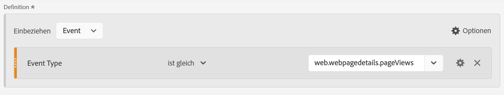
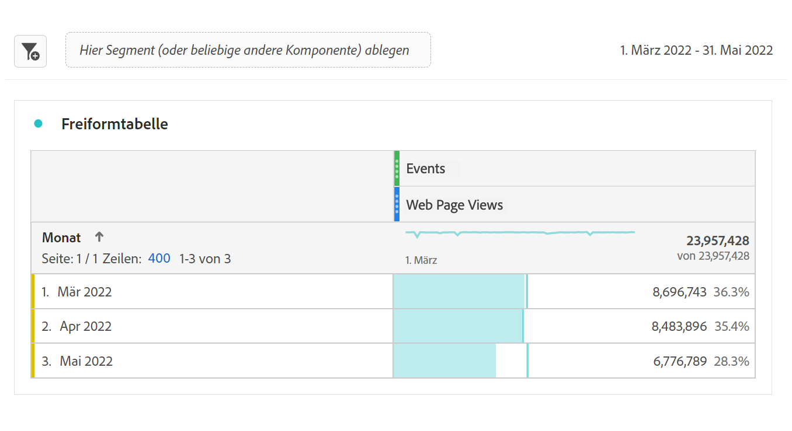
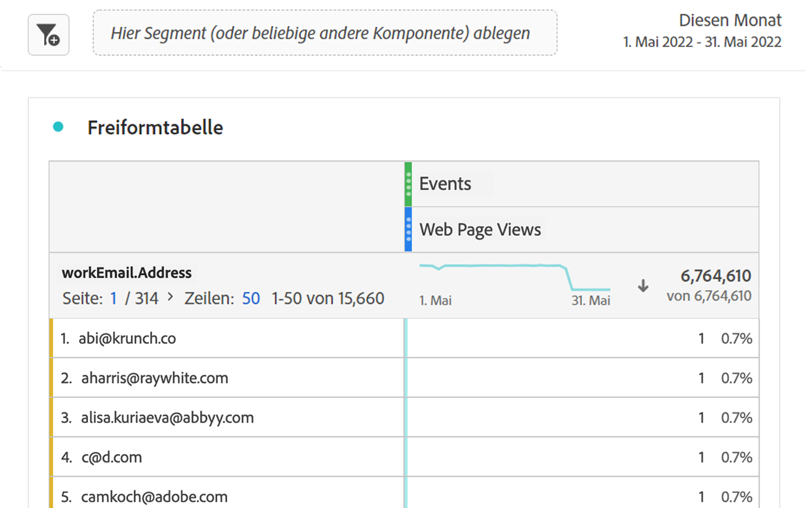

# Bericht zu Marketo Engage-Daten

Sie können verfügbare Marketo Engage-Datensätze in Experience Platform nutzen, um B2B-Marketing-Experten wertvolle Analyse- und Reporting-Lösungen bereitzustellen. Danach können Sie einen Bericht zu diesen Datensätzen in Customer Journey Analytics erstellen.

Beachten Sie Folgendes:

* Marketo Engage-Berichte eignen sich am besten für die Messung und Optimierung von Marketing-Programmen direkt in Marketo und sind schnell, präskriptiv und marketerfreundlich.
* Customer Journey Analytics bietet eine viel breitere, anpassbare Analyselösung für Kunden-Journey, die mehrere Kanäle, Produkte und Geschäftsbereiche umfasst, einschließlich, aber nicht beschränkt auf Marketo-Daten.

Siehe [Berichtsvergleich](#reporting-comparison) für weitere Details.

>[!NOTE]
>
>Sie können die [Customer Journey Analytics B2B edition](/help/getting-started/cja-b2b-edition.md) in Betracht ziehen, um viel mehr Wert aus den Daten von Marketo Engage zu ziehen. Sie können Marketo Engage-Datensätze mit Konto- und Lookup-Datensätzen kombinieren. Und Berichte zur Konto- und Opportunity-Ebene in Customer Journey Analytics B2B edition erstellen.
>

So erstellen Sie Berichte zu Marketo Engage-Daten in Customer Journey Analytics:

+++ &#x200B;1. Zuordnen von Marketo-Quelldatenfeldern zu ihren XDM-Zielen

Ordnen Sie die Objekte [Personen](https://experienceleague.adobe.com/de/docs/experience-platform/sources/connectors/adobe-applications/mapping/marketo) und [Aktivitäten](https://experienceleague.adobe.com/de/docs/experience-platform/sources/connectors/adobe-applications/mapping/marketo) den jeweiligen XDM-Schema-Zielfeldern zu.

+++

+++ &#x200B;2. Aufnehmen von Marketo-Daten in Adobe Experience Platform

Verwenden Sie den [Marketo Engage-Connector](https://experienceleague.adobe.com/de/docs/experience-platform/sources/connectors/adobe-applications/marketo/marketo), um Daten aus Marketo in Experience Platform zu übertragen und mithilfe von Anwendungen, die mit Platform verbunden sind, auf dem neuesten Stand zu halten.

+++

+++ &#x200B;3. Richten Sie eine Verbindung zu diesem Datensatz in Customer Journey Analytics ein

Um Berichte zu Experience Platform-Datensätzen zu erstellen, müssen Sie zunächst eine Verbindung zwischen den Datensätzen in Experience Platform und Customer Journey Analytics herstellen. Siehe [Erstellen oder Bearbeiten einer Verbindung](https://experienceleague.adobe.com/de/docs/analytics-platform/using/cja-connections/create-connection).

+++

+++ &#x200B;4. Eine oder mehrere Datenansichten erstellen

Eine [Datenansicht](/help/data-views/data-views.md) ist ein für Customer Journey Analytics spezifischer Container, mit dem Sie bestimmen können, wie Daten aus einer Verbindung interpretiert werden. Sie enthält alle in Analysis Workspace verfügbaren Dimensionen und Metriken, in diesem Fall für Marketo spezifische Metriken und Dimensionen. Die Datenansicht gibt auch an, aus welchen Spalten diese Dimensionen und Metriken ihre Daten beziehen. Datenansichten werden in Vorbereitung auf das Reporting in Analysis Workspace definiert.

+++

+++ &#x200B;5. Bericht in Analysis Workspace

Ein möglicher Anwendungsfall ist: Wie viele Web-Seitenbesuche durch Leads hatten Sie im April/Juni 2020?

1. Öffnen Sie [Analysis Workspace](/help/analysis-workspace/home.md) und erstellen Sie ein neues Projekt.
Kunden mit B2B/B2P CDP können eine B2C-Analyse in Customer Journey Analytics durchführen. B2B-Objekte sind noch nicht verfügbar.

1. Erstellen Sie [Segment](/help/components/segments/seg-create.md) für Web-Seitenansichten wie folgt: Ereignistyp = web.webpagedetails.pageViews :

   

1. Ziehen Sie das Segment, das Sie erstellt haben, in die Freiformtabelle - Web-Seitenansichten und rufen Sie dann den Datumsbereich „Monat“ ab. Mit dieser Aktion erhalten Sie monatliche Web-Seitenbesuche nach Leads:

   

1. Oder ziehen Sie die folgenden Dimensionen in die Tabelle: Personen-Schlüssel oder geschäftliche E-Mail-Adresse. Mit dieser Aktion erhalten Sie die Web-Seitenbesuche nach Lead:

   

Marketo Engage-Daten in Customer Journey Analytics können sich von denen in den Berichten in Marketo Engage unterscheiden.

+++

## Vergleich von Berichten

Im folgenden Vergleich zwischen Berichten in Customer Journey Analytics und Marketo Engage werden einige wichtige Unterschiede in den Analytics-Funktionen, der Flexibilität, den Wahrheitsquellen und Anwendungsfällen beschrieben.

### Customer Journey Analytics

Customer Journey Analytics ist ein erweitertes Tool zur kanalübergreifenden Analyse, das auf Adobe Experience Platform basiert. Customer Journey Analytics wurde für Unternehmens-Teams entwickelt, die leistungsstarke, flexible und anpassbare Berichte über digitale und Offline-Datenquellen hinweg benötigen.

#### Wichtigste Funktionen

* **Datenquellen**: Kann mehrere Datensätze (Web, CRM, E-Mail, Callcenter, Offline, Marketo usw.) für 360°-Kunden-Journey-Berichte kombinieren.
* **Self-Service-Analyse**: Arbeitsbereich per Drag-and-Drop mit hochgradig interaktiven, anpassbaren Dashboards und Visualisierungen.
* **Erweiterte Attribution**: Unterstützt komplexe, Multi-Touch- und benutzerdefinierte Attributionsmodelle für alle verbundenen Daten, nicht nur für Marketing-Programme.
* **Zielgruppen- und Pfadanalyse**: Detaillierte Segmentierung, Kohorten- und Pfadanalyse in Käufer-Journey.
* **Verwertbare Insights**: Aktiviert die datengesteuerte Orchestrierung (z. B. sendet Insights zurück zu Marketing- oder Personalisierungs-Engines).
* **Enterprise Scale**: Geeignet für Organisationen, die eine Unternehmens-Governance, mehrere Marken und ein hohes Datenvolumen benötigen.

#### Typische Customer Journey Analytics-Anwendungsfälle

* Erweiterte Kunden-Journey-Zuordnung über mehrere Kanäle und Touchpoints hinweg.
* Komplexe Segmentierung und Mischung von Online- und Offline-Daten.
* Benutzerdefinierte KPI-Dashboards für das Reporting auf Führungsebene und für den Betrieb.
* Ganzheitliche Attributionsmodellierung (über digitale oder E-Mail hinaus).

### Marketo Engage

Marketo Engage bietet In-App-Berichte, die sich auf KPIs zur Marketing-Automatisierung, Programm- und Kampagnenmessung und die Analyse der Marketing-Auswirkungen konzentrieren. Alle diese Berichte sind direkt mit Aktivitäten in Marketo verknüpft.

#### Wichtigste Funktionen

* **Native Marketing-**: Standardberichte für E-Mail, Landingpages, Kampagnen, Leads, Opportunities, Pipeline und Umsatzzuordnung (zuerst, zuletzt, Multi-Touch).
* **Advanced BI Analytics (Add-on)**: Erstellen von benutzerdefinierten Berichten mit Drag-and-Drop und Point-and-Click zur Analyse von Programm-/Konto-/Lead-Daten (siehe Übersicht über Advanced BI Analytics).
* **Vordefinierte Dashboards**: Für Kampagnenleistung, Kanaleffektivität und Pipeline-/Umsatzbeitrag.
* **Programm- und Kanalanalyse**: Attribution und ROI speziell für von Marketo verwaltete Journey.
* **Marketing-orientiert**: Konzentriert auf Benutzer, die Transparenz im Marketing-Trichter benötigen: E-Mail-Statistiken, Formulare, intelligente Kampagnen und Auswirkungen auf den Umsatz.

#### Typische Marketo Engage-Anwendungsfälle

* Tracking und Optimierung der E-Mail-, Programm- und Kampagnenleistung.
* Ordnen Sie Leads und Pipelines Marketing-Taktiken zu.
* Überwachen Sie Interaktionstrends und bewerten Sie Leads.
* Teilen Sie Einblicke mit Vertriebs-/Marketing-Teams ohne Data Engineering-Ressourcen.
* Zugriff auf sofort einsatzbereite, marketerfreundliche Berichte.

Unten finden Sie eine kurze Vergleichstabelle zu den Reporting-Funktionen von Marketo Engage und Customer Journey Analytics:

| Funktion | Marketo Engage | Customer Journey Analytics |
|---|---|---|
| **Primärer Fokus** | Marketing-Programm und kampagnenorientierte Berichterstattung. | Ganzheitliches Omni-Channel-Journey und Verhaltensanalysen und Reporting. |
| **Datenquellen** | In und über Marketo Engage generierte Daten. | Kombiniert Daten aus allen Experience Platform-aktivierten Daten, einschließlich Marketo, Website, Mobile App, Offline-Kanälen und mehr. |
| **Attribution** | Einzel- und Multi-Touch-Attribution auf Marketo-Daten. | Benutzerdefinierte, kanalübergreifende Attribution für alle in der Lösung verfügbaren Daten. |
| **Benutzerdefiniertes Reporting und Flexibilität** | Erweitertes BI (Add-on) für umfassende Einblicke in Programme und Konten. | Hohe Flexibilität beim Erstellen von benutzerdefinierten Arbeitsbereichen, Dashboards oder Berichten mit allen verfügbaren Daten. |
| **Zielgruppenanalyse** | Filtern und Segmentieren von Programmlisten, Interaktionen und Smart-Listen. | Umfangreiche Persona- und Journey-Visualisierungen, Zielgruppenpfade und Segmentüberschneidungsanalysen. |
| **Vorgesehene Benutzer** | Marketingexperten, Marketing-Operatoren, Nachfrager, Umsatzverantwortliche. | Analysten, Datenwissenschaftler, Marketing-Strategen, Fachleute für Kundenerlebnisse. |
| **Deduplizierung einer Metrik** | Bei E-Mail-Leistungsberichten werden Metriken automatisch nach Lead-ID, Kampagnen-ID und E-Mail-Asset-ID dedupliziert. Wenn mehrere E-Mails aus demselben E-Mail-Asset erstellt und vom selben Programm an denselben Lead gesendet werden, werden diese E-Mails nur als eine gezählt. | Ohne zusätzliche Filter und Metriken werden die E-Mail-Berichtsdaten als Gesamtanzahl der E-Mail-Leistung ohne [Metrikdeduplizierung](/help/data-views/component-settings/metric-deduplication.md) gemeldet. |

{style="table-layout:fixed"}
