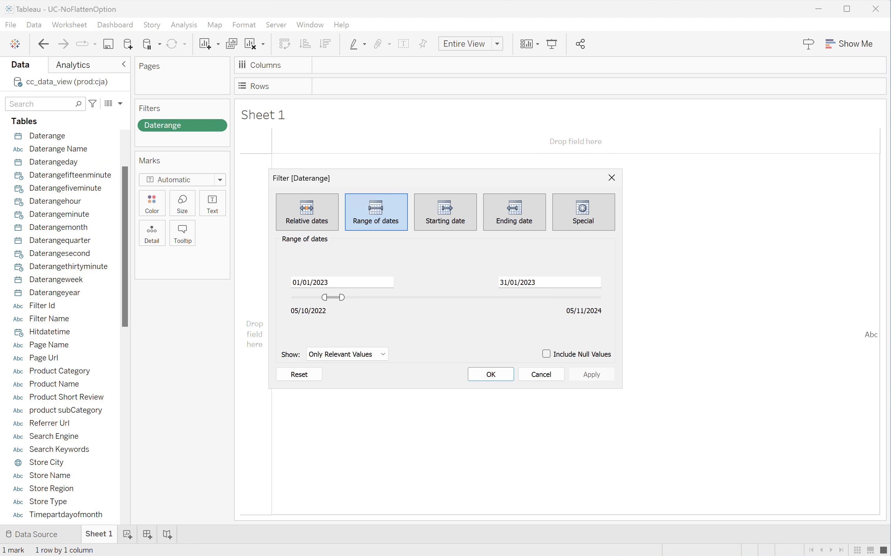
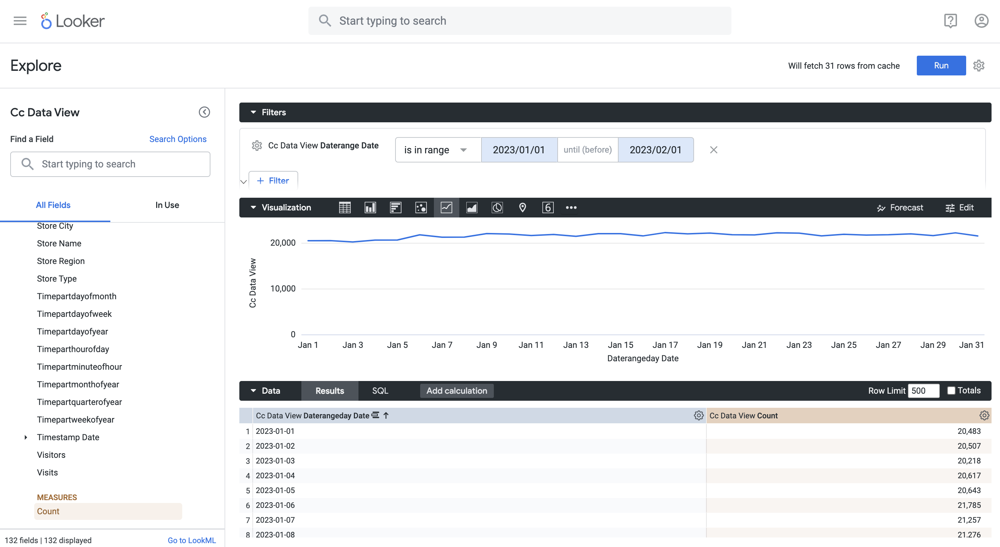
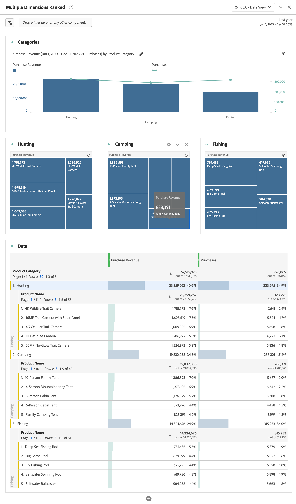
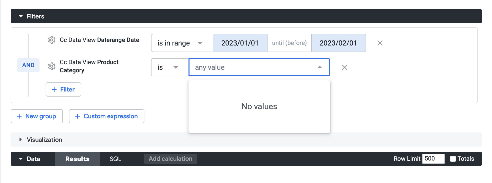

# Anwendungsfälle für BI-Erweiterungen

In diesem Artikel wird beschrieben, wie Sie eine Reihe von Anwendungsfällen mit der Customer Journey Analytics BI-Erweiterung durchführen. In jedem Anwendungsfall wird die Customer Journey Analytics-Funktionalität erläutert, gefolgt von Details zu jedem der unterstützten BI-Tools:

* **Power BI-Desktop**. Die verwendete Version ist 2.137.1102.0 64-Bit (Oktober 2024).
* **Tableau Desktop**. Die verwendete Version ist 2024.1.5 (20241.24.0705.0334) 64-Bit.
* **Looker**. Online-Version 25.0.23, verfügbar über [looker.com](https://looker.com){target="_blank"}

Die folgenden Anwendungsfälle sind dokumentiert:

* **Verbinden**
   * [Verbinden und Auflisten von Datenansichten](#connect-and-validate)

* **Berichte und Analysen**
   * [Täglicher Trend](#daily-trend)
   * [Stündlicher Trend](#hourly-trend)
   * [Monatlicher Trend](#monthly-trend)
   * [Rangfolge einzelner Dimensionen](#single-dimension-ranked)
   * [Rangfolge mehrerer Dimensionen](#multiple-dimension-ranked)
   * [Unterschiedliche Dimensionswerte zählen](#count-distinct-dimension-values)
   * [Verwenden von Datumsbereichsnamen zum Filtern](#use-date-range-names-to-filter)
   * [Filternamen zum Filtern verwenden](#use-filter-names-to-filter)
   * [Verwenden von Dimensionswerten zum Filtern](#use-dimension-values-to-filter)
   * [Sortieren](#sort)
   * [Beschränkungen](#limits)

* **verstehen**

   * [Transformationen](#transformations)
   * [Visualisierungen](#visualizations)
   * [Einschränkungen](#caveats)

Der Anwendungsfall **connect** konzentriert sich auf die Verbindung von BI-Tools mithilfe der Customer Journey Analytics BI-Erweiterung.

Die Anwendungsfälle **Bericht und**) geben Hinweise, wie ähnliche Customer Journey Analytics-Visualisierungen in den derzeit unterstützten BI-Tools durchgeführt werden können.

Die **verstehen**-Anwendungsfälle bieten weitere Details zu:

* Umwandlungen, die auftreten, wenn Sie BI-Tools für Berichte und Analysen verwenden.
* Visualisierungsähnlichkeiten und -unterschiede zwischen Customer Journey Analytics- und BI-Tools.
* Einschränkungen der einzelnen BI-Tools, die Sie beachten sollten.


## Verbinden und validieren

In diesem Anwendungsbeispiel wird die Verbindung des BI-Tools mit Customer Journey Analytics eingerichtet, die verfügbaren Datenansichten aufgelistet und eine zu verwendende Datenansicht ausgewählt.

+++ Customer Journey Analytics

Die Anweisungen beziehen sich auf eine Beispielumgebung mit den folgenden Objekten:

* Datenansicht: **[!UICONTROL C&amp;C - Datenansicht]** ??.
* Dimensionen: **[!UICONTROL Produktname]** ?? und **[!UICONTROL Produktkategorie]** ??.
* Metriken: **[!UICONTROL Kaufumsatz]** ?? und **[!UICONTROL Käufe]** ??.
* Filter: **[!UICONTROL Fischereierzeugnisse]** ??.

{zoomable="yes"}

Ersetzen Sie diese Beispielobjekte durch Objekte, die für Ihre spezifische Umgebung geeignet sind, wenn Sie die Anwendungsfälle durchlaufen.

+++

+++ BI-Tools

>[!BEGINTABS]

>[!TAB Power BI Desktop]

1. Greifen Sie über die Benutzeroberfläche des Abfrage-Service von Experience Platform auf die erforderlichen Anmeldeinformationen und Parameter zu.

   1. Navigieren Sie zu Ihrer Experience Platform-Sandbox.
   1. Wählen Sie  **[!UICONTROL Abfragen]** in der linken Leiste aus.
   1. Wählen Sie **[!UICONTROL Registerkarte]** Anmeldeinformationen“ in der Benutzeroberfläche **[!UICONTROL Abfragen]** aus.
   1. Wählen Sie `prod:cja` aus dem Dropdown **[!UICONTROL Menü &quot;]**&quot;.

      {zoomable="yes"}

1. Starten Sie Power BI Desktop.
   1. Wählen Sie in der Hauptbenutzeroberfläche **[!UICONTROL Daten aus anderen Quellen abrufen]**.
   1. Im Dialogfeld **[!UICONTROL Daten abrufen]**:
      {zoomable="yes"}
      1. Suchen Sie nach (PostgreSQL **[!UICONTROL Datenbank) und wählen Sie]** aus.
      1. Wählen Sie **[!UICONTROL Verbinden]** aus.
   1. Im Dialogfeld **[!UICONTROL PostgreSQL-Datenbank]**:
      {zoomable="yes"}
      1. Verwenden Sie , um die Werte **[!UICONTROL Host]** und **[!UICONTROL Port]** aus dem Bedienfeld Experience Platform **** Abfrage **[!UICONTROL Ablaufende Anmeldeinformationen]** zu kopieren und einzufügen, getrennt durch `:` als Wert für **[!UICONTROL Server]**. Beispiel: `examplecompany.platform-query.adobe.io:80`.
      1. Verwenden Sie , um den **[!UICONTROL Datenbank]**-Wert aus dem Bedienfeld **[!UICONTROL Abfrage]** **[!UICONTROL Ablaufende Anmeldedaten]** von Experience Platform zu kopieren. Fügen Sie `?FLATTEN` zum eingefügten Wert hinzu. Zum Beispiel `prod:cja?FLATTEN`.
      1. Wählen Sie **[!UICONTROL DirectQuery]** als **[!UICONTROL Datenkonnektivitätsmodus]** aus.
      1. Klicken Sie **[!UICONTROL OK]**.
   1. Im Dialogfeld **[!UICONTROL PostgreSQL-Datenbank]** - **[!UICONTROL Datenbank]**:
      {zoomable="yes"}
      1. Verwenden Sie , um die Werte **[!UICONTROL Benutzername]** und **[!UICONTROL Kennwort]** aus dem Bedienfeld &quot;**** Abfrage **[!UICONTROL Ablaufende Anmeldeinformationen]** von Experience Platform in die Felder **[!UICONTROL Benutzername]** und **[!UICONTROL Kennwort]** zu kopieren. Wenn Sie eine [nicht ablaufende Berechtigung](https://experienceleague.adobe.com/en/docs/experience-platform/query/ui/credentials?lang=en#use-credential-to-connect) verwenden, verwenden Sie das Kennwort Ihrer nicht ablaufenden Berechtigung.
      1. Stellen Sie sicher, dass das Dropdown-Menü für **[!UICONTROL Wählen Sie, auf welche Ebene diese Einstellungen angewendet werden sollen]** auf den **[!UICONTROL Server]** eingestellt ist, den Sie zuvor definiert haben.
      1. Wählen Sie **[!UICONTROL Verbinden]** aus.
   1. Im **[!UICONTROL Navigator]** werden die Datenansichten abgerufen. Dieser Abruf kann einige Zeit dauern. Nach dem Abrufen sehen Sie Folgendes in Power BI Desktop.
      {zoomable="yes"}
      1. Wählen **[!UICONTROL public.cc_data_view]** aus der Liste im linken Bereich aus.
      1. Es gibt zwei Optionen:
         1. Wählen Sie **[!UICONTROL Laden]** aus, um fortzufahren und die Einrichtung abzuschließen.
         1. Wählen Sie **[!UICONTROL Daten transformieren]** aus. Es wird ein Dialogfeld angezeigt, in dem Sie im Rahmen der Konfiguration optional Umwandlungen anwenden können.
            {zoomable="yes"}
            * Wählen Sie **[!UICONTROL Schließen und anwenden]** aus.
   1. Nach einiger Zeit wird **[!UICONTROL public.cc_data_view]** im Bereich **[!UICONTROL Daten]** angezeigt. Wählen Sie  aus, um Dimensionen und Metriken anzuzeigen.
      {zoomable="yes"}


### REDUZIEREN

Power BI Desktop unterstützt die folgenden Szenarien für den `FLATTEN`. Weitere Informationen [ Sie unter „Reduzieren ](https://experienceleague.adobe.com/en/docs/experience-platform/query/key-concepts/flatten-nested-data) verschachtelten Daten“.

| FLATTEN-Parameter | Beispiel | Unterstützt | Bemerkungen |
|---|---|:---:|---|
| Keine | `prod:cja` |  | |
| `?FLATTEN` | `prod:cja?FLATTEN` |  | **Empfohlene Option zum Verwenden!** |
| `%3FFLATTEN` | `prod:cja%3FFLATTEN` |  | Power BI Desktop zeigt folgenden Fehler an: **[!UICONTROL Wir konnten uns mit den angegebenen Anmeldeinformationen nicht authentifizieren. Bitte erneut versuchen.]** |

### Weitere Informationen

* [Voraussetzungen](/help/data-views/bi-extension.md#prerequisites)
* [Handbuch zu Anmeldeinformationen](https://experienceleague.adobe.com/en/docs/experience-platform/query/ui/credentials)
* [Verbinden von Power BI mit dem Abfrage-Service](https://experienceleague.adobe.com/en/docs/experience-platform/query/clients/power-bi).


>[!TAB Tableau Desktop]

1. Greifen Sie über die Benutzeroberfläche des Abfrage-Service von Experience Platform auf die erforderlichen Anmeldeinformationen und Parameter zu.

   1. Navigieren Sie zu Ihrer Experience Platform-Sandbox.
   1. Wählen Sie  **[!UICONTROL Abfragen]** in der linken Leiste aus.
   1. Wählen Sie **[!UICONTROL Registerkarte]** Anmeldeinformationen“ in der Benutzeroberfläche **[!UICONTROL Abfragen]** aus.
   1. Wählen Sie `prod:cja` aus dem Dropdown **[!UICONTROL Menü &quot;]**&quot;.

      {zoomable="yes"}

1. Tableau starten.
   1. Wählen Sie **[!UICONTROL PostgreSQL]** in der linken Leiste unter „An **[!UICONTROL Server]** aus. Falls nicht verfügbar, wählen Sie **[!UICONTROL Mehr…]** und wählen Sie **[!UICONTROL PostgreSQL]** aus der Liste **[!UICONTROL Installierte Connectoren]**.
      {zoomable="yes"}
   1. Im Dialogfeld **[!UICONTROL PostgreSQL]** auf der Registerkarte **[!UICONTROL Allgemein]**:
      {zoomable="yes"}
      1. Verwenden Sie , um den **[!UICONTROL Host]** aus dem Bedienfeld **[!UICONTROL Abfrage]** **[!UICONTROL Ablaufende Anmeldedaten]** von Experience Platform in den **[!UICONTROL Server]** zu kopieren.
      1. Verwenden Sie , um den **[!UICONTROL Port]** aus dem Bedienfeld **[!UICONTROL Abfrage]** **[!UICONTROL Ablaufende Anmeldedaten]** von Experience Platform in den **[!UICONTROL Port]** zu kopieren.
      1. Verwenden Sie , um den **[!UICONTROL Datenbank]** aus dem Bedienfeld **[!UICONTROL Abfrage]** **[!UICONTROL Ablaufende Anmeldedaten]** von Experience Platform in **[!UICONTROL Datenbank]** zu kopieren. Fügen Sie `%3FFLATTEN` zum eingefügten Wert hinzu. Beispiel: `prod:cja%3FFLATTEN`.
      1. Wählen Sie **[!UICONTROL Benutzername und Kennwort]** aus dem Dropdown **[!UICONTROL Menü]** Authentifizierung“ aus.
      1. Verwenden Sie , um den **[!UICONTROL Benutzernamen]** aus dem Bedienfeld **[!UICONTROL Abfrage]** **[!UICONTROL Ablaufende Anmeldedaten]** von Experience Platform in den **[!UICONTROL Benutzernamen]** zu kopieren.
      1. Verwenden Sie , um das **[!UICONTROL Kennwort]** aus dem Bedienfeld **[!UICONTROL Abfrage]** **[!UICONTROL Ablaufende Anmeldeinformationen]** von Experience Platform in **[!UICONTROL Kennwort]** zu kopieren. Wenn Sie eine [nicht ablaufende Berechtigung](https://experienceleague.adobe.com/en/docs/experience-platform/query/ui/credentials?lang=en#use-credential-to-connect) verwenden, verwenden Sie das Kennwort Ihrer nicht ablaufenden Berechtigung.
      1. Stellen Sie sicher **[!UICONTROL dass „SSL]**&quot; aktiviert ist.
      1. Wählen Sie **[!UICONTROL Anmelden]** aus.

      Während Tableau Desktop **[!UICONTROL Verbindung validiert, wird]** Dialogfeld „Anfrage läuft“ angezeigt.
   1. Im Hauptfenster sehen Sie auf der Seite **[!UICONTROL Data Source]** im linken Bereich:
      * Der Name der Verbindung, unterhalb von **[!UICONTROL Verbindungen]**.
      * Der Name der Datenbank unter **[!UICONTROL Datenbank]**.
      * Eine Liste von Tabellen unter **[!UICONTROL Tabelle]**.
        {zoomable="yes"}
      1. Ziehen Sie den Eintrag **[!UICONTROL cc_data_view]** und legen Sie ihn in der Hauptansicht mit dem Text **[!UICONTROL Tabellen ziehen]** ab.
   1. Das Hauptfenster zeigt Details der Datenansicht **[!UICONTROL cc_data_view]** an.
      {zoomable="yes"}

### REDUZIEREN

Tableau Desktop unterstützt die folgenden Szenarien für den `FLATTEN`. Weitere Informationen [ Sie unter „Reduzieren ](https://experienceleague.adobe.com/en/docs/experience-platform/query/key-concepts/flatten-nested-data) verschachtelten Daten“.

| FLATTEN-Parameter | Beispiel | Unterstützt | Bemerkungen |
|---|---|:---:|---|
| Keine | `prod:cja` |  | |
| `?FLATTEN` | `prod:cja?FLATTEN` |  | |
| `%3FFLATTEN` | `prod:cja%3FFLATTEN` |  | **Empfohlene Option zum Verwenden**. Hinweis: `%3FFLATTEN` ist eine URL-codierte Version von `?FLATTEN`. |

### Weitere Informationen

* [Voraussetzungen](/help/data-views/bi-extension.md#prerequisites)
* [Handbuch zu Anmeldeinformationen](https://experienceleague.adobe.com/en/docs/experience-platform/query/ui/credentials)
* [Verbinden von Tableau Desktop mit dem Abfrage-Service](https://experienceleague.adobe.com/en/docs/experience-platform/query/clients/tableau).


>[!TAB Looker]

1. Greifen Sie über die Benutzeroberfläche des Abfrage-Service von Experience Platform auf die erforderlichen Anmeldeinformationen und Parameter zu.

   1. Navigieren Sie zu Ihrer Experience Platform-Sandbox.
   1. Wählen Sie  **[!UICONTROL Abfragen]** in der linken Leiste aus.
   1. Wählen Sie **[!UICONTROL Registerkarte]** Anmeldeinformationen“ in der Benutzeroberfläche **[!UICONTROL Abfragen]** aus.
   1. Wählen Sie `prod:cja` aus dem Dropdown **[!UICONTROL Menü &quot;]**&quot;.

      {zoomable="yes"}

1. Bei Looker anmelden

   1. Wählen **[!UICONTROL Admin]** in der linken Leiste aus.
   1. Wählen Sie **[!UICONTROL Verbindungen]** aus.
   1. Wählen Sie **[!UICONTROL Verbindung hinzufügen]** aus.
   1. Im Bildschirm **[!UICONTROL Datenbank mit Looker verbinden]**.

      {zoomable="yes"}

      1. Geben Sie einen **[!UICONTROL Namen]** für Ihre Verbindung ein, z. B. `Example Looker Connection`.
      1. Stellen Sie sicher **[!UICONTROL dass]** Alle Projekte“ als &quot;**[!UICONTROL &quot; ausgewählt]**.
      1. Wählen Sie **[!UICONTROL PostgreSQL 9.5+]** als Dialekt aus.
      1. Verwenden Sie , um den **[!UICONTROL Host]**-Wert aus dem Bedienfeld **[!UICONTROL Abfrage]** **[!UICONTROL Ablaufende Anmeldedaten]** von Experience Platform als Wert für **[!UICONTROL Host]** zu kopieren. Beispiel: `examplecompany.platform-query.adobe.io`.
      1. Verwenden Sie , um den **[!UICONTROL Port]**-Wert aus dem Bedienfeld **[!UICONTROL Abfrage]** **[!UICONTROL Ablaufende Anmeldedaten]** von Experience Platform als Wert für **[!UICONTROL Port]** zu kopieren. Beispiel: `80`.
      1. Verwenden Sie , um den **[!UICONTROL Datenbank]**-Wert aus dem Bedienfeld **[!UICONTROL Abfrage]** **[!UICONTROL Ablaufende Anmeldedaten]** von Experience Platform als Wert für **[!UICONTROL Datenbank]** zu kopieren. Fügen Sie `?FLATTEN` zum eingefügten Wert hinzu. Zum Beispiel `prod:cja?FLATTEN`.
      1. Verwenden Sie , um den Wert **[!UICONTROL Benutzername]** aus dem Bedienfeld **[!UICONTROL Abfrage]** **[!UICONTROL Ablaufende Anmeldeinformationen]** von Experience Platform als Wert für **[!UICONTROL Benutzername]** zu kopieren.
      1. Verwenden Sie , um den **[!UICONTROL Kennwort]**-Wert aus dem Bedienfeld **[!UICONTROL Abfrage]** **[!UICONTROL Ablaufende Anmeldeinformationen]** von Experience Platform als Wert für **[!UICONTROL Kennwort]** zu kopieren.
      1. Wählen Sie **[!UICONTROL Alle erweitern]** unter **[!UICONTROL Optionale Einstellungen]** aus.
      1. Legen Sie **[!UICONTROL Max. Verbindungen]** pro Knoten auf `5` fest.
      1. Stellen Sie sicher **[!UICONTROL dass &quot;]**&quot; aktiviert ist.
      1. Wählen Sie **[!UICONTROL Test]** aus, um die Verbindung zu testen. Oben im Bildschirm sollte ein Banner mit einer Meldung wie **[!UICONTROL Erfolg, kann JDBC verbinden ….]** erscheinen.
      1. Wählen Sie **[!UICONTROL Verbinden]** aus, um die Verbindung herzustellen und zu speichern.
   1. Die neue Verbindung wird in der Benutzeroberfläche **[!UICONTROL Verbindungen]** angezeigt.
   1. Wählen Sie **←** von **[!UICONTROL Admin]** aus, um zur Hauptnavigation in der linken Leiste zu wechseln.
   1. Wählen Sie **[!UICONTROL Entwickeln]** aus.
   1. Wählen Sie **[!UICONTROL Projekte]** aus.
   1. Wählen Sie **[!UICONTROL Neues Modell]** in LookML-Projekten aus.
   1. So stellen Sie sicher, dass Sie keine Auswirkungen auf andere Benutzende haben. Wählen Sie bei Aufforderung Entwicklungsmodus aktivieren aus.
   1. Im Erlebnis **[!UICONTROL Modell erstellen]**:
      1. Wählen Sie **[!UICONTROL Datenbankverbindung aus]**:
         1. Wählen Sie Ihre Datenbankverbindung unter **[!UICONTROL Datenbankverbindung auswählen]** aus. Beispiel: **[!UICONTROL example_looker_connection]**.
         1. Benennen Sie Ihr Projekt in **[!UICONTROL Neues LookML-Projekt für dieses Modell erstellen]**. Für `example: example_looker_project`.
         1. Klicken Sie auf **[!UICONTROL Weiter]**.
      1. Wählen Sie in **[!UICONTROL Tabellen aus]**:
         1. Wählen Sie **[!UICONTROL öffentlich]** und stellen Sie sicher, dass Ihre Customer Journey Analytics-Datenansicht ausgewählt ist. Beispiel:  **[!UICONTROL cc_data_view]**.
         1. Klicken Sie auf **[!UICONTROL Weiter]**.
      1. Wählen Sie **[!UICONTROL Primäre Schlüssel aus]**:
         1. Klicken Sie auf **[!UICONTROL Weiter]**.
      1. Wählen Sie in **[!UICONTROL die zu erstellenden Explorer aus]**:
         1. Stellen Sie sicher, dass Sie Ihre Ansicht auswählen. Beispiel: **[!UICONTROL cc_data_view.view]**.
         1. Klicken Sie auf **[!UICONTROL Weiter]**.
      1. Geben Sie **[!UICONTROL ➎ Modellnamen ein]**:
         1. Benennen Sie Ihr Modell. Beispiel: `example_looker_model`.
      1. Wählen Sie **[!UICONTROL Vervollständigen und Daten erkunden]**.

   Sie werden zur Benutzeroberfläche **[!UICONTROL Erkunden]** von Looker weitergeleitet, die bereit ist, die Daten zu untersuchen.


### REDUZIEREN

Looker unterstützt die folgenden Szenarien für den `FLATTEN`. Weitere Informationen [ Sie unter „Reduzieren ](https://experienceleague.adobe.com/en/docs/experience-platform/query/key-concepts/flatten-nested-data) verschachtelten Daten“.

| FLATTEN-Parameter | Beispiel | Unterstützt | Bemerkungen |
|---|---|:---:|---|
| Keine | `prod:cja` |  | |
| `?FLATTEN` | `prod:cja?FLATTEN` |  | |
| `%3FFLATTEN` | `prod:cja%3FFLATTEN` |  | **Empfohlene Option zum Verwenden**. Hinweis: `%3FFLATTEN` ist eine URL-codierte Version von `?FLATTEN`. |

### Weitere Informationen

* [Voraussetzungen](/help/data-views/bi-extension.md#prerequisites)
* [Handbuch zu Anmeldeinformationen](https://experienceleague.adobe.com/en/docs/experience-platform/query/ui/credentials)

>[!ENDTABS]

+++


## Täglicher Trend

In diesem Anwendungsbeispiel möchten Sie eine Tabelle und eine einfache Linienvisualisierung anzeigen, die einen täglichen Trend der Vorfälle (Ereignisse) vom 1. Januar 2023 bis zum 31. Januar 2023 zeigt.

+++ Customer Journey Analytics

Ein Beispiel **[!UICONTROL Bedienfeld]** Täglicher Trend“ für den Anwendungsfall:

Bedienfeld „Täglicher Trend“ für {zoomable="yes"}

+++

+++ BI-Tools

>[!PREREQUISITES]
>
>Stellen Sie sicher, dass Sie eine [erfolgreiche Verbindung“ validiert haben und Datenansichten für ](#connect-and-validate) BI-Tool auflisten und verwenden können, für das Sie diesen Anwendungsfall ausprobieren möchten.
>

>[!BEGINTABS]

>[!TAB Power BI Desktop]

1. Im Bereich **[!UICONTROL Daten]**:
   1. Wählen Sie **[!UICONTROL daterangeday]** aus.
   1. Wählen Sie **[!UICONTROL ∑ Vorfälle]** aus.

   Es wird eine Tabelle mit den Vorkommen für den aktuellen Monat angezeigt. Zur besseren Sichtbarkeit vergrößern Sie die Visualisierung.

1. Im Bereich **[!UICONTROL Filter]**:

   1. Wählen Sie **[!UICONTROL daterangeday is (All)]** unter **[!UICONTROL Filter auf dieser visuellen]**) aus.
   1. Wählen Sie **[!UICONTROL Erweiterte]**) als **[!UICONTROL Filtertyp]**.
   1. Filter definieren, um **[!UICONTROL Elemente anzuzeigen, wenn der Wert]** **[!UICONTROL auf oder nach]** `1/1/2023` **[!UICONTROL Und****]** liegt, `2/1/2023.` Sie können das Kalendersymbol verwenden, um ein Datum auszuwählen.
   1. Wählen Sie **[!UICONTROL Filter anwenden]** aus.

   Die Tabelle wird mit dem angewendeten Filter **[!UICONTROL daterangeday]** aktualisiert.

1. Wählen **[!UICONTROL Bereich]** Visualisierungen“ die Visualisierung **[!UICONTROL Liniendiagramm]** aus.

   Eine Liniendiagramm-Visualisierung ersetzt die Tabelle, wobei dieselben Daten wie die Tabelle verwendet werden. Ihr Power BI-Desktop sollte wie folgt aussehen.

   {zoomable="yes"}

1. Visualisierung im Liniendiagramm:

   1. Wählen Sie  aus.
   1. Wählen Sie im Kontextmenü die Option **[!UICONTROL Als Tabelle anzeigen]** aus.

   Die Hauptansicht wird aktualisiert, um sowohl eine Linienvisualisierung als auch eine Tabelle anzuzeigen. Ihr Power BI-Desktop sollte wie folgt aussehen.

   {zoomable="yes"}

>[!TAB Tableau Desktop]

1. Wählen Sie unten **[!UICONTROL Registerkarte Blatt 1]** aus, um aus der Ansicht **[!UICONTROL Datenquelle]** zu wechseln. In der Ansicht **[!UICONTROL Blatt 1]**:
   1. Ziehen Sie den **[!UICONTROL Daterange]** aus der Liste **[!UICONTROL Tabellen]** im Bereich **[!UICONTROL Daten]** und legen Sie den Eintrag auf dem Regal **[!UICONTROL Filter]** ab.
   1. Wählen Sie im Dialogfeld **[!UICONTROL Filterfeld \[Datumsbereich\]]** die Option **[!UICONTROL Datumsbereich]** und wählen Sie **[!UICONTROL Weiter >]**.
   1. Wählen Sie **[!UICONTROL Dialogfeld Filter \[Daterange]]** die Option **[!UICONTROL Datumsbereich]** und geben Sie einen Zeitraum von `01/01/2023` bis `01/02/2023` an.

      {zoomable="yes"}

   1. Ziehen Sie **[!UICONTROL daterangeday]** per Drag-and-Drop aus der Liste **[!UICONTROL Tabellen]** in den Bereich **[!UICONTROL Daten]** und legen Sie den Eintrag im Feld neben **[!UICONTROL Spalten]** ab.
      * Wählen Sie **[!UICONTROL Tag]** aus dem Dropdown **[!UICONTROL Menü daterangeday]** aus, sodass der Wert auf &quot;**[!UICONTROL (daterangeday)]** aktualisiert wird.
   1. Ziehen Sie **[!UICONTROL Vorfälle]** per Drag-and-Drop aus der Liste **[!UICONTROL Tabellen (*Kennzahlennamen*)]** in den Bereich **[!UICONTROL Daten]** und legen Sie den Eintrag im Feld neben **[!UICONTROL Zeilen]** ab. Der Wert wird automatisch in **[!UICONTROL SUM(Occurrences)]** umgewandelt.
   1. Ändern Sie **[!UICONTROL Standard]** im Dropdown-Menü **[!UICONTROL Anpassen]** in der Symbolleiste auf **[!UICONTROL Gesamte]**).

      Ihr Tableau-Desktop sollte wie folgt aussehen.

      {zoomable="yes"}

1. Wählen Sie **[!UICONTROL Duplizieren]** aus dem **[!UICONTROL Blatt 1]** Kontextmenü, um ein zweites Blatt zu erstellen.
1. Wählen Sie **[!UICONTROL Umbenennen]** aus dem Kontextmenü der Registerkarte **[!UICONTROL Blatt 1]**, um das Blatt in `Graph` umzubenennen.
1. Wählen Sie **[!UICONTROL Umbenennen]** aus dem Kontextmenü der Registerkarte **[!UICONTROL Blatt 1 (2)]** aus, um das Blatt in `Data` umzubenennen.
1. Stellen Sie sicher, dass **[!UICONTROL Daten]**-Blatt ausgewählt ist. In der **[!UICONTROL Daten]** Ansicht:
   1. Wählen Sie **[!UICONTROL oben]** die Option „Anzeigen“ aus und wählen Sie **[!UICONTROL Texttabelle]** (Visualisierung oben links) aus, um den Inhalt der Datenansicht in eine Tabelle zu ändern.
   1. Wählen Sie **[!UICONTROL Zeilen und Spalten austauschen]** in der Symbolleiste aus.
   1. Ändern Sie **[!UICONTROL Standard]** im Dropdown-Menü **[!UICONTROL Anpassen]** in der Symbolleiste auf **[!UICONTROL Gesamte]**).

      Ihr Tableau-Desktop sollte wie folgt aussehen.

      {zoomable="yes"}

1. Klicken Sie auf **[!UICONTROL Schaltfläche]** Neues Dashboard“ unten, um eine neue Ansicht **[!UICONTROL Dashboard 1]** zu erstellen. In der Ansicht **[!UICONTROL Dashboard 1]**:
   1. Ziehen Sie das Blatt **[!UICONTROL Graph]** aus dem **[!UICONTROL Blätter]**-Regal auf die Ansicht **[!UICONTROL Dashboard 1]** mit dem Titel *Blätter hier ablegen*.
   1. Ziehen Sie das **[!UICONTROL Daten]**-Blatt aus dem **[!UICONTROL Blätter]**-Regal unter das **[!UICONTROL Diagramm]**-Blatt auf die Ansicht **[!UICONTROL Dashboard 1]**.
   1. Wählen Sie das **[!UICONTROL Daten]**-Blatt in der Ansicht aus und ändern Sie **[!UICONTROL Gesamte Ansicht]** so **[!UICONTROL Breite festlegen]**.

      Ihr Tableau-Desktop sollte wie folgt aussehen.

      {zoomable="yes"}


>[!TAB Looker]

1. Achten Sie in der **[!UICONTROL Explore]**-Oberfläche von Looker darauf, dass Sie über ein sauberes Setup verfügen. Wenn nicht, wählen Sie  **[!UICONTROL Felder und Filter entfernen]**.
1. Wählen Sie **[!UICONTROL + Filter]** unter **[!UICONTROL Filter]** aus.
1. Im Dialogfeld **[!UICONTROL Filter hinzufügen]**:
   1. Wählen Sie **[!UICONTROL ‣ CC-Datenansicht]**
   1. Wählen Sie aus der Liste der Felder **[!UICONTROL ‣ DateRange]** und **[!UICONTROL DateRange]** aus.
      {zoomable="yes"}
1. Geben Sie den Filter **[!UICONTROL CC Datenansicht Datumsbereich]** als **[!UICONTROL liegt im Bereich]** **[!UICONTROL 2023/01/]****[!UICONTROL bis (davor)]** **[!UICONTROL 2023/02/01]** an.
1. Im Abschnitt **[!UICONTROL CC-Datenansicht]** in der linken Leiste
   1. Wählen Sie **[!UICONTROL ‣ Datumsbereich]** und dann **[!UICONTROL Datum]** aus der Liste **[!UICONTROL DIMENSIONEN]** aus.
   1. Wählen Sie **[!UICONTROL Count]** unter **[!UICONTROL MEASURES]** in der linken Leiste (unten) aus.
1. Wählen Sie **[!UICONTROL Ausführen]** aus.
1. Wählen Sie **[!UICONTROL ‣ Visualisierung]** aus, um die Linienvisualisierung anzuzeigen.

Es sollte eine Visualisierung und eine Tabelle ähnlich wie unten dargestellt angezeigt werden.

{zoomable="yes"}

>[!ENDTABS]

+++


## Stündlicher Trend

In diesem Anwendungsbeispiel möchten Sie eine Tabelle und eine einfache Linienvisualisierung anzeigen, die einen stündlichen Trend der Vorfälle (Ereignisse) für den 1. Januar 2023 anzeigt.

+++ Customer Journey Analytics

Ein Beispiel **[!UICONTROL Bedienfeld „Stündlicher]**&quot; für den Anwendungsfall:

{zoomable="yes"}

+++

+++ BI-Tools

>[!PREREQUISITES]
>
>Stellen Sie sicher, [ Sie für das BI-Tool, für das Sie diesen Anwendungsfall ausprobieren möchten, (eine erfolgreiche Verbindung, Datenansichten auflisten ](#connect-and-validate) eine Datenansicht verwenden) validiert haben.
>

>[!BEGINTABS]

>[!TAB Power BI Desktop]

 Power BI versteht **nicht** wie Datums-/Uhrzeitfelder verarbeitet werden, sodass Dimensionen wie **[!UICONTROL daterangehour]** und **[!UICONTROL daterangeminute]** nicht unterstützt werden.

>[!TAB Tableau Desktop]

1. Wählen Sie unten **[!UICONTROL Registerkarte Blatt 1]** aus, um aus **[!UICONTROL Datenquelle]** zu wechseln. In der Ansicht **[!UICONTROL Blatt 1]**:
   1. Ziehen Sie den **[!UICONTROL Daterange]** aus der Liste **[!UICONTROL Tabellen]** im Bereich **[!UICONTROL Daten]** und legen Sie den Eintrag auf dem Regal **[!UICONTROL Filter]** ab.
   1. Wählen Sie im Dialogfeld **[!UICONTROL Filterfeld \[Datumsbereich\]]** die Option **[!UICONTROL Datumsbereich]** und wählen Sie **[!UICONTROL Weiter >]**.
   1. Wählen Sie **[!UICONTROL Dialogfeld Filter \[Daterange]]** die Option **[!UICONTROL Datumsbereich]** und geben Sie einen Zeitraum von `01/01/2023` bis `02/01/2023` an.

      {zoomable="yes"}

   1. Ziehen Sie **[!UICONTROL daterangehour]** per Drag-and-Drop aus der Liste **[!UICONTROL Tabellen]** in den Bereich **[!UICONTROL Daten]** und legen Sie den Eintrag im Feld neben **[!UICONTROL Spalten]** ab.
      * Wählen Sie **[!UICONTROL Mehr]** > **[!UICONTROL Stunden]** aus dem **[!UICONTROL daterangeday]** Dropdown-Menü aus, sodass der Wert auf **[!UICONTROL HOUR(daterangeday)]** aktualisiert wird.
   1. Ziehen Sie **[!UICONTROL Vorfälle]** per Drag-and-Drop aus der Liste **[!UICONTROL Tabellen (*Kennzahlennamen*)]** in den Bereich **[!UICONTROL Daten]** und legen Sie den Eintrag im Feld neben **[!UICONTROL Zeilen]** ab. Der Wert wird automatisch in **[!UICONTROL SUM(Occurrences)]** umgewandelt.
   1. Ändern Sie **[!UICONTROL Standard]** im Dropdown-Menü **[!UICONTROL Anpassen]** in der Symbolleiste auf **[!UICONTROL Gesamte]**).

      Ihr Tableau-Desktop sollte wie folgt aussehen.

      {zoomable="yes"}

1. Wählen Sie **[!UICONTROL Duplizieren]** aus dem **[!UICONTROL Blatt 1]** Kontextmenü, um ein zweites Blatt zu erstellen.
1. Wählen Sie **[!UICONTROL Umbenennen]** aus dem Kontextmenü der Registerkarte **[!UICONTROL Blatt 1]**, um das Blatt in `Graph` umzubenennen.
1. Wählen Sie **[!UICONTROL Umbenennen]** aus dem Kontextmenü der Registerkarte **[!UICONTROL Blatt 1 (2)]** aus, um das Blatt in `Data` umzubenennen.
1. Stellen Sie sicher, dass **[!UICONTROL Daten]**-Blatt ausgewählt ist. In der **[!UICONTROL Daten]** Ansicht:
   1. Wählen Sie **[!UICONTROL oben]** die Option „Anzeigen“ aus und wählen Sie **[!UICONTROL Texttabelle]** (Visualisierung oben links) aus, um den Inhalt der Datenansicht in eine Tabelle zu ändern.
   1. Ziehen Sie **[!UICONTROL HOUR(DateRangeDay)]** von **[!UICONTROL Columns]** nach **[!UICONTROL Rows]**.
   1. Ändern Sie **[!UICONTROL Standard]** im Dropdown-Menü **[!UICONTROL Anpassen]** in der Symbolleiste auf **[!UICONTROL Gesamte]**).

      Ihr Tableau-Desktop sollte wie folgt aussehen.

      {zoomable="yes"}

1. Wählen Sie **[!UICONTROL Schaltfläche]** Neues Dashboard) unten aus, um eine neue Ansicht **[!UICONTROL Dashboard 1]** zu erstellen. In der Ansicht **[!UICONTROL Dashboard 1]**:
   1. Ziehen Sie das Blatt **[!UICONTROL Graph]** aus dem **[!UICONTROL Blätter]**-Regal auf die Ansicht **[!UICONTROL Dashboard 1]** mit dem Titel *Blätter hier ablegen*.
   1. Ziehen Sie das **[!UICONTROL Daten]**-Blatt aus dem **[!UICONTROL Blätter]**-Regal unter das **[!UICONTROL Diagramm]**-Blatt auf die Ansicht **[!UICONTROL Dashboard 1]**.
   1. Wählen Sie das **[!UICONTROL Daten]**-Blatt in der Ansicht aus und ändern Sie **[!UICONTROL Gesamte Ansicht]** so **[!UICONTROL Breite festlegen]**.

      Ihre Ansicht **[!UICONTROL Dashboard 1]** sollte wie folgt aussehen.

      {zoomable="yes"}


>[!TAB Looker]


1. Achten Sie in der **[!UICONTROL Explore]**-Oberfläche von Looker darauf, dass Sie über ein sauberes Setup verfügen. Wenn nicht, wählen Sie  **[!UICONTROL Felder und Filter entfernen]**.
1. Wählen Sie **[!UICONTROL + Filter]** unter **[!UICONTROL Filter]** aus.
1. Im Dialogfeld **[!UICONTROL Filter hinzufügen]**:
   1. Wählen Sie **[!UICONTROL ‣ CC-Datenansicht]**
   1. Wählen Sie aus der Liste der Felder **[!UICONTROL ‣ DateRange]** und **[!UICONTROL DateRange]** aus.
      {zoomable="yes"}
1. Geben Sie den Filter **[!UICONTROL CC Datenansicht Datumsbereich]** als **[!UICONTROL liegt im Bereich]** **[!UICONTROL 2023/01/01]****[!UICONTROL bis (davor)]** **[!UICONTROL 2023/01/02]** an.
1. Im Abschnitt **[!UICONTROL CC-Datenansicht]** in der linken Leiste
   1. Wählen Sie **[!UICONTROL ‣ DateRangeHour]** und **[!UICONTROL Time]** aus der Liste **[!UICONTROL DIMENSIONS]** aus.
   1. Wählen Sie **[!UICONTROL Count]** unter **[!UICONTROL MEASURES]** in der linken Leiste (unten) aus.
1. Wählen Sie **[!UICONTROL Ausführen]** aus.
1. Wählen Sie **[!UICONTROL ‣ Visualisierung]** aus, um die Linienvisualisierung anzuzeigen.

Es sollte eine Visualisierung und eine Tabelle ähnlich wie unten dargestellt angezeigt werden.

{zoomable="yes"}

>[!ENDTABS]

+++


## Monatlicher Trend

In diesem Anwendungsbeispiel möchten Sie eine Tabelle und eine einfache Linienvisualisierung anzeigen, die einen monatlichen Trend des Vorkommens (Ereignisse) für 2023 zeigt.

+++ Customer Journey Analytics

Ein Beispiel **[!UICONTROL Bedienfeld &quot;]** Trend“ für den Anwendungsfall:

Visualisierung des monatlichen Customer Journey Analytics-Trends {zoomable="yes"}

+++

+++ BI-Tools

>[!PREREQUISITES]
>
>Stellen Sie sicher, [ Sie für das BI-Tool, für das Sie diesen Anwendungsfall ausprobieren möchten, (eine erfolgreiche Verbindung, Datenansichten auflisten ](#connect-and-validate) eine Datenansicht verwenden) validiert haben.
>

>[!BEGINTABS]

>[!TAB Power BI Desktop]

1. Im Bereich **[!UICONTROL Daten]**:
   1. Wählen Sie **[!UICONTROL daterangemonth]** aus.
   1. Wählen Sie **[!UICONTROL ∑ Vorfälle]** aus.

   Es wird eine Tabelle mit den Vorkommen für den aktuellen Monat angezeigt. Zur besseren Sichtbarkeit vergrößern Sie die Visualisierung.

1. Im Bereich **[!UICONTROL Filter]**:

   1. Wählen Sie **[!UICONTROL daterangemonth is (All)]** unter **[!UICONTROL Filter auf diesem Bild]** aus.
   1. Wählen Sie **[!UICONTROL Erweiterte]**) als **[!UICONTROL Filtertyp]**.
   1. Filter definieren, um **[!UICONTROL Elemente anzuzeigen, wenn der Wert]** **[!UICONTROL auf oder nach]** `1/1/2023` **[!UICONTROL Und****]** liegt, `1/1/2024.` Sie können das Kalendersymbol verwenden, um ein Datum auszuwählen.
   1. Wählen Sie **[!UICONTROL Filter anwenden]** aus.

   Die Tabelle wird mit dem angewendeten Filter **[!UICONTROL daterangemonth“]**.

1. Im Bereich **[!UICONTROL Visualisierungen]**:

   1. Wählen Sie die Visualisierung **[!UICONTROL Liniendiagramm]** aus.

   Eine Liniendiagramm-Visualisierung ersetzt die Tabelle, wobei dieselben Daten wie die Tabelle verwendet werden. Ihr Power BI-Desktop sollte wie folgt aussehen.

   {zoomable="yes"}

1. Visualisierung im Liniendiagramm:

   1. Wählen Sie  aus.
   1. Wählen Sie im Kontextmenü die Option **[!UICONTROL Als Tabelle anzeigen]** aus.

   Die Hauptansicht wird aktualisiert, um sowohl eine Linienvisualisierung als auch eine Tabelle anzuzeigen. Ihr Power BI-Desktop sollte wie folgt aussehen.

   {zoomable="yes"}

>[!TAB Tableau Desktop]

1. Wählen Sie unten **[!UICONTROL Registerkarte Blatt 1]** aus, um aus **[!UICONTROL Datenquelle]** zu wechseln. In der Ansicht **[!UICONTROL Blatt 1]**:
   1. Ziehen Sie den **[!UICONTROL Daterange]** aus der Liste **[!UICONTROL Tabellen]** im Bereich **[!UICONTROL Daten]** und legen Sie den Eintrag auf dem Regal **[!UICONTROL Filter]** ab.
   1. Wählen Sie im Dialogfeld **[!UICONTROL Filterfeld \[Datumsbereich\]]** die Option **[!UICONTROL Datumsbereich]** und wählen Sie **[!UICONTROL Weiter >]**.
   1. Wählen Sie **[!UICONTROL Dialogfeld Filter \[Daterange]]** die Option **[!UICONTROL Datumsbereich]** und geben Sie einen Zeitraum von `01/01/2023` bis `01/01/2024` an.

      {zoomable="yes"}

   1. Ziehen Sie **[!UICONTROL daterangeday]** per Drag-and-Drop aus der Liste **[!UICONTROL Tabellen]** in den Bereich **[!UICONTROL Daten]** und legen Sie den Eintrag im Feld neben **[!UICONTROL Spalten]** ab.
      * Wählen Sie **[!UICONTROL MONTH]** aus dem Dropdown **[!UICONTROL Menü daterangeday]** aus, sodass der Wert auf **[!UICONTROL MONTH(daterangeday)]** aktualisiert wird.
   1. Ziehen Sie **[!UICONTROL Vorfälle]** per Drag-and-Drop aus der Liste **[!UICONTROL Tabellen (*Kennzahlennamen*)]** in den Bereich **[!UICONTROL Daten]** und legen Sie den Eintrag im Feld neben **[!UICONTROL Zeilen]** ab. Der Wert wird automatisch in **[!UICONTROL SUM(Occurrences)]** umgewandelt.
   1. Ändern Sie **[!UICONTROL Standard]** im Dropdown-Menü **[!UICONTROL Anpassen]** in der Symbolleiste auf **[!UICONTROL Gesamte]**).

      Ihr Tableau-Desktop sollte wie folgt aussehen.

      {zoomable="yes"}

1. Wählen Sie **[!UICONTROL Duplizieren]** aus dem **[!UICONTROL Blatt 1]** Kontextmenü, um ein zweites Blatt zu erstellen.
1. Wählen Sie **[!UICONTROL Umbenennen]** aus dem Kontextmenü der Registerkarte **[!UICONTROL Blatt 1]**, um das Blatt in `Graph` umzubenennen.
1. Wählen Sie **[!UICONTROL Umbenennen]** aus dem Kontextmenü der Registerkarte **[!UICONTROL Blatt 1 (2)]** aus, um das Blatt in `Data` umzubenennen.
1. Stellen Sie sicher, dass **[!UICONTROL Daten]**-Blatt ausgewählt ist. In der Datenansicht
   1. Wählen Sie **[!UICONTROL oben]** die Option „Anzeigen“ aus und wählen Sie **[!UICONTROL Texttabelle]** (Visualisierung oben links) aus, um den Inhalt der Datenansicht in eine Tabelle zu ändern.
   1. Ziehen Sie **[!UICONTROL MONTH(daterangeday)]** von **[!UICONTROL Columns]** nach **[!UICONTROL Rows]**.
   1. Ändern Sie **[!UICONTROL Standard]** im Dropdown-Menü **[!UICONTROL Anpassen]** in der Symbolleiste auf **[!UICONTROL Gesamte]**).

      Ihr Tableau-Desktop sollte wie folgt aussehen.

      {zoomable="yes"}

1. Wählen Sie **[!UICONTROL Schaltfläche]** Neues Dashboard) unten aus, um eine neue Ansicht **[!UICONTROL Dashboard 1]** zu erstellen. In der Ansicht **[!UICONTROL Dashboard 1]**:
   1. Ziehen Sie das Blatt **[!UICONTROL Graph]** aus dem **[!UICONTROL Blätter]**-Regal auf die Ansicht **[!UICONTROL Dashboard 1]** mit dem Titel *Blätter hier ablegen*.
   1. Ziehen Sie das **[!UICONTROL Daten]**-Blatt aus dem **[!UICONTROL Blätter]**-Regal unter das **[!UICONTROL Diagramm]**-Blatt auf die Ansicht **[!UICONTROL Dashboard 1]**.
   1. Wählen Sie das **[!UICONTROL Daten]**-Blatt in der Ansicht aus und ändern Sie **[!UICONTROL Gesamte Ansicht]** so **[!UICONTROL Breite festlegen]**.

      Ihr Tableau-Desktop sollte wie folgt aussehen.

      {zoomable="yes"}


>[!TAB Looker]

1. Achten Sie in der **[!UICONTROL Explore]**-Oberfläche von Looker darauf, dass Sie über ein sauberes Setup verfügen. Wenn nicht, wählen Sie  **[!UICONTROL Felder und Filter entfernen]**.
1. Wählen Sie **[!UICONTROL + Filter]** unter **[!UICONTROL Filter]** aus.
1. Im Dialogfeld **[!UICONTROL Filter hinzufügen]**:
   1. Wählen Sie **[!UICONTROL ‣ CC-Datenansicht]**
   1. Wählen Sie aus der Liste der Felder **[!UICONTROL ‣ DateRange]** und **[!UICONTROL DateRange]** aus.
      {zoomable="yes"}
1. Geben Sie den Filter **[!UICONTROL CC Datenansicht Datumsbereich]** als **[!UICONTROL liegt im Bereich]** **[!UICONTROL 2023/01/01]****[!UICONTROL bis (davor)]** **[!UICONTROL 2024/01/01]** an.
1. In der linken **[!UICONTROL CC-Datenansicht]**-Leiste
   1. Wählen Sie **[!UICONTROL ‣ DatumMonat]** und dann **[!UICONTROL Monat]** aus der Liste von **[!UICONTROL DIMENSIONEN]**.
   1. Wählen Sie **[!UICONTROL Count]** unter **[!UICONTROL MEASURES]** in der linken Leiste (unten) aus.
1. Wählen Sie **[!UICONTROL Ausführen]** aus.
1. Wählen Sie **[!UICONTROL ‣ Visualisierung]** aus, um die Linienvisualisierung anzuzeigen.

Es sollte eine Visualisierung und eine Tabelle ähnlich wie unten dargestellt angezeigt werden.

{zoomable="yes"}

>[!ENDTABS]

+++


## Rangfolge einzelner Dimensionen

In diesem Anwendungsbeispiel möchten Sie eine Tabelle und eine einfache Balkenvisualisierung anzeigen, die die Käufe und Käufe von Produktnamen für das Jahr 2023 anzeigt.

+++ Customer Journey Analytics

Ein Beispiel **[!UICONTROL Bedienfeld „Single Dimension Ranked]** für den Anwendungsfall:

Visualisierung mit einer Rangansicht für {zoomable="yes"}
+++

+++ BI-Tools

>[!PREREQUISITES]
>
>Stellen Sie sicher, [ Sie für das BI-Tool, für das Sie diesen Anwendungsfall ausprobieren möchten, (eine erfolgreiche Verbindung, Datenansichten auflisten ](#connect-and-validate) eine Datenansicht verwenden) validiert haben.
>

>[!BEGINTABS]

>[!TAB Power BI Desktop]

1. Im Bereich **[!UICONTROL Daten]**:
   1. Wählen Sie **[!UICONTROL daterange]** aus.
   1. Wählen Sie **[!UICONTROL product_name]** aus.
   1. Wählen Sie **[!UICONTROL ∑ Purchase_Revenue]** aus.
   1. Wählen Sie **[!UICONTROL ∑ Käufe]** aus.

   Eine leere Tabelle wird angezeigt, in der nur die Spaltenüberschriften für das ausgewählte Element angezeigt werden. Zur besseren Sichtbarkeit vergrößern Sie die Visualisierung.

1. Im Bereich **[!UICONTROL Filter]**:

   1. Wählen Sie **[!UICONTROL daterange is (All)]** unter **[!UICONTROL Filter auf dieser visuellen]**) aus.
   1. Wählen Sie **[!UICONTROL Relatives Datum]** als **[!UICONTROL Filtertyp]** aus.
   1. Definieren Sie den Filter für **[!UICONTROL Elemente anzeigen, wenn der Wert]****[!UICONTROL in den letzten]**`1` **[!UICONTROL Kalenderjahren)]**.
   1. Wählen Sie **[!UICONTROL Filter anwenden]** aus.

   Die Tabelle wird mit dem angewendeten Filter &quot;**[!UICONTROL &quot; aktualisiert]**.

1. Im Bereich **[!UICONTROL Visualisierung]**:

   1. Verwenden Sie , um **[!UICONTROL daterange]** aus **[!UICONTROL Columns]** zu entfernen.
   1. Ziehen Sie **[!UICONTROL Summe der Käufe_Umsatz]** per Drag-and-Drop unter **[!UICONTROL Summe der]** in **[!UICONTROL Spalten]**.

1. Visualisierung in der Tabelle:

   1. Wählen Sie **[!UICONTROL Summe aus Purchase_Revenue]**, um die Produktnamen in absteigender Reihenfolge des Bestellumsatzes zu sortieren. Ihr Power BI-Desktop sollte wie folgt aussehen.

   {zoomable="yes"}

1. Im Bereich **[!UICONTROL Filter]**:

   1. Wählen Sie **[!UICONTROL product_name is (All)]**.
   1. Setzen Sie **[!UICONTROL Filtertyp]** auf **[!UICONTROL Top N]**.
   1. Definieren Sie den Filter für **[!UICONTROL Elemente anzeigen]** **[!UICONTROL Oben]** `10` **[!UICONTROL Nach Wert]**.
   1. Ziehen Sie &quot;**[!UICONTROL _Revenue]** per Drag-and-Drop in **[!UICONTROL By value]** **[!UICONTROL Datenfelder hier hinzufügen]**.
   1. Wählen Sie **[!UICONTROL Filter anwenden]** aus.

   Die Tabelle wird mit Werten für den Kaufumsatz aktualisiert, synchron mit der Freiformtabellen-Visualisierung in Analysis Workspace.

1. Im Bereich **[!UICONTROL Visualisierungen]**:

   1. Wählen Sie die **[!UICONTROL Liniendiagramm und gestapeltes Säulendiagramm]** aus.

   Eine Liniendiagramm- und gestapelte Spaltendiagramm-Visualisierung ersetzt die Tabelle, wobei dieselben Daten wie die Tabelle verwendet werden.

1. Ziehen Sie **[!UICONTROL Bestellungen]** per Drag-and **[!UICONTROL Drop auf die]** Linie y im Bereich **[!UICONTROL Visualisierungen]**.

   Das Liniendiagramm und das gestapelte Säulendiagramm werden aktualisiert. Ihr Power BI-Desktop sollte wie folgt aussehen.

   {zoomable="yes"}

1. Visualisierung des Linien- und gestapelten Säulendiagramms:

   1. Wählen Sie  aus.
   1. Wählen Sie im Kontextmenü die Option **[!UICONTROL Als Tabelle anzeigen]** aus.

   Die Hauptansicht wird aktualisiert, um sowohl eine Linienvisualisierung als auch eine Tabelle anzuzeigen.

   {zoomable="yes"}

>[!TAB Tableau Desktop]

1. Wählen Sie unten **[!UICONTROL Registerkarte Blatt 1]** aus, um aus **[!UICONTROL Datenquelle]** zu wechseln. In der Ansicht **[!UICONTROL Blatt 1]**:
   1. Ziehen Sie den **[!UICONTROL Daterange]** aus der Liste **[!UICONTROL Tabellen]** im Bereich **[!UICONTROL Daten]** und legen Sie den Eintrag auf dem Regal **[!UICONTROL Filter]** ab.
   1. Wählen Sie im Dialogfeld **[!UICONTROL Filterfeld \[Datumsbereich\]]** die Option **[!UICONTROL Datumsbereich]** und wählen Sie **[!UICONTROL Weiter >]**.
   1. Wählen Sie **[!UICONTROL Dialogfeld Filter \[Daterange]]** die Option **[!UICONTROL Datumsbereich]** und geben Sie einen Zeitraum von `01/01/2023` bis `31/12/2023` an. Wählen Sie **[!UICONTROL Übernehmen]** und **[!UICONTROL OK]** aus.

      {zoomable="yes"}

   1. Ziehen Sie **[!UICONTROL Produktname]** per Drag-and-Drop aus der Liste **[!UICONTROL Tabellen]** in den Bereich **[!UICONTROL Daten]** und legen Sie den Eintrag im Feld neben **[!UICONTROL Zeilen]** ab.
   1. Ziehen Sie &quot;**[!UICONTROL Bestellungen]** per Drag-and **[!UICONTROL Drop aus der Liste Tabellen (*Kennzahlennamen*)]** in den Bereich **[!UICONTROL Daten]** und legen Sie den Eintrag im Feld neben **[!UICONTROL Zeilen]** ab. Der Wert wird automatisch in **[!UICONTROL SUM(Purchases)]**.
   1. Ziehen Sie &quot;**[!UICONTROL Umsatz]** per Drag-and-Drop aus der Liste **[!UICONTROL Tabellen (*Kennzahlennamen*)]** in den Bereich **[!UICONTROL Daten]** und legen Sie den Eintrag in das Feld neben **[!UICONTROL Spalten]** und links von **[!UICONTROL SUM(Purchases)]** ab. Der Wert wird automatisch in **[!UICONTROL SUM(Purchase Revenue)]**.
   1. Um beide Diagramme in absteigender Reihenfolge des Einkaufsumsatzes zu bestellen, bewegen Sie den Mauszeiger über den **[!UICONTROL Kaufumsatz]** und wählen Sie das Symbol Sortieren aus.
   1. Um die Anzahl der Einträge in den Diagrammen zu begrenzen, wählen Sie **[!UICONTROL SUM(Kaufumsatz)]** in **[!UICONTROL Zeilen]** und aus dem Dropdown-Menü **[!UICONTROL Filter]** aus.
   1. Wählen Sie im **[!UICONTROL Filter \[Kaufumsatz\]]** die Option **[!UICONTROL Wertebereich]** und geben Sie die entsprechenden Werte ein. Beispiel: `1,000,000` - `2,000,000`. Wählen Sie **[!UICONTROL Übernehmen]** und **[!UICONTROL OK]** aus.
   1. Um die beiden Balkendiagramme in ein Doppelkombinationsdiagramm zu konvertieren, wählen Sie **[!UICONTROL SUM(Bestellungen)]** in **[!UICONTROL Zeilen]** und wählen Sie im Dropdown-Menü **[!UICONTROL Doppelachse]** aus. Die Balkendiagramme werden in ein Streudiagramm umgewandelt.
   1. So ändern Sie das Streudiagramm in ein Balkendiagramm:
      1. Wählen Sie **[!UICONTROL SUM(Purchases]** im Bereich **[!UICONTROL Marks]** und wählen Sie **[!UICONTROL Line]** aus dem Dropdown-Menü aus.
      1. Wählen Sie **[!UICONTROL SUM(Purchase Revenue)]** im Bereich **[!UICONTROL Marks]** und wählen Sie **[!UICONTROL Bar]** aus dem Dropdown-Menü aus.

   Ihr Tableau-Desktop sollte wie folgt aussehen.

   {zoomable="yes"}

1. Wählen Sie **[!UICONTROL Duplizieren]** aus dem **[!UICONTROL Blatt 1]** Kontextmenü, um ein zweites Blatt zu erstellen.
1. Wählen Sie **[!UICONTROL Umbenennen]** aus dem Kontextmenü der Registerkarte **[!UICONTROL Blatt 1]**, um das Blatt in `Data` umzubenennen.
1. Wählen Sie **[!UICONTROL Umbenennen]** aus dem Kontextmenü der Registerkarte **[!UICONTROL Blatt 1 (2)]** aus, um das Blatt in `Graph` umzubenennen.
1. Stellen Sie sicher, dass **[!UICONTROL Daten]**-Blatt ausgewählt ist.
   1. Klicken Sie **[!UICONTROL oben]** auf „Anzeigen“ und wählen Sie **[!UICONTROL Texttabelle]** (Visualisierung oben links) aus, um den Inhalt der beiden Diagramme in eine Tabelle zu ändern.
   1. Um den Kaufumsatz in absteigender Reihenfolge zu bestellen, bewegen Sie den Mauszeiger über **[!UICONTROL Kaufumsatz]** in der Tabelle und wählen Sie  aus.
   1. Wählen Sie **[!UICONTROL Gesamte Ansicht]** aus dem Dropdown-Menü **[!UICONTROL Anpassen]** aus.

   Ihr Tableau-Desktop sollte wie folgt aussehen.

   {zoomable="yes"}

1. Wählen Sie **[!UICONTROL Schaltfläche]** Neues Dashboard) unten aus, um eine neue Ansicht **[!UICONTROL Dashboard 1]** zu erstellen. In der Ansicht **[!UICONTROL Dashboard 1]**:
   1. Ziehen Sie das Blatt **[!UICONTROL Graph]** aus dem **[!UICONTROL Blätter]**-Regal auf die Ansicht **[!UICONTROL Dashboard 1]** mit dem Titel *Blätter hier ablegen*.
   1. Ziehen Sie das **[!UICONTROL Daten]**-Blatt aus dem **[!UICONTROL Blätter]**-Regal unter das **[!UICONTROL Diagramm]**-Blatt auf die Ansicht **[!UICONTROL Dashboard 1]**.
   1. Wählen Sie das **[!UICONTROL Daten]**-Blatt in der Ansicht aus und ändern Sie **[!UICONTROL Gesamte Ansicht]** so **[!UICONTROL Breite festlegen]**.

   Ihre Ansicht **[!UICONTROL Dashboard 1]** sollte wie folgt aussehen.

   {zoomable="yes"}


>[!TAB Looker]

1. Achten Sie in der **[!UICONTROL Explore]**-Oberfläche von Looker darauf, dass Sie über ein sauberes Setup verfügen. Wenn nicht, wählen Sie  **[!UICONTROL Felder und Filter entfernen]**.
1. Wählen Sie **[!UICONTROL + Filter]** unter **[!UICONTROL Filter]** aus.
1. Im Dialogfeld **[!UICONTROL Filter hinzufügen]**:
   1. Wählen Sie **[!UICONTROL ‣ CC-Datenansicht]**
   1. Wählen Sie aus der Liste der Felder **[!UICONTROL ‣ DateRange]** und **[!UICONTROL DateRange]** aus.
      {zoomable="yes"}
1. Geben Sie den Filter **[!UICONTROL CC Datenansicht Datumsbereich]** als **[!UICONTROL liegt im Bereich]** **[!UICONTROL 2023/01/01]****[!UICONTROL bis (davor)]** **[!UICONTROL 2024/01/01]** an.
1. Wählen Sie **[!UICONTROL Abschnitt ‣CC-Datenansicht]** in der linken Leiste **[!UICONTROL Produktname]** aus.
1. Im Abschnitt **[!UICONTROL ‣ Benutzerdefinierte Felder]** in der linken Leiste:
   1. Wählen Sie **[!UICONTROL Benutzerdefinierte Kennzahl]** aus dem Dropdown-Menü **[!UICONTROL + Hinzufügen]** aus.
   1. Im Dialogfeld **[!UICONTROL Benutzerdefinierte Kennzahl erstellen]**:
      1. Wählen Sie **[!UICONTROL Dropdown]** Menü **[!UICONTROL Zu messendes Feld]** „Kaufumsatz“ aus.
      1. Wählen Sie **[!UICONTROL Summe]** aus dem Dropdown-Menü **[!UICONTROL Kennzahlentyp]** aus.
      1. Geben Sie einen benutzerdefinierten Feldnamen für „Name **[!UICONTROL ein]**. Beispiel: `Purchase Revenue`.
      1. Wählen Sie die **[!UICONTROL Felddetails]** aus.
      1. Wählen Sie **[!UICONTROL Dezimalstellen]** aus dem Dropdown-Menü **[!UICONTROL Format]** und stellen Sie sicher, dass `0` in **[!UICONTROL Dezimalstellen]**.
         {zoomable="yes"}
      1. Wählen Sie **[!UICONTROL Speichern]** aus.
   1. Wählen Sie **[!UICONTROL Benutzerdefinierte Kennzahl]** noch einmal aus dem Dropdown-Menü **[!UICONTROL + Hinzufügen]** aus. Im Dialogfeld **[!UICONTROL Benutzerdefinierte Kennzahl erstellen]**:
      1. Wählen Sie **[!UICONTROL Dropdown]** Menü **[!UICONTROL Zu messendes Feld]** aus.
      1. Wählen Sie **[!UICONTROL Summe]** aus dem Dropdown-Menü **[!UICONTROL Kennzahlentyp]** aus.
      1. Geben Sie einen benutzerdefinierten Feldnamen für „Name **[!UICONTROL ein]**. Beispiel: `Sum of Purchases`.
      1. Wählen Sie die **[!UICONTROL Felddetails]** aus.
      1. Wählen Sie **[!UICONTROL Dezimalstellen]** aus dem Dropdown-Menü **[!UICONTROL Format]** und stellen Sie sicher, dass `0` in **[!UICONTROL Dezimalstellen]**.
      1. Wählen Sie **[!UICONTROL Speichern]** aus.
   1. Beide Felder werden automatisch zur Datenansicht hinzugefügt.
1. Wählen Sie **[!UICONTROL + Filter]** aus, um einen weiteren **[!UICONTROL Filter]** hinzuzufügen und die Daten zu begrenzen.
1. Wählen **[!UICONTROL Dialogfeld „Filter hinzufügen]** die Option **[!UICONTROL ‣ Benutzerdefinierte Felder]** und dann **[!UICONTROL Umsatz]**.
1. Treffen Sie die entsprechenden Auswahlen und geben Sie die vorgeschlagenen Werte ein, sodass der Filter liest **[!UICONTROL zwischen einschließlich]** `1000000` **[!UICONTROL AND]** `2000000`.
1. Wählen Sie **[!UICONTROL Ausführen]** aus.
1. Wählen Sie **[!UICONTROL ‣ Visualisierung]** aus, um die Linienvisualisierung anzuzeigen.
1. Wählen Sie **[!UICONTROL Bearbeiten]** in **[!UICONTROL Visualisierung]** aus, um die Visualisierung zu aktualisieren. Im Popup-Dialogfeld:
   1. Wählen Sie die Registerkarte **[!UICONTROL Serie]** aus.
   1. Scrollen Sie nach unten, um **[!UICONTROL Bestellungen]** anzuzeigen, und ändern Sie **[!UICONTROL Typ]** in **[!UICONTROL Zeile]**.
   1. Wählen Sie die Registerkarte **[!UICONTROL Y]** aus.
   1. Ziehen Sie **[!UICONTROL Bestellungen]** aus dem Container **[!UICONTROL Links 1]** an die Stelle, an der er **[!UICONTROL *Reihe hierher ziehen, um eine neue linke Achse zu erstellen *]**. Diese Aktion erstellt einen**[!UICONTROL  Left 2 ]**-Container.
      {zoomable="yes"}
   1. Wählen Sie  neben **[!UICONTROL Bearbeiten]** aus, um das Popup-Dialogfeld auszublenden

Es sollte eine Visualisierung und eine Tabelle ähnlich wie unten dargestellt angezeigt werden.

{zoomable="yes"}

>[!ENDTABS]

+++


## Rangfolge mehrerer Dimensionen

In diesem Anwendungsbeispiel möchten Sie eine Tabelle anzeigen, in der die Kaufumsätze und -käufe für Produktnamen innerhalb von Produktkategorien für das Jahr 2023 aufgeschlüsselt sind. Darüber hinaus möchten Sie einige Visualisierungen verwenden, um sowohl die Produktkategorieverteilung als auch die Beiträge zu Produktnamen innerhalb jeder Produktkategorie zu veranschaulichen.

+++ Customer Journey Analytics

Ein Beispiel **[!UICONTROL Bedienfeld „Mehrere Dimension]** Rang“ für den Anwendungsfall:

{zoomable="yes"}

+++

+++ BI-Tools

>[!PREREQUISITES]
>
>Stellen Sie sicher, [ Sie für das BI-Tool, für das Sie diesen Anwendungsfall ausprobieren möchten, (eine erfolgreiche Verbindung, Datenansichten auflisten ](#connect-and-validate) eine Datenansicht verwenden) validiert haben.
>

>[!BEGINTABS]

>[!TAB Power BI Desktop]

1. Um sicherzustellen, dass der Datumsbereich für alle Visualisierungen gilt, ziehen Sie **[!UICONTROL daterangeday]** aus dem Bereich **[!UICONTROL Daten]** auf **[!UICONTROL Filter auf dieser Seite]**.
   1. Wählen Sie **[!UICONTROL daterangeday is (All)]** unter **[!UICONTROL Filter auf dieser Seite]** aus.
   1. Wählen Sie **[!UICONTROL Relatives Datum]** als **[!UICONTROL Filtertyp]** aus.
   1. Definieren Sie den Filter für **[!UICONTROL Elemente anzeigen, wenn der Wert]****[!UICONTROL in den letzten]**`1` **[!UICONTROL Kalenderjahren)]**.
   1. Wählen Sie **[!UICONTROL Filter anwenden]** aus.

1. Im Bereich **[!UICONTROL Daten]**:
   1. Wählen Sie **[!UICONTROL datarangeday]** aus.
   1. Wählen Sie **[!UICONTROL product_category]** aus.
   1. Wählen Sie **[!UICONTROL product_name]** aus.
   1. Wählen Sie **[!UICONTROL ∑ purchase_venue]**
   1. Wählen Sie **[!UICONTROL ∑ Käufe]**

1. Um das vertikale Balkendiagramm in eine Tabelle zu ändern, stellen Sie sicher, dass Sie die Tabelle ausgewählt haben, und wählen Sie **[!UICONTROL Matrix]** aus dem Bereich **[!UICONTROL Visualisierungen]** aus.
   * Ziehen Sie **[!UICONTROL product_name]** aus **[!UICONTROL Spalten]** und legen Sie das Feld unter **[!UICONTROL product_category]**y in **[!UICONTROL Zeilen]** im Bereich **[!UICONTROL Visualisierung]** ab.

1. Um die Anzahl der in der Tabelle angezeigten Produkte zu begrenzen, wählen Sie **[!UICONTROL product_name is (All)]** im Bereich **[!UICONTROL Filter]** aus.

   1. Wählen Sie **[!UICONTROL Erweiterte Filterung]** aus.
   1. Wählen Sie **[!UICONTROL Filtertyp]** **[!UICONTROL Oben N]** **[!UICONTROL Elemente anzeigen]** **[!UICONTROL Oben]** `15` **[!UICONTROL Nach Wert]**.
   1. Ziehen Sie **[!UICONTROL Bestellungen]** aus dem Bereich **[!UICONTROL Daten]** auf die **[!UICONTROL Datenfelder hier hinzufügen]**.
   1. Wählen Sie **[!UICONTROL Filter anwenden]** aus.

1. Um die Lesbarkeit zu verbessern, wählen **[!UICONTROL im oberen Menü]** Ansicht“ aus und wählen Sie **[!UICONTROL Seitenansicht]** > **[!UICONTROL Tatsächliche Größe]** und ändern Sie die Größe der Tabellenvisualisierung.

1. Um die einzelnen Kategorien in der Tabelle aufzuschlüsseln, wählen Sie **[!UICONTROL +]** auf der Ebene der Produktkategorie aus. Ihr Power BI-Desktop sollte wie folgt aussehen.

   {zoomable="yes"}

1. Wählen Sie **[!UICONTROL Startseite]** aus dem oberen Menü aus und wählen Sie **[!UICONTROL Neues visuelles]**. Ihrem Bericht wird eine neue visuelle Darstellung hinzugefügt.

1. Im Bereich **[!UICONTROL Daten]**:
   1. Wählen Sie **[!UICONTROL product_category]** aus.
   1. Wählen Sie **[!UICONTROL product_name]** aus.
   1. Wählen Sie **[!UICONTROL purchase_venue]** aus.

1. Um das visuelle Element zu ändern, wählen Sie das Balkendiagramm und **[!UICONTROL Treemap]** aus dem Bereich **[!UICONTROL Visualisierungen]** aus.
1. Stellen Sie sicher **[!UICONTROL dass]** product_category) unter **[!UICONTROL category]** und **[!UICONTROL product_name]** unter **[!UICONTROL details]** im Bereich **[!UICONTROL Visualisierungen]** aufgeführt ist.

   Ihr Power BI-Desktop sollte wie folgt aussehen.

   {zoomable="yes"}

1. Wählen Sie **[!UICONTROL Startseite]** aus dem oberen Menü aus und wählen Sie **[!UICONTROL Neues visuelles]**. Ihrem Bericht wird eine neue visuelle Darstellung hinzugefügt.

1. Im Bereich **[!UICONTROL Daten]**:
   1. Wählen Sie **[!UICONTROL product_category]** aus.
   1. Wählen Sie **[!UICONTROL purchase_venue]** aus.
   1. Wählen Sie **[!UICONTROL Kauf]** aus.

1. Im Bereich **[!UICONTROL Visualisierungen]**:
   1. Um die Visualisierung zu ändern, wählen Sie **[!UICONTROL Linien- und gestapeltes Säulendiagramm]** aus.
   1. Ziehen Sie **[!UICONTROL sum_of_purchases]** von **[!UICONTROL Spalte y-Achse]** auf **[!UICONTROL Linie y-Achse]**.

1. Im Bericht die einzelnen Visualisierungen neu mischen.

   Ihr Power BI-Desktop sollte wie folgt aussehen.

   {zoomable="yes"}


>[!TAB Tableau Desktop]

1. Wählen Sie unten **[!UICONTROL Registerkarte Blatt 1]** aus, um aus **[!UICONTROL Datenquelle]** zu wechseln. In der Ansicht **[!UICONTROL Blatt 1]**:
   1. Ziehen Sie den **[!UICONTROL Daterange]** aus der Liste **[!UICONTROL Tabellen]** im Bereich **[!UICONTROL Daten]** und legen Sie den Eintrag auf dem Regal **[!UICONTROL Filter]** ab.
   1. Wählen Sie im Dialogfeld **[!UICONTROL Filterfeld \[Datumsbereich\]]** die Option **[!UICONTROL Datumsbereich]** und wählen Sie **[!UICONTROL Weiter >]**.
   1. Wählen Sie im Dialogfeld **[!UICONTROL Filter \[Daterange]]** die Option **[!UICONTROL Relative Daten]**, wählen Sie **[!UICONTROL Jahre]** aus und geben Sie **[!UICONTROL Vorheriges Jahr]** an. Wählen Sie **[!UICONTROL Übernehmen]** und **[!UICONTROL OK]** aus.

      Ihr Tableau-Desktop sollte wie folgt aussehen.

      {zoomable="yes"}

   1. Ziehen Sie **[!UICONTROL Produktkategorie]** und legen Sie sie neben &quot;**[!UICONTROL &quot;]**.
   1. Ziehen Sie **[!UICONTROL Kaufumsatz]** und legen Sie neben **[!UICONTROL Zeilen]** ab. Der Wert ändert sich in **[!UICONTROL SUM(Purchase Revenue)]**.
   1. Bestellungen ziehen und neben „Zeilen **[!UICONTROL ablegen]**. Der Wert ändert sich in **[!UICONTROL SUM(purchases)]**.
   1. Wählen Sie **[!UICONTROL SUM(Purchases)]** und wählen Sie im Dropdown-Menü **[!UICONTROL Dual Axis]**.
   1. Wählen Sie **[!UICONTROL SUM(Purchases]** in **[!UICONTROL Marks]** und wählen Sie **[!UICONTROL Line]** aus dem Dropdown-Menü aus.
   1. Wählen Sie **[!UICONTROL SUM(Kaufumsatz)]** in **[!UICONTROL Marken]** und wählen Sie **[!UICONTROL Balken]** aus dem Dropdown-Menü aus.
   1. Wählen Sie **[!UICONTROL Gesamte Ansicht]** aus dem Menü **[!UICONTROL Anpassen]** aus.
   1. Wählen Sie den **[!UICONTROL Kaufumsatz]** im Diagramm aus und stellen Sie sicher, dass der Kaufumsatz in aufsteigender Reihenfolge angezeigt wird.

      Ihr Tableau-Desktop sollte wie folgt aussehen.

      {zoomable="yes"}

1. Benennen Sie das aktuelle **[!UICONTROL Blatt 1]** in `Category` um.
1. Wählen Sie **[!UICONTROL Neues Arbeitsblatt]** aus, um ein neues Arbeitsblatt zu erstellen, und benennen Sie es in `Data` um.

   1. Ziehen Sie den **[!UICONTROL Daterange]** aus der Liste **[!UICONTROL Tabellen]** im Bereich **[!UICONTROL Daten]** und legen Sie den Eintrag auf dem Regal **[!UICONTROL Filter]** ab.
   1. Wählen Sie im Dialogfeld **[!UICONTROL Filterfeld \[Datumsbereich\]]** die Option **[!UICONTROL Datumsbereich]** und wählen Sie **[!UICONTROL Weiter >]**.
   1. Wählen Sie im Dialogfeld **[!UICONTROL Filter \[Daterange]]** die Option **[!UICONTROL Relative Daten]**, wählen Sie **[!UICONTROL Jahre]** aus und geben Sie **[!UICONTROL Vorheriges Jahr]** an. Wählen Sie **[!UICONTROL Übernehmen]** und **[!UICONTROL OK]** aus.
   1. Ziehen Sie **[!UICONTROL Kaufumsatz]** aus dem Bereich **[!UICONTROL Daten]** in **[!UICONTROL Spalten]**. Der Wert ändert sich in **[!UICONTROL SUM(Purchase Revenue)]**.
   1. Ziehen Sie **[!UICONTROL Kauf]** aus dem Bereich **[!UICONTROL Daten]** in **[!UICONTROL Spalten]** neben **[!UICONTROL Kaufumsatz]**. Der Wert ändert sich in **[!UICONTROL SUM(purchases)]**.
   1. Ziehen Sie **[!UICONTROL Produktkategorie]** aus dem Bereich **[!UICONTROL Daten]** in **[!UICONTROL Zeilen]**.
   1. Ziehen Sie **[!UICONTROL Produktname]** aus dem Bereich **[!UICONTROL Daten]** nach **[!UICONTROL Zeilen]** neben **[!UICONTROL Produktkategorie]**.
   1. Um die beiden horizontalen Balken in eine Tabelle zu ändern, wählen Sie **[!UICONTROL Texttabelle]** unter **[!UICONTROL Anzeigen]** aus.
   1. Um die Anzahl der Produkte zu begrenzen, wählen Sie **[!UICONTROL Bestellungen]** unter **[!UICONTROL Kennzahlen]** aus. Wählen Sie im Dropdown-Menü **[!UICONTROL Filter]** aus.
   1. Wählen Sie im **[!UICONTROL Filter \[Bestellungen\]]** die Option **[!UICONTROL Mindestens]** aus und geben Sie `7000` ein. Wählen Sie **[!UICONTROL Übernehmen]** und **[!UICONTROL OK]** aus.
   1. Wählen **[!UICONTROL Breite anpassen]** aus **[!UICONTROL Dropdown-Menü]** Anpassen“ aus.

      Ihr Tableau-Desktop sollte wie folgt aussehen.

      {zoomable="yes"}

1. Wählen Sie **[!UICONTROL Neues Arbeitsblatt]** aus, um ein neues Arbeitsblatt zu erstellen, und benennen Sie es in **[!UICONTROL Treemap]** um.
   1. Ziehen Sie den **[!UICONTROL Daterange]** aus der Liste **[!UICONTROL Tabellen]** im Bereich **[!UICONTROL Daten]** und legen Sie den Eintrag auf dem Regal **[!UICONTROL Filter]** ab.
   1. Wählen Sie im Dialogfeld **[!UICONTROL Filterfeld \[Datumsbereich\]]** die Option **[!UICONTROL Datumsbereich]** und wählen Sie **[!UICONTROL Weiter >]**.
   1. Wählen Sie im Dialogfeld **[!UICONTROL Filter \[Daterange]]** die Option **[!UICONTROL Relative Daten]**, wählen Sie **[!UICONTROL Jahre]** aus und geben Sie **[!UICONTROL Vorheriges Jahr]** an. Wählen Sie **[!UICONTROL Übernehmen]** und **[!UICONTROL OK]** aus.
   1. Ziehen Sie **[!UICONTROL Kaufumsatz]** aus dem Bereich **[!UICONTROL Daten]** in **[!UICONTROL Zeilen]**. Die Werte ändern sich in **[!UICONTROL SUM(Purchase Revenue)]**.
   1. Ziehen Sie **[!UICONTROL Kauf]** aus dem Bereich **[!UICONTROL Daten]** nach **[!UICONTROL Zeilen]** neben **[!UICONTROL Kaufumsatz]**. Der Wert ändert sich in **[!UICONTROL SUM(purchases)]**.
   1. Ziehen Sie **[!UICONTROL Produktkategorie]** aus dem Bereich **[!UICONTROL Daten]** nach **[!UICONTROL Spalten]**.
   1. Ziehen Sie **[!UICONTROL Produktname]** aus dem Bereich **[!UICONTROL Daten]** nach **[!UICONTROL Spalten]**.
   1. Um die beiden vertikalen Balkendiagramme in eine Baumkarte zu ändern, wählen Sie **[!UICONTROL Baumkarte]** unter **[!UICONTROL Anzeigen]** aus.
   1. Um die Anzahl der Produkte zu begrenzen, wählen Sie **[!UICONTROL Bestellungen]** unter **[!UICONTROL Kennzahlen]** aus. Wählen Sie im Dropdown-Menü **[!UICONTROL Filter]** aus.
   1. Wählen Sie im **[!UICONTROL Filter \[Bestellungen\]]** die Option **[!UICONTROL Mindestens]** aus und geben Sie `7000` ein. Wählen Sie **[!UICONTROL Übernehmen]** und **[!UICONTROL OK]** aus.
   1. Wählen **[!UICONTROL Breite anpassen]** aus dem Dropdown-Menü **[!UICONTROL Anpassen]** aus.

      Ihr Tableau-Desktop sollte wie folgt aussehen.

      {zoomable="yes"}

1. Wählen Sie **[!UICONTROL Schaltfläche]** Neues Dashboard) unten aus, um eine neue Ansicht **[!UICONTROL Dashboard 1]** zu erstellen. In der Ansicht **[!UICONTROL Dashboard 1]**:
   1. Ziehen Sie das Blatt **[!UICONTROL Kategorie]** aus dem **[!UICONTROL Blätter]**-Regal auf die Ansicht **[!UICONTROL Dashboard 1]**, auf der *Blätter hier ablegen* steht.
   1. Ziehen Sie das Blatt **[!UICONTROL Treemap]** aus dem **[!UICONTROL Blätter]**-Regal unter das Blatt **[!UICONTROL Kategorie]** auf der Ansicht **[!UICONTROL Dashboard 1]**.
   1. Ziehen Sie das Blatt **[!UICONTROL Daten]** aus dem **[!UICONTROL Blätter]**-Regal unter das Blatt **[!UICONTROL Treemap]** auf der Ansicht **[!UICONTROL Dashboard 1]**.
   1. Ändern Sie die Größe der einzelnen Blätter in der Ansicht.

   Ihre Ansicht **[!UICONTROL Dashboard 1]** sollte wie folgt aussehen.

   {zoomable="yes"}


>[!TAB Looker]

1. Achten Sie in der **[!UICONTROL Explore]**-Oberfläche von Looker darauf, dass Sie über ein sauberes Setup verfügen. Wenn nicht, wählen Sie  **[!UICONTROL Felder und Filter entfernen]**.
1. Wählen Sie **[!UICONTROL + Filter]** unter **[!UICONTROL Filter]** aus.
1. Im Dialogfeld **[!UICONTROL Filter hinzufügen]**:
   1. Wählen Sie **[!UICONTROL ‣ CC-Datenansicht]**
   1. Wählen Sie aus der Liste der Felder **[!UICONTROL ‣ DateRange]** und **[!UICONTROL DateRange]** aus.
      {zoomable="yes"}
1. Geben Sie den Filter **[!UICONTROL CC Datenansicht Datumsbereich]** als **[!UICONTROL liegt im Bereich]** **[!UICONTROL 2023/01/01]****[!UICONTROL bis (davor)]** **[!UICONTROL 2024/01/01]** an.
1. Im Abschnitt **[!UICONTROL ‣ CC-Datenansicht]** in der linken Leiste:
   1. Wählen Sie **[!UICONTROL Produktkategorie]** aus.
   1. Wählen Sie **[!UICONTROL Produktname]** aus.
1. Im Abschnitt **[!UICONTROL ‣ Benutzerdefinierte Felder]** in der linken Leiste:
   1. Wählen Sie **[!UICONTROL Benutzerdefinierte Kennzahl]** aus dem Dropdown-Menü **[!UICONTROL + Hinzufügen]** aus.
   1. Im Dialogfeld **[!UICONTROL Benutzerdefinierte Kennzahl erstellen]**:
      1. Wählen Sie **[!UICONTROL Dropdown]** Menü **[!UICONTROL Zu messendes Feld]** „Kaufumsatz“ aus.
      1. Wählen Sie **[!UICONTROL Summe]** aus dem Dropdown-Menü **[!UICONTROL Kennzahlentyp]** aus.
      1. Geben Sie einen benutzerdefinierten Feldnamen für „Name **[!UICONTROL ein]**. Beispiel: `Sum of Purchase Revenue`.
      1. Wählen Sie die **[!UICONTROL Felddetails]** aus.
      1. Wählen Sie **[!UICONTROL Dezimalstellen]** aus dem Dropdown-Menü **[!UICONTROL Format]** und stellen Sie sicher, dass `0` in **[!UICONTROL Dezimalstellen]**.
         {zoomable="yes"}
      1. Wählen Sie **[!UICONTROL Speichern]** aus.
   1. Wählen Sie **[!UICONTROL Benutzerdefinierte Kennzahl]** noch einmal aus dem Dropdown-Menü **[!UICONTROL + Hinzufügen]** aus. Im Dialogfeld **[!UICONTROL Benutzerdefinierte Kennzahl erstellen]**:
      1. Wählen Sie **[!UICONTROL Dropdown]** Menü **[!UICONTROL Zu messendes Feld]** aus.
      1. Wählen Sie **[!UICONTROL Summe]** aus dem Dropdown-Menü **[!UICONTROL Kennzahlentyp]** aus.
      1. Geben Sie einen benutzerdefinierten Feldnamen für „Name **[!UICONTROL ein]**. Beispiel: `Sum of Purchases`.
      1. Wählen Sie die **[!UICONTROL Felddetails]** aus.
      1. Wählen Sie **[!UICONTROL Dezimalstellen]** aus dem Dropdown-Menü **[!UICONTROL Format]** und stellen Sie sicher, dass `0` in **[!UICONTROL Dezimalstellen]**.
      1. Wählen Sie **[!UICONTROL Speichern]** aus.
   1. Beide Felder werden automatisch zur Datenansicht hinzugefügt.
1. Wählen Sie **[!UICONTROL Abschnitt]** die Option **[!UICONTROL + Filter]** aus. Im Dialogfeld **[!UICONTROL Filter hinzufügen]**. Wählen Sie **[!UICONTROL ‣ Benutzerdefinierte Felder]** und dann **[!UICONTROL Kaufumsatz]**.
1. Wählen Sie **[!UICONTROL is >]** aus und geben Sie `800000` ein, um die Ergebnisse zu begrenzen.
1. Wählen Sie **[!UICONTROL Ausführen]** aus.
1. Wählen Sie **[!UICONTROL ‣ Visualisierung]** aus, um die Linienvisualisierung anzuzeigen.
1. Wählen Sie **[!UICONTROL Bearbeiten]** in **[!UICONTROL Visualisierung]** aus, um die Visualisierung zu aktualisieren. Im Popup-Dialogfeld:
   1. Wählen Sie die Registerkarte **[!UICONTROL Plot]** aus.
   1. Scrollen Sie nach unten und wählen Sie **[!UICONTROL Diagrammkonfiguration bearbeiten]** aus.
   1. Ändern Sie die JSON-Datei **[!UICONTROL Diagrammkonfiguration (Überschreiben)]** wie im folgenden Screenshot, und wählen Sie dann **[!UICONTROL Vorschau]** aus.

      {zoomable="yes"}

   1. Wählen Sie **[!UICONTROL Anwenden]** aus.
   1. Wählen Sie  neben **[!UICONTROL Bearbeiten]** aus, um das Popup-Dialogfeld auszublenden

Es sollte eine Visualisierung und eine Tabelle ähnlich wie unten dargestellt angezeigt werden.

{zoomable="yes"}

>[!ENDTABS]

+++


## Unterschiedliche Dimensionswerte zählen

In diesem Anwendungsbeispiel möchten Sie die eindeutige Anzahl der Produktnamen abrufen, über die im Januar 2023 berichtet wurde.

+++ Customer Journey Analytics

Um einen Bericht über eine bestimmte Anzahl von Produktnamen zu erstellen, richten Sie eine berechnete Metrik in Customer Journey Analytics mit **[!UICONTROL Titel]** `Product Name (Count Distinct)` und **[!UICONTROL Externe ID]** `product_name_count_distinct` ein.

Berechnete Metrik {zoomable="yes"}

Anschließend können Sie diese Metrik in einem Beispiel-Bedienfeld **[!UICONTROL Anzahl unterschiedlicher Dimension]** Werte für den Anwendungsfall verwenden:

{zoomable="yes"}

+++

+++ BI-Tools

>[!PREREQUISITES]
>
>Stellen Sie sicher, [ Sie für das BI-Tool, für das Sie diesen Anwendungsfall ausprobieren möchten, (eine erfolgreiche Verbindung, Datenansichten auflisten ](#connect-and-validate) eine Datenansicht verwenden) validiert haben.
>

>[!BEGINTABS]

>[!TAB Power BI Desktop]

1. Um sicherzustellen, dass der Datumsbereich für alle Visualisierungen gilt, ziehen Sie **[!UICONTROL daterangeday]** aus dem Bereich **[!UICONTROL Daten]** auf **[!UICONTROL Filter]** dieser Seite.
   1. Wählen Sie **[!UICONTROL daterangeday is (All)]** unter **[!UICONTROL Filter auf dieser Seite]** aus.
   1. Wählen Sie **[!UICONTROL Erweiterte]**) als **[!UICONTROL Filtertyp]**.
   1. Definieren Sie den Filter für **[!UICONTROL Elemente anzeigen, wenn der Wert]** **[!UICONTROL auf oder nach]** `1/1/2023` **[!UICONTROL Und]****[!UICONTROL vor]** `2/1/2023` liegt.
   1. Wählen Sie **[!UICONTROL Filter anwenden]** aus.

1. Im Bereich **[!UICONTROL Daten]**:
   1. Wählen Sie **[!UICONTROL datarangeday]** aus.
   1. Wählen Sie **[!UICONTROL ∑ cm_product_name_count_distinct]**, die in Customer Journey Analytics definierte berechnete Metrik.

1. Um das vertikale Balkendiagramm in eine Tabelle zu ändern, stellen Sie sicher, dass Sie das Diagramm ausgewählt haben, und wählen Sie **[!UICONTROL Tabelle]** aus dem Bereich **[!UICONTROL Visualisierungen]** aus.

   Ihr Power BI-Desktop sollte wie folgt aussehen.

   {zoomable="yes"}

1. Wählen Sie die Tabellenvisualisierung aus. Wählen Sie im Kontextmenü die Optionen **[!UICONTROL Kopieren]** > **[!UICONTROL Visuell kopieren]** aus.
1. Fügen Sie die Visualisierung mithilfe von **[!UICONTROL Strg+V]** ein. Die genaue Kopie der Visualisierung überschneidet sich mit der ursprünglichen Visualisierung. Verschieben Sie sie nach rechts im Berichtsbereich.
1. Um die kopierte Visualisierung von einer Tabelle auf eine Karte zu ändern, wählen Sie **[!UICONTROL Karte]** unter **[!UICONTROL Visualisierungen]** aus.

   Ihr Power BI-Desktop sollte wie folgt aussehen.

   {zoomable="yes"}

Alternativ können Sie die Funktion „Distinct Count“ von Power BI verwenden.

1. Wählen Sie die Dimension **[!UICONTROL product_name]** aus.
1. Wenden Sie die Funktion **[!UICONTROL Anzahl (Distinct)]** auf die Dimension **[!UICONTROL product_name]** in **[!UICONTROL Columns]** an.

   {zoomable="yes"}


>[!TAB Tableau Desktop]

1. Wählen Sie unten **[!UICONTROL Registerkarte Blatt 1]** aus, um aus **[!UICONTROL Datenquelle]** zu wechseln. In der Ansicht **[!UICONTROL Blatt 1]**:
   1. Ziehen Sie den **[!UICONTROL Daterange]** aus der Liste **[!UICONTROL Tabellen]** im Bereich **[!UICONTROL Daten]** und legen Sie den Eintrag auf dem Regal **[!UICONTROL Filter]** ab.
   1. Wählen Sie im Dialogfeld **[!UICONTROL Filterfeld \[Datumsbereich\]]** die Option **[!UICONTROL Datumsbereich]** und wählen Sie **[!UICONTROL Weiter >]**.
   1. Wählen **[!UICONTROL Dialogfeld Filter \[Daterange]]** die Option **[!UICONTROL Datumsbereich]** und wählen Sie `01/01/2023` - `31/1/2023`. Wählen Sie **[!UICONTROL Übernehmen]** und **[!UICONTROL OK]** aus.
   1. Ziehen Sie **[!UICONTROL cm Product Name Count Distinct]** in **[!UICONTROL Rows]**. Der Wert ändert sich in **[!UICONTROL SUM(CM Product Name Count Distinct)]**. Dieses Feld ist die berechnete Metrik, die Sie in Customer Journey Analytics definiert haben.
   1. Ziehen Sie **[!UICONTROL DateRangeDay]** und legen Sie neben **[!UICONTROL Spalten]** ab. Wählen Sie **[!UICONTROL DateRangeDay]** und wählen Sie im Dropdown-Menü **[!UICONTROL Day]** aus.
   1. Um die Visualisierungslinien einer Tabelle zu ändern, wählen Sie **[!UICONTROL Texttabelle]** unter **[!UICONTROL Anzeigen]** aus.
   1. Wählen Sie **[!UICONTROL Zeilen und Spalten austauschen]** in der Symbolleiste aus.
   1. Wählen **[!UICONTROL Breite anpassen]** aus dem Dropdown-Menü **[!UICONTROL Anpassen]** aus.

      Ihr Tableau-Desktop sollte wie folgt aussehen.

      {zoomable="yes"}

1. Wählen Sie **[!UICONTROL Duplizieren]** aus dem **[!UICONTROL Blatt 1]** Kontextmenü, um ein zweites Blatt zu erstellen.
1. Wählen Sie **[!UICONTROL Umbenennen]** aus dem Kontextmenü der Registerkarte **[!UICONTROL Blatt 1]**, um das Blatt in `Data` umzubenennen.
1. Wählen Sie **[!UICONTROL Umbenennen]** aus dem Kontextmenü der Registerkarte **[!UICONTROL Blatt 1 (2)]** aus, um das Blatt in `Card` umzubenennen.

1. Stellen Sie sicher, dass Sie die Ansicht **[!UICONTROL Karte]** ausgewählt haben.
1. Wählen Sie **[!UICONTROL DAY(DateRangeDay)]** und wählen Sie im Dropdown-Menü **[!UICONTROL Month]**. Der Wert ändert sich in **[!UICONTROL MONTH(DateRangeDay)]**.
1. Wählen Sie **[!UICONTROL SUM(CM Product Name Count Distinct)]** in **[!UICONTROL Marks]** und aus dem Dropdown-Menü **[!UICONTROL Format]** aus.
1. Um die Schriftgröße zu ändern, wählen Sie im Bereich **[!UICONTROL Format SUM(CM Product Name Count Distinct)]** die Option **[!UICONTROL Font]** in **[!UICONTROL Default]** und wählen Sie **[!UICONTROL 72]** für die Schriftgröße aus.
1. Um die Zahl auszurichten, wählen Sie **[!UICONTROL Automatisch]** neben **[!UICONTROL Ausrichtung]** und setzen **[!UICONTROL Horizontal]** auf Zentriert.
1. Um ganze Zahlen zu verwenden, wählen Sie **[!UICONTROL 123.456]** neben **[!UICONTROL Zahlen]** und wählen Sie **[!UICONTROL Zahl (Benutzerdefiniert)]**. Legen Sie **[!UICONTROL Dezimalstellen]** auf `0` fest.

   Ihr Tableau-Desktop sollte wie folgt aussehen.

   {zoomable="yes"}

1. Wählen Sie **[!UICONTROL Schaltfläche]** Neues Dashboard) unten aus, um eine neue Ansicht **[!UICONTROL Dashboard 1]** zu erstellen. In der Ansicht **[!UICONTROL Dashboard 1]**:
   1. Ziehen Sie das Blatt **[!UICONTROL Karte]** aus dem **[!UICONTROL Blätter]**-Regal auf die Ansicht **[!UICONTROL Dashboard 1]**, auf der *Blätter hier ablegen* steht.
   1. Ziehen Sie das Blatt **[!UICONTROL Daten]** aus dem **[!UICONTROL Blätter]**-Regal unter das Blatt **[!UICONTROL Karte]** auf der Ansicht **[!UICONTROL Dashboard 1]**.

   Ihre Ansicht **[!UICONTROL Dashboard 1]** sollte wie folgt aussehen.

   {zoomable="yes"}


Alternativ können Sie die Funktion Anzahl der verschiedenen Elemente von Tableau Desktop verwenden.

1. Verwenden Sie **[!UICONTROL Produktname]** anstelle von **[!UICONTROL cm Product Name Count Distinct]**.
1. Anwenden **[!UICONTROL Kennzahl]** > **[!UICONTROL Anzahl (Distinct)]** auf **[!UICONTROL Produktname]** in **[!UICONTROL Marks]**.

   {zoomable="yes"}


>[!TAB Looker]

1. Achten Sie in der **[!UICONTROL Explore]**-Oberfläche von Looker darauf, dass Sie über ein sauberes Setup verfügen. Wenn nicht, wählen Sie  **[!UICONTROL Felder und Filter entfernen]**.
1. Wählen Sie **[!UICONTROL + Filter]** unter **[!UICONTROL Filter]** aus.
1. Im Dialogfeld **[!UICONTROL Filter hinzufügen]**:
   1. Wählen Sie **[!UICONTROL ‣ CC-Datenansicht]**
   1. Wählen Sie aus der Liste der Felder **[!UICONTROL ‣ DateRange]** und **[!UICONTROL DateRange]** aus.
      {zoomable="yes"}
1. Geben Sie den Filter **[!UICONTROL CC Datenansicht Datumsbereich]** als **[!UICONTROL liegt im Bereich]** **[!UICONTROL 2023/01/]****[!UICONTROL bis (davor)]** **[!UICONTROL 2023/02/01]** an.
1. Im Abschnitt **[!UICONTROL ‣ CC-Datenansicht]** in der linken Leiste:
   1. Wählen **[!UICONTROL dateRange]**, dann **[!UICONTROL date]** aus.
   1. Wählen Sie **[!UICONTROL Aggregate ‣ Count]**) aus dem Kontextmenü **⋮ Mehr** unter **[!UICONTROL Produktname]**.
      {zoomable="yes"}
1. Wählen Sie **[!UICONTROL Ausführen]** aus.
1. Wählen Sie **[!UICONTROL ‣ Visualisierung]** und wählen Sie 6︎⃣ in der Symbolleiste aus, um eine Visualisierung mit einem Wert anzuzeigen.

Es sollte eine Visualisierung und eine Tabelle ähnlich wie unten dargestellt angezeigt werden.

{zoomable="yes"}

>[!ENDTABS]

+++


## Verwenden von Datumsbereichsnamen zum Filtern

In diesem Anwendungsfall möchten Sie einen Datumsbereich verwenden, den Sie in Customer Journey Analytics definiert haben, um die Vorfälle (Ereignisse) des letzten Jahres zu filtern und darüber zu berichten.

+++ Customer Journey Analytics

Um Berichte in einem Datumsbereich zu erstellen, richten Sie in Customer Journey Analytics einen Datumsbereich mit dem `Last Year 2023` **[!UICONTROL Titel]** ein.

{zoomable="yes"}

Anschließend können Sie diesen Datumsbereich in einem Beispiel im Bedienfeld **[!UICONTROL Verwenden von Datumsbereichsnamen zum Filtern]** für den Anwendungsfall verwenden:

{zoomable="yes"}

Beachten Sie, dass der in der Freiformtabellen-Visualisierung definierte Datumsbereich den auf das Bedienfeld angewendeten Datumsbereich überschreibt.

+++

+++ BI-Tools

>[!PREREQUISITES]
>
>Stellen Sie sicher, [ Sie für das BI-Tool, für das Sie diesen Anwendungsfall ausprobieren möchten, (eine erfolgreiche Verbindung, Datenansichten auflisten ](#connect-and-validate) eine Datenansicht verwenden) validiert haben.
>

>[!BEGINTABS]

>[!TAB Power BI Desktop]

1. Im Bereich **[!UICONTROL Daten]**:
   1. Wählen Sie **[!UICONTROL daterangemonth]** aus.
   1. Wählen Sie **[!UICONTROL daterangeName]** aus.
   1. Wählen Sie **[!UICONTROL ∑ Vorfälle]** aus.

   Es wird eine Visualisierung mit **[!UICONTROL Fehler beim Abrufen von Daten für dieses visuelle Element]** angezeigt.

1. Im Bereich **[!UICONTROL Filter]**:

   1. Wählen Sie **[!UICONTROL daterangeName is (All)]** unter **[!UICONTROL Filter auf diesem visuellen Element]** aus.
   1. Wählen Sie **[!UICONTROL Standardfilter]** als **[!UICONTROL Filtertyp]**.
   1. Wählen Sie unter **[!UICONTROL Feld]** die Option **[!UICONTROL Letztes Jahr 2023]** aus. Dies ist der Name Ihres in Customer Journey Analytics definierten Datumsbereichs.
   1. Wählen Sie  aus, um **[!UICONTROL daterangeName]** aus **[!UICONTROL Columns]** zu entfernen.

   Die Tabelle wird mit dem angewendeten Filter **[!UICONTROL daterangeName]** aktualisiert. Ihr Power BI-Desktop sollte wie folgt aussehen.

   {zoomable="yes"}

>[!TAB Tableau Desktop]

1. Wählen Sie unten **[!UICONTROL Registerkarte Blatt 1]** aus, um aus **[!UICONTROL Datenquelle]** zu wechseln. In der Ansicht **[!UICONTROL Blatt 1]**:
   1. Ziehen Sie den Eintrag **[!UICONTROL Daterange Name]** aus der Liste **[!UICONTROL Tabellen]** in die Ablage **[!UICONTROL Filter]**.
   1. Stellen Sie im Dialogfeld **[!UICONTROL Filter \[Daterange-Name\]]** sicher, **[!UICONTROL Aus Liste auswählen]** ausgewählt ist, und wählen Sie **[!UICONTROL Letztes Jahr 2023]** aus der Liste aus. Wählen Sie **[!UICONTROL Übernehmen]** und **[!UICONTROL OK]** aus.
   1. Ziehen Sie **[!UICONTROL Daterangemonth]**-Eintrag aus der Liste **[!UICONTROL Tabellen]** und legen Sie den Eintrag im Feld neben **[!UICONTROL Zeilen]** ab. Wählen Sie **[!UICONTROL DateMonth]** und wählen Sie **[!UICONTROL Month]**. Der Wert ändert sich in **[!UICONTROL MONTH(daterangemonth)]**.
   1. Ziehen Sie **[!UICONTROL Eintrag]** Vorfälle“ aus der Liste **[!UICONTROL Tabellen]** und legen Sie den Eintrag im Feld neben **[!UICONTROL Spalten]** ab. Der Wert ändert sich in **[!UICONTROL SUM(Occurrences)]**.
   1. Wählen Sie **[!UICONTROL Texttabelle]** unter **[!UICONTROL Anzeigen]** aus.
   1. Wählen Sie **[!UICONTROL Zeilen und Spalten austauschen]** in der Symbolleiste aus.
   1. Wählen **[!UICONTROL Breite anpassen]** aus dem Dropdown-Menü **[!UICONTROL Anpassen]** aus.

      Ihr Tableau-Desktop sollte wie folgt aussehen.

      {zoomable="yes"}

>[!TAB Looker]

1. Achten Sie in der **[!UICONTROL Explore]**-Oberfläche von Looker darauf, dass Sie über ein sauberes Setup verfügen. Wenn nicht, wählen Sie  **[!UICONTROL Felder und Filter entfernen]**.
1. Wählen Sie **[!UICONTROL + Filter]** unter **[!UICONTROL Filter]** aus.
1. Im Dialogfeld **[!UICONTROL Filter hinzufügen]**:
   1. Wählen Sie **[!UICONTROL ‣ CC-Datenansicht]**
   1. Wählen Sie aus der Liste der Felder **[!UICONTROL ‣ Datumsbereichsname]** aus.
1. Geben Sie den Filter **[!UICONTROL Cc-Datenansicht - Datumsbereichsname]** wie **** an und wählen Sie **[!UICONTROL Letztes Jahr 2023]** aus der Werteliste aus.
1. Im Abschnitt **[!UICONTROL ‣ CC-Datenansicht]** in der linken Leiste:
   1. Wählen **[!UICONTROL daterange month]**, dann **[!UICONTROL month]**.
   1. Wählen Sie **[!UICONTROL Count]** unter **[!UICONTROL MEASURES]** in der linken Leiste (unten) aus.
1. Wählen Sie **[!UICONTROL Ausführen]** aus.
1. Wählen Sie **[!UICONTROL ‣ Visualisierung]** aus.

Es sollte eine Visualisierung und eine Tabelle ähnlich wie unten dargestellt angezeigt werden.

{zoomable="yes"}

>[!ENDTABS]

+++


## Filternamen zum Filtern verwenden

In diesem Anwendungsfall möchten Sie einen vorhandenen Filter für die Fischereiproduktkategorie verwenden, den Sie in Customer Journey Analytics definiert haben. Filtern Sie Produktnamen und Ereignisse (Ereignisse) im Januar 2023 und erstellen Sie Berichte dazu.

+++ Customer Journey Analytics

Überprüfen Sie den Filter, den Sie in Customer Journey Analytics verwenden möchten.

{zoomable="yes"}

Anschließend können Sie diesen Filter in einem Beispiel im Bedienfeld **[!UICONTROL Verwenden von Datumsbereichsnamen zum Filtern]** für den Anwendungsfall verwenden:

{zoomable="yes"}

+++

+++ BI-Tools

>[!PREREQUISITES]
>
>Stellen Sie sicher, [ Sie für das BI-Tool, für das Sie diesen Anwendungsfall ausprobieren möchten, (eine erfolgreiche Verbindung, Datenansichten auflisten ](#connect-and-validate) eine Datenansicht verwenden) validiert haben.
>

>[!BEGINTABS]

>[!TAB Power BI Desktop]

1. Im Bereich **[!UICONTROL Daten]**:
   1. Wählen Sie **[!UICONTROL daterange]** aus.
   1. Wählen Sie **[!UICONTROL filterName]** aus.
   1. Wählen Sie **[!UICONTROL product_name]** aus.
   1. Wählen Sie **[!UICONTROL ∑ Vorfälle]** aus.

Es wird eine Visualisierung mit **[!UICONTROL Fehler beim Abrufen von Daten für dieses visuelle Element]** angezeigt.

1. Im Bereich **[!UICONTROL Filter]**:

   1. Wählen Sie **[!UICONTROL filterName is (All)]** aus **[!UICONTROL Filter für dieses visuelle Element]**.
   1. Wählen Sie **[!UICONTROL Standardfilter]** als **[!UICONTROL Filtertyp]**.
   1. Wählen Sie unter dem **[!UICONTROL Suche]** die Option **[!UICONTROL Fischereierzeugnisse]** aus. Dies ist der Name des in Customer Journey Analytics definierten vorhandenen Filters.
   1. Wählen Sie **[!UICONTROL daterange is (All)]** aus **[!UICONTROL Filter auf dieser visuellen]**.
   1. Wählen Sie **[!UICONTROL Erweiterte]**) als **[!UICONTROL Filtertyp]**.
   1. Definieren Sie den Filter für **[!UICONTROL Elemente anzeigen, wenn der Wert]** **[!UICONTROL auf oder nach]** `1/1/2023` **[!UICONTROL Und]****[!UICONTROL vor]** `2/1/2023` liegt.
   1. Wählen Sie  aus, um **[!UICONTROL filterName]** aus &quot;**[!UICONTROL &quot;]**.
   1. Wählen Sie  aus, um **[!UICONTROL daterange]** aus &quot;**[!UICONTROL &quot;]**.

   Die Tabelle wird mit dem angewendeten Filter **[!UICONTROL filterName]** aktualisiert. Ihr Power BI-Desktop sollte wie folgt aussehen.

   {zoomable="yes"}


>[!TAB Tableau Desktop]

1. Wählen Sie unten **[!UICONTROL Registerkarte Blatt 1]** aus, um aus **[!UICONTROL Datenquelle]** zu wechseln. In der Ansicht **[!UICONTROL Blatt 1]**:
   1. Ziehen Sie den **[!UICONTROL Filtername]** aus der Liste **[!UICONTROL Tabellen]** in die Ablage **[!UICONTROL Filter]**.
   1. Stellen Sie im **[!UICONTROL Filter \[Filtername\]]** sicher, dass **[!UICONTROL Aus Liste]** ist, und wählen Sie **[!UICONTROL Fischereierzeugnisse]** aus der Liste. Wählen Sie **[!UICONTROL Übernehmen]** und **[!UICONTROL OK]** aus.
   1. Ziehen Sie **[!UICONTROL Daterange]**-Eintrag aus der Liste **[!UICONTROL Tabellen]** in die Ablage **[!UICONTROL Filter]**.
   1. Wählen Sie im Dialogfeld **[!UICONTROL Filterfeld \[Datumsbereich\]]** die Option **[!UICONTROL Datumsbereich]** und wählen Sie **[!UICONTROL Weiter >]**.
   1. Wählen **[!UICONTROL Dialogfeld Filter \[Daterange]]** die Option **[!UICONTROL Datumsbereich]** und wählen Sie `01/01/2023` - `01/02/2023`. Wählen Sie **[!UICONTROL Übernehmen]** und **[!UICONTROL OK]** aus.
   1. Ziehen Sie **[!UICONTROL Produktname]** aus der Liste **[!UICONTROL Tabellen]** in **[!UICONTROL Zeilen]**.
   1. Ziehen Sie **[!UICONTROL Eintrag]** Vorfälle“ aus der Liste **[!UICONTROL Tabellen]** und legen Sie den Eintrag im Feld neben **[!UICONTROL Spalten]** ab. Der Wert ändert sich in **[!UICONTROL SUM(Occurrences)]**.
   1. Wählen Sie **[!UICONTROL Texttabelle]** unter **[!UICONTROL Anzeigen]** aus.
   1. Wählen **[!UICONTROL Breite anpassen]** aus dem Dropdown-Menü **[!UICONTROL Anpassen]** aus.

      Ihr Tableau-Desktop sollte wie folgt aussehen.

      {zoomable="yes"}

>[!TAB Looker]

1. Achten Sie in der **[!UICONTROL Explore]**-Oberfläche von Looker darauf, dass Sie über ein sauberes Setup verfügen. Wenn nicht, wählen Sie  **[!UICONTROL Felder und Filter entfernen]**.
1. Wählen Sie **[!UICONTROL + Filter]** unter **[!UICONTROL Filter]** aus.
1. Im Dialogfeld **[!UICONTROL Filter hinzufügen]**:
   1. Wählen Sie **[!UICONTROL ‣ CC-Datenansicht]**
   1. Wählen Sie aus der Liste der Felder **[!UICONTROL ‣ DateRange]** und **[!UICONTROL DateRange]** aus.
      {zoomable="yes"}
1. Geben Sie den Filter **[!UICONTROL CC Datenansicht Datumsbereich]** als **[!UICONTROL liegt im Bereich]** **[!UICONTROL 2023/01/]****[!UICONTROL bis (davor)]** **[!UICONTROL 2023/02/01]** an.
1. Wählen Sie **[!UICONTROL + Filter]** unter **[!UICONTROL Filter]** aus, um einen weiteren Filter hinzuzufügen.
1. Im Dialogfeld **[!UICONTROL Filter hinzufügen]**:
   1. Wählen Sie **[!UICONTROL ‣ CC-Datenansicht]**
   1. Wählen Sie aus der Liste der Felder **[!UICONTROL ‣ Filtername]** aus.
1. Stellen Sie sicher **[!UICONTROL dass]** Auswahl für den Filter ist.
1. Wählen Sie **[!UICONTROL Fischereierzeugnisse]** aus der Liste der möglichen Werte aus.
1. Im Abschnitt **[!UICONTROL ‣ CC-Datenansicht]** in der linken Leiste:
   1. Wählen Sie **[!UICONTROL Produktname]** aus.
   1. Wählen Sie **[!UICONTROL Count]** unter **[!UICONTROL MEASURES]** in der linken Leiste (unten) aus.
1. Wählen Sie **[!UICONTROL Ausführen]** aus.
1. Wählen Sie **[!UICONTROL ‣ Visualisierung]** aus.

Es sollte eine Visualisierung und eine Tabelle ähnlich wie unten dargestellt angezeigt werden.

{zoomable="yes"}

>[!ENDTABS]

+++


## Verwenden von Dimensionswerten zum Filtern

Sie erstellen in Customer Journey Analytics einen neuen Filter, der nach Produkten aus der Kategorie Jagdprodukt filtert. Dann möchten Sie den neuen Filter verwenden, um im Januar 2023 Berichte zu Produktnamen und Vorfällen (Ereignissen) für Produkte aus der Kategorie Jagd zu erstellen.

+++ Customer Journey Analytics

Erstellen Sie einen neuen Filter mit **[!UICONTROL Titel]**-`Hunting Products` in Customer Journey Analytics.

{zoomable="yes"}

Sie können diesen Filter dann in einem Beispiel im Bereich **[!UICONTROL Verwenden von Dimension]** Werten zum Filtern“ für den Anwendungsfall verwenden:

{zoomable="yes"}

+++

+++ BI-Tools

>[!PREREQUISITES]
>
>Stellen Sie sicher, [ Sie für das BI-Tool, für das Sie diesen Anwendungsfall ausprobieren möchten, (eine erfolgreiche Verbindung, Datenansichten auflisten ](#connect-and-validate) eine Datenansicht verwenden) validiert haben.
>

>[!BEGINTABS]

>[!TAB Power BI Desktop]

1. Wählen Sie **[!UICONTROL Menü]** Startseite“ und dann in der Symbolleiste **[!UICONTROL Aktualisieren]** aus. Sie müssen die Verbindung aktualisieren, um den neuen Filter aufzunehmen, den Sie gerade in Customer Journey Analytics definiert haben.

1. Im Bereich **[!UICONTROL Daten]**:
   1. Wählen Sie **[!UICONTROL daterange]** aus.
   1. Wählen Sie **[!UICONTROL filterName]** aus.
   1. Wählen Sie **[!UICONTROL product_name]** aus.
   1. Wählen Sie **[!UICONTROL ∑ Vorfälle]** aus.

Es wird eine Visualisierung mit **[!UICONTROL Fehler beim Abrufen von Daten für dieses visuelle Element]** angezeigt.

1. Im Bereich **[!UICONTROL Filter]**:
   1. Wählen Sie **[!UICONTROL filterName is (All)]** aus **[!UICONTROL Filter für dieses visuelle Element]**.
   1. Wählen Sie **[!UICONTROL Standardfilter]** als **[!UICONTROL Filtertyp]**.
   1. Wählen Sie unter **[!UICONTROL Feld]** die Option **[!UICONTROL Jagdprodukte]** aus. Dies ist der Name des in Customer Journey Analytics definierten vorhandenen Filters.
   1. Wählen Sie **[!UICONTROL daterange is (All)]** aus **[!UICONTROL Filter auf dieser visuellen]**.
   1. Wählen Sie **[!UICONTROL Erweiterte]**) als **[!UICONTROL Filtertyp]**.
   1. Definieren Sie den Filter für **[!UICONTROL Elemente anzeigen, wenn der Wert]** **[!UICONTROL auf oder nach]** `1/1/2023` **[!UICONTROL Und]****[!UICONTROL vor]** `2/1/2023` liegt.
   1. Wählen Sie  aus, um **[!UICONTROL filterName]** aus &quot;**[!UICONTROL &quot;]**.
   1. Wählen Sie  aus, um **[!UICONTROL daterange]** aus &quot;**[!UICONTROL &quot;]**.

   Die Tabelle wird mit dem angewendeten Filter **[!UICONTROL filterName]** aktualisiert. Ihr Power BI-Desktop sollte wie folgt aussehen.

   {zoomable="yes"}


>[!TAB Tableau Desktop]

1. Wählen **[!UICONTROL in der Ansicht]** Daten-Source **[!UICONTROL unter Daten]** im Kontextmenü unter **[!UICONTROL cc_data_view(prod:cja%3FFLATTEN)]** die Option **[!UICONTROL Aktualisieren]** aus. Sie müssen die Verbindung aktualisieren, um den neuen Filter aufzunehmen, den Sie gerade in Customer Journey Analytics definiert haben.
1. Wählen Sie unten **[!UICONTROL Registerkarte Blatt 1]** aus, um aus **[!UICONTROL Datenquelle]** zu wechseln. In der Ansicht **[!UICONTROL Blatt 1]**:
   1. Ziehen Sie den **[!UICONTROL Filtername]** aus der Liste **[!UICONTROL Tabellen]** in die Ablage **[!UICONTROL Filter]**.
   1. Stellen Sie im **[!UICONTROL Filter \[Filtername\]]** sicher, dass **[!UICONTROL Aus Liste]** ist, und wählen Sie **[!UICONTROL Jagdprodukte]** aus der Liste. Wählen Sie **[!UICONTROL Übernehmen]** und **[!UICONTROL OK]** aus.
   1. Ziehen Sie **[!UICONTROL Daterange]**-Eintrag aus der Liste **[!UICONTROL Tabellen]** in die Ablage **[!UICONTROL Filter]**.
   1. Wählen Sie im Dialogfeld **[!UICONTROL Filterfeld \[Datumsbereich\]]** die Option **[!UICONTROL Datumsbereich]** und wählen Sie **[!UICONTROL Weiter >]**.
   1. Wählen **[!UICONTROL Dialogfeld Filter \[Daterange]]** die Option **[!UICONTROL Datumsbereich]** und wählen Sie `01/01/2023` - `1/2/2023`. Wählen Sie **[!UICONTROL Übernehmen]** und **[!UICONTROL OK]** aus.
   1. Ziehen Sie **[!UICONTROL Produktname]** aus der Liste **[!UICONTROL Tabellen]** in **[!UICONTROL Zeilen]**.
   1. Ziehen Sie **[!UICONTROL Eintrag]** Vorfälle“ aus der Liste **[!UICONTROL Tabellen]** und legen Sie den Eintrag im Feld neben **[!UICONTROL Spalten]** ab. Der Wert ändert sich in **[!UICONTROL SUM(Occurrences)]**.
   1. Wählen Sie **[!UICONTROL Texttabelle]** unter **[!UICONTROL Anzeigen]** aus.
   1. Wählen **[!UICONTROL Breite anpassen]** aus dem Dropdown-Menü **[!UICONTROL Anpassen]** aus.

      Ihr Tableau-Desktop sollte wie folgt aussehen.

      {zoomable="yes"}

>[!TAB Looker]

1. In der 1. Aktualisieren Sie Ihre Verbindung in der **[!UICONTROL Erkunden]**-Benutzeroberfläche von Looker. Wählen Sie  **[!UICONTROL Cache löschen und aktualisieren]** aus.
1. Achten Sie in der **[!UICONTROL Explore]**-Oberfläche von Looker darauf, dass Sie über ein sauberes Setup verfügen. Wenn nicht, wählen Sie  **[!UICONTROL Felder und Filter entfernen]**.
1. Wählen Sie **[!UICONTROL + Filter]** unter **[!UICONTROL Filter]** aus.
1. Im Dialogfeld **[!UICONTROL Filter hinzufügen]**:
   1. Wählen Sie **[!UICONTROL ‣ CC-Datenansicht]**
   1. Wählen Sie aus der Liste der Felder **[!UICONTROL ‣ DateRange]** und **[!UICONTROL DateRange]** aus.
      {zoomable="yes"}
1. Geben Sie den Filter **[!UICONTROL CC Datenansicht Datumsbereich]** als **[!UICONTROL liegt im Bereich]** **[!UICONTROL 2023/01/]****[!UICONTROL bis (davor)]** **[!UICONTROL 2023/02/01]** an.
1. Wählen Sie **[!UICONTROL + Filter]** unter **[!UICONTROL Filter]** aus, um einen weiteren Filter hinzuzufügen.
1. Im Dialogfeld **[!UICONTROL Filter hinzufügen]**:
   1. Wählen Sie **[!UICONTROL ‣ CC-Datenansicht]**
   1. Wählen Sie aus der Liste der Felder **[!UICONTROL ‣ Produktkategorie]** aus.
1. Stellen Sie **[!UICONTROL is]** als Auswahl für den Filter sicher.
1. Wählen Sie **[!UICONTROL Jagdprodukte]** aus der Liste der möglichen Werte aus.
1. Im Abschnitt **[!UICONTROL ‣ CC-Datenansicht]** in der linken Leiste:
   1. Wählen Sie **[!UICONTROL Produktname]** aus.
   1. Wählen Sie **[!UICONTROL Count]** unter **[!UICONTROL MEASURES]** in der linken Leiste (unten) aus.
1. Wählen Sie **[!UICONTROL Ausführen]** aus.

Es sollte eine ähnliche Tabelle angezeigt werden, wie unten dargestellt.

{zoomable="yes"}

>[!ENDTABS]

+++


## Sortieren

In diesem Anwendungsbeispiel möchten Sie die Erlöse aus Einkäufen und Käufen für Produktnamen im Januar 2023 auswerten, sortiert nach absteigender Bestellung.

+++ Customer Journey Analytics

Ein Beispiel **[!UICONTROL Sortieren]**-Bedienfeld für den Anwendungsfall:

{zoomable="yes"}

+++

+++ BI-Tools

>[!PREREQUISITES]
>
>Stellen Sie sicher, [ Sie für das BI-Tool, für das Sie diesen Anwendungsfall ausprobieren möchten, (eine erfolgreiche Verbindung, Datenansichten auflisten ](#connect-and-validate) eine Datenansicht verwenden) validiert haben.
>

>[!BEGINTABS]

>[!TAB Power BI Desktop]

1. Im Bereich **[!UICONTROL Daten]**:
   1. Wählen Sie **[!UICONTROL daterange]** aus.
   1. Wählen Sie **[!UICONTROL product_name]** aus.
   1. Wählen Sie **[!UICONTROL ∑ Purchase_Revenue]** aus.
   1. Wählen Sie **[!UICONTROL ∑ Käufe]** aus.

1. Im Bereich **[!UICONTROL Filter]**:
   1. Wählen Sie **[!UICONTROL daterange is (All)]** aus **[!UICONTROL Filter auf dieser visuellen]**.
   1. Wählen Sie **[!UICONTROL Erweiterte]**) als **[!UICONTROL Filtertyp]**.
   1. Definieren Sie den Filter für **[!UICONTROL Elemente anzeigen, wenn der Wert]** **[!UICONTROL auf oder nach]** `1/1/2023` **[!UICONTROL Und]****[!UICONTROL vor]** `2/1/2023` liegt.

1. Im Bereich Visualisierungen :
   1. Wählen Sie  aus, um den Datumsbereich aus den Spalten zu entfernen.
   1. Ziehen Sie **[!UICONTROL Summe aus „purchase_venue]** an den unteren Rand der Elemente **[!UICONTROL Spalte]**.

1. Wählen Sie im Bericht die **[!UICONTROL Summe des Kaufumsatzes]**, um die Tabelle in absteigender Reihenfolge des Kaufumsatzes zu sortieren.

   Ihr Power BI-Desktop sollte wie folgt aussehen.

   {zoomable="yes"}

Die Abfrage, die von Power BI Desktop mit der BI-Erweiterung ausgeführt wird, enthält keine `sort`. Das Fehlen einer `sort`-Anweisung impliziert, dass die Sortierung Client-seitig ausgeführt wird.

```sql
select "_"."product_name",
    "_"."a0",
    "_"."a1"
from 
(
    select "rows"."product_name" as "product_name",
        sum("rows"."purchases") as "a0",
        sum("rows"."purchase_revenue") as "a1"
    from 
    (
        select "_"."daterangeName",
            "_"."daterange",
            "_"."filterId",
            "_"."filterName",
            "_"."timestamp",
            "_"."affiliate_name",
            "_"."affiliate_url",
            "_"."commerce.order.priceTotal",
            "_"."customer_city",
            "_"."customer_region",
            "_"."daterangeday",
            "_"."daterangefifteenminute",
            "_"."daterangefiveminute",
            "_"."daterangehour",
            "_"."daterangeminute",
            "_"."daterangemonth",
            "_"."daterangequarter",
            "_"."daterangesecond",
            "_"."daterangethirtyminute",
            "_"."daterangeweek",
            "_"."daterangeyear",
            "_"."hitdatetime",
            "_"."page_name",
            "_"."page_url",
            "_"."product_category",
            "_"."product_name",
            "_"."product_short_review",
            "_"."product_subCategory",
            "_"."referrer_url",
            "_"."search_engine",
            "_"."search_keywords",
            "_"."store_city",
            "_"."store_name",
            "_"."store_region",
            "_"."store_type",
            "_"."timepartdayofmonth",
            "_"."timepartdayofweek",
            "_"."timepartdayofyear",
            "_"."timeparthourofday",
            "_"."timepartminuteofhour",
            "_"."timepartmonthofyear",
            "_"."timepartquarterofyear",
            "_"."timepartweekofyear",
            "_"."cm_session_end_rate_defaultmetric",
            "_"."cm_session_person_defaultmetric",
            "_"."cm_session_start_rate_defaultmetric",
            "_"."cm_timespent_person_defaultmetric",
            "_"."cm_timespent_session_defaultmetric",
            "_"."cm_product_name_count_distinct",
            "_"."ad_views",
            "_"."adobe_sessionends",
            "_"."adobe_sessionstarts",
            "_"."adobe_timespent",
            "_"."exchange_buybacks",
            "_"."exchange_cost",
            "_"."exchange_purchases",
            "_"."exchange_revenue",
            "_"."occurrences",
            "_"."page_views",
            "_"."product_quantity",
            "_"."product_reviews",
            "_"."product_views",
            "_"."purchase_revenue",
            "_"."purchases",
            "_"."visitors",
            "_"."visits"
        from "public"."cc_data_view" "_"
        where "_"."daterange" < date '2023-02-01' and "_"."daterange" >= date '2023-01-01'
    ) "rows"
    group by "product_name"
) "_"
where not "_"."a0" is null or not "_"."a1" is null
limit 1000001
```


>[!TAB Tableau Desktop]

1. Wählen Sie unten **[!UICONTROL Registerkarte Blatt 1]** aus, um aus **[!UICONTROL Datenquelle]** zu wechseln. In der Ansicht **[!UICONTROL Blatt 1]**:
   1. Ziehen Sie **[!UICONTROL Daterange]**-Eintrag aus der Liste **[!UICONTROL Tabellen]** in die Ablage **[!UICONTROL Filter]**.
   1. Wählen Sie im Dialogfeld **[!UICONTROL Filterfeld \[Datumsbereich\]]** die Option **[!UICONTROL Datumsbereich]** und wählen Sie **[!UICONTROL Weiter >]**.
   1. Wählen **[!UICONTROL Dialogfeld Filter \[Daterange]]** die Option **[!UICONTROL Datumsbereich]** und wählen Sie `01/01/2023` - `1/2/2023`. Wählen Sie **[!UICONTROL Übernehmen]** und **[!UICONTROL OK]** aus.
   1. Ziehen Sie **[!UICONTROL Produktname]** aus der Liste **[!UICONTROL Tabellen]** und legen Sie den Eintrag im Feld neben &quot;**[!UICONTROL &quot;]**.
   1. Ziehen Sie **[!UICONTROL Eintrag]** Bestellungen“ aus der Liste **[!UICONTROL Tabellen]** und legen Sie ihn im Feld neben **[!UICONTROL Spalten]**. Der Wert ändert sich in **[!UICONTROL SUM(purchases)]**.
   1. Ziehen Sie **[!UICONTROL Kaufumsatz]**-Eintrag aus der Liste **[!UICONTROL Tabellen]** und legen Sie den Eintrag im Feld neben **[!UICONTROL Spalten]** neben **[!UICONTROL SUM(Bestellungen)]**. Der Wert ändert sich in **[!UICONTROL SUM(Purchase Revenue)]**.
   1. Wählen Sie **[!UICONTROL Texttabelle]** unter **[!UICONTROL Anzeigen]** aus.
   1. Wählen **[!UICONTROL Breite anpassen]** aus dem Dropdown-Menü **[!UICONTROL Anpassen]** aus.
   1. Wählen Sie die Spaltenüberschrift **[!UICONTROL Umsatz]** und sortieren Sie die Tabelle in dieser Spalte in absteigender Reihenfolge.

      Ihr Tableau-Desktop sollte wie folgt aussehen.

      {zoomable="yes"}

Die von Tableau Desktop mit der BI-Erweiterung ausgeführte Abfrage enthält keine `sort`. Das Fehlen dieser `sort`-Anweisung impliziert, dass die Sortierung Client-seitig ausgeführt wird.

```sql
SELECT CAST("cc_data_view"."product_name" AS TEXT) AS "product_name",
  SUM("cc_data_view"."occurrences") AS "sum:occurrences:ok",
  SUM("cc_data_view"."purchase_revenue") AS "sum:purchase_revenue:ok",
  SUM("cc_data_view"."purchases") AS "sum:purchases:ok"
FROM "public"."cc_data_view" "cc_data_view"
WHERE (("cc_data_view"."daterange" >= (DATE '2023-01-01')) AND ("cc_data_view"."daterange" <= (DATE '2023-02-01')))
GROUP BY 1
```

>[!TAB Looker]

1. Aktualisieren Sie Ihre Verbindung in der **[!UICONTROL Erkunden]**-Benutzeroberfläche von Looker. Wählen Sie  **[!UICONTROL Cache löschen und aktualisieren]** aus.
1. Achten Sie in der **[!UICONTROL Explore]**-Oberfläche von Looker darauf, dass Sie über ein sauberes Setup verfügen. Wenn nicht, wählen Sie  **[!UICONTROL Felder und Filter entfernen]**.
1. Wählen Sie **[!UICONTROL + Filter]** unter **[!UICONTROL Filter]** aus.
1. Im Dialogfeld **[!UICONTROL Filter hinzufügen]**:
   1. Wählen Sie **[!UICONTROL ‣ CC-Datenansicht]**
   1. Wählen Sie aus der Liste der Felder **[!UICONTROL ‣ DateRange]** und **[!UICONTROL DateRange]** aus.
      {zoomable="yes"}
1. Geben Sie den Filter **[!UICONTROL CC Datenansicht Datumsbereich]** als **[!UICONTROL liegt im Bereich]** **[!UICONTROL 2023/01/]****[!UICONTROL bis (davor)]** **[!UICONTROL 2023/02/01]** an.
1. Wählen Sie **[!UICONTROL Abschnitt ‣CC-Datenansicht]** in der linken Leiste **[!UICONTROL Produktname]** aus.
1. Im Abschnitt **[!UICONTROL ‣ Benutzerdefinierte Felder]** in der linken Leiste:
   1. Wählen Sie **[!UICONTROL Benutzerdefinierte Kennzahl]** aus dem Dropdown-Menü **[!UICONTROL + Hinzufügen]** aus.
   1. Im Dialogfeld **[!UICONTROL Benutzerdefinierte Kennzahl erstellen]**:
      1. Wählen Sie **[!UICONTROL Dropdown]** Menü **[!UICONTROL Zu messendes Feld]** „Kaufumsatz“ aus.
      1. Wählen Sie **[!UICONTROL Summe]** aus dem Dropdown-Menü **[!UICONTROL Kennzahlentyp]** aus.
      1. Geben Sie einen benutzerdefinierten Feldnamen für „Name **[!UICONTROL ein]**. Beispiel: `Sum of Purchase Revenue`.
      1. Wählen Sie die **[!UICONTROL Felddetails]** aus.
      1. Wählen Sie **[!UICONTROL Dezimalstellen]** aus dem Dropdown-Menü **[!UICONTROL Format]** und stellen Sie sicher, dass `0` in **[!UICONTROL Dezimalstellen]**.
         {zoomable="yes"}
      1. Wählen Sie **[!UICONTROL Speichern]** aus.
1. Wählen Sie **[!UICONTROL ↓]** (**[!UICONTROL absteigend, Sortierreihenfolge: 1]**) in der Spalte **[!UICONTROL Kaufumsatz]** aus.
1. Wählen Sie **[!UICONTROL Ausführen]** aus.
1. Wählen Sie **[!UICONTROL ‣ Visualisierung]** aus.

Es sollte eine Visualisierung und eine Tabelle ähnlich wie unten dargestellt angezeigt werden.

{zoomable="yes"}


Die Abfrage, die von Looker mithilfe der BI-Erweiterung generiert wird, enthält `ORDER BY`, was bedeutet, dass die Sortierung über Looker und die BI-Erweiterung ausgeführt wird.

```sql
-- Looker Query Context '{"user_id":6,"history_slug":"fc83573987b999306eaf6e1a3f2cde70","instance_slug":"71d4667f0b76c0011463658f45c3f7a3"}' 
SELECT
    cc_data_view."product_name"  AS "cc_data_view.product_name",
    COALESCE(SUM(CAST(( cc_data_view."purchase_revenue"  ) AS DOUBLE PRECISION)), 0) AS "purchase_revenue"
FROM
    "public"."cc_data_view" AS "cc_data_view"
WHERE ((( cc_data_view."daterange"  ) >= (DATE_TRUNC('day', DATE '2023-01-31')) AND ( cc_data_view."daterange"  ) < (DATE_TRUNC('day', DATE '2023-02-01'))))
GROUP BY
    1
ORDER BY
    2 DESC
FETCH NEXT 500 ROWS ONLY
```

>[!ENDTABS]

+++

## Beschränkungen

In diesem Anwendungsbeispiel möchten Sie einen Bericht über die fünf häufigsten Vorkommen von Produktnamen im Jahr 2023 erstellen.

+++ Customer Journey Analytics

Ein Beispiel **[!UICONTROL Limit]**-Bedienfeld für den Anwendungsfall:

{zoomable="yes"}

+++

+++ BI-Tools

>[!PREREQUISITES]
>
>Stellen Sie sicher, [ Sie für das BI-Tool, für das Sie diesen Anwendungsfall ausprobieren möchten, (eine erfolgreiche Verbindung, Datenansichten auflisten ](#connect-and-validate) eine Datenansicht verwenden) validiert haben.
>

>[!BEGINTABS]

>[!TAB Power BI Desktop]

1. Im Bereich **[!UICONTROL Daten]**:
   1. Wählen Sie **[!UICONTROL daterange]** aus.
   1. Wählen Sie **[!UICONTROL product_name]** aus.
   1. Wählen Sie **[!UICONTROL ∑ Vorfälle]** aus.

1. Im Bereich **[!UICONTROL Filter]**:
   1. Wählen Sie **[!UICONTROL daterange is (All)]** aus **[!UICONTROL Filter auf dieser visuellen]**.
   1. Wählen Sie **[!UICONTROL Relatives Datum]** als **[!UICONTROL Filtertyp]** aus.
   1. Definieren Sie den Filter für **[!UICONTROL Elemente anzeigen, wenn der Wert]****[!UICONTROL in den letzten]**`1` **[!UICONTROL Kalenderjahren)]**.
   1. Wählen Sie **[!UICONTROL Filter anwenden]** aus.
   1. Wählen Sie **[!UICONTROL product_name is (All)]** aus **[!UICONTROL Filter auf dieser visuellen]**.
   1. Wählen Sie **[!UICONTROL Top N]** als **[!UICONTROL Filtertyp]**.
   1. Wählen Sie **[!UICONTROL Elemente anzeigen]** **[!UICONTROL Oben]** `5` **[!UICONTROL Nach Wert]**.
   1. Ziehen Sie **[!UICONTROL ∑ Vorkommen]** per Drag-and-Drop aus dem Bereich **[!UICONTROL Daten]** und legen Sie sie auf **[!UICONTROL Datenfelder hier hinzufügen]** ab.
   1. Wählen Sie **[!UICONTROL Filter anwenden]** aus.

1. Im Bereich Visualisierung :
   * Wählen Sie  aus, um den Datumsbereich aus den Spalten zu entfernen.

   Ihr Power BI-Desktop sollte wie folgt aussehen.

   {zoomable="yes"}

Die von Power BI Desktop mit der BI-Erweiterung ausgeführte Abfrage enthält eine `limit`, jedoch nicht die erwartete. Die Begrenzung auf die fünf häufigsten Vorkommen wird von Power BI Desktop mithilfe expliziter Ergebnisse für Produktnamen erzwungen.

```sql
select "_"."product_name",
    "_"."a0"
from 
(
    select "rows"."product_name" as "product_name",
        sum("rows"."occurrences") as "a0"
    from 
    (
        select "_"."daterangeName",
            "_"."daterange",
            "_"."filterId",
            "_"."filterName",
            "_"."timestamp",
            "_"."affiliate_name",
            "_"."affiliate_url",
            "_"."commerce.order.priceTotal",
            "_"."customer_city",
            "_"."customer_region",
            "_"."daterangeday",
            "_"."daterangefifteenminute",
            "_"."daterangefiveminute",
            "_"."daterangehour",
            "_"."daterangeminute",
            "_"."daterangemonth",
            "_"."daterangequarter",
            "_"."daterangesecond",
            "_"."daterangethirtyminute",
            "_"."daterangeweek",
            "_"."daterangeyear",
            "_"."hitdatetime",
            "_"."page_name",
            "_"."page_url",
            "_"."product_category",
            "_"."product_name",
            "_"."product_short_review",
            "_"."product_subCategory",
            "_"."referrer_url",
            "_"."search_engine",
            "_"."search_keywords",
            "_"."store_city",
            "_"."store_name",
            "_"."store_region",
            "_"."store_type",
            "_"."timepartdayofmonth",
            "_"."timepartdayofweek",
            "_"."timepartdayofyear",
            "_"."timeparthourofday",
            "_"."timepartminuteofhour",
            "_"."timepartmonthofyear",
            "_"."timepartquarterofyear",
            "_"."timepartweekofyear",
            "_"."cm_session_end_rate_defaultmetric",
            "_"."cm_session_person_defaultmetric",
            "_"."cm_session_start_rate_defaultmetric",
            "_"."cm_timespent_person_defaultmetric",
            "_"."cm_timespent_session_defaultmetric",
            "_"."cm_product_name_count_distinct",
            "_"."ad_views",
            "_"."adobe_sessionends",
            "_"."adobe_sessionstarts",
            "_"."adobe_timespent",
            "_"."exchange_buybacks",
            "_"."exchange_cost",
            "_"."exchange_purchases",
            "_"."exchange_revenue",
            "_"."occurrences",
            "_"."page_views",
            "_"."product_quantity",
            "_"."product_reviews",
            "_"."product_views",
            "_"."purchase_revenue",
            "_"."purchases",
            "_"."visitors",
            "_"."visits"
        from "public"."cc_data_view" "_"
        where (("_"."product_name" in ('Saltwater Monofilament Line', 'Pop-Up Beach Tent', 'Instant Pop-Up Tent', 'Envelop Sleeping Bag', 'Waterproof Tackle Bag')) and "_"."daterange" < date '2024-01-01') and "_"."daterange" >= date '2023-01-01'
    ) "rows"
    group by "product_name"
) "_"
where not "_"."a0" is null
limit 1000001
```

>[!TAB Tableau Desktop]

1. Wählen Sie unten **[!UICONTROL Registerkarte Blatt 1]** aus, um aus **[!UICONTROL Datenquelle]** zu wechseln. In der Ansicht **[!UICONTROL Blatt 1]**:
   1. Ziehen Sie **[!UICONTROL Daterange]**-Eintrag aus der Liste **[!UICONTROL Tabellen]** in die Ablage **[!UICONTROL Filter]**.
   1. Wählen Sie im Dialogfeld **[!UICONTROL Filterfeld \[Datumsbereich\]]** die Option **[!UICONTROL Datumsbereich]** und wählen Sie **[!UICONTROL Weiter >]**.
   1. Wählen Sie im Dialogfeld **[!UICONTROL Filter \[Daterange]]** die Option **[!UICONTROL Relative Daten]**, wählen Sie **[!UICONTROL Jahre]** und wählen Sie **[!UICONTROL Vorherige Jahre]**. Wählen Sie **[!UICONTROL Übernehmen]** und **[!UICONTROL OK]** aus.
   1. Ziehen Sie **[!UICONTROL Produktname]** aus der Liste **[!UICONTROL Tabellen]** in **[!UICONTROL Zeilen]**.
   1. Ziehen Sie **[!UICONTROL Eintrag]** Vorfälle“ aus der Liste **[!UICONTROL Tabellen]** und legen Sie den Eintrag im Feld neben **[!UICONTROL Spalten]** ab. Der Wert ändert sich in **[!UICONTROL SUM(Occurrences)]**.
   1. Wählen Sie **[!UICONTROL Texttabelle]** unter **[!UICONTROL Anzeigen]** aus.
   1. Wählen **[!UICONTROL Breite anpassen]** aus dem Dropdown-Menü **[!UICONTROL Anpassen]** aus.
   1. Wählen Sie **[!UICONTROL Produktname]** in **[!UICONTROL Zeilen]** aus. Wählen **[!UICONTROL Filter]** aus dem Dropdown-Menü aus.
      1. Wählen **[!UICONTROL Dialogfeld \[Produktname\]]** die Registerkarte **[!UICONTROL Oben]** aus.
      1. Wählen Sie **[!UICONTROL Nach Feld:]** **[!UICONTROL Oben]** `5`**[!UICONTROL nach Vorfällen]****[!UICONTROL Summe]**.
      1. Wählen Sie **[!UICONTROL Übernehmen]** und **[!UICONTROL OK]** aus.

          Sie bemerken, dass die Tabelle verschwindet. Die Auswahl der fünf häufigsten Produktnamen nach Vorkommen funktioniert **nicht** mit diesem Filter ordnungsgemäß.
      1. Wählen Sie den **[!UICONTROL Produktnamen]** in der **[!UICONTROL Filter]**-Bibliothek aus und klicken Sie im Dropdown-Menü auf **[!UICONTROL Entfernen]**. Die Tabelle wird erneut angezeigt.
   1. Wählen Sie **[!UICONTROL SUM(Vorfälle)]** im **[!UICONTROL Marks]**-Regal aus. Wählen **[!UICONTROL Filter]** aus dem Dropdown-Menü aus.
      1. Wählen Sie im **[!UICONTROL Filter \[Vorfälle\]]** die Option **[!UICONTROL Mindestens]** aus.
      1. Geben Sie `47.799` als Wert ein. Dieser Wert stellt sicher, dass nur die fünf wichtigsten Elemente in der Tabelle angezeigt werden. Wählen Sie **[!UICONTROL Übernehmen]** und **[!UICONTROL OK]** aus.

         Ihr Tableau-Desktop sollte wie folgt aussehen.

         {zoomable="yes"}

Wie oben gezeigt, schlägt diese von Tableau Desktop ausgeführte Abfrage beim Definieren eines Filters für die häufigsten 5 Vorkommnisse für Produktnamen fehl.

```sql
SELECT CAST("cc_data_view"."product_name" AS TEXT) AS "product_name",
  SUM("cc_data_view"."occurrences") AS "sum:occurrences:ok"
FROM "public"."cc_data_view" "cc_data_view"
  INNER JOIN (
  SELECT CAST("cc_data_view"."product_name" AS TEXT) AS "product_name",
    SUM("cc_data_view"."occurrences") AS "$__alias__0"
  FROM "public"."cc_data_view" "cc_data_view"
  GROUP BY 1
  ORDER BY 2 DESC,
    1 ASC
  LIMIT 5
) "t0" ON (CAST("cc_data_view"."product_name" AS TEXT) = "t0"."product_name")
WHERE (("cc_data_view"."daterange" >= (TIMESTAMP '2023-01-01 00:00:00.000')) AND ("cc_data_view"."daterange" < (TIMESTAMP '2024-01-01 00:00:00.000')))
GROUP BY 1
```

Die von Tableau Desktop beim Definieren eines Top-5-Filters auf Vorfälle ausgeführte Abfrage wird unten angezeigt. Das Limit ist in der Abfrage nicht sichtbar und wird Client-seitig angewendet.

```sql
SELECT CAST("cc_data_view"."product_name" AS TEXT) AS "product_name",
  SUM("cc_data_view"."occurrences") AS "sum:occurrences:ok"
FROM "public"."cc_data_view" "cc_data_view"
WHERE (("cc_data_view"."daterange" >= (TIMESTAMP '2023-01-01 00:00:00.000')) AND ("cc_data_view"."daterange" < (TIMESTAMP '2024-01-01 00:00:00.000')))
GROUP BY 1
```

>[!TAB Looker]

1. Aktualisieren Sie Ihre Verbindung in der **[!UICONTROL Erkunden]**-Benutzeroberfläche von Looker. Wählen Sie  **[!UICONTROL Cache löschen und aktualisieren]** aus.
1. Achten Sie in der **[!UICONTROL Explore]**-Oberfläche von Looker darauf, dass Sie über ein sauberes Setup verfügen. Wenn nicht, wählen Sie  **[!UICONTROL Felder und Filter entfernen]**.
1. Wählen Sie **[!UICONTROL + Filter]** unter **[!UICONTROL Filter]** aus.
1. Im Dialogfeld **[!UICONTROL Filter hinzufügen]**:
   1. Wählen Sie **[!UICONTROL ‣ CC-Datenansicht]**
   1. Wählen Sie aus der Liste der Felder **[!UICONTROL ‣ DateRange]** und **[!UICONTROL DateRange]** aus.
      {zoomable="yes"}
1. Geben Sie den Filter **[!UICONTROL CC Datenansicht Datumsbereich]** als **[!UICONTROL liegt im Bereich]** **[!UICONTROL 2023/01/01]****[!UICONTROL bis (davor)]** **[!UICONTROL 2024/01/01]** an.
1. Im Abschnitt **[!UICONTROL ‣ CC-Datenansicht]** in der linken Leiste:
   1. Wählen Sie **[!UICONTROL Produktname]** aus.
   1. Wählen Sie **[!UICONTROL Count]** unter **[!UICONTROL MEASURES]** in der linken Leiste (unten) aus.
1. Wählen Sie **[!UICONTROL ↓]** (**[!UICONTROL absteigend, Sortierreihenfolge: 1]**) in der Spalte **[!UICONTROL Kaufumsatz]** aus.
1. Wählen Sie **[!UICONTROL ↓]** (**[!UICONTROL absteigend, Sortierreihenfolge: 1]**) in der Spalte **[!UICONTROL Kaufumsatz]** aus.
1. Wählen Sie **[!UICONTROL Ausführen]** aus.
1. Wählen Sie **[!UICONTROL ‣ Visualisierung]** aus.

Es sollte eine Visualisierung und eine Tabelle ähnlich wie unten dargestellt angezeigt werden.

{zoomable="yes"}

Die Abfrage, die von Looker mithilfe der BI-Erweiterung generiert wird, enthält `FETCH NEXT 5 ROWS ONLY`, was bedeutet, dass das Limit über Looker und die BI-Erweiterung ausgeführt wird.

```sql
-- Looker Query Context '{"user_id":6,"history_slug":"a8f3b1ebd5712413ca1ae695090f70db","instance_slug":"71d4667f0b76c0011463658f45c3f7a3"}' 
SELECT
    cc_data_view."product_name"  AS "cc_data_view.product_name",
    COUNT(*) AS "cc_data_view.count"
FROM
    "public"."cc_data_view" AS "cc_data_view"
WHERE ((( cc_data_view."daterange"  ) >= (DATE_TRUNC('day', DATE '2023-01-31')) AND ( cc_data_view."daterange"  ) < (DATE_TRUNC('day', DATE '2024-01-01'))))
GROUP BY
    1
ORDER BY
    2 DESC
FETCH NEXT 5 ROWS ONLY
```

>[!ENDTABS]

+++

## Transformationen

Sie möchten die Transformationen von Customer Journey Analytics-Objekten wie Dimensionen, Metriken, Filtern, berechneten Metriken und Datumsbereichen durch die verschiedenen BI-Tools verstehen.

+++ Customer Journey Analytics

In Customer Journey Analytics definieren Sie in einer [Datenansicht](/help/data-views/data-views.md), welche und wie Komponenten Ihrer Datensätze als [Dimensionen](/help/components/dimensions/overview.md) und [Metriken](/help/components/apply-create-metrics.md) bereitgestellt werden. Diese Definition von Dimension und Metriken wird den BI-Tools mithilfe der BI-Erweiterung bereitgestellt.
Komponenten wie [Filter](/help/components/filters/filters-overview.md), [Berechnete Metriken](/help/components/calc-metrics/calc-metr-overview.md) und [Datumsbereiche](/help/components/date-ranges/overview.md) werden in Ihren Workspace-Projekten verwendet. Diese Komponenten werden auch den BI-Tools mithilfe der BI-Erweiterung bereitgestellt.

+++

+++ BI-Tools

>[!PREREQUISITES]
>
>Stellen Sie sicher, [ Sie für das BI-Tool, für das Sie diesen Anwendungsfall ausprobieren möchten, (eine erfolgreiche Verbindung, Datenansichten auflisten ](#connect-and-validate) eine Datenansicht verwenden) validiert haben.
>

>[!BEGINTABS]

>[!TAB Power BI Desktop]

Die Customer Journey Analytics-Objekte sind im Bereich **[!UICONTROL Daten]** verfügbar und werden aus der von Ihnen in Power BI Desktop ausgewählten Tabelle abgerufen. Beispiel: **[!UICONTROL public.cc_data_view]**. Der Tabellenname entspricht der externen ID, die Sie für Ihre Datenansicht in Customer Journey Analytics definiert haben. Zum Beispiel eine Datenansicht mit **[!UICONTROL Titel]** `C&C - Data View` und **[!UICONTROL Externe ID]** `cc_data_view`.

**Dimensionen**
Dimensionen aus Customer Journey Analytics werden durch die [!UICONTROL Komponenten-ID] gekennzeichnet. Die [!UICONTROL Komponenten-ID] wird in Ihrer Customer Journey Analytics-Datenansicht definiert. Beispielsweise verfügt die Dimension **[!UICONTROL Produktname]** in Customer Journey Analytics über eine [!UICONTROL Komponenten-ID] **[!UICONTROL product_name]**, die der Name für die Dimension in Power BI Desktop ist.
Datumsbereichsdimensionen aus Customer Journey Analytics wie **[!UICONTROL Tag]**, **[!UICONTROL Woche]**, **[!UICONTROL Monat]** und mehr sind verfügbar als **[!UICONTROL daterangeday]**, **[!UICONTROL daterangeweek]**, **[!UICONTROL daterangemonth]** und mehr.

**Metriken**
Metriken aus Customer Journey Analytics werden durch die [!UICONTROL Komponenten-ID“ ]. Die [!UICONTROL Komponenten-ID] wird in Ihrer Customer Journey Analytics-Datenansicht definiert. Beispielsweise verfügt die Metrik **[!UICONTROL Kaufumsatz]** in Customer Journey Analytics über eine [!UICONTROL Komponenten-ID] **[!UICONTROL Kauf_Umsatz]**, die der Name für die Metrik in Power BI Desktop ist. Ein **[!UICONTROL ∑]** zeigt Metriken an. Wenn Sie eine Metrik in einer Visualisierung verwenden, wird die Metrik in „Summe **[!UICONTROL Metrik *umbenannt *]**.

**Filter**
In Customer Journey Analytics definierte Filter sind als Teil des Felds **[!UICONTROL filterName]** verfügbar. Wenn Sie ein Feld **[!UICONTROL filterName]** in Power BI Desktop verwenden, können Sie angeben, welcher Filter verwendet werden soll.

**Berechnete Metriken**
Berechnete Metriken, die Sie in Customer Journey Analytics definieren, werden durch die [!UICONTROL Externe ID] identifiziert, die Sie für die berechnete Metrik definiert haben. Beispielsweise verfügt die berechnete Metrik **[!UICONTROL Produktname (Anzahl Distinct)]** über [!UICONTROL Externe ID] **[!UICONTROL product_name_count_distinct]** und wird Power BI Desktop als **[!UICONTROL cm_product_name_count_distinct]**t angezeigt.

**Datumsbereiche**
Datumsbereiche, die Sie in Customer Journey Analytics definieren, sind als Teil des Felds **[!UICONTROL daterangeName]** verfügbar. Wenn Sie ein Feld **[!UICONTROL daterangeName]** verwenden, können Sie angeben, welcher Datumsbereich verwendet werden soll.

**Benutzerdefinierte Umwandlungen**
Power BI Desktop bietet benutzerdefinierte Umwandlungsfunktionen mithilfe von [Data Analysis Expressions (DAX)](https://learn.microsoft.com/en-us/dax/dax-overview). Als Beispiel möchten Sie den Anwendungsfall [Einzel-Dimension-Rangfolge](#single-dimension-ranked) mit Produktnamen in Kleinbuchstaben ausführen.

1. Wählen Sie in der Berichtsansicht die Balkenvisualisierung aus.
1. Wählen **[!UICONTROL product_name]** im Datenbereich aus.
1. Wählen Sie **[!UICONTROL Neue Spalte]** in der Symbolleiste aus.
1. Definieren Sie im Formeleditor eine neue Spalte mit dem Namen `product_name_lower`, z. B. `product_name_lower = LOWER('public.cc_data_view[product_name])`.
   {zoomable="yes"}
1. Wählen Sie die neue Spalte **[!UICONTROL product_name_lower]** im Bereich **[!UICONTROL data]** anstelle der Spalte **[!UICONTROL product_name]** aus.
1. Wählen Sie **[!UICONTROL Bericht als]**) unter  in der Tabellenvisualisierung aus.

   Ihr Power BI-Desktop sollte wie folgt aussehen.
   {zoomable="yes"}

Die benutzerdefinierte Transformation führt zu einer Aktualisierung der SQL-Abfragen. Siehe die Verwendung der Funktion `lower` im folgenden SQL-Beispiel:

```sql
select "_"."product_name_lower",
    "_"."a0",
    "_"."a1"
from 
(
    select "rows"."product_name_lower" as "product_name_lower",
        sum("rows"."purchases") as "a0",
        sum("rows"."purchase_revenue") as "a1"
    from 
    (
        select "_"."daterange" as "daterange",
            "_"."product_name" as "product_name",
            "_"."purchase_revenue" as "purchase_revenue",
            "_"."purchases" as "purchases",
            lower("_"."product_name") as "product_name_lower"
        from 
        (
            select "_"."daterange",
                "_"."product_name",
                "_"."purchase_revenue",
                "_"."purchases"
            from 
            (
                select "daterange",
                    "product_name",
                    "purchase_revenue",
                    "purchases"
                from "public"."cc_data_view" "$Table"
            ) "_"
            where ("_"."daterange" < date '2024-01-01' and "_"."daterange" >= date '2023-01-01') and ("_"."product_name" in ('4G Cellular Trail Camera', '4K Wildlife Trail Camera', 'Wireless Trail Camera', '8-Person Cabin Tent', '20MP No-Glow Trail Camera', 'HD Wildlife Camera', '4-Season Mountaineering Tent', 'Trail Camera', '16MP Trail Camera with Solar Panel', '10-Person Family Tent'))
        ) "_"
    ) "rows"
    group by "product_name_lower"
) "_"
where not "_"."a0" is null or not "_"."a1" is null
limit 1000001
```

>[!TAB Tableau Desktop]

Die Customer Journey Analytics-Objekte sind in der Seitenleiste **[!UICONTROL Daten]** verfügbar, wenn Sie in einem Blatt arbeiten. und werden aus der Tabelle abgerufen, die Sie als Teil der Seite **[!UICONTROL Datenquelle“]** Tableau ausgewählt haben. Beispiel: **[!UICONTROL cc_data_view]**. Der Tabellenname entspricht der externen ID, die Sie für Ihre Datenansicht in Customer Journey Analytics definiert haben. Zum Beispiel eine Datenansicht mit **[!UICONTROL Titel]** `C&C - Data View` und **[!UICONTROL Externe ID]** `cc_data_view`.

**Dimensionen**
Dimensionen aus Customer Journey Analytics werden durch den [!UICONTROL Komponentennamen] gekennzeichnet. Der [!UICONTROL Komponentenname] wird in Ihrer Customer Journey Analytics-Datenansicht definiert. Beispielsweise verfügt die Dimension **[!UICONTROL Produktname]** in Customer Journey Analytics über einen [!UICONTROL Komponentennamen] **[!UICONTROL Produktnamen]**, der der Name für die Dimension in Tableau ist. Alle Dimensionen werden durch **[!UICONTROL Abc]** gekennzeichnet.
Datumsbereichsdimensionen aus Customer Journey Analytics wie **[!UICONTROL Tag]**, **[!UICONTROL Woche]**, **[!UICONTROL Monat]** und mehr sind verfügbar als **[!UICONTROL DateRangeDay]**, **[!UICONTROL DateRangeWeek]**, **[!UICONTROL DateRangeMonth]** und mehr. Wenn Sie eine Datumsbereichsdimension verwenden, müssen Sie im Dropdown-Menü eine entsprechende Definition von Datum oder Uhrzeit auswählen, die auf diese Datumsbereichsdimension angewendet werden soll. Beispiel: **[!UICONTROL Jahr]**, **[!UICONTROL Quartal]**, **[!UICONTROL Monat]**, **[!UICONTROL Tag]**.

**Metriken**
Metriken aus Customer Journey Analytics werden durch den [!UICONTROL Komponentennamen“ ]. Der [!UICONTROL Komponentenname] wird in Ihrer Customer Journey Analytics-Datenansicht definiert. Beispielsweise verfügt die Metrik **[!UICONTROL Kaufumsatz]** in Customer Journey Analytics über einen [!UICONTROL Komponentennamen] **[!UICONTROL Kaufumsatz]**, der der Name für die Metrik in Tableau ist. Alle Metriken werden durch **[!UICONTROL #]** identifiziert. Wenn Sie eine Metrik in einer beliebigen Visualisierung verwenden, wird die Metrik in **[!UICONTROL Summe(*metrik*)]**.

**Filter**
In Customer Journey Analytics definierte Filter sind als Teil des Felds **[!UICONTROL Filtername]** verfügbar. Wenn Sie ein Feld **[!UICONTROL Filtername]** in Tableau verwenden, können Sie angeben, welcher Filter verwendet werden soll.

**Berechnete Metriken**
Berechnete Metriken, die Sie in Customer Journey Analytics definieren, werden durch den [!UICONTROL Titel] identifiziert, den Sie für die berechnete Metrik definiert haben. Beispielsweise hat die berechnete Metrik **[!UICONTROL Produktname (]**) [!UICONTROL Titel] **[!UICONTROL Produktname (Anzahl Unterschiedlich)]** und wird in Tableau als **[!UICONTROL cm Produktname Anzahl Unterschiedlich]** angezeigt.

**Datumsbereiche**
Datumsbereiche, die Sie in Customer Journey Analytics definieren, sind als Teil des Felds **[!UICONTROL Datumsbereichsname]** verfügbar. Wenn Sie ein Feld **[!UICONTROL Name des Datumsbereichs]** verwenden, können Sie angeben, welcher Datumsbereich verwendet werden soll.

**Benutzerdefinierte Umwandlungen**
Tableau Desktop bietet benutzerdefinierte Umwandlungsfunktionen mithilfe von [berechneten Feldern](https://help.tableau.com/current/pro/desktop/en-us/calculations_calculatedfields_create.htm). Als Beispiel möchten Sie den Anwendungsfall [Einzel-Dimension-Rangfolge](#single-dimension-ranked) mit Produktnamen in Kleinbuchstaben ausführen.

1. Wählen **[!UICONTROL Analyse]** > **[!UICONTROL Berechnetes Feld erstellen]** aus dem Hauptmenü aus.
   1. Definieren Sie **[!UICONTROL Produktname in Kleinbuchstaben]** mithilfe der `LOWER([Product Name])`.
      {zoomable="yes"}
   1. Klicken Sie **[!UICONTROL OK]**.
1. Wählen Sie das **[!UICONTROL Daten]** Blatt aus.
   1. Ziehen Sie **[!UICONTROL Produktname in Kleinbuchstaben]** aus **[!UICONTROL Tabellen]** und legen Sie den Eintrag im Feld neben &quot;**[!UICONTROL &quot;]**.
   1. Entfernen Sie **[!UICONTROL Produktname]** aus **[!UICONTROL Zeilen]**.
1. Wählen Sie **[!UICONTROL Ansicht]** Dashboard 1) aus.

Ihr Tableau-Desktop sollte wie folgt aussehen.

{zoomable="yes"}

Die benutzerdefinierte Transformation führt zu einer Aktualisierung der SQL-Abfragen. Siehe die Verwendung der Funktion `LOWER` im folgenden SQL-Beispiel:

```sql
SELECT LOWER(CAST(CAST("cc_data_view"."product_name" AS TEXT) AS TEXT)) AS "Calculation_1562467608097775616",
  SUM("cc_data_view"."purchase_revenue") AS "sum:purchase_revenue:ok",
  SUM("cc_data_view"."purchases") AS "sum:purchases:ok"
FROM "public"."cc_data_view" "cc_data_view"
WHERE (("cc_data_view"."daterange" >= (DATE '2023-01-01')) AND ("cc_data_view"."daterange" <= (DATE '2023-12-31')))
GROUP BY 1
HAVING ((SUM("cc_data_view"."purchase_revenue") >= 999999.99999998999) AND (SUM("cc_data_view"."purchase_revenue") <= 2000000.00000002))
```

>[!TAB Looker]

Die Customer Journey Analytics-Objekte sind in der Benutzeroberfläche **[!UICONTROL Erkunden]** verfügbar. und werden beim Einrichten Ihrer Verbindung, Ihres Projekts und Ihres Modells in Looker abgerufen. Beispiel: **[!UICONTROL cc_data_view]**. Der Name der Ansicht entspricht der externen ID, die Sie für Ihre Datenansicht in Customer Journey Analytics definiert haben. Zum Beispiel eine Datenansicht mit **[!UICONTROL Titel]** `C&C - Data View` und **[!UICONTROL Externe ID]** `cc_data_view`.

**Dimensionen**
Dimensionen aus Customer Journey Analytics werden in der linken Leiste in der **[!UICONTROL CC-Datenansicht]** als **** DIMENSION&quot; aufgeführt. Die Dimension wird in Ihrer Customer Journey Analytics-Datenansicht definiert. Beispielsweise verfügt die Dimension **[!UICONTROL Produktname]** in Customer Journey Analytics über einen **[!UICONTROL DIMENSION]****[!UICONTROL Produktnamen]**, der der Name für die Dimension in Looker ist.
Datumsbereichsdimensionen aus Customer Journey Analytics wie **[!UICONTROL Tag]**, **[!UICONTROL Woche]**, **[!UICONTROL Monat]** und mehr sind verfügbar als **[!UICONTROL DateRangeDay]**, **[!UICONTROL DateRangeWeek]**, **[!UICONTROL DateDateMonth]** und mehr.  Wenn Sie eine Datumsbereichsdimension verwenden, müssen Sie eine entsprechende Definition von Datum oder Uhrzeit auswählen. Beispiel: **[!UICONTROL Jahr]**, **[!UICONTROL Quartal]**, **[!UICONTROL Monat]**, **[!UICONTROL Datum]**.

**Metriken**
Metriken aus Customer Journey Analytics werden in der linken Leiste ]**Cc-Datenansicht**[!UICONTROL  als **** DIMENSION&quot; aufgelistet. Beispielsweise hat die Metrik **[!UICONTROL Kaufumsatz]** in Customer Journey Analytics einen **[!UICONTROL DIMENSION]****[!UICONTROL Kaufumsatz]**. Um tatsächlich als Metrik zu verwenden, erstellen Sie ein benutzerdefiniertes Kennzahlfeld, wie in den obigen Beispielen gezeigt, oder verwenden Sie den Tastaturbefehl für eine Dimension. Beispiel: **[!UICONTROL ⋮]**, wählen Sie **[!UICONTROL Aggregat]** und dann **[!UICONTROL Summe]**.

**Filter**
In Customer Journey Analytics definierte Filter sind als Teil des Felds **[!UICONTROL Filtername]** verfügbar. Wenn Sie ein Feld **[!UICONTROL Filtername]** in Looker verwenden, können Sie angeben, welcher Filter verwendet werden soll.

**Berechnete Metriken**
Berechnete Metriken, die Sie in Customer Journey Analytics definieren, werden durch den [!UICONTROL Titel] identifiziert, den Sie für die berechnete Metrik definiert haben. Beispielsweise hat die berechnete Metrik **[!UICONTROL Produktname (Anzahl Unterschiedlich)]** den [!UICONTROL Titel] **[!UICONTROL Produktnamen (Anzahl Unterschiedlich)]** und wird in Looker als **[!UICONTROL cm Produktname Anzahl Unterschiedlich]** angezeigt.

**Datumsbereiche**
Datumsbereiche, die Sie in Customer Journey Analytics definieren, sind als Teil des Felds **[!UICONTROL Datumsbereichsname]** verfügbar. Wenn Sie ein Feld **[!UICONTROL Name des Datumsbereichs]** verwenden, können Sie angeben, welcher Datumsbereich verwendet werden soll.

**Benutzerdefinierte Umwandlungen**
Looker bietet benutzerdefinierte Umwandlungsfunktionen mithilfe von benutzerdefinierten Feld-Buildern, wie oben gezeigt. Als Beispiel möchten Sie den Anwendungsfall [Einzel-Dimension-Rangfolge](#single-dimension-ranked) mit Produktnamen in Kleinbuchstaben ausführen.

1. Im Abschnitt **[!UICONTROL ‣ Benutzerdefinierte Felder]** in der linken Leiste:
   1. Wählen Sie **[!UICONTROL Benutzerdefinierte Dimension]** aus dem Dropdown-Menü **[!UICONTROL +]** aus.
   1. Geben Sie `lower(${cc_data_view.product_name})` im **[!UICONTROL Ausdruck]** ein. Sie erhalten Unterstützung bei der korrekten Syntax, wenn Sie beginnen, `Product Name` einzugeben.
      {zoomable="yes"}
   1. Geben Sie `product name` als **[!UICONTROL Name]** ein.
   1. Wählen Sie **[!UICONTROL Speichern]** aus.

Es sollte eine ähnliche Tabelle angezeigt werden, wie unten dargestellt.

{zoomable="yes"}


Die benutzerdefinierte Transformation führt zu einer Aktualisierung der SQL-Abfragen. Siehe die Verwendung der Funktion `LOWER` im folgenden SQL-Beispiel:

```sql
SELECT
    LOWER((cc_data_view."product_name")) AS "product_name",
    COALESCE(SUM(CAST(( cc_data_view."purchase_revenue"  ) AS DOUBLE PRECISION)), 0) AS "sum_of_purchase_revenue",
    COALESCE(SUM(CAST(( cc_data_view."purchases"  ) AS DOUBLE PRECISION)), 0) AS "sum_of_purchases"
FROM public.cc_data_view  AS cc_data_view
WHERE ((( cc_data_view."daterange"  ) >= (DATE_TRUNC('day', DATE '2023-01-01')) AND ( cc_data_view."daterange"  ) < (DATE_TRUNC('day', DATE '2024-01-01'))))
GROUP BY
    1
ORDER BY
    2 DESC
FETCH NEXT 500 ROWS ONLY
```

>[!ENDTABS]

+++


## Visualisierungen

Sie möchten verstehen, wie die in Customer Journey Analytics verfügbaren Visualisierungen mithilfe der in den BI-Tools verfügbaren Visualisierungen auf ähnliche Weise erstellt werden können.

+++ Customer Journey Analytics

Customer Journey Analytics verfügt über eine Reihe von Visualisierungen. Unter [Visualisierungen](/help/analysis-workspace/visualizations/freeform-analysis-visualizations.md) finden Sie eine Einführung und einen Überblick über alle möglichen Visualisierungen.

+++

+++ BI-Tools

>[!BEGINTABS]

>[!TAB Power BI Desktop]

### Vergleich

Bei den meisten Customer Journey Analytics-Visualisierungen bietet Power BI Desktop vergleichbare Erlebnisse. Siehe Tabelle unten.

| Symbol | Visualisierung in Customer Journey Analytics | Power BI Desktop-Visualisierung |
| :---: | --- | ---| 
|  | [Bereich](/help/analysis-workspace/visualizations/area.md) | [Flächendiagramm, gestapeltes Flächendiagramm und 100 % Flächendiagramm](https://learn.microsoft.com/en-us/power-bi/visuals/power-bi-visualization-types-for-reports-and-q-and-a#area-charts-basic-layered-and-stacked) |
|  | [Balken](/help/analysis-workspace/visualizations/bar.md) | [Cluster-Säulendiagramm](https://learn.microsoft.com/en-us/power-bi/visuals/power-bi-visualization-types-for-reports-and-q-and-a#bar-and-column-charts) |
|  | [Balken gestapelt](/help/analysis-workspace/visualizations/bar.md) | [Gestapeltes Säulendiagramm und 100 % gestapeltes Säulendiagramm](https://learn.microsoft.com/en-us/power-bi/visuals/power-bi-visualization-types-for-reports-and-q-and-a#bar-and-column-charts) |
| </p> | [Bullet](/help/analysis-workspace/visualizations/bullet-graph.md) |  |
|  | [Kohortentabelle](/help/analysis-workspace/visualizations/cohort-table/cohort-analysis.md) |  |
|  | [Kombination](/help/analysis-workspace/visualizations/combo-charts.md) | [Liniendiagramm und gestapeltes Säulendiagramm und Liniendiagramm und gruppiertes Säulendiagramm](https://learn.microsoft.com/en-us/power-bi/visuals/power-bi-visualization-types-for-reports-and-q-and-a#combo-charts) |
|  | [Ringdiagramm](/help/analysis-workspace/visualizations/donut.md) | [Ringdiagramm](https://learn.microsoft.com/en-us/power-bi/visuals/power-bi-visualization-types-for-reports-and-q-and-a#doughnut-charts) |
|  | [Fallout](/help/analysis-workspace/visualizations/fallout/fallout-flow.md) | [Trichter](https://learn.microsoft.com/en-us/power-bi/visuals/power-bi-visualization-types-for-reports-and-q-and-a#funnel-charts). |
|  | [Fluss](/help/analysis-workspace/visualizations/c-flow/flow.md) | Zersetzungsbaum? |
| </p> | [Freiformtabelle](/help/analysis-workspace/visualizations/freeform-table/freeform-table.md) | [Tabelle](https://learn.microsoft.com/en-us/power-bi/visuals/power-bi-visualization-types-for-reports-and-q-and-a#tables) und [Matrix](https://learn.microsoft.com/en-us/power-bi/visuals/power-bi-visualization-types-for-reports-and-q-and-a#matrix) |
|  | [Histogramm](/help/analysis-workspace/visualizations/histogram.md) |  |
|  | [Horizontalbalken](/help/analysis-workspace/visualizations/horizontal-bar.md) | [Cluster-Balkendiagramm](https://learn.microsoft.com/en-us/power-bi/visuals/power-bi-visualization-types-for-reports-and-q-and-a#bar-and-column-charts) |
|  | [Horizontalbalken gestapelt](/help/analysis-workspace/visualizations/horizontal-bar.md) | [Gestapeltes Balkendiagramm und 100 % gestapeltes Balkendiagramm](https://learn.microsoft.com/en-us/power-bi/visuals/power-bi-visualization-types-for-reports-and-q-and-a#bar-and-column-charts) |
|  | [Journey-Arbeitsfläche](/help/analysis-workspace/visualizations/journey-canvas/journey-canvas.md) | [Zersetzungsbaum](https://learn.microsoft.com/en-us/power-bi/visuals/power-bi-visualization-types-for-reports-and-q-and-a#decomposition-tree) |
|  | [Zusammenfassung einer Schlüsselmetrik](/help/analysis-workspace/visualizations/key-metric.md) |  |
|  | [Linie](/help/analysis-workspace/visualizations/line.md) | [Liniendiagramm](https://learn.microsoft.com/en-us/power-bi/visuals/power-bi-visualization-types-for-reports-and-q-and-a#line-charts) |
|  | [Streuung](/help/analysis-workspace/visualizations/scatterplot.md) | [Streudiagramm](https://learn.microsoft.com/en-us/power-bi/visuals/power-bi-visualization-types-for-reports-and-q-and-a#scatter) |
|  | [Bereichs-Kopfzeile](/help/analysis-workspace/visualizations/section-header.md) | [Textfeld](https://learn.microsoft.com/en-us/power-bi/paginated-reports/report-design/textbox/add-move-or-delete-a-text-box-report-builder-and-service) |
|  | [Zusammenfassungsänderung](/help/analysis-workspace/visualizations/summary-number-change.md) | [Karte](https://learn.microsoft.com/en-us/power-bi/visuals/power-bi-visualization-types-for-reports-and-q-and-a#cards) |
| </p> | [Zusammenfassungszahl](/help/analysis-workspace/visualizations/summary-number-change.md) | [Karte](https://learn.microsoft.com/en-us/power-bi/visuals/power-bi-visualization-types-for-reports-and-q-and-a#cards) |
|  | [Text](/help/analysis-workspace/visualizations/text.md) | [Textfeld](https://learn.microsoft.com/en-us/power-bi/paginated-reports/report-design/textbox/add-move-or-delete-a-text-box-report-builder-and-service) |
|  | [Treemap](/help/analysis-workspace/visualizations/treemap.md)<p> | [Treemap](https://learn.microsoft.com/en-us/power-bi/visuals/power-bi-visualization-types-for-reports-and-q-and-a#treemaps) |
|  | [Venn](/help/analysis-workspace/visualizations/venn.md) | |


### Aufschlüsselung

Power BI unterstützt einen [Drill-Modus](https://learn.microsoft.com/en-us/power-bi/consumer/end-user-drill), um detaillierte Details zu bestimmten Visualisierungen zu untersuchen. Im folgenden Beispiel analysieren Sie den Kaufumsatz für Produktkategorien. Wählen Sie im Kontextmenü einer Leiste, die eine Produktkategorie darstellt, die Option **[!UICONTROL Aufschlüsselung]** aus.

{zoomable="yes"}

Drilldown zur Aktualisierung der Visualisierung mit Kaufumsatz für Produkte innerhalb der ausgewählten Produktkategorie.

{zoomable="yes"}

Die Aufschlüsselung führt zur folgenden SQL-Abfrage, die eine `WHERE`-Klausel verwendet:

```sql
select "_"."product_category" as "c25",
    "_"."product_name" as "c26",
    "_"."a0" as "a0"
from 
(
    select "_"."product_category",
        "_"."product_name",
        "_"."a0"
    from 
    (
        select "_"."product_category",
            "_"."product_name",
            "_"."a0"
        from 
        (
            select "rows"."product_category" as "product_category",
                "rows"."product_name" as "product_name",
                sum("rows"."purchase_revenue") as "a0"
            from 
            (
                select "_"."product_category",
                    "_"."product_name",
                    "_"."purchase_revenue"
                from "public"."cc_data_view" "_"
                where ("_"."daterange" >= date '2023-01-01' and "_"."product_category" = 'Fishing') and "_"."daterange" < date '2024-01-01'
            ) "rows"
            group by "product_category",
                "product_name"
        ) "_"
        where not "_"."a0" is null
    ) "_"
) "_"
order by "_"."product_category",
        "_"."product_name"
limit 1001
```

>[!TAB Tableau Desktop]

### Vergleich

Für die meisten Customer Journey Analytics-Visualisierungen bietet Tableau Desktop gleichwertige Erlebnisse. Siehe Tabelle unten.

| Symbol | Visualisierung in Customer Journey Analytics | Power BI Desktop-Visualisierung |
| :---: | --- | ---| 
|  | [Bereich](/help/analysis-workspace/visualizations/area.md) | [Flächendiagramm](https://help.tableau.com/current/pro/desktop/en-us/qs_area_charts.htm) |
|  | [Balken](/help/analysis-workspace/visualizations/bar.md) | [Balkendiagramm](https://help.tableau.com/current/pro/desktop/en-us/buildexamples_bar.htm) |
|  | [Balken gestapelt](/help/analysis-workspace/visualizations/bar.md) |  |
| </p> | [Bullet](/help/analysis-workspace/visualizations/bullet-graph.md) | [Lineardiagramm](https://help.tableau.com/current/pro/desktop/en-us/qs_bullet_graphs.htm) |
|  | [Kohortentabelle](/help/analysis-workspace/visualizations/cohort-table/cohort-analysis.md) |  |
|  | [Kombination](/help/analysis-workspace/visualizations/combo-charts.md) | [Kombinationsdiagramme](https://help.tableau.com/current/pro/desktop/en-us/qs_combo_charts.htm) |
|  | [Ringdiagramm](/help/analysis-workspace/visualizations/donut.md) | |
|  | [Fallout](/help/analysis-workspace/visualizations/fallout/fallout-flow.md) | |
|  | [Fluss](/help/analysis-workspace/visualizations/c-flow/flow.md) |  |
| </p> | [Freiformtabelle](/help/analysis-workspace/visualizations/freeform-table/freeform-table.md) | [Texttabelle](https://help.tableau.com/current/pro/desktop/en-us/buildexamples_text.htm) |
|  | [Histogramm](/help/analysis-workspace/visualizations/histogram.md) | [Histogramm](https://help.tableau.com/current/pro/desktop/en-us/buildexamples_histogram.htm) |
|  | [Horizontalbalken](/help/analysis-workspace/visualizations/horizontal-bar.md) | [Balkendiagramm](https://help.tableau.com/current/pro/desktop/en-us/buildexamples_bar.htm) |
|  | [Horizontalbalken gestapelt](/help/analysis-workspace/visualizations/horizontal-bar.md) | [Balkendiagramm](https://help.tableau.com/current/pro/desktop/en-us/buildexamples_bar.htm) |
|  | [Journey-Arbeitsfläche](/help/analysis-workspace/visualizations/journey-canvas/journey-canvas.md) | |
|  | [Zusammenfassung einer Schlüsselmetrik](/help/analysis-workspace/visualizations/key-metric.md) |  |
|  | [Linie](/help/analysis-workspace/visualizations/line.md) | [Liniendiagramm](https://help.tableau.com/current/pro/desktop/en-us/buildexamples_line.htm) |
|  | [Streuung](/help/analysis-workspace/visualizations/scatterplot.md) | [Streudiagramm](https://help.tableau.com/current/pro/desktop/en-us/buildexamples_scatter.htm) |
|  | [Bereichs-Kopfzeile](/help/analysis-workspace/visualizations/section-header.md) |  |
|  | [Zusammenfassungsänderung](/help/analysis-workspace/visualizations/summary-number-change.md) | |
| </p> | [Zusammenfassungszahl](/help/analysis-workspace/visualizations/summary-number-change.md) | |
|  | [Text](/help/analysis-workspace/visualizations/text.md) | |
|  | [Treemap](/help/analysis-workspace/visualizations/treemap.md)<p> | [Treemap](https://help.tableau.com/current/pro/desktop/en-us/buildexamples_treemap.htm) |
|  | [Venn](/help/analysis-workspace/visualizations/venn.md) | |


### Aufschlüsselung

Tableau unterstützt [Drill-Modus](https://learn.microsoft.com/en-us/power-bi/consumer/end-user-drill) durch [Hierarchien](https://help.tableau.com/current/pro/desktop/en-us/qs_hierarchies.htm). Im folgenden Beispiel erstellen Sie eine Hierarchie, wenn Sie das Feld **[!UICONTROL Produktname]** in **[!UICONTROL Tabellen]** auswählen und es auf &quot;**[!UICONTROL &quot;]**. Anschließend können Sie im Kontextmenü einer Leiste, die eine Produktkategorie darstellt, **[!UICONTROL + Aufschlüsselung]**.

{zoomable="yes"}

Drilldown zur Aktualisierung der Visualisierung mit Kaufumsatz für Produkte innerhalb der ausgewählten Produktkategorie.

{zoomable="yes"}

Die Aufschlüsselung führt zur folgenden SQL-Abfrage, die eine GROUP BY-Klausel verwendet:

```sql
SELECT CAST("cc_data_view"."product_category" AS TEXT) AS "product_category",
  CAST("cc_data_view"."product_name" AS TEXT) AS "product_name",
  SUM("cc_data_view"."purchase_revenue") AS "sum:purchase_revenue:ok"
FROM "public"."cc_data_view" "cc_data_view"
WHERE (("cc_data_view"."daterange" >= (TIMESTAMP '2023-01-01 00:00:00.000')) AND ("cc_data_view"."daterange" < (TIMESTAMP '2024-01-01 00:00:00.000')))
GROUP BY 1,
  2
```

Die Abfrage beschränkt **nicht** die Ergebnisse auf die ausgewählte Produktkategorie. Nur die Visualisierung zeigt die ausgewählte Produktkategorie.

{zoomable="yes"}

Alternativ können Sie ein Drilldown-Dashboard erstellen, in dem ein visuelles Ergebnis der Auswahl in einem anderen visuellen Element ist. Im folgenden Beispiel wird die Visualisierung **[!UICONTROL Produktkategorien]** als Filter verwendet, um die Tabelle **[!UICONTROL Produktnamen]** zu aktualisieren. Dieser Visualisierungsfilter ist nur für den Client verfügbar und führt nicht zu einer zusätzlichen SQL-Abfrage.

{zoomable="yes"}


>[!TAB Looker]

### Vergleich

Bei den meisten Customer Journey Analytics-Visualisierungen bietet der Looker gleichwertige Erlebnisse. Siehe Tabelle unten.

| Symbol | Visualisierung in Customer Journey Analytics | Power BI Desktop-Visualisierung |
| :---: | --- | ---| 
|  | [Bereich](/help/analysis-workspace/visualizations/area.md) | [Flächendiagramm](https://cloud.google.com/looker/docs/area-options) |
|  | [Balken](/help/analysis-workspace/visualizations/bar.md) | [Balkendiagramm](https://cloud.google.com/looker/docs/bar-options) |
|  | [Balken gestapelt](/help/analysis-workspace/visualizations/bar.md) | [Balkendiagramm](https://cloud.google.com/looker/docs/bar-options) |
| </p> | [Bullet](/help/analysis-workspace/visualizations/bullet-graph.md) | [Lineardiagramm](https://cloud.google.com/looker/docs/bullet-chart) |
|  | [Kohortentabelle](/help/analysis-workspace/visualizations/cohort-table/cohort-analysis.md) |  |
|  | [Kombination](/help/analysis-workspace/visualizations/combo-charts.md) | [Anpassen von Visualisierungen](https://cloud.google.com/looker/docs/creating-visualizations#customizing_visualizations_with_chart_settings) |
|  | [Ringdiagramm](/help/analysis-workspace/visualizations/donut.md) | [Ringdiagramm](https://cloud.google.com/looker/docs/donut-multiples-options) |
|  | [Fallout](/help/analysis-workspace/visualizations/fallout/fallout-flow.md) | [Trichter](https://cloud.google.com/looker/docs/funnel-options) |
|  | [Fluss](/help/analysis-workspace/visualizations/c-flow/flow.md) | [Sankey](https://cloud.google.com/looker/docs/sankey) |
| </p> | [Freiformtabelle](/help/analysis-workspace/visualizations/freeform-table/freeform-table.md) | [Tabelle](https://cloud.google.com/looker/docs/table-options) |
|  | [Histogramm](/help/analysis-workspace/visualizations/histogram.md) | |
|  | [Horizontalbalken](/help/analysis-workspace/visualizations/horizontal-bar.md) | [Balkendiagramm](https://cloud.google.com/looker/docs/bar-options) |
|  | [Horizontalbalken gestapelt](/help/analysis-workspace/visualizations/horizontal-bar.md) | [Balkendiagramm](https://cloud.google.com/looker/docs/bar-options) |
|  | [Journey-Arbeitsfläche](/help/analysis-workspace/visualizations/journey-canvas/journey-canvas.md) |  |
|  | [Zusammenfassung einer Schlüsselmetrik](/help/analysis-workspace/visualizations/key-metric.md) |  |
|  | [Linie](/help/analysis-workspace/visualizations/line.md) | [Liniendiagramm](https://cloud.google.com/looker/docs/line-options) |
|  | [Streuung](/help/analysis-workspace/visualizations/scatterplot.md) | [Streudiagramm](https://cloud.google.com/looker/docs/scatter-options) |
|  | [Bereichs-Kopfzeile](/help/analysis-workspace/visualizations/section-header.md) |  |
|  | [Zusammenfassungsänderung](/help/analysis-workspace/visualizations/summary-number-change.md) | [Einzelwert](https://cloud.google.com/looker/docs/single-value-options) |
| </p> | [Zusammenfassungszahl](/help/analysis-workspace/visualizations/summary-number-change.md) | [Einzelwert](https://cloud.google.com/looker/docs/single-value-options) |
|  | [Text](/help/analysis-workspace/visualizations/text.md) | [Einzelwert](https://cloud.google.com/looker/docs/single-value-options) |
|  | [Treemap](/help/analysis-workspace/visualizations/treemap.md) | [Treemap](https://cloud.google.com/looker/docs/treemap) |
|  | [Venn-Diagramm](/help/analysis-workspace/visualizations/venn.md) | [Venn-Diagramm](https://cloud.google.com/looker/docs/venn) |

>[!ENDTABS]

+++


## Einschränkungen

Jedes der unterstützten BI-Tools hat einige Einschränkungen bei der Arbeit mit der Customer Journey Analytics BI-Erweiterung.

+++ BI-Tools

>[!BEGINTABS]

>[!TAB Power BI Desktop]

* Die Filterung des erweiterten Datumsbereichs von Power BI Desktop ist exklusiv.  Wählen Sie für Ihr Enddatum ein Datum nach dem Tag aus, an dem Sie einen Bericht erstellen möchten. Beispiel: **[!UICONTROL ist an oder nach]** `1/1/2023` **[!UICONTROL und davor]** `1/2/2023`.
* Power BI Desktop **[!UICONTROL beim]** einer Verbindung standardmäßig auf „Importieren“. Stellen Sie sicher, dass Sie **[!UICONTROL Direktabfrage]** verwenden.
* Power BI Desktop stellt Datenumwandlungen über Power Query bereit.  Power Query funktioniert in erster Linie mit Verbindungen vom Typ Import . Viele Umwandlungen, wie z. B. Datums- oder Zeichenfolgen-Funktionen, geben einen Fehler aus, der besagt, dass Sie zu einer Verbindung vom Typ Import wechseln müssen.  Wenn Sie Daten zur Abfragezeit umwandeln müssen, sollten Sie abgeleitete Dimensionen und Metriken verwenden, damit Power BI die Umwandlungen nicht selbst durchführen muss.
* Power BI Desktop versteht nicht, wie Spalten vom Typ Datum/Uhrzeit verarbeitet werden, sodass die Dimensionen **[!UICONTROL daterange *X *]**wie**[!UICONTROL daterangehour ]**und**[!UICONTROL daterangeminute ]**nicht unterstützt werden.
* Power BI Desktop versucht standardmäßig, mehrere Verbindungen herzustellen, indem mehr Query Service-Sitzungen verwendet werden.  Gehen Sie zu den Power BI-Einstellungen für Ihr Projekt und deaktivieren Sie parallele Abfragen.
* Power BI Desktop übernimmt die Sortierung und Client-seitige Einschränkung. Power BI Desktop verfügt auch über verschiedene Semantiken für Top *X*-Filter, die gebundene Werte enthalten. Sie können also nicht dieselbe Sortierung und Begrenzung erstellen wie in Analysis Workspace.
* Frühere Versionen der Power BI-Desktop-Version vom Oktober 2024 unterbrechen PostgreSQL-Datenquellen. Stellen Sie sicher, dass Sie die in diesem Artikel erwähnte Version verwenden.

>[!TAB Tableau Desktop]

* Tableau Desktop Datumsbereich ist exklusiv. Wählen Sie für Ihr Enddatum ein Datum nach dem Tag aus, an dem Sie einen Bericht erstellen möchten.
* Wenn Sie eine Datums- oder Datums-/Uhrzeitdimension wie **[!UICONTROL Daterangemonth]** zu den Zeilen eines Blatts hinzufügen, umschließt Tableau Desktop das Feld standardmäßig in eine **[!UICONTROL YEAR()]**-Funktion.  Um zu erhalten, was Sie möchten, müssen Sie diese Dimension auswählen und aus dem Dropdown-Menü die Datumsfunktion auswählen, die Sie verwenden möchten.  Ändern Sie beispielsweise **[!UICONTROL Year]** auf **[!UICONTROL Month]**, wenn Sie &quot;**[!UICONTROL Month“]**.
* Die Begrenzung der Ergebnisse auf die Top *X* ist in Tableau Desktop nicht offensichtlich. Sie können die Ergebnisse explizit oder mit einem berechneten Feld und der Funktion **[!UICONTROL INDEX()]** einschränken.  Durch Hinzufügen eines Top *X*-Filters zu einer Dimension wird eine komplexe SQL mit einem inneren Join generiert, der nicht unterstützt wird.

>[!TAB Looker]

* Looker verfügt über eine Einstellung für die maximale Anzahl von Verbindungen pro Knoten, die zwischen 5 und 100 liegen muss.  Sie können diesen Wert nicht auf 1 setzen.  Diese Einstellung bedeutet, dass eine Looker-Verbindung immer mindestens 5 der verfügbaren Query Service-Sitzungen verwendet.
* Mit Looker können Sie ein Projekt mit einer Ansicht erstellen, die auf einer Customer Journey Analytics-Datenansicht basiert. Looker erstellt dann mithilfe von LookerML ein Modell basierend auf den Dimensionen und Metriken, die in der Datenansicht verfügbar sind.  Diese Projektansicht wird nicht automatisch entsprechend der Quelle aktualisiert.  Wenn Sie Änderungen oder Ergänzungen an den Dimensionen, Metriken, berechneten Metriken oder Filtern der CJA-Datenansicht vornehmen, werden diese Änderungen nicht automatisch in der Suche angezeigt.  Sie müssen die Projektansicht manuell aktualisieren oder ein neues Projekt erstellen.
* Das Benutzererlebnis des Lookers in Datums- oder Datums-/Uhrzeitfeldern wie **[!UICONTROL DateRange]** oder **[!UICONTROL DateRangeDay]** ist verwirrend.
* Der Datumsbereich des Lookers ist exklusiv anstatt inklusiv.  Der **[!UICONTROL bis (before)]** ist grau, sodass Sie diesen Aspekt verpassen könnten.  Für Ihren Endtag müssen Sie einen nach dem Tag auswählen, an dem Sie einen Bericht erstellen möchten.
* Looker behandelt Ihre Metriken nicht automatisch als Metriken.  Wenn Sie eine Metrik auswählen, versucht der Looker standardmäßig, die Metrik als Dimension in der Abfrage zu behandeln.  Um eine Metrik als Metrik zu behandeln, müssen Sie ein benutzerdefiniertes Feld wie oben dargestellt erstellen. Als Tastaturbefehl können Sie **[!UICONTROL ⋮]**, **[!UICONTROL Aggregat]** und dann **[!UICONTROL Summe]** auswählen.

>[!ENDTABS]

+++
