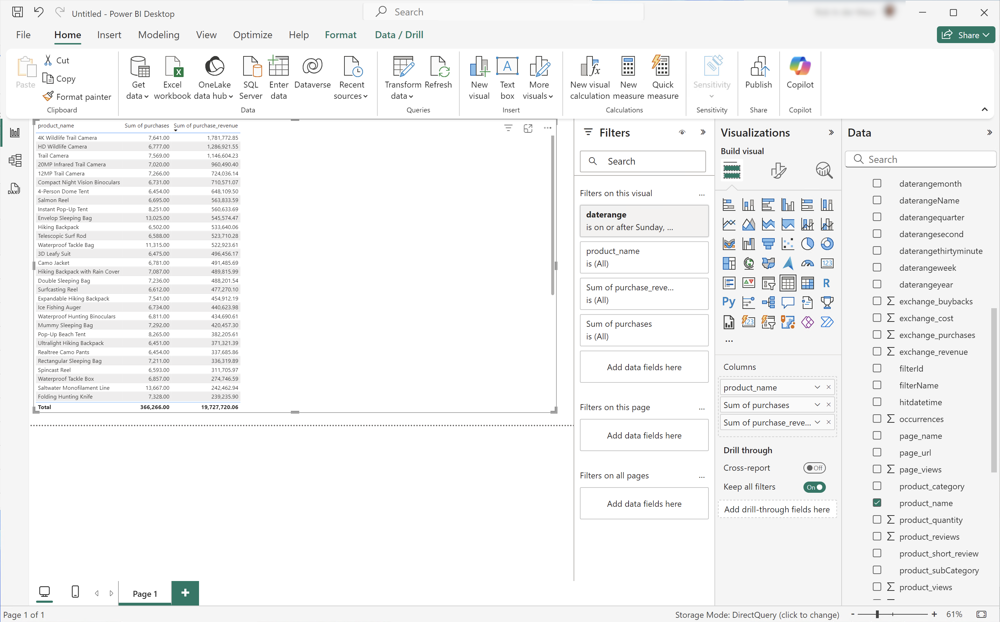
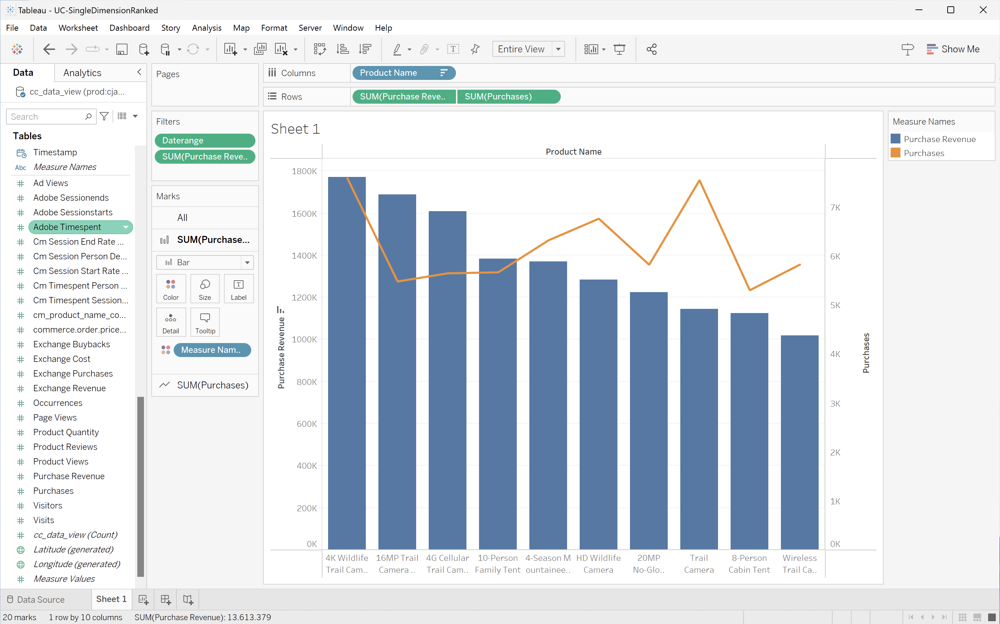
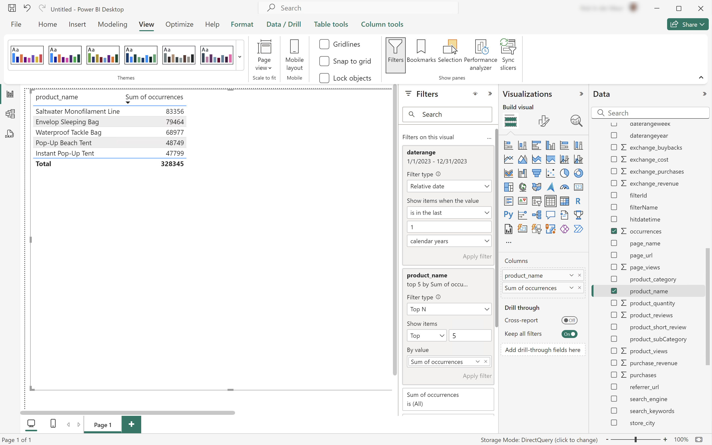

# Anwendungsfälle für BI-Erweiterungen

In diesem Artikel wird beschrieben, wie Sie eine Reihe von Anwendungsfällen mit der Customer Journey Analytics BI-Erweiterung durchführen. Für jeden Anwendungsfall wird die Customer Journey Analytics-Funktion erläutert, gefolgt von Details zu den einzelnen unterstützten BI-Tools:

* **Power BI Desktop**. Die verwendete Version ist 2.137.1102.0 64-Bit (Oktober 2024).
* **Tableau-Desktop**. Die verwendete Version ist 2024.1.5 (20241.24.0705.0334) 64-Bit.

Die folgenden Anwendungsfälle werden dokumentiert:

* [Datenansichten verbinden und auflisten](#connect-and-validate)
* [Täglicher Trend](#daily-trend)
* [Stündlicher Trend](#hourly-trend)
* [Monatlicher Trend](#monthly-trend)
* [Einzelne Dimension in Rang](#single-dimension-ranked)
* [Rangansicht mehrerer Dimensionen](#multiple-dimension-ranked)
* [Zählen von eindeutigen Dimensionswerten](#count-distinct-dimension-values)
* [Filtern von Datumsbereichsnamen](#use-date-range-names-to-filter)
* [Filternamen zum Filtern verwenden](#use-filter-names-to-filter)
* [Verwenden von Dimensionswerten zum Filtern](#use-dimension-values-to-filter)
* [Sortieren](#sort)
* [Beschränkungen](#limits)
* [Zum FLATTEN oder nicht](#to-flatten-or-not)
* [Umwandlungen](#transformations)
* [Visualisierungen](#visualizations)

Der erste Anwendungsfall konzentriert sich auf die Verbindung von BI-Tools mit der Customer Journey Analytics BI-Erweiterung.

In den Anwendungsfällen 2 bis 12 finden Sie Anweisungen zum Ausführen ähnlicher Customer Journey Analytics-Visualisierungen in den aktuell unterstützten BI-Tools.

Die Anwendungsbeispiele 13 bis 15 enthalten weitere Details zu:

* Verschiedene Möglichkeiten, eine Verbindung zu den BI-Tools herzustellen.
* Umwandlungen, die auftreten, wenn Sie BI-Tools zum Reporting und Analysieren verwenden.
* Visualisierungsähnlichkeiten und Unterschiede zwischen Customer Journey Analytics- und BI-Tools.


## Verbindung herstellen und überprüfen

In diesem Anwendungsbeispiel wird die Verbindung vom BI-Tool zum Customer Journey Analytics eingerichtet, die verfügbaren Datenansichten aufgelistet und eine zu verwendende Datenansicht ausgewählt.

+++ Customer Journey Analytics

Die Anweisungen beziehen sich auf eine Beispielumgebung mit den folgenden Objekten:

* Datenansicht: **[!UICONTROL C&amp;C - Datenansicht]** ???
* Dimensionen: **[!UICONTROL Produktname]** ??? und **[!UICONTROL Produktkategorie]** ??
* Metriken: **[!UICONTROL Einkaufsumsatz]** ??? und **[!UICONTROL Einkäufe]** ??..
* Filter: **[!UICONTROL Fischereierzeugnisse]** ??


Wenn Sie die Anwendungsfälle durchlaufen, ersetzen Sie diese Beispielobjekte durch Objekte, die für Ihre spezifische Umgebung geeignet sind.

+++

+++ BI-Tools

>[!BEGINTABS]

>[!TAB Power BI Desktop]

1. Greifen Sie über die Experience Platform Query Service-Benutzeroberfläche auf die erforderlichen Anmeldeinformationen und Parameter zu.

   1. Navigieren Sie zu Ihrer Experience Platform-Sandbox.
   1. Wählen Sie  **[!UICONTROL Abfragen]** in der linken Leiste aus.
   1. Wählen Sie die Registerkarte **[!UICONTROL Anmeldedaten]** in der Benutzeroberfläche **[!UICONTROL Abfragen]** aus.
   1. Wählen Sie `prod:cja` aus dem Dropdown-Menü **[!UICONTROL Datenbank]** aus.

      

1. Starten Sie Power BI Desktop.
   1. Wählen Sie in der Hauptbenutzeroberfläche **[!UICONTROL Daten aus anderen Quellen abrufen]** aus.
   1. Im Dialogfeld **[!UICONTROL Daten abrufen]** :
      
      1. Suchen Sie nach der PostgreSQL-Datenbank ]**und wählen Sie sie aus.**[!UICONTROL 
      1. Wählen Sie **[!UICONTROL Verbinden]** aus.
   1. Im Dialogfeld **[!UICONTROL PostgreSQL-Datenbank]** :
      
      1. Verwenden Sie  , um die Werte **[!UICONTROL Host]** und **[!UICONTROL Port]** aus dem Bedienfeld Experience Platform **[!UICONTROL Abfrage]** **[!UICONTROL Ablaufberechtigungen]** zu kopieren und einzufügen, getrennt durch `:` als Wert für **[!UICONTROL Server]**. Beispiel: `examplecompany.platform-query.adobe.io:80`.
      1. Verwenden Sie  , um den Wert **[!UICONTROL Database]** aus dem Bereich Experience Platform **[!UICONTROL Abfrage]** **[!UICONTROL Ablaufberechtigungen]** zu kopieren und einzufügen. Fügen Sie `?FLATTEN` zum Wert hinzu, den Sie einfügen. Zum Beispiel `prod:cja?FLATTEN`.
      1. Wählen Sie **[!UICONTROL DirectQuery]** als **[!UICONTROL Datenkonnektivitätsmodus]** aus.
      1. Wählen Sie **[!UICONTROL OK]** aus.
   1. Im Dialogfeld **[!UICONTROL PostgreSQL-Datenbank]** - **[!UICONTROL Datenbank]** :
      
      1. Kopieren Sie mithilfe von  die Werte **[!UICONTROL Benutzername]** und **[!UICONTROL Kennwort]** aus dem Feld Experience Platform **[!UICONTROL Abfrage]** **[!UICONTROL Ablaufberechtigungen]** in den Feldern **[!UICONTROL Benutzername]** und **[!UICONTROL Kennwort]**. Wenn Sie eine [nicht ablaufende Berechtigung](https://experienceleague.adobe.com/en/docs/experience-platform/query/ui/credentials?lang=en#use-credential-to-connect) verwenden, verwenden Sie das Kennwort Ihrer nicht ablaufenden Berechtigung.
      1. Stellen Sie sicher, dass das Dropdown-Menü für **[!UICONTROL Auswählen, welche Ebene diese Einstellungen auf]** anwenden soll, auf den zuvor definierten **[!UICONTROL Server]** festgelegt ist.
      1. Wählen Sie **[!UICONTROL Verbinden]** aus.
   1. Im Dialogfeld **[!UICONTROL Navigator]** werden die Datenansichten abgerufen. Dieser Abruf kann einige Zeit in Anspruch nehmen. Nach dem Abrufen sehen Sie Folgendes in Power BI Desktop.
      
      1. Wählen Sie **[!UICONTROL public.cc_data_view]** aus der Liste im linken Bereich aus.
      1. Es gibt zwei Optionen:
         1. Wählen Sie **[!UICONTROL laden]** aus, um das Setup fortzusetzen und abzuschließen.
         1. Wählen Sie **[!UICONTROL Daten transformieren]** aus. Es wird ein Dialogfeld angezeigt, in dem Sie im Rahmen der Konfiguration optional Umwandlungen anwenden können.
            
            * Wählen Sie **[!UICONTROL Schließen und Anwenden]** aus.
   1. Nach einiger Zeit wird **[!UICONTROL public.cc_data_view]** im Bereich **[!UICONTROL Daten]** angezeigt. Wählen Sie  aus, um Dimensionen und Metriken anzuzeigen.
      


>[!TAB Tableau-Desktop]

1. Greifen Sie über die Experience Platform Query Service-Benutzeroberfläche auf die erforderlichen Anmeldeinformationen und Parameter zu.

   1. Navigieren Sie zu Ihrer Experience Platform-Sandbox.
   1. Wählen Sie  **[!UICONTROL Abfragen]** in der linken Leiste aus.
   1. Wählen Sie die Registerkarte **[!UICONTROL Anmeldedaten]** in der Benutzeroberfläche **[!UICONTROL Abfragen]** aus.
   1. Wählen Sie `prod:cja` aus dem Dropdown-Menü **[!UICONTROL Datenbank]** aus.

      

1. Starten Sie Tableau.
   1. Wählen Sie **[!UICONTROL PostgreSQL]** aus der linken Leiste unter **[!UICONTROL Auf einen Server]** aus. Wenn nicht verfügbar, wählen Sie **[!UICONTROL Mehr...]** und dann **[!UICONTROL PostgreSQL]** aus den **[!UICONTROL installierten Connectoren]**.
      
   1. Im Dialogfeld **[!UICONTROL PostgreSQL]** auf der Registerkarte **[!UICONTROL Allgemein]**:
      
      1. Verwenden Sie  , um den **[!UICONTROL Host]** aus dem Bereich Experience Platform **[!UICONTROL Abfrage]** **[!UICONTROL Ablaufberechtigungen]** zu kopieren und in den Bereich **[!UICONTROL Server]** einzufügen.
      1. Verwenden Sie  , um den **[!UICONTROL Port]** aus dem Bereich Experience Platform **[!UICONTROL Abfrage]** **[!UICONTROL Ablaufberechtigungen]** zu kopieren und in den Bereich **[!UICONTROL Port]** einzufügen.
      1. Verwenden Sie  , um die **[!UICONTROL Datenbank]** aus dem Bereich Experience Platform **[!UICONTROL Abfrage]** **[!UICONTROL Ablaufberechtigungen]** zu kopieren und in den Bereich **[!UICONTROL Datenbank]** einzufügen. Fügen Sie `%3FFLATTEN` zum Wert hinzu, den Sie einfügen. Beispiel: `prod:cja%3FFLATTEN`.
      1. Wählen Sie **[!UICONTROL Benutzername und Kennwort]** aus dem Dropdown-Menü **[!UICONTROL Authentifizierung]**.
      1. Verwenden Sie  , um den **[!UICONTROL Benutzernamen]** aus dem Bereich Experience Platform **[!UICONTROL Abfrage]** **[!UICONTROL Ablaufberechtigungen]** zu kopieren und in den Bereich **[!UICONTROL Benutzername]** einzufügen.
      1. Verwenden Sie  , um das **[!UICONTROL Kennwort]** aus dem Bereich Experience Platform **[!UICONTROL Abfrage]** **[!UICONTROL Ablaufberechtigungen]** zu kopieren und in den Bereich **[!UICONTROL Kennwort]** einzufügen. Wenn Sie eine [nicht ablaufende Berechtigung](https://experienceleague.adobe.com/en/docs/experience-platform/query/ui/credentials?lang=en#use-credential-to-connect) verwenden, verwenden Sie das Kennwort Ihrer nicht ablaufenden Berechtigung.
      1. Stellen Sie sicher, dass **[!UICONTROL SSL erforderlich]** aktiviert ist.
      1. Wählen Sie **[!UICONTROL Anmelden]** aus.

      Es wird ein Dialogfeld **[!UICONTROL Progressing Request]** angezeigt, während Tableau Desktop die Verbindung validiert.
   1. Im Hauptfenster sehen Sie auf der Seite **[!UICONTROL Data Source]** im linken Bereich:
      * Der Name der Verbindung unter **[!UICONTROL Verbindungen]**.
      * Der Name der Datenbank unter **[!UICONTROL Datenbank]**.
      * Eine Liste von Tabellen unter **[!UICONTROL Tabelle]**.
        
      1. Ziehen Sie den Eintrag **[!UICONTROL cc_data_view]** und legen Sie den Eintrag in der Hauptansicht ab, in der **[!UICONTROL Tabellen hierher ziehen]** steht.
   1. Im Hauptfenster werden Details zur Datenansicht **[!UICONTROL cc_data_view]** angezeigt.
      

>[!ENDTABS]

+++


## Täglicher Trend

In diesem Anwendungsfall möchten Sie eine Tabelle und eine einfache Linienvisualisierung anzeigen, die einen täglichen Trend von Vorkommnissen (Ereignissen) vom 1. Januar 2023 bis zum 31. Januar 2023 anzeigt.

+++ Customer Journey Analytics

Ein Beispiel für den Bereich **[!UICONTROL Täglicher Trend]** für den Anwendungsfall:


+++

+++ BI-Tools

>[!PREREQUISITES]
>
>Stellen Sie sicher, dass Sie eine [erfolgreiche Verbindung validiert haben und Datenansichten](#connect-and-validate) für das BI-Tool auflisten und verwenden können, für das Sie diesen Anwendungsfall ausprobieren möchten.
>

>[!BEGINTABS]

>[!TAB Power BI Desktop]

1. Im Bereich **[!UICONTROL Daten]** :
   1. Wählen Sie **[!UICONTROL daterangeday]** aus.
   1. Wählen Sie **[!UICONTROL ∑ Vorkommen]** aus.

   Es wird eine Tabelle mit den Vorkommen für den aktuellen Monat angezeigt. Vergrößern Sie die Visualisierung, um eine bessere Sichtbarkeit zu erzielen.

1. Im Bereich **[!UICONTROL Filter]** :

   1. Wählen Sie den Tag **[!UICONTROL daterangeday is (All)]** aus **[!UICONTROL Filtern auf dieser visuellen Seite]** aus.
   1. Wählen Sie **[!UICONTROL Erweiterte Filterung]** als **[!UICONTROL Filtertyp]** aus.
   1. Definieren Sie den Filter auf **[!UICONTROL Elemente anzeigen , wenn der Wert]** **[!UICONTROL auf oder nach]** `1/1/2023` **[!UICONTROL und]** **[!UICONTROL vor]** `2/1/2023.` liegt. Mit dem Kalendersymbol können Sie Datumsangaben auswählen.
   1. Wählen Sie **[!UICONTROL Filter anwenden]**.

   Die Tabelle wird mit dem angewendeten Filter **[!UICONTROL daterangeday]** aktualisiert.

1. Wählen Sie im Bereich **[!UICONTROL Visualisierungen]** die Visualisierung **[!UICONTROL Liniendiagramm]** aus.

   Eine Liniendiagrammvisualisierung ersetzt die Tabelle, wobei dieselben Daten wie die Tabelle verwendet werden. Ihr Power BI Desktop sollte wie unten dargestellt aussehen.

   

1. In der Liniendiagrammvisualisierung:

   1. Wählen Sie  aus.
   1. Wählen Sie im Kontextmenü **[!UICONTROL Als Tabelle anzeigen]** aus.

   Die Hauptansicht wird aktualisiert und zeigt sowohl eine Linienvisualisierung als auch eine Tabelle an. Ihr Power BI Desktop sollte wie unten dargestellt aussehen.

   

>[!TAB Tableau-Desktop]

1. Wählen Sie unten die Registerkarte **[!UICONTROL Blatt 1]** aus, um von der Ansicht **[!UICONTROL Datenquelle]** zu wechseln. In der Ansicht **[!UICONTROL Tabellenblatt 1]**:
   1. Ziehen Sie den Eintrag **[!UICONTROL Daterange]** aus der Liste **[!UICONTROL Tabellen]** in den Bereich **[!UICONTROL Daten]** und legen Sie den Eintrag in die Regale **[!UICONTROL Filter]**.
   1. Wählen Sie im Dialogfeld **[!UICONTROL Filterfeld \[Datumsbereich\]]** die Option **[!UICONTROL Datumsbereich]** aus und wählen Sie **[!UICONTROL Weiter >]**.
   1. Wählen Sie im Dialogfeld **[!UICONTROL Filter \[Datumsbereich]]** die Option **[!UICONTROL Datumsbereich]** aus und geben Sie einen Zeitraum von `01/01/2023` - `01/02/2023` an.

      

   1. Ziehen Sie **[!UICONTROL Daterangeday]** aus der Liste **[!UICONTROL Tabellen]** in den Bereich **[!UICONTROL Daten]** und legen Sie den Eintrag im Feld neben **[!UICONTROL Spalten]** ab.
      * Wählen Sie **[!UICONTROL Tag]** aus dem Dropdown-Menü **[!UICONTROL Daterangeday]** aus, damit der Wert auf **[!UICONTROL TAG(Daterangeday)]** aktualisiert wird.
   1. Ziehen Sie **[!UICONTROL Vorfälle]** aus der Liste **[!UICONTROL Tabellen (*Messnamen*)]** in den Bereich **[!UICONTROL Daten]** und legen Sie den Eintrag im Feld neben **[!UICONTROL Zeilen]** ab.
      * Die Werte werden automatisch in **[!UICONTROL SUM(Vorfälle)]** konvertiert.
   1. Ändern Sie **[!UICONTROL Standard]** in **[!UICONTROL Gesamte Ansicht]** aus dem Dropdown-Menü **[IUICONTROL Fit]** in der Symbolleiste.

      Ihr Tableau-Desktop sollte wie unten dargestellt aussehen.

      

1. Wählen Sie im Kontextmenü der Registerkarte **[!UICONTROL Blatt 1]** die Option **[!UICONTROL Duplizieren]** aus, um ein zweites Blatt zu erstellen.
1. Wählen Sie im Kontextmenü der Registerkarte **[!UICONTROL Blatt 1]** die Option **[!UICONTROL Umbenennen]** aus, um das Blatt in `Graph` umzubenennen.
1. Wählen Sie im Kontextmenü der Registerkarte **[!UICONTROL Blatt 1 (2)]** die Option **[!UICONTROL Umbenennen]** aus, um das Blatt in `Data` umzubenennen.
1. Stellen Sie sicher, dass das Blatt **[!UICONTROL Daten]** ausgewählt ist. In der Ansicht **[!UICONTROL Data]**:
   1. Wählen Sie oben rechts **[!UICONTROL Einblenden]** und dann **[!UICONTROL Texttabelle]** (obere linke Visualisierung) aus, um den Inhalt der Datenansicht in eine Tabelle zu ändern.
   1. Wählen Sie **[!UICONTROL Zeilen und Spalten tauschen]** aus der Symbolleiste aus.
   1. Ändern Sie **[!UICONTROL Standard]** in **[!UICONTROL Gesamte Ansicht]** aus dem Dropdown-Menü **[IUICONTROL Fit]** in der Symbolleiste.

      Ihr Tableau-Desktop sollte wie unten dargestellt aussehen.

      

1. Wählen Sie die Schaltfläche **[!UICONTROL Neues Dashboard]** (unten) aus, um eine neue Ansicht vom Typ **[!UICONTROL Dashboard 1]** zu erstellen. In der Ansicht **[!UICONTROL Dashboard 1]** :
   1. Ziehen Sie das Blatt **[!UICONTROL Diagramm]** aus dem Regal **[!UICONTROL Tabellen]** und legen Sie es in die Ansicht **[!UICONTROL Dashboard 1]**, in der *Tabellen hier ablegen* gelesen wird.
   1. Ziehen Sie das Blatt **[!UICONTROL Daten]** aus dem Regal **[!UICONTROL Tabellen]** unter das Blatt **[!UICONTROL Diagramm]** und legen Sie es in die Ansicht **[!UICONTROL Dashboard 1]**.
   1. Wählen Sie das Blatt **[!UICONTROL Daten]** in der Ansicht aus und ändern Sie **[!UICONTROL Gesamte Ansicht]** in **[!UICONTROL Breite korrigieren]**.

      Ihr Tableau-Desktop sollte wie unten dargestellt aussehen.

      

>[!ENDTABS]

+++


## Stündlicher Trend

In diesem Anwendungsfall möchten Sie eine Tabelle und eine einfache Linienvisualisierung anzeigen, die einen stündlichen Trend von Ereignissen (Ereignissen) für den 1. Januar 2023 anzeigt.

+++ Customer Journey Analytics

Ein Beispiel für den Bereich **[!UICONTROL Stündlicher Trend]** für den Anwendungsfall:


+++

+++ BI-Tools

>[!PREREQUISITES]
>
>Vergewissern Sie sich, dass Sie [eine erfolgreiche Verbindung überprüft haben, Datenansichten auflisten und eine Datenansicht](#connect-and-validate) für das BI-Tool verwenden können, für das Sie diesen Anwendungsfall ausprobieren möchten.
>

>[!BEGINTABS]

>[!TAB Power BI Desktop]

 Power BI versteht **nicht**, wie Datumszeitfelder verarbeitet werden. Daher werden Dimensionen wie **[!UICONTROL daterangehour]** und **[!UICONTROL daterangeminute]** nicht unterstützt.

>[!TAB Tableau-Desktop]

1. Wählen Sie unten die Registerkarte **[!UICONTROL Blatt 1]** aus, um von **[!UICONTROL Datenquelle]** zu wechseln. In der Ansicht **[!UICONTROL Tabellenblatt 1]**:
   1. Ziehen Sie den Eintrag **[!UICONTROL Daterange]** aus der Liste **[!UICONTROL Tabellen]** in den Bereich **[!UICONTROL Daten]** und legen Sie den Eintrag in die Regale **[!UICONTROL Filter]**.
   1. Wählen Sie im Dialogfeld **[!UICONTROL Filterfeld \[Datumsbereich\]]** die Option **[!UICONTROL Datumsbereich]** aus und wählen Sie **[!UICONTROL Weiter >]**.
   1. Wählen Sie im Dialogfeld **[!UICONTROL Filter \[Datumsbereich]]** die Option **[!UICONTROL Datumsbereich]** aus und geben Sie einen Zeitraum von `01/01/2023` - `02/01/2023` an.

      

   1. Ziehen Sie **[!UICONTROL Daterangehour]** aus der Liste **[!UICONTROL Tabellen]** in den Bereich **[!UICONTROL Daten]** und legen Sie den Eintrag im Feld neben **[!UICONTROL Spalten]** ab.
      * Wählen Sie **[!UICONTROL Mehr]** > **[!UICONTROL Stunden]** aus dem Dropdown-Menü **[!UICONTROL Daterangeday]** aus, damit der Wert auf **[!UICONTROL STUNDE(Daterangeday)]** aktualisiert wird.
   1. Ziehen Sie **[!UICONTROL Vorfälle]** aus der Liste **[!UICONTROL Tabellen (*Messnamen*)]** in den Bereich **[!UICONTROL Daten]** und legen Sie den Eintrag im Feld neben **[!UICONTROL Zeilen]** ab.
      * Die Werte werden automatisch in **[!UICONTROL SUM(Vorfälle)]** konvertiert.
   1. Ändern Sie **[!UICONTROL Standard]** in **[!UICONTROL Gesamte Ansicht]** aus dem Dropdown-Menü **[IUICONTROL Fit]** in der Symbolleiste.

      Ihr Tableau-Desktop sollte wie unten dargestellt aussehen.

      

1. Wählen Sie im Kontextmenü der Registerkarte **[!UICONTROL Blatt 1]** die Option **[!UICONTROL Duplizieren]** aus, um ein zweites Blatt zu erstellen.
1. Wählen Sie im Kontextmenü der Registerkarte **[!UICONTROL Blatt 1]** die Option **[!UICONTROL Umbenennen]** aus, um das Blatt in `Graph` umzubenennen.
1. Wählen Sie im Kontextmenü der Registerkarte **[!UICONTROL Blatt 1 (2)]** die Option **[!UICONTROL Umbenennen]** aus, um das Blatt in `Data` umzubenennen.
1. Stellen Sie sicher, dass das Blatt **[!UICONTROL Daten]** ausgewählt ist. In der Ansicht **[!UICONTROL Data]**:
   1. Wählen Sie oben rechts **[!UICONTROL Einblenden]** und dann **[!UICONTROL Texttabelle]** (obere linke Visualisierung) aus, um den Inhalt der Datenansicht in eine Tabelle zu ändern.
   1. Ziehen Sie **[!UICONTROL STUNDE(Daterangeday)]** aus **[!UICONTROL Spalten]** in **[!UICONTROL Zeilen]**.
   1. Ändern Sie **[!UICONTROL Standard]** in **[!UICONTROL Gesamte Ansicht]** aus dem Dropdown-Menü **[IUICONTROL Fit]** in der Symbolleiste.

      Ihr Tableau-Desktop sollte wie unten dargestellt aussehen.

      

1. Wählen Sie die Registerkarte **[!UICONTROL Neues Dashboard]** (unten) aus, um eine neue Ansicht vom Typ **[!UICONTROL Dashboard 1]** zu erstellen. In der Ansicht **[!UICONTROL Dashboard 1]** :
   1. Ziehen Sie das Blatt **[!UICONTROL Diagramm]** aus dem Regal **[!UICONTROL Tabellen]** und legen Sie es in die Ansicht **[!UICONTROL Dashboard 1]**, in der *Tabellen hier ablegen* gelesen wird.
   1. Ziehen Sie das Blatt **[!UICONTROL Daten]** aus dem Regal **[!UICONTROL Tabellen]** unter das Blatt **[!UICONTROL Diagramm]** und legen Sie es in die Ansicht **[!UICONTROL Dashboard 1]**.
   1. Wählen Sie das Blatt **[!UICONTROL Daten]** in der Ansicht aus und ändern Sie **[!UICONTROL Gesamte Ansicht]** in **[!UICONTROL Breite korrigieren]**.

      Ihre Ansicht **[!UICONTROL Dashboard 1]** sollte wie unten dargestellt aussehen.

      


>[!ENDTABS]

+++


## Monatlicher Trend

In diesem Anwendungsfall möchten Sie eine Tabelle und eine einfache Linienvisualisierung anzeigen, die einen monatlichen Vorkommenstrend (Ereignisse) für 2023 anzeigt.

+++ Customer Journey Analytics

Ein Beispiel für den Bereich **[!UICONTROL Monatlicher Trend]** für den Anwendungsfall:


+++

+++ BI-Tools

>[!PREREQUISITES]
>
>Vergewissern Sie sich, dass Sie [eine erfolgreiche Verbindung überprüft haben, Datenansichten auflisten und eine Datenansicht](#connect-and-validate) für das BI-Tool verwenden können, für das Sie diesen Anwendungsfall ausprobieren möchten.
>

>[!BEGINTABS]

>[!TAB Power BI Desktop]

1. Im Bereich **[!UICONTROL Daten]** :
   1. Wählen Sie **[!UICONTROL daterangemonth]** aus.
   1. Wählen Sie **[!UICONTROL ∑ Vorkommen]** aus.

   Es wird eine Tabelle mit den Vorkommen für den aktuellen Monat angezeigt. Vergrößern Sie die Visualisierung, um eine bessere Sichtbarkeit zu erzielen.

1. Im Bereich **[!UICONTROL Filter]** :

   1. Wählen Sie den Wert **[!UICONTROL daterangemonth is (All)]** aus **[!UICONTROL Filtern für diese visuelle Anzeige]** aus.
   1. Wählen Sie **[!UICONTROL Erweiterte Filterung]** als **[!UICONTROL Filtertyp]** aus.
   1. Definieren Sie den Filter auf **[!UICONTROL Elemente anzeigen , wenn der Wert]** **[!UICONTROL auf oder nach]** `1/1/2023` **[!UICONTROL und]** **[!UICONTROL vor]** `1/1/2024.` liegt. Mit dem Kalendersymbol können Sie Datumsangaben auswählen.
   1. Wählen Sie **[!UICONTROL Filter anwenden]**.

   Die Tabelle wird mit dem angewendeten Filter **[!UICONTROL daterangemonth]** aktualisiert.

1. Im Bereich **[!UICONTROL Visualisierungen]** :

   1. Wählen Sie die Visualisierung **[!UICONTROL Liniendiagramm]** aus.

   Eine Liniendiagrammvisualisierung ersetzt die Tabelle, wobei dieselben Daten wie die Tabelle verwendet werden. Ihr Power BI Desktop sollte wie unten dargestellt aussehen.

   

1. In der Liniendiagrammvisualisierung:

   1. Wählen Sie  aus.
   1. Wählen Sie im Kontextmenü **[!UICONTROL Als Tabelle anzeigen]** aus.

   Die Hauptansicht wird aktualisiert und zeigt sowohl eine Linienvisualisierung als auch eine Tabelle an. Ihr Power BI Desktop sollte wie unten dargestellt aussehen.

   

>[!TAB Tableau-Desktop]

1. Wählen Sie unten die Registerkarte **[!UICONTROL Blatt 1]** aus, um von **[!UICONTROL Datenquelle]** zu wechseln. In der Ansicht **[!UICONTROL Tabellenblatt 1]**:
   1. Ziehen Sie den Eintrag **[!UICONTROL Daterange]** aus der Liste **[!UICONTROL Tabellen]** in den Bereich **[!UICONTROL Daten]** und legen Sie den Eintrag in die Regale **[!UICONTROL Filter]**.
   1. Wählen Sie im Dialogfeld **[!UICONTROL Filterfeld \[Datumsbereich\]]** die Option **[!UICONTROL Datumsbereich]** aus und wählen Sie **[!UICONTROL Weiter >]**.
   1. Wählen Sie im Dialogfeld **[!UICONTROL Filter \[Datumsbereich]]** die Option **[!UICONTROL Datumsbereich]** aus und geben Sie einen Zeitraum von `01/01/2023` - `01/01/2024` an.

      

   1. Ziehen Sie **[!UICONTROL Daterangeday]** aus der Liste **[!UICONTROL Tabellen]** in den Bereich **[!UICONTROL Daten]** und legen Sie den Eintrag im Feld neben **[!UICONTROL Spalten]** ab.
      * Wählen Sie **[!UICONTROL MONTH]** aus dem Dropdown-Menü **[!UICONTROL Daterangeday]** aus, damit der Wert auf **[!UICONTROL MONTH(Daterangeday)]** aktualisiert wird.
   1. Ziehen Sie **[!UICONTROL Vorfälle]** aus der Liste **[!UICONTROL Tabellen (*Messnamen*)]** in den Bereich **[!UICONTROL Daten]** und legen Sie den Eintrag im Feld neben **[!UICONTROL Zeilen]** ab.
      * Die Werte werden automatisch in **[!UICONTROL SUM(Vorfälle)]** konvertiert.
   1. Ändern Sie **[!UICONTROL Standard]** in **[!UICONTROL Gesamte Ansicht]** aus dem Dropdown-Menü **[IUICONTROL Fit]** in der Symbolleiste.

      Ihr Tableau-Desktop sollte wie unten dargestellt aussehen.

      

1. Wählen Sie im Kontextmenü der Registerkarte **[!UICONTROL Blatt 1]** die Option **[!UICONTROL Duplizieren]** aus, um ein zweites Blatt zu erstellen.
1. Wählen Sie im Kontextmenü der Registerkarte **[!UICONTROL Blatt 1]** die Option **[!UICONTROL Umbenennen]** aus, um das Blatt in `Graph` umzubenennen.
1. Wählen Sie im Kontextmenü der Registerkarte **[!UICONTROL Blatt 1 (2)]** die Option **[!UICONTROL Umbenennen]** aus, um das Blatt in `Data` umzubenennen.
1. Stellen Sie sicher, dass das Blatt **[!UICONTROL Daten]** ausgewählt ist. In der Datenansicht:
   1. Wählen Sie oben rechts **[!UICONTROL Einblenden]** und dann **[!UICONTROL Texttabelle]** (obere linke Visualisierung) aus, um den Inhalt der Datenansicht in eine Tabelle zu ändern.
   1. Ziehen Sie **[!UICONTROL MONTH(Daterangeday)]** aus **[!UICONTROL Spalten]** in **[!UICONTROL Zeilen]**.
   1. Ändern Sie **[!UICONTROL Standard]** in **[!UICONTROL Gesamte Ansicht]** aus dem Dropdown-Menü **[IUICONTROL Fit]** in der Symbolleiste.

      Ihr Tableau-Desktop sollte wie unten dargestellt aussehen.

      

1. Wählen Sie die Registerkarte **[!UICONTROL Neues Dashboard]** (unten) aus, um eine neue Ansicht vom Typ **[!UICONTROL Dashboard 1]** zu erstellen. In der Ansicht **[!UICONTROL Dashboard 1]** :
   1. Ziehen Sie das Blatt **[!UICONTROL Diagramm]** aus dem Regal **[!UICONTROL Tabellen]** und legen Sie es in die Ansicht **[!UICONTROL Dashboard 1]**, in der *Tabellen hier ablegen* gelesen wird.
   1. Ziehen Sie das Blatt **[!UICONTROL Daten]** aus dem Regal **[!UICONTROL Tabellen]** unter das Blatt **[!UICONTROL Diagramm]** und legen Sie es in die Ansicht **[!UICONTROL Dashboard 1]**.
   1. Wählen Sie das Blatt **[!UICONTROL Daten]** in der Ansicht aus und ändern Sie **[!UICONTROL Gesamte Ansicht]** in **[!UICONTROL Breite korrigieren]**.

      Ihr Tableau-Desktop sollte wie unten dargestellt aussehen.

      

>[!ENDTABS]

+++


## Einzelne Dimension in Rang

In diesem Anwendungsfall möchten Sie eine Tabelle und eine einfache Balkenvisualisierung anzeigen, die die Käufe und Käufe für Produktnamen aus dem Jahr 2023 anzeigt.

+++ Customer Journey Analytics

Beispiel für ein Bedienfeld **[!UICONTROL Einzelne Dimension mit Rangansicht]** für den Anwendungsfall:


+++

+++ BI-Tools

>[!PREREQUISITES]
>
>Vergewissern Sie sich, dass Sie [eine erfolgreiche Verbindung überprüft haben, Datenansichten auflisten und eine Datenansicht](#connect-and-validate) für das BI-Tool verwenden können, für das Sie diesen Anwendungsfall ausprobieren möchten.
>

>[!BEGINTABS]

>[!TAB Power BI Desktop]

1. Im Bereich **[!UICONTROL Daten]** :
   1. Wählen Sie **[!UICONTROL daterange]** aus.
   1. Wählen Sie **[!UICONTROL product_name]** aus.
   1. Wählen Sie **[!UICONTROL ∑ purchase_revenue]** aus.
   1. Wählen Sie **[!UICONTROL ∑ Einkäufe]** aus.

   Es wird eine leere Tabelle angezeigt, die nur die Spaltenüberschriften für das ausgewählte Element anzeigt. Vergrößern Sie die Visualisierung, um eine bessere Sichtbarkeit zu erzielen.

1. Im Bereich **[!UICONTROL Filter]** :

   1. Wählen Sie den **[!UICONTROL Datumsbereich ist (Alle)]** aus den **[!UICONTROL Filtern für diese visuelle]** aus.
   1. Wählen Sie **[!UICONTROL Relatives Datum]** als **[!UICONTROL Filtertyp]** aus.
   1. Definieren Sie den Filter auf **[!UICONTROL Elemente anzeigen , wenn sich der Wert]** **[!UICONTROL in den letzten]** `1` **[!UICONTROL Kalenderjahren]** befindet.
   1. Wählen Sie **[!UICONTROL Filter anwenden]**.

   Die Tabelle wird mit dem angewendeten Filter **[!UICONTROL daterange]** aktualisiert.

1. Im Bereich **[!UICONTROL Visualisierung]** :

   1. Verwenden Sie , um **[!UICONTROL daterange]** aus **[!UICONTROL Spalten]** zu entfernen.
   1. Ziehen Sie **[!UICONTROL Summe der Einkäufe_Umsatz]** unter **[!UICONTROL Summe der Käufe]** und legen Sie sie in **[!UICONTROL Spalten]** ab.

1. In der Tabellenvisualisierung:

   1. Wählen Sie **[!UICONTROL Summe des Kaufumsatzes]** aus, um die Produktnamen in absteigender Reihenfolge des Kaufumsatzes zu sortieren. Ihr Power BI Desktop sollte wie unten dargestellt aussehen.

   

1. Im Bereich **[!UICONTROL Filter]** :

   1. Wählen Sie **[!UICONTROL product_name is (All)]** aus.
   1. Setzen Sie **[!UICONTROL Filtertyp]** auf **[!UICONTROL Oben N]**.
   1. Definieren Sie den Filter zu **[!UICONTROL Elemente anzeigen]** **[!UICONTROL Oben]** `10` **[!UICONTROL Nach Wert]**.
   1. Ziehen Sie **[!UICONTROL purchase_revenue]** per Drag-and-Drop in **[!UICONTROL Nach Wert]** **[!UICONTROL Hier Datenfelder hinzufügen]**.
   1. Wählen Sie **[!UICONTROL Filter anwenden]**.

   Die Tabelle wird synchron mit den Werten für den Kaufumsatz in der Freiformtabellen-Visualisierung in Analysis Workspace angezeigt.

1. Im Bereich **[!UICONTROL Visualisierungen]** :

   1. Wählen Sie die Visualisierung **[!UICONTROL Linie und gestapeltes Spaltendiagramm]** aus.

   Eine Liniendiagramm- und gestapelte Spaltendiagrammvisualisierung ersetzt die Tabelle, wobei dieselben Daten wie die Tabelle verwendet werden.

1. Ziehen Sie **[!UICONTROL Einkäufe]** auf **[!UICONTROL Linie y-Achse]** im Bereich **[!UICONTROL Visualisierungen]** und legen Sie es dort ab.

   Das Linien- und gestapelte Spaltendiagramm wird aktualisiert. Ihr Power BI Desktop sollte wie unten dargestellt aussehen.

   

1. Visualisierung der Linien- und gestapelten Spaltendiagramme:

   1. Wählen Sie  aus.
   1. Wählen Sie im Kontextmenü **[!UICONTROL Als Tabelle anzeigen]** aus.

   Die Hauptansicht wird aktualisiert und zeigt sowohl eine Linienvisualisierung als auch eine Tabelle an.

   

>[!TAB Tableau-Desktop]

1. Wählen Sie unten die Registerkarte **[!UICONTROL Blatt 1]** aus, um von **[!UICONTROL Datenquelle]** zu wechseln. In der Ansicht **[!UICONTROL Tabellenblatt 1]**:
   1. Ziehen Sie den Eintrag **[!UICONTROL Daterange]** aus der Liste **[!UICONTROL Tabellen]** in den Bereich **[!UICONTROL Daten]** und legen Sie den Eintrag in die Regale **[!UICONTROL Filter]**.
   1. Wählen Sie im Dialogfeld **[!UICONTROL Filterfeld \[Datumsbereich\]]** die Option **[!UICONTROL Datumsbereich]** aus und wählen Sie **[!UICONTROL Weiter >]**.
   1. Wählen Sie im Dialogfeld **[!UICONTROL Filter \[Datumsbereich]]** die Option **[!UICONTROL Datumsbereich]** aus und geben Sie einen Zeitraum von `01/01/2023` - `31/12/2024` an. Wählen Sie **[!UICONTROL Apply]** und **[!UICONTROL OK]** aus.

      

   1. Ziehen Sie **[!UICONTROL Produktname]** aus der Liste **[!UICONTROL Tabellen]** in den Bereich **[!UICONTROL Daten]** und legen Sie den Eintrag im Feld neben **[!UICONTROL Zeilen]** ab.
   1. Ziehen Sie **[!UICONTROL Käufe]** aus der Liste **[!UICONTROL Tabellen (*Bewertungsnamen*)]** und legen Sie den Eintrag im Bereich **[!UICONTROL Daten]** ab und legen Sie ihn im Feld neben **[!UICONTROL Zeilen]** ab.
      * Die Werte werden automatisch in **[!UICONTROL SUM(Purchases)]** konvertiert.
   1. Ziehen Sie den Eintrag **[!UICONTROL Einkaufsumsatz]** aus der Liste **[!UICONTROL Tabellen (*Messnamen*)]** in den Bereich **[!UICONTROL Daten]** und legen Sie den Eintrag im Feld neben **[!UICONTROL Spalten]** und links von **[!UICONTROL SUM(Einkäufe)]** ab.
      * Die Werte werden automatisch in **[!UICONTROL SUM(Einkaufsumsatz)]** konvertiert.
   1. Um beide Diagramme in absteigender Reihenfolge des Kaufumsatzes zu sortieren, bewegen Sie den Mauszeiger über den Titel **[!UICONTROL Kaufumsatz]** und wählen Sie das Sortiersymbol aus.
   1. Um die Anzahl der Einträge in den Diagrammen zu begrenzen, wählen Sie **[!UICONTROL SUM(Purchase Revenue)]** in **[!UICONTROL Zeilen]** und wählen Sie im Dropdown-Menü **[!UICONTROL Filter]** aus.
   1. Wählen Sie im Dialogfeld **[!UICONTROL Filter \[Kaufumsatz\]]** die Option **[!UICONTROL Wertebereich]** aus und geben Sie die entsprechenden Werte ein. Beispiel: `1,000,000` - `2,000,000`. Wählen Sie **[!UICONTROL Apply]** und **[!UICONTROL OK]** aus.
   1. Um die beiden Balkendiagramme in ein doppeltes Kombinationsdiagramm zu konvertieren, wählen Sie **[!UICONTROL SUM(Purchases)]** in **[!UICONTROL Zeilen]** und wählen Sie im Dropdown-Menü **[!UICONTROL Duale Achse]** aus. Die Balkendiagramme verwandeln sich in ein Streudiagramm.
   1. So ändern Sie das Streudiagramm in ein Balkendiagramm:
      1. Wählen Sie **[!UICONTROL SUM(Purchases)]** im Bereich **[!UICONTROL Marks]** und dann **[!UICONTROL Line]** aus dem Dropdown-Menü.
      1. Wählen Sie **[!UICONTROL SUM(Purchase Revenue)]** im Bereich **[!UICONTROL Marks]** aus und wählen Sie **[!UICONTROL Bar]** aus dem Dropdown-Menü.

   Ihr Tableau-Desktop sollte wie unten dargestellt aussehen.

   

1. Wählen Sie im Kontextmenü der Registerkarte **[!UICONTROL Blatt 1]** die Option **[!UICONTROL Duplizieren]** aus, um ein zweites Blatt zu erstellen.
1. Wählen Sie im Kontextmenü der Registerkarte **[!UICONTROL Blatt 1]** die Option **[!UICONTROL Umbenennen]** aus, um das Blatt in `Data` umzubenennen.
1. Wählen Sie im Kontextmenü der Registerkarte **[!UICONTROL Blatt 1 (2)]** die Option **[!UICONTROL Umbenennen]** aus, um das Blatt in `Graph` umzubenennen.
1. Stellen Sie sicher, dass das Blatt **[!UICONTROL Daten]** ausgewählt ist.
   1. Wählen Sie oben rechts die Option **[!UICONTROL Anzeigen]** und danach **[!UICONTROL Texttabelle]** (obere linke obere Visualisierung) aus, um den Inhalt der beiden Diagramme in eine Tabelle zu ändern.
   1. Um den Kaufumsatz in absteigender Reihenfolge zu bestellen, bewegen Sie den Mauszeiger in der Tabelle über **[!UICONTROL Kaufumsatz]** und wählen Sie  aus.
   1. Wählen Sie **[!UICONTROL Gesamte Ansicht]** aus dem Dropdown-Menü **[!UICONTROL Einpassen]** aus.

   Ihr Tableau-Desktop sollte wie unten dargestellt aussehen.

   

1. Wählen Sie die Registerkarte **[!UICONTROL Neues Dashboard]** (unten) aus, um eine neue Ansicht vom Typ **[!UICONTROL Dashboard 1]** zu erstellen. In der Ansicht **[!UICONTROL Dashboard 1]** :
   1. Ziehen Sie das Blatt **[!UICONTROL Diagramm]** aus dem Regal **[!UICONTROL Tabellen]** und legen Sie es in die Ansicht **[!UICONTROL Dashboard 1]**, in der *Tabellen hier ablegen* gelesen wird.
   1. Ziehen Sie das Blatt **[!UICONTROL Daten]** aus dem Regal **[!UICONTROL Tabellen]** unter das Blatt **[!UICONTROL Diagramm]** und legen Sie es in die Ansicht **[!UICONTROL Dashboard 1]**.
   1. Wählen Sie das Blatt **[!UICONTROL Daten]** in der Ansicht aus und ändern Sie **[!UICONTROL Gesamte Ansicht]** in **[!UICONTROL Breite korrigieren]**.

   Ihre Ansicht **[!UICONTROL Dashboard 1]** sollte wie unten dargestellt aussehen.

   

>[!ENDTABS]

+++


## Rangansicht mehrerer Dimensionen

In diesem Anwendungsfall möchten Sie eine Tabelle anzeigen, in der der Kaufumsatz und die Käufe für Produktnamen innerhalb der Produktkategorien im Jahr 2023 aufgeschlüsselt sind. Darüber hinaus möchten Sie einige Visualisierungen verwenden, um sowohl die Produktkategorieverteilung als auch die Produktnamenbeiträge innerhalb jeder Produktkategorie zu veranschaulichen.

+++ Customer Journey Analytics

Beispiel für das Bedienfeld **[!UICONTROL Mehrere Dimensionen mit Rangansicht]** für den Anwendungsfall:


+++

+++ BI-Tools

>[!PREREQUISITES]
>
>Vergewissern Sie sich, dass Sie [eine erfolgreiche Verbindung überprüft haben, Datenansichten auflisten und eine Datenansicht](#connect-and-validate) für das BI-Tool verwenden können, für das Sie diesen Anwendungsfall ausprobieren möchten.
>

>[!BEGINTABS]

>[!TAB Power BI Desktop]

1. Um sicherzustellen, dass der Datumsbereich für alle Visualisierungen gilt, ziehen Sie **[!UICONTROL daterangeday]** aus dem Bereich **[!UICONTROL Daten]** in den Bereich **[!UICONTROL Filter auf dieser Seite]**.
   1. Wählen Sie unter **[!UICONTROL Filter auf dieser Seite]** den Wert **[!UICONTROL daterangeday is (All)]** aus.
   1. Wählen Sie **[!UICONTROL Relatives Datum]** als **[!UICONTROL Filtertyp]** aus.
   1. Definieren Sie den Filter auf **[!UICONTROL Elemente anzeigen , wenn sich der Wert]** **[!UICONTROL in den letzten]** `1` **[!UICONTROL Kalenderjahren]** befindet.
   1. Wählen Sie **[!UICONTROL Filter anwenden]**.

1. Im Bereich **[!UICONTROL Daten]** :
   1. Wählen Sie **[!UICONTROL datarangeday]** aus.
   1. Wählen Sie **[!UICONTROL product_category]** aus.
   1. Wählen Sie **[!UICONTROL product_name]** aus.
   1. Wählen Sie **[!UICONTROL ∑ purchase_revenue]**
   1. Wählen Sie **[!UICONTROL ∑ Einkäufe]**

1. Um das vertikale Balkendiagramm in eine Tabelle zu ändern, stellen Sie sicher, dass Sie die Tabelle ausgewählt haben, und wählen Sie **[!UICONTROL Matrix]** aus dem Bereich **[!UICONTROL Visualisierungen]** aus.
   * Ziehen Sie **[!UICONTROL product_name]** aus **[!UICONTROL Spalten]** und legen Sie das Feld unter **[!UICONTROL product_category]**y in **[!UICONTROL Zeilen]** im Bereich **[!UICONTROL Visualisierung]** ab.

1. Um die Anzahl der angezeigten Produkte innerhalb der Tabelle zu begrenzen, wählen Sie im Bereich **[!UICONTROL Filter]** die Option **[!UICONTROL Produktname ist (Alle)]** aus.

   1. Wählen Sie **[!UICONTROL Erweiterte Filterung]** aus.
   1. Wählen Sie **[!UICONTROL Filtertyp]** **[!UICONTROL Oben N]** **[!UICONTROL Elemente anzeigen]** **[!UICONTROL Oben]** `15` **[!UICONTROL Nach Wert]** aus.
   1. Ziehen Sie **[!UICONTROL Einkäufe]** aus dem Bereich **[!UICONTROL Daten]** in den Bereich **[!UICONTROL Datenfelder hier hinzufügen]**.
   1. Wählen Sie **[!UICONTROL Filter anwenden]**.

1. Um die Lesbarkeit zu verbessern, wählen Sie im oberen Menü **[!UICONTROL Ansicht]** aus, wählen Sie **[!UICONTROL Seitenansicht]** > **[!UICONTROL Tatsächliche Größe]** und ändern Sie die Größe der Tabellenvisualisierung.

1. Um jede Kategorie in der Tabelle aufzuschlüsseln, wählen Sie auf der Produktkategorienebene **[!UICONTROL +]** aus. Ihr Power BI Desktop sollte wie unten dargestellt aussehen.

   

1. Wählen Sie **[!UICONTROL Home]** aus dem oberen Menü und dann **[!UICONTROL New visual]**. Dem Bericht wird eine neue visuelle Darstellung hinzugefügt.

1. Im Bereich **[!UICONTROL Daten]** :
   1. Wählen Sie **[!UICONTROL product_category]** aus.
   1. Wählen Sie **[!UICONTROL product_name]** aus.
   1. Wählen Sie **[!UICONTROL purchase_revenue]** aus.

1. Um die Visualisierung zu ändern, wählen Sie das Balkendiagramm aus und wählen Sie **[!UICONTROL Treemap]** aus dem Bereich **[!UICONTROL Visualisierungen]** aus.
1. Stellen Sie sicher, dass **[!UICONTROL product_category]** unter **[!UICONTROL Category]** aufgeführt ist und **[!UICONTROL product_name]** unter **[!UICONTROL Details]** im Bereich **[!UICONTROL Visualisierungen]** aufgeführt ist.

   Ihr Power BI Desktop sollte wie unten dargestellt aussehen.

   

1. Wählen Sie **[!UICONTROL Home]** aus dem oberen Menü und dann **[!UICONTROL New visual]**. Dem Bericht wird eine neue visuelle Darstellung hinzugefügt.

1. Im Bereich **[!UICONTROL Daten]** :
   1. Wählen Sie **[!UICONTROL product_category]** aus.
   1. Wählen Sie **[!UICONTROL purchase_revenue]** aus.
   1. Wählen Sie **[!UICONTROL purchase]** aus.

1. Im Bereich **[!UICONTROL Visualisierungen]** :
   1. Um die Visualisierung zu ändern, wählen Sie **[!UICONTROL Linien- und gestapelte Spaltendiagramm]** aus.
   1. Ziehen Sie **[!UICONTROL sum_of_purchases]** aus **[!UICONTROL Spalte y-axis]** in **[!UICONTROL Linie y-axis]**.

1. Reduzieren Sie die individuellen Visualisierungen im Bericht.

   Ihr Power BI Desktop sollte wie unten dargestellt aussehen.

   


>[!TAB Tableau-Desktop]

1. Wählen Sie unten die Registerkarte **[!UICONTROL Blatt 1]** aus, um von **[!UICONTROL Datenquelle]** zu wechseln. In der Ansicht **[!UICONTROL Tabellenblatt 1]**:
   1. Ziehen Sie den Eintrag **[!UICONTROL Daterange]** aus der Liste **[!UICONTROL Tabellen]** in den Bereich **[!UICONTROL Daten]** und legen Sie den Eintrag in die Regale **[!UICONTROL Filter]**.
   1. Wählen Sie im Dialogfeld **[!UICONTROL Filterfeld \[Datumsbereich\]]** die Option **[!UICONTROL Datumsbereich]** aus und wählen Sie **[!UICONTROL Weiter >]**.
   1. Wählen Sie im Dialogfeld **[!UICONTROL Filter \[Datumsbereich]]** die Option **[!UICONTROL Relative Datumsangaben]**, wählen Sie **[!UICONTROL Jahre]** und geben Sie den Wert **[!UICONTROL Vorheriges Jahr]** an. Wählen Sie **[!UICONTROL Apply]** und **[!UICONTROL OK]** aus.

      Ihr Tableau-Desktop sollte wie unten dargestellt aussehen.

      

   1. Ziehen Sie **[!UICONTROL Produktkategorie]** und legen Sie sie neben **[!UICONTROL Spalten]** ab.
   1. Ziehen Sie **[!UICONTROL Umsatz kaufen]** und legen Sie es neben **[!UICONTROL Zeilen]** ab. Der Wert ändert sich in **[!UICONTROL SUM(Einkaufsumsatz)]**.
   1. Ziehen Sie Einkäufe und legen Sie sie neben **[!UICONTROL Zeilen]** ab. Der Wert ändert sich in **[!UICONTROL SUM(Purchases)]**.
   1. Wählen Sie **[!UICONTROL SUM(Purchases)]** und wählen Sie aus dem Dropdown-Menü **[!UICONTROL Dual Axis]** aus.
   1. Wählen Sie **[!UICONTROL SUM(Purchases)]** in **[!UICONTROL Marks]** und dann **[!UICONTROL Line]** aus dem Dropdown-Menü.
   1. Wählen Sie **[!UICONTROL SUM(Purchase Revenue)]** in **[!UICONTROL Marks]** und dann **[!UICONTROL Bar]** aus dem Dropdown-Menü.
   1. Wählen Sie **[!UICONTROL Gesamte Ansicht]** aus dem Menü **[!UICONTROL Einpassen]** aus.
   1. Wählen Sie im Diagramm den Titel **[!UICONTROL Einkaufsumsatz]** aus und stellen Sie sicher, dass der Kaufumsatz in aufsteigender Reihenfolge angezeigt wird.

      Ihr Tableau-Desktop sollte wie unten dargestellt aussehen.

      

1. Benennen Sie das aktuelle Blatt 1 ]**in 2 um.**[!UICONTROL `Category`
1. Wählen Sie **[!UICONTROL Neues Arbeitsblatt]** aus, um ein neues Arbeitsblatt zu erstellen, und benennen Sie es in `Data` um.

   1. Ziehen Sie den Eintrag **[!UICONTROL Daterange]** aus der Liste **[!UICONTROL Tabellen]** in den Bereich **[!UICONTROL Daten]** und legen Sie den Eintrag in die Regale **[!UICONTROL Filter]**.
   1. Wählen Sie im Dialogfeld **[!UICONTROL Filterfeld \[Datumsbereich\]]** die Option **[!UICONTROL Datumsbereich]** aus und wählen Sie **[!UICONTROL Weiter >]**.
   1. Wählen Sie im Dialogfeld **[!UICONTROL Filter \[Datumsbereich]]** die Option **[!UICONTROL Relative Datumsangaben]**, wählen Sie **[!UICONTROL Jahre]** und geben Sie den Wert **[!UICONTROL Vorheriges Jahr]** an. Wählen Sie **[!UICONTROL Apply]** und **[!UICONTROL OK]** aus.
   1. Ziehen Sie **[!UICONTROL Einkaufsumsatz]** aus dem Bereich **[!UICONTROL Daten]** in den Bereich **[!UICONTROL Spalten]**. Der Wert ändert sich in **[!UICONTROL SUM(Einkaufsumsatz)]**.
   1. Ziehen Sie **[!UICONTROL Kauf]** aus dem Bereich **[!UICONTROL Daten]** in **[!UICONTROL Spalten]** neben **[!UICONTROL Einkaufsumsatz]**. Der Wert ändert sich in **[!UICONTROL SUM(Purchases)]**.
   1. Ziehen Sie **[!UICONTROL Produktkategorie]** aus dem Bereich **[!UICONTROL Daten]** in **[!UICONTROL Zeilen]**.
   1. Ziehen Sie **[!UICONTROL Produktname]** aus dem Bereich **[!UICONTROL Daten]** in **[!UICONTROL Zeilen]** neben **[!UICONTROL Produktkategorie]**.
   1. Um die beiden horizontalen Balken in eine Tabelle zu ändern, wählen Sie **[!UICONTROL Texttabelle]** aus **[!UICONTROL Mich anzeigen]**.
   1. Um die Anzahl der Produkte zu begrenzen, wählen Sie **[!UICONTROL Käufe]** in **[!UICONTROL Werte messen]** aus. Wählen Sie im Dropdown-Menü **[!UICONTROL Filter]** aus.
   1. Wählen Sie im Dialogfeld **[!UICONTROL Filter \[Einkäufe\]]** die Option **[!UICONTROL Mindestens]** und geben Sie `7000` ein. Wählen Sie **[!UICONTROL Apply]** und **[!UICONTROL OK]** aus.
   1. Wählen Sie **[!UICONTROL Fensterbreite anpassen]** aus dem Dropdownmenü **** Anpassen .

      Ihr Tableau-Desktop sollte wie unten dargestellt aussehen.

      

1. Wählen Sie **[!UICONTROL Neues Arbeitsblatt]** aus, um ein neues Arbeitsblatt zu erstellen und es in **[!UICONTROL Treemap]** umzubenennen.
   1. Ziehen Sie den Eintrag **[!UICONTROL Daterange]** aus der Liste **[!UICONTROL Tabellen]** in den Bereich **[!UICONTROL Daten]** und legen Sie den Eintrag in die Regale **[!UICONTROL Filter]**.
   1. Wählen Sie im Dialogfeld **[!UICONTROL Filterfeld \[Datumsbereich\]]** die Option **[!UICONTROL Datumsbereich]** aus und wählen Sie **[!UICONTROL Weiter >]**.
   1. Wählen Sie im Dialogfeld **[!UICONTROL Filter \[Datumsbereich]]** die Option **[!UICONTROL Relative Datumsangaben]**, wählen Sie **[!UICONTROL Jahre]** und geben Sie den Wert **[!UICONTROL Vorheriges Jahr]** an. Wählen Sie **[!UICONTROL Apply]** und **[!UICONTROL OK]** aus.
   1. Ziehen Sie **[!UICONTROL Einkaufsumsatz]** aus dem Bereich **[!UICONTROL Daten]** in **[!UICONTROL Zeilen]**. Die Werte ändern sich in **[!UICONTROL SUM(Einkaufsumsatz)]**.
   1. Ziehen Sie **[!UICONTROL Kauf]** aus dem Bereich **[!UICONTROL Daten]** in **[!UICONTROL Zeilen]** neben **[!UICONTROL Einkaufsumsatz]**. Der Wert ändert sich in **[!UICONTROL SUM(Purchases)]**.
   1. Ziehen Sie **[!UICONTROL Produktkategorie]** aus dem Bereich **[!UICONTROL Daten]** in **[!UICONTROL Spalten]**.
   1. Ziehen Sie **[!UICONTROL Produktname]** aus dem Bereich **[!UICONTROL Daten]** in **[!UICONTROL Spalten]**.
   1. Um die beiden vertikalen Balkendiagramme in eine Treemap zu ändern, wählen Sie **[!UICONTROL Treemap]** aus **[!UICONTROL Show Me]** aus.
   1. Um die Anzahl der Produkte zu begrenzen, wählen Sie **[!UICONTROL Käufe]** in **[!UICONTROL Werte messen]** aus. Wählen Sie im Dropdown-Menü **[!UICONTROL Filter]** aus.
   1. Wählen Sie im Dialogfeld **[!UICONTROL Filter \[Einkäufe\]]** die Option **[!UICONTROL Mindestens]** und geben Sie `7000` ein. Wählen Sie **[!UICONTROL Apply]** und **[!UICONTROL OK]** aus.
   1. Wählen Sie **[!UICONTROL Breite anpassen]** aus dem Dropdown-Menü **[!UICONTROL Passend]**.

      Ihr Tableau-Desktop sollte wie unten dargestellt aussehen.

      

1. Wählen Sie die Registerkarte **[!UICONTROL Neues Dashboard]** (unten) aus, um eine neue Ansicht vom Typ **[!UICONTROL Dashboard 1]** zu erstellen. In der Ansicht **[!UICONTROL Dashboard 1]** :
   1. Ziehen Sie das Blatt **[!UICONTROL Kategorie]** aus dem Regal **[!UICONTROL Blätter]** und legen Sie es in die Ansicht **[!UICONTROL Dashboard 1]**, in der *Tabellen hier ablegen* gelesen wird.
   1. Ziehen Sie das Blatt **[!UICONTROL Treemap]** aus dem Regal **[!UICONTROL Tabellen]** unter das Blatt **[!UICONTROL Kategorie]** und legen Sie es in die Ansicht **[!UICONTROL Dashboard 1]**.
   1. Ziehen Sie das Blatt **[!UICONTROL Daten]** aus dem Regal **[!UICONTROL Tabellen]** unter das Blatt **[!UICONTROL Treemap]** und legen Sie es in die Ansicht **[!UICONTROL Dashboard 1]**.
   1. Ändern Sie die Größe der einzelnen Blätter in der Ansicht.

   Ihre Ansicht **[!UICONTROL Dashboard 1]** sollte wie unten dargestellt aussehen.

   

>[!ENDTABS]

+++


## Zählen von eindeutigen Dimensionswerten

Sie möchten die eindeutige Anzahl der Produktnamen erhalten, die im Januar 2023 gemeldet wurden.

+++ Customer Journey Analytics

Um einen Bericht zu einer bestimmten Anzahl von Produktnamen zu erstellen, richten Sie eine berechnete Metrik in Customer Journey Analytics ein, wobei **[!UICONTROL Titel]** `Product Name (Count Distinct)` und **[!UICONTROL Externe ID]** `product_name_count_distinct` verwendet werden.


Sie können diese Metrik dann in einem Beispielbedienfeld **[!UICONTROL Dimension unterschiedlicher Werte zählen]** für den Anwendungsfall verwenden:


+++

+++ BI-Tools

>[!PREREQUISITES]
>
>Vergewissern Sie sich, dass Sie [eine erfolgreiche Verbindung überprüft haben, Datenansichten auflisten und eine Datenansicht](#connect-and-validate) für das BI-Tool verwenden können, für das Sie diesen Anwendungsfall ausprobieren möchten.
>

>[!BEGINTABS]

>[!TAB Power BI Desktop]

1. Um sicherzustellen, dass der Datumsbereich für alle Visualisierungen gilt, ziehen Sie **[!UICONTROL daterangeday]** aus dem Bereich **[!UICONTROL Daten]** auf **[!UICONTROL Filter]** auf dieser Seite.
   1. Wählen Sie unter **[!UICONTROL Filter auf dieser Seite]** den Wert **[!UICONTROL daterangeday is (All)]** aus.
   1. Wählen Sie **[!UICONTROL Erweiterte Filterung]** als **[!UICONTROL Filtertyp]** aus.
   1. Definieren Sie den Filter auf **[!UICONTROL Elemente anzeigen , wenn der Wert]** **[!UICONTROL auf oder nach]** `1/1/2023` **[!UICONTROL und]** **[!UICONTROL vor]** `2/1/2023` liegt.
   1. Wählen Sie **[!UICONTROL Filter anwenden]**.

1. Im Bereich **[!UICONTROL Daten]** :
   1. Wählen Sie **[!UICONTROL datarangeday]** aus.
   1. Wählen Sie **[!UICONTROL ∑ cm_product_name_count_distinct]** aus, was der in Customer Journey Analytics definierten berechneten Metrik entspricht.

1. Um das vertikale Balkendiagramm in eine Tabelle zu ändern, stellen Sie sicher, dass Sie das Diagramm ausgewählt haben, und wählen Sie **[!UICONTROL Tabelle]** aus dem Bereich **[!UICONTROL Visualisierungen]** aus.

   Ihr Power BI Desktop sollte wie unten dargestellt aussehen.

   

1. Wählen Sie die Tabellenvisualisierung aus. Wählen Sie im Kontextmenü **[!UICONTROL Kopieren]** > **[!UICONTROL Visualisierung kopieren]** aus.
1. Fügen Sie die Visualisierung mit **[!UICONTROL Strg-v]** ein. Die genaue Kopie der Visualisierung überschneidet sich mit der ursprünglichen. Verschieben Sie sie im Berichtsbereich nach rechts.
1. Um die kopierte Visualisierung von einer Tabelle auf eine Karte zu ändern, wählen Sie **[!UICONTROL Karte]** aus **[!UICONTROL Visualisierungen]** aus.

   Ihr Power BI Desktop sollte wie unten dargestellt aussehen.

   

>[!TAB Tableau-Desktop]

1. Wählen Sie unten die Registerkarte **[!UICONTROL Blatt 1]** aus, um von **[!UICONTROL Datenquelle]** zu wechseln. In der Ansicht **[!UICONTROL Tabellenblatt 1]**:
   1. Ziehen Sie den Eintrag **[!UICONTROL Daterange]** aus der Liste **[!UICONTROL Tabellen]** in den Bereich **[!UICONTROL Daten]** und legen Sie den Eintrag in die Regale **[!UICONTROL Filter]**.
   1. Wählen Sie im Dialogfeld **[!UICONTROL Filterfeld \[Datumsbereich\]]** die Option **[!UICONTROL Datumsbereich]** aus und wählen Sie **[!UICONTROL Weiter >]**.
   1. Wählen Sie im Dialogfeld **[!UICONTROL Filter \[Datumsbereich]]** die Option **[!UICONTROL Datumsbereich]** und dann `01/01/2023` - `31/1/2023` aus. Wählen Sie **[!UICONTROL Apply]** und **[!UICONTROL OK]** aus.
   1. Ziehen Sie **[!UICONTROL cm Product Name Count Distinct]** auf **[!UICONTROL Zeilen]**. Der Wert ändert sich in **[!UICONTROL SUM(CM Product Name Count Distinct)]**. Dieses Feld ist die berechnete Metrik, die Sie unter Customer Journey Analytics definiert haben.
   1. Ziehen Sie **[!UICONTROL Daterangeday]** und legen Sie es neben **[!UICONTROL Spalten]** ab. Wählen Sie **[!UICONTROL Daterangeday]** und wählen Sie aus dem Dropdown-Menü **[!UICONTROL Day]** aus.
   1. Um die Linienvisualisierung auf eine Tabelle zu ändern, wählen Sie **[!UICONTROL Texttabelle]** aus **[!UICONTROL Mich anzeigen]** aus.
   1. Wählen Sie **[!UICONTROL Zeilen und Spalten tauschen]** aus der Symbolleiste aus.
   1. Wählen Sie **[!UICONTROL Breite anpassen]** aus dem Dropdown-Menü **[!UICONTROL Passend]**.

      Ihr Tableau-Desktop sollte wie unten dargestellt aussehen.

      

1. Wählen Sie im Kontextmenü der Registerkarte **[!UICONTROL Blatt 1]** die Option **[!UICONTROL Duplizieren]** aus, um ein zweites Blatt zu erstellen.
1. Wählen Sie im Kontextmenü der Registerkarte **[!UICONTROL Blatt 1]** die Option **[!UICONTROL Umbenennen]** aus, um das Blatt in `Data` umzubenennen.
1. Wählen Sie im Kontextmenü der Registerkarte **[!UICONTROL Blatt 1 (2)]** die Option **[!UICONTROL Umbenennen]** aus, um das Blatt in `Card` umzubenennen.

1. Stellen Sie sicher, dass Sie die Ansicht **[!UICONTROL Karte]** ausgewählt haben.
1. Wählen Sie **[!UICONTROL TAG(Daterangeday)]** und wählen Sie aus dem Dropdown-Menü **[!UICONTROL Monat]** aus. Der Wert ändert sich in **[!UICONTROL MONTH(Daterangeday)]**.
1. Wählen Sie **[!UICONTROL SUM(CM Product Name Count Distinct)]** in **[!UICONTROL Marks]** und wählen Sie aus dem Dropdown-Menü **[!UICONTROL Format]** aus.
1. Um die Schriftgröße zu ändern, wählen Sie im Bereich **[!UICONTROL Format SUM(CM Product Name Count Distinct)]** die Option **[!UICONTROL Font]** in **[!UICONTROL Default]** aus und wählen Sie für die Schriftgröße **[!UICONTROL 72]** aus.
1. Um die Zahl auszurichten, wählen Sie &quot;**[!UICONTROL Automatisch]**&quot;neben &quot;**[!UICONTROL Ausrichtung]**&quot;und stellen Sie &quot;**[!UICONTROL Horizontal]**&quot;auf &quot;zentriert&quot;.
1. Um ganze Zahlen zu verwenden, wählen Sie &quot;**[!UICONTROL 123.456]**&quot;neben &quot;**[!UICONTROL Zahlen]**&quot;und dann &quot;**[!UICONTROL Zahl (benutzerdefiniert)]**&quot;. Setzen Sie **[!UICONTROL Dezimalstellen]** auf `0`.

   Ihr Tableau-Desktop sollte wie unten dargestellt aussehen.

   

1. Wählen Sie die Registerkarte **[!UICONTROL Neues Dashboard]** (unten) aus, um eine neue Ansicht vom Typ **[!UICONTROL Dashboard 1]** zu erstellen. In der Ansicht **[!UICONTROL Dashboard 1]** :
   1. Ziehen Sie das Blatt **[!UICONTROL Karte]** aus dem Regal **[!UICONTROL Blätter]** und legen Sie es in die Ansicht **[!UICONTROL Dashboard 1]**, in der *Tabellen hier ablegen* gelesen wird.
   1. Ziehen Sie das Blatt **[!UICONTROL Daten]** aus dem Regal **[!UICONTROL Tabellen]** unter das Blatt **[!UICONTROL Karte]** und legen Sie es in die Ansicht **[!UICONTROL Dashboard 1]**.

   Ihre Ansicht **[!UICONTROL Dashboard 1]** sollte wie unten dargestellt aussehen.

   

>[!ENDTABS]

+++


## Filtern von Datumsbereichsnamen

Sie möchten einen Datumsbereich verwenden, den Sie unter Customer Journey Analytics definiert haben, um Ereignisse (Ereignisse) aus dem letzten Jahr zu filtern und zu melden.

+++ Customer Journey Analytics

Um einen Bericht mit einem Datumsbereich zu erstellen, richten Sie einen Datumsbereich in Customer Journey Analytics mit **[!UICONTROL Titel]** `Last Year 2023` ein.


Anschließend können Sie diesen Datumsbereich in einem Beispiel-Bedienfeld &quot;**[!UICONTROL Verwenden von Datumsbereichsnamen zum Filtern]**&quot;für den Anwendungsfall verwenden:


Beachten Sie, dass der in der Freiformtabellen-Visualisierung definierte Datumsbereich den auf das Bedienfeld angewendeten Datumsbereich überschreibt.

+++

+++ BI-Tools

>[!PREREQUISITES]
>
>Vergewissern Sie sich, dass Sie [eine erfolgreiche Verbindung überprüft haben, Datenansichten auflisten und eine Datenansicht](#connect-and-validate) für das BI-Tool verwenden können, für das Sie diesen Anwendungsfall ausprobieren möchten.
>

>[!BEGINTABS]

>[!TAB Power BI Desktop]

1. Im Bereich **[!UICONTROL Daten]** :
   1. Wählen Sie **[!UICONTROL daterangemonth]** aus.
   1. Wählen Sie **[!UICONTROL daterangeName]** aus.
   1. Wählen Sie **[!UICONTROL ∑ Vorkommen]** aus.

   Es wird eine Visualisierung mit **[!UICONTROL Fehler beim Abrufen von Daten für diese visuelle]** angezeigt.

1. Im Bereich **[!UICONTROL Filter]** :

   1. Wählen Sie den **[!UICONTROL daterangeName ist (All)]** aus **[!UICONTROL Filtern für diese visuelle]** aus.
   1. Wählen Sie **[!UICONTROL Grundlegende Filterung]** als **[!UICONTROL Filtertyp]** aus.
   1. Wählen Sie unter dem Feld **[!UICONTROL Suche]** die Option **[!UICONTROL Letztes Jahr 2023]** aus, die den Namen Ihres in Customer Journey Analytics definierten Datumsbereichs darstellt.
   1. Wählen Sie  aus, um **[!UICONTROL daterangeName]** aus **[!UICONTROL Spalten]** zu entfernen.

   Die Tabelle wird mit dem angewendeten Filter **[!UICONTROL daterangeName]** aktualisiert. Ihr Power BI Desktop sollte wie unten dargestellt aussehen.

   

>[!TAB Tableau-Desktop]

1. Wählen Sie unten die Registerkarte **[!UICONTROL Blatt 1]** aus, um von **[!UICONTROL Datenquelle]** zu wechseln. In der Ansicht **[!UICONTROL Tabellenblatt 1]**:
   1. Ziehen Sie den Eintrag **[!UICONTROL Daterange Name]** aus der Liste **[!UICONTROL Tabellen]** in der Regal **[!UICONTROL Filter]**.
   1. Vergewissern Sie sich im Dialogfeld &quot;**[!UICONTROL Filter \[Datenbankname\]]**&quot;, dass &quot;**[!UICONTROL Aus Liste auswählen]**&quot;ausgewählt ist, und wählen Sie &quot;**[!UICONTROL Letztes Jahr 2023]**&quot;aus der Liste aus. Wählen Sie **[!UICONTROL Apply]** und **[!UICONTROL OK]** aus.
   1. Ziehen Sie den Eintrag **[!UICONTROL Daterangemonth]** aus der Liste **[!UICONTROL Tabellen]** auf **[!UICONTROL Zeilen]**. Wählen Sie **[!UICONTROL Daterangemonth]** und dann **[!UICONTROL Month]** aus. Der Wert ändert sich in **[!UICONTROL MONTH(Daterangemonth)]**.
   1. Ziehen Sie den Eintrag **[!UICONTROL Vorfälle]** aus der Liste **[!UICONTROL Tabellen]** auf **[!UICONTROL Spalten]**. Der Wert ändert sich in **[!UICONTROL SUM(Vorfälle)]**.
   1. Wählen Sie **[!UICONTROL Texttabelle]** aus **[!UICONTROL Einblenden]** aus.
   1. Wählen Sie **[!UICONTROL Zeilen und Spalten tauschen]** aus der Symbolleiste aus.
   1. Wählen Sie **[!UICONTROL Breite anpassen]** aus dem Dropdown-Menü **[!UICONTROL Passend]**.

      Ihr Tableau-Desktop sollte wie unten dargestellt aussehen.

      

>[!ENDTABS]

+++


## Filternamen zum Filtern verwenden

Sie möchten einen vorhandenen Filter für die unter Customer Journey Analytics definierte Fischereiproduktkategorie verwenden, um Produktnamen und Vorkommnisse (Ereignisse) im Januar 2023 zu filtern und Berichte zu diesen Vorkommen zu erstellen.

+++ Customer Journey Analytics

Inspect den Filter, den Sie im Customer Journey Analytics verwenden möchten.


Anschließend können Sie diesen Filter in einem Beispiel-Bedienfeld &quot;**[!UICONTROL Verwenden von Datumsbereichsnamen zum Filtern]**&quot;für den Anwendungsfall verwenden:


+++

+++ BI-Tools

>[!PREREQUISITES]
>
>Vergewissern Sie sich, dass Sie [eine erfolgreiche Verbindung überprüft haben, Datenansichten auflisten und eine Datenansicht](#connect-and-validate) für das BI-Tool verwenden können, für das Sie diesen Anwendungsfall ausprobieren möchten.
>

>[!BEGINTABS]

>[!TAB Power BI Desktop]

1. Im Bereich **[!UICONTROL Daten]** :
   1. Wählen Sie **[!UICONTROL daterange]** aus.
   1. Wählen Sie **[!UICONTROL filterName]** aus.
   1. Wählen Sie **[!UICONTROL product_name]** aus.
   1. Wählen Sie **[!UICONTROL ∑ Vorkommen]** aus.

Es wird eine Visualisierung mit **[!UICONTROL Fehler beim Abrufen von Daten für diese visuelle]** angezeigt.

1. Im Bereich **[!UICONTROL Filter]** :

   1. Wählen Sie **[!UICONTROL filterName is (All)]** aus **[!UICONTROL Filtern für diese visuelle]**.
   1. Wählen Sie **[!UICONTROL Grundlegende Filterung]** als **[!UICONTROL Filtertyp]** aus.
   1. Wählen Sie unter dem Feld **[!UICONTROL Suche]** die Option **[!UICONTROL Fischereierzeugnisse]** aus, die den Namen des in Customer Journey Analytics definierten bestehenden Filters angibt.
   1. Wählen Sie **[!UICONTROL daterange is (All)]** aus **[!UICONTROL Filtern für diese visuelle]**.
   1. Wählen Sie **[!UICONTROL Erweiterte Filterung]** als **[!UICONTROL Filtertyp]** aus.
   1. Definieren Sie den Filter auf **[!UICONTROL Elemente anzeigen , wenn der Wert]** **[!UICONTROL auf oder nach]** `1/1/2023` **[!UICONTROL und]** **[!UICONTROL vor]** `2/1/2023` liegt.
   1. Wählen Sie  aus, um **[!UICONTROL filterName]** aus **[!UICONTROL Columns]** zu entfernen.
   1. Wählen Sie  aus, um **[!UICONTROL daterange]** aus **[!UICONTROL Spalten]** zu entfernen.

   Die Tabelle wird mit dem angewendeten Filter **[!UICONTROL filterName]** aktualisiert. Ihr Power BI Desktop sollte wie unten dargestellt aussehen.

   


>[!TAB Tableau-Desktop]

1. Wählen Sie unten die Registerkarte **[!UICONTROL Blatt 1]** aus, um von **[!UICONTROL Datenquelle]** zu wechseln. In der Ansicht **[!UICONTROL Tabellenblatt 1]**:
   1. Ziehen Sie den Eintrag **[!UICONTROL Filtername]** aus der Liste **[!UICONTROL Tabellen]** in der Regal **[!UICONTROL Filter]**.
   1. Stellen Sie im Dialogfeld **[!UICONTROL Filter \[Filtername\]]** sicher, dass **[!UICONTROL Aus Liste auswählen]** ausgewählt ist, und wählen Sie **[!UICONTROL Fischereierzeugnisse]** aus der Liste aus. Wählen Sie **[!UICONTROL Apply]** und **[!UICONTROL OK]** aus.
   1. Ziehen Sie den Eintrag **[!UICONTROL Daterange]** aus der Liste **[!UICONTROL Tabellen]** in der Regal **[!UICONTROL Filter]**.
   1. Wählen Sie im Dialogfeld **[!UICONTROL Filterfeld \[Datumsbereich\]]** die Option **[!UICONTROL Datumsbereich]** aus und wählen Sie **[!UICONTROL Weiter >]**.
   1. Wählen Sie im Dialogfeld **[!UICONTROL Filter \[Datumsbereich]]** die Option **[!UICONTROL Datumsbereich]** und dann `01/01/2023` - `01/02/2023` aus. Wählen Sie **[!UICONTROL Apply]** und **[!UICONTROL OK]** aus.
   1. Ziehen Sie **[!UICONTROL Produktname]** aus der Liste **[!UICONTROL Tabellen]** in **[!UICONTROL Zeilen]**.
   1. Ziehen Sie den Eintrag **[!UICONTROL Vorfälle]** aus der Liste **[!UICONTROL Tabellen]** auf **[!UICONTROL Spalten]**. Der Wert ändert sich in **[!UICONTROL SUM(Vorfälle)]**.
   1. Wählen Sie **[!UICONTROL Texttabelle]** aus **[!UICONTROL Einblenden]** aus.
   1. Wählen Sie **[!UICONTROL Breite anpassen]** aus dem Dropdown-Menü **[!UICONTROL Passend]**.

      Ihr Tableau-Desktop sollte wie unten dargestellt aussehen.

      

>[!ENDTABS]

+++


## Verwenden von Dimensionswerten zum Filtern

Sie erstellen einen neuen Filter unter Customer Journey Analytics, der Produkte aus der Jagdproduktkategorie filtert. Anschließend möchten Sie den neuen Filter verwenden, um über Produktnamen und Ereignisse (Ereignisse) für Produkte der Jagdkategorie im Januar 2023 zu berichten.

+++ Customer Journey Analytics

Erstellen Sie einen neuen Filter mit **[!UICONTROL Titel]** `Hunting Products` im Customer Journey Analytics.


Sie können diesen Filter dann in einem Beispiel-Bedienfeld **[!UICONTROL Dimension Values To Filter]** für den Anwendungsfall verwenden:


+++

+++ BI-Tools

>[!PREREQUISITES]
>
>Vergewissern Sie sich, dass Sie [eine erfolgreiche Verbindung überprüft haben, Datenansichten auflisten und eine Datenansicht](#connect-and-validate) für das BI-Tool verwenden können, für das Sie diesen Anwendungsfall ausprobieren möchten.
>

>[!BEGINTABS]

>[!TAB Power BI Desktop]

1. Wählen Sie **[!UICONTROL Home]** aus dem Menü und dann **[!UICONTROL Aktualisieren]** aus der Symbolleiste. Sie müssen die Verbindung aktualisieren, um den neuen Filter aufzunehmen, den Sie gerade unter Customer Journey Analytics definiert haben.

1. Im Bereich **[!UICONTROL Daten]** :
   1. Wählen Sie **[!UICONTROL daterange]** aus.
   1. Wählen Sie **[!UICONTROL filterName]** aus.
   1. Wählen Sie **[!UICONTROL product_name]** aus.
   1. Wählen Sie **[!UICONTROL ∑ Vorkommen]** aus.

Es wird eine Visualisierung mit **[!UICONTROL Fehler beim Abrufen von Daten für diese visuelle]** angezeigt.

1. Im Bereich **[!UICONTROL Filter]** :
   1. Wählen Sie **[!UICONTROL filterName is (All)]** aus **[!UICONTROL Filtern für diese visuelle]**.
   1. Wählen Sie **[!UICONTROL Grundlegende Filterung]** als **[!UICONTROL Filtertyp]** aus.
   1. Wählen Sie unter dem Feld **[!UICONTROL Suche]** die Option **[!UICONTROL Jagdprodukte]** aus, die den Namen des in Customer Journey Analytics definierten existierenden Filters angibt.
   1. Wählen Sie **[!UICONTROL daterange is (All)]** aus **[!UICONTROL Filtern für diese visuelle]**.
   1. Wählen Sie **[!UICONTROL Erweiterte Filterung]** als **[!UICONTROL Filtertyp]** aus.
   1. Definieren Sie den Filter auf **[!UICONTROL Elemente anzeigen , wenn der Wert]** **[!UICONTROL auf oder nach]** `1/1/2023` **[!UICONTROL und]** **[!UICONTROL vor]** `2/1/2023` liegt.
   1. Wählen Sie  aus, um **[!UICONTROL filterName]** aus **[!UICONTROL Columns]** zu entfernen.
   1. Wählen Sie  aus, um **[!UICONTROL daterange]** aus **[!UICONTROL Spalten]** zu entfernen.

   Die Tabelle wird mit dem angewendeten Filter **[!UICONTROL filterName]** aktualisiert. Ihr Power BI Desktop sollte wie unten dargestellt aussehen.

   


>[!TAB Tableau-Desktop]

1. Wählen Sie in der Ansicht **[!UICONTROL Data Source]** unter **[!UICONTROL Data]** aus dem Kontextmenü von **[!UICONTROL cc_data_view(prod:cja%3FFLATTEN)]** die Option **[!UICONTROL Refresh]**. Sie müssen die Verbindung aktualisieren, um den neuen Filter aufzunehmen, den Sie gerade unter Customer Journey Analytics definiert haben.
1. Wählen Sie unten die Registerkarte **[!UICONTROL Blatt 1]** aus, um von **[!UICONTROL Datenquelle]** zu wechseln. In der Ansicht **[!UICONTROL Tabellenblatt 1]**:
   1. Ziehen Sie den Eintrag **[!UICONTROL Filtername]** aus der Liste **[!UICONTROL Tabellen]** in der Regal **[!UICONTROL Filter]**.
   1. Stellen Sie im Dialogfeld **[!UICONTROL Filter \[Filtername\]]** sicher, dass **[!UICONTROL Aus Liste auswählen]** ausgewählt ist, und wählen Sie **[!UICONTROL Jagdprodukte]** aus der Liste aus. Wählen Sie **[!UICONTROL Apply]** und **[!UICONTROL OK]** aus.
   1. Ziehen Sie den Eintrag **[!UICONTROL Daterange]** aus der Liste **[!UICONTROL Tabellen]** in der Regal **[!UICONTROL Filter]**.
   1. Wählen Sie im Dialogfeld **[!UICONTROL Filterfeld \[Datumsbereich\]]** die Option **[!UICONTROL Datumsbereich]** aus und wählen Sie **[!UICONTROL Weiter >]**.
   1. Wählen Sie im Dialogfeld **[!UICONTROL Filter \[Datumsbereich]]** die Option **[!UICONTROL Datumsbereich]** und dann `01/01/2023` - `1/2/2023` aus. Wählen Sie **[!UICONTROL Apply]** und **[!UICONTROL OK]** aus.
   1. Ziehen Sie **[!UICONTROL Produktname]** aus der Liste **[!UICONTROL Tabellen]** in **[!UICONTROL Zeilen]**.
   1. Ziehen Sie den Eintrag **[!UICONTROL Vorfälle]** aus der Liste **[!UICONTROL Tabellen]** auf **[!UICONTROL Spalten]**. Der Wert ändert sich in **[!UICONTROL SUM(Vorfälle)]**.
   1. Wählen Sie **[!UICONTROL Texttabelle]** aus **[!UICONTROL Einblenden]** aus.
   1. Wählen Sie **[!UICONTROL Breite anpassen]** aus dem Dropdown-Menü **[!UICONTROL Passend]**.

      Ihr Tableau-Desktop sollte wie unten dargestellt aussehen.

      

>[!ENDTABS]

+++


## Sortieren

Sie möchten einen Bericht zum Kaufumsatz und zu den Käufen für Produktnamen im Januar 2023 erstellen, sortiert in absteigender Reihenfolge des Einkaufsumsatzes.

+++ Customer Journey Analytics

Beispiel für ein Bedienfeld **[!UICONTROL Sortieren]** für den Anwendungsfall:


+++

+++ BI-Tools

>[!PREREQUISITES]
>
>Vergewissern Sie sich, dass Sie [eine erfolgreiche Verbindung überprüft haben, Datenansichten auflisten und eine Datenansicht](#connect-and-validate) für das BI-Tool verwenden können, für das Sie diesen Anwendungsfall ausprobieren möchten.
>

>[!BEGINTABS]

>[!TAB Power BI Desktop]

1. Im Bereich **[!UICONTROL Daten]** :
   1. Wählen Sie **[!UICONTROL daterange]** aus.
   1. Wählen Sie **[!UICONTROL product_name]** aus.
   1. Wählen Sie **[!UICONTROL ∑ purchase_revenue]** aus.
   1. Wählen Sie **[!UICONTROL ∑ Einkäufe]** aus.

1. Im Bereich **[!UICONTROL Filter]** :
   1. Wählen Sie **[!UICONTROL daterange is (All)]** aus **[!UICONTROL Filtern für diese visuelle]**.
   1. Wählen Sie **[!UICONTROL Erweiterte Filterung]** als **[!UICONTROL Filtertyp]** aus.
   1. Definieren Sie den Filter auf **[!UICONTROL Elemente anzeigen , wenn der Wert]** **[!UICONTROL auf oder nach]** `1/1/2023` **[!UICONTROL und]** **[!UICONTROL vor]** `2/1/2023` liegt.

1. Im Bereich Visualisierungen :
   1. Wählen Sie  aus, um den Datumsbereich aus den Spalten zu entfernen.
   1. Ziehen Sie **[!UICONTROL Summe der purchase_revenue]** an den unteren Rand der Elemente **[!UICONTROL Spalte]**.

1. Wählen Sie im Bericht **[!UICONTROL Summe des Kaufumsatzes]** aus, um die Tabelle in absteigender Reihenfolge des Kaufumsatzes zu sortieren.

   Ihr Power BI Desktop sollte wie unten dargestellt aussehen.

   

Die von Power BI Desktop mithilfe der BI-Erweiterung ausgeführte Abfrage enthält keine `sort` -Anweisung. Das Fehlen einer `sort` -Anweisung bedeutet, dass die Sortierung clientseitig ausgeführt wird.

```sql
select "_"."product_name",
    "_"."a0",
    "_"."a1"
from 
(
    select "rows"."product_name" as "product_name",
        sum("rows"."purchases") as "a0",
        sum("rows"."purchase_revenue") as "a1"
    from 
    (
        select "_"."daterangeName",
            "_"."daterange",
            "_"."filterId",
            "_"."filterName",
            "_"."timestamp",
            "_"."affiliate_name",
            "_"."affiliate_url",
            "_"."commerce.order.priceTotal",
            "_"."customer_city",
            "_"."customer_region",
            "_"."daterangeday",
            "_"."daterangefifteenminute",
            "_"."daterangefiveminute",
            "_"."daterangehour",
            "_"."daterangeminute",
            "_"."daterangemonth",
            "_"."daterangequarter",
            "_"."daterangesecond",
            "_"."daterangethirtyminute",
            "_"."daterangeweek",
            "_"."daterangeyear",
            "_"."hitdatetime",
            "_"."page_name",
            "_"."page_url",
            "_"."product_category",
            "_"."product_name",
            "_"."product_short_review",
            "_"."product_subCategory",
            "_"."referrer_url",
            "_"."search_engine",
            "_"."search_keywords",
            "_"."store_city",
            "_"."store_name",
            "_"."store_region",
            "_"."store_type",
            "_"."timepartdayofmonth",
            "_"."timepartdayofweek",
            "_"."timepartdayofyear",
            "_"."timeparthourofday",
            "_"."timepartminuteofhour",
            "_"."timepartmonthofyear",
            "_"."timepartquarterofyear",
            "_"."timepartweekofyear",
            "_"."cm_session_end_rate_defaultmetric",
            "_"."cm_session_person_defaultmetric",
            "_"."cm_session_start_rate_defaultmetric",
            "_"."cm_timespent_person_defaultmetric",
            "_"."cm_timespent_session_defaultmetric",
            "_"."cm_product_name_count_distinct",
            "_"."ad_views",
            "_"."adobe_sessionends",
            "_"."adobe_sessionstarts",
            "_"."adobe_timespent",
            "_"."exchange_buybacks",
            "_"."exchange_cost",
            "_"."exchange_purchases",
            "_"."exchange_revenue",
            "_"."occurrences",
            "_"."page_views",
            "_"."product_quantity",
            "_"."product_reviews",
            "_"."product_views",
            "_"."purchase_revenue",
            "_"."purchases",
            "_"."visitors",
            "_"."visits"
        from "public"."cc_data_view" "_"
        where "_"."daterange" < date '2023-02-01' and "_"."daterange" >= date '2023-01-01'
    ) "rows"
    group by "product_name"
) "_"
where not "_"."a0" is null or not "_"."a1" is null
limit 1000001
```


>[!TAB Tableau-Desktop]

1. Wählen Sie unten die Registerkarte **[!UICONTROL Blatt 1]** aus, um von **[!UICONTROL Datenquelle]** zu wechseln. In der Ansicht **[!UICONTROL Tabellenblatt 1]**:
   1. Ziehen Sie den Eintrag **[!UICONTROL Daterange]** aus der Liste **[!UICONTROL Tabellen]** in der Regal **[!UICONTROL Filter]**.
   1. Wählen Sie im Dialogfeld **[!UICONTROL Filterfeld \[Datumsbereich\]]** die Option **[!UICONTROL Datumsbereich]** aus und wählen Sie **[!UICONTROL Weiter >]**.
   1. Wählen Sie im Dialogfeld **[!UICONTROL Filter \[Datumsbereich]]** die Option **[!UICONTROL Datumsbereich]** und dann `01/01/2023` - `1/2/2023` aus. Wählen Sie **[!UICONTROL Apply]** und **[!UICONTROL OK]** aus.
   1. Ziehen Sie **[!UICONTROL Produktname]** aus der Liste **[!UICONTROL Tabellen]** und legen Sie den Eintrag im Feld neben **[!UICONTROL Zeilen]** ab.
   1. Ziehen Sie den Eintrag **[!UICONTROL Einkäufe]** aus der Liste **[!UICONTROL Tabellen]** auf **[!UICONTROL Spalten]**. Der Wert ändert sich in **[!UICONTROL SUM(Purchases)]**.
   1. Ziehen Sie den Eintrag **[!UICONTROL Umsatz kaufen]** aus der Liste **[!UICONTROL Tabellen]** und legen Sie den Eintrag im Feld neben **[!UICONTROL Spalten]** neben **[!UICONTROL SUM(Einkäufe)]** ab. Der Wert ändert sich in **[!UICONTROL SUM(Einkaufsumsatz)]**.
   1. Wählen Sie **[!UICONTROL Texttabelle]** aus **[!UICONTROL Einblenden]** aus.
   1. Wählen Sie **[!UICONTROL Breite anpassen]** aus dem Dropdown-Menü **[!UICONTROL Passend]**.
   1. Wählen Sie die Spaltenüberschrift **[!UICONTROL Umsatz kaufen]** aus und sortieren Sie die Tabelle auf dieser Spalte in absteigender Reihenfolge.

      Ihr Tableau-Desktop sollte wie unten dargestellt aussehen.

      

Die von Tableau Desktop mit der BI-Erweiterung ausgeführte Abfrage enthält keine `sort` -Anweisung. Das Fehlen dieser `sort` -Anweisung bedeutet, dass die Sortierung clientseitig ausgeführt wird.

```sql
SELECT CAST("cc_data_view"."product_name" AS TEXT) AS "product_name",
  SUM("cc_data_view"."occurrences") AS "sum:occurrences:ok",
  SUM("cc_data_view"."purchase_revenue") AS "sum:purchase_revenue:ok",
  SUM("cc_data_view"."purchases") AS "sum:purchases:ok"
FROM "public"."cc_data_view" "cc_data_view"
WHERE (("cc_data_view"."daterange" >= (DATE '2023-01-01')) AND ("cc_data_view"."daterange" <= (DATE '2023-02-01')))
GROUP BY 1
```

>[!ENDTABS]

+++

## Beschränkungen

Sie möchten die fünf häufigsten Vorkommen von Produktnamen im Jahr 2023 melden.

+++ Customer Journey Analytics

Beispiel für den Bereich **[!UICONTROL Limit]** für den Anwendungsfall:


+++

+++ BI-Tools

>[!PREREQUISITES]
>
>Vergewissern Sie sich, dass Sie [eine erfolgreiche Verbindung überprüft haben, Datenansichten auflisten und eine Datenansicht](#connect-and-validate) für das BI-Tool verwenden können, für das Sie diesen Anwendungsfall ausprobieren möchten.
>

>[!BEGINTABS]

>[!TAB Power BI Desktop]

1. Im Bereich **[!UICONTROL Daten]** :
   1. Wählen Sie **[!UICONTROL daterange]** aus.
   1. Wählen Sie **[!UICONTROL product_name]** aus.
   1. Wählen Sie **[!UICONTROL ∑ Vorkommen]** aus.

1. Im Bereich **[!UICONTROL Filter]** :
   1. Wählen Sie **[!UICONTROL daterange is (All)]** aus **[!UICONTROL Filtern für diese visuelle]**.
   1. Wählen Sie **[!UICONTROL Relatives Datum]** als **[!UICONTROL Filtertyp]** aus.
   1. Definieren Sie den Filter auf **[!UICONTROL Elemente anzeigen , wenn sich der Wert]** **[!UICONTROL in den letzten]** `1` **[!UICONTROL Kalenderjahren]** befindet.
   1. Wählen Sie **[!UICONTROL Filter anwenden]**.
   1. Wählen Sie **[!UICONTROL product_name is (All)]** aus **[!UICONTROL Filtern für diese visuelle]**.
   1. Wählen Sie **[!UICONTROL Top N]** als **[!UICONTROL Filtertyp]** aus.
   1. Wählen Sie **[!UICONTROL Elemente anzeigen]** **[!UICONTROL Oben]** `5` **[!UICONTROL Nach Wert]** aus.
   1. Ziehen Sie **[!UICONTROL ∑ Vorkommnisse]** aus dem Bereich **[!UICONTROL Daten]** und legen Sie es auf **[!UICONTROL Datenfelder hier hinzufügen]** ab.
   1. Wählen Sie **[!UICONTROL Filter anwenden]**.

1. Im Bereich Visualisierung :
   * Wählen Sie  aus, um den Datumsbereich aus den Spalten zu entfernen.

   Ihr Power BI Desktop sollte wie unten dargestellt aussehen.

   

Die von Power BI Desktop mit der BI-Erweiterung ausgeführte Abfrage enthält eine `limit` -Anweisung, nicht jedoch die erwartete. Die Begrenzung auf die fünf häufigsten Vorkommen wird vom Power BI Desktop mithilfe expliziter Produktnamensergebnisse erzwungen.

```sql
select "_"."product_name",
    "_"."a0"
from 
(
    select "rows"."product_name" as "product_name",
        sum("rows"."occurrences") as "a0"
    from 
    (
        select "_"."daterangeName",
            "_"."daterange",
            "_"."filterId",
            "_"."filterName",
            "_"."timestamp",
            "_"."affiliate_name",
            "_"."affiliate_url",
            "_"."commerce.order.priceTotal",
            "_"."customer_city",
            "_"."customer_region",
            "_"."daterangeday",
            "_"."daterangefifteenminute",
            "_"."daterangefiveminute",
            "_"."daterangehour",
            "_"."daterangeminute",
            "_"."daterangemonth",
            "_"."daterangequarter",
            "_"."daterangesecond",
            "_"."daterangethirtyminute",
            "_"."daterangeweek",
            "_"."daterangeyear",
            "_"."hitdatetime",
            "_"."page_name",
            "_"."page_url",
            "_"."product_category",
            "_"."product_name",
            "_"."product_short_review",
            "_"."product_subCategory",
            "_"."referrer_url",
            "_"."search_engine",
            "_"."search_keywords",
            "_"."store_city",
            "_"."store_name",
            "_"."store_region",
            "_"."store_type",
            "_"."timepartdayofmonth",
            "_"."timepartdayofweek",
            "_"."timepartdayofyear",
            "_"."timeparthourofday",
            "_"."timepartminuteofhour",
            "_"."timepartmonthofyear",
            "_"."timepartquarterofyear",
            "_"."timepartweekofyear",
            "_"."cm_session_end_rate_defaultmetric",
            "_"."cm_session_person_defaultmetric",
            "_"."cm_session_start_rate_defaultmetric",
            "_"."cm_timespent_person_defaultmetric",
            "_"."cm_timespent_session_defaultmetric",
            "_"."cm_product_name_count_distinct",
            "_"."ad_views",
            "_"."adobe_sessionends",
            "_"."adobe_sessionstarts",
            "_"."adobe_timespent",
            "_"."exchange_buybacks",
            "_"."exchange_cost",
            "_"."exchange_purchases",
            "_"."exchange_revenue",
            "_"."occurrences",
            "_"."page_views",
            "_"."product_quantity",
            "_"."product_reviews",
            "_"."product_views",
            "_"."purchase_revenue",
            "_"."purchases",
            "_"."visitors",
            "_"."visits"
        from "public"."cc_data_view" "_"
        where (("_"."product_name" in ('Saltwater Monofilament Line', 'Pop-Up Beach Tent', 'Instant Pop-Up Tent', 'Envelop Sleeping Bag', 'Waterproof Tackle Bag')) and "_"."daterange" < date '2024-01-01') and "_"."daterange" >= date '2023-01-01'
    ) "rows"
    group by "product_name"
) "_"
where not "_"."a0" is null
limit 1000001
```

>[!TAB Tableau-Desktop]

1. Wählen Sie unten die Registerkarte **[!UICONTROL Blatt 1]** aus, um von **[!UICONTROL Datenquelle]** zu wechseln. In der Ansicht **[!UICONTROL Tabellenblatt 1]**:
   1. Ziehen Sie den Eintrag **[!UICONTROL Daterange]** aus der Liste **[!UICONTROL Tabellen]** in der Regal **[!UICONTROL Filter]**.
   1. Wählen Sie im Dialogfeld **[!UICONTROL Filterfeld \[Datumsbereich\]]** die Option **[!UICONTROL Datumsbereich]** aus und wählen Sie **[!UICONTROL Weiter >]**.
   1. Wählen Sie im Dialogfeld **[!UICONTROL Filter \[Datumsbereich]]** die Option **[!UICONTROL Relative Datumsangaben]**, wählen Sie **[!UICONTROL Jahre]** und dann **[!UICONTROL Vorherige Jahre]** aus. Wählen Sie **[!UICONTROL Apply]** und **[!UICONTROL OK]** aus.
   1. Ziehen Sie **[!UICONTROL Produktname]** aus der Liste **[!UICONTROL Tabellen]** in **[!UICONTROL Zeilen]**.
   1. Ziehen Sie den Eintrag **[!UICONTROL Vorfälle]** aus der Liste **[!UICONTROL Tabellen]** auf **[!UICONTROL Spalten]**. Der Wert ändert sich in **[!UICONTROL SUM(Vorfälle)]**.
   1. Wählen Sie **[!UICONTROL Texttabelle]** aus **[!UICONTROL Einblenden]** aus.
   1. Wählen Sie **[!UICONTROL Breite anpassen]** aus dem Dropdown-Menü **[!UICONTROL Passend]**.
   1. Wählen Sie **[!UICONTROL Produktname]** in **[!UICONTROL Zeilen]** aus. Wählen Sie **[!UICONTROL Filter]** aus dem Dropdown-Menü aus.
      1. Wählen Sie im Dialogfeld **[!UICONTROL Filter \[Produktname\]]** die Registerkarte **[!UICONTROL Top]** aus.
      1. Wählen Sie **[!UICONTROL Nach Feld:]** **[!UICONTROL Top]** `5` **[!UICONTROL durch Vorfälle]** **[!UICONTROL Summe]** aus.
      1. Wählen Sie **[!UICONTROL Apply]** und **[!UICONTROL OK]** aus.

          Sie sehen, dass die Tabelle verschwindet. Die Auswahl der 5 wichtigsten Produktnamen nach Vorkommen funktioniert mit diesem Filter nicht ordnungsgemäß. **Nicht**
      1. Wählen Sie den **[!UICONTROL Produktnamen]** in der **[!UICONTROL Filter]**-Bibliothek aus und wählen Sie aus dem Dropdown-Menü **[!UICONTROL Entfernen]** aus. Die Tabelle wird wieder angezeigt.
   1. Wählen Sie **[!UICONTROL SUM(Occurrences)]** in der **[!UICONTROL Marks]**-Bibliothek aus. Wählen Sie **[!UICONTROL Filter]** aus dem Dropdown-Menü aus.
      1. Wählen Sie im Dialogfeld **[!UICONTROL Filter \[Vorfälle\]]** die Option **[!UICONTROL Mindestens]** aus.
      1. Geben Sie `47.799` als Wert ein. Dieser Wert stellt sicher, dass nur die fünf wichtigsten Elemente in der Tabelle angezeigt werden. Wählen Sie **[!UICONTROL Apply]** und **[!UICONTROL OK]** aus.

         Ihr Tableau-Desktop sollte wie unten dargestellt aussehen.

         

Wie oben gezeigt, schlägt diese Abfrage, die von Tableau Desktop ausgeführt wird, bei der Definition eines Filters mit den fünf häufigsten Vorkommen nach Produktnamen fehl.

```sql
SELECT CAST("cc_data_view"."product_name" AS TEXT) AS "product_name",
  SUM("cc_data_view"."occurrences") AS "sum:occurrences:ok"
FROM "public"."cc_data_view" "cc_data_view"
  INNER JOIN (
  SELECT CAST("cc_data_view"."product_name" AS TEXT) AS "product_name",
    SUM("cc_data_view"."occurrences") AS "$__alias__0"
  FROM "public"."cc_data_view" "cc_data_view"
  GROUP BY 1
  ORDER BY 2 DESC,
    1 ASC
  LIMIT 5
) "t0" ON (CAST("cc_data_view"."product_name" AS TEXT) = "t0"."product_name")
WHERE (("cc_data_view"."daterange" >= (TIMESTAMP '2023-01-01 00:00:00.000')) AND ("cc_data_view"."daterange" < (TIMESTAMP '2024-01-01 00:00:00.000')))
GROUP BY 1
```

Die von Tableau Desktop ausgeführte Abfrage, bei der ein Filter Top 5 für Vorkommen definiert wird, ist unten dargestellt. Die Begrenzung ist in der Abfrage nicht sichtbar und wird clientseitig angewendet.

```sql
SELECT CAST("cc_data_view"."product_name" AS TEXT) AS "product_name",
  SUM("cc_data_view"."occurrences") AS "sum:occurrences:ok"
FROM "public"."cc_data_view" "cc_data_view"
WHERE (("cc_data_view"."daterange" >= (TIMESTAMP '2023-01-01 00:00:00.000')) AND ("cc_data_view"."daterange" < (TIMESTAMP '2024-01-01 00:00:00.000')))
GROUP BY 1
```

>[!ENDTABS]

+++


## Zum FLATTEN oder nicht

Sie möchten wissen, ob Sie einen zusätzlichen `FLATTEN` -Parameter für die Datenbank verwenden müssen, wenn Sie über die BI-Erweiterung eine Verbindung zu Customer Journey Analytics herstellen.

+++ Customer Journey Analytics

Customer Journey Analytics bietet Informationen zur Verbindung auf der Experience Platform-Oberfläche.

1. Navigieren Sie zu Ihrer Experience Platform-Sandbox.
1. Wählen Sie  **[!UICONTROL Abfragen]** in der linken Leiste aus.
1. Wählen Sie die Registerkarte **[!UICONTROL Anmeldedaten]** in der Benutzeroberfläche **[!UICONTROL Abfragen]** aus.
1. Wählen Sie `prod:cja` aus dem Dropdown-Menü **[!UICONTROL Datenbank]** aus.


+++

+++ BI-Tools

>[!PREREQUISITES]
>
>Vergewissern Sie sich, dass Sie [eine erfolgreiche Verbindung überprüft haben, Datenansichten auflisten und eine Datenansicht](#connect-and-validate) für das BI-Tool verwenden können, für das Sie diesen Anwendungsfall ausprobieren möchten. Im Abschnitt BI-Tools erfahren Sie, welche expliziten `FLATTEN` -Parameteroptionen für eine ordnungsgemäße Verbindung erforderlich sind.
>

>[!BEGINTABS]

>[!TAB Power BI Desktop]

Power BI Desktop unterstützt die folgenden Szenarien für den Parameter `FLATTEN` .

| FLATTEN-Parameter | Beispiel | Unterstützt | Bemerkungen |
|---|---|:---:|---|
| Keine | `prod:cja` |  | |
| `?FLATTEN` | `prod:cja?FLATTEN` |  | |
| `%3FFLATTEN` | `prod:cja%3FFLATTEN` |  | Power BI Desktop zeigt einen Fehler an: **[!UICONTROL Wir konnten uns nicht mit den angegebenen Anmeldedaten authentifizieren. Versuchen Sie es erneut.]** |

>[!TAB Tableau-Desktop]

Tableau Desktop unterstützt die folgenden Szenarien für den Parameter `FLATTEN` .

| FLATTEN-Parameter | Beispiel | Unterstützt | Bemerkungen |
|---|---|:---:|---|
| Keine | `prod:cja` |  | |
| `?FLATTEN` | `prod:cja?FLATTEN` |  | |
| `%3FFLATTEN` | `prod:cja%3FFLATTEN` |  | |

>[!ENDTABS]

+++


## Umwandlungen

Sie möchten die Transformationen von Customer Journey Analytics-Objekten wie Dimensionen, Metriken, Filtern, berechneten Metriken und Datumsbereichen anhand der verschiedenen BI-Tools verstehen.

+++ Customer Journey Analytics

Unter Customer Journey Analytics definieren Sie in einer [Datenansicht](/help/data-views/data-views.md), welche und wie Komponenten Ihrer Datensätze als [Dimensionen](/help/components/dimensions/overview.md) und [Metriken](/help/components/apply-create-metrics.md) bereitgestellt werden. Diese Definition von Dimension und Metriken wird mithilfe der BI-Erweiterung den BI-Tools angezeigt.
Sie verwenden Komponenten wie [Filter](/help/components/filters/filters-overview.md), [Berechnete Metriken](/help/components/calc-metrics/calc-metr-overview.md) und [Datumsbereiche](/help/components/date-ranges/overview.md) als Teil Ihrer Workspace-Projekte. Diese Komponenten werden auch mithilfe der BI-Erweiterung für die BI-Tools bereitgestellt.

+++

+++ BI-Tools

>[!PREREQUISITES]
>
>Vergewissern Sie sich, dass Sie [eine erfolgreiche Verbindung überprüft haben, Datenansichten auflisten und eine Datenansicht](#connect-and-validate) für das BI-Tool verwenden können, für das Sie diesen Anwendungsfall ausprobieren möchten.
>

>[!BEGINTABS]

>[!TAB Power BI Desktop]

Die Customer Journey Analytics-Objekte sind im Bereich **[!UICONTROL Daten]** verfügbar und werden aus der Tabelle abgerufen, die Sie in Power BI Desktop ausgewählt haben. Beispiel: **[!UICONTROL public.cc_data_view]**. Der Tabellenname entspricht der externen Kennung, die Sie für Ihre Datenansicht in Customer Journey Analytics definiert haben. Beispiel: Datenansicht mit **[!UICONTROL Titel]** `C&C - Data View` und **[!UICONTROL Externe ID]** `cc_data_view`.

**Dimensionen**
Dimensionen von Customer Journey Analytics werden durch die [!UICONTROL Komponenten-ID] identifiziert. Die [!UICONTROL Komponenten-ID] wird in Ihrer Customer Journey Analytics-Datenansicht definiert. Beispielsweise hat die Dimension **[!UICONTROL Produktname]** in Customer Journey Analytics eine [!UICONTROL Komponenten-ID] **[!UICONTROL Produktname]**, die den Namen für die Dimension im Power BI Desktop darstellt.
Datumsbereichsdimensionen von Customer Journey Analytics, wie **[!UICONTROL Tag]**, **[!UICONTROL Woche]**, **[!UICONTROL Monat]** und mehr sind als **[!UICONTROL daterangeday]**, **[!UICONTROL daterangeweek]**, **[!UICONTROL dateronth]** und mehr verfügbar.

**Metriken**
Metriken von Customer Journey Analytics werden durch die [!UICONTROL Komponenten-ID] identifiziert. Die [!UICONTROL Komponenten-ID] wird in Ihrer Customer Journey Analytics-Datenansicht definiert. Beispielsweise verfügt die Metrik **[!UICONTROL Kaufumsatz]** in Customer Journey Analytics über eine [!UICONTROL Komponenten-ID] **[!UICONTROL Einkauf_Umsatz]**, die den Namen für die Metrik in Power BI Desktop darstellt. Eine **[!UICONTROL ∑]** gibt Metriken an. Wenn Sie eine Metrik in einer Visualisierung verwenden, wird die Metrik in **[!UICONTROL Summe der *Metrik *]**umbenannt.

**Filter**
Filter, die Sie in Customer Journey Analytics definiert haben, sind im Feld **[!UICONTROL filterName]** verfügbar. Wenn Sie ein **[!UICONTROL filterName]** -Feld im Power BI Desktop verwenden, können Sie angeben, welcher Filter verwendet werden soll.

**Berechnete Metriken**
Berechnete Metriken, die Sie in Customer Journey Analytics definieren, werden durch die [!UICONTROL Externe ID] identifiziert, die Sie für die berechnete Metrik definiert haben. Beispielsweise weist die berechnete Metrik **[!UICONTROL Produktname (Count Distinct)]** die [!UICONTROL externe ID] **[!UICONTROL product_name_count_distinct]** auf und wird im Power BI Desktop als **[!UICONTROL cm_product_name_count_distinc]**t angezeigt.

**Datumsbereiche**
Datumsbereiche, die Sie in Customer Journey Analytics definiert haben, sind im Feld **[!UICONTROL daterangeName]** verfügbar. Wenn Sie ein **[!UICONTROL daterangeName]** -Feld verwenden, können Sie angeben, welcher Datumsbereich verwendet werden soll.


>[!TAB Tableau-Desktop]

Die Customer Journey Analytics-Objekte sind in der Seitenleiste **[!UICONTROL Daten]** verfügbar, wenn Sie in einem Blatt arbeiten. und werden aus der Tabelle abgerufen, die Sie als Teil der Seite **[!UICONTROL Datenquelle]** in Tableau ausgewählt haben. Beispiel: **[!UICONTROL cc_data_view]**. Der Tabellenname entspricht der externen Kennung, die Sie für Ihre Datenansicht in Customer Journey Analytics definiert haben. Beispiel: Datenansicht mit **[!UICONTROL Titel]** `C&C - Data View` und **[!UICONTROL Externe ID]** `cc_data_view`.

**Dimensionen**
Dimensionen von Customer Journey Analytics werden durch den [!UICONTROL Komponentennamen] identifiziert. Der [!UICONTROL Komponentenname] wird in Ihrer Customer Journey Analytics-Datenansicht definiert. Beispielsweise hat die Dimension **[!UICONTROL Produktname]** in Customer Journey Analytics einen [!UICONTROL Komponentennamen] **[!UICONTROL Produktnamen]**, der für die Dimension in Tableau steht. Alle Dimensionen werden durch **[!UICONTROL Abc]** identifiziert.
Datumsbereichsdimensionen von Customer Journey Analytics, wie **[!UICONTROL Tag]**, **[!UICONTROL Woche]**, **[!UICONTROL Monat]** und mehr sind als **[!UICONTROL Tag Datumsangabe]**, **[!UICONTROL Daterangeweek]**, **[!UICONTROL Monat]** und mehr verfügbar. Wenn Sie eine Datumsbereichsdimension verwenden, müssen Sie eine geeignete Definition des Datums oder der Uhrzeit auswählen, die auf diese Datumsbereichsdimension im Dropdown-Menü angewendet werden soll. Beispiel: **[!UICONTROL Year]**, **[!UICONTROL Quarter]**, **[!UICONTROL Monat]**, **[!UICONTROL Tag]**.

**Metriken**
Metriken von Customer Journey Analytics werden durch den [!UICONTROL Komponentennamen] identifiziert. Der [!UICONTROL Komponentenname] wird in Ihrer Customer Journey Analytics-Datenansicht definiert. Beispielsweise verfügt die Metrik **[!UICONTROL Kaufumsatz]** in Customer Journey Analytics über einen [!UICONTROL Komponentennamen] **[!UICONTROL Einkaufsumsatz]**, der für die Metrik in Tableau festgelegt ist. Alle Metriken werden durch **[!UICONTROL #]** identifiziert. Wenn Sie eine Metrik in einer Visualisierung verwenden, wird die Metrik in **[!UICONTROL Summe(*metric*)]** umbenannt.

**Filter**
Filter, die Sie unter Customer Journey Analytics definiert haben, stehen im Feld **[!UICONTROL Filtername]** zur Verfügung. Wenn Sie ein Feld vom Typ **[!UICONTROL Filtername]** in Tableau verwenden, können Sie festlegen, welcher Filter verwendet werden soll.

**Berechnete Metriken**
Berechnete Metriken, die Sie in Customer Journey Analytics definiert haben, werden durch den [!UICONTROL Titel] identifiziert, den Sie für die berechnete Metrik definiert haben. Beispielsweise hat die berechnete Metrik **[!UICONTROL Produktname (Count Distinct)]** den Wert [!UICONTROL Titel] **[!UICONTROL Produktname (Count Distinct)]** und wird in Tableau als **[!UICONTROL cm Produktname Count Distinct]** angezeigt.

**Datumsbereiche**
Datumsbereiche, die Sie in Customer Journey Analytics definiert haben, stehen im Feld **[!UICONTROL Datumsbereichsname]** zur Verfügung. Wenn Sie ein Feld vom Typ **[!UICONTROL Datumsbereichname]** verwenden, können Sie angeben, welcher Datumsbereich verwendet werden soll.

>[!ENDTABS]

+++


## Visualisierungen

In diesem Anwendungsfall möchte ich wissen, wie die in Customer Journey Analytics verfügbaren Visualisierungen auf ähnliche Weise mithilfe der verfügbaren Visualisierungen in den BI-Tools erstellt werden können.

+++ Customer Journey Analytics

Customer Journey Analytics verfügt über eine Reihe von Visualisierungen. Eine Einführung und einen Überblick über alle möglichen Visualisierungen finden Sie unter [Visualisierungen](/help/analysis-workspace/visualizations/freeform-analysis-visualizations.md) .

+++

+++ BI-Tools

>[!BEGINTABS]

>[!TAB Power BI Desktop]

Die folgenden Customer Journey Analytics-Visualisierungen befinden sich in einem ähnlichen Erlebnis, das in Power BI Desktop verfügbar ist.

| Symbol | Customer Journey Analytics-Visualisierung | Power BI Desktop-Visualisierung |
| :---: | --- | ---| 
|  | [Bereich](/help/analysis-workspace/visualizations/area.md) | [Flächendiagramm, gestapeltes Flächendiagramm und 100% Flächendiagramm](https://learn.microsoft.com/en-us/power-bi/visuals/power-bi-visualization-types-for-reports-and-q-and-a#area-charts-basic-layered-and-stacked) |
|  | [Balken](/help/analysis-workspace/visualizations/bar.md) | [Spaltendiagramm mit Clustern](https://learn.microsoft.com/en-us/power-bi/visuals/power-bi-visualization-types-for-reports-and-q-and-a#bar-and-column-charts) |
|  | [Balken gestapelt](/help/analysis-workspace/visualizations/bar.md) | [Gestapeltes Spaltendiagramm und 100 % gestapeltes Spaltendiagramm](https://learn.microsoft.com/en-us/power-bi/visuals/power-bi-visualization-types-for-reports-and-q-and-a#bar-and-column-charts) |
| </p> | [Bullet](/help/analysis-workspace/visualizations/bullet-graph.md) |  |
|  | [Kohortentabelle](/help/analysis-workspace/visualizations/cohort-table/cohort-analysis.md) |  |
|  | [Kombination](/help/analysis-workspace/visualizations/combo-charts.md) | [Linien- und gestapelte Spaltendiagramm sowie Linien- und geclustertes Spaltendiagramm](https://learn.microsoft.com/en-us/power-bi/visuals/power-bi-visualization-types-for-reports-and-q-and-a#combo-charts) |
|  | [Ringdiagramm](/help/analysis-workspace/visualizations/donut.md) | [Ringdiagramm](https://learn.microsoft.com/en-us/power-bi/visuals/power-bi-visualization-types-for-reports-and-q-and-a#doughnut-charts) |
|  | [Fallout](/help/analysis-workspace/visualizations/fallout/fallout-flow.md) | [Trichter](https://learn.microsoft.com/en-us/power-bi/visuals/power-bi-visualization-types-for-reports-and-q-and-a#funnel-charts). |
|  | [Fluss](/help/analysis-workspace/visualizations/c-flow/flow.md) | Dekomposition Baum? |
| </p> | [Freiformtabelle](/help/analysis-workspace/visualizations/freeform-table/freeform-table.md) | [Tabelle](https://learn.microsoft.com/en-us/power-bi/visuals/power-bi-visualization-types-for-reports-and-q-and-a#tables) und [Matrix](https://learn.microsoft.com/en-us/power-bi/visuals/power-bi-visualization-types-for-reports-and-q-and-a#matrix) |
|  | [Histogramm](/help/analysis-workspace/visualizations/histogram.md) |  |
|  | [Horizontalbalken](/help/analysis-workspace/visualizations/horizontal-bar.md) | [Balkendiagramm mit Clustern](https://learn.microsoft.com/en-us/power-bi/visuals/power-bi-visualization-types-for-reports-and-q-and-a#bar-and-column-charts) |
|  | [Horizontalbalken gestapelt](/help/analysis-workspace/visualizations/horizontal-bar.md) | [Gestapeltes Balkendiagramm und 100 % gestapeltes Balkendiagramm](https://learn.microsoft.com/en-us/power-bi/visuals/power-bi-visualization-types-for-reports-and-q-and-a#bar-and-column-charts) |
|  | [Journey canvas](/help/analysis-workspace/visualizations/journey-canvas/journey-canvas.md) | [Decomposition tree](https://learn.microsoft.com/en-us/power-bi/visuals/power-bi-visualization-types-for-reports-and-q-and-a#decomposition-tree) |
|  | [Zusammenfassung der Schlüsselmetriken](/help/analysis-workspace/visualizations/key-metric.md) |  |
|  | [Linie](/help/analysis-workspace/visualizations/line.md) | [Liniendiagramm](https://learn.microsoft.com/en-us/power-bi/visuals/power-bi-visualization-types-for-reports-and-q-and-a#line-charts) |
|  | [Streuung](/help/analysis-workspace/visualizations/scatterplot.md) | [Streudiagramm](https://learn.microsoft.com/en-us/power-bi/visuals/power-bi-visualization-types-for-reports-and-q-and-a#scatter) |
|  | [Bereichs header](/help/analysis-workspace/visualizations/section-header.md) | [Textfeld](https://learn.microsoft.com/en-us/power-bi/paginated-reports/report-design/textbox/add-move-or-delete-a-text-box-report-builder-and-service) |
|  | [Zusammenfassungsänderung](/help/analysis-workspace/visualizations/summary-number-change.md) | [Card](https://learn.microsoft.com/en-us/power-bi/visuals/power-bi-visualization-types-for-reports-and-q-and-a#cards) |
| </p> | [Zusammenfassungszahl](/help/analysis-workspace/visualizations/summary-number-change.md) | [Card](https://learn.microsoft.com/en-us/power-bi/visuals/power-bi-visualization-types-for-reports-and-q-and-a#cards) |
|  | [Text](/help/analysis-workspace/visualizations/text.md) | [Textfeld](https://learn.microsoft.com/en-us/power-bi/paginated-reports/report-design/textbox/add-move-or-delete-a-text-box-report-builder-and-service) |
|  | [Treemap](/help/analysis-workspace/visualizations/treemap.md)<p> | [Treemap](https://learn.microsoft.com/en-us/power-bi/visuals/power-bi-visualization-types-for-reports-and-q-and-a#treemaps) |
|  | [Venn](/help/analysis-workspace/visualizations/venn.md) | |


>[!TAB Tableau-Desktop]


Die folgenden Customer Journey Analytics-Visualisierungen weisen ein ähnliches Erlebnis auf, das in Tableau verfügbar ist.

| Symbol | Customer Journey Analytics-Visualisierung | Power BI Desktop-Visualisierung |
| :---: | --- | ---| 
|  | [Bereich](/help/analysis-workspace/visualizations/area.md) | [Flächendiagramm](https://help.tableau.com/current/pro/desktop/en-us/qs_area_charts.htm) |
|  | [Balken](/help/analysis-workspace/visualizations/bar.md) | [Balkendiagramm](https://help.tableau.com/current/pro/desktop/en-us/buildexamples_bar.htm) |
|  | [Balken gestapelt](/help/analysis-workspace/visualizations/bar.md) |  |
| </p> | [Bullet](/help/analysis-workspace/visualizations/bullet-graph.md) | [Lineardiagramm](https://help.tableau.com/current/pro/desktop/en-us/qs_bullet_graphs.htm) |
|  | [Kohortentabelle](/help/analysis-workspace/visualizations/cohort-table/cohort-analysis.md) |  |
|  | [Kombination](/help/analysis-workspace/visualizations/combo-charts.md) | [Kombinationstabellen](https://help.tableau.com/current/pro/desktop/en-us/qs_combo_charts.htm) |
|  | [Ringdiagramm](/help/analysis-workspace/visualizations/donut.md) | |
|  | [Fallout](/help/analysis-workspace/visualizations/fallout/fallout-flow.md) | |
|  | [Fluss](/help/analysis-workspace/visualizations/c-flow/flow.md) |  |
| </p> | [Freiformtabelle](/help/analysis-workspace/visualizations/freeform-table/freeform-table.md) | [Texttabelle](https://help.tableau.com/current/pro/desktop/en-us/buildexamples_text.htm) |
|  | [Histogramm](/help/analysis-workspace/visualizations/histogram.md) | [Histogramm](https://help.tableau.com/current/pro/desktop/en-us/buildexamples_histogram.htm) |
|  | [Horizontalbalken](/help/analysis-workspace/visualizations/horizontal-bar.md) | [Balkendiagramm](https://help.tableau.com/current/pro/desktop/en-us/buildexamples_bar.htm) |
|  | [Horizontalbalken gestapelt](/help/analysis-workspace/visualizations/horizontal-bar.md) | [Balkendiagramm](https://help.tableau.com/current/pro/desktop/en-us/buildexamples_bar.htm) |
|  | [Journey canvas](/help/analysis-workspace/visualizations/journey-canvas/journey-canvas.md) | |
|  | [Zusammenfassung der Schlüsselmetriken](/help/analysis-workspace/visualizations/key-metric.md) |  |
|  | [Linie](/help/analysis-workspace/visualizations/line.md) | [Liniendiagramm](https://help.tableau.com/current/pro/desktop/en-us/buildexamples_line.htm) |
|  | [Streuung](/help/analysis-workspace/visualizations/scatterplot.md) | [Streudiagramm](https://help.tableau.com/current/pro/desktop/en-us/buildexamples_scatter.htm) |
|  | [Bereichs header](/help/analysis-workspace/visualizations/section-header.md) |  |
|  | [Zusammenfassungsänderung](/help/analysis-workspace/visualizations/summary-number-change.md) | |
| </p> | [Zusammenfassungszahl](/help/analysis-workspace/visualizations/summary-number-change.md) | |
|  | [Text](/help/analysis-workspace/visualizations/text.md) | |
|  | [Treemap](/help/analysis-workspace/visualizations/treemap.md)<p> | [Treemap](https://help.tableau.com/current/pro/desktop/en-us/buildexamples_treemap.htm) |
|  | [Venn](/help/analysis-workspace/visualizations/venn.md) | |

>[!ENDTABS]

+++
