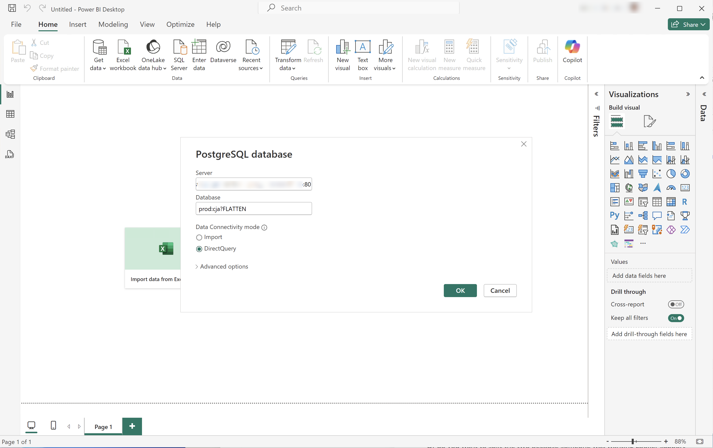

# Verbinden und validieren


In diesem Anwendungsbeispiel wird die Verbindung des BI-Tools mit Customer Journey Analytics eingerichtet, die verfügbaren Datenansichten aufgelistet und eine zu verwendende Datenansicht ausgewählt.

+++ Customer Journey Analytics

Die Anweisungen beziehen sich auf eine Beispielumgebung mit den folgenden Objekten:

* Datenansicht: **[!UICONTROL C&amp;C - Datenansicht]** 🅐.
* Dimensionen: **[!UICONTROL Produktname]** 🅑 und **[!UICONTROL Produktkategorie]** 🅒.
* Metriken: **[!UICONTROL Kaufumsatz]** 🅓 und **[!UICONTROL Käufe]** 🅔.
* Filter: **[!UICONTROL Fischereierzeugnisse]** 🅕.


Ersetzen Sie diese Beispielobjekte durch Objekte, die für Ihre spezifische Umgebung geeignet sind, wenn Sie die Anwendungsfälle durchlaufen.

+++

+++ BI-Tools

>[!BEGINTABS]

>[!TAB Power BI Desktop]

1. Greifen Sie über die Benutzeroberfläche des Abfrage-Service von Experience Platform auf die erforderlichen Anmeldeinformationen und Parameter zu.

   1. Navigieren Sie zu Ihrer Experience Platform-Sandbox.
   1. Wählen Sie  **[!UICONTROL Abfragen]** in der linken Leiste aus.
   1. Wählen Sie **[!UICONTROL Registerkarte]** Anmeldeinformationen“ in der Benutzeroberfläche **[!UICONTROL Abfragen]** aus.
   1. Wählen Sie `prod:cja` aus dem Dropdown **[!UICONTROL Menü]** Datenbank“ aus.

      

1. Starten Sie Power BI Desktop.
   1. Wählen Sie in der Hauptbenutzeroberfläche **[!UICONTROL Daten aus anderen Quellen abrufen]**.
   1. Im Dialogfeld **[!UICONTROL Daten abrufen]**:
      
      1. Suchen Sie nach (PostgreSQL **[!UICONTROL Datenbank) und wählen Sie]** aus.
      1. Wählen Sie **[!UICONTROL Verbinden]** aus.
   1. Im Dialogfeld **[!UICONTROL PostgreSQL-Datenbank]**:
      
      1. Verwenden Sie , um die Werte **[!UICONTROL Host]** und **[!UICONTROL Port]** aus dem Bedienfeld Experience Platform **&#x200B;**&#x200B;Abfrage **[!UICONTROL Ablaufende Anmeldeinformationen]** zu kopieren und einzufügen, getrennt durch `:` als Wert für **[!UICONTROL Server]**. Beispiel: `examplecompany.platform-query.adobe.io:80`.
      1. Verwenden Sie , um den **[!UICONTROL Datenbank]**-Wert aus dem Bedienfeld **[!UICONTROL Abfrage]** **[!UICONTROL Ablaufende Anmeldedaten]** von Experience Platform zu kopieren. Fügen Sie `?FLATTEN` zum eingefügten Wert hinzu. Zum Beispiel `prod:cja?FLATTEN`.
      1. Wählen Sie **[!UICONTROL DirectQuery]** als **[!UICONTROL Datenkonnektivitätsmodus]** aus.
      1. Klicken Sie **[!UICONTROL OK]**.
   1. Im Dialogfeld **[!UICONTROL PostgreSQL-Datenbank]** - **[!UICONTROL Datenbank]**:
      
      1. Verwenden Sie , um die Werte **[!UICONTROL Benutzername]** und **[!UICONTROL Kennwort]** aus dem Bedienfeld &quot;**&#x200B;** Abfrage **[!UICONTROL Ablaufende Anmeldeinformationen]** von Experience Platform in die Felder **[!UICONTROL Benutzername]** und **[!UICONTROL Kennwort]** zu kopieren. Wenn Sie eine [nicht ablaufende Berechtigung](https://experienceleague.adobe.com/en/docs/experience-platform/query/ui/credentials?lang=en#use-credential-to-connect) verwenden, verwenden Sie das Kennwort Ihrer nicht ablaufenden Berechtigung.
      1. Stellen Sie sicher, dass das Dropdown-Menü für **[!UICONTROL Wählen Sie, auf welche Ebene diese Einstellungen angewendet werden sollen]** auf den **[!UICONTROL Server]** festgelegt ist, den Sie zuvor definiert haben.
      1. Wählen Sie **[!UICONTROL Verbinden]** aus.
   1. Im **[!UICONTROL Navigator]** werden die Datenansichten abgerufen. Dieser Abruf kann einige Zeit dauern. Nach dem Abrufen sehen Sie Folgendes in Power BI Desktop.
      
      1. Wählen **[!UICONTROL public.cc_data_view]** aus der Liste im linken Bereich aus.
      1. Sie haben zwei Möglichkeiten:
         1. Wählen Sie **[!UICONTROL Laden]** aus, um fortzufahren und die Einrichtung abzuschließen.
         1. Wählen Sie **[!UICONTROL Daten transformieren]** aus. Es wird ein Dialogfeld angezeigt, in dem Sie im Rahmen der Konfiguration optional Umwandlungen anwenden können.
            
            * Wählen Sie **[!UICONTROL Schließen und anwenden]** aus.
   1. Nach einiger Zeit wird **[!UICONTROL public.cc_data_view]** im Bereich **[!UICONTROL Daten]** angezeigt. Wählen Sie  aus, um Dimensionen und Metriken anzuzeigen.
      


## REDUZIEREN

Power BI Desktop unterstützt die folgenden Szenarien für den `FLATTEN`. Weitere Informationen [&#x200B; Sie unter „Reduzieren &#x200B;](https://experienceleague.adobe.com/de/docs/experience-platform/query/key-concepts/flatten-nested-data) verschachtelten Daten“.

| FLATTEN-Parameter | Beispiel | Unterstützt | Bemerkungen |
|---|---|:---:|---|
| Keine | `prod:cja` |  | |
| `?FLATTEN` | `prod:cja?FLATTEN` |  | **Empfohlene Option zum Verwenden!** |
| `%3FFLATTEN` | `prod:cja%3FFLATTEN` |  | Power BI Desktop zeigt folgenden Fehler an: **[!UICONTROL Wir konnten uns mit den angegebenen Anmeldeinformationen nicht authentifizieren. Bitte erneut versuchen.]** |

### Weitere Informationen

* [Voraussetzungen](/help/data-views/bi-extension.md#prerequisites)
* [Handbuch zu Anmeldedaten](https://experienceleague.adobe.com/de/docs/experience-platform/query/ui/credentials)
* [Verbinden von Power BI mit dem Abfrage-Service](https://experienceleague.adobe.com/de/docs/experience-platform/query/clients/power-bi).


>[!TAB Tableau Desktop]

1. Greifen Sie über die Benutzeroberfläche des Abfrage-Service von Experience Platform auf die erforderlichen Anmeldeinformationen und Parameter zu.

   1. Navigieren Sie zu Ihrer Experience Platform-Sandbox.
   1. Wählen Sie  **[!UICONTROL Abfragen]** in der linken Leiste aus.
   1. Wählen Sie **[!UICONTROL Registerkarte]** Anmeldeinformationen“ in der Benutzeroberfläche **[!UICONTROL Abfragen]** aus.
   1. Wählen Sie `prod:cja` aus dem Dropdown **[!UICONTROL Menü]** Datenbank“ aus.

      

1. Tableau starten.
   1. Wählen Sie **[!UICONTROL PostgreSQL]** in der linken Leiste unter „An **[!UICONTROL Server]** aus. Falls nicht verfügbar, wählen Sie **[!UICONTROL Mehr…]** und wählen Sie **[!UICONTROL PostgreSQL]** aus der Liste **[!UICONTROL Installierte Connectoren]**.
      
   1. Im Dialogfeld **[!UICONTROL PostgreSQL]** auf der Registerkarte **[!UICONTROL Allgemein]**:
      
      1. Verwenden Sie , um den **[!UICONTROL Host]** aus dem Bedienfeld **[!UICONTROL Abfrage]** **[!UICONTROL Ablaufende Anmeldedaten]** von Experience Platform in den **[!UICONTROL Server]** zu kopieren.
      1. Verwenden Sie , um den **[!UICONTROL Port]** aus dem Bedienfeld **[!UICONTROL Abfrage]** **[!UICONTROL Ablaufende Anmeldedaten]** von Experience Platform in den **[!UICONTROL Port]** zu kopieren.
      1. Verwenden Sie , um den **[!UICONTROL Datenbank]** aus dem Bedienfeld **[!UICONTROL Abfrage]** **[!UICONTROL Ablaufende Anmeldedaten]** von Experience Platform in **[!UICONTROL Datenbank]** zu kopieren. Fügen Sie `%3FFLATTEN` zum eingefügten Wert hinzu. Beispiel: `prod:cja%3FFLATTEN`.
      1. Wählen Sie **[!UICONTROL Benutzername und Kennwort]** aus dem Dropdown **[!UICONTROL Menü]** Authentifizierung“ aus.
      1. Verwenden Sie , um den **[!UICONTROL Benutzernamen]** aus dem Bedienfeld **[!UICONTROL Abfrage]** **[!UICONTROL Ablaufende Anmeldedaten]** von Experience Platform in den **[!UICONTROL Benutzernamen]** zu kopieren.
      1. Verwenden Sie , um das **[!UICONTROL Kennwort]** aus dem Bedienfeld **[!UICONTROL Abfrage]** **[!UICONTROL Ablaufende Anmeldeinformationen]** von Experience Platform in **[!UICONTROL Kennwort]** zu kopieren. Wenn Sie eine [nicht ablaufende Berechtigung](https://experienceleague.adobe.com/en/docs/experience-platform/query/ui/credentials?lang=en#use-credential-to-connect) verwenden, verwenden Sie das Kennwort Ihrer nicht ablaufenden Berechtigung.
      1. Stellen Sie sicher **[!UICONTROL dass „SSL]**&quot; aktiviert ist.
      1. Wählen Sie **[!UICONTROL Anmelden]** aus.

      Während Tableau Desktop **[!UICONTROL Verbindung validiert, wird]** Dialogfeld „Anfrage läuft“ angezeigt.
   1. Im Hauptfenster sehen Sie auf der Seite **[!UICONTROL Data Source]** im linken Bereich:
      * Der Name der Verbindung, unterhalb von **[!UICONTROL Verbindungen]**.
      * Der Name der Datenbank unter **[!UICONTROL Datenbank]**.
      * Eine Liste von Tabellen unter **[!UICONTROL Tabelle]**.
        
      1. Ziehen Sie den Eintrag **[!UICONTROL cc_data_view]** und legen Sie ihn in der Hauptansicht mit dem Text **[!UICONTROL Tabellen ziehen]** ab.
   1. Das Hauptfenster zeigt Details der Datenansicht **[!UICONTROL cc_data_view]** an.
      

## REDUZIEREN

Tableau Desktop unterstützt die folgenden Szenarien für den `FLATTEN`. Weitere Informationen [&#x200B; Sie unter „Reduzieren &#x200B;](https://experienceleague.adobe.com/de/docs/experience-platform/query/key-concepts/flatten-nested-data) verschachtelten Daten“.

| FLATTEN-Parameter | Beispiel | Unterstützt | Bemerkungen |
|---|---|:---:|---|
| Keine | `prod:cja` |  | |
| `?FLATTEN` | `prod:cja?FLATTEN` |  | |
| `%3FFLATTEN` | `prod:cja%3FFLATTEN` |  | **Empfohlene Option zum Verwenden**. Hinweis: `%3FFLATTEN` ist eine URL-codierte Version von `?FLATTEN`. |

## Weitere Informationen

* [Voraussetzungen](/help/data-views/bi-extension.md#prerequisites)
* [Handbuch zu Anmeldedaten](https://experienceleague.adobe.com/de/docs/experience-platform/query/ui/credentials)
* [Verbinden von Tableau Desktop mit dem Abfrage-Service](https://experienceleague.adobe.com/de/docs/experience-platform/query/clients/tableau).


>[!TAB Looker]

1. Greifen Sie über die Benutzeroberfläche des Abfrage-Service von Experience Platform auf die erforderlichen Anmeldeinformationen und Parameter zu.

   1. Navigieren Sie zu Ihrer Experience Platform-Sandbox.
   1. Wählen Sie  **[!UICONTROL Abfragen]** in der linken Leiste aus.
   1. Wählen Sie **[!UICONTROL Registerkarte]** Anmeldeinformationen“ in der Benutzeroberfläche **[!UICONTROL Abfragen]** aus.
   1. Wählen Sie `prod:cja` aus dem Dropdown **[!UICONTROL Menü]** Datenbank“ aus.

      

1. Bei Looker anmelden

   1. Wählen Sie **[!UICONTROL Admin]** in der linken Leiste aus.
   1. Wählen Sie **[!UICONTROL Verbindungen]** aus.
   1. Wählen Sie **[!UICONTROL Datensätze hinzufügen]** aus.
   1. Im Bildschirm **[!UICONTROL Datenbank mit Looker verbinden]**.

      

      1. Geben Sie einen **[!UICONTROL Namen]** für Ihre Verbindung ein, z. B. `Example Looker Connection`.
      1. Stellen Sie sicher **[!UICONTROL dass]** Alle Projekte“ als &quot;**[!UICONTROL &quot; ausgewählt]**.
      1. Wählen Sie **[!UICONTROL PostgreSQL 9.5+]** als Dialekt aus.
      1. Verwenden Sie , um den **[!UICONTROL Host]**-Wert aus dem Bedienfeld **[!UICONTROL Abfrage]** **[!UICONTROL Ablaufende Anmeldedaten]** von Experience Platform als Wert für **[!UICONTROL Host]** zu kopieren. Beispiel: `examplecompany.platform-query.adobe.io`.
      1. Verwenden Sie , um den **[!UICONTROL Port]**-Wert aus dem Bedienfeld **[!UICONTROL Abfrage]** **[!UICONTROL Ablaufende Anmeldedaten]** von Experience Platform als Wert für **[!UICONTROL Port]** zu kopieren. Beispiel: `80`.
      1. Verwenden Sie , um den **[!UICONTROL Datenbank]**-Wert aus dem Bedienfeld **[!UICONTROL Abfrage]** **[!UICONTROL Ablaufende Anmeldedaten]** von Experience Platform als Wert für **[!UICONTROL Datenbank]** zu kopieren. Fügen Sie `%3FFLATTEN` zum eingefügten Wert hinzu. Zum Beispiel `prod:cja%3FFLATTEN`.
      1. Verwenden Sie , um den Wert **[!UICONTROL Benutzername]** aus dem Bedienfeld **[!UICONTROL Abfrage]** **[!UICONTROL Ablaufende Anmeldeinformationen]** von Experience Platform als Wert für **[!UICONTROL Benutzername]** zu kopieren.
      1. Verwenden Sie , um den **[!UICONTROL Kennwort]**-Wert aus dem Bedienfeld **[!UICONTROL Abfrage]** **[!UICONTROL Ablaufende Anmeldeinformationen]** von Experience Platform als Wert für **[!UICONTROL Kennwort]** zu kopieren.
      1. Wählen Sie **[!UICONTROL Alle erweitern]** unter **[!UICONTROL Optionale Einstellungen]** aus.
      1. Legen Sie **[!UICONTROL Max. Verbindungen]** pro Knoten auf `5` fest.
      1. Stellen Sie sicher **[!UICONTROL dass &quot;]**&quot; aktiviert ist.
      1. Wählen Sie **[!UICONTROL Test]** aus, um die Verbindung zu testen. Oben im Bildschirm sollte ein Banner mit einer Meldung wie **[!UICONTROL Erfolg, kann JDBC verbinden ….]** erscheinen.
      1. Wählen Sie **[!UICONTROL Verbinden]** aus, um die Verbindung herzustellen und zu speichern.
   1. Die neue Verbindung wird in der Benutzeroberfläche **[!UICONTROL Verbindungen]** angezeigt.
   1. Wählen Sie **←** von **[!UICONTROL Admin]** aus, um zur Hauptnavigation in der linken Leiste zu wechseln.
   1. Wählen Sie **[!UICONTROL Entwickeln]** aus.
   1. Wählen Sie **[!UICONTROL Projekte]** aus.
   1. Wählen Sie **[!UICONTROL Neues Modell]** in LookML-Projekten aus.
   1. So stellen Sie sicher, dass Sie keine Auswirkungen auf andere Benutzende haben. Wählen Sie bei Aufforderung Entwicklungsmodus aktivieren aus.
   1. Im Erlebnis **[!UICONTROL Modell erstellen]**:
      1. Wählen Sie **[!UICONTROL ➊Datenbankverbindung aus]**:
         1. Wählen Sie Ihre Datenbankverbindung unter **[!UICONTROL Datenbankverbindung auswählen]** aus. Beispiel: **[!UICONTROL example_looker_connection]**.
         1. Benennen Sie Ihr Projekt in **[!UICONTROL Neues LookML-Projekt für dieses Modell erstellen]**. Für `example: example_looker_project`.
         1. Klicken Sie auf **[!UICONTROL Weiter]**.
      1. Wählen Sie in **[!UICONTROL ➋Tabellen]**:
         1. Wählen Sie **[!UICONTROL öffentlich]** und stellen Sie sicher, dass Ihre Customer Journey Analytics-Datenansicht ausgewählt ist. Beispiel:  **[!UICONTROL cc_data_view]**.
         1. Klicken Sie auf **[!UICONTROL Weiter]**.
      1. Wählen Sie **[!UICONTROL ➌Primäre Schlüssel aus]**:
         1. Klicken Sie auf **[!UICONTROL Weiter]**.
      1. Wählen Sie in **[!UICONTROL ➍die zu erstellenden Explorer aus]**:
         1. Stellen Sie sicher, dass Sie Ihre Ansicht auswählen. Beispiel: **[!UICONTROL cc_data_view.view]**.
         1. Klicken Sie auf **[!UICONTROL Weiter]**.
      1. Geben Sie **[!UICONTROL ➎Modellnamen ein]**:
         1. Benennen Sie Ihr Modell. Beispiel: `example_looker_model`.
      1. Wählen Sie **[!UICONTROL Vervollständigen und Daten erkunden]**.

   Sie werden zur Benutzeroberfläche **[!UICONTROL Erkunden]** von Looker weitergeleitet, die bereit ist, die Daten zu untersuchen.


## REDUZIEREN

Looker unterstützt die folgenden Szenarien für den `FLATTEN`. Weitere Informationen [&#x200B; Sie unter „Reduzieren &#x200B;](https://experienceleague.adobe.com/de/docs/experience-platform/query/key-concepts/flatten-nested-data) verschachtelten Daten“.

| FLATTEN-Parameter | Beispiel | Unterstützt | Bemerkungen |
|---|---|:---:|---|
| Keine | `prod:cja` |  | |
| `?FLATTEN` | `prod:cja?FLATTEN` |  | |
| `%3FFLATTEN` | `prod:cja%3FFLATTEN` |  | **Empfohlene Option zum Verwenden**. Hinweis: `%3FFLATTEN` ist eine URL-codierte Version von `?FLATTEN`. |

## Weitere Informationen

* [Voraussetzungen](/help/data-views/bi-extension.md#prerequisites)
* [Handbuch zu Anmeldedaten](https://experienceleague.adobe.com/de/docs/experience-platform/query/ui/credentials)


>[!TAB Jupyter-Notebook]

1. Greifen Sie über die Benutzeroberfläche des Abfrage-Service von Experience Platform auf die erforderlichen Anmeldeinformationen und Parameter zu.

   1. Navigieren Sie zu Ihrer Experience Platform-Sandbox.
   1. Wählen Sie  **[!UICONTROL Abfragen]** in der linken Leiste aus.
   1. Wählen Sie **[!UICONTROL Registerkarte]** Anmeldeinformationen“ in der Benutzeroberfläche **[!UICONTROL Abfragen]** aus.
   1. Wählen Sie `prod:cja` aus dem Dropdown **[!UICONTROL Menü]** Datenbank“ aus.

      

1. Stellen Sie sicher, dass Sie eine dedizierte virtuelle Python-Umgebung für die Ausführung Ihrer Jupyter-Notebook-Umgebung eingerichtet haben.
1. Stellen Sie sicher, dass Sie die erforderlichen Bibliotheken in Ihrer virtuellen Umgebung installiert haben:
   * ipython-sql: `pip install ipython-sql`.
   * psycopg2-binary: `pip install psycopg-binary`.
   * In: SQLAlchemy: PIP `install sqlalchemy`.

1. Starten Sie Jupyter Notebook aus Ihrer virtuellen Umgebung: `jupyter notebook`.
1. Erstellen Sie ein neues Notebook oder laden Sie [dieses Beispielnotebook) &#x200B;](../assets/BI-Extension.ipynb.zip).
1. Geben Sie in Ihrer ersten Zelle ein und führen Sie Folgendes aus:

   ```
   %config SqlMagic.style = '_DEPRECATED_DEFAULT'
   ```

1. Geben Sie in einer neuen Zelle die Konfigurationsparameter für Ihre Verbindung ein. Verwenden Sie , um Werte aus dem Bedienfeld **[!UICONTROL Abfrage]** **[!UICONTROL Ablaufende Anmeldeinformationen]** von Experience Platform in die für die Konfigurationsparameter erforderlichen Werte zu kopieren und einzufügen. Zum Beispiel:

   ```
   import ipywidgets as widgets
   from IPython.display import display
   
   config_host = widgets.Text(description='Host:', value='example.platform-query-stage.adobe.io',
                           layout=widgets.Layout(width="600px"))
   display(config_host)
   config_port = widgets.IntText(description='Port:', value=80,
                              layout=widgets.Layout(width="200px"))
   display(config_port)
   config_db = widgets.Text(description='Database:', value='prod:cja',
                         layout=widgets.Layout(width="300px"))
   display(config_db)
   config_username = widgets.Text(description='Username:', value='EC582F955C8A79F70A49420E@AdobeOrg',
                               layout=widgets.Layout(width="600px"))
   display(config_username)
   config_password = widgets.Password(description='Password:', value='***',
                                   layout=widgets.Layout(width="600px"))
   display(config_password)
   ```

1. Ausführen der Zelle.
1. Verwenden Sie , um das Kennwort aus dem Bedienfeld **[!UICONTROL Abfrage]** **[!UICONTROL Ablaufende Anmeldeinformationen]** von Experience Platform in das Feld **[!UICONTROL Kennwort]** in Jupyter Notebook zu kopieren.

   

1. Geben Sie in einer neuen Zelle die Anweisungen zum Laden der SQL-Erweiterung, der erforderlichen Bibliothek und der Verbindung mit Customer Journey Analytics ein.

   ```python
   %load_ext sql
   from sqlalchemy import create_engine
   %sql postgresql://{config_username.value}:{config_password.value}@{config_host.value}:{config_port.value}/{config_db.value}?sslmode=require
   ```

   Ausführen der Shell. Es sollte keine Ausgabe angezeigt werden, die Zelle sollte jedoch ohne Warnung ausgeführt werden.

   

1. Geben Sie bei einem neuen Aufruf die -Anweisungen ein, um eine Liste der verfügbaren Datenansichten basierend auf der Verbindung zu erhalten.

   ```python
   %%sql
   SELECT n.nspname as "Schema",
      c.relname as "Name",
      CASE c.relkind WHEN 'r' THEN 'table' WHEN 'v' THEN 'view' WHEN 'm' THEN 'materialized view' WHEN 'i' THEN 'index' WHEN 'S' THEN 'sequence' WHEN 's' THEN 'special' WHEN 't' THEN 'TOAST table' WHEN 'f' THEN 'foreign table' WHEN 'p' THEN 'partitioned table' WHEN 'I' THEN 'partitioned index' END as "Type",
      pg_catalog.pg_get_userbyid(c.relowner) as "Owner"
   FROM pg_catalog.pg_class c
   LEFT JOIN pg_catalog.pg_namespace n ON n.oid = c.relnamespace
   WHERE c.relkind IN ('v','')
      AND n.nspname <> 'pg_catalog'
      AND n.nspname !~ '^pg_toast'
      AND n.nspname <> 'information_schema'
      AND pg_catalog.pg_table_is_visible(c.oid)
      AND c.relname NOT LIKE '%test%'
      AND c.relname NOT LIKE '%ajo%'
   ORDER BY 1,2;
   ```

   Ausführen der Shell. Die Ausgabe sollte ähnlich wie im folgenden Screenshot aussehen.

   

   Die **[!UICONTROL cc_data_view]** sollte in der Liste der Datenansichten angezeigt werden.

## REDUZIEREN

Jupyter Notebook unterstützt die folgenden Szenarien für den `FLATTEN`. Weitere Informationen [&#x200B; Sie unter „Reduzieren &#x200B;](https://experienceleague.adobe.com/de/docs/experience-platform/query/key-concepts/flatten-nested-data) verschachtelten Daten“.

| FLATTEN-Parameter | Beispiel | Unterstützt | Bemerkungen |
|---|---|:---:|---|
| Keine | `prod:cja` |  | |
| `?FLATTEN` | `prod:cja?FLATTEN` |  | |
| `%3FFLATTEN` | `prod:cja%3FFLATTEN` |  | **Empfohlene Option zum Verwenden**. Hinweis: `%3FFLATTEN` ist eine URL-codierte Version von `?FLATTEN`. |

## Weitere Informationen

* [Voraussetzungen](/help/data-views/bi-extension.md#prerequisites)
* [Handbuch zu Anmeldedaten](https://experienceleague.adobe.com/de/docs/experience-platform/query/ui/credentials)

>[!TAB RStudio]

1. Greifen Sie über die Benutzeroberfläche des Abfrage-Service von Experience Platform auf die erforderlichen Anmeldeinformationen und Parameter zu.

   1. Navigieren Sie zu Ihrer Experience Platform-Sandbox.
   1. Wählen Sie  **[!UICONTROL Abfragen]** in der linken Leiste aus.
   1. Wählen Sie **[!UICONTROL Registerkarte]** Anmeldeinformationen“ in der Benutzeroberfläche **[!UICONTROL Abfragen]** aus.
   1. Wählen Sie `prod:cja` aus dem Dropdown **[!UICONTROL Menü]** Datenbank“ aus.

      

1. Starten Sie RStudio.
1. Erstellen Sie eine neue Markdown-Datei für R oder laden Sie [diese Beispiel-Markdown-Datei für R &#x200B;](../assets/BI-Extension.Rmd.zip).
1. Geben Sie in Ihrem ersten Chunk die folgenden Anweisungen zwischen ` ` ``{r} ` und ` `` ` ` ein. Verwenden Sie , um Werte aus dem Bedienfeld **[!UICONTROL Abfrage]** **[!UICONTROL Ablaufende Anmeldeinformationen]** von Experience Platform in die Werte zu kopieren, die für die verschiedenen Parameter erforderlich sind, z. B. `host`, `dbname` und `user`. Zum Beispiel:

   ```R
   library(rstudioapi)
   library(DBI)
   library(dplyr)
   library(tidyr)
   library(RPostgres)
   library(ggplot2)
   
   host <- rstudioapi::showPrompt(title = "Host", message = "Host", default = "orangestagingco.platform-query-stage.adobe.io")
   dbname <- rstudioapi::showPrompt(title = "Database", message = "Database", default = "prod:cja?FLATTEN")
   user <- rstudioapi::showPrompt(title = "Username", message = "Username", default = "EC582F955C8A79F70A49420E@AdobeOrg")
   password <- rstudioapi::askForPassword(prompt = "Password")
   ```

1. Führt den Block aus. Sie werden nach **[!UICONTROL Host]**, **[!UICONTROL Database]** und **[!UICONTROL User]** gefragt. Akzeptieren Sie einfach die Werte, die Sie im vorherigen Schritt angegeben haben.
1. Verwenden Sie , um das Kennwort aus dem Bedienfeld **[!UICONTROL Abfrage]** **[!UICONTROL Ablaufende Anmeldeinformationen]** von Experience Platform in die Dialogaufforderung **[!UICONTROL Kennwort]** in RStudio zu kopieren.

   

1. Erstellen Sie einen neuen Chunk und geben Sie die folgenden Anweisungen zwischen ` ` `` {r} ` und ` `` ` ` ein.

   ```R
   con <- dbConnect(
      RPostgres::Postgres(),
      host = host,
      port = 80,
      dbname = dbname,
      user = user,
      password = password,
      sslmode = 'require'
   )
   ```

1. Führt den Block aus. Wenn die Verbindung erfolgreich hergestellt wurde, sollte keine Ausgabe angezeigt werden.


1. Erstellen Sie einen neuen Chunk und geben Sie die folgenden Anweisungen zwischen ` ` `` {r} ` und ` `` ` ` ein.

   ```R
   views <- dbListTables(con)
   print(views)
   ```

1. Führt den Block aus. Sie sollten `character(0)` als einzige Ausgabe sehen.


1. Erstellen Sie einen neuen Chunk und geben Sie die folgenden Anweisungen zwischen ` ` `` {r} ` und ` `` ` ` ein.

   ```R
   glimpse(dv)
   ```

1. Führt den Block aus. Die Ausgabe sollte ähnlich wie im folgenden Screenshot aussehen.

   

## REDUZIEREN

RStudio unterstützt die folgenden Szenarien für den `FLATTEN`. Weitere Informationen [&#x200B; Sie unter „Reduzieren &#x200B;](https://experienceleague.adobe.com/de/docs/experience-platform/query/key-concepts/flatten-nested-data) verschachtelten Daten“.

| FLATTEN-Parameter | Beispiel | Unterstützt | Bemerkungen |
|---|---|:---:|---|
| Keine | `prod:cja` |  | |
| `?FLATTEN` | `prod:cja?FLATTEN` |  | **Empfohlene Option zum Verwenden**. |
| `%3FFLATTEN` | `prod:cja%3FFLATTEN` |  | |

## Weitere Informationen

* [Voraussetzungen](/help/data-views/bi-extension.md#prerequisites)
* [Handbuch zu Anmeldedaten](https://experienceleague.adobe.com/de/docs/experience-platform/query/ui/credentials)

>[!ENDTABS]

+++
